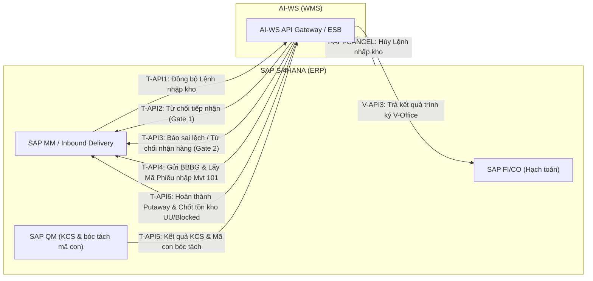
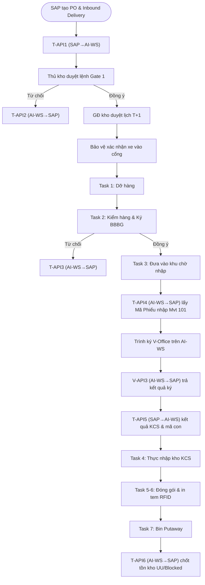

# Danh Sách API Tích Hợp SAP S/4HANA ↔ AI-WS — Quy Trình Nhập Kho Mua Hàng Từ NCC (MM.10A)

## Thông Tin Tài Liệu

| Thông tin | Chi tiết |
|---|---|
| **Mã tài liệu** | `BM04-AIWS-MM10A-API-01` |
| **Quy trình** | MM.10A — Nhập kho mua hàng từ Nhà cung cấp (PO / Inbound Delivery) |
| **Hệ thống tham gia** | SAP S/4HANA (ERP) × AI-WS (WMS) × V-Office (E-Office — ngoài phạm vi SAP↔AI-WS) |
| **Trạng thái** | Draft |
| **Người lập** | BA Team |
| **Ngày khởi tạo** | 12/08/2026 |
| **Nguồn tham chiếu** | `SRS_MM.10A_QuyTrinh_Va_ManHinh_Task_NhapKho_NCC_v1.0.0.md` · `SRS_MM.10A_ChucNang_DongBo_ThongTin_NCC_v1.0.0.md` · `knowledge/processes/AIWS_SAP_MM.10A_quy_trinh_nhap_kho_mua_hang_NCC.md` |

---

## 1. Tổng Quan

Quy trình MM.10A có tổng cộng **8 đầu API tích hợp trực tiếp giữa SAP S/4HANA và AI-WS** (các đầu V-API1 / V-API2 giữa AI-WS và V-Office nằm ngoài phạm vi này). Trong đó:

- **SAP ➔ AI-WS (3 API):** T-API1, T-API-CANCEL, T-API5.
- **AI-WS ➔ SAP (5 API):** T-API2, T-API3, T-API4, V-API3, T-API6.

---

## 2. Danh Sách Chi Tiết API Tích Hợp SAP ↔ AI-WS

### 2.1. T-API1 — Đồng bộ Lệnh nhập kho từ SAP về AI-WS

| Mục | Chi tiết |
|---|---|
| **Hướng giao tiếp** | SAP S/4HANA ➔ AI-WS (Inbound REST API) |
| **Phương thức** | `POST` |
| **Endpoint AI-WS** | `/api/v1/inbound/orders/sync` |
| **Thời điểm phát động** | Bước 1: SAP tạo Inbound Delivery (VL31N) từ PO |
| **Kiểu xử lý** | Bất đồng bộ (Asynchronous Event Driven) |
| **Nghiệp vụ** | Đồng bộ thông tin Lệnh nhập kho (mã NCC, danh mục vật tư cha/con, số lượng, lô/Serial). AI-WS khởi tạo Lệnh nhập `INB-2026-xxxxx` trạng thái `Chờ duyệt` + sinh chuỗi 7 Task ở trạng thái `NEW`. |

### 2.2. T-API-CANCEL — Đồng bộ Hủy Lệnh nhập kho từ SAP về AI-WS

| Mục | Chi tiết |
|---|---|
| **Hướng giao tiếp** | SAP S/4HANA ➔ AI-WS (Inbound REST API) |
| **Phương thức** | `POST` |
| **Endpoint AI-WS** | `/api/v1/inbound/orders/cancel` |
| **Thời điểm phát động** | Mọi thời điểm: SAP hủy chứng từ Inbound Delivery / PO |
| **Kiểu xử lý** | Bất đồng bộ (Asynchronous) |
| **Nghiệp vụ** | AI-WS chuyển Lệnh nhập sang trạng thái `Hủy` (`CANCELLED`) và hủy toàn bộ Task chưa hoàn thành. |

### 2.3. T-API2 — Báo từ chối tiếp nhận Lệnh nhập kho sang SAP (Gate 1 Rejection)

| Mục | Chi tiết |
|---|---|
| **Hướng giao tiếp** | AI-WS ➔ SAP S/4HANA (Outbound REST API) |
| **Phương thức** | `POST` |
| **Endpoint SAP** | `/sap/bc/rest/wms/inbound/reject` |
| **Thời điểm phát động** | Bước 2 (Luồng từ chối 1): Thủ kho bấm [Từ chối lệnh] |
| **Kiểu xử lý** | Đồng bộ (Synchronous HTTP Call) |
| **Nghiệp vụ** | Truyền lý do từ chối sang SAP để chuyển trạng thái chứng từ thành `Rejected by Whs`. Hủy Lệnh nhập & các Task trên AI-WS. |

### 2.4. T-API3 — Báo cáo sai lệch kiểm đếm / Từ chối nhận hàng sang SAP (Gate 2 Rejection)

| Mục | Chi tiết |
|---|---|
| **Hướng giao tiếp** | AI-WS ➔ SAP S/4HANA (Outbound REST API) |
| **Phương thức** | `POST` |
| **Endpoint SAP** | `/sap/bc/rest/wms/inbound/inspection-discrepancy` |
| **Thời điểm phát động** | Bước 6 (Luồng từ chối 2): NV kiểm hàng bấm [Từ chối nhận hàng] (Task 2 `[T-Ho]`) |
| **Kiểu xử lý** | Đồng bộ (Synchronous HTTP Call) |
| **Nghiệp vụ** | Truyền số lượng sai lệch (thiếu/thừa/móp hỏng) kèm lý do chi tiết sang SAP để khởi tạo quy trình khiếu nại NCC; chuyển Lệnh nhập sang `Từ chối`. |

### 2.5. T-API4 — Đồng bộ BBBG điện tử & Khởi tạo Phiếu nhập kho Mvt 101

| Mục | Chi tiết |
|---|---|
| **Hướng giao tiếp** | AI-WS ➔ SAP S/4HANA (Outbound REST API) |
| **Phương thức** | `POST` |
| **Endpoint SAP** | `/sap/bc/rest/wms/inbound/goods-receipt` |
| **Thời điểm phát động** | Sau khi ký đủ 2 chữ ký BBBG (Bước 9): Hoàn thành Task 2 `[T-Ho]` / Task 3 `[T-Mv1]` |
| **Kiểu xử lý** | Đồng bộ (Synchronous HTTP Call) |
| **Nghiệp vụ** | Gửi BBBG đã ký (chữ ký số CA + chữ ký cảm ứng) & số lượng thực nhận. SAP tự động khởi tạo Phiếu nhập kho (Material Document Mvt 101), hạch toán `Nợ 152/156, Có 3388` và trả Mã phiếu nhập về AI-WS. |

### 2.6. V-API3 — Đồng bộ kết quả trình ký V-Office từ AI-WS về SAP

| Mục | Chi tiết |
|---|---|
| **Hướng giao tiếp** | AI-WS ➔ SAP S/4HANA (Outbound REST API) |
| **Phương thức** | `POST` |
| **Endpoint SAP** | `/sap/bc/rest/wms/inbound/voffice-status` |
| **Thời điểm phát động** | Bước 11b: Tự động phát ngay sau khi AI-WS nhận Webhook `V-API2` (kết quả trình ký V-Office) |
| **Kiểu xử lý** | Đồng bộ / Queue Worker |
| **Nghiệp vụ** | Truyền trả trạng thái trình ký (Mã văn bản V-Office, ngày ký, người ký, trạng thái `APPROVED`/`REJECTED`) về SAP để chốt trạng thái chứng từ kế toán. |

### 2.7. T-API5 — Đồng bộ kết quả KCS & Mã hàng hóa con bóc tách về AI-WS

| Mục | Chi tiết |
|---|---|
| **Hướng giao tiếp** | SAP S/4HANA ➔ AI-WS (Inbound REST API) |
| **Phương thức** | `POST` |
| **Endpoint AI-WS** | `/api/v1/inbound/kcs-result/sync` |
| **Thời điểm phát động** | Bước 12: SAP hoàn tất KCS & bóc tách Mã Cha ➔ Mã Con |
| **Kiểu xử lý** | Bất đồng bộ (Asynchronous Event Driven) |
| **Nghiệp vụ** | Lưu kết quả KCS (Số lượng Đạt/Không đạt) và danh sách mã SKU con bóc tách. Chuyển Task 4 `[T-AGR]` từ `NEW` ➔ `UNASSIGNED`. |

### 2.8. T-API6 — Báo hoàn thành Putaway & Chốt tồn kho UU/Blocked sang SAP

| Mục | Chi tiết |
|---|---|
| **Hướng giao tiếp** | AI-WS ➔ SAP S/4HANA (Outbound REST API) |
| **Phương thức** | `POST` |
| **Endpoint SAP** | `/sap/bc/rest/wms/inbound/putaway-complete` |
| **Thời điểm phát động** | Bước 17: Hoàn thành Task 7 `[T-Mv3]` — Bin Putaway |
| **Kiểu xử lý** | Đồng bộ (Synchronous HTTP Call) |
| **Nghiệp vụ** | Chốt hoàn thành Lệnh nhập (`COMPLETED`), đồng bộ tồn kho chính thức theo ô kệ Bin: hàng đạt KCS → `Unrestricted Use (UU)`, hàng lỗi → `Blocked Stock`. |

---

## 3. Bảng Tổng Hợp 8 API SAP ↔ AI-WS

| STT | Mã API | Tên giao diện | Hướng | Phương thức | Endpoint (Hệ thống nhận) | Thời điểm phát động |
|---|---|---|---|---|---|---|
| 1 | `T-API1` | Đồng bộ Lệnh nhập kho (Inbound Delivery Sync) | SAP ➔ AI-WS | `POST` | `/api/v1/inbound/orders/sync` (AI-WS) | Bước 1: SAP tạo Inbound Delivery VL31N |
| 2 | `T-API-CANCEL` | Hủy Lệnh nhập kho từ SAP | SAP ➔ AI-WS | `POST` | `/api/v1/inbound/orders/cancel` (AI-WS) | Mọi thời điểm: SAP hủy chứng từ ERP |
| 3 | `T-API2` | Từ chối tiếp nhận Lệnh nhập (Gate 1) | AI-WS ➔ SAP | `POST` | `/sap/bc/rest/wms/inbound/reject` (SAP) | Bước 2: Thủ kho bấm [Từ chối lệnh] |
| 4 | `T-API3` | Báo sai lệch kiểm đếm / Từ chối nhận hàng (Gate 2) | AI-WS ➔ SAP | `POST` | `/sap/bc/rest/wms/inbound/inspection-discrepancy` (SAP) | Bước 6: NV kiểm hàng bấm [Từ chối nhận hàng] |
| 5 | `T-API4` | Đồng bộ BBBG & Tạo Phiếu nhập Mvt 101 (GR Document) | AI-WS ➔ SAP | `POST` | `/sap/bc/rest/wms/inbound/goods-receipt` (SAP) | Bước 9: Sau khi ký đủ BBBG 2 bên |
| 6 | `V-API3` | Đồng bộ kết quả trình ký V-Office về SAP | AI-WS ➔ SAP | `POST` | `/sap/bc/rest/wms/inbound/voffice-status` (SAP) | Bước 11b: Ngay sau khi nhận V-API2 |
| 7 | `T-API5` | Đồng bộ Kết quả KCS & Mã con bóc tách | SAP ➔ AI-WS | `POST` | `/api/v1/inbound/kcs-result/sync` (AI-WS) | Bước 12: SAP hoàn tất KCS & bóc tách mã con |
| 8 | `T-API6` | Hoàn thành Putaway & Chốt tồn kho UU/Blocked | AI-WS ➔ SAP | `POST` | `/sap/bc/rest/wms/inbound/putaway-complete` (SAP) | Bước 17: Hoàn thành Task 7 Bin Putaway |

---

## 4. Bản Đồ Vị Trí API Trong Quy Trình End-to-End

---

## 5. Ghi Chú

1. **T-API-CANCEL** có thể phát động ở **mọi trạng thái** Lệnh nhập (`Chờ duyệt` / `Đang xử lý`) để hủy lệnh.
2. Các API **AI-WS ➔ SAP** (T-API2, T-API3, T-API4, V-API3, T-API6) là **Outbound REST** gọi tới SAP; các API **SAP ➔ AI-WS** (T-API1, T-API-CANCEL, T-API5) là **Inbound REST/Webhook** AI-WS phải expose.
3. Các đầu **V-API1** (AI-WS ➔ V-Office) và **V-API2** (V-Office ➔ AI-WS) thuộc tích hợp **AI-WS × V-Office**, không nằm trong phạm vi SAP ↔ AI-WS, nên không liệt kê ở trên.
4. Chi tiết Payload JSON, quy tắc xử lý lỗi, retry policy tham chiếu tại `SRS_MM.10A_ChucNang_DongBo_ThongTin_NCC_v1.0.0.md` (Phần 2.3 — đang chờ BA/DE bổ sung).
