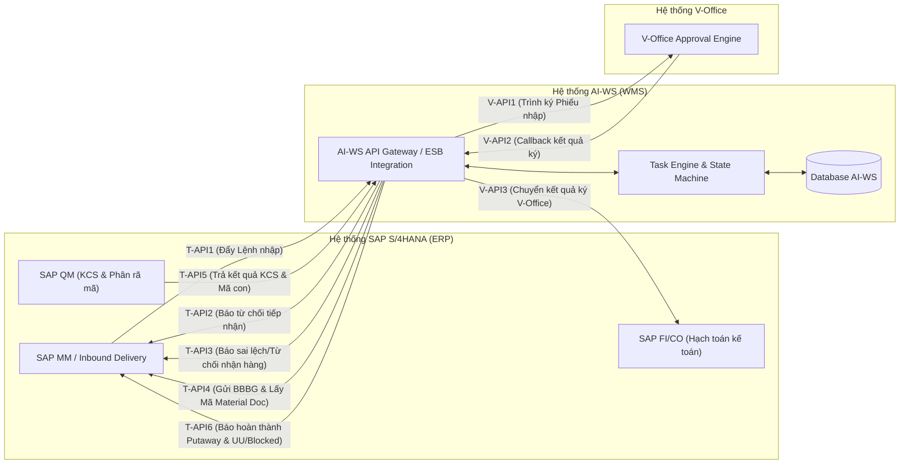

# TÀI LIỆU THIẾT KẾ CHI TIẾT (TKCT) — BM.04
## Chức Năng Đồng Bộ Thông Tin — Phân hệ Nhập Kho Mua Hàng Từ NCC (Quy trình MM.10A)

---

## MỤC LỤC

- [THÔNG TIN TÀI LIỆU](#thông-tin-tài-liệu)
  - [Lịch sử sửa đổi](#lịch-sử-sửa-đổi)
- [PHẦN 1. GIỚI THIỆU](#phần-1-giới-thiệu)
  - [1.1. Mục đích](#11-mục-đích)
  - [1.2. Phạm vi](#12-phạm-vi)
  - [1.3. Thuật ngữ & Viết tắt](#13-thuật-ngữ--viết-tắt)
  - [1.4. Tài liệu tham khảo](#14-tài-liệu-tham-khảo)
- [PHẦN 2. TỔNG QUAN KIẾN TRÚC TÍCH HỢP & ĐỒNG BỘ](#phần-2-tổng-quan-kiến-trúc-tích-hợp--đồng-bộ)
  - [2.1. Sơ đồ kiến trúc tích hợp hệ thống (SAP S/4HANA × AI-WS × V-Office)](#21-sơ-đồ-kiến-trúc-tích-hợp-hệ-thống-sap-s4hana--ai-ws--v-office)
  - [2.2. Bản đồ tổng quan các điểm đồng bộ (Integration Map MM.10A)](#22-bản-đồ-tổng-quan-các-điểm-đồng-bộ-integration-map-mm10a)
  - [2.3. Quy tắc kỹ thuật dùng chung (Security, Authentication, Logging & Retry)](#23-quy-tắc-kỹ-thuật-dùng-chung-security-authentication-logging--retry)
- [PHẦN 3. THIẾT KẾ CHI TIẾT CÁC CHỨC NĂNG ĐỒNG BỘ THÔNG TIN](#phần-3-thiết-kế-chi-tiết-các-chức-năng-đồng-bộ-thông-tin)
  - [3.1. Nhóm 1: Đồng bộ Lệnh & Trạng thái Tiếp nhận (SAP ⇄ AI-WS)](#31-nhóm-1-đồng-bộ-lệnh--trạng-thái-tiếp-nhận-sap--ai-ws)
    - [3.1.1. [T-API1] Đồng bộ Lệnh nhập kho từ SAP về AI-WS (Inbound Delivery Sync)](#311-t-api1-đồng-bộ-lệnh-nhập-kho-từ-sap-về-ai-ws-inbound-delivery-sync)
    - [3.1.2. [T-API2] Đồng bộ Từ chối duyệt tiếp nhận Lệnh nhập kho sang SAP (Rejection Gate 1 Sync)](#312-t-api2-đồng-bộ-từ-chối-duyệt-tiếp-nhận-lệnh-nhập-kho-sang-sap-rejection-gate-1-sync)
    - [3.1.3. [T-API-CANCEL] Đồng bộ Hủy Lệnh nhập kho từ SAP về AI-WS (SAP Cancellation Sync)](#313-t-api-cancel-đồng-bộ-hủy-lệnh-nhập-kho-từ-sap-về-ai-ws-sap-cancellation-sync)
  - [3.2. Nhóm 2: Đồng bộ Kiểm hàng, BBBG & Tạo Phiếu nhập kho (AI-WS ➔ SAP)](#32-nhóm-2-đồng-bộ-kiểm-hàng-bbbg--tạo-phiếu-nhập-kho-ai-ws--sap)
    - [3.2.1. [T-API3] Đồng bộ Báo cáo sai lệch / Từ chối nhận hàng sang SAP (Rejection Gate 2 Sync)](#321-t-api3-đồng-bộ-báo-cáo-sai-lệch--từ-chối-nhận-hàng-sang-sap-rejection-gate-2-sync)
    - [3.2.2. [T-API4] Đồng bộ BBBG Điện tử & Khởi tạo Phiếu nhập kho Mvt 101 trên SAP (GR Document Creation Sync)](#322-t-api4-đồng-bộ-bbbg-điện-tử--khởi-tạo-phiếu-nhập-kho-mvt-101-trên-sap-gr-document-creation-sync)
  - [3.3. Nhóm 3: Đồng bộ Trình ký Điện tử V-Office (AI-WS ⇄ V-Office ➔ SAP)](#33-nhóm-3-đồng-bộ-trình-ký-điện-tử-v-office-ai-ws--v-office--sap)
    - [3.3.1. [V-API1] Khởi tạo hồ sơ Trình ký Phiếu nhập kho từ AI-WS sang V-Office (Send Document to V-Office)](#331-v-api1-khởi-tạo-hồ-sơ-trình-ký-phiếu-nhập-kho-từ-ai-ws-sang-v-office-send-document-to-v-office)
    - [3.3.2. [V-API2] Nhận Callback kết quả phê duyệt từ V-Office về AI-WS (V-Office Approval Callback)](#332-v-api2-nhận-callback-kết-quả-phê-duyệt-từ-v-office-về-ai-ws-v-office-approval-callback)
    - [3.3.3. [V-API3] Đồng bộ Kết quả phê duyệt V-Office từ AI-WS về SAP S/4HANA (Sync V-Office Status to SAP)](#333-v-api3-đồng-bộ-kết-quả-phê-duyệt-v-office-từ-ai-ws-về-sap-s4hana-sync-v-office-status-to-sap)
  - [3.4. Nhóm 4: Đồng bộ Kết quả KCS & Đóng gói, Lưu kho (SAP ⇄ AI-WS)](#34-nhóm-4-đồng-bộ-kết-quả-kcs--đóng-gói-lưu-kho-sap--ai-ws)
    - [3.4.1. [T-API5] Đồng bộ Kết quả KCS & Mã hàng hóa Con bóc tách từ SAP về AI-WS (KCS & Sub-SKU Decomposition Sync)](#341-t-api5-đồng-bộ-kết-quả-kcs--mã-hàng-hóa-con-bóc-tách-từ-sap-về-ai-ws-kcs--sub-sku-decomposition-sync)
    - [3.4.2. [T-API6] Đồng bộ Hoàn thành cất hàng lưu trữ & Chốt tồn kho chính thức UU/Blocked sang SAP (Final Putaway & Stock Posting Sync)](#342-t-api6-đồng-bộ-hoàn-thành-cất-hàng-lưu-trữ--chốt-tồn-kho-chính-thức-uublocked-sang-sap-final-putaway--stock-posting-sync)
- [PHẦN 4. QUY TRÌNH XỬ LÝ SỰ CỐ & GIÁM SÁT TÍCH HỢP (INTEGRATION MONITORING & ERROR HANDLING)](#phần-4-quy-trình-xử-lý-sự-cố--giám-sát-tích-hợp-integration-monitoring--error-handling)
  - [4.1. Màn hình Dashboard Giám sát Giao tiếp API (API Integration Dashboard)](#41-màn-hình-dashboard-giám-sát-giao-tiếp-api-api-integration-dashboard)
  - [4.2. Cơ chế Retry tự động và Retry thủ công (Auto Retry & Manual Retry)](#42-cơ-chế-retry-tự-động-và-retry-thủ-công-auto-retry--manual-retry)
  - [4.3. Cảnh báo thời gian thực khi lỗi đồng bộ (Real-time Alerting System)](#43-cảnh-báo-thời-gian-thực-khi-lỗi-đồng-bộ-real-time-alerting-system)
- [PHẦN 5. PHỤ LỤC](#phần-5-phụ-lục)
  - [5.1. Danh mục Mã Lỗi Tích hợp (Integration Error Codes)](#51-danh-mục-mã-lỗi-tích-hợp-integration-error-codes)
  - [5.2. Danh sách Endpoint API](#52-danh-sách-endpoint-api)

---

## THÔNG TIN TÀI LIỆU

| Thông tin | Chi tiết |
|---|---|
| **Tên tài liệu** | Thiết kế chi tiết (TKCT) — Các Chức Năng Đồng Bộ Thông Tin (MM.10A) |
| **Mã tài liệu** | `BM04-AIWS-MM10A-SYNC-01` |
| **Hệ thống** | AI-WS (WMS Platform) × SAP S/4HANA (ERP) × V-Office (E-Office) |
| **Phiên bản** | `v1.0` |
| **Trạng thái** | Draft |
| **Người lập** | BA Team / AIWS Product Owner |
| **Ngày khởi tạo** | 08/08/2026 |

### Lịch sử sửa đổi

| Version | Ngày | Tác giả | Mô tả thay đổi |
|---|---|---|---|
| `v1.0` | 08/08/2026 | BA Team | Khởi tạo khung tài liệu SRS Thiết kế Chức năng Đồng bộ Thông tin cho quy trình MM.10A |

---

## PHẦN 1. GIỚI THIỆU

### 1.1. Mục đích
Tài liệu này chi tiết hóa toàn bộ các chức năng đồng bộ dữ liệu và tích hợp giao tiếp API giữa hệ thống Kho Thông Minh **AI-WS**, hệ thống ERP **SAP S/4HANA** và hệ thống trình ký điện tử **V-Office** cho quy trình Nhập Kho Mua Hàng Từ Nhà Cung Cấp (Mã quy trình `MM.10A`).

### 1.2. Phạm vi
Phạm vi bao gồm tất cả các giao diện tích hợp chiều vào (Inbound) và chiều ra (Outbound) liên quan đến Lệnh nhập kho mua hàng từ NCC, bao gồm đồng bộ đơn hàng, trạng thái từ chối, BBBG, trình ký V-Office, kết quả KCS bóc tách mã con và chốt tồn kho hạch toán.

### 1.3. Thuật ngữ & Viết tắt
| Từ viết tắt | Thuật ngữ đầy đủ | Ghi chú |
|---|---|---|
| `AI-WS` | Artificial Intelligence Warehouse System | Hệ thống phần mềm Quản lý Kho Thông Minh |
| `SAP` | SAP S/4HANA | Hệ thống Quản trị Nguồn lực Doanh nghiệp (ERP) |
| `V-Office` | Viettel Office / V-Office System | Hệ thống Văn phòng Điện tử / Trình ký Điện tử |
| `PO` | Purchase Order | Đơn mua hàng từ NCC trên SAP |
| `Inbound Delivery` | Inbound Delivery Document | Yêu cầu nhập kho / Chứng từ giao hàng từ SAP |
| `Mvt 101` | Movement Type 101 | Mã loại di chuyển nhập kho mua hàng trên SAP |
| `KCS` | Kiểm tra chất lượng sản phẩm | Quy trình giám định kỹ thuật / KCS chất lượng |

### 1.4. Tài liệu tham khảo
1. Quy trình nghiệp vụ: `AIWS_SAP_MM.10A_quy_trinh_nhap_kho_mua_hang_NCC.md`
2. SRS Quy trình & Màn hình Task Nhập kho: `SRS_MM.10A_QuyTrinh_Va_ManHinh_Task_NhapKho_NCC_v1.0.md`

---

## PHẦN 2. TỔNG QUAN KIẾN TRÚC TÍCH HỢP & ĐỒNG BỘ

### 2.1. Sơ đồ kiến trúc tích hợp hệ thống (SAP S/4HANA × AI-WS × V-Office)

### 2.2. Bản đồ tổng quan các điểm đồng bộ (Integration Map MM.10A)

| Mã Sync | Mã API | Tên Điểm Đồng Bộ | Hướng Giao Tiếp | Trigger / Thời Điểm Phát Động |
|---|---|---|---|---|
| `SYNC-01` | `T-API1` | Đồng bộ Lệnh nhập kho từ SAP về AI-WS | SAP ➔ AI-WS | SAP tạo Inbound Delivery (VL31N) |
| `SYNC-02` | `T-API2` | Báo từ chối duyệt tiếp nhận Lệnh nhập | AI-WS ➔ SAP | Thủ kho từ chối lệnh ở Bước 2 (Gate 1) |
| `SYNC-03` | `T-API-CANCEL` | Đồng bộ Hủy Lệnh nhập từ SAP về AI-WS | SAP ➔ AI-WS | SAP phát bản tin hủy chứng từ ERP |
| `SYNC-04` | `T-API3` | Báo sai lệch kiểm đếm / Từ chối nhận hàng | AI-WS ➔ SAP | NV kiểm hàng bấm từ chối ở Bước 5 (Gate 2) |
| `SYNC-05` | `T-API4` | Đồng bộ BBBG Điện tử & Lấy Mã Phiếu nhập Mvt 101 | AI-WS ➔ SAP | Hoàn thành Task 3 (Đưa vào khu chờ nhập) |
| `SYNC-06` | `V-API1` | Trình ký V-Office Phiếu nhập kho từ AI-WS | AI-WS ➔ V-Office | Thủ kho kích hoạt trình ký ở Bước 8 |
| `SYNC-07` | `V-API2` | Callback kết quả phê duyệt V-Office | V-Office ➔ AI-WS | Lãnh đạo duyệt/từ chối trên V-Office |
| `SYNC-08` | `V-API3` | Đồng bộ Kết quả phê duyệt V-Office sang SAP | AI-WS ➔ SAP | Ngay sau khi nhận Callback V-API2 |
| `SYNC-09` | `T-API5` | Đồng bộ Kết quả KCS & Mã con bóc tách | SAP ➔ AI-WS | SAP hoàn tất KCS chất lượng (Bước 10) |
| `SYNC-10` | `T-API6` | Báo hoàn thành Putaway & Chốt tồn kho UU/Blocked | AI-WS ➔ SAP | Hoàn thành Task 7 (Bin Putaway) |

### 2.3. Quy tắc kỹ thuật dùng chung (Security, Authentication, Logging & Retry)

`[Cần BA/DE fill thông tin chi tiết: Chuẩn OAuth2/mTLS, Format Payload JSON/RESTful, Header Standard, Retry Policy 3 lần backoff]`

---

## PHẦN 3. THIẾT KẾ CHI TIẾT CÁC CHỨC NĂNG ĐỒNG BỘ THÔNG TIN

### 3.1. Nhóm 1: Đồng bộ Lệnh & Trạng thái Tiếp nhận (SAP ⇄ AI-WS)

#### 3.1.1. [T-API1] Đồng bộ Lệnh nhập kho từ SAP về AI-WS (Inbound Delivery Sync)

##### ① Thông tin chung
| Mục | Nội dung |
|---|---|
| **Mã chức năng Sync** | `SYNC-01` |
| **Mã API** | `T-API1` |
| **Tên giao diện** | Đồng bộ Lệnh nhập kho từ SAP S/4HANA về AI-WS |
| **Chiều giao tiếp** | SAP S/4HANA ➔ AI-WS (Inbound REST API) |
| **Phương thức HTTP** | `POST` |
| **Endpoint AI-WS** | `/api/v1/inbound/orders/sync` |
| **Thời điểm kích hoạt** | SAP khởi tạo chứng từ Inbound Delivery (VL31N) thành công từ PO mua hàng NCC |
| **Kiểu xử lý** | Bất đồng bộ (Asynchronous Event Driven) |
| **Mục đích nghiệp vụ** | Tiếp nhận thông tin Lệnh nhập kho mới từ SAP, khởi tạo đơn hàng trên AI-WS ở trạng thái `Chờ duyệt`, tự động tạo chuỗi 7 Task vận hành ở trạng thái `NEW`. |

##### ② Luồng xử lý nghiệp vụ
`[Cần BA fill thông tin chi tiết: Sơ đồ luồng sequence + Validate dữ liệu nhận vào (PO No, Supplier Code, Material Items...)]`

##### ③ Cấu trúc Dữ liệu Giao tiếp (Payload Matrix)
`[Cần BA/DE fill chi tiết bảng JSON Request / Response Schema cho T-API1]`

##### ④ Quy tắc Xử lý Lỗi & Exception Handling
`[Cần BA/DE fill chi tiết các kịch bản lỗi: Trùng mã Inbound Delivery, Sai mã Kho, Không tìm thấy Mã Vật tư Parent]`

---

#### 3.1.2. [T-API2] Đồng bộ Từ chối duyệt tiếp nhận Lệnh nhập kho sang SAP (Rejection Gate 1 Sync)

##### ① Thông tin chung
| Mục | Nội dung |
|---|---|
| **Mã chức năng Sync** | `SYNC-02` |
| **Mã API** | `T-API2` |
| **Tên giao diện** | Báo từ chối duyệt tiếp nhận Lệnh nhập kho sang SAP |
| **Chiều giao tiếp** | AI-WS ➔ SAP S/4HANA (Outbound REST API) |
| **Phương thức HTTP** | `POST` |
| **Endpoint SAP** | `/sap/bc/rest/wms/inbound/reject` |
| **Thời điểm kích hoạt** | Thủ kho bấm [Từ chối lệnh] tại màn hình Check lệnh NCC (`T-Ncc` - Bước 2 Luồng từ chối 1) |
| **Kiểu xử lý** | Đồng bộ (Synchronous HTTP Call) |
| **Mục đích nghiệp vụ** | Báo hệ thống SAP cập nhật trạng thái chứng từ ERP thành `Rejected by Whs`, đồng thời hủy Lệnh nhập kho và tất cả các Task liên quan trên AI-WS. |

##### ② Luồng xử lý nghiệp vụ
`[Cần BA fill thông tin chi tiết: Sơ đồ sequence + Ghi nhận lý do từ chối + Cập nhật Lệnh nhập sang 'Từ chối']`

##### ③ Cấu trúc Dữ liệu Giao tiếp (Payload Matrix)
`[Cần BA/DE fill chi tiết bảng JSON Request / Response Schema cho T-API2]`

##### ④ Quy tắc Xử lý Lỗi & Exception Handling
`[Cần BA/DE fill chi tiết kịch bản lỗi khi SAP ngắt kết nối: Lưu Queue Outbox & Cho phép Retry thủ công]`

---

#### 3.1.3. [T-API-CANCEL] Đồng bộ Hủy Lệnh nhập kho từ SAP về AI-WS (SAP Cancellation Sync)

##### ① Thông tin chung
| Mục | Nội dung |
|---|---|
| **Mã chức năng Sync** | `SYNC-03` |
| **Mã API** | `T-API-CANCEL` |
| **Tên giao diện** | Đồng bộ Hủy Lệnh nhập kho từ SAP S/4HANA về AI-WS |
| **Chiều giao tiếp** | SAP S/4HANA ➔ AI-WS (Inbound REST API) |
| **Phương thức HTTP** | `POST` |
| **Endpoint AI-WS** | `/api/v1/inbound/orders/cancel` |
| **Thời điểm kích hoạt** | Nhân viên Purchasing hủy chứng từ Inbound Delivery / PO trên SAP ERP |
| **Kiểu xử lý** | Bất đồng bộ (Asynchronous) |
| **Mục đích nghiệp vụ** | Cập nhật trạng thái Lệnh nhập kho trên AI-WS thành `Hủy` (`CANCELLED`), đồng thời hủy tất cả các Task chưa hoàn thành trong chuỗi Task. |

##### ② Luồng xử lý nghiệp vụ
`[Cần BA fill thông tin chi tiết: Điều kiện hủy (Lệnh chưa hoàn thành Putaway) + Xử lý hủy các Task chưa COMPLETED]`

##### ③ Cấu trúc Dữ liệu Giao tiếp (Payload Matrix)
`[Cần BA/DE fill chi tiết Request / Response Schema]`

##### ④ Quy tắc Xử lý Lỗi & Exception Handling
`[Cần BA/DE fill chi tiết: Xử lý khi Lệnh nhập kho đã hoàn thành (không thể hủy) → Trả lỗi phản hồi SAP]`

---

### 3.2. Nhóm 2: Đồng bộ Kiểm hàng, BBBG & Tạo Phiếu nhập kho (AI-WS ➔ SAP)

#### 3.2.1. [T-API3] Đồng bộ Báo cáo sai lệch / Từ chối nhận hàng sang SAP (Rejection Gate 2 Sync)

##### ① Thông tin chung
| Mục | Nội dung |
|---|---|
| **Mã chức năng Sync** | `SYNC-04` |
| **Mã API** | `T-API3` |
| **Tên giao diện** | Báo cáo sai lệch kiểm đếm / Từ chối nhận hàng sang SAP |
| **Chiều giao tiếp** | AI-WS ➔ SAP S/4HANA (Outbound REST API) |
| **Phương thức HTTP** | `POST` |
| **Endpoint SAP** | `/sap/bc/rest/wms/inbound/inspection-discrepancy` |
| **Thời điểm kích hoạt** | NV kiểm hàng bấm [Từ chối nhận hàng] tại Task 2 Kiểm hàng (`T-Ho` - Bước 5 Luồng từ chối 2) |
| **Kiểu xử lý** | Đồng bộ (Synchronous HTTP Call) |
| **Mục đích nghiệp vụ** | Truyền thông tin số lượng thực dỡ bị sai lệch (thiếu/thừa/móp hỏng) kèm lý do chi tiết về SAP để SAP khởi tạo quy trình khiếu nại NCC; chuyển trạng thái Lệnh nhập kho sang `Từ chối`. |

##### ② Luồng xử lý nghiệp vụ
`[Cần BA fill thông tin chi tiết: Gửi bảng kê sai lệch vật tư + hình ảnh đính kèm (nếu có) + Cập nhật trạng thái Lệnh]`

##### ③ Cấu trúc Dữ liệu Giao tiếp (Payload Matrix)
`[Cần BA/DE fill chi tiết Request / Response Schema cho T-API3]`

##### ④ Quy tắc Xử lý Lỗi & Exception Handling
`[Cần BA/DE fill chi tiết xử lý lỗi kết nối SAP]`

---

#### 3.2.2. [T-API4] Đồng bộ BBBG Điện tử & Khởi tạo Phiếu nhập kho Mvt 101 trên SAP (GR Document Creation Sync)

##### ① Thông tin chung
| Mục | Nội dung |
|---|---|
| **Mã chức năng Sync** | `SYNC-05` |
| **Mã API** | `T-API4` |
| **Tên giao diện** | Đồng bộ BBBG Điện tử & Lấy Mã Phiếu nhập kho (Material Document Mvt 101) từ SAP |
| **Chiều giao tiếp** | AI-WS ➔ SAP S/4HANA (Outbound REST API) |
| **Phương thức HTTP** | `POST` |
| **Endpoint SAP** | `/sap/bc/rest/wms/inbound/goods-receipt` |
| **Thời điểm kích hoạt** | Hoàn thành Task 3 (Đưa hàng vào khu chờ nhập `T-Mv1` - Bước 7 End-to-End) |
| **Kiểu xử lý** | Đồng bộ (Synchronous HTTP Call) |
| **Mục đích nghiệp vụ** | Gửi thông tin BBBG đã ký (chữ ký số + chữ ký touch) & SL thực nhận sang SAP. SAP tự động khởi tạo Phiếu nhập kho (Material Document Mvt 101) + Hạch toán kế toán `Nợ 152/156, Có 3388` và trả Mã phiếu nhập về AI-WS. |

##### ② Luồng xử lý nghiệp vụ
`[Cần BA fill thông tin chi tiết: Truyền thông tin BBBG + Nhận lại Mã Material Document Number & Fiscal Year từ SAP]`

##### ③ Cấu trúc Dữ liệu Giao tiếp (Payload Matrix)
`[Cần BA/DE fill chi tiết Request / Response Schema cho T-API4]`

##### ④ Quy tắc Xử lý Lỗi & Exception Handling
`[Cần BA/DE fill chi tiết xử lý khi SAP hạch toán lỗi (ví dụ: Khóa sổ kế toán, Hết hạn PO)]`

---

### 3.3. Nhóm 3: Đồng bộ Trình ký Điện tử V-Office (AI-WS ⇄ V-Office ➔ SAP)

#### 3.3.1. [V-API1] Khởi tạo hồ sơ Trình ký Phiếu nhập kho từ AI-WS sang V-Office (Send Document to V-Office)

##### ① Thông tin chung
| Mục | Nội dung |
|---|---|
| **Mã chức năng Sync** | `SYNC-06` |
| **Mã API** | `V-API1` |
| **Tên giao diện** | Khởi tạo văn bản trình ký Phiếu nhập kho từ AI-WS sang V-Office |
| **Chiều giao tiếp** | AI-WS ➔ V-Office Integration API |
| **Phương thức HTTP** | `POST` |
| **Endpoint V-Office** | `/voffice/api/v2/documents/createAndSign` |
| **Thời điểm kích hoạt** | Thủ kho bấm [Trình ký V-Office] Phiếu nhập kho trực tiếp trên giao diện AI-WS (Bước 8) |
| **Kiểu xử lý** | Đồng bộ (Synchronous Initialization) |
| **Mục đích nghiệp vụ** | Đóng gói thông tin Phiếu nhập kho (Material Document Mvt 101) + BBBG + Danh mục vật tư thành file PDF, đẩy sang hệ thống V-Office để tạo luồng trình ký Lãnh đạo & Kế toán. |

##### ② Luồng xử lý nghiệp vụ
`[Cần BA fill thông tin chi tiết: Render PDF Phiếu nhập kho + Khởi tạo luồng ký V-Office + Lưu Document Code]`

##### ③ Cấu trúc Dữ liệu Giao tiếp (Payload Matrix)
`[Cần BA/DE fill chi tiết Payload gửi V-Office (Danh sách người ký, file PDF Base64/Attachment)]`

##### ④ Quy tắc Xử lý Lỗi & Exception Handling
`[Cần BA/DE fill chi tiết xử lý lỗi kết nối V-Office]`

---

#### 3.3.2. [V-API2] Nhận Callback kết quả phê duyệt từ V-Office về AI-WS (V-Office Approval Callback)

##### ① Thông tin chung
| Mục | Nội dung |
|---|---|
| **Mã chức năng Sync** | `SYNC-07` |
| **Mã API** | `V-API2` |
| **Tên giao diện** | Tiếp nhận Callback kết quả phê duyệt văn bản từ V-Office về AI-WS |
| **Chiều giao tiếp** | V-Office ➔ AI-WS (Inbound Webhook API) |
| **Phương thức HTTP** | `POST` |
| **Endpoint AI-WS** | `/api/v1/integration/voffice/callback` |
| **Thời điểm kích hoạt** | V-Office hoàn tất luồng ký (Tất cả cá nhân phê duyệt Đạt HOẶC Từ chối trình ký) |
| **Kiểu xử lý** | Bất đồng bộ (Webhook Event Driven) |
| **Mục đích nghiệp vụ** | Nhận kết quả trình ký V-Office, cập nhật trạng thái trình ký chứng từ trên AI-WS (`APPROVED` / `REJECTED`), lưu file PDF đã đóng dấu chữ ký số. |

##### ② Luồng xử lý nghiệp vụ
`[Cần BA fill thông tin chi tiết: Validate Webhook Signature + Cập nhật trạng thái chứng từ AI-WS + Phát động Sync V-API3]`

##### ③ Cấu trúc Dữ liệu Giao tiếp (Payload Matrix)
`[Cần BA/DE fill chi tiết Webhook Payload Schema từ V-Office]`

##### ④ Quy tắc Xử lý Lỗi & Exception Handling
`[Cần BA/DE fill chi tiết xử lý Webhook trùng lặp (Idempotency Key)]`

---

#### 3.3.3. [V-API3] Đồng bộ Kết quả phê duyệt V-Office từ AI-WS về SAP S/4HANA (Sync V-Office Status to SAP)

##### ① Thông tin chung
| Mục | Nội dung |
|---|---|
| **Mã chức năng Sync** | `SYNC-08` |
| **Mã API** | `V-API3` |
| **Tên giao diện** | Truyền trả kết quả phê duyệt V-Office từ AI-WS về hệ thống SAP S/4HANA |
| **Chiều giao tiếp** | AI-WS ➔ SAP S/4HANA (Outbound REST API) |
| **Phương thức HTTP** | `POST` |
| **Endpoint SAP** | `/sap/bc/rest/wms/inbound/voffice-status` |
| **Thời điểm kích hoạt** | Tự động kích hoạt ngay sau khi AI-WS nhận Webhook Callback `V-API2` thành công (Bước 9) |
| **Kiểu xử lý** | Đồng bộ / Queue Worker |
| **Mục đích nghiệp vụ** | Chuyển trả trạng thái trình ký V-Office (Mã văn bản V-Office, Ngày ký, Người ký, Trạng thái) về SAP để SAP chốt chứng từ Kế toán. |

##### ② Luồng xử lý nghiệp vụ
`[Cần BA fill thông tin chi tiết: Đồng bộ trạng thái V-Office về SAP MM/FI]`

##### ③ Cấu trúc Dữ liệu Giao tiếp (Payload Matrix)
`[Cần BA/DE fill chi tiết Request / Response Schema]`

##### ④ Quy tắc Xử lý Lỗi & Exception Handling
`[Cần BA/DE fill chi tiết kịch bản Retry khi SAP lỗi]`

---

### 3.4. Nhóm 4: Đồng bộ Kết quả KCS & Đóng gói, Lưu kho (SAP ⇄ AI-WS)

#### 3.4.1. [T-API5] Đồng bộ Kết quả KCS & Mã hàng hóa Con bóc tách từ SAP về AI-WS (KCS & Sub-SKU Decomposition Sync)

##### ① Thông tin chung
| Mục | Nội dung |
|---|---|
| **Mã chức năng Sync** | `SYNC-09` |
| **Mã API** | `T-API5` |
| **Tên giao diện** | Đồng bộ Kết quả KCS & Danh sách Mã hàng hóa Con bóc tách từ SAP S/4HANA về AI-WS |
| **Chiều giao tiếp** | SAP S/4HANA ➔ AI-WS (Inbound REST API) |
| **Phương thức HTTP** | `POST` |
| **Endpoint AI-WS** | `/api/v1/inbound/kcs-result/sync` |
| **Thời điểm kích hoạt** | SAP hoàn tất quy trình giám định chất lượng KCS và bóc tách cấu trúc Mã Cha ➔ Mã Con (Bước 10) |
| **Kiểu xử lý** | Bất đồng bộ (Asynchronous Event Driven) |
| **Mục đích nghiệp vụ** | Lưu kết quả KCS (Số lượng Đạt / Không đạt) và danh mục các Mã SKU Con chi tiết vào AI-WS, chuyển Task 4 (`T-AGR`) từ `NEW` sang `UNASSIGNED` để Thủ kho xác nhận. |

##### ② Luồng xử lý nghiệp vụ
`[Cần BA fill thông tin chi tiết: Lưu danh sách bóc tách Mã Cha -> Mã Con + Mở khóa Task 4]`

##### ③ Cấu trúc Dữ liệu Giao tiếp (Payload Matrix)
`[Cần BA/DE fill chi tiết JSON Schema danh sách bóc tách Mã Con (Sub-materials, Serial List, Quality Status)]`

##### ④ Quy tắc Xử lý Lỗi & Exception Handling
`[Cần BA/DE fill chi tiết xử lý lỗi sai lệch dữ liệu bóc tách]`

---

#### 3.4.2. [T-API6] Đồng bộ Hoàn thành cất hàng lưu trữ & Chốt tồn kho chính thức UU/Blocked sang SAP (Final Putaway & Stock Posting Sync)

##### ① Thông tin chung
| Mục | Nội dung |
|---|---|
| **Mã chức năng Sync** | `SYNC-10` |
| **Mã API** | `T-API6` |
| **Tên giao diện** | Đồng bộ Hoàn thành cất hàng lưu trữ & Chốt trạng thái tồn kho chính thức sang SAP |
| **Chiều giao tiếp** | AI-WS ➔ SAP S/4HANA (Outbound REST API) |
| **Phương thức HTTP** | `POST` |
| **Endpoint SAP** | `/sap/bc/rest/wms/inbound/putaway-complete` |
| **Thời điểm kích hoạt** | NV kho bấm [Hoàn thành] Task 7 Cất hàng lưu trữ Bin Putaway (`T-Mv3` - Bước 12 End-to-End) |
| **Kiểu xử lý** | Đồng bộ (Synchronous HTTP Call) |
| **Mục đích nghiệp vụ** | Chốt hoàn thành toàn bộ Lệnh nhập kho trên AI-WS (`COMPLETED`), gửi bản tin chốt hạch toán tồn kho chính thức về SAP (Hàng Đạt KCS chuyển `Unrestricted Use - UU`, Hàng lỗi chuyển `Blocked Stock`). |

##### ② Luồng xử lý nghiệp vụ
`[Cần BA fill thông tin chi tiết: Chốt tồn kho theo ô kệ Bin + Đồng bộ trạng thái UU/Blocked sang SAP]`

##### ③ Cấu trúc Dữ liệu Giao tiếp (Payload Matrix)
`[Cần BA/DE fill chi tiết Request / Response Schema cho T-API6]`

##### ④ Quy tắc Xử lý Lỗi & Exception Handling
`[Cần BA/DE fill chi tiết xử lý khi SAP lỗi chốt tồn kho]`

---

## PHẦN 4. QUY TRÌNH XỬ LÝ SỰ CỐ & GIÁM SÁT TÍCH HỢP (INTEGRATION MONITORING & ERROR HANDLING)

### 4.1. Màn hình Dashboard Giám sát Giao tiếp API (API Integration Dashboard)
`[Cần BA fill thông tin: Màn hình theo dõi log API, bộ lọc theo Mã API, Trạng thái Success/Failed, Response Time]`

### 4.2. Cơ chế Retry tự động và Retry thủ công (Auto Retry & Manual Retry)
`[Cần DE fill thông tin: Cấu hình exponential backoff retry 3 lần; Nút [Retry SAP] trên giao diện AI-WS cho Thủ kho]`

### 4.3. Cảnh báo thời gian thực khi lỗi đồng bộ (Real-time Alerting System)
`[Cần BA/DE fill thông tin: Bắn thông báo Telegram/Email/System Notification cho Trưởng ca/IT Admin khi API đứt gãy > 5 phút]`

---

## PHẦN 5. PHỤ LỤC

### 5.1. Danh mục Mã Lỗi Tích hợp (Integration Error Codes)

| Mã Lỗi (Error Code) | Tên Lỗi | Hệ thống phát sinh | Mô tả & Hướng xử lý |
|---|---|---|---|
| `ERR_PO_NOT_FOUND` | Không tìm thấy PO | SAP / AI-WS | Mã PO không tồn tại hoặc đã bị hủy trên SAP |
| `ERR_SKU_DECOMPOSE_INVALID` | Lỗi bóc tách mã con | SAP QM | Danh sách mã con bóc tách không khớp số lượng mã cha |
| `ERR_VOFFICE_TIMEOUT` | V-Office Timeout | V-Office | Hệ thống V-Office không phản hồi trong 30 giây |
| `ERR_SAP_PERIOD_CLOSED` | Khóa kỳ kế toán | SAP FI | Kỳ kế toán trên SAP đã đóng, không thể tạo Material Doc Mvt 101 |
| `ERR_DUPLICATE_DELIVERY` | Trùng Inbound Delivery | AI-WS | Đơn nhập kho đã được đồng bộ trước đó |

### 5.2. Danh sách Endpoint API

| STT | Mã API | Phương thức | URI Endpoint | Hệ thống nhận |
|---|---|---|---|---|
| 1 | `T-API1` | `POST` | `/api/v1/inbound/orders/sync` | AI-WS |
| 2 | `T-API2` | `POST` | `/sap/bc/rest/wms/inbound/reject` | SAP S/4HANA |
| 3 | `T-API-CANCEL` | `POST` | `/api/v1/inbound/orders/cancel` | AI-WS |
| 4 | `T-API3` | `POST` | `/sap/bc/rest/wms/inbound/inspection-discrepancy` | SAP S/4HANA |
| 5 | `T-API4` | `POST` | `/sap/bc/rest/wms/inbound/goods-receipt` | SAP S/4HANA |
| 6 | `V-API1` | `POST` | `/voffice/api/v2/documents/createAndSign` | V-Office |
| 7 | `V-API2` | `POST` | `/api/v1/integration/voffice/callback` | AI-WS |
| 8 | `V-API3` | `POST` | `/sap/bc/rest/wms/inbound/voffice-status` | SAP S/4HANA |
| 9 | `T-API5` | `POST` | `/api/v1/inbound/kcs-result/sync` | AI-WS |
| 10 | `T-API6` | `POST` | `/sap/bc/rest/wms/inbound/putaway-complete` | SAP S/4HANA |
