# TÀI LIỆU THIẾT KẾ CHI TIẾT (TKCT) — THIẾT BỊ DI ĐỘNG (MOBILE APP)
## QUY TRÌNH VÀ MÀN HÌNH TÁC NGHIỆP TASK NHẬP KHO TỪ NHÀ CUNG CẤP (MM.10A)

- **Mã hiệu tài liệu:** `SRS_MM.10A_Task_NhapKho_NCC_Mobile`
- **Phiên bản:** `1.0.0`
- **Ngày lập:** `08/08/2026`
- **Dự án:** AI-WS (WMS Warehouse Management System)Bạn
- **Thuộc phân hệ:** MM (Materials Management) / Inbound Warehouse

---

## PHẦN 1. GIỚI THIỆU

### 1.1. Mục đích tài liệu
Tài liệu Đặc tả Thiết kế Chi tiết (TKCT - BM.04) mô tả chi tiết toàn bộ giao diện màn hình ứng dụng di động (Mobile App / PDA), cấu trúc các thành phần UI, quy tắc hiển thị, mapping CSDL, và luồng tác nghiệp nghiệp vụ cho Nhân viên kho, Thủ kho, Giám đốc kho, Bảo vệ, và Đối tác trên thiết bị cầm tay di động đối với quy trình **Nhập kho mua hàng từ Nhà cung cấp (NCC) - Phân hệ MM.10A**.

Tài liệu phục vụ làm đầu vào trực tiếp cho các giai đoạn:
- **Nhóm Phát triển (Developers - Flutter/React Native/Mobile & Backend API):** Căn cứ xây dựng UI/UX di động, tích hợp đầu đọc RFID handheld, quét Barcode qua Camera/Scanner, chụp ảnh chứng từ, vẽ chữ ký điện tử, và các RESTful APIs mobile.
- **Nhóm Kiểm thử (QA/QC):** Căn cứ viết Kịch bản kiểm thử (Test Cases), Kiểm thử thiết bị di động (Mobile App Testing) và Kiểm thử tích hợp hệ thống (E2E Integration Testing).
- **Nhóm Quản lý Dự án (PM/BA):** Cơ sở rà soát tiến độ, chốt phạm vi chức năng di động và nghiệm thu sản phẩm.

| Người sử dụng | Mục đích |
|---|---|
| Nhóm Phát triển Mobile & Backend | Lập trình màn hình UI di động, xử lý sự kiện quét RFID/Barcode, logic API và lưu trữ offline IndexedDB/SQLite. |
| Nhóm Kiểm thử (QA/QC) | Xây dựng Test cases kiểm thử các màn hình di động và kịch bản tác nghiệp thực tế tại kho. |
| Nhóm Quản trị Vận hành & Kho | Hướng dẫn đào tạo Nhân viên kho tác nghiệp bằng thiết bị di động PDA/Smartphone tại thực địa. |
| Nhóm Quản lý Dự án (PM/BA) | Quản lý baseline phạm vi chức năng di động và theo dõi nghiệm thu. |

### 1.2. Phạm vi tài liệu
Tài liệu này bao gồm toàn bộ thiết kế giao diện di động cho 11 màn hình/task tác nghiệp thực tế tại kho thuộc quy trình Nhập kho NCC (MM.10A), bao gồm:
1. **[M-DS]** Màn hình Danh sách lệnh nhập kho (Tổng quan lũy kế & Filter trạng thái).
2. **[M-Acc]** Màn hình Tiếp nhận lệnh nhập kho (Duyệt/Từ chối tiếp nhận Gate 1).
3. **[M-Unl]** Task 1: Dỡ hàng khỏi xe trên Mobile (`[T-Unl]`).
4. **[M-Chk]** Task 2: Kiểm hàng theo PO trên Mobile (Quét Serial/IMEI & Barcode/RFID).
5. **[M-Sig1]** Task 2 (tiếp): Ký Biên bản bàn giao điện tử trên Mobile (Vẽ chữ ký & Tải/Xem PDF BBBG - `[T-Ho]`).
6. **[M-Mv1]** Task 3: Đưa vào khu chờ nhập trên Mobile (Gán RFID & Vị trí bãi Staging `C02-Wait` - `[T-Mv1]`).
7. **[M-KCS]** Task 4: Kết quả KCS trên Mobile (Xem kết quả KCS Đạt/Không đạt & hạch toán Thực nhập - `[T-KCS]`).
8. **[M-Mv2]** Task 5: Di chuyển sang khu đóng gói (Tác nghiệp vận chuyển HU từ bãi Staging sang khu Packing - `[T-Mv2]`).
9. **[M-Pac]** Task 6: Đóng gói & In tem RFID trên Mobile (Tổng hợp quy cách đóng gói, chọn máy in & In tem - `[T-Pac]`).
10. **[M-Mv3]** Task 7: Putaway - Cất hàng vào lưu trữ trên Mobile (Chỉ định & Quét vị trí ô kệ Bin - `[T-Mv3]`).
11. **[M-VOff]** Trình ký VOffice Phiếu nhập kho trên Mobile (Xem trước phiếu nhập, chọn mẫu chân ký & trình ký VOffice).

### 1.3. Khái niệm và thuật ngữ

| Thuật ngữ | Định nghĩa | Ghi chú |
|---|---|---|
| **PDA** | Personal Digital Assistant - Thiết bị di động cầm tay chuyên dụng kiểm đếm kho có tích hợp đầu đọc Barcode/RFID. | Thiết bị chính của NV kho |
| **RFID** | Radio Frequency Identification - Công nghệ nhận dạng qua tần số vô tuyến (Thẻ Chip EPC). | Đọc không tiếp xúc nhiều kiện |
| **HU** | Handling Unit - Đơn vị xử lý hàng hóa (Thùng carton, Pallet, Thùng gỗ...). | Mã định danh đơn vị đóng gói |
| **KCS** | Kiểm tra chất lượng sản phẩm (Quality Control) bởi Bộ phận KCS/Tập đoàn. | Xác định Đạt/Không đạt |
| **SLA / KPI** | Service Level Agreement / Key Performance Indicator - Thời gian cam kết xử lý hoàn thành công việc. | Đếm ngược theo real-time |
| **PO** | Purchase Order - Đơn đặt hàng mua vật tư thiết bị từ Tập đoàn với NCC. | Chứng từ gốc trên SAP |
| **BBBG** | Biên bản bàn giao hàng hóa giữa Nhà cung cấp và Thủ kho / NV kho. | Ký điện tử tại Dock |
| **VOffice** | Hệ thống Văn phòng điện tử Tập đoàn phục vụ trình ký và phê duyệt văn bản. | Trình ký Phiếu nhập |

### 1.4. Tài liệu tham khảo

| Tên tài liệu | Link | Người gửi | Ngày gửi |
|---|---|---|---|
| SRS Thiết kế chi tiết Web Task Nhập kho | [SRS_MM.10A_QuyTrinh_Va_ManHinh_Task_NhapKho_NCC_v1.0.0.md](file:///c:/Users/Admin/Desktop/ai-agent-wms/ba/documents/srs/new/SRS_MM.10A_QuyTrinh_Va_ManHinh_Task_NhapKho_NCC_v1.0.0.md) | Team BA | 05/08/2026 |
| SRS Đồng bộ Thông tin Nhập kho SAP & VOffice | [SRS_MM.10A_ChucNang_DongBo_ThongTin_NCC_v1.0.0.md](file:///c:/Users/Admin/Desktop/ai-agent-wms/ba/documents/srs/new/SRS_MM.10A_ChucNang_DongBo_ThongTin_NCC_v1.0.0.md) | Team BA | 05/08/2026 |
| Quy trình Nghiệp vụ Nhập kho NCC (MM.10A) | [AIWS_SAP_MM.10A_quy_trinh_nhap_kho_mua_hang_NCC.md](file:///c:/Users/Admin/Desktop/ai-agent-wms/knowledge/processes/AIWS_SAP_MM.10A_quy_trinh_nhap_kho_mua_hang_NCC.md) | Quy trình Tập đoàn | 01/08/2026 |
| Bộ Giao diện UI/UX Mobile App Nhập Kho | [UIUX/Mobile/Nhap_Kho](file:///c:/Users/Admin/Desktop/ai-agent-wms/UIUX/Mobile/Nhap_Kho) | UIUX Team | 07/08/2026 |

### 1.5. Mô tả tài liệu
Cấu trúc tài liệu tuân thủ chuẩn BM.04 gồm 6 Phần chính:
- **Phần 1 — Giới thiệu:** Mục đích, phạm vi, thuật ngữ, tài liệu tham khảo.
- **Phần 2 — Tổng quan giải pháp:** Sơ đồ phân cấp chức năng Mobile và mô hình giao tiếp hệ thống tích hợp di động.
- **Phần 3 — Thiết kế chi tiết:** Chi tiết 11 màn hình/task di động (Mô tả, UI image, Bảng 6 cột thành phần, Sơ đồ & Bảng luồng nghiệp vụ).
- **Phần 4 — Thiết kế dùng chung và tái sử dụng:** Các Mobile Common Components (Header Task, Badge SLA Count, Scanner Handler, Touch Signature Canvas...).
- **Phần 5 — Tuân thủ tiêu chuẩn quản trị dữ liệu:** An toàn mã hóa dữ liệu di động, token JWT, lưu tạm offline LocalStorage.
- **Phần 6 — Phụ lục:** Quy trình nghiệp vụ, Phân quyền vai trò trên Mobile, Bản đồ API và Danh mục chức năng di động.

---

## PHẦN 2. TỔNG QUAN GIẢI PHÁP

### 2.1. Tổng quan chức năng di động

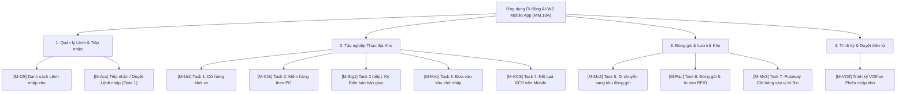

### 2.2. Mô hình giao tiếp hệ thống trên di động
Ứng dụng di động tác nghiệp thông qua các giao tiếp tích hợp:
- **Di động <-> Mobile API Gateway (RESTful / HTTPS JSON):** Truy xuất danh sách task, gửi dữ liệu quét RFID/Barcode, upload file ảnh chữ ký.
- **Di động <-> Tích hợp thiết bị phần cứng (Hardware Integration):**
  - Đọc thẻ RFID Chip EPC trực tiếp từ Đầu đọc RFID cầm tay (Handheld RFID Reader Zebra / Honeywell).
  - Quét mã vạch Barcode/QR qua Camera thiết bị di động hoặc Đầu đọc Laser tích hợp PDA.
  - Gửi lệnh in trực tiếp qua sóng Bluetooth / Wi-Fi tới Máy in tem RFID di động (Zebra ZT411 / ZD621).
- **Di động <-> SAP S/4HANA & V-Office (Thông qua AI-WS Backend Services):** Nhận đồng bộ Inbound Delivery VL31N, thông báo kết quả Gate 1 / Gate 2, trình ký V-Office và tạo Phiếu nhập kho Mvt 101.

---

## PHẦN 3. THIẾT KẾ CHI TIẾT CÁC MÀN HÌNH MOBILE

### 3.1. Nhóm Quản lý Lệnh Nhập & Tác nghiệp Kho di động

---

### 3.1.1. [M-DS] Màn hình Danh sách lệnh nhập kho trên Mobile

#### ① Thông tin chung

| Mục | Nội dung |
|---|---|
| **Tên chức năng** | **Danh sách lệnh nhập kho trên Mobile** (`Inbound Orders List & Cumulative Dashboard - Mobile App`) |
| **Mã màn hình** | `SCR-MOB-INB-LIST-01` |
| **Mã Task** | `[M-DS]` / `[M-Inb1]` |
| **Actor (Tác nhân)** | Nhân viên kho (`ROLE_WAREHOUSE_WORKER`), Thủ kho (`ROLE_WAREHOUSE_MASTER`), Giám đốc kho (`ROLE_WAREHOUSE_DIRECTOR`) |
| **Mô tả** | Cho phép Nhân viên kho, Thủ kho và Giám đốc kho xem danh sách tổng quan các Lệnh nhập kho mua hàng từ Nhà cung cấp tại kho di động phụ trách (`Kho HN01`), theo dõi các chỉ số thống kê tổng hợp lũy kế khối lượng/thể tích hàng hóa theo tháng/năm, và thực hiện lọc nhanh danh sách đơn hàng theo trạng thái tác nghiệp (`Tất cả`, `Chờ duyệt`, `Đang xử lý`, `Hoàn tất`). |
| **Đường dẫn** | Navigation: `Đăng nhập Mobile App` $\rightarrow$ Select `Chức năng Nhập kho` $\rightarrow$ Màn hình `[M-DS]`. |
| **Phân quyền & Miền dữ liệu** | • **Thực hiện:** Thủ kho (`ROLE_WAREHOUSE_MASTER`), NV kho (`ROLE_WAREHOUSE_WORKER`), Giám đốc kho (`ROLE_WAREHOUSE_DIRECTOR`). • **Miền dữ liệu:** Chỉ xem danh sách Lệnh nhập thuộc kho làm việc hiện tại của tài khoản (`HN01`). |

#### ② Màn hình

- **Link file ảnh UIUX:** [N1_DS_lenh_nhap.png](file:///c:/Users/Admin/Desktop/ai-agent-wms/UIUX/Mobile/Nhap_Kho/N1_DS_lenh_nhap.png)

- **Mô tả chi tiết giao diện:**
  1. **Header Bar Đỏ (Top App Bar):**
     - Nút tròn Back (Quay lại Menu chính ứng dụng di động).
     - Tiêu đề màn hình: `Danh sách lệnh nhập`.
     - Sub-title: Tên kho di động tác nghiệp `Kho HN01`.
  2. **Card Thống Kê Chỉ Số Lũy Kế (Cumulative Summary Card):**
     - Thẻ màu xanh navy/xám bo bo viền mềm chia thành 2 cột chỉ số:
       - **Cột Lũy Kế Tháng:** Số lệnh nhập (`138`), Tổng khối lượng (`165.6 tấn`), Tổng thể tích (`662.4 m³`).
       - **Cột Lũy Kế Năm:** Số lệnh nhập (`1,802`), Tổng khối lượng (`2,162.4 tấn`), Tổng thể tích (`8,649.6 m³`).
  3. **Thanh Cuộn Chip Lọc Trạng Thái (Segmented Filter Tabs Bar):**
     - Thanh cuộn ngang dạng chip nút bo tròn nổi bật:
       - `Tất cả (4)` (Chip đỏ Solid Active).
       - `Chờ duyệt (1)` (Chip trắng viền xám).
       - `Đang xử lý (2)` (Chip trắng viền xám).
       - `Hoàn tất (1)` (Chip trắng viền xám).
  4. **Danh sách Thẻ Thống Kê Lệnh Nhập Kho (Order Cards Scrollable ListView):**
     - Mỗi đơn hàng được hiển thị dưới dạng 1 Thẻ Card bo góc nổi bật:
       - **Dòng 1:** Mã lệnh nhập kho `INB-2026-00231` (Đỏ bold), Badge trạng thái màu (`Chờ duyệt` - Cam, `Đang xử lý` - Tím, `Hoàn tất` - Xanh lá), Icon mũi tên chuyển màn hình `➔`.
       - **Dòng 2:** Icon xe tải + Tên Nhà cung cấp (`Ericsson Vietnam`, `Samsung Electronics`...).
       - **Dòng 3:** Trọng lượng đơn (`1,240 kg`), Thể tích (`4.8 m³`), Giờ giao dự kiến (`Giờ giao: 09:30`).

#### ③ Bảng 6 Cột Thành Phần UI & Ánh Xạ API / CSDL (Control Matrix)

| STT | Tên Control | Kiểu Control / Kiểu Dữ Liệu | Input / Output | API Phương Thức & Endpoint | Ánh Xạ CSDL (`bảng.cột`) | Mô Tả Chi Tiết, Validation & Quy Tắc Hiển Thị |
|:---:|:---|:---|:---:|:---|:---|:---|
| **I** | **TOP APP BAR & HEADER CONTROLS** | | | | | |
| 1 | `btn_back` | Round Back Icon Button | Input | Router Navigation | N/A | Click quay lại Màn hình Menu chính Home Mobile. |
| 2 | `lbl_header_title` | Bold Text / String | Output | Static Config | N/A | Tiêu đề màn hình di động: `Danh sách lệnh nhập`. |
| 3 | `lbl_warehouse_name` | Sub-title Text / String | Output | Auth Context | `warehouse.warehouse_name` | Tên kho di động làm việc của người dùng (VD: `Kho HN01`). |
| **II** | **CUMULATIVE DASHBOARD CONTROLS** | | | | | |
| 4 | `val_month_orders` | Bold Text / Integer | Output | `GET /api/registration/inbound-orders` | `COUNT("order".id)` (Tháng hiện tại) | Tổng số lượng lệnh nhập kho phát sinh trong tháng (`138`). |
| 5 | `val_month_weight` | Bold Text / String | Output | `GET /api/registration/inbound-orders` | `SUM("order".total_weight_kg)` (Tháng) | Tổng khối lượng lũy kế tháng quy đổi đơn vị Tấn (`165.6 tấn`). |
| 6 | `val_month_volume` | Bold Text / String | Output | `GET /api/registration/inbound-orders` | `SUM("order".total_volume_m3)` (Tháng) | Tổng thể tích lũy kế tháng (`662.4 m³`). |
| 7 | `val_year_orders` | Bold Text / Integer | Output | `GET /api/registration/inbound-orders` | `COUNT("order".id)` (Năm hiện tại) | Tổng số lượng lệnh nhập kho phát sinh trong năm (`1,802`). |
| 8 | `val_year_weight` | Bold Text / String | Output | `GET /api/registration/inbound-orders` | `SUM("order".total_weight_kg)` (Năm) | Tổng khối lượng lũy kế năm quy đổi đơn vị Tấn (`2,162.4 tấn`). |
| 9 | `val_year_volume` | Bold Text / String | Output | `GET /api/registration/inbound-orders` | `SUM("order".total_volume_m3)` (Năm) | Tổng thể tích lũy kế năm (`8,649.6 m³`). |
| **III** | **FILTER TABS & LISTVIEW CONTROLS** | | | | | |
| 10 | `tab_filter_status` | Segment Filter Chips | Input | `GET /api/registration/inbound-orders?status=X` | `"order".status` | Thanh chip chọn lọc trạng thái: `Tất cả`, `Chờ duyệt` (`REGISTERED`), `Đang xử lý` (`IN_PROGRESS`), `Hoàn tất` (`COMPLETED`). |
| 11 | `lst_order_cards` | Vertical ListView / Array | Output | `GET /api/registration/inbound-orders` | Bảng `"order"` JOIN `supplier` | Danh sách các thẻ Lệnh nhập kho trả về từ API. |
| 12 | `col_order_code` | Red Bold Text / String [50] | Output | `GET /api/registration/inbound-orders` | `"order".order_code` | Mã định danh Lệnh nhập kho (VD: `INB-2026-00231`). |
| 13 | `col_status_badge` | Status Tag Badge | Output | `GET /api/registration/inbound-orders` | `"order".status` | Badge màu trạng thái lệnh (`Chờ duyệt` - Cam, `Đang xử lý` - Tím, `Hoàn tất` - Xanh lá). |
| 14 | `col_supplier_name` | Text Label / String [255] | Output | `GET /api/registration/inbound-orders` | `"order".supplier_name` | Tên Nhà cung cấp giao hàng kèm icon xe tải (VD: `Ericsson Vietnam`). |
| 15 | `col_weight_kg` | Sub-text / String | Output | `GET /api/registration/inbound-orders` | `"order".total_weight_kg` | Tổng trọng lượng hàng hóa đơn nhập (VD: `1,240 kg`). |
| 16 | `col_volume_m3` | Sub-text / String | Output | `GET /api/registration/inbound-orders` | `"order".total_volume_m3` | Tổng thể tích hàng hóa đơn nhập (VD: `4.8 m³`). |
| 17 | `col_delivery_time` | Sub-text / String | Output | `GET /api/registration/inbound-orders` | `"order".delivery_time` | Giờ giao dự kiến tại kho (VD: `Giờ giao: 09:30`). |
| 18 | `btn_order_card_click` | Arrow Icon / Trigger | Input/Trigger | Router Navigation | N/A | Click thẻ đơn hàng ➔ Chuyển màn hình Tiếp nhận `[M-Acc]` hoặc Màn hình Task di động tương ứng. |

#### ④ Luồng xử lý nghiệp vụ các bước tác nghiệp di động

##### A. Sơ đồ luồng hoạt động (Activity Flowchart):

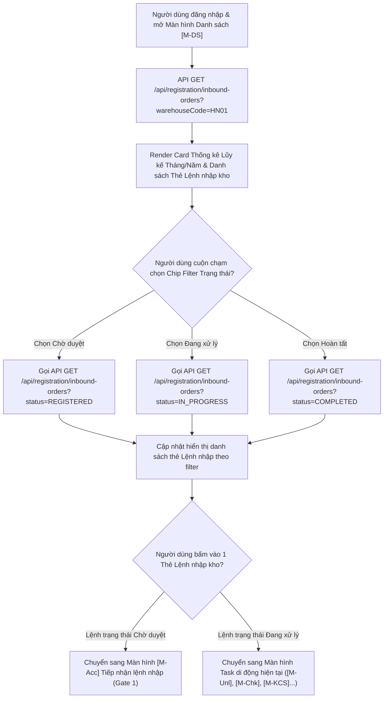

##### B. Bảng mô tả chi tiết các bước tác nghiệp & Xử lý hệ thống:

| Bước | Tác nhân | Hành động người dùng | Phản ứng hệ thống & Xử lý API / CSDL | Xử lý Ngoại lệ / Validation |
|:---:|---|---|---|---|
| **1** | User kho | Mở Màn hình Danh sách `[M-DS]` | • Gọi API `GET /api/registration/inbound-orders?warehouseCode=HN01&page=0&size=20`. • Hiển thị khung Thống kê lũy kế khối lượng/thể tích theo tháng và năm. • Render danh sách các thẻ Lệnh nhập kho mới nhất. | Nếu mất kết nối mạng ➔ Lấy dữ liệu cached gần nhất trong SQLite local di động. |
| **2** | User kho | Bấm chọn Chip Filter Trạng thái | • Chuyển tab Active `tab_filter_status` (VD: `Chờ duyệt`). • Gọi lại API với param `status=REGISTERED` để tải danh sách tương ứng. | Hiển thị trạng thái Empty State nếu không có đơn hàng nào thỏa mãn filter. |
| **3** | User kho | Bấm vào một Thẻ Lệnh nhập kho | • Nếu `order.status == 'REGISTERED'`: Chuyển sang Màn hình `[M-Acc]` Tiếp nhận lệnh nhập (Gate 1). • Nếu `order.status == 'IN_PROGRESS'`: Chuyển thẳng sang Màn hình Task di động tác nghiệp tương ứng của đơn (`[M-Unl]`, `[M-Chk]`, `[M-Mv1]`, `[M-KCS]`, `[M-VOff]`). | Báo cảnh báo nếu Lệnh nhập bị khóa hoặc tạm dừng do sự cố. |

#### ⑤ Đánh giá & Rà soát độ phủ Dữ liệu API Mobile (Mobile API Gap Analysis)

Qua rà soát đối chiếu giao diện Mobile Danh sách lệnh nhập (`N1_DS_lenh_nhap.png`) với Bộ tài liệu tra cứu API Swagger local [API_AND_DB_FULL_REFERENCE.md](file:///c:/Users/quantm18/Desktop/New%20folder/Project_Management/dev/api-specs/API_AND_DB_FULL_REFERENCE.md), hệ thống ghi nhận **2 điểm tối ưu API DTO chuyên biệt cho Ứng dụng Di động**:

> [!IMPORTANT]
> **Các khuyến nghị bổ sung DTO cho Mobile App:**
> 1. **Tích hợp DTO Thống kê Lũy kế Tháng/Năm (`cumulativeStatistics`):** API `GET /api/registration/inbound-orders` nên trả kèm đối tượng JSON `cumulativeStatistics: { monthOrders, monthWeightTon, monthVolumeM3, yearOrders, yearWeightTon, yearVolumeM3 }` để Mobile App hiển thị trực tiếp trên Dashboard mà không cần bắn thêm HTTP Request phụ.
> 2. **Trả về Mã Task Di động Hiện tại (`currentMobileTaskCode`):** Response của danh sách đơn hàng nên trả về trường `currentMobileTaskCode: "TASK_1_UNLOAD" | "TASK_2_INSPECT" | "TASK_3_STAGING" | "TASK_4_KCS"` để Mobile App tự động điều hướng chính xác vào màn hình tác nghiệp khi người dùng bấm vào thẻ đơn hàng.

---

### 3.1.2. [M-Acc] Màn hình Tiếp nhận lệnh nhập kho trên Mobile (Gate 1)

#### ① Thông tin chung

| Mục | Nội dung |
|---|---|
| **Tên chức năng** | **Tiếp nhận lệnh nhập kho trên Mobile (Gate 1)** (`Inbound Order Acceptance & Rejection Gate 1 - Mobile App`) |
| **Mã màn hình** | `SCR-MOB-INB-ACCEPT-01` |
| **Mã Task** | `[M-Acc]` / `[M-Inb2]` |
| **Actor (Tác nhân)** | Thủ kho (`ROLE_WAREHOUSE_MASTER`), Giám đốc kho (`ROLE_WAREHOUSE_DIRECTOR`) |
| **Mô tả** | Cho phép Thủ kho xem chi tiết thông tin Lệnh nhập kho chuyển từ SAP ERP sang, đối soát danh sách mặt hàng SKU/Vật tư, kiểm tra tổng số lượng/trọng lượng/thể tích và thực hiện bấm nút **[Xác nhận lệnh]** (chấp nhận Gate 1, chuyển trạng thái đơn sang `IN_PROGRESS` và kích hoạt Task 1 `[M-Unl]`) hoặc bấm nút **[Từ chối]** (từ chối Gate 1, nhập lý do từ chối và phát bản tin **`T-API2`** gửi thông báo từ chối tiếp nhận về SAP ERP). |
| **Đường dẫn** | Navigation: `Danh sách lệnh nhập kho` `[M-DS]` $\rightarrow$ Select lệnh có status `Chờ duyệt` $\rightarrow$ Màn hình `[M-Acc]`. |
| **Phân quyền & Miền dữ liệu** | • **Thực hiện:** Thủ kho (`ROLE_WAREHOUSE_MASTER`), Giám đốc kho (`ROLE_WAREHOUSE_DIRECTOR`). • **Miền dữ liệu:** Lệnh nhập thuộc kho quản lý. |

#### ② Màn hình

- **Link file ảnh UIUX:** [N2_Xac_nhan_lenh_nhap.png](file:///c:/Users/Admin/Desktop/ai-agent-wms/UIUX/Mobile/Nhap_Kho/N2_Xac_nhan_lenh_nhap.png)

- **Mô tả chi tiết giao diện:**
  1. **Header Bar Đỏ (Top App Bar):**
     - Nút tròn Back (Quay lại Danh sách lệnh nhập `[M-DS]`).
     - Tiêu đề màn hình: `Tiếp nhận lệnh nhập`.
     - Sub-title: `INB-2026-00122 · 14/05/2026`.
  2. **Card Thông tin Lệnh Nhập Kho (Order Header Info Card):**
     - **Dòng tiêu đề card:** Mã Lệnh `INB-2026-00122` kèm Badge trạng thái màu tím `Chờ tiếp nhận`.
     - **Thông số chi tiết:**
       - Loại nhập: `Nhập từ NCC` | Đơn vị giao: `Ericsson Vietnam`.
       - Kho nhận: `HN01 · Kho HN` | Thời gian dự kiến: `14/05/2026 · 09:00`.
       - Trọng lượng & Thể tích: `1,240 kg · 4.8 m³`.
       - Tổng số lượng & Dòng hàng: `3.840 cái · 12 dòng`.
  3. **Danh sách Thẻ Sản Phẩm Mặt Hàng (Material Items ListView):**
     - Màn hình hiển thị danh sách từng mặt hàng SKU đính kèm thuộc Lệnh nhập:
       - **Thẻ SP 1:** Mã SKU `SP-A001`, Tên sản phẩm `Galaxy A15 128GB`, Số lượng PO `800 Cái`, Chi tiết `Khối lượng: 240 kg · Thể tích: 0.9 m³`.
       - **Thẻ SP 2:** Mã SKU `SP-A002`, Tên sản phẩm `Galaxy A25 256GB`, Số lượng PO `600 Cái`, Chi tiết `Khối lượng: 180 kg · Thể tích: 0.7 m³`.
       - **Thẻ SP 3:** Mã SKU `SP-A003`, Tên sản phẩm `Tai nghe Buds Pro`, Số lượng PO `1.200 Cái`, Chi tiết `Khối lượng: 120 kg · Thể tích: 0.4 m³`.
       - **Thẻ SP 4:** Mã SKU `SP-A004`, Tên sản phẩm `Cáp sạc USB-C 1m`, Số lượng PO `1.240 Cái`, Chi tiết `Khối lượng: 90 kg · Thể tích: 0.3 m³`.
  4. **Thanh Nút Lệnh Kép Dưới Cùng (Bottom Dual Action Bar):**
     - Button `Từ chối` (Kích thước nhỏ vừa, Outline White/Red kèm Icon X đỏ tròn).
     - Button `Xác nhận lệnh` (Kích thước lớn Full-flex, Solid Red Primary Button kèm Icon Check `✓` trắng).

#### ③ Bảng 6 Cột Thành Phần UI & Ánh Xạ API / CSDL (Control Matrix)

| STT | Tên Control | Kiểu Control / Kiểu Dữ Liệu | Input / Output | API Phương Thức & Endpoint | Ánh Xạ CSDL (`bảng.cột`) | Mô Tả Chi Tiết, Validation & Quy Tắc Hiển Thị |
|:---:|:---|:---|:---:|:---|:---|:---|
| **I** | **TOP APP BAR & HEADER CONTROLS** | | | | | |
| 1 | `btn_back` | Round Back Icon Button | Input | Router Navigation | N/A | Click quay lại Màn hình Danh sách lệnh nhập `[M-DS]`. |
| 2 | `lbl_header_title` | Bold Text / String | Output | Static Config | N/A | Tiêu đề màn hình di động: `Tiếp nhận lệnh nhập`. |
| 3 | `lbl_order_code_header` | Sub-title Text / String | Output | `GET /api/registration/inbound-orders/detail/{orderId}` | `"order".order_code`, `"order".delivery_date` | Chuỗi ghép thông tin: `{OrderCode} · {DeliveryDate}` (VD: `INB-2026-00122 · 14/05/2026`). |
| **II** | **ORDER HEADER INFO CARD CONTROLS** | | | | | |
| 4 | `val_order_code` | Bold Text / String [50] | Output | `GET /api/registration/inbound-orders/detail/{orderId}` | `"order".order_code` | Mã Lệnh nhập kho mua hàng (VD: `INB-2026-00122`). |
| 5 | `badge_order_status` | Status Tag Badge | Output | `GET /api/registration/inbound-orders/detail/{orderId}` | `"order".status` | Badge màu tím hiển thị trạng thái `Chờ tiếp nhận`. |
| 6 | `val_inbound_type` | Text Label / String | Output | `GET /api/registration/inbound-orders/detail/{orderId}` | `"order".type_name` | Loại hình nhập kho (VD: `Nhập từ NCC`). |
| 7 | `val_supplier_name` | Text Label / String | Output | `GET /api/registration/inbound-orders/detail/{orderId}` | `"order".supplier_name` | Tên Nhà cung cấp giao hàng (VD: `Ericsson Vietnam`). |
| 8 | `val_receiving_wh` | Text Label / String | Output | `GET /api/registration/inbound-orders/detail/{orderId}` | `"order".warehouse_name` | Tên kho nhận hàng (VD: `HN01 · Kho HN`). |
| 9 | `val_expected_time` | Text Label / Datetime | Output | `GET /api/registration/inbound-orders/detail/{orderId}` | `"order".expected_delivery_at` | Thời gian dự kiến giao hàng (VD: `14/05/2026 · 09:00`). |
| 10 | `val_total_weight_vol` | Text Label / String | Output | `GET /api/registration/inbound-orders/detail/{orderId}` | `"order".total_weight_kg`, `"order".total_volume_m3` | Tổng trọng lượng và thể tích của đơn hàng (VD: `1,240 kg · 4.8 m³`). |
| 11 | `val_total_qty_lines` | Text Label / String | Output | `GET /api/registration/inbound-orders/detail/{orderId}` | `"order".total_items`, `"order".total_lines` | Tổng số lượng sản phẩm và số dòng hàng (VD: `3.840 cái · 12 dòng`). |
| **III** | **MATERIAL ITEMS LIST CONTROLS** | | | | | |
| 12 | `lst_materials` | Vertical ListView / Array | Output | `GET /api/registration/inbound-orders/detail/{orderId}` | Bảng `order_product` JOIN `product` | Danh sách các thẻ sản phẩm/mặt hàng đính kèm thuộc Lệnh nhập kho. |
| 13 | `col_sku_code` | Bold Red Text / String [50] | Output | `GET /api/registration/inbound-orders/detail/{orderId}` | `product.sku` | Mã SKU sản phẩm (VD: `SP-A001`). |
| 14 | `col_product_name` | Bold Text / String [255] | Output | `GET /api/registration/inbound-orders/detail/{orderId}` | `product.name` | Tên diễn giải hàng hóa (VD: `Galaxy A15 128GB`). |
| 15 | `col_plan_qty` | Red Bold Text / Integer | Output | `GET /api/registration/inbound-orders/detail/{orderId}` | `order_product.quantity` | Số lượng kế hoạch theo chứng từ PO (VD: `800 Cái`). |
| 16 | `col_weight_vol` | Gray Sub-text / String | Output | `GET /api/registration/inbound-orders/detail/{orderId}` | `order_product.weight_kg`, `order_product.volume_m3` | Trọng lượng và thể tích của dòng hàng (VD: `Khối lượng: 240 kg · Thể tích: 0.9 m³`). |
| **IV** | **BOTTOM DUAL ACTION CONTROLS** | | | | | |
| 17 | `btn_reject_order` | Outline White/Red Button | Input/Trigger | `POST /api/registration/inbound-orders/{orderId}/reject` | UPDATE `"order".status` = 'REJECTED', Trigger `T-API2` | Label: `Từ chối` (kèm Icon X). Mở Modal dialog nhập lý do từ chối Gate 1 và gửi bản tin `T-API2` sang SAP ERP. |
| 18 | `btn_confirm_order` | Full Red Primary Button | Input/Trigger | `POST /api/registration/inbound-orders/{orderId}/accept` | UPDATE `"order".status` = 'IN_PROGRESS', UPDATE `task.status` = 0 | Label: `Xác nhận lệnh` (kèm Icon Check `✓`). Tiếp nhận Gate 1 thành công, mở khóa Task 1 Dỡ hàng (`[M-Unl]`). |
| 19 | `mdl_reject_gate1` | Reject Modal Dialog | Input/Trigger | `POST /api/registration/inbound-orders/{orderId}/reject` | JSON Payload (`rejectReason`) | Dialog nhập lý do: "Nhập lý do từ chối tiếp nhận Lệnh nhập kho INB-2026-00122" + Textarea + Nút `Gửi SAP` & `Hủy`. |

#### ④ Luồng xử lý nghiệp vụ các bước tác nghiệp di động

##### A. Sơ đồ luồng hoạt động (Activity Flowchart):

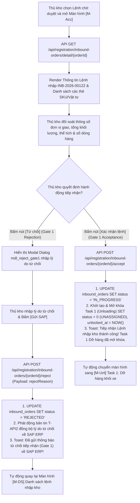

##### B. Bảng mô tả chi tiết các bước tác nghiệp & Xử lý hệ thống:

| Bước | Tác nhân | Hành động người dùng | Phản ứng hệ thống & Xử lý API / CSDL | Xử lý Ngoại lệ / Validation |
|:---:|---|---|---|---|
| **1** | Thủ kho | Mở Màn hình Tiếp nhận lệnh `[M-Acc]` | • Gọi API `GET /api/registration/inbound-orders/detail/{orderId}`. • Render đầy đủ thông tin Header đơn nhập, đơn vị giao, trọng lượng/thể tích và danh sách sản phẩm. | Báo lỗi nếu Lệnh nhập không ở trạng thái `REGISTERED` (Chờ tiếp nhận). |
| **2** | Thủ kho | Đối soát chi tiết mặt hàng PO | Thủ kho kiểm tra thông tin số lượng kế hoạch `quantity` từng SKU so với chứng từ giao hàng đi kèm của Nhà cung cấp. | Cho phép bấm vào thẻ sản phẩm để xem thông số chi tiết quy cách. |
| **3a** | Thủ kho | Bấm nút **[Từ chối]** (Gate 1 Rejection) | • Mở Modal dialog `mdl_reject_gate1` nhập lý do từ chối. • Nhập lý do (vd: *"Sai quy cách đơn hàng SAP, không có thông báo trước"*) $\rightarrow$ Bấm [Gửi SAP]. • Gọi API `POST /api/registration/inbound-orders/{orderId}/reject`. • **DB Update:** `UPDATE inbound_orders SET status = 'REJECTED'`. • **Phát động SAP (`T-API2`):** Đồng bộ lý do từ chối Gate 1 về SAP ERP. • Toast thông báo thành công và quay về `[M-DS]`. | Validation: Bắt buộc nhập Lý do từ chối (tối thiểu 10 ký tự). |
| **3b** | Thủ kho | Bấm nút **[Xác nhận lệnh]** (Gate 1 Acceptance) | • Gọi API `POST /api/registration/inbound-orders/{orderId}/accept`. • **DB Update:** `UPDATE inbound_orders SET status = 'IN_PROGRESS'`. • **Khởi tạo Task 1:** `UPDATE task SET status = 0 (UNASSIGNED) WHERE order_id = orderId AND task_type = 'UNLOADING'`. • Toast thông báo thành công và chuyển hướng màn hình sang `[M-Unl]` (Task 1: Dỡ hàng khỏi xe). | Nếu lệnh đã được người dùng khác tiếp nhận ➔ Cảnh báo: "Lệnh nhập đã được tiếp nhận bởi Thủ kho khác". |

#### ⑤ Đánh giá & Rà soát độ phủ Dữ liệu API Mobile (Mobile API Gap Analysis)

Qua rà soát đối chiếu giao diện Mobile Tiếp nhận lệnh (`N2_Xac_nhan_lenh_nhap.png`) với Bộ tài liệu tra cứu API Swagger local [API_AND_DB_FULL_REFERENCE.md](file:///c:/Users/quantm18/Desktop/New%20folder/Project_Management/dev/api-specs/API_AND_DB_FULL_REFERENCE.md), hệ thống ghi nhận **2 điểm tối ưu API DTO chuyên biệt cho Ứng dụng Di động**:

> [!IMPORTANT]
> **Các khuyến nghị bổ sung DTO cho Mobile App:**
> 1. **Trả về Danh sách Mã Lý do Từ chối Quy chuẩn (`rejectReasonCodes`):** API detail nên trả về sẵn mảng danh mục lý do từ chối quy chuẩn (`"SAI_SOLUONG"`, `"SAI_QUYCACH"`, `"SAI_THOIGIAN"`, `"KHAC"`) để hiển thị dạng Radio/Dropdown trên Modal từ chối di động thay vì nhập text tự do.
> 2. **Thông tin Xe & Tài xế giao hàng (`driverInfo`):** DTO chi tiết đơn nhập nên bổ sung thông tin Biển số xe container/xe tải (`licensePlate`), Tên tài xế (`driverName`) và Số điện thoại (`driverPhone`) để Thủ kho liên hệ trực tiếp tại Dock.

---

### 3.1.3. [M-Unl] Task 1: Dỡ hàng khỏi xe trên Mobile

#### ① Thông tin chung

| Mục | Nội dung |
|---|---|
| **Tên chức năng** | **Task 1: Dỡ hàng khỏi xe trên Mobile** (`Unloading Task Execution - Mobile App`) |
| **Mã màn hình** | `SCR-MOB-UNLOAD-01` |
| **Mã Task** | `[M-Unl]` / `[T-Unl]` |
| **Actor (Tác nhân)** | Nhân viên kho (`ROLE_WAREHOUSE_WORKER`) |
| **Mô tả** | Màn hình cho phép Nhân viên kho thực hiện công việc dỡ hàng từ xe container/xe tải của Nhà cung cấp xuống bãi Staging tại Dock nhận hàng chỉ định. Hỗ trợ kiểm tra danh mục mặt hàng (phân loại SKU quản lý theo Serial number vs SKU quản lý theo Số lượng vật tư), xin gia hạn SLA/KPI task, dỡ sơ bộ thực tế, chụp ảnh đính kèm minh chứng và chốt hoàn thành Task 1 để tự động kích hoạt Task 2 (`[M-Chk]`). |
| **Đường dẫn** | Navigation: `Danh sách Task nhập kho` $\rightarrow$ Select dòng Task 1 $\rightarrow$ Click `[Nhận việc]` $\rightarrow$ Màn hình Dỡ hàng `[M-Unl]`. |
| **Phân quyền & Miền dữ liệu** | • **Thực hiện:** NV kho (`ROLE_WAREHOUSE_WORKER`). • **Miền dữ liệu:** Task 1 thuộc kho làm việc hiện tại của NV kho. |

#### ② Màn hình

- **Link file ảnh UIUX:** [N3_Do_hang.png](file:///c:/Users/Admin/Desktop/ai-agent-wms/UIUX/Mobile/Nhap_Kho/N3_Do_hang.png)

- **Mô tả chi tiết bố cục & thành phần giao diện:**
  1. **Header Bar Đỏ (Top App Bar):**
     - Nút tròn Back (Quay lại danh sách task).
     - Tiêu đề màn hình: `Dỡ hàng`.
     - Sub-title đa thông tin: `Dock A2 · TSK-9921 · INB-2026-00118`.
     - Nút trắng viền bo tròn: `Gia hạn KPI` (Mở dialog xin gia hạn thời gian SLA).
  2. **Khung Card Thông tin Tổng quan Lệnh & Bãi (Task Overview Info Card):**
     - Mã Lệnh nhập kho: `INB-2026-00118` | Vị trí Dock & Khu nhận: `Dock A2 · Khu nhận`.
     - Tên Nhà cung cấp & Mã NCC: `Ericsson Vietnam · NCC-0991`.
     - Thống kê tổng quan: `6 dòng · 208 cái`.
     - Thẻ phân loại nhóm SKU: Badge `3 Serial` (Màu xanh pastel) & Badge `3 Vật tư` (Màu xanh pastel).
  3. **Danh sách Thẻ Hàng hóa Cần dỡ (Items To Unload Scrollable Cards):**
     - **Nhóm 1 — Mặt hàng quản lý theo Serial Number (Thẻ viền cam/badge đỏ):**
       - Thẻ 1: `Galaxy A15 128GB` (Pill tag: `Điện thoại`, SKU: `SP-A001`, Mã RFID: `RFID-0001-A1`, Badge đỏ nổi bật `Serial 012345`).
       - Thẻ 2: `Galaxy A25 256GB` (Pill tag: `Điện thoại`, SKU: `SP-A002`, Mã RFID: `RFID-0002-A1`, Badge đỏ nổi bật `Serial 012346`).
       - Thẻ 3: `Tai nghe Buds Pro` (Pill tag: `Phụ kiện`, SKU: `SP-A003`, Mã RFID: `RFID-0003-B2`, Badge đỏ nổi bật `Serial 012347`).
     - **Nhóm 2 — Mặt hàng quản lý theo Số lượng vật tư (Thẻ hiển thị số lượng to):**
       - Thẻ 4: `Cáp sạc USB-C 1m` (Pill tag: `Vật tư`, SKU: `SP-A004`, Mã RFID: `RFID-0004-C3`, Số lượng lớn `50`).
       - Thẻ 5: `Ống lót máy` (Pill tag: `Vật tư`, SKU: `SP-A005`, Mã RFID: `RFID-0005-D4`, Số lượng lớn `120`).
       - Thẻ 6: `Keo dán chuyên dụng` (Pill tag: `Vật tư`, SKU: `SP-A006`, Mã RFID: `RFID-0006-E5`, Số lượng lớn `35`).
  4. **Thanh Nút Lệnh Dưới Cùng (Bottom Action Bar):**
     - Button `Hoàn thành` (Kích thước rộng Full-width, Solid Red Primary Button kèm Icon Check `✓` trắng).

#### ③ Bảng 6 Cột Thành Phần UI & Ánh Xạ API / CSDL (Control Matrix)

| STT | Tên Control | Kiểu Control / Kiểu Dữ Liệu | Input / Output | API Phương Thức & Endpoint | Ánh Xạ CSDL (`bảng.cột`) | Mô Tả Chi Tiết, Validation & Quy Tắc Hiển Thị |
|:---:|:---|:---|:---:|:---|:---|:---|
| **I** | **TOP APP BAR & HEADER CONTROLS** | | | | | |
| 1 | `btn_back` | Round Back Icon Button | Input | Router Navigation | N/A | Click quay lại Màn hình Danh sách Task nhập kho. |
| 2 | `lbl_header_title` | Bold Text / String | Output | Static Config | N/A | Tiêu đề màn hình di động: `Dỡ hàng`. |
| 3 | `lbl_dock_task_info` | Sub-title Text / String | Output | `GET /api/registration/tasks/{taskId}/header` | `task.zone_code`, `task.task_code`, `"order".order_code` | Chuỗi ghép thông tin: `{Dock} · {TaskCode} · {OrderCode}` (VD: `Dock A2 · TSK-9921 · INB-2026-00118`). |
| 4 | `btn_extend_kpi` | Pill White Button / Trigger | Input | `POST /api/registration/tasks/{taskId}/extend-kpi` | UPDATE `task.sla_due_at`, `task.extend_reason` | Label: `Gia hạn KPI`. Mở Modal dialog nhập số phút xin gia hạn + lý do gia hạn SLA. |
| **II** | **OVERVIEW TASK INFO CARD CONTROLS** | | | | | |
| 5 | `val_order_code` | Bold Text / String [50] | Output | `GET /api/registration/tasks/{taskId}/header` | `"order".order_code` | Mã Lệnh nhập kho mua hàng (VD: `INB-2026-00118`). |
| 6 | `val_dock_location` | Highlight Text / String [100] | Output | `GET /api/registration/tasks/{taskId}/staging-area-entry` | `task.zone_code` | Tên Dock hạ hàng & Khu nhận chỉ định (VD: `Dock A2 · Khu nhận`). |
| 7 | `val_supplier_info` | Text / String [255] | Output | `GET /api/registration/inbound-orders/detail/{orderId}` | `"order".supplier_name`, `"order".supplier_code` | Tên & Mã Nhà cung cấp (VD: `Ericsson Vietnam · NCC-0991`). |
| 8 | `val_lines_summary` | Text / String [50] | Output | `GET /api/registration/tasks/{taskId}/staging-area-entry/products` | `COUNT(order_product.id)`, `SUM(order_product.quantity)` | Tổng số dòng hàng và tổng số cái (VD: `6 dòng · 208 cái`). |
| 9 | `tag_serial_count` | Tag Badge / String | Output | Derived from item list | Calculated local state | Badge hiển thị số SKU quản lý theo Serial (VD: `3 Serial`). |
| 10 | `tag_item_count` | Tag Badge / String | Output | Derived from item list | Calculated local state | Badge hiển thị số SKU quản lý theo Số lượng (VD: `3 Vật tư`). |
| **III** | **ITEMS TO UNLOAD LIST CONTROLS** | | | | | |
| 11 | `lst_unload_items` | Vertical ListView / Array | Output | `GET /api/registration/tasks/{taskId}/staging-area-entry/products` | Danh sách dòng hàng thuộc `order_product` JOIN `product` | Danh sách thẻ hàng hóa cần dỡ từ xe xuống bãi Staging. |
| 12 | `col_item_name` | Bold Text / String [255] | Output | `GET /api/registration/tasks/{taskId}/staging-area-entry/products` | `product.name` | Tên mô tả chi tiết vật tư (VD: `Galaxy A15 128GB`, `Cáp sạc USB-C 1m`). |
| 13 | `col_cat_tag` | Pill Tag / String [50] | Output | `GET /api/registration/tasks/{taskId}/staging-area-entry/products` | `product.category_name` | Tag phân loại loại hàng (`Điện thoại`, `Phụ kiện`, `Vật tư`). |
| 14 | `col_sku_code` | Gray Code Text / String [50] | Output | `GET /api/registration/tasks/{taskId}/staging-area-entry/products` | `product.sku` | Mã SKU sản phẩm (VD: `SP-A001`). |
| 15 | `col_rfid_code` | Code Text / String [50] | Output | `GET /api/registration/inbound-orders/{orderId}/product-hus` | `handling_unit.rfid_code` | Mã RFID đại diện kiện/thùng (VD: `RFID-0001-A1`). |
| 16 | `col_serial_or_qty` | Red Badge / Big Number | Output | `GET /api/registration/tasks/{taskId}/staging-area-entry/products` | `order_product.serial_number` HOẶC `order_product.quantity` | • Nếu hàng Serial: Hiển thị Badge đỏ `Serial {serial_no}`. • Nếu hàng Vật tư: Hiển thị Số lượng số to (VD: `50`, `120`). |
| **IV** | **BOTTOM ACTION & DIALOG CONTROLS** | | | | | |
| 17 | `btn_complete_unload` | Full-width Red Button | Input/Trigger | `POST /api/registration/tasks/{taskId}/unloading/complete` | UPDATE `task.status` = 2, `task.end_time` = NOW(), INSERT `attachment` | Label: `Hoàn thành` (kèm Icon Check). Mở Modal dialog xác nhận dỡ hàng & upload ảnh đính kèm. |
| 18 | `mdl_confirm_unload` | Confirm Modal Dialog | Input/Trigger | `POST /api/registration/tasks/{taskId}/unloading/complete` | Form-data (`files[]` ảnh đính kèm) | Modal xác nhận: "Xác nhận dỡ xong 6 dòng hàng (208 cái) xuống Dock A2?" + Nút `Đồng ý hoàn thành` & `Hủy`. |

#### ④ Luồng xử lý nghiệp vụ các bước tác nghiệp di động

##### A. Sơ đồ luồng hoạt động (Activity Flowchart):

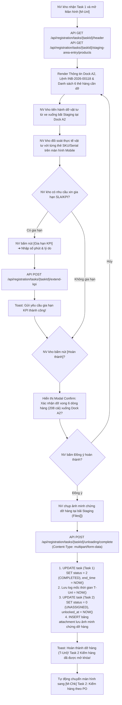

##### B. Bảng mô tả chi tiết các bước tác nghiệp & Xử lý hệ thống:

| Bước | Tác nhân | Hành động người dùng | Phản ứng hệ thống & Xử lý API / CSDL | Xử lý Ngoại lệ / Validation |
|:---:|---|---|---|---|
| **1** | NV kho | Mở Màn hình Task 1 Dỡ hàng `[M-Unl]` | • Gọi API `GET /api/registration/tasks/{taskId}/header` lấy thông tin Header. • Gọi API `GET /api/registration/tasks/{taskId}/staging-area-entry/products` lấy danh sách sản phẩm cần dỡ. • Render danh sách thẻ hàng hóa phân loại thành 2 nhóm: Thẻ Serial (Badge đỏ) và Thẻ Vật tư (Số lượng to). | Nếu không có mạng (Offline) ➔ Load dữ liệu cached gần nhất trong IndexedDB/SQLite local. |
| **2** | NV kho | Thực hiện dỡ hàng thực tế tại Dock | Dỡ hàng từ thùng xe vận chuyển xuống bãi Staging theo đúng vị trí Dock A2 được chỉ định. Đối soát trực quan từng thùng/kiện hàng với danh sách trên PDA Mobile. | Nếu số lượng thực tế dỡ xuống có sự cố đổ vỡ ➔ Bấm nút báo cáo sự cố gọi API `POST /api/registration/tasks/{taskId}/unloading/issue`. |
| **3** | NV kho | Xin gia hạn KPI (Tùy chọn) | Bấm nút **[Gia hạn KPI]** $\rightarrow$ Mở Popup nhập số phút gia hạn + lý do $\rightarrow$ Gọi API `POST /api/registration/tasks/{taskId}/extend-kpi`. Cập nhật `sla_due_at` và `extend_reason`. | Validation: Số phút gia hạn phải $> 0$ và lý do không được để trống. |
| **4** | NV kho | Bấm nút **[Hoàn thành]** | Mở Modal confirm dialog `mdl_confirm_unload` hiển thị tóm tắt: *"Xác nhận dỡ xong 6 dòng hàng (208 cái) xuống Dock A2?"* kèm nút mở Camera chụp ảnh minh chứng dỡ hàng. | Chặn thao tác nếu chưa cấp quyền Camera chụp ảnh minh chứng. |
| **5** | NV kho | Chụp ảnh & Bấm **[Đồng ý hoàn thành]** | • Gọi API `POST /api/registration/tasks/{taskId}/unloading/complete` với Payload `multipart/form-data` chứa `files[]` ảnh minh chứng. • **DB Update:** `UPDATE task SET status = 2, end_time = NOW() WHERE id = taskId`. • **Trạng thái Đơn:** Cập nhật mốc `t_unl_time = NOW()`. • **Mở khóa Task 2:** `UPDATE task SET status = 0 (UNASSIGNED) WHERE id_order = orderId AND task_type = 'HANDOVER'`. • Thông báo Toast thành công và tự động chuyển hướng màn hình sang `[M-Chk]` (Task 2: Kiểm hàng theo PO). | Nếu upload ảnh thất bại do lỗi mạng ➔ Lưu ảnh vào Offline Queue di động, tự động retry sync background khi có mạng trở lại. |

#### ⑤ Đánh giá & Rà soát độ phủ Dữ liệu API Mobile (Mobile API Gap Analysis)

Qua rà soát đối chiếu giao diện Mobile Dỡ hàng (`N3_Do_hang.png`) với Bộ tài liệu tra cứu API Swagger local [API_AND_DB_FULL_REFERENCE.md](file:///c:/Users/quantm18/Desktop/New%20folder/Project_Management/dev/api-specs/API_AND_DB_FULL_REFERENCE.md), hệ thống ghi nhận **4 điểm tối ưu API DTO chuyên biệt cho Ứng dụng Di động**:

> [!IMPORTANT]
> **Các khuyến nghị bổ sung DTO cho Mobile App:**
> 1. **Gộp DTO Header Task trên Mobile (Single Request):** API Header Task `GET /api/registration/tasks/{taskId}/header` nên trả về thêm thông tin Chuyến xe (`licensePlate`, `supplierName`, `supplierCode`, `dockCode`) trong cùng 1 Response JSON để Mobile App chỉ cần bắn **1 HTTP Request duy nhất** khi mở màn hình, giúp tăng tốc độ tải trang trên thiết bị di động 3G/4G/Wi-Fi kho.
> 2. **Trường Phân loại Hàng Serial vs Hàng Vật tư (`isSerialManaged`):** DTO danh sách sản phẩm `GET /api/registration/tasks/{taskId}/staging-area-entry/products` cần bổ sung cờ `isSerialManaged: boolean` và `serialNumber: string` để Mobile App render đúng UI: Nếu `isSerialManaged = true` ➔ Render Badge đỏ Serial (như `Serial 012345`); Nếu `false` ➔ Render ô Số lượng số to (như `50`, `120`).
> 3. **Mã RFID đại diện Kiện/Thùng (`rfidCode`):** DTO sản phẩm cần đính kèm mã RFID Chip đại diện (`rfid_code`) từ bảng `handling_unit` để hiển thị nhãn `RFID-0001-A1` trên từng thẻ hàng hóa di động.
> 4. **Trường Số lượng dỡ sơ bộ (`unloadedQuantity`):** Bổ sung thuộc tính `unloadedQuantity` trong DTO trả về để lưu vết tiến độ dỡ dở dang nếu NV kho tạm thoát ứng dụng.

---

### 3.1.4. [M-Chk] Task 2: Kiểm hàng theo PO trên Mobile

#### ① Thông tin chung

| Mục | Nội dung |
|---|---|
| **Tên chức năng** | **Task 2: Kiểm hàng theo PO trên Mobile** (`PO Inspection Task - Mobile App`) |
| **Mã màn hình** | `SCR-MOB-INSPECT-01` |
| **Mã Task** | `[M-Chk]` / `[T-Ho]` |
| **Actor (Tác nhân)** | Thủ kho (`ROLE_WAREHOUSE_MASTER`), Nhân viên kho (`ROLE_WAREHOUSE_WORKER`) |
| **Mô tả** | Cho phép Nhân viên kho / Thủ kho thực hiện kiểm đếm số lượng vật tư thực tế dỡ xuống bãi Staging, quét mã Serial/IMEI hoặc Barcode/RFID từng kiện/thùng hàng để đối soát trực tiếp với chứng từ PO SAP. Hỗ trợ quét mã bằng đầu đọc Laser PDA hoặc Camera điện thoại di động, phát động luồng Từ chối nhận hàng (Gate 2 Rejection - `T-API3`) nếu có móp hỏng/sai lệch, hoặc Chấp nhận kết quả kiểm đếm để chuyên sang bước Ký Biên bản bàn giao điện tử (`[M-Sig1]`). |
| **Đường dẫn** | Navigation: `Danh sách Task nhập kho` $\rightarrow$ Select Task 2 Kiểm hàng $\rightarrow$ Màn hình Kiểm hàng theo PO `[M-Chk]`. |
| **Phân quyền & Miền dữ liệu** | • **Thực hiện:** NV kho (`ROLE_WAREHOUSE_WORKER`), Thủ kho (`ROLE_WAREHOUSE_MASTER`). • **Miền dữ liệu:** Task thuộc kho làm việc phụ trách. |

#### ② Màn hình

- **Link file ảnh UIUX:** [N4_Kiem_hang.png](file:///c:/Users/Admin/Desktop/ai-agent-wms/UIUX/Mobile/Nhap_Kho/N4_Kiem_hang.png)

- **Mô tả chi tiết giao diện:**
  1. **Header Bar Đỏ (Top App Bar):**
     - Nút tròn Back (Quay lại danh sách task / màn hình trước).
     - Tiêu đề màn hình: `Kiểm hàng theo PO`.
     - Sub-title: `PO-2026-00118 · 6 dòng`.
     - Nút viền bo tròn: `Gia hạn KPI` (Mở modal xin gia hạn thời gian kiểm hàng).
  2. **Thanh Quét & Đầu Đọc Mã Vạch/RFID (Scan Bar Block):**
     - Ô nhập/quét mã tối màu (Dark Input Box): Icon Scanner góc trái, Placeholder `QUÉT SERIAL/IMEI...`. Tự động nhận dữ liệu từ đầu đọc Laser chuyên dụng trên PDA.
     - Icon Camera màu đỏ vuông góc phải: Kích hoạt camera điện thoại di động để quét Barcode 1D / QR Code 2D.
     - Sub-text hướng dẫn: `Quét barcode/RFID hoặc nhập serial thủ công.`
  3. **Danh sách Thẻ Hàng hóa Kiểm đếm (Checking Items ListView):**
     - Hiển thị danh sách từng dòng hàng cần kiểm đếm khớp với PO:
       - Mã SKU & Tên sản phẩm (VD: `Galaxy A15 128GB - SP-A001`).
       - Mã RFID chip đại diện & Mã Serial/IMEI.
       - Số lượng PO chứng từ vs Số lượng đếm thực tế (VD: `800/800 Cái`). Highlight viền xanh lá khi đã đếm/scan đủ.
  4. **Thanh Nút Lệnh Kép Dưới Cùng (Bottom Dual Action Bar):**
     - Button `Từ chối` (Kích thước nhỏ vừa, Viền đỏ Outline kèm Icon X đỏ tròn): Báo từ chối nhận hàng do móp hỏng/sai lệch (Gate 2).
     - Button `Nhận hàng` (Kích thước lớn Full-flex, Solid Red Primary Button kèm Icon Check `✓` trắng): Đồng ý kết quả kiểm hàng và chuyển tiếp sang màn hình Ký BBBG (`[M-Sig1]`).

#### ③ Bảng 6 Cột Thành Phần UI & Ánh Xạ API / CSDL (Control Matrix)

| STT | Tên Control | Kiểu Control / Kiểu Dữ Liệu | Input / Output | API Phương Thức & Endpoint | Ánh Xạ CSDL (`bảng.cột`) | Mô Tả Chi Tiết, Validation & Quy Tắc Hiển Thị |
|:---:|:---|:---|:---:|:---|:---|:---|
| **I** | **TOP APP BAR & HEADER CONTROLS** | | | | | |
| 1 | `btn_back` | Round Back Icon Button | Input | Router Navigation | N/A | Click quay lại Màn hình trước / Danh sách Task. |
| 2 | `lbl_header_title` | Bold Text / String | Output | Static Config | N/A | Tiêu đề màn hình di động: `Kiểm hàng theo PO`. |
| 3 | `lbl_po_header` | Sub-title Text / String | Output | `GET /api/registration/tasks/{taskId}/header` | `"order".po_number`, `COUNT(order_product.id)` | Chuỗi ghép thông tin: `PO-{PONumber} · {LineCount} dòng` (VD: `PO-2026-00118 · 6 dòng`). |
| 4 | `btn_extend_kpi` | Pill White Button / Trigger | Input | `POST /api/registration/tasks/{taskId}/extend-kpi` | UPDATE `task.sla_due_at`, `task.extend_reason` | Label: `Gia hạn KPI`. Mở dialog xin gia hạn thời gian kiểm hàng. |
| **II** | **SCANNER & INPUT CONTROLS** | | | | | |
| 5 | `txt_scan_input` | Dark Search Textbox | Input | `GET /api/registration/inbound-orders/products/check-by-serial` | `order_product.serial_number` | Ô quét/nhập mã Serial/IMEI/RFID. Nhận dữ liệu từ đầu đọc Laser PDA hoặc phím cứng. |
| 6 | `btn_camera_scan` | Square Red Button | Input/Trigger | Hardware Mobile Camera | N/A | Icon Camera. Click bật camera di động quét mã Barcode/QR Code. |
| 7 | `lbl_scan_hint` | Sub-text Hint | Output | Static Config | N/A | Gợi ý: `Quét barcode/RFID hoặc nhập serial thủ công.` |
| **III** | **CHECKING ITEMS LIST CONTROLS** | | | | | |
| 8 | `lst_check_items` | Vertical ListView / Array | Output | `GET /api/registration/tasks/actual-summary-mobile/{orderId}` | Bảng `order_product` JOIN `product` | Bảng danh sách vật tư/hàng hóa cần kiểm đếm đối soát PO. |
| 9 | `col_item_sku_name` | Bold Text / String [255] | Output | `GET /api/registration/tasks/actual-summary-mobile/{orderId}` | `product.name`, `product.sku` | Tên diễn giải sản phẩm kèm Mã SKU (VD: `Galaxy A15 128GB - SP-A001`). |
| 10 | `col_rfid_serial` | Gray Code Text / String | Output | `GET /api/registration/inbound-orders/{orderId}/product-hus` | `handling_unit.rfid_code`, `order_product.serial_number` | Mã RFID chip đại diện và Mã Serial/IMEI sản phẩm. |
| 11 | `col_qty_check` | Bold Counter / Text | Output/Input | `GET /api/registration/tasks/actual-summary-mobile/{orderId}` | `order_product.quantity`, `order_product.received_quantity` | Hiển thị tiến độ đếm (`800/800 Cái`). Highlight màu xanh lá khi đếm đủ 100%. |
| **IV** | **BOTTOM DUAL ACTION CONTROLS** | | | | | |
| 12 | `btn_reject_check` | Outline Red Button | Input/Trigger | `POST /api/registration/tasks/{taskId}/bbbg/reject` | UPDATE `bbbg.status` = 'REJECTED', INSERT `info_shipping_issue` | Label: `Từ chối` (kèm Icon X). Bấm báo từ chối nhận hàng do móp hỏng/sai quy cách (Gate 2). Mở dialog nhập lý do & gửi bản tin `T-API3` về SAP. |
| 13 | `btn_accept_check` | Full Red Primary Button | Input/Trigger | Router Navigation to `[M-Sig1]` | N/A | Label: `Nhận hàng` (kèm Icon Check `✓`). Đồng ý kết quả kiểm đếm và chuyển màn hình sang `[M-Sig1]` Ký Biên bản bàn giao. |

#### ④ Luồng xử lý nghiệp vụ các bước tác nghiệp di động

##### A. Sơ đồ luồng hoạt động (Activity Flowchart):

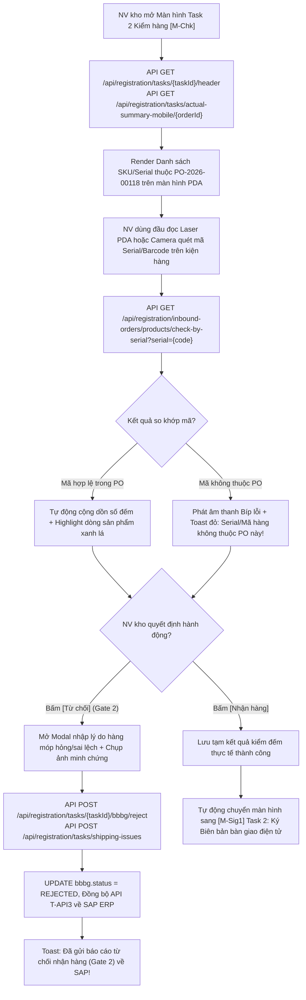

##### B. Bảng mô tả chi tiết các bước tác nghiệp & Xử lý hệ thống:

| Bước | Tác nhân | Hành động người dùng | Phản ứng hệ thống & Xử lý API / CSDL | Xử lý Ngoại lệ / Validation |
|:---:|---|---|---|---|
| **1** | NV kho | Quét mã Serial/Barcode/RFID kiện hàng | • NV bấm nút bấm cứng PDA hoặc nút Camera `btn_camera_scan` để quét mã kiện. • Gọi API `GET /api/registration/inbound-orders/products/check-by-serial?serial={code}`. • Nếu mã khớp PO: Tự động cuộn đến dòng sản phẩm tương ứng, tăng số đếm thực tế `received_quantity` và highlight viền xanh. • Nếu mã không khớp: Phát âm thanh cảnh báo Bíp lỗi và hiển thị Toast đỏ. | Chặn nhập trùng Serial đã được scan trước đó (Tránh đếm trùng). |
| **2** | NV kho | Xin gia hạn KPI (Tùy chọn) | Bấm nút **[Gia hạn KPI]** $\rightarrow$ Mở Popup nhập số phút gia hạn + lý do $\rightarrow$ Gọi API `POST /api/registration/tasks/{taskId}/extend-kpi`. Cập nhật `sla_due_at`. | Validation: Lý do gia hạn không được để trống. |
| **3a** | NV kho | Bấm nút **[Từ chối]** (Gate 2 Rejection) | • Mở Dialog nhập lý do từ chối nhận hàng (móp hỏng, biến dạng, sai SKU) + Nút mở Camera chụp ảnh minh chứng. • Gọi API `POST /api/registration/tasks/{taskId}/bbbg/reject` & `POST /api/registration/tasks/shipping-issues`. • Cập nhật `bbbg.status = 'REJECTED'`, phát bản tin **`T-API3`** gửi báo cáo từ chối về SAP. | Yêu cầu bắt buộc chụp ít nhất 1 ảnh minh chứng móp hỏng. |
| **3b** | NV kho | Bấm nút **[Nhận hàng]** | • Kiểm tra toàn bộ dòng hàng đã kiểm đếm xong. • Lưu tạm kết quả kiểm đếm thực nhận. • Tự động chuyển hướng màn hình sang `[M-Sig1]` (Task 2: Ký Biên bản bàn giao điện tử). | Nếu chưa kiểm đếm dòng nào ➔ Cảnh báo: "Vui lòng quét kiểm đếm ít nhất 1 mặt hàng trước khi chuyển sang ký BBBG". |

#### ⑤ Đánh giá & Rà soát độ phủ Dữ liệu API Mobile (Mobile API Gap Analysis)

Qua rà soát đối chiếu giao diện Mobile Kiểm hàng (`N4_Kiem_hang.png`) với Bộ tài liệu tra cứu API Swagger local [API_AND_DB_FULL_REFERENCE.md](file:///c:/Users/quantm18/Desktop/New%20folder/Project_Management/dev/api-specs/API_AND_DB_FULL_REFERENCE.md), hệ thống ghi nhận **3 điểm tối ưu API DTO chuyên biệt cho Ứng dụng Di động**:

> [!IMPORTANT]
> **Các khuyến nghị bổ sung DTO cho Mobile App:**
> 1. **Cache Bảng Mapping Serial Local (Offline First):** Đối với các đơn hàng lớn (hàng trăm dòng), việc bắn API HTTP `check-by-serial` mỗi khi quét 1 Serial sẽ gây độ trễ mạng (latency). Đề xuất API `GET /api/registration/tasks/actual-summary-mobile/{orderId}` trả về sẵn toàn bộ mảng Serial/Barcode thuộc PO để Mobile App lưu vào bộ nhớ cache local và validate instant client-side.
> 2. **Trả về `orderProductId` khi Check Serial:** API `check-by-serial` cần trả thêm `orderProductId` để di động tự động scroll (auto-scroll) và focus đúng thẻ sản phẩm đang quét trên UI ListView.
> 3. **Thanh Thống kê Tiến độ Kiểm đếm (Progress Counter Bar):** Đề xuất DTO trả về tổng số dòng đã kiểm đếm xong `checkedLinesCount` và tổng số cái `checkedQty` để hiển thị thanh tiến độ `Đã kiểm: 4/6 dòng (600/800 cái)` trên Header.

---

### 3.1.5. [M-Sig1] Task 2 (tiếp): Ký Biên bản bàn giao điện tử

#### ① Thông tin chung

| Mục | Nội dung |
|---|---|
| **Tên chức năng** | **Task 2 (tiếp): Ký Biên bản bàn giao điện tử trên Mobile** (`E-BBBG Digital Signature - Mobile App`) |
| **Mã màn hình** | `SCR-MOB-BBBG-SIGN-01` |
| **Mã Task** | `[M-Sig1]` / `[T-Ho]` |
| **Actor (Tác nhân)** | Thủ kho (`ROLE_WAREHOUSE_MASTER`), Nhân viên kho (`ROLE_WAREHOUSE_WORKER`), Đại diện NCC / Lái xe (`ROLE_PARTNER`) |
| **Mô tả** | Cho phép Thủ kho / NV kho và Lái xe đại diện Nhà cung cấp xem trước file PDF Biên bản bàn giao (BBBG), ký trực tiếp bằng chữ ký cảm ứng tay trên màn hình di động (Touch Canvas Base64) hoặc chụp/upload ảnh bản cứng BBBG đã ký tay. Hoàn thành màn hình này sẽ gọi API **`T-API4`** đẩy dữ liệu BBBG sang SAP để khởi tạo Mã phiếu nhập kho (Material Doc Mvt 101), chuyển Task 2 sang `COMPLETED` và tự động mở khóa Task 3 (`[M-Mv1]`). |
| **Đường dẫn** | Màn hình Kiểm hàng `[M-Chk]` $\rightarrow$ Bấm [Nhận hàng] $\rightarrow$ Màn hình Ký BBBG `[M-Sig1]`. |
| **Phân quyền & Miền dữ liệu** | • **Thực hiện:** Thủ kho (`ROLE_WAREHOUSE_MASTER`), NV kho (`ROLE_WAREHOUSE_WORKER`), Đối tác/Lái xe (`ROLE_PARTNER`). • **Miền dữ liệu:** Biên bản bàn giao thuộc Lệnh nhập kho hiện tại. |

#### ② Màn hình

- **Link file ảnh UIUX:** [N5_Ky_BBBG.png](file:///c:/Users/Admin/Desktop/ai-agent-wms/UIUX/Mobile/Nhap_Kho/N5_Ky_BBBG.png)

- **Mô tả chi tiết giao diện:**
  1. **Header Bar Đỏ (Top App Bar):**
     - Nút tròn Back (Quay lại Màn hình Kiểm hàng theo PO `[M-Chk]`).
     - Tiêu đề màn hình: `Ký Biên bản bàn giao`.
     - Sub-title: Mã biên bản bàn giao điện tử `BBBG-2026/05/18-021`.
  2. **Card Xem Trước File PDF BBBG (PDF Preview Card):**
     - Tiêu đề card collapsible: Icon tài liệu màu đỏ `Xem trước PDF BBBG`.
     - Khung nét đứt nhạt xem trước thông tin file: Icon PDF lớn màu đỏ, Tên file `BBBG-2026/05/18-021.pdf`, Dung lượng `2 trang · 245 KB`.
     - Nhóm 2 nút lệnh thao tác file:
       - Nút `Tải về` (Nền trắng, viền đỏ, chữ đỏ kèm Icon Download).
       - Nút `In` (Outline màu xám kèm Icon Printer).
  3. **Khung Vẽ Chữ Ký Điện Tử & Upload Ảnh (Digital Signature Box Card):**
     - **Vùng vẽ chữ ký tay (Touch Canvas Box):** Khung nét đứt màu xám viền bo tròn, hiển thị Icon bút chì `Bấm để thêm chữ ký`, Sub-text hướng dẫn `Upload ảnh hoặc chụp ảnh`. Người dùng sử dụng ngón tay hoặc bút cảm ứng vẽ trực tiếp chữ ký lên màn hình.
     - **Option đính kèm ảnh bản cứng:** Nút dlink `Upload ảnh BB ký tay` (mở camera chụp ảnh chứng từ giấy).
     - Badge hiển thị trạng thái ký 2 bên: Tag xanh `Thủ kho: Đã ký` & Tag tím `Lái xe: Đã ký`.
  4. **Thanh Nút Lệnh Dưới Cùng (Bottom Action Bar):**
     - Button `Hoàn thành` (Full-width Solid Red Primary Button kèm Icon Check `✓` trắng).

#### ③ Bảng 6 Cột Thành Phần UI & Ánh Xạ API / CSDL (Control Matrix)

| STT | Tên Control | Kiểu Control / Kiểu Dữ Liệu | Input / Output | API Phương Thức & Endpoint | Ánh Xạ CSDL (`bảng.cột`) | Mô Tả Chi Tiết, Validation & Quy Tắc Hiển Thị |
|:---:|:---|:---|:---:|:---|:---|:---|
| **I** | **TOP APP BAR & HEADER CONTROLS** | | | | | |
| 1 | `btn_back` | Round Back Icon Button | Input | Router Navigation | N/A | Click quay lại Màn hình Kiểm hàng theo PO `[M-Chk]`. |
| 2 | `lbl_header_title` | Bold Text / String | Output | Static Config | N/A | Tiêu đề màn hình di động: `Ký Biên bản bàn giao`. |
| 3 | `lbl_bbbg_code_header` | Sub-title Text / String | Output | `GET /api/registration/inbound-orders/{orderId}/documents` | `document.code`, `bbbg.code` | Mã BBBG điện tử sinh tự động (VD: `BBBG-2026/05/18-021`). |
| **II** | **PDF PREVIEW CARD CONTROLS** | | | | | |
| 5 | `btn_download_pdf` | Border Red Button | Input/Trigger | `GET /api/registration/inbound-orders/{orderId}/documents/download` | Binary PDF Stream | Label: `Tải về`. Tải trực tiếp file PDF BBBG về bộ nhớ di động. |
| 6 | `btn_print_pdf` | Outline Gray Button | Input/Trigger | Hardware Mobile Printer API | N/A | Label: `In`. Gửi lệnh in file BBBG trực tiếp sang máy in Wi-Fi/Bluetooth. |
| **III** | **TOUCH CANVAS & SIGNATURE CONTROLS** | | | | | |
| 7 | `box_signature_canvas` | Touch Canvas Component | Input | `POST /api/registration/tasks/{taskId}/bbbg/signatures` | `bbbg_signature.signature_data_base64` | Khung nét đứt vẽ chữ ký cảm ứng tay (Base64 PNG). |
| 8 | `btn_upload_paper_bbbg` | Link Icon Button | Input/Trigger | `POST /api/registration/tasks/{taskId}/bbbg/signatures` | `attachment.file_url` | Label: `Upload ảnh BB ký tay`. Mở Camera chụp ảnh hoặc chọn ảnh bản cứng từ thư viện. |
| 9 | `badge_signer_status` | Status Tag Badge | Output | `GET /api/registration/tasks/{taskId}/bbbg/signatures/status` | `bbbg_signature.sign_status` | Tag trạng thái chữ ký 2 bên (`Thủ kho: Đã ký` - Xanh, `Lái xe: Đã ký` - Tím). |
| **IV** | **BOTTOM ACTION & DIALOG CONTROLS** | | | | | |
| 10 | `btn_complete_bbbg` | Full Red Primary Button | Input/Trigger | `POST /api/registration/tasks/{taskId}/bbbg/complete` | UPDATE `bbbg.status` = 'COMPLETED', `task.status` = 2, Trigger `T-API4` | Label: `Hoàn thành` (kèm Icon Check). Chốt phát hành BBBG, hoàn tất Task 2 và gửi bản tin `T-API4` sang SAP. |
| 11 | `mdl_confirm_bbbg` | Confirm Modal Dialog | Input/Trigger | `POST /api/registration/tasks/{taskId}/bbbg/complete` | Form-data payload | Modal confirm: "Xác nhận phát hành BBBG-2026/05/18-021 & chốt nhận hàng?" + Nút `Đồng ý` & `Hủy`. |

#### ④ Luồng xử lý nghiệp vụ các bước tác nghiệp di động

##### A. Sơ đồ luồng hoạt động (Activity Flowchart):

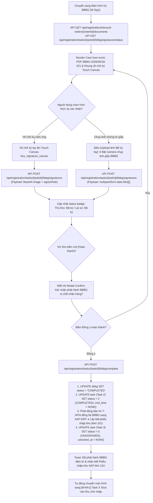

##### B. Bảng mô tả chi tiết các bước tác nghiệp & Xử lý hệ thống:

| Bước | Tác nhân | Hành động người dùng | Phản ứng hệ thống & Xử lý API / CSDL | Xử lý Ngoại lệ / Validation |
|:---:|---|---|---|---|
| **1** | Thủ kho / Lái xe | Xem trước nội dung PDF BBBG | • Hệ thống gọi API `GET /api/registration/inbound-orders/{orderId}/documents` lấy file BBBG. • Hiển thị khung xem trước file PDF kèm 2 nút `Tải về` (`GET /documents/download`) và nút `In` (Hardware Printer). | Báo lỗi nếu chưa sinh file BBBG chứng từ. |
| **2** | Thủ kho / Lái xe | Thực hiện ký chữ ký điện tử | • **Option A (Chữ ký tay cảm ứng):** Vẽ trực tiếp lên `box_signature_canvas` $\rightarrow$ Gọi API `POST /api/registration/tasks/{taskId}/bbbg/signatures` đẩy chuỗi Base64. • **Option B (Ảnh chụp giấy):** Bấm `btn_upload_paper_bbbg` chụp ảnh $\rightarrow$ Gọi API `POST /api/registration/tasks/{taskId}/bbbg/signatures` dạng `multipart/form-data`. • Cập nhật `bbbg_signature` (`sign_status = 'SIGNED'`, `signed_at = NOW()`). | Chặn bấm hoàn thành nếu chưa có chữ ký của ít nhất 1 bên. |
| **3** | Thủ kho | Bấm nút **[Hoàn thành]** | Mở Modal confirm dialog `mdl_confirm_bbbg` hiển thị: *"Xác nhận phát hành BBBG-2026/05/18-021 & chốt nhận hàng?"* | Chặn bấm nếu chữ ký lỗi format. |
| **4** | Thủ kho | Bấm **[Đồng ý hoàn thành]** | • Gọi API `POST /api/registration/tasks/{taskId}/bbbg/complete`. • **DB Update 1:** `UPDATE bbbg SET status = 'COMPLETED'`. • **DB Update 2:** `UPDATE task SET status = 2 (COMPLETED) WHERE id = taskId`. • **Tích hợp SAP (`T-API4`):** Phát động bản tin `T-API4` sang SAP để hạch toán `Nợ 152/156, Có 3388` và nhận Mã phiếu nhập kho (`Material Doc Mvt 101`). • **Mở khóa Task 3:** `UPDATE task SET status = 0 (UNASSIGNED) WHERE id_order = orderId AND task_type = 'STAGING_ENTRY'`. • Toast thông báo thành công và chuyển sang `[M-Mv1]` (Task 3: Đưa vào khu chờ nhập). | Nếu mất mạng khi phát động `T-API4` ➔ Lưu request vào Queue retry background, không làm gián đoạn tác nghiệp kho. |

#### ⑤ Đánh giá & Rà soát độ phủ Dữ liệu API Mobile (Mobile API Gap Analysis)

Qua rà soát đối chiếu giao diện Mobile Ký BBBG (`N5_Ky_BBBG.png`) với Bộ tài liệu tra cứu API Swagger local [API_AND_DB_FULL_REFERENCE.md](file:///c:/Users/quantm18/Desktop/New%20folder/Project_Management/dev/api-specs/API_AND_DB_FULL_REFERENCE.md), hệ thống ghi nhận **3 điểm tối ưu API DTO chuyên biệt cho Ứng dụng Di động**:

> [!IMPORTANT]
> **Các khuyến nghị bổ sung DTO cho Mobile App:**
> 1. **Ký số 2 vai trò song song (`signerRole`):** API `POST /api/registration/tasks/{taskId}/bbbg/signatures` cần truyền tham số `signerRole: 'ROLE_WAREHOUSE_MASTER' | 'ROLE_PARTNER'` để phân định chữ ký của Thủ kho hay của Tài xế lái xe NCC.
> 2. **Tự động chèn Chữ ký Base64 vào File PDF (Server-side Stamping):** Sau khi nhận API upload chữ ký, Backend service cần tự động đóng dấu (stamp) ảnh chữ ký Base64 vào đúng khung chân ký trên bản mẫu PDF BBBG trước khi trả về cho API `documents/download`.
> 3. **Nhận Mã Phiếu Nhập Kho SAP (`grDocumentNo`) tức thì:** Response của API `POST /api/registration/tasks/{taskId}/bbbg/complete` cần trả về trực tiếp mã chứng từ SAP vừa tạo (VD: `grDocumentNo: "101-2026-889900"`) để hiển thị thông báo Toast ăn mừng trên Mobile App.

---

### 3.1.6. [M-Mv1] Task 3: Đưa vào khu chờ nhập trên Mobile

#### ① Thông tin chung

| Mục | Nội dung |
|---|---|
| **Tên chức năng** | **Task 3: Đưa vào khu chờ nhập trên Mobile** (`Inbound Staging Zone Transfer Task - Mobile App`) |
| **Mã màn hình** | `SCR-MOB-MOVE-WAIT-01` |
| **Mã Task** | `[M-Mv1]` / `[T-Mv1]` |
| **Actor (Tác nhân)** | Nhân viên kho (`ROLE_WAREHOUSE_WORKER`) |
| **Mô tả** | Cho phép Nhân viên kho di chuyển các đơn vị xử lý hàng hóa (Handling Unit - HU, gồm thùng carton, pallet) từ bãi hạ hàng Staging Dock vào vị trí bãi lưu tạm Khu chờ nhập kho (`C02-Wait`). Hỗ trợ quét & gán thẻ chip RFID cho từng HU bằng đầu đọc di động cầm tay (Handheld RFID Reader), xác nhận vị trí bãi lưu tạm và chốt hoàn tất Task 3 để chuyển sang trạng thái chờ bản tin KCS từ SAP (**`T-API5`**). |
| **Đường dẫn** | Navigation: `Danh sách Task nhập kho` $\rightarrow$ Select Task 3 Khu chờ nhập $\rightarrow$ Màn hình `[M-Mv1]`. |
| **Phân quyền & Miền dữ liệu** | • **Thực hiện:** NV kho (`ROLE_WAREHOUSE_WORKER`). • **Miền dữ liệu:** Task thuộc kho làm việc hiện tại của NV kho. |

#### ② Màn hình

- **Link file ảnh UIUX:** [N8.5_Khu_cho_nhap.png](file:///c:/Users/Admin/Desktop/ai-agent-wms/UIUX/Mobile/Nhap_Kho/N8.5_Khu_cho_nhap.png)

- **Mô tả chi tiết giao diện:**
  1. **Header Bar Đỏ (Top App Bar):**
     - Nút tròn Back (Quay lại danh sách task).
     - Tiêu đề màn hình: `Khu chờ nhập`.
     - Sub-title: `INB-2026-00118 · 5 HU`.
     - Nút viền bo tròn: `Gia hạn KPI` (Mở modal xin gia hạn thời gian chuyển bãi).
  2. **Danh sách Thẻ Đơn Vị Đóng Gói HU (Handling Unit Cards ListView):**
     - Màn hình hiển thị danh sách các thẻ HU cần chuyển vào bãi Staging:
       - **Thẻ HU 1:** Mã HU `HU-10211` (Màu đỏ nổi bật), Tên sản phẩm `Galaxy A15 128GB`, Ô thông tin Loại thùng `Carton 50`, Ô mã RFID chip `RFID-10211-A1`.
       - **Thẻ HU 2:** Mã HU `HU-10212`, Tên sản phẩm `Galaxy A25 256GB`, Loại thùng `Carton 50`, Mã RFID chip `RFID-10212-A1`.
       - **Thẻ HU 3:** Mã HU `HU-10213`, Tên sản phẩm `Tai nghe Buds Pro`, Loại thùng `Carton 25`, Mã RFID chip `RFID-10213-B2`.
       - **Thẻ HU 4:** Mã HU `HU-10214`, Tên sản phẩm `Cáp sạc USB-C 1m`, Loại thùng `Carton 100`, Mã RFID chip `RFID-10214-C3`.
       - **Thẻ HU 5:** Mã HU `HU-10215`, Tên sản phẩm `Keo dán chuyên dụng`, Loại thùng `Carton 100`, Mã RFID chip `RFID-10215-E5`.
  3. **Thanh Nút Lệnh Dưới Cùng (Bottom Action Bar):**
     - Button `Hoàn thành` (Full-width Solid Red Primary Button kèm Icon Check `✓` trắng).

#### ③ Bảng 6 Cột Thành Phần UI & Ánh Xạ API / CSDL (Control Matrix)

| STT | Tên Control | Kiểu Control / Kiểu Dữ Liệu | Input / Output | API Phương Thức & Endpoint | Ánh Xạ CSDL (`bảng.cột`) | Mô Tả Chi Tiết, Validation & Quy Tắc Hiển Thị |
|:---:|:---|:---|:---:|:---|:---|:---|
| **I** | **TOP APP BAR & HEADER CONTROLS** | | | | | |
| 1 | `btn_back` | Round Back Icon Button | Input | Router Navigation | N/A | Click quay lại Màn hình trước / Danh sách Task. |
| 2 | `lbl_header_title` | Bold Text / String | Output | Static Config | N/A | Tiêu đề màn hình di động: `Khu chờ nhập`. |
| 3 | `lbl_hu_header_info` | Sub-title Text / String | Output | `GET /api/registration/tasks/{taskId}/header` | `"order".order_code`, `COUNT(handling_unit.id)` | Chuỗi ghép thông tin: `{OrderCode} · {HuCount} HU` (VD: `INB-2026-00118 · 5 HU`). |
| 4 | `btn_extend_kpi` | Pill White Button / Trigger | Input | `POST /api/registration/tasks/{taskId}/extend-kpi` | UPDATE `task.sla_due_at`, `task.extend_reason` | Label: `Gia hạn KPI`. Mở dialog xin gia hạn thời gian chuyển hàng vào khu chờ nhập. |
| **II** | **HANDLING UNITS LIST CONTROLS** | | | | | |
| 5 | `lst_hu_cards` | Vertical ListView / Array | Output | `POST /api/registration/handling-units/list-hu` | Bảng `handling_unit` JOIN `handling_unit_item` | Danh sách các thẻ đơn vị đóng gói HU (Carton/Pallet) cần di chuyển vào bãi Staging. |
| 6 | `col_hu_code` | Red Bold Text / String [50] | Output | `POST /api/registration/handling-units/list-hu` | `handling_unit.code` | Mã định danh đơn vị đóng gói HU (VD: `HU-10211`, `HU-10212`). |
| 7 | `col_product_name` | Bold Text / String [255] | Output | `POST /api/registration/handling-units/list-hu` | `product.name` | Tên mặt hàng/vật tư chứa bên trong HU (VD: `Galaxy A15 128GB`, `Tai nghe Buds Pro`). |
| 8 | `txt_carton_type` | Readonly Input Box / String | Output | `POST /api/registration/handling-units/list-hu` | `handling_unit.container_type` | Quy cách đóng gói đại diện (VD: `Carton 50`, `Carton 25`, `Carton 100`). |
| 9 | `txt_rfid_code` | Search Textbox / String [50] | Input/Output | `POST /api/registration/inbound-orders/{orderId}/rfid/generate` | `handling_unit.rfid_code` | Mã thẻ Chip RFID đại diện gán cho HU (VD: `RFID-10211-A1`). Tự động đọc từ đầu đọc RFID di động. |
| **III** | **BOTTOM ACTION & DIALOG CONTROLS** | | | | | |
| 10 | `btn_complete_move_wait` | Full Red Primary Button | Input/Trigger | `POST /api/registration/tasks/{taskId}/staging-area-entry/complete` HOẶC `waiting-area/complete` | UPDATE `task.status` = 2, `task.end_time` = NOW(), UPDATE `handling_unit.status` = 'CREATED' | Label: `Hoàn thành` (kèm Icon Check `✓`). Chốt vị trí bãi Staging `C02-Wait` cho các HU và hoàn thành Task 3. |
| 11 | `mdl_confirm_move_wait` | Confirm Modal Dialog | Input/Trigger | `POST /api/registration/tasks/{taskId}/staging-area-entry/complete` | Form-data (`files[]` ảnh đính kèm) | Dialog confirm: "Xác nhận chuyển 5 HU vào bãi Staging C02-Wait?" + Nút `Đồng ý` & `Hủy`. |

#### ④ Luồng xử lý nghiệp vụ các bước tác nghiệp di động

##### A. Sơ đồ luồng hoạt động (Activity Flowchart):

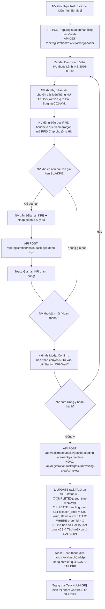

##### B. Bảng mô tả chi tiết các bước tác nghiệp & Xử lý hệ thống:

| Bước | Tác nhân | Hành động người dùng | Phản ứng hệ thống & Xử lý API / CSDL | Xử lý Ngoại lệ / Validation |
|:---:|---|---|---|---|
| **1** | NV kho | Mở Màn hình Task 3 Khu chờ nhập `[M-Mv1]` | • Gọi API `POST /api/registration/handling-units/list-hu` lấy danh sách HU. • Render 5 thẻ HU kèm thông tin loại thùng (`Carton 50`, `Carton 25`...) và mã RFID chip đại diện. | Nếu chưa sinh danh sách HU ➔ Tự động sinh HU mặc định theo dòng hàng `order_product`. |
| **2** | NV kho | Di chuyển HU vào Bãi Staging `C02-Wait` | NV kho dùng xe nâng/xe kéo tay di chuyển 5 HU từ Dock hạ hàng vào khu vực chờ nhập `C02-Wait`. | Cảnh báo nếu đưa nhầm sang bãi Staging của lệnh nhập khác. |
| **3** | NV kho | Quét/gán thẻ RFID qua Đầu đọc Handheld | Bật ăng-ten đầu đọc RFID di động ➔ Đọc sóng vô tuyến thẻ chip dán trên thùng ➔ Tự động khớp và điền mã `rfid_code` vào ô `txt_rfid_code`. | Nếu mã RFID chưa được gán ➔ Cho phép bấm phát sinh mã `POST /api/registration/inbound-orders/{orderId}/rfid/generate`. |
| **4** | NV kho | Bấm nút **[Hoàn thành]** | Mở Modal confirm dialog `mdl_confirm_move_wait` hiển thị tóm tắt: *"Xác nhận chuyển 5 HU vào bãi Staging C02-Wait?"* | Chặn bấm nếu có HU chưa được gán mã RFID chip. |
| **5** | NV kho | Bấm **[Đồng ý hoàn thành]** | • Gọi API `POST /api/registration/tasks/{taskId}/staging-area-entry/complete` (hoặc `/waiting-area/complete`). • **DB Update 1:** `UPDATE task SET status = 2 (COMPLETED), end_time = NOW() WHERE id = taskId`. • **DB Update 2:** `UPDATE handling_unit SET location_code = 'C02-Wait', status = 'CREATED' WHERE order_id = orderId`. • **Chờ KCS SAP:** Task 4 (`T-AGR`) ở trạng thái chờ nhận bản tin **`T-API5`** từ SAP ERP. • Toast thông báo thành công và quay lại màn hình Command Center Task. | Nếu mất kết nối mạng ➔ Lưu dữ liệu vị trí bãi vào Local Storage offline, tự động đồng bộ khi có sóng Wi-Fi kho. |

#### ⑤ Đánh giá & Rà soát độ phủ Dữ liệu API Mobile (Mobile API Gap Analysis)

Qua rà soát đối chiếu giao diện Mobile Khu chờ nhập (`N8.5_Khu_cho_nhap.png`) với Bộ tài liệu tra cứu API Swagger local [API_AND_DB_FULL_REFERENCE.md](file:///c:/Users/quantm18/Desktop/New%20folder/Project_Management/dev/api-specs/API_AND_DB_FULL_REFERENCE.md), hệ thống ghi nhận **3 điểm tối ưu API DTO chuyên biệt cho Ứng dụng Di động**:

> [!IMPORTANT]
> **Các khuyến nghị bổ sung DTO cho Mobile App:**
> 1. **Quét Thẻ RFID Hàng Loạt (Bulk RFID Scanning DTO):** Đầu đọc RFID handheld có thể đọc đồng thời 5-10 thẻ chip cùng lúc. DTO của API `list-hu` nên hỗ trợ nhận mảng `rfidCodes: string[]` để Mobile App lọc match nhanh toàn bộ danh sách HU ngay khi người dùng bóp cò đầu đọc RFID.
> 2. **Cập nhật Vị trí Bãi Staging (`locationCode`):** API complete Task 3 cần nhận tham số `targetLocationCode: "C02-Wait"` để cập nhật chính xác vị trí lưu bãi của từng HU vào bảng `handling_unit`.
> 3. **Nhãn Trạng thái Chờ KCS từ SAP:** Khi Task 3 hoàn thành, Task 4 (`T-AGR`) phụ thuộc vào sự kiện SAP gửi bản tin **`T-API5`**. Mobile App DTO của Task 4 cần trả về cờ `waitingKcsSync: true` để hiển thị nhãn màu vàng `Chờ kết quả KCS từ SAP ERP` trên UI.

---

### 3.1.7. [M-KCS] Task 4: Kết quả KCS trên Mobile

#### ① Thông tin chung

| Mục | Nội dung |
|---|---|
| **Tên chức năng** | **Task 4: Kết quả KCS trên Mobile** (`KCS Inspection Results Task - Mobile App`) |
| **Mã màn hình** | `SCR-MOB-KCS-RESULT-01` |
| **Mã Task** | `[M-KCS]` / `[T-KCS]` / `[T-AGR]` |
| **Actor (Tác nhân)** | Thủ kho (`ROLE_WAREHOUSE_MASTER`) |
| **Mô tả** | Cho phép Thủ kho xem báo cáo tổng hợp kết quả kiểm định chất lượng KCS dội về từ SAP ERP bản tin **`T-API5`** (bao gồm danh mục bóc tách mã Cha $\rightarrow$ Mã Con, phân loại Hàng Đạt vs Hàng Không Đạt cùng tổng trị giá tài sản tiền tỷ), xác nhận Kết quả KCS và chốt tồn kho chính thức trên SAP ERP (**`T-API6`**) với trạng thái Tồn khả dụng (`UU - Unrestricted Use`) cho hàng Đạt và Tồn khóa KCS (`Blocked Stock`) cho hàng lỗi. |
| **Đường dẫn** | Navigation: `Danh sách Task nhập kho` $\rightarrow$ Select Task 4 Kết quả KCS $\rightarrow$ Màn hình `[M-KCS]`. |
| **Phân quyền & Miền dữ liệu** | • **Thực hiện:** Thủ kho (`ROLE_WAREHOUSE_MASTER`). • **Miền dữ liệu:** Task thuộc kho làm việc quản lý. |

#### ② Màn hình

- **Link file ảnh UIUX:** [N6_Thuc_nhap.png](file:///c:/Users/Admin/Desktop/ai-agent-wms/UIUX/Mobile/Nhap_Kho/N6_Thuc_nhap.png)

- **Mô tả chi tiết giao diện:**
  1. **Header Bar Đỏ (Top App Bar):**
     - Nút tròn Back (Quay lại danh sách task).
     - Tiêu đề màn hình: `Kết quả KCS`.
     - Sub-title: `INB-2026-00118 · Gửi SAP`.
  2. **Khung Tổng Hợp KCS (KCS 2 Summary Cards):**
     - **Thẻ Hàng Đạt KCS (Khung viền xanh lá):** Icon tích xanh `✓`, Tiêu đề `3 dòng`, Thông số chi tiết `2,796 cái · 488.5 kg · 1.43 m³`, Tag giá trị tiền tài sản xanh `Trị giá: 4.03 tỷ`.
     - **Thẻ Hàng Không Đạt KCS (Khung viền đỏ):** Icon X đỏ `✕`, Tiêu đề `3 dòng`, Thông số chi tiết `9 cái · 1 kg · 0.005 m³`, Tag giá trị tiền tài sản đỏ `Trị giá: 16.0 triệu`.
  3. **Danh sách Thẻ Hàng Hóa Nghiệm Thu KCS (Detailed KCS Cards ListView):**
     - Màn hình hiển thị danh sách bóc tách chi tiết mặt hàng Đạt / Không đạt:
       - **Thẻ 1:** `Galaxy A15 128GB` (Badge xanh `Đạt`, SKU `SP-A001`, Mã RFID `RFID-0001-A1`, Tag giá trị `4.00 tỷ`).
       - **Thẻ 2:** `Galaxy A25 256GB` (Badge hồng `Không đạt`, Tag giá trị `3.60 tỷ`, Dòng đếm tách biệt: `Đạt: 598 cái · 180 kg` | `Không đạt: 2 cái · 0.6 kg`).
       - **Thẻ 3:** `Tai nghe Buds Pro` (Badge hồng `Không đạt`, Tag giá trị `2.40 tỷ`, Dòng đếm tách biệt: `Đạt: 1195 cái · 48 kg` | `Không đạt: 5 cái · 0.2 kg`).
       - **Thẻ 4:** `Cáp sạc USB-C 1m` (Badge xanh `Đạt`, Số lượng `50`, Tag giá trị `10.0 triệu`).
       - **Thẻ 5:** `Ống lót máy` (Badge hồng `Không đạt`, Tag giá trị `60.0 triệu`, Dòng đếm: `Đạt: 118 cái` | `Không đạt: 2 cái`).
       - **Thẻ 6:** `Keo dán chuyên dụng` (Badge xanh `Đạt`, Số lượng `35`, Tag giá trị `15.0 triệu`).
  4. **Thanh Nút Lệnh Dưới Cùng (Bottom Action Bar):**
     - Button `Hoàn thành` (Full-width Solid Red Primary Button kèm Icon Check `✓` trắng).

#### ③ Bảng 6 Cột Thành Phần UI & Ánh Xạ API / CSDL (Control Matrix)

| STT | Tên Control | Kiểu Control / Kiểu Dữ Liệu | Input / Output | API Phương Thức & Endpoint | Ánh Xạ CSDL (`bảng.cột`) | Mô Tả Chi Tiết, Validation & Quy Tắc Hiển Thị |
|:---:|:---|:---|:---:|:---|:---|:---|
| **I** | **TOP APP BAR & HEADER CONTROLS** | | | | | |
| 1 | `btn_back` | Round Back Icon Button | Input | Router Navigation | N/A | Click quay lại Màn hình trước / Danh sách Task. |
| 2 | `lbl_header_title` | Bold Text / String | Output | Static Config | N/A | Tiêu đề màn hình di động: `Kết quả KCS`. |
| 3 | `lbl_sap_sync_header` | Sub-title Text / String | Output | `GET /api/registration/tasks/{taskId}/header` | `"order".order_code`, `actual_received_sap_log.status` | Chuỗi ghép thông tin Header: `{OrderCode} · {SapStatus}` (VD: `INB-2026-00118 · Gửi SAP`). |
| **II** | **KCS SUMMARY CARDS CONTROLS** | | | | | |
| 4 | `card_kcs_pass_summary` | Green Summary Card | Output | `GET /api/registration/inbound-orders/{orderId}/kcs-results` | `SUM(passed_quantity)`, `SUM(passed_weight)`, `SUM(passed_volume)` | Card màu xanh lá tổng hợp Hàng Đạt KCS: Số dòng (`3 dòng`), Tổng SL/Khối lượng/Thể tích (`2,796 cái · 488.5 kg · 1.43 m³`) & Tag giá trị (`Trị giá: 4.03 tỷ`). |
| 5 | `card_kcs_fail_summary` | Red Summary Card | Output | `GET /api/registration/inbound-orders/{orderId}/kcs-results` | `SUM(failed_quantity)`, `SUM(failed_weight)`, `SUM(failed_volume)` | Card màu đỏ tổng hợp Hàng Không Đạt KCS: Số dòng (`3 dòng`), Tổng SL/Khối lượng/Thể tích (`9 cái · 1 kg · 0.005 m³`) & Tag giá trị (`Trị giá: 16.0 triệu`). |
| **III** | **KCS ITEMS DETAILED CARDS CONTROLS** | | | | | |
| 6 | `lst_kcs_items` | Vertical ListView / Array | Output | `GET /api/registration/inbound-orders/{orderId}/kcs-results` | Bảng `task` JOIN `actual_received_sap_log` / `order_product` | Danh sách các thẻ bóc tách chi tiết kết quả KCS từ SAP ERP (`T-API5`). |
| 7 | `col_pass_fail_badge` | Status Tag Badge | Output | `GET /api/registration/inbound-orders/{orderId}/kcs-results` | `kcs_result` (`DAT` / `KHONG_DAT`) | Badge tag màu xanh `Đạt` hoặc màu hồng `Không đạt`. |
| 8 | `col_item_value_text` | Blue Bold Text / String | Output | `GET /api/registration/inbound-orders/{orderId}/kcs-results` | `order_product.asset_value` | Hiển thị tổng giá trị tài sản vật tư (VD: `Trị giá: 4.00 tỷ`, `3.60 tỷ`). |
| 9 | `col_split_qty_details` | Sub-text Detail / String | Output | `GET /api/registration/inbound-orders/{orderId}/kcs-results` | `passed_quantity`, `failed_quantity` | Với các dòng có hàng lỗi: Hiển thị chi tiết số đếm `Đạt: 598 cái · 180 kg` vs `Không đạt: 2 cái · 0.6 kg`. |
| **IV** | **BOTTOM ACTION & DIALOG CONTROLS** | | | | | |
| 10 | `btn_complete_kcs_task` | Full Red Primary Button | Input/Trigger | `POST /api/registration/tasks/{taskId}/actual-receipt/complete` | UPDATE `task.status` = 2, Trigger `T-API6` | Label: `Hoàn thành` (kèm Icon Check `✓`). Xác nhận Kết quả KCS, chốt tồn kho SAP (UU / Blocked) và phát động bản tin `T-API6`. |
| 11 | `mdl_confirm_kcs_task` | Confirm Modal Dialog | Input/Trigger | `POST /api/registration/tasks/{taskId}/actual-receipt/complete` | Form-data payload | Modal confirm: "Xác nhận chốt Kết quả KCS và gửi bản tin T-API6 sang SAP ERP?" + Nút `Đồng ý` & `Hủy`. |

#### ④ Luồng xử lý nghiệp vụ các bước tác nghiệp di động

##### A. Sơ đồ luồng hoạt động (Activity Flowchart):

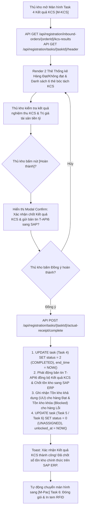

##### B. Bảng mô tả chi tiết các bước tác nghiệp & Xử lý hệ thống:

| Bước | Tác nhân | Hành động người dùng | Phản ứng hệ thống & Xử lý API / CSDL | Xử lý Ngoại lệ / Validation |
|:---:|---|---|---|---|
| **1** | Thủ kho | Mở Màn hình Task 4 Kết quả KCS `[M-KCS]` | • Gọi API `GET /api/registration/inbound-orders/{orderId}/kcs-results` lấy dữ liệu KCS từ bản tin `T-API5` SAP. • Render 2 Thẻ Thống kê Hàng Đạt (Xanh) vs Hàng Không Đạt (Đỏ) cùng trị giá tài sản tiền tỷ. | Báo lỗi nếu SAP chưa dội bản tin KCS `T-API5` về. |
| **2** | Thủ kho | Kiểm tra số liệu đối soát KCS | Thủ kho đối soát số lượng Đạt, Không đạt và tổng trị giá tiền tài sản hiển thị trên thẻ sản phẩm. | Cho phép xem lịch sử log gửi SAP qua API `/sap-logs`. |
| **3** | Thủ kho | Bấm nút **[Hoàn thành]** | Mở Modal confirm dialog `mdl_confirm_kcs_task` hiển thị tóm tắt: *"Xác nhận chốt Kết quả KCS & phát động T-API6 sang SAP ERP?"* | Chặn bấm nếu chưa kiểm tra KCS. |
| **4** | Thủ kho | Bấm **[Đồng ý hoàn thành]** | • Gọi API `POST /api/registration/tasks/{taskId}/actual-receipt/complete`. • **DB Update 1:** `UPDATE task SET status = 2 (COMPLETED), end_time = NOW() WHERE id = taskId`. • **Tích hợp SAP (`T-API6`):** Phát động bản tin `T-API6` cập nhật tồn kho chính thức sang SAP (Chuyển trạng thái tồn kho thành `UU - Unrestricted Use` cho hàng Đạt và `Blocked Stock` cho hàng lỗi). • **Mở khóa Task tiếp:** `UPDATE task SET status = 0 (UNASSIGNED)` cho Task đóng gói / putaway. • Toast thông báo thành công và chuyển sang `[M-Pac]` (Task 6: Đóng gói & In tem RFID). | Lưu log vào `actual_received_sap_log` để retry nếu mất kết nối SAP ERP. |

#### ⑤ Đánh giá & Rà soát độ phủ Dữ liệu API Mobile (Mobile API Gap Analysis)

Qua rà soát đối chiếu giao diện Mobile Kết quả KCS (`N6_Thuc_nhap.png`) với Bộ tài liệu tra cứu API Swagger local [API_AND_DB_FULL_REFERENCE.md](file:///c:/Users/quantm18/Desktop/New%20folder/Project_Management/dev/api-specs/API_AND_DB_FULL_REFERENCE.md), hệ thống ghi nhận **3 điểm tối ưu API DTO chuyên biệt cho Ứng dụng Di động**:

> [!IMPORTANT]
> **Các khuyến nghị bổ sung DTO cho Mobile App:**
> 1. **Chuỗi Định dạng Giá trị Tài sản (`formattedAssetValue`):** DTO của API `kcs-results` cần bổ sung các trường chuỗi đã format sẵn (`"4.03 tỷ"`, `"16.0 triệu"`) để Mobile App hiển thị nổi bật trên UI mà không cần tự viết hàm quy đổi đơn vị tiền tệ client-side.
> 2. **Phân rã Mã Cha $\rightarrow$ Mã Con (Sub-SKU Decomposition):** Trường hợp SAP bóc tách mã Cha thành các mã Con (bản tin `T-API5`), DTO cần trả ra cây quan hệ `parentSku` và `childSkus` để UI hiển thị phân cấp trực quan.
> 3. **Trạng thái Gửi SAP Real-time (`sapSyncStatus`):** Trả về cờ trạng thái đồng bộ SAP (`SYNCED` / `PENDING_RETRY`) để hiển thị sub-title `INB-2026-00118 · Gửi SAP` trên Header Bar.

---

### 3.1.8. [M-VOff] Trình ký VOffice Phiếu nhập kho trên Mobile

#### ① Thông tin chung

| Mục | Nội dung |
|---|---|
| **Tên chức năng** | **Trình ký VOffice Phiếu nhập kho trên Mobile** (`V-Office Goods Receipt Digital Signature - Mobile App`) |
| **Mã màn hình** | `SCR-MOB-VOFFICE-SUBMIT-01` |
| **Mã Task** | `[M-VOff]` / `[T-VOff]` |
| **Actor (Tác nhân)** | Thủ kho (`ROLE_WAREHOUSE_MASTER`), Giám đốc kho (`ROLE_WAREHOUSE_DIRECTOR`) |
| **Mô tả** | Cho phép Thủ kho xem trước file PDF Phiếu nhập kho (Goods Receipt - GR) và Biên bản bàn giao đính kèm, lựa chọn mẫu chân ký quy chuẩn Tập đoàn, cấu hình danh sách người duyệt ký số và cán bộ nhận thông báo, khởi tạo hồ sơ trình ký từ WMS di động gửi sang hệ thống Văn phòng điện tử Tập đoàn Viettel (V-Office) qua bản tin **`V-API1`**. Đồng thời hệ thống tự động lắng nghe bản tin Webhook Callback (**`V-API2`**) từ V-Office để cập nhật trạng thái phê duyệt và đồng bộ kết quả về SAP ERP (**`V-API3`**). |
| **Đường dẫn** | Navigation: `Chức năng Nhập kho` $\rightarrow$ Select Trình ký VOffice $\rightarrow$ Màn hình `[M-VOff]`. |
| **Phân quyền & Miền dữ liệu** | • **Thực hiện:** Thủ kho (`ROLE_WAREHOUSE_MASTER`), Giám đốc kho (`ROLE_WAREHOUSE_DIRECTOR`). • **Miền dữ liệu:** Phiếu nhập kho thuộc kho quản lý đã hoàn thành Thực nhập kho. |

#### ② Màn hình

- **Link file ảnh UIUX:** [N7_Ky_VOffice.png](file:///c:/Users/Admin/Desktop/ai-agent-wms/UIUX/Mobile/Nhap_Kho/N7_Ky_VOffice.png)

- **Mô tả chi tiết giao diện:**
  1. **Header Bar Đỏ (Top App Bar):**
     - Nút tròn Back (Quay lại danh sách task / phiếu nhập).
     - Tiêu đề màn hình: `Ký VOffice`.
     - Sub-title: `Phiếu nhập GR-2026/05/14-018`.
     - Nút viền bo tròn: `Gia hạn KPI` (Mở dialog xin gia hạn thời gian trình ký).
  2. **Card Xem Trước File & Tóm Tắt Hồ Sơ Trình Ký (Document & Submission Summary Card):**
     - **Vùng xem trước văn bản:** Icon file ký duyệt màu xanh lá, Tiêu đề file `Preview Phiếu nhập kho GR-2026/05/14-018 · 2 trang`.
     - Nhóm 2 nút mở file PDF:
       - Nút `Xem phiếu nhập` (Outline màu xám).
       - Nút `Xem BBBG` (Outline màu xám).
     - **Tóm tắt thông tin:** Số phiếu nhập `GR-2026/05/14-018`, Người trình `Trần Văn Kho`, Badge trạng thái trình ký màu cam `Chờ ký`.
  3. **Khối Lựa Chọn Mẫu Chân Ký & Danh Sách Cán Bộ (Sign Pattern & Users Selector):**
     - **Mẫu chân ký:** Dropdown Select `Mẫu 1 · 3 người ký` (Tự động tải theo cấu hình sơ đồ tổ chức).
     - **Khối DANH SÁCH NGƯỜI KÝ (3 người duyệt theo luồng):**
       - `#1`: `Trần Văn Kho - NV-001` (Thủ kho - Kho HN01).
       - `#2`: `Nguyễn Hữu An - NV-002` (Nhân viên KCS - Kho HN01).
       - `#3`: `Mai Thị Lan - NV-003` (Kế toán kho - Phòng TCKT).
     - **Khối DANH SÁCH NGƯỜI NHẬN (2 người nhận thông báo):**
       - `#1`: `Lê Văn Tiến - NV-101` (Giám đốc kho - Ban Giám đốc).
       - `#2`: `Hoàng Thị Mai - NV-102` (Trưởng phòng KSNB - Phòng KSNB).
  4. **Thanh Nút Lệnh Dưới Cùng (Bottom Action Bar):**
     - Button `Ký xác nhận VOffice` (Full-width Solid Red Primary Button kèm Icon Bút ký `✍` trắng).

#### ③ Bảng 6 Cột Thành Phần UI & Ánh Xạ API / CSDL (Control Matrix)

| STT | Tên Control | Kiểu Control / Kiểu Dữ Liệu | Input / Output | API Phương Thức & Endpoint | Ánh Xạ CSDL (`bảng.cột`) | Mô Tả Chi Tiết, Validation & Quy Tắc Hiển Thị |
|:---:|:---|:---|:---:|:---|:---|:---|
| **I** | **TOP APP BAR & HEADER CONTROLS** | | | | | |
| 1 | `btn_back` | Round Back Icon Button | Input | Router Navigation | N/A | Click quay lại Màn hình trước / Danh sách Task. |
| 2 | `lbl_header_title` | Bold Text / String | Output | Static Config | N/A | Tiêu đề màn hình di động: `Ký VOffice`. |
| 3 | `lbl_gr_code_header` | Sub-title Text / String | Output | `GET /api/registration/inbound-orders/{orderId}/documents` | `"order".order_code`, `voffice_submissions.gr_code` | Sub-title hiển thị mã phiếu nhập kho: `Phiếu nhập GR-2026/05/14-018`. |
| 4 | `btn_extend_kpi` | Pill White Button / Trigger | Input | `POST /api/registration/tasks/{taskId}/extend-kpi` | UPDATE `task.sla_due_at`, `task.extend_reason` | Label: `Gia hạn KPI`. Mở dialog xin gia hạn thời gian trình ký VOffice. |
| **II** | **DOCUMENT PREVIEW & SUBMISSION SUMMARY CARDS** | | | | | |
| 5 | `card_doc_preview` | Collapsible Container | Output | `GET /api/registration/inbound-orders/{orderId}/documents` | `document.file_name`, `document.file_size` | Khung xem trước file Phiếu nhập kho GR: Icon file ký duyệt màu xanh, tên file `Preview Phiếu nhập kho GR-2026/05/14-018 · 2 trang`. |
| 6 | `btn_view_gr_pdf` | Outline Gray Button | Input/Trigger | `GET /api/registration/inbound-orders/{orderId}/documents/download` | Binary PDF Stream | Label: `Xem phiếu nhập`. Mở trình xem PDF Phiếu nhập kho. |
| 7 | `btn_view_bbbg_pdf` | Outline Gray Button | Input/Trigger | `GET /api/registration/inbound-orders/{orderId}/documents/download` | Binary PDF Stream | Label: `Xem BBBG`. Mở trình xem PDF Biên bản bàn giao đính kèm. |
| 8 | `val_gr_code` | Bold Text / String [50] | Output | `GET /api/registration/voffice/submissions/{submissionId}/status` | `voffice_submissions.gr_code` | Mã số Phiếu nhập kho trên WMS (VD: `GR-2026/05/14-018`). |
| 9 | `val_submitter_name` | Text / String [100] | Output | `GET /api/registration/voffice/submissions/{submissionId}/status` | `voffice_submissions.submitter_name` | Họ tên cán bộ tạo hồ sơ trình ký (VD: `Trần Văn Kho`). |
| 10 | `badge_voffice_status` | Status Tag Badge | Output | `GET /api/registration/voffice/submissions/{submissionId}/status` | `voffice_submissions.status` | Tag màu cam hiển thị trạng thái VOffice (`Chờ ký` / `Đã ký` / `Từ chối`). |
| **III** | **SIGN PATTERN & SIGNER LIST CONTROLS** | | | | | |
| 11 | `cbo_sign_template` | Dropdown Select / String | Input | `GET /api/registration/voffice/templates` | `voffice_submissions.template_id` | Dropdown chọn mẫu chân ký luồng trình duyệt Tập đoàn (VD: `Mẫu 1 · 3 người ký`). |
| 12 | `lst_signers` | Vertical ListView / Array | Output | `GET /api/registration/voffice/signers` | `voffice_submissions.signers_json` | Danh sách thứ tự cán bộ phê duyệt ký số: `#1 Trần Văn Kho` (Thủ kho), `#2 Nguyễn Hữu An` (NV KCS), `#3 Mai Thị Lan` (Kế toán kho). |
| 13 | `lst_receivers` | Vertical ListView / Array | Output | `GET /api/registration/voffice/signers` | `voffice_submissions.receivers_json` | Danh sách cán bộ nhận thông báo kết quả: `#1 Lê Văn Tiến` (Giám đốc kho), `#2 Hoàng Thị Mai` (Trưởng phòng KSNB). |
| **IV** | **BOTTOM ACTION & DIALOG CONTROLS** | | | | | |
| 14 | `btn_submit_voffice` | Full Red Primary Button | Input/Trigger | `POST /api/registration/voffice/submit` | INSERT `voffice_submissions`, status = 'WAITING_APPROVAL', Trigger `V-API1` | Label: `Ký xác nhận VOffice` (kèm Icon Bút ký trắng). Khởi tạo hồ sơ và gửi sang hệ thống V-Office Tập đoàn. |
| 15 | `mdl_confirm_voffice` | Confirm Modal Dialog | Input/Trigger | `POST /api/registration/voffice/submit` | JSON Request DTO | Modal confirm: "Xác nhận gửi hồ sơ Phiếu nhập GR-2026/05/14-018 sang V-Office trình ký?" + Nút `Đồng ý` & `Hủy`. |

#### ④ Luồng xử lý nghiệp vụ các bước tác nghiệp di động

##### A. Sơ đồ luồng hoạt động (Activity Flowchart):

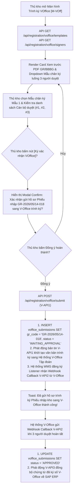

##### B. Bảng mô tả chi tiết các bước tác nghiệp & Xử lý hệ thống:

| Bước | Tác nhân | Hành động người dùng | Phản ứng hệ thống & Xử lý API / CSDL | Xử lý Ngoại lệ / Validation |
|:---:|---|---|---|---|
| **1** | Thủ kho | Mở Màn hình Trình ký `[M-VOff]` | • Gọi API `GET /api/registration/voffice/templates` và `signers` lấy luồng trình ký quy chuẩn. • Render khung xem trước file PDF Phiếu nhập GR và BBBG. | Báo lỗi nếu phiếu nhập kho chưa hoàn thành bước Thực nhập. |
| **2** | Thủ kho | Chọn Mẫu chân ký & Đối soát danh sách | Chọn `cbo_sign_template` = `Mẫu 1 · 3 người ký` $\rightarrow$ Kiểm tra danh sách người duyệt `#1 Trần Văn Kho`, `#2 Nguyễn Hữu An`, `#3 Mai Thị Lan`. | Cho phép sửa danh sách cán bộ nhận thông báo nếu có phân quyền. |
| **3** | Thủ kho | Bấm nút **[Ký xác nhận VOffice]** | Mở Modal confirm dialog `mdl_confirm_voffice` hiển thị tóm tắt: *"Xác nhận gửi hồ sơ Phiếu nhập GR-2026/05/14-018 sang V-Office trình ký?"* | Chặn bấm nếu danh sách người duyệt ký bị trống. |
| **4** | Thủ kho | Bấm **[Đồng ý hoàn thành]** | • Gọi API `POST /api/registration/voffice/submit` (bản tin `V-API1`). • **DB Insert:** Ghi nhận hồ sơ vào `voffice_submissions` với `status = 'WAITING_APPROVAL'`. • **Đồng bộ V-Office:** Khởi tạo văn bản trình ký điện tử trên hệ thống V-Office Tập đoàn. • **Webhook (`V-API2`):** WMS tự động lắng nghe callback kết quả ký duyệt từ V-Office. • **Tích hợp SAP (`V-API3`):** Đẩy thông tin văn bản đã ký số về SAP hạch toán chính thức. • Toast thông báo thành công. | Nếu V-Office phản hồi từ chối ➔ Cập nhật `status = 'REJECTED'` và thông báo cho Thủ kho lý do từ chối. |

#### ⑤ Đánh giá & Rà soát độ phủ Dữ liệu API Mobile (Mobile API Gap Analysis)

Qua rà soát đối chiếu giao diện Mobile Trình ký VOffice (`N7_Ky_VOffice.png`) với Bộ tài liệu tra cứu API Swagger local [API_AND_DB_FULL_REFERENCE.md](file:///c:/Users/quantm18/Desktop/New%20folder/Project_Management/dev/api-specs/API_AND_DB_FULL_REFERENCE.md), hệ thống ghi nhận **3 điểm tối ưu API DTO chuyên biệt cho Ứng dụng Di động**:

> [!IMPORTANT]
> **Các khuyến nghị bổ sung DTO cho Mobile App:**
> 1. **Xác thực Đơn điểm SSO V-Office (`vofficeSsoToken`):** Ứng dụng Mobile cần tích hợp API SSO với V-Office để người dùng không cần đăng nhập lại mật khẩu V-Office khi bấm nút trình ký.
> 2. **Trả về URL Trình duyệt V-Office (`vofficeDocUrl`):** Response của API `POST /api/registration/voffice/submit` cần trả về `vofficeDocUrl` để Mobile App có thể mở trực tiếp ứng dụng V-Office Mobile của Tập đoàn nếu người dùng muốn theo dõi tiến độ phê duyệt.
> 3. **Push Notification Trạng thái Ký Duyệt:** Backend WMS cần gửi bản tin Push Notification xuống thiết bị di động của Thủ kho ngay khi nhận Webhook Callback `V-API2` (Đã ký duyệt / Từ chối ký).

---

### 3.1.9. [M-Pac] Task 6: Đóng gói & In tem RFID trên Mobile

#### ① Thông tin chung

| Mục | Nội dung |
|---|---|
| **Tên chức năng** | Task 6: Đóng gói & In tem RFID trên Mobile `[M-Pac]` |
| **Mô tả** | Cho phép Nhân viên kho tổng hợp quy cách đóng gói (số lượng thùng carton, pallet, thùng gỗ), chọn loại thùng đóng gói, quét/gán thẻ mã RFID và chọn máy in tem di động để thực hiện lệnh in tem chip RFID dán lên kiện. |
| **Đường dẫn** | Danh sách task $\rightarrow$ Task 6 Đóng gói & In tem $\rightarrow$ Màn hình `[M-Pac]`. |
| **Phân quyền & Miền dữ liệu** | • **Thực hiện:** NV kho (`ROLE_WAREHOUSE_WORKER`). • **Miền dữ liệu:** Task đóng gói tại kho di động. |

#### ② Màn hình

- **Link file ảnh UIUX:** [N8_Dong_goi_In_tem.png](file:///c:/Users/Admin/Desktop/ai-agent-wms/UIUX/Mobile/Nhap_Kho/N8_Dong_goi_In_tem.png)

- **Mô tả chi tiết giao diện:**
  - **Header đỏ:** Nút Back, Tiêu đề `Đóng gói & In tem`, Sub-title `SP-A001 · 800 cái`, Nút `Gia hạn KPI`.
  - **Khung Tổng hợp Quy cách Đóng gói (Packing Summary Bar Card):**
    - *TỔNG KG / M³:* `2,450 kg · 18.5 m³`.
    - *THÙNG CARTON:* `16` (`8loại 1  5loại 2  3loại 3`).
    - *PALLET:* `2` (`1loại 1  1loại 2`).
    - *THÙNG GỖ:* `4` (`2loại 1  2loại 2`).
  - **Danh sách MẶT HÀNG ĐÓNG GÓI (Item Pack Selector Cards):**
    - `Galaxy A15 128GB` (SKU: `SP-A001`, Serial: `SN-2026-0012345`): Dropdown *Loại thùng* (`Carton 50`), Input *Mã RFID* (`RFID-0001-A1` kèm Icon Scan bên phải).
    - `Galaxy A25 256GB` (SKU: `SP-A002`, Serial: `SN-2026-0012346`): Dropdown *Loại thùng* (`Carton 50`), Input *Mã RFID* (`RFID-0002-A1` kèm Icon Scan).
    - `Tai nghe Buds Pro` (SKU: `SP-A003`, Serial: `SN-2026-0012347`): Dropdown *Loại thùng* (`Carton 25`), Input *Mã RFID* (`RFID-0003-B2` kèm Icon Scan).
    - `Cáp sạc USB-C 1m` (SKU: `SP-A004`): Dropdown *Loại thùng* (`Carton 100`), Input *Mã RFID* (`RFID-0004-C3` kèm Icon Scan).
  - **Khối Chọn Máy In (Printer Selection Card):** Dropdown select MÁY IN: `PRT-PACK-01 · Zebra ZT411`.
  - **Bottom Dual Buttons:**
    - Button `In tem` (Outline Button Icon Máy in tròn).
    - Button `Hoàn thành` (Solid Red Primary Button Icon Check V).

#### ③ Bảng 6 cột thành phần UI

| STT | Tên | Kiểu dữ liệu [Độ dài] | Input/Output | Giá trị khởi tạo | Mô tả (Mapping với CSDL nếu có) |
|---|---|---|---|---|---|
| 1 | `btn_back` | Icon Button | Input/Trigger | Enabled | Click quay lại danh sách Task. |
| 2 | `lbl_pack_item_header` | Text / String | Output | Header Info | Tiêu đề và tổng số lượng cái của dòng đóng gói (`SP-A001 · 800 cái`). |
| 3 | `btn_extend_kpi` | Pill Button | Input/Trigger | Active | Label: `Gia hạn KPI`. |
| 4 | `val_total_weight_vol` | Bold Text / String | Output | Weight/Vol | Hiển thị tổng trọng lượng và tổng thể tích đóng gói (`2,450 kg / 18.5 m³`). |
| 5 | `val_carton_count` | Bold Text / String | Output | Carton Summary | Tổng số lượng và phân loại thùng carton (`16`). |
| 6 | `val_pallet_count` | Bold Text / String | Output | Pallet Summary | Tổng số lượng và phân loại pallet (`2`). |
| 7 | `val_wood_box_count` | Bold Text / String | Output | Wood Summary | Tổng số lượng và phân loại thùng gỗ (`4`). |
| 8 | `lst_pack_items` | Vertical ListView / Object Array | Output | Pack Items | Danh sách chi tiết các mặt hàng thực hiện đóng gói và gán tem chip. |
| 9 | `cbo_carton_type` | Dropdown Select / String | Input | `Carton 50` | Chọn quy cách thùng đóng gói phù hợp cho mặt hàng. |
| 10 | `txt_rfid_code` | Input Box / String [50] | Input/Output | RFID Code | Mã chip RFID ghi dán tem thùng (`RFID-0001-A1`...). |
| 11 | `btn_scan_rfid` | Icon Scanner Button | Input/Trigger | Active | Click mở nhanh bộ đọc thẻ di động để quét nạp mã RFID. |
| 12 | `cbo_printer_select` | Dropdown Select / String | Input | `PRT-PACK-01` | Chọn máy in tem RFID di động kết nối (Zebra ZT411 / ZD621...). |
| 13 | `btn_print_labels` | Outline Red Button | Input/Trigger | Active | Label: `In tem`. Phát lệnh gửi dữ liệu in tem chip RFID trực tiếp sang máy in chỉ định. |
| 14 | `btn_complete_packing` | Solid Red Button | Input/Trigger | Active | Label: `Hoàn thành`. Xác nhận hoàn thành đóng gói in tem và mở khóa Task 7 Putaway. |

#### ④ Luồng xử lý nghiệp vụ

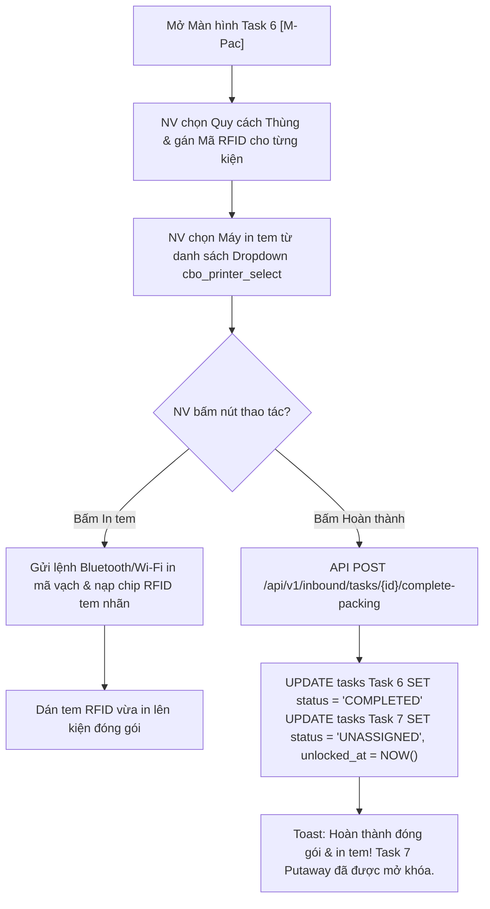

| Bước | Tác nhân | Hành động | Kết quả / Phản ứng hệ thống |
|---|---|---|---|
| 1 | NV kho | Chọn loại thùng & quét thẻ RFID | Chọn loại thùng đóng gói tương ứng và sử dụng PDA quét ghi mã chip RFID. |
| 2 | NV kho | Chọn máy in di động và bấm **[In tem]** | Chọn máy in tem trong kho $\rightarrow$ Bấm nút In tem $\rightarrow$ Hệ thống gửi lệnh in dữ liệu RFID tem nhãn trực tiếp tới máy in. |
| 3 | NV kho | Bấm nút **[Hoàn thành]** | Gửi API hoàn thành Task 6 đóng gói in tem. Chuyển trạng thái Task 6 sang `COMPLETED` và mở khóa Task 7 Putaway cất hàng (`[M-Mv3]`). |

---

### 3.1.10. [M-Mv3] Task 7: Putaway - Cất hàng vào lưu trữ trên Mobile

#### ① Thông tin chung

| Mục | Nội dung |
|---|---|
| **Tên chức năng** | Task 7: Putaway - Cất hàng vào lưu trữ trên Mobile `[M-Mv3]` |
| **Mô tả** | Cho phép Nhân viên kho thực hiện công việc di chuyển các kiện hàng đã đóng gói dán tem RFID từ Khu đóng gói đến cất vào ô kệ lưu trữ chính thức (Bin Location), đối soát mã vị trí Bin và hoàn tất quy trình nhập kho. |
| **Đường dẫn** | Danh sách task $\rightarrow$ Task 7 Putaway $\rightarrow$ Màn hình Putaway `[M-Mv3]`. |
| **Phân quyền & Miền dữ liệu** | • **Thực hiện:** NV kho (`ROLE_WAREHOUSE_WORKER`). • **Miền dữ liệu:** Task Putaway tại kho phụ trách. |

#### ② Màn hình

- **Link file ảnh UIUX:** [N9_Putaway.png](file:///c:/Users/Admin/Desktop/ai-agent-wms/UIUX/Mobile/Nhap_Kho/N9_Putaway.png)

- **Mô tả chi tiết giao diện:**
  - **Header đỏ:** Nút Back, Tiêu đề `Putaway - Cất hàng`, Sub-title `16 HU · Khu G`, Nút `Gia hạn KPI`.
  - **Danh sách CÁC HU CẤT HÀNG (Putaway HU Cards):**
    - `HU-2026-9921-01`: Tên SP `Galaxy A15 128GB`, Loại thùng (`Carton 50`), Mã RFID (`RFID-0001-A1`), *Vị trí lưu trữ*: Dropdown chọn `G04-B02-T03` + Icon Scan mã ô kệ đỏ nét đứt bên phải.
    - `HU-2026-9921-02`: Tên SP `Galaxy A25 256GB`, Loại thùng (`Carton 50`), Mã RFID (`RFID-0002-A1`), *Vị trí lưu trữ*: Dropdown `G04-B02-T04` + Icon Scan.
    - `HU-2026-9921-03`: Tên SP `Tai nghe Buds Pro`, Loại thùng (`Carton 25`), Mã RFID (`RFID-0003-B2`), *Vị trí lưu trữ*: Dropdown `G04-B03-T01` + Icon Scan.
    - `HU-2026-9921-04`: Tên SP `Cáp sạc USB-C 1m`, Loại thùng (`Carton 100`), Mã RFID (`RFID-0004-C3`), *Vị trí lưu trữ*: Dropdown `G05-A01-T01` + Icon Scan.
  - **Bottom Action Button:** Button solid màu đỏ rộng `Hoàn thành` (Icon Check V).

#### ③ Bảng 6 cột thành phần UI

| STT | Tên | Kiểu dữ liệu [Độ dài] | Input/Output | Giá trị khởi tạo | Mô tả (Mapping với CSDL nếu có) |
|---|---|---|---|---|---|
| 1 | `btn_back` | Icon Button | Input/Trigger | Enabled | Click quay lại danh sách Task. |
| 2 | `lbl_putaway_header` | Text / String | Output | Header Info | Hiển thị tổng số HU và Khu vực lưu trữ cất hàng (`16 HU · Khu G`). |
| 3 | `btn_extend_kpi` | Pill Button | Input/Trigger | Active | Label: `Gia hạn KPI`. |
| 4 | `lst_putaway_hus` | Vertical ListView / Object Array | Output | Putaway List | Danh sách các đơn vị đóng gói HU cần cất vào ô kệ lưu trữ (`putaway_assignments`). |
| 5 | `col_hu_code` | Red Bold Text / String [50] | Output | HU Code | Mã định danh đơn vị đóng gói HU (`HU-2026-9921-01`...). |
| 6 | `col_product_name` | Text / String [255] | Output | Product Name | Tên diễn giải sản phẩm trong HU. |
| 7 | `col_carton_type` | Readonly Input Box / String | Output | Carton Type | Quy cách đóng gói thùng. |
| 8 | `col_rfid_code` | Readonly Input Box / String | Output | RFID Code | Mã tem nhãn RFID đã gán cho kiện. |
| 9 | `cbo_bin_location` | Dropdown Select / String | Input | System Suggested | Mã vị trí ô kệ lưu trữ đề xuất hoặc chọn thay thế (`G04-B02-T03`...). |
| 10 | `btn_scan_bin_qr` | Square Red Icon Button | Input/Trigger | Active | Icon mở scanner quét mã vạch/QR dán trên ô kệ vật lý để xác nhận chính xác vị trí cất. |
| 11 | `btn_complete_putaway` | Solid Red Button | Input/Trigger | Active | Label: `Hoàn thành`. Xác nhận đã cất toàn bộ kiện vào vị trí ô kệ, hoàn tất Task 7 và toàn bộ Lệnh nhập kho. |

#### ④ Luồng xử lý nghiệp vụ

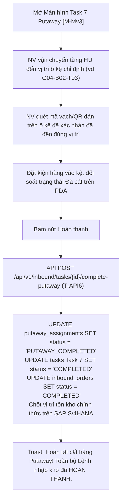

| Bước | Tác nhân | Hành động | Kết quả / Phản ứng hệ thống |
|---|---|---|---|
| 1 | NV kho | Vận chuyển hàng đến ô kệ vật lý | Di chuyển kiện HU tới dãy kệ chỉ định dựa trên vị trí hệ thống gợi ý (`G04-B02-T03`). |
| 2 | NV kho | Quét mã vạch/QR dán trên ô kệ | Sử dụng PDA quét mã ô kệ để đảm bảo cất đúng vị trí. Nếu chọn ô kệ khác, hệ thống tự động cập nhật lại mã Bin mới. |
| 3 | NV kho | Bấm nút **[Hoàn thành]** | Gửi API `T-API6` báo cáo hoàn thành cất hàng về SAP. Đóng Lệnh nhập kho (`status = 'COMPLETED'`), chính thức ghi nhận tồn kho tại các ô kệ Bin khả dụng. |

---

## PHẦN 4. THIẾT KẾ DÙNG CHUNG VÀ TÁI SỬ DỤNG

Bảng đặc tả các Component di động dùng chung (Mobile Common Components):

| STT | Tên component | Mô tả hành vi | Danh sách chức năng sử dụng |
|---|---|---|---|
| 1 | **Header Task Red Bar** | Thanh tiêu đề đỏ di động chứa Nút Back, Tiêu đề màn hình, Sub-title thông tin đơn và Nút Gia hạn KPI. | Tất cả màn hình di động `[M-DS]` đến `[M-Mv3]` |
| 2 | **Barcode/RFID Scanner Bar** | Thanh ô quét mã tích hợp camera chụp ảnh Barcode/QR và tiếp nhận signal dữ liệu từ đầu đọc RFID di động. | `[M-Chk]`, `[M-Mv1]`, `[M-Pac]`, `[M-Mv3]` |
| 3 | **Touch Canvas Signature** | Vùng cảm ứng điện dung di động cho phép vẽ và capture chữ ký tay dạng ảnh Base64. | `[M-Sig1]` |
| 4 | **PDF Mobile Viewer** | Trình xem trước file PDF Biên bản bàn giao / Phiếu nhập kho trực tiếp trên màn hình ứng dụng di động. | `[M-Sig1]`, `[M-VOff]` |
| 5 | **Status Pill Tag / Badge** | Tag bo tròn hiển thị màu trạng thái Lệnh nhập / Task / Hàng Đạt (Xanh lá) & Không đạt (Hồng/Đỏ). | `[M-DS]`, `[M-Acc]`, `[M-AGR]`, `[M-VOff]` |
| 6 | **KPI Extension Modal** | Popup cho phép NV kho gửi yêu cầu gia hạn thời gian hoàn thành KPI/SLA task. | `[M-Unl]`, `[M-Chk]`, `[M-Mv1]`, `[M-VOff]`, `[M-Pac]`, `[M-Mv3]` |

---

## PHẦN 5. TUÂN THỦ TIÊU CHUẨN QUẢN TRỊ DỮ LIỆU

### 5.1. CDE (Common Data Elements)
Dữ liệu di động tuân thủ bảng CDE theo chuẩn Tập đoàn:
- Mã Lệnh nhập kho (`inbound_orders.order_code`).
- Mã SKU sản phẩm (`inbound_order_items.sku_code`).
- Mã Chip RFID EPC (`handling_units.rfid_epc`).
- Mã vị trí lưu trữ Bin (`bin_locations.bin_code`).

### 5.2. Bảo mật dữ liệu di động (Mobile Data Security)
- **SSL/TLS Encryption:** Toàn bộ giao tiếp API giữa Mobile App và Server được mã hóa qua kênh HTTPS (TLS 1.3).
- **Session & JWT Token:** Mã token xác thực lưu trong bộ nhớ an toàn di động (Secure Storage / Keychain). Đăng xuất tự động sau 15 phút không thao tác.
- **Offline Data Encryption:** Khi tác nghiệp vùng mất sóng (Offline), dữ liệu tạm lưu trên `IndexedDB` / `SQLite Local` được mã hóa AES-256 bit.

### 5.3. Chất lượng dữ liệu & Siêu dữ liệu
- Bắt buộc kiểm tra định dạng và độ dài của Mã RFID, Mã Barcode/QR trước khi lưu DB.
- Tự động trim khoảng trắng 2 đầu đối với tất cả dữ liệu chuỗi nhập liệu.

### 5.4. Lưu trữ & Vận hành
- Thời gian lưu cache ảnh xem trước PDF BBBG / Phiếu nhập kho trên máy di động: tối đa 7 ngày (sau đó tự động dọn dẹp bộ nhớ tạm).

---

## PHẦN 6. PHỤ LỤC

### 6.1. Tài liệu quy trình nghiệp vụ
- Quy trình nghiệp vụ Nhập kho NCC (MM.10A): [AIWS_SAP_MM.10A_quy_trinh_nhap_kho_mua_hang_NCC.md](file:///c:/Users/Admin/Desktop/ai-agent-wms/knowledge/processes/AIWS_SAP_MM.10A_quy_trinh_nhap_kho_mua_hang_NCC.md)

### 6.2. Tài liệu thiết kế CSDL
- **CSDL PostgreSQL WMS (Tập đoàn):** Tham chiếu chi tiết Schema CSDL PostgreSQL chính thức tại [API_AND_DB_FULL_REFERENCE.md](file:///c:/Users/quantm18/Desktop/New%20folder/Project_Management/dev/api-specs/API_AND_DB_FULL_REFERENCE.md) và DDL Script [vo_warehouse_vtit.txt](file:///c:/Users/quantm18/Desktop/New%20folder/Project_Management/dev/db/vo_warehouse_vtit.txt).
- **Các bảng CSDL chính sử dụng:** `inbound_orders`, `inbound_order_items`, `tasks`, `handling_units`, `bbbg`, `bbbg_signatures`, `voffice_submissions`, `product`, `warehouse`.

### 6.3. Phân quyền vai trò trên Mobile App

| Role Code | Tên Role | Quyền hạn tác nghiệp trên Mobile App |
|---|---|---|
| `ROLE_WAREHOUSE_DIRECTOR` | Giám đốc kho | Xem danh sách lệnh nhập, xem thống kê lũy kế, duyệt trình ký VOffice. |
| `ROLE_WAREHOUSE_MASTER` | Thủ kho | Duyệt tiếp nhận Gate 1, xem báo cáo KCS thực nhập, ký BBBG điện tử, trình ký VOffice. |
| `ROLE_WAREHOUSE_WORKER` | NV kho | Thực hiện Task 1 (Dỡ hàng), Task 2 (Kiểm hàng), Task 3 (Khu chờ nhập), Task 5 (Di chuyển), Task 6 (Đóng gói in tem), Task 7 (Putaway cất hàng). |
| `ROLE_PARTNER` | Đối tác / Tài xế | Xem trước và ký xác nhận Biên bản bàn giao tại bãi Staging. |

### 6.4. Bản đồ API trên Mobile (Mobile API Endpoint Matrix)

| STT | Mã API | Phương thức & Đường dẫn Swagger API Local | Mục đích tích hợp di động & Tích hợp Hệ thống |
|:---:|---|---|---|
| 1 | `M-API-01` | `GET /api/registration/inbound-orders` | Lấy danh sách Lệnh nhập kho & Chỉ số thống kê lũy kế Tháng/Năm (`[M-DS]`). |
| 2 | `M-API-02` | `GET /api/registration/inbound-orders/detail/{orderId}` | Lấy thông tin chi tiết Lệnh nhập kho & Danh sách mặt hàng PO (`[M-Acc]`). |
| 3 | `M-API-03` | `POST /api/registration/inbound-orders/{orderId}/accept` | Xác nhận tiếp nhận Lệnh nhập kho Gate 1 (`[M-Acc]`). |
| 4 | `M-API-04` | `POST /api/registration/inbound-orders/{orderId}/reject` | Từ chối tiếp nhận Lệnh nhập kho Gate 1 (Phát bản tin `T-API2` đồng bộ về SAP). |
| 5 | `M-API-05` | `GET /api/registration/staging-area-entry/products` | Lấy danh sách mặt hàng cần dỡ khỏi xe Task 1 (`[M-Unl]`). |
| 6 | `M-API-06` | `POST /api/registration/staging-area-entry/unloading/complete` | Xác nhận hoàn thành Task 1 Dỡ hàng khỏi xe (`[M-Unl]`). |
| 7 | `M-API-07` | `GET /api/registration/inbound-orders/products/check-by-serial` | Quét mã Serial/IMEI/RFID đối soát PO Task 2 (`[M-Chk]`). |
| 8 | `M-API-08` | `POST /api/registration/tasks/{taskId}/bbbg/reject` | Từ chối nhận hàng do móp hỏng/sai lệch Gate 2 (Phát bản tin `T-API3` về SAP). |
| 9 | `M-API-09` | `GET /api/registration/inbound-orders/{orderId}/documents` | Xem trước file chứng từ PDF BBBG điện tử (`[M-Sig1]`). |
| 10 | `M-API-10` | `POST /api/registration/tasks/{taskId}/bbbg/signatures` | Lưu chữ ký cảm ứng Touch Canvas dạng Base64 hoặc đính kèm ảnh BBBG giấy (`[M-Sig1]`). |
| 11 | `M-API-11` | `POST /api/registration/tasks/{taskId}/bbbg/complete` | Chốt phát hành BBBG điện tử (Phát bản tin `T-API4` lấy Mã phiếu nhập SAP Mvt 101). |
| 12 | `M-API-12` | `POST /api/registration/handling-units/list-hu` | Lấy danh sách các thẻ kiện đóng gói HU cần chuyển bãi Staging Task 3 (`[M-Mv1]`). |
| 13 | `M-API-13` | `POST /api/registration/staging-area-entry/complete` | Xác nhận hoàn thành Task 3 đưa hàng vào khu chờ nhập bãi Staging `C02-Wait`. |
| 14 | `M-API-14` | `GET /api/registration/tasks/{taskId}/kcs-results` | Truy vấn báo cáo kết quả giám định KCS Đạt/Không đạt & Phân tách Sub-SKU (`T-API5`). |
| 15 | `M-API-15` | `POST /api/registration/tasks/{taskId}/actual-receipt/complete` | Xác nhận kết quả KCS & Hạch toán tồn kho Thực nhập (`T-API6` UU vs Blocked stock). |
| 16 | `M-API-16` | `GET /api/registration/voffice/templates` | Lấy danh sách mẫu luồng chân ký trình ký VOffice Phiếu nhập kho (`[M-VOff]`). |
| 17 | `M-API-17` | `POST /api/registration/voffice/submit` | Gửi hồ sơ trình ký VOffice Phiếu nhập kho (Bản tin `V-API1`). |
| 18 | `M-API-18` | `POST /api/registration/tasks/{taskId}/complete-packing` | Xác nhận hoàn thành Task 6 Đóng gói & Phát lệnh in tem chip RFID (`[M-Pac]`). |
| 19 | `M-API-19` | `POST /api/registration/tasks/{taskId}/complete-putaway` | Xác nhận hoàn thành Task 7 Putaway cất hàng vào vị trí Bin lưu trữ (`[M-Mv3]`). |

### 6.5. Danh sách chức năng di động Mobile App

| STT | Mã Task Mobile | Tên chức năng di động | Đối tượng sử dụng |
|---|---|---|---|
| **I. Quản lý Lệnh & Tiếp nhận Mobile** | | | |
| 1 | `[M-DS]` | Danh sách lệnh nhập kho tổng quan (Dashboard & Cumulative Metrics) | Thủ kho, GD kho, NV kho |
| 2 | `[M-Acc]` | Tiếp nhận / Duyệt lệnh nhập kho (Gate 1 Rejection/Acceptance) | Thủ kho, GD kho |
| **II. Tác nghiệp Thực địa Kho Mobile** | | | |
| 3 | `[M-Unl]` | Task 1: Dỡ hàng khỏi xe trên Mobile (`[T-Unl]`) | NV kho |
| 4 | `[M-Chk]` | Task 2: Kiểm hàng theo PO (Quét Serial/RFID & Gate 2 Rejection) | NV kho, Thủ kho |
| 5 | `[M-Sig1]` | Task 2 (tiếp): Ký Biên bản bàn giao điện tử (`[T-Ho]`) | Thủ kho, NV kho, Tài xế NCC |
| 6 | `[M-Mv1]` | Task 3: Đưa vào khu chờ nhập bãi Staging `C02-Wait` (`[T-Mv1]`) | NV kho |
| 7 | `[M-KCS]` | Task 4: Kết quả KCS trên Mobile (`[T-KCS]`) | Thủ kho, GD kho |
| 8 | `[M-Mv2]` | Task 5: Di chuyển sang khu đóng gói (`[T-Mv2]`) | NV kho |
| **III. Đóng gói & Lưu trữ Kho Mobile** | | | |
| 9 | `[M-Pac]` | Task 6: Đóng gói & In tem RFID (`[T-Pac]`) | NV kho |
| 10 | `[M-Mv3]` | Task 7: Putaway - Cất hàng vào vị trí Bin (`[T-Mv3]`) | NV kho |
| **IV. Trình ký Văn phòng Điện tử Mobile** | | | |
| 11 | `[M-VOff]` | Trình ký VOffice Phiếu nhập kho trên Mobile | Thủ kho, GD kho |

---
*Hết tài liệu thiết kế chi tiết Mobile App Task Nhập kho NCC.*
