# TÀI LIỆU THIẾT KẾ CHI TIẾT (TKCT) — THIẾT BỊ DI ĐỘNG (MOBILE APP)
## QUY TRÌNH VÀ MÀN HÌNH TÁC NGHIỆP TASK NHẬP KHO TỪ NHÀ CUNG CẤP (MM.10A)

- **Mã hiệu tài liệu:** `SRS_MM.10A_Task_NhapKho_NCC_Mobile`
- **Phiên bản:** `1.0.0`
- **Ngày lập:** `08/08/2026`
- **Dự án:** AI-WS (WMS Warehouse Management System)Bạn
- **Thuộc phân hệ:** MM (Materials Management) / Inbound Warehouse

---

## PHẦN 1. GIỚI THIỆU

### 1.1. Mục đích tài liệu
Tài liệu Đặc tả Thiết kế Chi tiết (TKCT - BM.04) mô tả chi tiết toàn bộ giao diện màn hình ứng dụng di động (Mobile App / PDA), cấu trúc các thành phần UI, quy tắc hiển thị, mapping CSDL, và luồng tác nghiệp nghiệp vụ cho Nhân viên kho, Thủ kho, Giám đốc kho, Bảo vệ, và Đối tác trên thiết bị cầm tay di động đối với quy trình **Nhập kho mua hàng từ Nhà cung cấp (NCC) - Phân hệ MM.10A**.

Tài liệu phục vụ làm đầu vào trực tiếp cho các giai đoạn:
- **Nhóm Phát triển (Developers - Flutter/React Native/Mobile & Backend API):** Căn cứ xây dựng UI/UX di động, tích hợp đầu đọc RFID handheld, quét Barcode qua Camera/Scanner, chụp ảnh chứng từ, vẽ chữ ký điện tử, và các RESTful APIs mobile.
- **Nhóm Kiểm thử (QA/QC):** Căn cứ viết Kịch bản kiểm thử (Test Cases), Kiểm thử thiết bị di động (Mobile App Testing) và Kiểm thử tích hợp hệ thống (E2E Integration Testing).
- **Nhóm Quản lý Dự án (PM/BA):** Cơ sở rà soát tiến độ, chốt phạm vi chức năng di động và nghiệm thu sản phẩm.

| Người sử dụng | Mục đích |
|---|---|
| Nhóm Phát triển Mobile & Backend | Lập trình màn hình UI di động, xử lý sự kiện quét RFID/Barcode, logic API và lưu trữ offline IndexedDB/SQLite. |
| Nhóm Kiểm thử (QA/QC) | Xây dựng Test cases kiểm thử các màn hình di động và kịch bản tác nghiệp thực tế tại kho. |
| Nhóm Quản trị Vận hành & Kho | Hướng dẫn đào tạo Nhân viên kho tác nghiệp bằng thiết bị di động PDA/Smartphone tại thực địa. |
| Nhóm Quản lý Dự án (PM/BA) | Quản lý baseline phạm vi chức năng di động và theo dõi nghiệm thu. |

### 1.2. Phạm vi tài liệu
Tài liệu này bao gồm toàn bộ thiết kế giao diện di động cho 10 màn hình tác nghiệp thực tế tại kho thuộc quy trình Nhập kho NCC (MM.10A), bao gồm:
1. **[M-DS]** Màn hình Danh sách lệnh nhập kho (Tổng quan lũy kế & Filter trạng thái).
2. **[M-Acc]** Màn hình Tiếp nhận lệnh nhập kho (Duyệt/Từ chối tiếp nhận Gate 1).
3. **[M-Unl]** Task 1: Dỡ hàng khỏi xe trên Mobile.
4. **[M-Chk]** Task 2: Kiểm hàng theo PO trên Mobile (Quét Serial/IMEI & Barcode/RFID).
5. **[M-Sig1]** Task 2 (tiếp): Ký Biên bản bàn giao điện tử trên Mobile (Vẽ chữ ký & Tải/Xem PDF BBBG).
6. **[M-Mv1]** Task 3: Đưa vào khu chờ nhập trên Mobile (Gán RFID & Loại thùng cho HU).
7. **[M-AGR]** Task 4: Thực nhập kho trên Mobile (Xem kết quả KCS Đạt/Không đạt & Giá trị tài sản).
8. **[M-VOff]** Trình ký VOffice Phiếu nhập kho trên Mobile (Xem trước phiếu nhập, chọn mẫu chân ký & duyệt VOffice).
9. **[M-Pac]** Task 6: Đóng gói & In tem RFID trên Mobile (Tổng hợp quy cách đóng gói, chọn máy in tem & In tem).
10. **[M-Mv3]** Task 7: Putaway - Cất hàng vào lưu trữ trên Mobile (Chỉ định & Quét vị trí ô kệ Bin).

### 1.3. Khái niệm và thuật ngữ

| Thuật ngữ | Định nghĩa | Ghi chú |
|---|---|---|
| **PDA** | Personal Digital Assistant - Thiết bị di động cầm tay chuyên dụng kiểm đếm kho có tích hợp đầu đọc Barcode/RFID. | Thiết bị chính của NV kho |
| **RFID** | Radio Frequency Identification - Công nghệ nhận dạng qua tần số vô tuyến (Thẻ Chip EPC). | Đọc không tiếp xúc nhiều kiện |
| **HU** | Handling Unit - Đơn vị xử lý hàng hóa (Thùng carton, Pallet, Thùng gỗ...). | Mã định danh đơn vị đóng gói |
| **KCS** | Kiểm tra chất lượng sản phẩm (Quality Control) bởi Bộ phận KCS/Tập đoàn. | Xác định Đạt/Không đạt |
| **SLA / KPI** | Service Level Agreement / Key Performance Indicator - Thời gian cam kết xử lý hoàn thành công việc. | Đếm ngược theo real-time |
| **PO** | Purchase Order - Đơn đặt hàng mua vật tư thiết bị từ Tập đoàn với NCC. | Chứng từ gốc trên SAP |
| **BBBG** | Biên bản bàn giao hàng hóa giữa Nhà cung cấp và Thủ kho / NV kho. | Ký điện tử tại Dock |
| **VOffice** | Hệ thống Văn phòng điện tử Tập đoàn phục vụ trình ký và phê duyệt văn bản. | Trình ký Phiếu nhập |

### 1.4. Tài liệu tham khảo

| Tên tài liệu | Link | Người gửi | Ngày gửi |
|---|---|---|---|
| SRS Thiết kế chi tiết Web Task Nhập kho | [SRS_MM.10A_QuyTrinh_Va_ManHinh_Task_NhapKho_NCC_v1.0.0.md](file:///c:/Users/Admin/Desktop/ai-agent-wms/ba/documents/srs/new/SRS_MM.10A_QuyTrinh_Va_ManHinh_Task_NhapKho_NCC_v1.0.0.md) | Team BA | 05/08/2026 |
| SRS Đồng bộ Thông tin Nhập kho SAP & VOffice | [SRS_MM.10A_ChucNang_DongBo_ThongTin_NCC_v1.0.0.md](file:///c:/Users/Admin/Desktop/ai-agent-wms/ba/documents/srs/new/SRS_MM.10A_ChucNang_DongBo_ThongTin_NCC_v1.0.0.md) | Team BA | 05/08/2026 |
| Quy trình Nghiệp vụ Nhập kho NCC (MM.10A) | [AIWS_SAP_MM.10A_quy_trinh_nhap_kho_mua_hang_NCC.md](file:///c:/Users/Admin/Desktop/ai-agent-wms/knowledge/processes/AIWS_SAP_MM.10A_quy_trinh_nhap_kho_mua_hang_NCC.md) | Quy trình Tập đoàn | 01/08/2026 |
| Bộ Giao diện UI/UX Mobile App Nhập Kho | [UIUX/Mobile/Nhap_Kho](file:///c:/Users/Admin/Desktop/ai-agent-wms/UIUX/Mobile/Nhap_Kho) | UIUX Team | 07/08/2026 |

### 1.5. Mô tả tài liệu
Cấu trúc tài liệu tuân thủ chuẩn BM.04 gồm 6 Phần chính:
- **Phần 1 — Giới thiệu:** Mục đích, phạm vi, thuật ngữ, tài liệu tham khảo.
- **Phần 2 — Tổng quan giải pháp:** Sơ đồ phân cấp chức năng Mobile và mô hình giao tiếp hệ thống tích hợp di động.
- **Phần 3 — Thiết kế chi tiết:** Chi tiết 10 màn hình di động (Mô tả, UI image, Bảng 6 cột thành phần, Sơ đồ & Bảng luồng nghiệp vụ).
- **Phần 4 — Thiết kế dùng chung và tái sử dụng:** Các Mobile Common Components (Header Task, Badge SLA Count, Scanner Handler, Touch Signature Canvas...).
- **Phần 5 — Tuân thủ tiêu chuẩn quản trị dữ liệu:** An toàn mã hóa dữ liệu di động, token JWT, lưu tạm offline LocalStorage.
- **Phần 6 — Phụ lục:** Quy trình nghiệp vụ, Phân quyền vai trò trên Mobile, Bản đồ API và Danh mục chức năng di động.

---

## PHẦN 2. TỔNG QUAN GIẢI PHÁP

### 2.1. Tổng quan chức năng di động

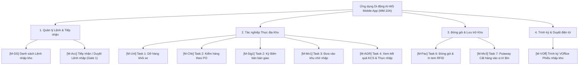

### 2.2. Mô hình giao tiếp hệ thống trên di động
Ứng dụng di động tác nghiệp thông qua các giao tiếp tích hợp:
- **Di động <-> Mobile API Gateway (RESTful / HTTPS JSON):** Truy xuất danh sách task, gửi dữ liệu quét RFID/Barcode, upload file ảnh chữ ký.
- **Di động <-> Tích hợp thiết bị phần cứng (Hardware Integration):**
  - Đọc thẻ RFID Chip EPC trực tiếp từ Đầu đọc RFID cầm tay (Handheld RFID Reader Zebra / Honeywell).
  - Quét mã vạch Barcode/QR qua Camera thiết bị di động hoặc Đầu đọc Laser tích hợp PDA.
  - Gửi lệnh in trực tiếp qua sóng Bluetooth / Wi-Fi tới Máy in tem RFID di động (Zebra ZT411 / ZD621).
- **Di động <-> SAP S/4HANA & V-Office (Thông qua AI-WS Backend Services):** Nhận đồng bộ Inbound Delivery VL31N, thông báo kết quả Gate 1 / Gate 2, trình ký V-Office và tạo Phiếu nhập kho Mvt 101.

---

## PHẦN 3. THIẾT KẾ CHI TIẾT CÁC MÀN HÌNH MOBILE

### 3.1. Nhóm Quản lý Lệnh Nhập & Tác nghiệp Kho di động

---

### 3.1.1. [M-DS] Màn hình Danh sách lệnh nhập kho

#### ① Thông tin chung

| Mục | Nội dung |
|---|---|
| **Tên chức năng** | Danh sách lệnh nhập kho trên Mobile `[M-DS]` |
| **Mô tả** | Cho phép Nhân viên kho, Thủ kho và Giám đốc kho xem danh sách tất cả các Lệnh nhập kho mua hàng từ NCC tại kho hiện tại (`Kho HN01`), theo dõi chỉ số lũy kế tháng/năm và lọc theo từng trạng thái xử lý. |
| **Đường dẫn** | Đăng nhập Mobile App $\rightarrow$ Chức năng Nhập kho $\rightarrow$ Danh sách lệnh nhập. |
| **Phân quyền & Miền dữ liệu** | • **Xem:** Tất cả các role thuộc kho (`ROLE_WAREHOUSE_DIRECTOR`, `ROLE_WAREHOUSE_MASTER`, `ROLE_WAREHOUSE_WORKER`). • **Miền dữ liệu:** Chỉ xem các lệnh nhập thuộc Kho làm việc của User (vd `HN01`). |

#### ② Màn hình

- **Link file ảnh UIUX:** [N1_DS_lenh_nhap.png](file:///c:/Users/Admin/Desktop/ai-agent-wms/UIUX/Mobile/Nhap_Kho/N1_DS_lenh_nhap.png)

- **Mô tả chi tiết giao diện:**
  - **Header đỏ:** Nút Back tròn đỏ, Tiêu đề màn hình `Danh sách lệnh nhập`, Sub-title tên kho làm việc `Kho HN01`.
  - **Khung Thống kê Lũy kế (Summary Card):** Chia 2 cột:
    - *LŨY KẾ THÁNG:* Số lệnh (`138`), Khối lượng (`165.6 tấn`), Thể tích (`662.4 m³`).
    - *LŨY KẾ NĂM:* Số lệnh (`1,802`), Khối lượng (`2,162.4 tấn`), Thể tích (`8,649.6 m³`).
  - **Thanh Filter Trạng thái (Segmented Tabs Horizontal Scroll):** Các chip chọn: `Tất cả (4)` (Background đỏ active), `Chờ duyệt (1)`, `Đang xử lý (2)`, `Hoàn tất (1)`.
  - **Danh sách Thẻ Lệnh nhập (Order Item Cards):** Mỗi card gồm:
    - Mã lệnh nhập (`INB-2026-00231`), Badge trạng thái màu (`Chờ duyệt` - cam, `Đang xử lý` - tím, `Hoàn tất` - xanh lá), Icon mũi tên chuyển màn hình chi tiết.
    - Icon xe tải + Tên Nhà cung cấp (`Ericsson Vietnam`, `Samsung Electronics`...).
    - Thông số Trọng lượng (`1,240 kg`), Thể tích (`4.8 m³`), Giờ giao dự kiến (`Giờ giao: 09:30`).

#### ③ Bảng 6 cột thành phần UI

| STT | Tên | Kiểu dữ liệu [Độ dài] | Input/Output | Giá trị khởi tạo | Mô tả (Mapping với CSDL nếu có) |
|---|---|---|---|---|---|
| 1 | `btn_back` | Icon Button | Input/Trigger | Enabled | Click quay lại màn hình Menu chính Home Mobile. |
| 2 | `lbl_header_title` | Bold Text / String | Output | `Danh sách lệnh nhập` | Header tiêu đề màn hình. |
| 3 | `lbl_warehouse_name` | Text / String | Output | `Kho HN01` | Tên kho làm việc của user (`warehouses.warehouse_name`). |
| 4 | `val_month_orders` | Bold Text / Integer | Output | `138` | Tổng số lệnh nhập phát sinh trong tháng (`inbound_orders_count_month`). |
| 5 | `val_month_weight` | Bold Text / String | Output | `165.6 tấn` | Tổng khối lượng lũy kế tháng (`inbound_orders_weight_month`). |
| 6 | `val_month_volume` | Bold Text / String | Output | `662.4 m³` | Tổng thể tích lũy kế tháng (`inbound_orders_volume_month`). |
| 7 | `val_year_orders` | Bold Text / Integer | Output | `1,802` | Tổng số lệnh nhập phát sinh trong năm (`inbound_orders_count_year`). |
| 8 | `val_year_weight` | Bold Text / String | Output | `2,162.4 tấn` | Tổng khối lượng lũy kế năm (`inbound_orders_weight_year`). |
| 9 | `val_year_volume` | Bold Text / String | Output | `8,649.6 m³` | Tổng thể tích lũy kế năm (`inbound_orders_volume_year`). |
| 10 | `tab_filter_status` | Segment Filter / String | Input | `Tất cả` | Thanh tab chọn trạng thái: `ALL`, `PENDING_ACCEPT`, `IN_PROGRESS`, `COMPLETED`. |
| 11 | `lst_order_cards` | Scroll ListView / Object Array | Output | List Order | Danh sách các thẻ lệnh nhập kho (`inbound_orders`). |
| 12 | `col_order_code` | Red Bold Text / String [50] | Output | Order Code | Mã lệnh nhập kho (vd `INB-2026-00231`) (`inbound_orders.order_code`). |
| 13 | `col_status_badge` | Tag Badge / String [30] | Output | Status Name | Badge màu hiển thị trạng thái lệnh (`inbound_orders.status`). |
| 14 | `col_supplier_name` | Text Label / String [255] | Output | Supplier Name | Tên Nhà cung cấp kèm icon xe tải (`inbound_orders.supplier_name`). |
| 15 | `col_weight_kg` | Text / String [20] | Output | Weight String | Trọng lượng đơn hàng (`inbound_orders.total_weight_kg`). |
| 16 | `col_volume_m3` | Text / String [20] | Output | Volume String | Thể tích đơn hàng (`inbound_orders.total_volume_m3`). |
| 17 | `col_delivery_time` | Text / String [20] | Output | HH:mm | Giờ giao dự kiến (`inbound_orders.delivery_time`). |
| 18 | `btn_order_detail` | Arrow Icon / Trigger | Input/Trigger | Active | Click chuyển sang màn hình tiếp nhận hoặc chi tiết tác nghiệp Task tương ứng. |

#### ④ Luồng xử lý nghiệp vụ

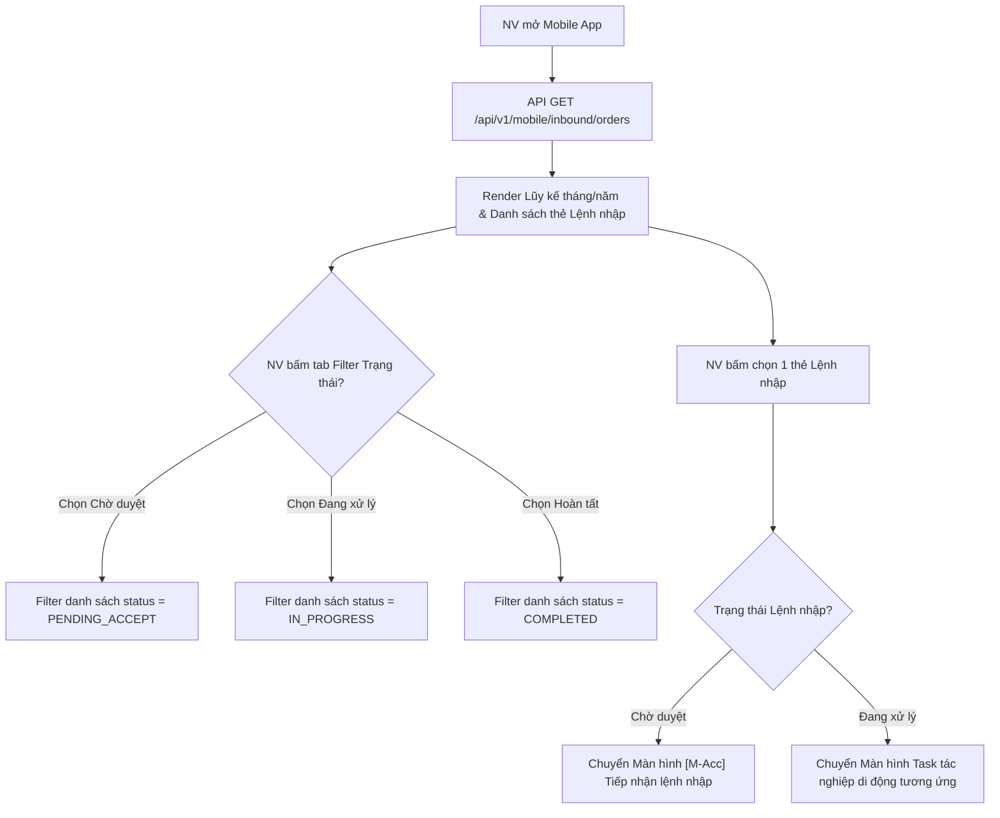

| Bước | Tác nhân | Hành động | Kết quả / Phản ứng hệ thống |
|---|---|---|---|
| 1 | NV kho | Mở màn hình Danh sách lệnh nhập | Hệ thống gọi API `GET /api/v1/mobile/inbound/orders?warehouse_code=HN01`. Lấy chỉ số lũy kế và danh sách 20 lệnh mới nhất. |
| 2 | NV kho | Cuộn vuốt thanh Filter tab trạng thái | Chọn `Chờ duyệt` / `Đang xử lý` / `Hoàn tất` $\rightarrow$ Filter trực tiếp danh sách trên giao diện theo `status`. |
| 3 | NV kho | Bấm vào một thẻ Lệnh nhập kho | Hệ thống chuyển hướng: • Nếu `status == 'PENDING_ACCEPT'`: Chuyển sang màn hình `[M-Acc] Tiếp nhận lệnh nhập`. • Nếu `status == 'IN_PROGRESS'`: Chuyển sang màn hình Task di động tương ứng (`[M-Unl]`, `[M-Chk]`, `[M-AGR]`...). |

---

### 3.1.2. [M-Acc] Màn hình Tiếp nhận lệnh nhập kho (Gate 1 Mobile)

#### ① Thông tin chung

| Mục | Nội dung |
|---|---|
| **Tên chức năng** | Tiếp nhận lệnh nhập kho trên Mobile `[M-Acc]` |
| **Mô tả** | Cho phép Thủ kho / NV kho xem chi tiết Lệnh nhập kho chuyển từ SAP sang, đối soát danh sách mặt hàng và thực hiện Xác nhận tiếp nhận hoặc Từ chối tiếp nhận (Rejection Gate 1). |
| **Đường dẫn** | Danh sách lệnh nhập $\rightarrow$ Chọn lệnh `Chờ duyệt` $\rightarrow$ Màn hình Tiếp nhận lệnh nhập. |
| **Phân quyền & Miền dữ liệu** | • **Thực hiện:** Thủ kho (`ROLE_WAREHOUSE_MASTER`), Giám đốc kho (`ROLE_WAREHOUSE_DIRECTOR`). • **Miền dữ liệu:** Lệnh nhập thuộc kho được phân công. |

#### ② Màn hình

- **Link file ảnh UIUX:** [N2_Xac_nhan_lenh_nhap.png](file:///c:/Users/Admin/Desktop/ai-agent-wms/UIUX/Mobile/Nhap_Kho/N2_Xac_nhan_lenh_nhap.png)

- **Mô tả chi tiết giao diện:**
  - **Header đỏ:** Nút Back, Tiêu đề `Tiếp nhận lệnh nhập`, Sub-title `INB-2026-00122 · 14/05/2026`.
  - **Card Thông tin Lệnh nhập (Order Info Card):**
    - Mã lệnh `INB-2026-00122` + Badge màu tím `Chờ tiếp nhận`.
    - Loại nhập: `Nhập từ NCC` | Đơn vị giao: `Ericsson Vietnam`.
    - Kho nhận: `HN01 · Kho HN` | Dự kiến: `14/05/2026 · 09:00`.
    - Trọng lượng / Thể tích: `1,240 kg · 4.8 m³` | Tổng SL / Dòng hàng: `3.840 cái · 12 dòng`.
  - **Khối DANH SÁCH HÀNG HÓA (Material List Block):** Danh sách dạng Card sản phẩm:
    - Mã SKU (`SP-A001`), Tên SP (`Galaxy A15 128GB`), Số lượng (`800 Cái`), Khối lượng / Thể tích (`Khối lượng: 240 kg · Thể tích: 0.9 m³`).
    - Các thẻ sản phẩm tiếp theo: `SP-A002` (600 Cái), `SP-A003` (1.200 Cái), `SP-A004` (1.240 Cái)...
  - **Bottom Action Bar (Thanh nút dưới cùng):**
    - Button `Từ chối` (Outline Icon X đỏ tròn).
    - Button `Xác nhận lệnh` (Solid Red Primary Button kèm Icon V trắng).

#### ③ Bảng 6 cột thành phần UI

| STT | Tên | Kiểu dữ liệu [Độ dài] | Input/Output | Giá trị khởi tạo | Mô tả (Mapping với CSDL nếu có) |
|---|---|---|---|---|---|
| 1 | `btn_back` | Icon Button | Input/Trigger | Enabled | Click quay lại màn hình danh sách lệnh. |
| 2 | `lbl_order_code_header` | Bold Text / String | Output | Order Code | Hiển thị mã lệnh và ngày giao trên Header. |
| 3 | `badge_order_status` | Status Tag / String | Output | `Chờ tiếp nhận` | Tag hiển thị trạng thái lệnh (`inbound_orders.status`). |
| 4 | `val_inbound_type` | Text / String | Output | `Nhập từ NCC` | Loại hình nhập kho (`inbound_orders.type_name`). |
| 5 | `val_supplier_name` | Text / String | Output | Supplier Name | Đơn vị giao hàng (`inbound_orders.supplier_name`). |
| 6 | `val_receiving_wh` | Text / String | Output | Warehouse Name | Kho nhận hàng (`inbound_orders.warehouse_name`). |
| 7 | `val_expected_time` | Text / Datetime | Output | Datetime String | Thời gian dự kiến giao hàng (`inbound_orders.expected_delivery_at`). |
| 8 | `val_total_weight_vol` | Text / String | Output | Weight/Vol | Tổng trọng lượng và thể tích của lệnh (`total_weight_kg` / `total_volume_m3`). |
| 9 | `val_total_qty_lines` | Text / String | Output | Qty/Lines | Tổng số lượng cái và tổng số dòng hàng (`total_items` / `total_lines`). |
| 10 | `lst_materials` | Vertical ListView / Object Array | Output | Material List | Danh sách mặt hàng thuộc lệnh nhập (`inbound_order_items`). |
| 11 | `col_sku_code` | Bold Text / String [50] | Output | SKU Code | Mã vật tư/hàng hóa SKU (`inbound_order_items.sku_code`). |
| 12 | `col_product_name` | Text / String [255] | Output | Product Name | Tên diễn giải hàng hóa (`inbound_order_items.material_name`). |
| 13 | `col_plan_qty` | Red Bold Text / Integer | Output | Plan Qty | Số lượng chứng từ PO (`inbound_order_items.plan_qty`). |
| 14 | `col_weight_vol` | Text / String [50] | Output | Weight/Vol | Trọng lượng và thể tích của dòng hàng (`weight_kg` / `volume_m3`). |
| 15 | `btn_reject_order` | Outline White/Red Button | Input/Trigger | Active | Label: `Từ chối`. Mở Modal nhập lý do từ chối và gửi API Gate 1 Rejection sang SAP. |
| 16 | `btn_confirm_order` | Solid Red Button | Input/Trigger | Active | Label: `Xác nhận lệnh`. Xác nhận tiếp nhận Lệnh nhập kho và tạo tự động Task 1 (`T-Unl`). |

#### ④ Luồng xử lý nghiệp vụ

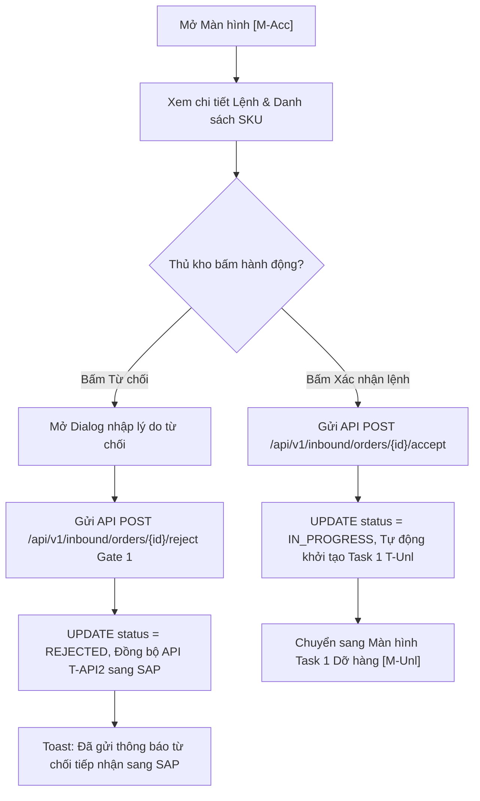

| Bước | Tác nhân | Hành động | Kết quả / Phản ứng hệ thống |
|---|---|---|---|
| 1 | Thủ kho | Xem thông tin Lệnh nhập kho | Hệ thống hiển thị đầy đủ thông tin đơn vị giao, tổng trọng lượng, thể tích và danh sách chi tiết SKU. |
| 2a | Thủ kho | Bấm **[Từ chối]** | Mở Modal nhập lý do từ chối $\rightarrow$ Nhập lý do $\rightarrow$ Gửi API `POST /api/v1/inbound/orders/{id}/reject`. Hệ thống cập nhật `status = 'REJECTED'` và gọi API `T-API2` đồng bộ lý do từ chối sang SAP. |
| 2b | Thủ kho | Bấm **[Xác nhận lệnh]** | Gửi API `POST /api/v1/inbound/orders/{id}/accept`. Hệ thống cập nhật `status = 'IN_PROGRESS'`, mở khóa Task 1 (`T-Unl`) và chuyển sang màn hình Task 1 Dỡ hàng (`[M-Unl]`). |

---

### 3.1.3. [M-Unl] Task 1: Dỡ hàng khỏi xe trên Mobile

#### ① Thông tin chung

| Mục | Nội dung |
|---|---|
| **Tên chức năng** | Task 1: Dỡ hàng khỏi xe trên Mobile `[M-Unl]` |
| **Mô tả** | Cho phép Nhân viên kho thực hiện công việc dỡ hàng từ xe container/xe tải của Nhà cung cấp xuống bãi Staging tại Dock nhận hàng, kiểm tra danh mục serial/vật tư và hoàn thành Task 1. |
| **Đường dẫn** | Danh sách task $\rightarrow$ Nhận việc Task 1 $\rightarrow$ Màn hình Dỡ hàng `[M-Unl]`. |
| **Phân quyền & Miền dữ liệu** | • **Thực hiện:** NV kho (`ROLE_WAREHOUSE_WORKER`). • **Miền dữ liệu:** Task 1 thuộc kho làm việc của NV kho. |

#### ② Màn hình

- **Link file ảnh UIUX:** [N3_Do_hang.png](file:///c:/Users/Admin/Desktop/ai-agent-wms/UIUX/Mobile/Nhap_Kho/N3_Do_hang.png)

- **Mô tả chi tiết giao diện:**
  - **Header đỏ:** Nút Back, Tiêu đề `Dỡ hàng`, Sub-title `Dock A2 · TSK-9921 · INB-2026-00118`, Button trắng `Gia hạn KPI`.
  - **Card Thông tin Tổng quan (Task Info Card):**
    - Order: `INB-2026-00118` | Dock: `Dock A2 · Khu nhận`.
    - NCC: `Ericsson Vietnam · NCC-0991`.
    - Tổng dòng hàng: `6 dòng · 208 cái`.
    - Tags phân loại mặt hàng: `3 Serial` (xanh nhạt), `3 Vật tư` (xanh nhạt).
  - **Danh sách HÀNG HÓA CẦN DỠ (Items To Unload Cards):**
    - Thẻ Serial: `Galaxy A15 128GB` (Tag Điện thoại, SKU: `SP-A001`, RFID: `RFID-0001-A1`, Badge đỏ `Serial 012345`).
    - Thẻ Serial: `Galaxy A25 256GB` (Tag Điện thoại, SKU: `SP-A002`, RFID: `RFID-0002-A1`, Badge đỏ `Serial 012346`).
    - Thẻ Serial: `Tai nghe Buds Pro` (Tag Phụ kiện, SKU: `SP-A003`, RFID: `RFID-0003-B2`, Badge đỏ `Serial 012347`).
    - Thẻ Vật tư theo SL: `Cáp sạc USB-C 1m` (Tag Vật tư, SKU: `SP-A004`, RFID: `RFID-0004-C3`, Số lượng số to: `50`).
    - Thẻ Vật tư theo SL: `Ống lót máy` (Tag Vật tư, SKU: `SP-A005`, RFID: `RFID-0005-D4`, Số lượng số to: `120`).
    - Thẻ Vật tư theo SL: `Keo dán chuyên dụng` (Tag Vật tư, SKU: `SP-A006`, RFID: `RFID-0006-E5`, Số lượng số to: `35`).
  - **Bottom Action Button:** Button solid màu đỏ rộng `Hoàn thành` (Kèm Icon Check trắng).

#### ③ Bảng 6 cột thành phần UI

| STT | Tên | Kiểu dữ liệu [Độ dài] | Input/Output | Giá trị khởi tạo | Mô tả (Mapping với CSDL nếu có) |
|---|---|---|---|---|---|
| 1 | `btn_back` | Icon Button | Input/Trigger | Enabled | Click quay lại danh sách Task. |
| 2 | `lbl_dock_task_info` | Text / String | Output | Task Header | Hiển thị mã Dock, Mã Task và Mã Lệnh trên Header. |
| 3 | `btn_extend_kpi` | Pill Button / Trigger | Input/Trigger | Active | Label: `Gia hạn KPI`. Bấm mở popup xin gia hạn KPI task. |
| 4 | `val_order_code` | Bold Text / String [50] | Output | Order ID | Mã Lệnh nhập kho (`inbound_orders.order_code`). |
| 5 | `val_dock_location` | Text / String [100] | Output | Dock Location | Vị trí Dock hạ hàng (`tasks.dock_code`). |
| 6 | `val_supplier_info` | Text / String [255] | Output | Supplier Info | Tên Nhà cung cấp và Mã NCC (`inbound_orders.supplier_name`). |
| 7 | `val_lines_summary` | Text / String [50] | Output | Total Lines/Qty | Tổng số dòng hàng và tổng số cái. |
| 8 | `tag_serial_count` | Tag Badge / String | Output | `3 Serial` | Badge số lượng SKU quản lý theo Serial. |
| 9 | `tag_item_count` | Tag Badge / String | Output | `3 Vật tư` | Badge số lượng SKU quản lý theo Số lượng vật tư. |
| 10 | `lst_unload_items` | Vertical ListView / Object Array | Output | Unload Items | Danh sách các thẻ hàng hóa cần dỡ xuống bãi Staging. |
| 11 | `col_item_name` | Bold Text / String [255] | Output | Item Name | Tên diễn giải vật tư/hàng hóa. |
| 12 | `col_cat_tag` | Pill Tag / String | Output | Category Tag | Tag phân loại nhóm hàng (`Điện thoại`, `Phụ kiện`, `Vật tư`). |
| 13 | `col_sku_code` | Text / String [50] | Output | SKU Code | Mã SKU sản phẩm (`SP-A001`...). |
| 14 | `col_rfid_code` | Text / String [50] | Output | RFID Code | Mã RFID đại diện thùng/kiện. |
| 15 | `col_serial_or_qty` | Bold Badge / String | Output | Serial / Qty | Hiển thị Badge đỏ Serial (vd `Serial 012345`) hoặc Số lượng số to (vd `50`, `120`). |
| 16 | `btn_complete_unload` | Solid Red Button | Input/Trigger | Active | Label: `Hoàn thành`. Mở dialog xác nhận và gửi API hoàn thành Task 1 dỡ hàng. |

#### ④ Luồng xử lý nghiệp vụ

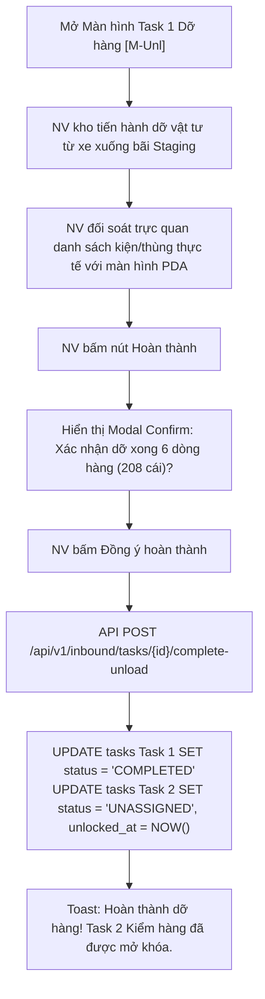

| Bước | Tác nhân | Hành động | Kết quả / Phản ứng hệ thống |
|---|---|---|---|
| 1 | NV kho | Tiến hành dỡ hàng tại Dock | Dỡ hàng từ xe tải xuống bãi Staging theo đúng vị trí Dock A2 chỉ định. |
| 2 | NV kho | Đối soát các dòng hàng trên PDA | Kiểm tra các thẻ SKU, Serial và Số lượng vật tư trùng khớp danh sách trên màn hình Mobile. |
| 3 | NV kho | Bấm nút **[Hoàn thành]** | Hệ thống hiển thị Modal Confirm xác nhận dỡ hàng. |
| 4 | NV kho | Bấm **[Đồng ý hoàn thành]** | Gửi API `POST /api/v1/inbound/tasks/{id}/complete-unload`. Cập nhật Task 1 `status = 'COMPLETED'`, ghi nhận mốc thời gian `t_unl_time = NOW()`, đồng thời mở khóa Task 2 (`T-Ho` kiểm hàng). |

---

### 3.1.4. [M-Chk] Task 2: Kiểm hàng theo PO trên Mobile

#### ① Thông tin chung

| Mục | Nội dung |
|---|---|
| **Tên chức năng** | Task 2: Kiểm hàng theo PO trên Mobile `[M-Chk]` |
| **Mô tả** | Cho phép Nhân viên kho / Thủ kho thực hiện kiểm đếm số lượng, quét mã Serial/IMEI hoặc Barcode/RFID từng kiện hàng để đối soát với chứng từ PO, ghi nhận kết quả kiểm hàng tại chỗ. |
| **Đường dẫn** | Danh sách task $\rightarrow$ Chọn Task 2 Kiểm hàng $\rightarrow$ Màn hình Kiểm hàng theo PO `[M-Chk]`. |
| **Phân quyền & Miền dữ liệu** | • **Thực hiện:** NV kho (`ROLE_WAREHOUSE_WORKER`), Thủ kho (`ROLE_WAREHOUSE_MASTER`). • **Miền dữ liệu:** Task thuộc kho phụ trách. |

#### ② Màn hình

- **Link file ảnh UIUX:** [N4_Kiem_hang.png](file:///c:/Users/Admin/Desktop/ai-agent-wms/UIUX/Mobile/Nhap_Kho/N4_Kiem_hang.png)

- **Mô tả chi tiết giao diện:**
  - **Header đỏ:** Nút Back, Tiêu đề `Kiểm hàng theo PO`, Sub-title `PO-2026-00118 · 6 dòng`, Nút `Gia hạn KPI`.
  - **Thanh Quét & Đầu đọc (Scan Bar Block):**
    - Ô nhập/Quét tối màu: Icon scan góc trái, Placeholder `QUÉT SERIAL/IMEI...`.
    - Nút Camera đỏ vuông góc phải: Icon Camera kích hoạt quét Barcode/QR bằng camera điện thoại.
    - Sub-text gợi ý: `Quét barcode/RFID hoặc nhập serial thủ công.`
  - **Danh sách Hàng hóa Kiểm đếm:** Card hiển thị thông tin từng mặt hàng khớp với thực tế kiểm đếm (SKU, Serial, Mã RFID đại diện, Số lượng).
  - **Bottom Bar Dual Buttons (2 Nút dưới cùng):**
    - Button `Từ chối` (Outline tròn Icon X).
    - Button `Nhận hàng` (Solid Red Primary Button Icon Check V).

#### ③ Bảng 6 cột thành phần UI

| STT | Tên | Kiểu dữ liệu [Độ dài] | Input/Output | Giá trị khởi tạo | Mô tả (Mapping với CSDL nếu có) |
|---|---|---|---|---|---|
| 1 | `btn_back` | Icon Button | Input/Trigger | Enabled | Click quay lại danh sách Task. |
| 2 | `lbl_po_header` | Text / String | Output | PO Code | Hiển thị mã PO chứng từ và số dòng hàng. |
| 3 | `btn_extend_kpi` | Pill Button | Input/Trigger | Active | Label: `Gia hạn KPI`. Bấm để xin gia hạn thời gian kiểm hàng. |
| 4 | `txt_scan_input` | Textbox / String [100] | Input | Placeholder | Ô quét/nhập mã Serial/IMEI/RFID thủ công hoặc qua đầu đọc laser PDA. |
| 5 | `btn_camera_scan` | Square Red Icon Button | Input/Trigger | Active | Click mở Camera điện thoại để quét mã vạch Barcode/QR Code. |
| 6 | `lst_check_items` | Vertical ListView / Object Array | Output | Items List | Danh sách mặt hàng kiểm đếm (`inbound_order_items`). |
| 7 | `col_item_sku_name` | Text / String [255] | Output | SKU & Name | Tên sản phẩm, nhóm hàng và Mã SKU. |
| 8 | `col_rfid_serial` | Text / String [100] | Output | RFID & Serial | Mã RFID chip và mã Serial/IMEI của sản phẩm. |
| 9 | `btn_reject_check` | Outline Red Button | Input/Trigger | Active | Label: `Từ chối`. Bấm để báo từ chối nhận hàng do sai lệch chất lượng/chủng loại (Gate 2). |
| 10 | `btn_accept_check` | Solid Red Button | Input/Trigger | Active | Label: `Nhận hàng`. Chấp nhận kết quả kiểm hàng và chuyển sang bước ký Biên bản bàn giao (`[M-Sig1]`). |

#### ④ Luồng xử lý nghiệp vụ

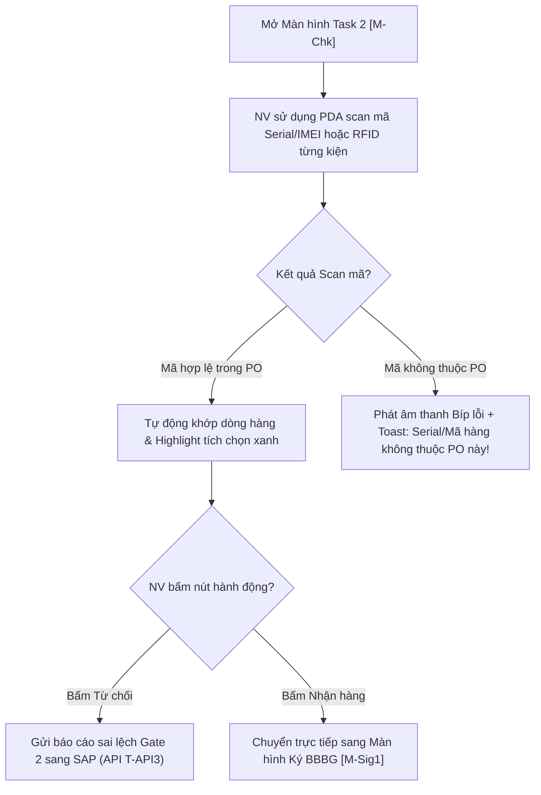

| Bước | Tác nhân | Hành động | Kết quả / Phản ứng hệ thống |
|---|---|---|---|
| 1 | NV kho | Quét Serial/IMEI hoặc Barcode/RFID | Sử dụng camera hoặc đầu đọc PDA quét mã. Hệ thống tự động so khớp SKU/Serial với danh sách PO. |
| 2a | NV kho | Nhận cảnh báo nếu sai mã | Nếu quét mã không thuộc PO, hiển thị Toast cảnh báo đỏ và phát tiếng Bíp lỗi. |
| 2b | NV kho | Nhận kết quả so khớp thành công | Highlight dòng sản phẩm đã kiểm đủ số lượng. |
| 3a | NV kho | Bấm **[Từ chối]** | Mở dialog nhập nguyên nhân lập biên bản bất hợp lệ/sai lệch $\rightarrow$ Gọi API `T-API3` gửi SAP. |
| 3b | NV kho | Bấm **[Nhận hàng]** | Lưu kết quả kiểm đếm thực tế thành công và chuyển màn hình sang `[M-Sig1] Ký Biên bản bàn giao`. |

---

### 3.1.5. [M-Sig1] Task 2 (tiếp): Ký Biên bản bàn giao điện tử

#### ① Thông tin chung

| Mục | Nội dung |
|---|---|
| **Tên chức năng** | Task 2 (tiếp): Ký Biên bản bàn giao điện tử trên Mobile `[M-Sig1]` |
| **Mô tả** | Cho phép Thủ kho / NV kho và Tài xế Đối tác xem trước file PDF Biên bản bàn giao (BBBG), ký trực tiếp bằng chữ ký tay trên màn hình di động hoặc chụp/upload ảnh bản cứng BBBG đã ký. |
| **Đường dẫn** | Màn hình Kiểm hàng `[M-Chk]` $\rightarrow$ Bấm Nhận hàng $\rightarrow$ Màn hình Ký BBBG `[M-Sig1]`. |
| **Phân quyền & Miền dữ liệu** | • **Thực hiện:** Thủ kho (`ROLE_WAREHOUSE_MASTER`), NV kho (`ROLE_WAREHOUSE_WORKER`), Đối tác/Tài xế (`ROLE_PARTNER`). • **Miền dữ liệu:** Đơn hàng kiểm đếm hiện tại. |

#### ② Màn hình

- **Link file ảnh UIUX:** [N5_Ky_BBBG.png](file:///c:/Users/Admin/Desktop/ai-agent-wms/UIUX/Mobile/Nhap_Kho/N5_Ky_BBBG.png)

- **Mô tả chi tiết giao diện:**
  - **Header đỏ:** Nút Back, Tiêu đề `Ký Biên bản bàn giao`, Sub-title `BBBG-2026/05/18-021`.
  - **Card 1 — Xem trước PDF BBBG (PDF Preview Card):**
    - Tiêu đề card collapsible: Icon tài liệu đỏ `Xem trước PDF BBBG`.
    - Khung nét đứt nhạt xem trước file: Icon PDF to, tên file `BBBG-2026/05/18-021.pdf`, dung lượng `2 trang · 245 KB`.
    - 2 button thao tác file: Nút `Tải về` (Border đỏ chữ đỏ), Nút `In` (Outline xám).
  - **Card 2 — CHỮ KÝ NGƯỜI KIỂM HÀNG (Digital Signature Box Card):**
    - Khung vẽ chữ ký nét đứt màu xám: Icon bút chì `Bấm để thêm chữ ký`, Sub-text `Upload ảnh hoặc chụp ảnh`.
    - Option đính kèm ảnh: Icon ảnh `Upload ảnh BB ký tay`.
  - **Bottom Action Button:** Button solid màu đỏ rộng `Hoàn thành` (Icon Check V trắng).

#### ③ Bảng 6 cột thành phần UI

| STT | Tên | Kiểu dữ liệu [Độ dài] | Input/Output | Giá trị khởi tạo | Mô tả (Mapping với CSDL nếu có) |
|---|---|---|---|---|---|
| 1 | `btn_back` | Icon Button | Input/Trigger | Enabled | Click quay lại màn hình kiểm hàng. |
| 2 | `lbl_bbbg_code_header` | Text / String | Output | BBBG Code | Mã biên bản bàn giao sinh tự động (`BBBG-2026/05/18-021`). |
| 3 | `btn_download_pdf` | Outline Red Button | Input/Trigger | Active | Label: `Tải về`. Tải file PDF BBBG về bộ nhớ máy di động. |
| 4 | `btn_print_pdf` | Outline Grey Button | Input/Trigger | Active | Label: `In`. Lệnh in trực tiếp file BBBG qua kết nối máy in Wi-Fi/Bluetooth. |
| 5 | `box_signature_canvas` | Touch Canvas / Base64 Image | Input | Empty | Vùng cảm ứng điện dung cho phép người dùng ký tay trực tiếp bằng ngón tay/bút cảm ứng. |
| 6 | `btn_upload_paper_bbbg` | Link Icon Button | Input/Trigger | Active | Label: `Upload ảnh BB ký tay`. Mở Camera chụp ảnh hoặc chọn ảnh bản cứng BBBG từ thư viện máy. |
| 7 | `btn_complete_bbbg` | Solid Red Button | Input/Trigger | Active | Label: `Hoàn thành`. Lưu chữ ký, phát hành BBBG điện tử và hoàn tất Task 2. |

#### ④ Luồng xử lý nghiệp vụ

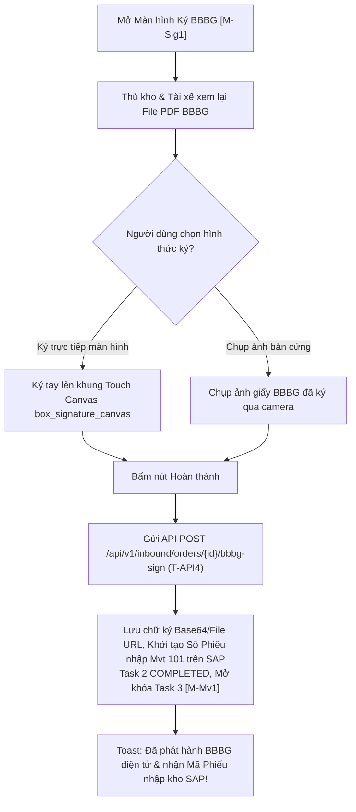

| Bước | Tác nhân | Hành động | Kết quả / Phản ứng hệ thống |
|---|---|---|---|
| 1 | Thủ kho / Tài xế | Xem trước nội dung PDF BBBG | Kiểm tra lại các thông số số lượng bàn giao thực tế trên file PDF. |
| 2 | Thủ kho / Tài xế | Thực hiện ký xác nhận | Ký tay trực tiếp trên khung cảm ứng di động hoặc bấm chụp ảnh bản cứng đã ký tên. |
| 3 | Thủ kho | Bấm **[Hoàn thành]** | Gọi API `T-API4` gửi chữ ký và xác nhận BBBG điện tử sang SAP. SAP trả về mã Số Phiếu nhập kho (`Material Doc Mvt 101`). Task 2 chuyển `COMPLETED`, mở khóa Task 3 (`T-Mv1`). |

---

### 3.1.6. [M-Mv1] Task 3: Đưa vào khu chờ nhập trên Mobile

#### ① Thông tin chung

| Mục | Nội dung |
|---|---|
| **Tên chức năng** | Task 3: Đưa vào khu chờ nhập trên Mobile `[M-Mv1]` |
| **Mô tả** | Cho phép Nhân viên kho thực hiện di chuyển các đơn vị xử lý hàng hóa (Handling Unit - HU) từ bãi Staging Dock vào vị trí bãi lưu tạm Khu chờ nhập (`C02-Wait`), gán thẻ chip RFID cho từng HU. |
| **Đường dẫn** | Danh sách task $\rightarrow$ Chọn Task 3 Khu chờ nhập $\rightarrow$ Màn hình `[M-Mv1]`. |
| **Phân quyền & Miền dữ liệu** | • **Thực hiện:** NV kho (`ROLE_WAREHOUSE_WORKER`). • **Miền dữ liệu:** Task thuộc kho di động phụ trách. |

#### ② Màn hình

- **Link file ảnh UIUX:** [N8.5_Khu_cho_nhap.png](file:///c:/Users/Admin/Desktop/ai-agent-wms/UIUX/Mobile/Nhap_Kho/N8.5_Khu_cho_nhap.png)

- **Mô tả chi tiết giao diện:**
  - **Header đỏ:** Nút Back, Tiêu đề `Khu chờ nhập`, Sub-title `INB-2026-00118 · 5 HU`, Nút `Gia hạn KPI`.
  - **Danh sách CÁC ĐƠN VỊ HU (Handling Unit Cards):**
    - Thẻ `HU-10211`: Tên SP `Galaxy A15 128GB`, Khung input Loại thùng (`Carton 50`), Khung input Mã RFID (`RFID-10211-A1`).
    - Thẻ `HU-10212`: Tên SP `Galaxy A25 256GB`, Loại thùng (`Carton 50`), Mã RFID (`RFID-10212-A1`).
    - Thẻ `HU-10213`: Tên SP `Tai nghe Buds Pro`, Loại thùng (`Carton 25`), Mã RFID (`RFID-10213-B2`).
    - Thẻ `HU-10214`: Tên SP `Cáp sạc USB-C 1m`, Loại thùng (`Carton 100`), Mã RFID (`RFID-10214-C3`).
    - Thẻ `HU-10215`: Tên SP `Keo dán chuyên dụng`, Loại thùng (`Carton 100`), Mã RFID (`RFID-10215-E5`).
  - **Bottom Action Button:** Button solid màu đỏ `Hoàn thành` (Icon Check V).

#### ③ Bảng 6 cột thành phần UI

| STT | Tên | Kiểu dữ liệu [Độ dài] | Input/Output | Giá trị khởi tạo | Mô tả (Mapping với CSDL nếu có) |
|---|---|---|---|---|---|
| 1 | `btn_back` | Icon Button | Input/Trigger | Enabled | Click quay lại danh sách Task. |
| 2 | `lbl_hu_header_info` | Text / String | Output | Header Info | Hiển thị Mã Order và tổng số đơn vị HU (`INB-2026-00118 · 5 HU`). |
| 3 | `btn_extend_kpi` | Pill Button | Input/Trigger | Active | Label: `Gia hạn KPI`. |
| 4 | `lst_hu_cards` | Vertical ListView / Object Array | Output | List HU | Danh sách các đơn vị xử lý đóng gói HU (`handling_units`). |
| 5 | `col_hu_code` | Red Bold Text / String [50] | Output | HU Code | Mã định danh đơn vị đóng gói (`HU-10211`...). |
| 6 | `col_product_name` | Text / String [255] | Output | Product Name | Tên mặt hàng chứa trong HU. |
| 7 | `txt_carton_type` | Readonly Input Box / String | Output | Carton Type | Quy cách đóng gói đại diện (`Carton 50`, `Carton 100`...). |
| 8 | `txt_rfid_code` | Input Box / String [50] | Input/Output | RFID Code | Mã RFID đại diện gán cho HU (`RFID-10211-A1`...). Đọc tự động qua sóng đầu đọc RFID PDA. |
| 9 | `btn_complete_move_wait` | Solid Red Button | Input/Trigger | Active | Label: `Hoàn thành`. Xác nhận chuyển hàng vào khu chờ nhập bãi Staging và hoàn thành Task 3. |

#### ④ Luồng xử lý nghiệp vụ

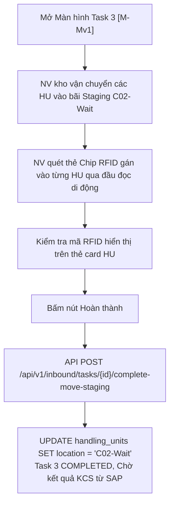

| Bước | Tác nhân | Hành động | Kết quả / Phản ứng hệ thống |
|---|---|---|---|
| 1 | NV kho | Di chuyển kiện hàng vào bãi `C02-Wait` | Đưa hàng vào vị trí bãi lưu tạm chờ kiểm định chất lượng KCS. |
| 2 | NV kho | Quét gán mã RFID cho từng HU | Kích hoạt đầu đọc RFID di động để đọc mã chip dán trên thùng. |
| 3 | NV kho | Bấm **[Hoàn thành]** | Cập nhật vị trí bãi Staging của các HU là `C02-Wait`, chuyển Task 3 thành `COMPLETED`. Hệ thống chờ kết quả KCS từ SAP (`T-API5`). |

---

### 3.1.7. [M-AGR] Task 4: Thực nhập kho trên Mobile (KCS)

#### ① Thông tin chung

| Mục | Nội dung |
|---|---|
| **Tên chức năng** | Task 4: Thực nhập kho trên Mobile `[M-AGR]` |
| **Mô tả** | Cho phép Thủ kho xem báo cáo kết quả nghiệm thu KCS bóc tách mã Cha $\rightarrow$ Mã Con từ SAP dội về (bao gồm Hàng đạt và Hàng không đạt cùng giá trị tài sản), xác nhận Thực nhập kho. |
| **Đường dẫn** | Danh sách task $\rightarrow$ Task 4 Thực nhập $\rightarrow$ Màn hình `[M-AGR]`. |
| **Phân quyền & Miền dữ liệu** | • **Thực hiện:** Thủ kho (`ROLE_WAREHOUSE_MASTER`). • **Miền dữ liệu:** Lệnh nhập tại kho quản lý. |

#### ② Màn hình

- **Link file ảnh UIUX:** [N6_Thuc_nhap.png](file:///c:/Users/Admin/Desktop/ai-agent-wms/UIUX/Mobile/Nhap_Kho/N6_Thuc_nhap.png)

- **Mô tả chi tiết giao diện:**
  - **Header đỏ:** Nút Back, Tiêu đề `Thực nhập`, Sub-title `INB-2026-00118 · Gửi SAP`.
  - **Khung Summary KCS (2 Thẻ Thống kê):**
    - *Thẻ Hàng Đạt (Xanh lá):* Số dòng đạt (`3`), Chi tiết số lượng/khối lượng/thể tích (`2,796 cái · 488.5 kg · 1.43 m³`), Tag giá trị xanh (`Trị giá: 4.03 tỷ`).
    - *Thẻ Hàng Không Đạt (Đỏ):* Số dòng không đạt (`3`), Chi tiết (`9 cái · 1 kg · 0.005 m³`), Tag giá trị đỏ (`Trị giá: 16.0 triệu`).
  - **Danh sách HÀNG HÓA KCS (Detailed KCS Cards):**
    - `Galaxy A15 128GB`: Badge xanh `Đạt`, SKU `SP-A001`, RFID `RFID-0001-A1`, Giá trị `4.00 tỷ`.
    - `Galaxy A25 256GB`: Badge hồng `Không đạt`, Giá trị `3.60 tỷ`, Chi tiết đếm: `Đạt: 598 cái · 180 kg` | `Không đạt: 2 cái · 0.6 kg`.
    - `Tai nghe Buds Pro`: Badge hồng `Không đạt`, Giá trị `2.40 tỷ`, Chi tiết đếm: `Đạt: 1195 cái · 48 kg` | `Không đạt: 5 cái · 0.2 kg`.
    - `Cáp sạc USB-C 1m`: Badge xanh `Đạt`, Số lượng `50`, Giá trị `10.0 triệu`.
    - `Ống lót máy`: Badge hồng `Không đạt`, Giá trị `60.0 triệu`, `Đạt: 118 cái` | `Không đạt: 2 cái`.
    - `Keo dán chuyên dụng`: Badge xanh `Đạt`, Số lượng `35`, Giá trị `15.0 triệu`.
  - **Bottom Action Button:** Button solid đỏ `Hoàn thành` (Icon Check V).

#### ③ Bảng 6 cột thành phần UI

| STT | Tên | Kiểu dữ liệu [Độ dài] | Input/Output | Giá trị khởi tạo | Mô tả (Mapping với CSDL nếu có) |
|---|---|---|---|---|---|
| 1 | `btn_back` | Icon Button | Input/Trigger | Enabled | Click quay lại danh sách Task. |
| 2 | `lbl_sap_sync_header` | Text / String | Output | Header Info | Mã Lệnh nhập kho kèm trạng thái gửi SAP (`INB-2026-00118 · Gửi SAP`). |
| 3 | `card_kcs_pass_summary` | Summary Box / Green | Output | Pass Summary | Khung tổng hợp Hàng Đạt (Số dòng, số cái, kg, m³ và Trị giá tiền tỷ). |
| 4 | `card_kcs_fail_summary` | Summary Box / Red | Output | Fail Summary | Khung tổng hợp Hàng Không Đạt (Số dòng, số cái, kg, m³ và Trị giá triệu). |
| 5 | `lst_kcs_items` | Vertical ListView / Object Array | Output | KCS List | Danh sách bóc tách chi tiết kết quả KCS (`kcs_decomposed_items`). |
| 6 | `col_pass_fail_badge` | Tag Badge / String | Output | Badge Tag | Tag màu hiển thị kết quả `Đạt` (xanh) hoặc `Không đạt` (hồng). |
| 7 | `col_item_value_text` | Bold Blue Text / String | Output | Currency String | Hiển thị tổng giá trị tài sản vật tư (`Giá trị hàng hóa: 4.00 tỷ`...). |
| 8 | `col_split_qty_details` | Red/Black Text / String | Output | Qty Details | Đối với dòng có hàng lỗi: Hiển thị tách biệt số lượng Đạt và Không đạt. |
| 9 | `btn_complete_agr_task` | Solid Red Button | Input/Trigger | Active | Label: `Hoàn thành`. Xác nhận Thực nhập kho và chốt tồn kho SAP (Loại tồn `UU` đạt / `Blocked` không đạt). |

#### ④ Luồng xử lý nghiệp vụ

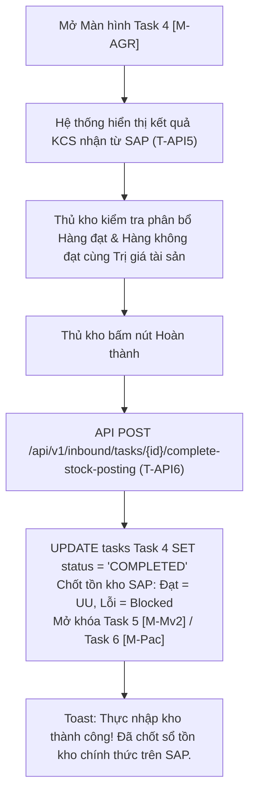

| Bước | Tác nhân | Hành động | Kết quả / Phản ứng hệ thống |
|---|---|---|---|
| 1 | Thủ kho | Xem bảng kết quả nghiệm thu KCS | Đối soát chi tiết danh sách SKU đạt/lỗi cùng tổng giá trị tiền tài sản. |
| 2 | Thủ kho | Bấm nút **[Hoàn thành]** | Gửi API `T-API6` xác nhận thực nhập với SAP. Ghi nhận tăng tồn kho chính thức (`UU` với hàng Đạt, `Blocked` với hàng Không đạt). Hoàn thành Task 4 và mở khóa bước đóng gói. |

---

### 3.1.8. [M-VOff] Trình ký VOffice Phiếu nhập kho trên Mobile

#### ① Thông tin chung

| Mục | Nội dung |
|---|---|
| **Tên chức năng** | Trình ký VOffice Phiếu nhập kho trên Mobile `[M-VOff]` |
| **Mô tả** | Cho phép Thủ kho chọn mẫu chân ký, danh sách người ký / người nhận và gửi hồ sơ Phiếu nhập kho từ WMS di động sang hệ thống Văn phòng điện tử V-Office Tập đoàn để thực hiện trình ký số. |
| **Đường dẫn** | Chức năng Nhập kho $\rightarrow$ Trình ký VOffice $\rightarrow$ Màn hình `[M-VOff]`. |
| **Phân quyền & Miền dữ liệu** | • **Thực hiện:** Thủ kho (`ROLE_WAREHOUSE_MASTER`), Giám đốc kho (`ROLE_WAREHOUSE_DIRECTOR`). • **Miền dữ liệu:** Phiếu nhập kho đã hoàn thành Thực nhập tại kho quản lý. |

#### ② Màn hình

- **Link file ảnh UIUX:** [N7_Ky_VOffice.png](file:///c:/Users/Admin/Desktop/ai-agent-wms/UIUX/Mobile/Nhap_Kho/N7_Ky_VOffice.png)

- **Mô tả chi tiết giao diện:**
  - **Header đỏ:** Nút Back, Tiêu đề `Ký VOffice`, Sub-title `Phiếu nhập GR-2026/05/14-018`, Nút `Gia hạn KPI`.
  - **Card Preview Phiếu nhập (Document Preview Card):**
    - Khung xem trước: Icon file ký duyệt, tên file `Preview Phiếu nhập kho GR-2026/05/14-018 · 2 trang`.
    - 2 Button thao tác: `Xem phiếu nhập` (Outline xám), `Xem BBBG` (Outline xám).
  - **Card Thông tin Hồ sơ Trình ký (Submission Info Card):**
    - Số phiếu nhập: `GR-2026/05/14-018` | Người trình: `Trần Văn Kho`.
    - Trạng thái: Badge màu cam `Chờ ký`.
  - **Khối MẪU CHÂN KÝ (Sign Pattern Selector):** Dropdown select `Mẫu 1 · 3 người ký`.
  - **Khối DANH SÁCH NGƯỜI KÝ (3 người):**
    - `#1`: `Trần Văn Kho - NV-001` (Thủ kho - Kho HN01).
    - `#2`: `Nguyễn Hữu An - NV-002` (Nhân viên KCS - Kho HN01).
    - `#3`: `Mai Thị Lan - NV-003` (Kế toán kho - Phòng TCKT).
  - **Khối DANH SÁCH NGƯỜI NHẬN (2 người):**
    - `#1`: `Lê Văn Tiến - NV-101` (Giám đốc kho - Ban Giám đốc).
    - `#2`: `Hoàng Thị Mai - NV-102` (Trưởng phòng KSNB - Phòng KSNB).
  - **Bottom Action Button:** Button solid màu đỏ rộng `Ký xác nhận VOffice` (Icon Bút ký trắng).

#### ③ Bảng 6 cột thành phần UI

| STT | Tên | Kiểu dữ liệu [Độ dài] | Input/Output | Giá trị khởi tạo | Mô tả (Mapping với CSDL nếu có) |
|---|---|---|---|---|---|
| 1 | `btn_back` | Icon Button | Input/Trigger | Enabled | Click quay lại danh sách. |
| 2 | `lbl_gr_code_header` | Text / String | Output | Header Info | Mã phiếu nhập kho (`GR-2026/05/14-018`). |
| 3 | `btn_view_gr_pdf` | Outline Button | Input/Trigger | Active | Label: `Xem phiếu nhập`. Mở xem trước PDF Phiếu nhập kho. |
| 4 | `btn_view_bbbg_pdf` | Outline Button | Input/Trigger | Active | Label: `Xem BBBG`. Mở xem trước PDF Biên bản bàn giao đính kèm. |
| 5 | `val_gr_code` | Bold Text / String [50] | Output | GR Code | Mã số phiếu nhập kho trên WMS (`voffice_submissions.gr_code`). |
| 6 | `val_submitter_name` | Text / String [100] | Output | Submitter | Họ tên cán bộ thực hiện trình ký VOffice. |
| 7 | `badge_voffice_status` | Status Tag / String | Output | `Chờ ký` | Badge trạng thái trình ký VOffice (`voffice_submissions.status`). |
| 8 | `cbo_sign_template` | Dropdown Select / String | Input | `Mẫu 1 · 3 người ký` | Dropdown chọn luồng/mẫu chân ký quy định. |
| 9 | `lst_signers` | Vertical ListView / Object Array | Output | Signers List | Danh sách người duyệt ký số theo thứ tự luồng `#1`, `#2`, `#3`. |
| 10 | `lst_receivers` | Vertical ListView / Object Array | Output | Receivers List | Danh sách cán bộ nhận thông báo nhận phiếu khi hoàn tất. |
| 11 | `btn_submit_voffice` | Solid Red Button | Input/Trigger | Active | Label: `Ký xác nhận VOffice`. Gửi API `V-API1` tạo hồ sơ trình ký sang hệ thống V-Office Tập đoàn. |

#### ④ Luồng xử lý nghiệp vụ

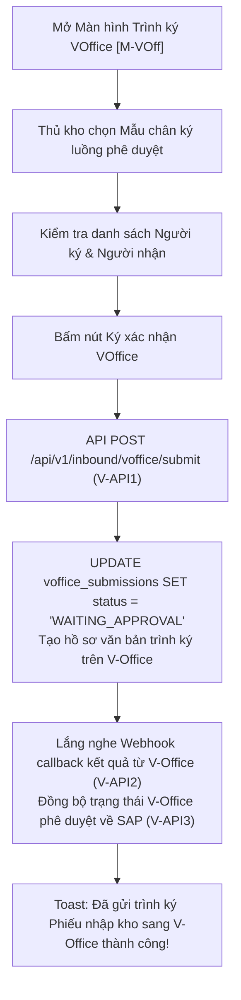

| Bước | Tác nhân | Hành động | Kết quả / Phản ứng hệ thống |
|---|---|---|---|
| 1 | Thủ kho | Chọn Mẫu chân ký và xem danh sách | Chọn luồng trình ký chuẩn Tập đoàn và kiểm tra thứ tự cán bộ phê duyệt. |
| 2 | Thủ kho | Bấm **[Ký xác nhận VOffice]** | Gửi API `V-API1` đẩy hồ sơ văn bản Phiếu nhập kho kèm BBBG sang V-Office. Cập nhật trạng thái `WAITING_APPROVAL`. Lắng nghe Callback `V-API2` và đẩy kết quả duyệt về SAP `V-API3`. |

---

### 3.1.9. [M-Pac] Task 6: Đóng gói & In tem RFID trên Mobile

#### ① Thông tin chung

| Mục | Nội dung |
|---|---|
| **Tên chức năng** | Task 6: Đóng gói & In tem RFID trên Mobile `[M-Pac]` |
| **Mô tả** | Cho phép Nhân viên kho tổng hợp quy cách đóng gói (số lượng thùng carton, pallet, thùng gỗ), chọn loại thùng đóng gói, quét/gán thẻ mã RFID và chọn máy in tem di động để thực hiện lệnh in tem chip RFID dán lên kiện. |
| **Đường dẫn** | Danh sách task $\rightarrow$ Task 6 Đóng gói & In tem $\rightarrow$ Màn hình `[M-Pac]`. |
| **Phân quyền & Miền dữ liệu** | • **Thực hiện:** NV kho (`ROLE_WAREHOUSE_WORKER`). • **Miền dữ liệu:** Task đóng gói tại kho di động. |

#### ② Màn hình

- **Link file ảnh UIUX:** [N8_Dong_goi_In_tem.png](file:///c:/Users/Admin/Desktop/ai-agent-wms/UIUX/Mobile/Nhap_Kho/N8_Dong_goi_In_tem.png)

- **Mô tả chi tiết giao diện:**
  - **Header đỏ:** Nút Back, Tiêu đề `Đóng gói & In tem`, Sub-title `SP-A001 · 800 cái`, Nút `Gia hạn KPI`.
  - **Khung Tổng hợp Quy cách Đóng gói (Packing Summary Bar Card):**
    - *TỔNG KG / M³:* `2,450 kg · 18.5 m³`.
    - *THÙNG CARTON:* `16` (`8loại 1  5loại 2  3loại 3`).
    - *PALLET:* `2` (`1loại 1  1loại 2`).
    - *THÙNG GỖ:* `4` (`2loại 1  2loại 2`).
  - **Danh sách MẶT HÀNG ĐÓNG GÓI (Item Pack Selector Cards):**
    - `Galaxy A15 128GB` (SKU: `SP-A001`, Serial: `SN-2026-0012345`): Dropdown *Loại thùng* (`Carton 50`), Input *Mã RFID* (`RFID-0001-A1` kèm Icon Scan bên phải).
    - `Galaxy A25 256GB` (SKU: `SP-A002`, Serial: `SN-2026-0012346`): Dropdown *Loại thùng* (`Carton 50`), Input *Mã RFID* (`RFID-0002-A1` kèm Icon Scan).
    - `Tai nghe Buds Pro` (SKU: `SP-A003`, Serial: `SN-2026-0012347`): Dropdown *Loại thùng* (`Carton 25`), Input *Mã RFID* (`RFID-0003-B2` kèm Icon Scan).
    - `Cáp sạc USB-C 1m` (SKU: `SP-A004`): Dropdown *Loại thùng* (`Carton 100`), Input *Mã RFID* (`RFID-0004-C3` kèm Icon Scan).
  - **Khối Chọn Máy In (Printer Selection Card):** Dropdown select MÁY IN: `PRT-PACK-01 · Zebra ZT411`.
  - **Bottom Dual Buttons:**
    - Button `In tem` (Outline Button Icon Máy in tròn).
    - Button `Hoàn thành` (Solid Red Primary Button Icon Check V).

#### ③ Bảng 6 cột thành phần UI

| STT | Tên | Kiểu dữ liệu [Độ dài] | Input/Output | Giá trị khởi tạo | Mô tả (Mapping với CSDL nếu có) |
|---|---|---|---|---|---|
| 1 | `btn_back` | Icon Button | Input/Trigger | Enabled | Click quay lại danh sách Task. |
| 2 | `lbl_pack_item_header` | Text / String | Output | Header Info | Tiêu đề và tổng số lượng cái của dòng đóng gói (`SP-A001 · 800 cái`). |
| 3 | `btn_extend_kpi` | Pill Button | Input/Trigger | Active | Label: `Gia hạn KPI`. |
| 4 | `val_total_weight_vol` | Bold Text / String | Output | Weight/Vol | Hiển thị tổng trọng lượng và tổng thể tích đóng gói (`2,450 kg / 18.5 m³`). |
| 5 | `val_carton_count` | Bold Text / String | Output | Carton Summary | Tổng số lượng và phân loại thùng carton (`16`). |
| 6 | `val_pallet_count` | Bold Text / String | Output | Pallet Summary | Tổng số lượng và phân loại pallet (`2`). |
| 7 | `val_wood_box_count` | Bold Text / String | Output | Wood Summary | Tổng số lượng và phân loại thùng gỗ (`4`). |
| 8 | `lst_pack_items` | Vertical ListView / Object Array | Output | Pack Items | Danh sách chi tiết các mặt hàng thực hiện đóng gói và gán tem chip. |
| 9 | `cbo_carton_type` | Dropdown Select / String | Input | `Carton 50` | Chọn quy cách thùng đóng gói phù hợp cho mặt hàng. |
| 10 | `txt_rfid_code` | Input Box / String [50] | Input/Output | RFID Code | Mã chip RFID ghi dán tem thùng (`RFID-0001-A1`...). |
| 11 | `btn_scan_rfid` | Icon Scanner Button | Input/Trigger | Active | Click mở nhanh bộ đọc thẻ di động để quét nạp mã RFID. |
| 12 | `cbo_printer_select` | Dropdown Select / String | Input | `PRT-PACK-01` | Chọn máy in tem RFID di động kết nối (Zebra ZT411 / ZD621...). |
| 13 | `btn_print_labels` | Outline Red Button | Input/Trigger | Active | Label: `In tem`. Phát lệnh gửi dữ liệu in tem chip RFID trực tiếp sang máy in chỉ định. |
| 14 | `btn_complete_packing` | Solid Red Button | Input/Trigger | Active | Label: `Hoàn thành`. Xác nhận hoàn thành đóng gói in tem và mở khóa Task 7 Putaway. |

#### ④ Luồng xử lý nghiệp vụ

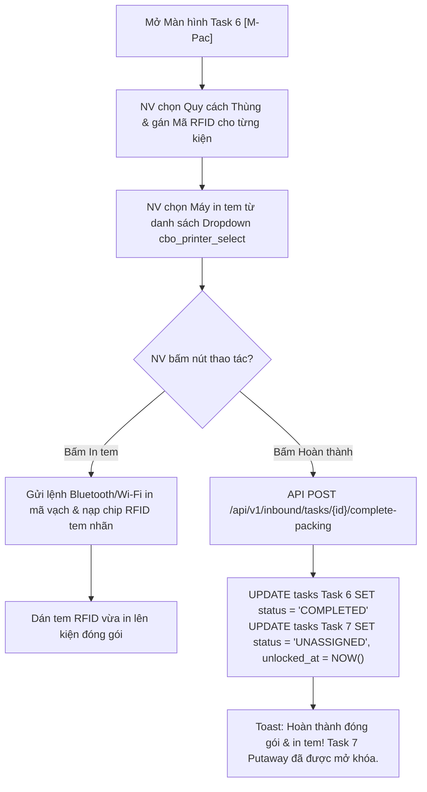

| Bước | Tác nhân | Hành động | Kết quả / Phản ứng hệ thống |
|---|---|---|---|
| 1 | NV kho | Chọn loại thùng & quét thẻ RFID | Chọn loại thùng đóng gói tương ứng và sử dụng PDA quét ghi mã chip RFID. |
| 2 | NV kho | Chọn máy in di động và bấm **[In tem]** | Chọn máy in tem trong kho $\rightarrow$ Bấm nút In tem $\rightarrow$ Hệ thống gửi lệnh in dữ liệu RFID tem nhãn trực tiếp tới máy in. |
| 3 | NV kho | Bấm nút **[Hoàn thành]** | Gửi API hoàn thành Task 6 đóng gói in tem. Chuyển trạng thái Task 6 sang `COMPLETED` và mở khóa Task 7 Putaway cất hàng (`[M-Mv3]`). |

---

### 3.1.10. [M-Mv3] Task 7: Putaway - Cất hàng vào lưu trữ trên Mobile

#### ① Thông tin chung

| Mục | Nội dung |
|---|---|
| **Tên chức năng** | Task 7: Putaway - Cất hàng vào lưu trữ trên Mobile `[M-Mv3]` |
| **Mô tả** | Cho phép Nhân viên kho thực hiện công việc di chuyển các kiện hàng đã đóng gói dán tem RFID từ Khu đóng gói đến cất vào ô kệ lưu trữ chính thức (Bin Location), đối soát mã vị trí Bin và hoàn tất quy trình nhập kho. |
| **Đường dẫn** | Danh sách task $\rightarrow$ Task 7 Putaway $\rightarrow$ Màn hình Putaway `[M-Mv3]`. |
| **Phân quyền & Miền dữ liệu** | • **Thực hiện:** NV kho (`ROLE_WAREHOUSE_WORKER`). • **Miền dữ liệu:** Task Putaway tại kho phụ trách. |

#### ② Màn hình

- **Link file ảnh UIUX:** [N9_Putaway.png](file:///c:/Users/Admin/Desktop/ai-agent-wms/UIUX/Mobile/Nhap_Kho/N9_Putaway.png)

- **Mô tả chi tiết giao diện:**
  - **Header đỏ:** Nút Back, Tiêu đề `Putaway - Cất hàng`, Sub-title `16 HU · Khu G`, Nút `Gia hạn KPI`.
  - **Danh sách CÁC HU CẤT HÀNG (Putaway HU Cards):**
    - `HU-2026-9921-01`: Tên SP `Galaxy A15 128GB`, Loại thùng (`Carton 50`), Mã RFID (`RFID-0001-A1`), *Vị trí lưu trữ*: Dropdown chọn `G04-B02-T03` + Icon Scan mã ô kệ đỏ nét đứt bên phải.
    - `HU-2026-9921-02`: Tên SP `Galaxy A25 256GB`, Loại thùng (`Carton 50`), Mã RFID (`RFID-0002-A1`), *Vị trí lưu trữ*: Dropdown `G04-B02-T04` + Icon Scan.
    - `HU-2026-9921-03`: Tên SP `Tai nghe Buds Pro`, Loại thùng (`Carton 25`), Mã RFID (`RFID-0003-B2`), *Vị trí lưu trữ*: Dropdown `G04-B03-T01` + Icon Scan.
    - `HU-2026-9921-04`: Tên SP `Cáp sạc USB-C 1m`, Loại thùng (`Carton 100`), Mã RFID (`RFID-0004-C3`), *Vị trí lưu trữ*: Dropdown `G05-A01-T01` + Icon Scan.
  - **Bottom Action Button:** Button solid màu đỏ rộng `Hoàn thành` (Icon Check V).

#### ③ Bảng 6 cột thành phần UI

| STT | Tên | Kiểu dữ liệu [Độ dài] | Input/Output | Giá trị khởi tạo | Mô tả (Mapping với CSDL nếu có) |
|---|---|---|---|---|---|
| 1 | `btn_back` | Icon Button | Input/Trigger | Enabled | Click quay lại danh sách Task. |
| 2 | `lbl_putaway_header` | Text / String | Output | Header Info | Hiển thị tổng số HU và Khu vực lưu trữ cất hàng (`16 HU · Khu G`). |
| 3 | `btn_extend_kpi` | Pill Button | Input/Trigger | Active | Label: `Gia hạn KPI`. |
| 4 | `lst_putaway_hus` | Vertical ListView / Object Array | Output | Putaway List | Danh sách các đơn vị đóng gói HU cần cất vào ô kệ lưu trữ (`putaway_assignments`). |
| 5 | `col_hu_code` | Red Bold Text / String [50] | Output | HU Code | Mã định danh đơn vị đóng gói HU (`HU-2026-9921-01`...). |
| 6 | `col_product_name` | Text / String [255] | Output | Product Name | Tên diễn giải sản phẩm trong HU. |
| 7 | `col_carton_type` | Readonly Input Box / String | Output | Carton Type | Quy cách đóng gói thùng. |
| 8 | `col_rfid_code` | Readonly Input Box / String | Output | RFID Code | Mã tem nhãn RFID đã gán cho kiện. |
| 9 | `cbo_bin_location` | Dropdown Select / String | Input | System Suggested | Mã vị trí ô kệ lưu trữ đề xuất hoặc chọn thay thế (`G04-B02-T03`...). |
| 10 | `btn_scan_bin_qr` | Square Red Icon Button | Input/Trigger | Active | Icon mở scanner quét mã vạch/QR dán trên ô kệ vật lý để xác nhận chính xác vị trí cất. |
| 11 | `btn_complete_putaway` | Solid Red Button | Input/Trigger | Active | Label: `Hoàn thành`. Xác nhận đã cất toàn bộ kiện vào vị trí ô kệ, hoàn tất Task 7 và toàn bộ Lệnh nhập kho. |

#### ④ Luồng xử lý nghiệp vụ

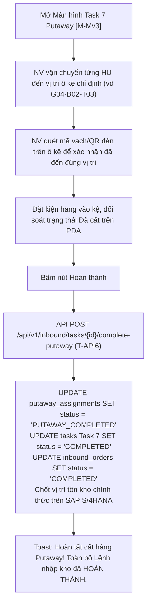

| Bước | Tác nhân | Hành động | Kết quả / Phản ứng hệ thống |
|---|---|---|---|
| 1 | NV kho | Vận chuyển hàng đến ô kệ vật lý | Di chuyển kiện HU tới dãy kệ chỉ định dựa trên vị trí hệ thống gợi ý (`G04-B02-T03`). |
| 2 | NV kho | Quét mã vạch/QR dán trên ô kệ | Sử dụng PDA quét mã ô kệ để đảm bảo cất đúng vị trí. Nếu chọn ô kệ khác, hệ thống tự động cập nhật lại mã Bin mới. |
| 3 | NV kho | Bấm nút **[Hoàn thành]** | Gửi API `T-API6` báo cáo hoàn thành cất hàng về SAP. Đóng Lệnh nhập kho (`status = 'COMPLETED'`), chính thức ghi nhận tồn kho tại các ô kệ Bin khả dụng. |

---

## PHẦN 4. THIẾT KẾ DÙNG CHUNG VÀ TÁI SỬ DỤNG

Bảng đặc tả các Component di động dùng chung (Mobile Common Components):

| STT | Tên component | Mô tả hành vi | Danh sách chức năng sử dụng |
|---|---|---|---|
| 1 | **Header Task Red Bar** | Thanh tiêu đề đỏ di động chứa Nút Back, Tiêu đề màn hình, Sub-title thông tin đơn và Nút Gia hạn KPI. | Tất cả màn hình di động `[M-DS]` đến `[M-Mv3]` |
| 2 | **Barcode/RFID Scanner Bar** | Thanh ô quét mã tích hợp camera chụp ảnh Barcode/QR và tiếp nhận signal dữ liệu từ đầu đọc RFID di động. | `[M-Chk]`, `[M-Mv1]`, `[M-Pac]`, `[M-Mv3]` |
| 3 | **Touch Canvas Signature** | Vùng cảm ứng điện dung di động cho phép vẽ và capture chữ ký tay dạng ảnh Base64. | `[M-Sig1]` |
| 4 | **PDF Mobile Viewer** | Trình xem trước file PDF Biên bản bàn giao / Phiếu nhập kho trực tiếp trên màn hình ứng dụng di động. | `[M-Sig1]`, `[M-VOff]` |
| 5 | **Status Pill Tag / Badge** | Tag bo tròn hiển thị màu trạng thái Lệnh nhập / Task / Hàng Đạt (Xanh lá) & Không đạt (Hồng/Đỏ). | `[M-DS]`, `[M-Acc]`, `[M-AGR]`, `[M-VOff]` |
| 6 | **KPI Extension Modal** | Popup cho phép NV kho gửi yêu cầu gia hạn thời gian hoàn thành KPI/SLA task. | `[M-Unl]`, `[M-Chk]`, `[M-Mv1]`, `[M-VOff]`, `[M-Pac]`, `[M-Mv3]` |

---

## PHẦN 5. TUÂN THỦ TIÊU CHUẨN QUẢN TRỊ DỮ LIỆU

### 5.1. CDE (Common Data Elements)
Dữ liệu di động tuân thủ bảng CDE theo chuẩn Tập đoàn:
- Mã Lệnh nhập kho (`inbound_orders.order_code`).
- Mã SKU sản phẩm (`inbound_order_items.sku_code`).
- Mã Chip RFID EPC (`handling_units.rfid_epc`).
- Mã vị trí lưu trữ Bin (`bin_locations.bin_code`).

### 5.2. Bảo mật dữ liệu di động (Mobile Data Security)
- **SSL/TLS Encryption:** Toàn bộ giao tiếp API giữa Mobile App và Server được mã hóa qua kênh HTTPS (TLS 1.3).
- **Session & JWT Token:** Mã token xác thực lưu trong bộ nhớ an toàn di động (Secure Storage / Keychain). Đăng xuất tự động sau 15 phút không thao tác.
- **Offline Data Encryption:** Khi tác nghiệp vùng mất sóng (Offline), dữ liệu tạm lưu trên `IndexedDB` / `SQLite Local` được mã hóa AES-256 bit.

### 5.3. Chất lượng dữ liệu & Siêu dữ liệu
- Bắt buộc kiểm tra định dạng và độ dài của Mã RFID, Mã Barcode/QR trước khi lưu DB.
- Tự động trim khoảng trắng 2 đầu đối với tất cả dữ liệu chuỗi nhập liệu.

### 5.4. Lưu trữ & Vận hành
- Thời gian lưu cache ảnh xem trước PDF BBBG / Phiếu nhập kho trên máy di động: tối đa 7 ngày (sau đó tự động dọn dẹp bộ nhớ tạm).

---

## PHẦN 6. PHỤ LỤC

### 6.1. Tài liệu quy trình nghiệp vụ
- Quy trình nghiệp vụ Nhập kho NCC (MM.10A): [AIWS_SAP_MM.10A_quy_trinh_nhap_kho_mua_hang_NCC.md](file:///c:/Users/Admin/Desktop/ai-agent-wms/knowledge/processes/AIWS_SAP_MM.10A_quy_trinh_nhap_kho_mua_hang_NCC.md)

### 6.2. Tài liệu thiết kế CSDL
`[Cần BM.03: Chưa có - sẽ bổ sung khi hoàn thành TKCSSDL]`

### 6.3. Phân quyền vai trò trên Mobile App

| Role Code | Tên Role | Quyền hạn tác nghiệp trên Mobile App |
|---|---|---|
| `ROLE_WAREHOUSE_DIRECTOR` | Giám đốc kho | Xem danh sách lệnh nhập, xem thống kê lũy kế, duyệt trình ký VOffice. |
| `ROLE_WAREHOUSE_MASTER` | Thủ kho | Duyệt tiếp nhận Gate 1, xem báo cáo KCS thực nhập, ký BBBG điện tử, trình ký VOffice. |
| `ROLE_WAREHOUSE_WORKER` | NV kho | Thực hiện Task 1 (Dỡ hàng), Task 2 (Kiểm hàng), Task 3 (Khu chờ nhập), Task 6 (Đóng gói in tem), Task 7 (Putaway cất hàng). |
| `ROLE_PARTNER` | Đối tác / Tài xế | Xóa xem trước và ký xác nhận Biên bản bàn giao tại bãi Staging. |

### 6.4. Bản đồ API trên Mobile

| STT | Mã API | Đường dẫn API | Mục đích tích hợp di động |
|---|---|---|---|
| 1 | `M-API-01` | `GET /api/v1/mobile/inbound/orders` | Lấy danh sách lệnh nhập kho & chỉ số lũy kế tháng/năm. |
| 2 | `M-API-02` | `POST /api/v1/inbound/orders/{id}/accept` | Tiếp nhận Lệnh nhập kho (Gate 1). |
| 3 | `M-API-03` | `POST /api/v1/inbound/orders/{id}/reject` | Từ chối tiếp nhận Lệnh nhập kho (Gate 1 Sync SAP `T-API2`). |
| 4 | `M-API-04` | `POST /api/v1/inbound/tasks/{id}/complete-unload` | Hoàn thành Task 1 Dỡ hàng khỏi xe. |
| 5 | `M-API-05` | `POST /api/v1/inbound/orders/{id}/bbbg-sign` | Lưu chữ ký tay & phát hành BBBG điện tử (`T-API4`). |
| 6 | `M-API-06` | `POST /api/v1/inbound/tasks/{id}/complete-move-staging` | Hoàn thành Task 3 đưa hàng vào khu chờ nhập. |
| 7 | `M-API-07` | `POST /api/v1/inbound/tasks/{id}/complete-stock-posting` | Xác nhận Thực nhập kho Task 4 (`T-API6`). |
| 8 | `M-API-08` | `POST /api/v1/inbound/voffice/submit` | Gửi hồ sơ trình ký VOffice Phiếu nhập kho (`V-API1`). |
| 9 | `M-API-09` | `POST /api/v1/inbound/tasks/{id}/complete-packing` | Hoàn thành Task 6 đóng gói & phát lệnh in tem chip RFID. |
| 10 | `M-API-10` | `POST /api/v1/inbound/tasks/{id}/complete-putaway` | Hoàn thành Task 7 Putaway cất hàng vào ô kệ Bin. |

### 6.5. Danh sách chức năng di động Mobile App

| STT | Mã Task Mobile | Tên chức năng di động | Đối tượng sử dụng |
|---|---|---|---|
| **I. Quản lý Lệnh & Tiếp nhận Mobile** | | | |
| 1 | `[M-DS]` | Danh sách lệnh nhập kho tổng quan | Thủ kho, GD kho, NV kho |
| 2 | `[M-Acc]` | Tiếp nhận / Duyệt lệnh nhập kho (Gate 1) | Thủ kho, GD kho |
| **II. Tác nghiệp Thực địa Kho Mobile** | | | |
| 3 | `[M-Unl]` | Task 1: Dỡ hàng khỏi xe trên Mobile | NV kho |
| 4 | `[M-Chk]` | Task 2: Kiểm hàng theo PO (Quét Serial/RFID) | NV kho, Thủ kho |
| 5 | `[M-Sig1]` | Task 2 (tiếp): Ký Biên bản bàn giao điện tử | Thủ kho, NV kho, Tài xế NCC |
| 6 | `[M-Mv1]` | Task 3: Đưa vào khu chờ nhập bãi Staging | NV kho |
| 7 | `[M-AGR]` | Task 4: Xem kết quả KCS & Xác nhận Thực nhập | Thủ kho |
| **III. Đóng gói & Lưu trữ Kho Mobile** | | | |
| 8 | `[M-Pac]` | Task 6: Đóng gói & In tem RFID | NV kho |
| 9 | `[M-Mv3]` | Task 7: Putaway - Cất hàng vào vị trí Bin | NV kho |
| **IV. Trình ký Văn phòng Điện tử Mobile** | | | |
| 10 | `[M-VOff]` | Trình ký VOffice Phiếu nhập kho trên Mobile | Thủ kho, GD kho |

---
*Hết tài liệu thiết kế chi tiết Mobile App Task Nhập kho NCC.*
