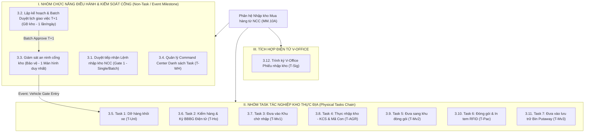
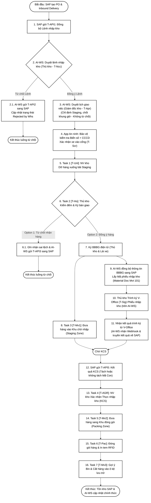
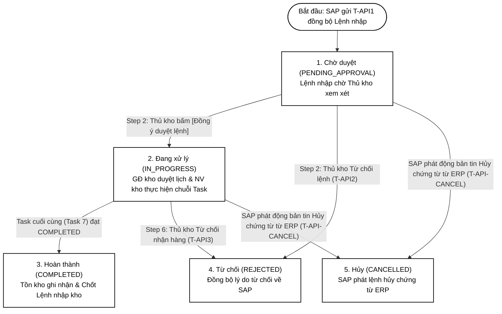
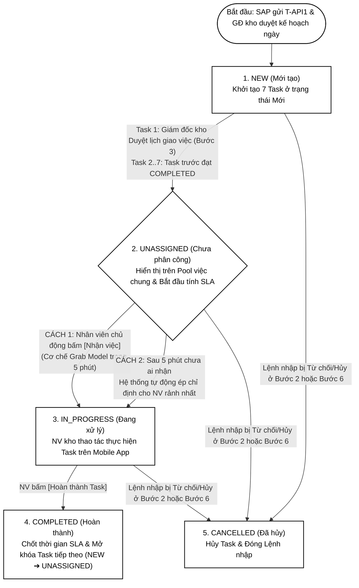
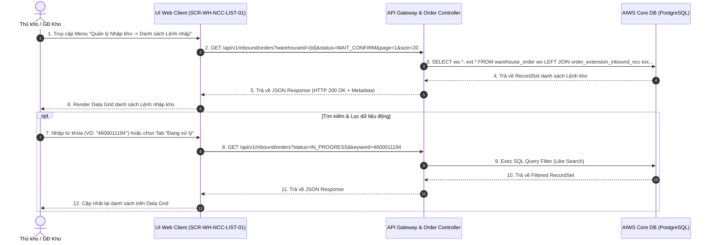
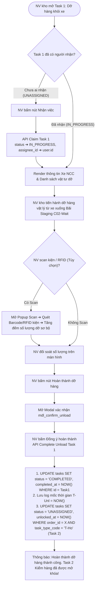
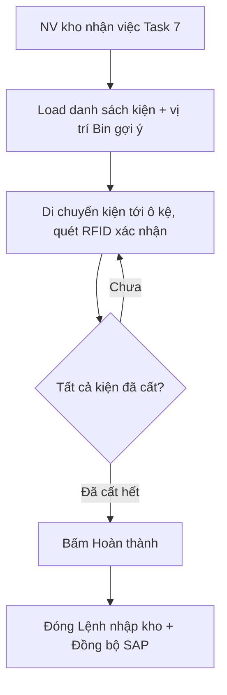

```mermaid
flowchart TD
    START([NV kho mở Task 2: Kiểm hàng & Ký BBBG]) --> CHECK_CLAIM{"Task 2 đã có người nhận?"}
    
    CHECK_CLAIM -- Chưa ai nhận (UNASSIGNED) --> CLICK_CLAIM[NV bấm nút Nhận việc]
    CLICK_CLAIM --> DO_CLAIM["API Claim Task 2<br>status ➔ IN_PROGRESS, assignee_id ➔ user.id"]
    DO_CLAIM --> RENDER_INSPECT

    CHECK_CLAIM -- Đã nhận (IN_PROGRESS) --> RENDER_INSPECT[Render Danh sách vật tư & E-Form BBBG]

    RENDER_INSPECT --> PHYSICAL_INSPECT[NV kiểm hàng đếm số lượng thực tế tại Bãi Staging C02-Wait]
    PHYSICAL_INSPECT --> UPDATE_QTY[NV điều chỉnh số lượng thực nhận txt_actual_qty trên màn hình]

    UPDATE_QTY --> DECISION_GATE{"Phát hiện sai lệch móp hỏng / không nhận?"}
    
    %% Nhanh Tu choi nhận hàng (Gate 2 -> T-API3)
    DECISION_GATE -- Có sai lệch nghiêm trọng (Từ chối) --> CLICK_REJECT[NV bấm nút Từ chối nhận hàng]
    CLICK_REJECT --> OPEN_REJECT_MDL[Mở Modal mdl_reject_delivery]
    OPEN_REJECT_MDL --> SUBMIT_REJECT["NV chọn loại lỗi + Nhập lý do + Đính kèm ảnh ➔ Bấm Gửi báo cáo SAP"]
    SUBMIT_REJECT --> API_T3["1. Gửi T-API3 sang SAP (Truyền chi tiết sai lệch Gate 2)<br>2. UPDATE inbound_orders SET status = 'REJECTED'<br>3. UPDATE tasks SET status = 'COMPLETED', outcome = 'REJECTED' WHERE id = Task2<br>4. UPDATE tasks SET status = 'CANCELLED' WHERE order_id = X AND task_id > Task2"]
    API_T3 --> END_REJECT([Kết thúc luồng từ chối nhận hàng])

    %% Nhanh Đống ý hàng -> Ky BBBG -> T-API4
    DECISION_GATE -- Đồng ý nhận hàng --> DUAL_SIGN[Tiến hành Ký điện tử BBBG 2 bên]
    
    DUAL_SIGN --> SIGN_WH[Thủ kho / NV kho bấm Ký số CA/Token bên Kho]
    DUAL_SIGN --> SIGN_SUPPLIER[Lái xe / Đại diện NCC vẽ chữ ký cảm ứng Touch Canvas]
    
    SIGN_WH --> CHECK_DUAL{"Đã ký đủ CẢ 2 BÊN?"}
    SIGN_SUPPLIER --> CHECK_DUAL

    CHECK_DUAL -- Chưa đủ 2 chữ ký --> WAIT_SIGN[Nút Hoàn thành BBBG tiếp tục Disabled]
    CHECK_DUAL -- Đã đủ 2 chữ ký --> ENABLE_BTN[Hệ thống tự động Enable nút Hoàn thành kiểm hàng & BBBG]

    ENABLE_BTN --> CLICK_COMPLETE_BBBG[NV bấm Hoàn thành kiểm hàng & BBBG]
    CLICK_COMPLETE_BBBG --> OPEN_CONFIRM_BBBG[Mở Modal xác nhận mdl_confirm_bbbg]
    
    OPEN_CONFIRM_BBBG --> SUBMIT_COMPLETE["Bấm Xác nhận & Đồng bộ SAP<br>API Complete Inspect Task 2"]

    SUBMIT_COMPLETE --> PARALLEL_EXEC(["KÍCH HOẠT 2 NHÁNH CHẠY SONG SONG"])

    %% Nhanh 1: Van hanh kho -> Mo kho dynamic Task 3
    PARALLEL_EXEC --> BRANCH_WHS["NHÁNH 1 (VẬN HÀNH KHO):<br>1. UPDATE tasks SET status = 'COMPLETED' WHERE id = Task2<br>2. UPDATE tasks SET status = 'UNASSIGNED', unlocked_at = NOW()<br>WHERE order_id = X AND task_type_code = 'T-Mv1' (Task 3)"]

    %% Nhanh 2: Tich hop SAP -> Gui T-API4 lay Material Doc Mvt 101
    PARALLEL_EXEC --> BRANCH_SAP["NHÁNH 2 (TÍCH HỢP INTERFACE):<br>1. Phát động bản tin T-API4 gửi BBBG điện tử sang SAP<br>2. SAP hạch toán Material Doc Mvt 101 & trả Mã phiếu nhập về AI-WS<br>3. AI-WS sẵn sàng dữ liệu cho Bước 10 Trình ký V-Office (V-API1)"]

    BRANCH_WHS --> FINISH_OK([Hoàn tất Task 2! Task 3 Đưa vào khu chờ nhập được mở khóa])
    BRANCH_SAP --> FINISH_OK
```

# TÀI LIỆU THIẾT KẾ CHI TIẾT (TKCT) — BM.04
## Phân hệ Nhập Kho Mua Hàng Từ NCC — Quy trình MM.10A

---

## MỤC LỤC

- [THÔNG TIN TÀI LIỆU](#thông-tin-tài-liệu)
  - [Lịch sử sửa đổi](#lịch-sử-sửa-đổi)
- [PHẦN 1. GIỚI THIỆU](#phần-1-giới-thiệu)
  - [1.1. Mục đích](#11-mục-đích)
  - [1.2. Phạm vi](#12-phạm-vi)
  - [1.3. Thuật ngữ](#13-thuật-ngữ)
  - [1.4. Tài liệu tham khảo](#14-tài-liệu-tham-khảo)
  - [1.5. Mô tả tài liệu](#15-mô-tả-tài-liệu)
- [PHẦN 2. TỔNG QUAN GIẢI PHÁP](#phần-2-tổng-quan-giải-pháp)
  - [2.1. Sơ đồ phân cấp chức năng](#21-sơ-đồ-phân-cấp-chức-năng)
  - [2.2. Quy trình nghiệp vụ End-to-End trên Hệ thống Kho Thông Minh](#22-quy-trình-nghiệp-vụ-end-to-end-trên-hệ-thống-kho-thông-minh)
    - [2.2.1. Sơ đồ luồng End-to-End tổng thể](#221-sơ-đồ-luồng-end-to-end-tổng-thể)
    - [2.2.2. Bảng mô tả chi tiết luồng tác nghiệp End-to-End](#222-bảng-mô-tả-chi-tiết-luồng-tác-nghiệp-end-to-end)
    - [2.2.3. Định nghĩa Vòng đời Trạng thái Lệnh Nhập kho (Inbound Order Lifecycle)](#223-định-nghĩa-vòng-đời-trạng-thái-lệnh-nhập-kho-inbound-order-lifecycle)
    - [2.2.4. Sơ đồ & Bảng ma trận luồng dịch chuyển trạng thái Task (Task State Machine & Transition Table)](#224-sơ-đồ--bảng-ma-trận-luồng-dịch-chuyển-trạng-thái-task-task-state-machine--transition-table)
    - [2.2.5. Quy tắc dịch chuyển trạng thái & Mở khóa liên hoàn (Task Chain Mechanism)](#225-quy-tắc-dịch-chuyển-trạng-thái--mở-khóa-liên-hoàn-task-chain-mechanism)
  - [2.3. Mô hình giao tiếp & Tích hợp với hệ thống ngoài (SAP S/4HANA × V-Office)](#23-mô-hình-giao-tiếp--tích-hợp-với-hệ-thống-ngoài-sap-s4hana--v-office)
- [PHẦN 3. THIẾT KẾ CHI TIẾT](#phần-3-thiết-kế-chi-tiết)
  - [3.1. Nhóm chức năng Duyệt lệnh](#31-nhóm-chức-năng-duyệt-lệnh)
    - [3.1.1. Chức năng xem danh sách lệnh](#311-chức-năng-xem-danh-sách-lệnh)
    - [3.1.2. Chức năng Xem chi tiết thông tin lệnh nhập](#312-chức-năng-xem-chi-tiết-thông-tin-lệnh-nhập)
    - [3.1.3. Đồng ý duyệt](#313-đồng-ý-duyệt)
    - [3.1.4. Từ chối duyệt](#314-từ-chối-duyệt)
  - [3.2. Nhóm chức năng: Lập kế hoạch & Batch Duyệt lịch giao việc T+1](#32-nhóm-chức-năng-lập-kế-hoạch--batch-duyệt-lịch-giao-việc-t1)
    - [3.2.1. Bảng Dashboard Quy hoạch lịch nhập kho ngày T+1](#321-bảng-dashboard-quy-hoạch-lịch-nhập-kho-ngày-t1)
    - [3.2.2. Chức năng Batch Duyệt lịch giao việc & Phân ca trực 1 lần/ngày](#322-chức-năng-batch-duyệt-lịch-giao-việc--phân-ca-trực-1-lầnngày)
  - [3.3. Nhóm chức năng: Giám sát an ninh cổng kho (Direct Gate Control)](#33-nhóm-chức-năng-giám-sát-an-ninh-cổng-kho-direct-gate-control)
    - [3.3.1. Tra cứu danh sách xe chờ vào cổng trên 1 Màn hình duy nhất](#331-tra-cứu-danh-sách-xe-chờ-vào-cổng-trên-1-màn-hình-duy-nhất)
    - [3.3.2. Đăng ký thông tin an ninh tài xế & xe vận chuyển](#332-đăng-ký-thông-tin-an-ninh-tài-xế--xe-vận-chuyển)
    - [3.3.3. Chức năng Xác nhận xe vào cổng & Trigger mở khóa Task 1](#333-chức-năng-xác-nhận-xe-vào-cổng--trigger-mở-khóa-task-1)
  - [3.4. Nhóm chức năng: Quản lý Danh sách Task Nhập kho (`[T-WH]`)](#34-nhóm-chức-năng-quản-lý-danh-sách-task-nhập-kho-t-wh)
    - [3.4.1. Tra cứu & Xem danh sách Task (Command Center Data Grid)](#341-tra-cứu--xem-danh-sách-task-command-center-data-grid)
    - [3.4.2. Chức năng Nhận việc ([T-Claim])](#342-chức-năng-nhận-việc-t-claim)
    - [3.4.3. Chức năng Phân công Task ([T-Assign])](#343-chức-năng-phân-công-task-t-assign)
    - [3.4.4. Chức năng Gia hạn SLA/KPI ([T-Extend])](#344-chức-năng-gia-hạn-slakpi-t-extend)
    - [3.4.5. Chức năng Xuất báo cáo Excel ([T-Export])](#345-chức-năng-xuất-báo-cáo-excel-t-export)
  - [3.5. Nhóm chức năng: Task 1 - Dỡ hàng khỏi xe (`[T-Unl]`)](#35-nhóm-chức-năng-task-1---dỡ-hàng-khỏi-xe-t-unl)
    - [3.5.1. Chức năng Nhận Task dỡ hàng & Kiểm tra Dock hạ hàng](#351-chức-năng-nhận-task-dỡ-hàng--kiểm-tra-dock-hạ-hàng)
    - [3.5.2. Chức năng Quét mã kiện & Gắn thẻ RFID xe/kiện](#352-chức-năng-quét-mã-kiện--gắn-thẻ-rfid-xekiện)
    - [3.5.3. Chức năng Ghi nhận số lượng dỡ sơ bộ & Hoàn thành Task 1](#353-chức-năng-ghi-nhận-số-lượng-dỡ-sơ-bộ--hoàn-thành-task-1)
  - [3.6. Nhóm chức năng: Task 2 - Kiểm hàng & Ký BBBG Điện tử (`[T-Ho]`)](#36-nhóm-chức-năng-task-2---kiểm-hàng--ký-bbbg-điện-tử-t-ho)
    - [3.6.1. Chức năng Kiểm đếm thực tế đối soát PO & Nhập số lượng thực đếm](#361-chức-năng-kiểm-đếm-thực-tế-đối-soát-po--nhập-số-lượng-thực-đếm)
    - [3.6.2. Chức năng Từ chối nhận hàng móp hỏng (Gate 2 Rejection)](#362-chức-năng-từ-chối-nhận-hàng-móp-hỏng-gate-2-rejection)
    - [3.6.3. Chức năng Ký số điện tử BBBG 2 bên](#363-chức-năng-ký-số-điện-tử-bbbg-2-bên)
    - [3.6.4. Chức năng Hoàn thành kiểm hàng & Ký BBBG](#364-chức-năng-hoàn-thành-kiểm-hàng--ký-bbbg)
  - [3.7. Nhóm chức năng: Task 3 - Đưa hàng vào Khu chờ nhập (`[T-Mv1]`)](#37-nhóm-chức-năng-task-3---đưa-hàng-vào-khu-chờ-nhập-t-mv1)
    - [3.7.1. Chức năng Nhận Task di chuyển lô hàng vào Khu chờ nhập](#371-chức-năng-nhận-task-di-chuyển-lô-hàng-vào-khu-chờ-nhập)
    - [3.7.2. Chức năng Quét mã vị trí bãi chờ nhập & Hoàn thành Task 3](#372-chức-năng-quét-mã-vị-trí-bãi-chờ-nhập--hoàn-thành-task-3)
  - [3.8. Nhóm chức năng: Task 4 - Thực nhập kho (Xác nhận KCS & Mã Con) (`[T-AGR]`)](#38-nhóm-chức-năng-task-4---thực-nhập-kho-xác-nhận-kcs--mã-con-t-agr)
    - [3.8.1. Chức năng Đối soát kết quả KCS từ SAP & Xem cấu trúc phân rã Mã Con](#381-chức-năng-đối-soát-kết-quả-kcs-từ-sap--xem-cấu-trúc-phân-rã-mã-con)
    - [3.8.2. Chức năng Chốt trạng thái Tồn kho chính thức & Hoàn thành Task 4](#382-chức-năng-chốt-trạng-thái-tồn-kho-chính-thức--hoàn-thành-task-4)
  - [3.9. Nhóm chức năng: Task 5 - Đưa sang khu đóng gói (`[T-Mv2]`)](#39-nhóm-chức-năng-task-5---đưa-sang-khu-đóng-gói-t-mv2)
    - [3.9.1. Chức năng Nhận Task di chuyển vật tư sang Khu đóng gói](#391-chức-năng-nhận-task-di-chuyển-vật-tư-sang-khu-đóng-gói)
    - [3.9.2. Chức năng Quét barcode vị trí bàn đóng gói & Hoàn thành Task 5](#392-chức-năng-quét-barcode-vị-trí-bàn-đóng-gói--hoàn-thành-task-5)
  - [3.10. Nhóm chức năng: Task 6 - Đóng gói & In tem RFID (`[T-Pac]`)](#310-nhóm-chức-năng-task-6---đóng-gói--in-tem-rfid-t-pac)
    - [3.10.1. Chức năng Đóng gói vật tư vào Thùng carton/Pallet](#3101-chức-năng-đóng-gói-vật-tư-vào-thùng-cartonpallet)
    - [3.10.2. Chức năng In tem nhãn thùng & Ghi thẻ RFID chip](#3102-chức-năng-in-tem-nhãn-thùng--ghi-thẻ-rfid-chip)
    - [3.10.3. Chức năng Hoàn thành đóng gói & Mở khóa Task 7](#3103-chức-năng-hoàn-thành-đóng-gói--mở-khóa-task-7)
  - [3.11. Nhóm chức năng: Task 7 - Đưa vào lưu trữ (Bin Putaway) (`[T-Mv3]`)](#311-nhóm-chức-năng-task-7---đưa-vào-lưu-trữ-bin-putaway-t-mv3)
    - [3.11.1. Chức năng Gợi ý vị trí Bin lưu trữ tối ưu](#3111-chức-năng-gợi-ý-vị-trí-bin-lưu-trữ-tối-ưu)
    - [3.11.2. Chức năng Di chuyển kiện hàng & Quét mã vạch vị trí Bin Putaway](#3112-chức-năng-di-chuyển-kiện-hàng--quét-mã-vạch-vị-trí-bin-putaway)
    - [3.11.3. Chức năng Hoàn thành cất hàng & Chốt tồn kho SAP](#3113-chức-năng-hoàn-thành-cất-hàng--chốt-tồn-kho-sap)
  - [3.12. Nhóm chức năng: Trình ký V-Office Phiếu nhập kho (`[T-Sig]`)](#312-nhóm-chức-năng-trình-ký-v-office-phiếu-nhập-kho-t-sig)
    - [3.12.1. Chức năng Khởi tạo hồ sơ V-Office & Chọn luồng trình ký mẫu](#3121-chức-năng-khởi-tạo-hồ-sơ-v-office--chọn-luồng-trình-ký-mẫu)
    - [3.12.2. Chức năng Theo dõi tiến độ phê duyệt chữ ký số CA phòng ban](#3122-chức-năng-theo-dõi-tiến-độ-phê-duyệt-chữ-ký-số-ca-phòng-ban)
    - [3.12.3. Chức năng Trình ký thành công/từ chối & Đồng bộ về SAP](#3123-chức-năng-trình-ký-thành-côngtừ-chối--đồng-bộ-về-sap)
- [PHẦN 4. THIẾT KẾ DÙNG CHUNG VÀ TÁI SỬ DỤNG](#phần-4-thiết-kế-dùng-chung-và-tái-sử-dụng)
- [PHẦN 5. TUÂN THỦ TIÊU CHUẨN QUẢN TRỊ DỮ LIỆU](#phần-5-tuân-thủ-tiêu-chuẩn-quản-trị-dữ-liệu)
- [PHẦN 6. PHỤ LỤC](#phần-6-phụ-lục)
  - [6.1. Tài liệu quy trình nghiệp vụ](#61-tài-liệu-quy-trình-nghiệp-vụ)
  - [6.2. Tài liệu thiết kế CSDL](#62-tài-liệu-thiết-kế-csdl)
  - [6.3. Phân quyền](#63-phân-quyền)
  - [6.4. Bản đồ API](#64-bản-đồ-api)
  - [6.5. Danh sách chức năng](#65-danh-sách-chức-năng)

---

## THÔNG TIN TÀI LIỆU

| Thông tin | Chi tiết |
|---|---|
| **Tên tài liệu** | Thiết kế chi tiết (TKCT) — Phân hệ Nhập Kho Mua Hàng Từ NCC (MM.10A) |
| **Mã tài liệu** | `BM04-AIWS-MM10A-01` |
| **Hệ thống** | AI-WS (WMS Platform) × SAP S/4HANA (ERP) × V-Office (E-Office) |
| **Phiên bản** | `v2.0` |
| **Trạng thái** | Draft |
| **Người lập** | BA Team / AIWS Product Owner |
| **Ngày khởi tạo** | 06/08/2026 |

### Lịch sử sửa đổi

| Version | Ngày | Tác giả | Mô tả thay đổi |
|---|---|---|---|
| v1.0 ~ v1.2 | 06/08/2026 | BA Team | Khởi tạo SRS, chuẩn hóa Control Matrix, kiến trúc Trigger & Module. |
| **v2.0** | 06/08/2026 | BA Team | Viết lại hoàn toàn theo chuẩn BM.04 TKCT: Mỗi chức năng gồm 4 mục (① Thông tin chung, ② Màn hình, ③ Bảng 6 cột thành phần, ④ Luồng nghiệp vụ). |

---

## PHẦN 1. GIỚI THIỆU

### 1.1. Mục đích

Tài liệu đặc tả thiết kế chi tiết các chức năng thuộc phân hệ **Nhập kho mua hàng từ Nhà cung cấp (MM.10A)** trên hệ thống AI-WS. Là đầu vào cho giai đoạn lập trình và kiểm thử.

Tài liệu cung cấp:
- Tổng quan nghiệp vụ nhập kho từ NCC
- Thành phần chi tiết từng màn hình UI (mapping CSDL)
- Luồng dữ liệu và xử lý sự kiện
- Trao đổi với hệ thống ngoài (SAP, V-Office)

| Đối tượng sử dụng | Mục đích |
|---|---|
| Nhóm phát triển (Frontend + Backend) | Lập trình theo đặc tả thành phần, sự kiện, mapping DB |
| Nhóm kiểm thử | Xây dựng test case từ luồng nghiệp vụ và validate rules |
| Nhóm quản lý dự án | Theo dõi phạm vi, ước lượng effort |

### 1.2. Phạm vi

Thiết kế chi tiết toàn bộ 7 Task vận hành kho + 1 màn hình Danh sách Task tổng quan thuộc quy trình MM.10A (Nhập kho mua hàng từ NCC) trên hệ thống AI-WS.

### 1.3. Thuật ngữ

| Thuật ngữ | Định nghĩa | Ghi chú |
|---|---|---|
| PO | Purchase Order — Đơn mua hàng trên SAP | |
| Inbound Delivery | Chứng từ yêu cầu giao hàng (VL31N) trên SAP | |
| Lệnh nhập kho | Lệnh nhập kho trên AI-WS (`INB-2026-xxxxx`) | Sinh từ T-API1 |
| Task | Công việc điện tử — đơn vị nhỏ nhất giao cho 1 nhân viên | |
| BBBG | Biên bản bàn giao hàng hóa (ký số/ký cảm ứng) | |
| KCS | Kiểm tra chất lượng sản phẩm — SAP chủ trì | |
| Bin Code | Mã vị trí ô kệ trong kho (VD: `G01_KN1.1.1`) | |
| Auto-Match | Cơ chế tự động ghép nhân viên rảnh rỗi với Task khả dụng đúng Role | Mô hình Grab |
| SLA | Service Level Agreement — Hạn thời gian hoàn thành Task | |

### 1.4. Tài liệu tham khảo

| Tên tài liệu | Link | Người gửi | Ngày gửi |
|---|---|---|---|
| Quy trình Nhập kho NCC (MM.10A) | [AIWS_SAP_MM.10A](file:///c:/Users/Admin/Desktop/ai-agent-wms/knowledge/processes/AIWS_SAP_MM.10A_quy_trinh_nhap_kho_mua_hang_NCC.md) | BA Team | 06/08/2026 |
| Tổng quan Dự án AI-WS | [AIWS_Project_Overview](file:///c:/Users/Admin/Desktop/ai-agent-wms/knowledge/AIWS_Project_Overview_And_Architecture.md) | BA Team | 06/08/2026 |
| UI/UX Task Nhập | [UIUX TaskNhap](file:///c:/Users/Admin/Desktop/ai-agent-wms/UIUX/TaskNhap/) | Design Team | 06/08/2026 |

### 1.5. Mô tả tài liệu

| Phần | Nội dung |
|---|---|
| Phần 1 | Giới thiệu: mục đích, phạm vi, thuật ngữ, tài liệu tham khảo |
| Phần 2 | Tổng quan giải pháp: sơ đồ phân cấp chức năng, quy trình nghiệp vụ End-to-End, mô hình giao tiếp hệ thống |
| Phần 3 | Thiết kế chi tiết từng chức năng (4 mục: Thông tin chung, Màn hình, Thành phần, Luồng NV) |
| Phần 4 | Thiết kế dùng chung & tái sử dụng |
| Phần 5 | Tuân thủ tiêu chuẩn quản trị dữ liệu |
| Phần 6 | Phụ lục |

---

## PHẦN 2. TỔNG QUAN GIẢI PHÁP

### 2.1. Sơ đồ phân cấp chức năng



### 2.2. Quy trình nghiệp vụ End-to-End trên Hệ thống Kho Thông Minh

Quy trình nhập kho mua hàng từ Nhà cung cấp (MM.10A) được vận hành liên hoàn giữa **SAP S/4HANA (ERP)**, **AI-WS (Hệ thống Kho Thông Minh)** và **V-Office (Hệ thống Trình ký điện tử)**. 

Dưới đây là sơ đồ luồng dữ liệu và tác nghiệp End-to-End xuyên suốt từ khi SAP phát động Lệnh nhập kho đến khi vật tư được xếp chính thức vào ô kệ (Bin Putaway) lưu trữ.

#### 2.2.1. Sơ đồ luồng End-to-End tổng thể



#### 2.2.2. Bảng mô tả chi tiết luồng tác nghiệp End-to-End

| STT | Chức năng | Tác nhân | Trạng thái Lệnh nhập | Tích hợp API & Tham chiếu Chi tiết | Mô tả luồng tác nghiệp |
|---|---|---|---|---|---|
| **1** | Đồng bộ lệnh nhập từ SAP | Hệ thống | `Chờ duyệt` | **`[T-API1]`** (SYNC-01) ➔ [Chi tiết T-API1](file:///c:/Users/Admin/Desktop/ai-agent-wms/ba/documents/srs/new/SRS_MM.10A_ChucNang_DongBo_ThongTin_NCC_v1.0.md#311-t-api1-đồng-bộ-lệnh-nhập-kho-từ-sap-về-ai-ws-inbound-delivery-sync) | SAP tạo Inbound Delivery (VL31N) từ PO, tự động phát động bản tin **`T-API1`** truyền thông tin Lệnh nhập kho, danh mục vật tư, số lượng dự kiến sang AI-WS. AI-WS khởi tạo Lệnh nhập kho `INB-2026-xxxxx`. |
| **2** | **Duyệt lệnh nhập kho** `[T-Ncc]` | Thủ kho | `Đang xử lý` (hoặc `Từ chối`) | **`[T-API2]`** (SYNC-02) ➔ [Chi tiết T-API2](file:///c:/Users/Admin/Desktop/ai-agent-wms/ba/documents/srs/new/SRS_MM.10A_ChucNang_DongBo_ThongTin_NCC_v1.0.md#312-t-api2-đồng-bộ-từ-chối-duyệt-tiếp-nhận-lệnh-nhập-kho-sang-sap-rejection-gate-1-sync) | Thủ kho xem danh sách Lệnh nhập kho chờ tiếp nhận, kiểm tra tính hợp lệ của lệnh. <br>• **Đồng ý lệnh:** Trạng thái Lệnh nhập chuyển `Đang xử lý`, chuyển sang Bước 3. <br>• **Từ chối lệnh (Luồng 2.1):** Trạng thái Lệnh nhập chuyển `Từ chối`, AI-WS phát động **`T-API2`** gửi lý do từ chối sang SAP (`Rejected by Whs`). |
| **3** | **Duyệt lịch giao việc** `[T-Apr]` | Giám đốc kho | `Đang xử lý` | N/A (Nội bộ AI-WS) | Giám đốc kho chỉ định vùng tiếp nhận (*Staging Area*), duyệt khung giờ xe cập bến và phân công ca trực. Bấm **Duyệt kế hoạch** ➔ Chuyển Task 1 từ `NEW` sang `UNASSIGNED`. (Không từ chối). |
| **4** | **Xác minh an ninh cổng kho** `[T-Scr]` | Bảo vệ | `Đang xử lý` | N/A (Nội bộ AI-WS) | Xe NCC đến cổng kho. Bảo vệ tra cứu Lệnh nhập kho và đăng ký thông tin tài xế (Tên, SĐT, Biển số xe, CCCD) trên Mobile App AI-WS. Bấm **Xác nhận xe vào cổng** để lưu thời gian `T-Scr`. |
| **5** | **Task 1: Dỡ hàng khỏi xe** `[T-Unl]` | Nhân viên kho | `Đang xử lý` | N/A (Nội bộ AI-WS) | NV kho nhận Task 1 trên Mobile App, tiến hành dỡ hàng từ xe NCC xuống bãi Staging. Bấm **Hoàn thành dỡ hàng** để lưu thời điểm `T-Unl` và tự động kích hoạt chuyển Task 2 từ `NEW` ➔ `UNASSIGNED`. |
| **6** | **Task 2: Kiểm hàng & Ký bàn giao** `[T-Ho]` | Thủ kho / NV kho | `Đang xử lý` (hoặc `Từ chối`) | **`[T-API3]`** (SYNC-04) ➔ [Chi tiết T-API3](file:///c:/Users/Admin/Desktop/ai-agent-wms/ba/documents/srs/new/SRS_MM.10A_ChucNang_DongBo_ThongTin_NCC_v1.0.md#321-t-api3-đồng-bộ-báo-cáo-sai-lệch--từ-chối-nhận-hàng-sang-sap-rejection-gate-2-sync) | Kiểm đếm **số lượng vật tư thực tế** dỡ xuống bãi Staging cùng Lái xe (đại diện NCC). Có 2 Option xử lý: <br>• **Option 1 — Từ chối nhận hàng (Luồng 6.1):** Do móp hỏng, sai quy cách hoặc sai lệch nghiêm trọng. Trạng thái Lệnh nhập chuyển `Từ chối`, ghi nhận lý do sai lệch và gửi bản tin **`T-API3`** về SAP ➔ Kết thúc Lệnh nhập. <br>• **Option 2 — Đồng ý hàng:** Chuyển sang Bước 7 (Ký BBBG điện tử). |
| **7** | **Ký BBBG điện tử** `[T-Ho]` | Thủ kho & Lái xe | `Đang xử lý` | N/A (Nội bộ AI-WS) | Thủ kho và Lái xe (đại diện NCC) ký **Biên bản bàn giao (BBBG) điện tử** trực tiếp trên màn hình App AI-WS. Ngay sau khi ký BBBG xong, hệ thống kích hoạt **2 nhánh công việc chạy song song** (Bước 8 và Bước 9). |
| **8** | **Task 3: Đưa vào Khu chờ nhập** `[T-Mv1]` *(Nhánh 1 — Vận hành)* | Nhân viên kho | `Đang xử lý` | N/A (Nội bộ AI-WS) | *(Chạy song song với Bước 9-11)* NV kho di chuyển lô hàng từ bãi hạ hàng vào **Khu vực chờ nhập kho** (*Inbound Staging Zone*). Quét mã vị trí bãi Staging chỉ định và bấm xác nhận hoàn thành Task 3. |
| **9** | **Đồng bộ BBBG & Lấy Mã phiếu nhập** *(Nhánh 2 — Tích hợp)* | Hệ thống | `Đang xử lý` | **`[T-API4]`** (SYNC-05) ➔ [Chi tiết T-API4](file:///c:/Users/Admin/Desktop/ai-agent-wms/ba/documents/srs/new/SRS_MM.10A_ChucNang_DongBo_ThongTin_NCC_v1.0.md#322-t-api4-đồng-bộ-bbbg-điện-tử--khởi-tạo-phiếu-nhập-kho-mvt-101-trên-sap-gr-document-creation-sync) | *(Chạy song song với Bước 8)* AI-WS đồng bộ dữ liệu BBBG đã ký sang SAP (**`T-API4`**). SAP tự động phát hành **Phiếu nhập kho (Material Document - Mvt 101)**, hạch toán kế toán `Nợ 152/156, Có 3388` và trả Mã phiếu nhập về AI-WS. |
| **10** | **Trình ký V-Office Phiếu nhập kho** `[T-Sig]` | Thủ kho | `Đang xử lý` | **`[V-API1]`** (SYNC-06) ➔ [Chi tiết V-API1](file:///c:/Users/Admin/Desktop/ai-agent-wms/ba/documents/srs/new/SRS_MM.10A_ChucNang_DongBo_ThongTin_NCC_v1.0.md#331-v-api1-khởi-tạo-hồ-sơ-trình-ký-phiếu-nhập-kho-từ-ai-ws-sang-v-office-send-document-to-v-office) | Sau khi AI-WS nhận Mã phiếu nhập kho từ SAP, Thủ kho thực hiện **Trình ký V-Office Phiếu nhập kho trực tiếp trên giao diện Web AI-WS**. Dữ liệu chứng từ và danh sách người duyệt được đẩy tự động sang V-Office (**`V-API1`**). |
| **11** | **Nhận & Trả kết quả trình ký V-Office** | Hệ thống | `Đang xử lý` | **`[V-API2]`** (SYNC-07) & **`[V-API3]`** (SYNC-08) ➔ [Chi tiết V-API2](file:///c:/Users/Admin/Desktop/ai-agent-wms/ba/documents/srs/new/SRS_MM.10A_ChucNang_DongBo_ThongTin_NCC_v1.0.md#332-v-api2-nhận-callback-kết-quả-phê-duyệt-từ-v-office-về-ai-ws-v-office-approval-callback) \| [Chi tiết V-API3](file:///c:/Users/Admin/Desktop/ai-agent-wms/ba/documents/srs/new/SRS_MM.10A_ChucNang_DongBo_ThongTin_NCC_v1.0.md#333-v-api3-đồng-bộ-kết-quả-phê-duyệt-v-office-từ-ai-ws-về-sap-s4hana-sync-v-office-status-to-sap) | Webhook V-Office gửi callback kết quả phê duyệt về AI-WS (**`V-API2`**). AI-WS cập nhật trạng thái Lệnh nhập kho và đồng thời chuyển tiếp kết quả trình ký về SAP (**`V-API3`**) để chốt trạng thái chứng từ ERP. |
| **12** | **KCS & Nhận danh mục vật tư** | Hệ thống | `Đang xử lý` | **`[T-API5]`** (SYNC-09) ➔ [Chi tiết T-API5](file:///c:/Users/Admin/Desktop/ai-agent-wms/ba/documents/srs/new/SRS_MM.10A_ChucNang_DongBo_ThongTin_NCC_v1.0.md#341-t-api5-đồng-bộ-kết-quả-kcs--mã-hàng-hóa-con-bóc-tách-từ-sap-về-ai-ws-kcs--sub-sku-decomposition-sync) | Sau khi hoàn tất trình ký V-Office và KCS trên SAP, SAP phát động bản tin **`T-API5`** truyền kết quả KCS kèm chi tiết danh mục hàng hóa (có thể phân rã thành các Mã hàng con hoặc giữ nguyên Mã hàng gốc). Dù tách hay không tách mã con, hệ thống AI-WS đều chuyển Task 4 từ `NEW` ➔ `UNASSIGNED`. |
| **13** | **Task 4: Thực nhập kho (KCS)** `[T-AGR]` | Thủ kho | `Đang xử lý` | N/A (Nội bộ AI-WS) | NV kho mở Task 4 trên Mobile App, đối soát thông tin KCS và danh sách mã hàng nhận từ SAP (`T-API5`), bấm **Xác nhận thực nhập kho**. Chuyển Task 5 từ `NEW` ➔ `UNASSIGNED`. |
| **14** | **Task 5: Đưa sang khu đóng gói** `[T-Mv2]` | Nhân viên kho | `Đang xử lý` | N/A (Nội bộ AI-WS) | NV kho di chuyển vật tư từ Khu chờ nhập sang **Khu vực đóng gói** (*Packing Zone*). Quét mã vị trí bãi đóng gói chỉ định để hoàn thành Task 5 và chuyển Task 6 từ `NEW` ➔ `UNASSIGNED`. |
| **15** | **Task 6: Đóng gói & In tem RFID** `[T-Pac]` | Nhân viên kho | `Đang xử lý` | N/A (Nội bộ AI-WS) | NV kho phân loại vật tư theo SKU con (nếu có bóc tách) hoặc theo SKU/thùng nguyên bản (nếu không bóc tách), gán mã/in tem RFID và dán nhãn cho từng kiện hàng/đơn vị vật tư, bấm **Hoàn thành đóng gói**. Chuyển Task 7 từ `NEW` ➔ `UNASSIGNED`. |
| **16** | **Task 7: Đưa vào lưu trữ (Putaway)** `[T-Mv3]` | Nhân viên kho | `Đang xử lý` | N/A (Nội bộ AI-WS) | Hệ thống AI-WS chạy thuật toán gợi ý vị trí ô kệ tối ưu (*Bin Code*). NV kho di chuyển hàng tới đúng ô kệ, quét xác nhận mã Bin trên Mobile App để hoàn thành Task 7. |
| **17** | **Cập nhật tồn kho & Hoàn tất quy trình** | Hệ thống | `Hoàn thành` | **`[T-API6]`** (SYNC-10) ➔ [Chi tiết T-API6](file:///c:/Users/Admin/Desktop/ai-agent-wms/ba/documents/srs/new/SRS_MM.10A_ChucNang_DongBo_ThongTin_NCC_v1.0.md#342-t-api6-đồng-bộ-hoàn-thành-cất-hàng-lưu-trữ--chốt-tồn-kho-chính-thức-uublocked-sang-sap-final-putaway--stock-posting-sync) | AI-WS ghi nhận tồn kho tại ô kệ chính xác. Đồng thời phát động bản tin **`T-API6`** cập nhật tồn kho sang SAP: chuyển trạng thái tồn kho thành **Khả dụng (`UU - Unrestricted Use`)** nếu KCS đạt, hoặc **Khóa KCS (`Blocked Stock`)** nếu không đạt. Trạng thái Lệnh nhập kho chuyển thành `Hoàn thành`. |

#### 2.2.3. Định nghĩa Vòng đời Trạng thái Lệnh Nhập kho (Inbound Order Lifecycle)

Trạng thái ở cấp độ **Lệnh nhập kho (Inbound Order Status)** được quản lý độc lập với trạng thái chi tiết của các Task tác nghiệp, đảm bảo tính nhất quán trên toàn hệ thống WMS cho tất cả các quy trình nhập kho (Nhập NCC MM.10A, Nhập chuyển kho nội bộ, Nhập trả lại...):

##### A. Danh mục 5 Trạng thái Lệnh nhập kho chuẩn hóa:
1. **`Chờ duyệt` (`PENDING_APPROVAL`):** Khởi tạo ngay khi nhận bản tin đồng bộ đơn từ SAP (`T-API1`). Lệnh nằm trên danh sách chờ Thủ kho kiểm tra và phê duyệt.
2. **`Đang xử lý` (`IN_PROGRESS`):** Kích hoạt ngay khi Thủ kho bấm **Đồng ý duyệt lệnh** (Bước 2). Trạng thái này giữ xuyên suốt trong quá trình Giám đốc kho duyệt lịch, Bảo vệ xác minh cổng, và Nhân viên kho thực hiện chuỗi Task vận hành (từ Task 1 đến Task 7).
3. **`Hoàn thành` (`COMPLETED`):** Tự động kích hoạt khi Task cuối cùng trong chuỗi Task của Lệnh nhập kho đạt trạng thái `COMPLETED` và hệ thống chốt ghi nhận tồn kho tại ô kệ (Bin Putaway).
4. **`Từ chối` (`REJECTED`):** Kích hoạt khi Thủ kho chọn **Từ chối tiếp nhận lệnh** ở Bước 2 (`T-API2`) HOẶC chọn **Từ chối nhận hàng** ở Bước 6 (`T-API3`). Cả 2 trường hợp đều ghi nhận lý do từ chối cụ thể và phát động bản tin đồng bộ trạng thái `REJECTED` kèm lý do về SAP.
5. **`Hủy` (`CANCELLED`):** Kích hoạt duy nhất khi Lệnh nhập kho bị hủy từ phía SAP (thông qua bản tin Webhook/API `T-API-CANCEL` hủy đơn từ ERP).

##### B. Sơ đồ chuyển đổi trạng thái Lệnh nhập kho (Order State Diagram):



##### C. Bảng Ma trận chuyển đổi trạng thái Lệnh nhập kho:

| STT | Trạng thái nguồn | Sự kiện / Trigger | Trạng thái đích | Tác nhân | Hành động tích hợp & Xử lý hệ thống |
|---|---|---|---|---|---|
| **1** | `[*] (Khởi tạo)` | SAP gửi bản tin đồng bộ `T-API1` | `Chờ duyệt` | Hệ thống (AI-WS & SAP) | Khởi tạo Lệnh nhập kho `INB-2026-xxxxx` ở trạng thái `Chờ duyệt` và 7 Task ở trạng thái `NEW`. [Chi tiết T-API1](file:///c:/Users/Admin/Desktop/ai-agent-wms/ba/documents/srs/new/SRS_MM.10A_ChucNang_DongBo_ThongTin_NCC_v1.0.md#311-t-api1-đồng-bộ-lệnh-nhập-kho-từ-sap-về-ai-ws-inbound-delivery-sync). |
| **2** | `Chờ duyệt` | Thủ kho bấm **[Đồng ý duyệt lệnh]** ở Bước 2 | `Đang xử lý` | Thủ kho | Đổi trạng thái Lệnh nhập kho sang `Đang xử lý`. Mở đường cho Giám đốc kho duyệt lịch ở Bước 3. |
| **3a** | `Chờ duyệt` | Thủ kho bấm **[Từ chối lệnh]** ở Bước 2 | `Từ chối` | Thủ kho | Phát động bản tin **`T-API2`** sang SAP kèm lý do từ chối (`Rejected by Whs`). Hủy tất cả Task `NEW`. [Chi tiết T-API2](file:///c:/Users/Admin/Desktop/ai-agent-wms/ba/documents/srs/new/SRS_MM.10A_ChucNang_DongBo_ThongTin_NCC_v1.0.md#312-t-api2-đồng-bộ-từ-chối-duyệt-tiếp-nhận-lệnh-nhập-kho-sang-sap-rejection-gate-1-sync). |
| **3b** | `Đang xử lý` | Thủ kho chọn **[Option 1 — Từ chối nhận hàng]** ở Bước 6 | `Từ chối` | Thủ kho | Ghi nhận số lượng sai lệch/lỗi, phát động bản tin **`T-API3`** gửi về SAP để xử lý khiếu nại NCC. Đổi trạng thái Lệnh nhập kho sang `Từ chối` kèm lý do. [Chi tiết T-API3](file:///c:/Users/Admin/Desktop/ai-agent-wms/ba/documents/srs/new/SRS_MM.10A_ChucNang_DongBo_ThongTin_NCC_v1.0.md#321-t-api3-đồng-bộ-báo-cáo-sai-lệch--từ-chối-nhận-hàng-sang-sap-rejection-gate-2-sync). |
| **4** | `Chờ duyệt` / `Đang xử lý` | SAP phát động bản tin Webhook/API **Hủy chứng từ** (`T-API-CANCEL`) | `Hủy` | Hệ thống (SAP ERP) | Cập nhật Lệnh nhập kho thành `Hủy`, chuyển tất cả Task chưa hoàn thành thành `CANCELLED`. [Chi tiết T-API-CANCEL](file:///c:/Users/Admin/Desktop/ai-agent-wms/ba/documents/srs/new/SRS_MM.10A_ChucNang_DongBo_ThongTin_NCC_v1.0.md#313-t-api-cancel-đồng-bộ-hủy-lệnh-nhập-kho-từ-sap-về-ai-ws-sap-cancellation-sync). |
| **5** | `Đang xử lý` | Task cuối cùng (Task 7 Putaway) chuyển sang `COMPLETED` | `Hoàn thành` | Hệ thống (AI-WS) | Đổi trạng thái Lệnh nhập kho thành `Hoàn thành`. Cập nhật tồn kho khả dụng (`UU`) và phát động bản tin **`T-API6`** đồng bộ chốt đơn về SAP. [Chi tiết T-API6](file:///c:/Users/Admin/Desktop/ai-agent-wms/ba/documents/srs/new/SRS_MM.10A_ChucNang_DongBo_ThongTin_NCC_v1.0.md#342-t-api6-đồng-bộ-hoàn-thành-cất-hàng-lưu-trữ--chốt-tồn-kho-chính-thức-uublocked-sang-sap-final-putaway--stock-posting-sync). |

##### D. Tính tương thích với nhiều Quy trình Nhập kho (Config-driven Task Chain):
- Mọi quy trình nhập kho trong hệ thống AI-WS (Nhập NCC MM.10A, Nhập chuyển kho nội bộ, Nhập trả lại) đều **sử dụng chung 100% Bộ 5 Trạng thái Lệnh nhập kho** trên.
- Các quy trình khác nhau chỉ khác biệt ở số lượng và nội dung các Task được cấu hình trong chuỗi (Task Chain Config). Lệnh nhập kho tự động chuyển sang `Hoàn thành` khi toàn bộ Task thuộc chuỗi được cấu hình cho lệnh đó đạt `COMPLETED`.

#### 2.2.4. Sơ đồ & Bảng ma trận luồng dịch chuyển trạng thái Task (Task State Machine & Transition Table)

##### A. Sơ đồ luồng chuyển đổi trạng thái Task (Task State Machine Diagram):



##### B. Bảng mô tả chi tiết luồng dịch chuyển trạng thái Task (Task State Transition Table):

| STT | Trạng thái nguồn | Sự kiện / Trigger | Trạng thái đích | Tác nhân | Mô tả chi tiết xử lý hệ thống |
|---|---|---|---|---|---|
| **1** | `[*] (Khởi tạo)` | SAP gửi bản tin `T-API1` & Giám đốc kho duyệt kế hoạch ca | `NEW` | Hệ thống (Task Engine) | Tự động tạo 7 Task điện tử ứng với Lệnh nhập kho `INB-2026-xxxxx` ở trạng thái Mới (`NEW`) để đảm bảo tuần tự nghiệp vụ. |
| **2a** | `NEW` | **Giám đốc kho Duyệt lịch giao việc** (Bước 3) | `UNASSIGNED` | Giám đốc kho | *(Áp dụng riêng cho Task 1)* Ngay khi GĐ kho duyệt lịch ➔ Hệ thống chuyển Task 1 sang `UNASSIGNED`, đếm ngược SLA và đẩy lên Pool việc chung để NV kho vào nhận việc. |
| **2b** | `NEW` | Task liền kề trước đó chuyển sang `COMPLETED` | `UNASSIGNED` | Hệ thống (Task Engine) | *(Áp dụng cho Task 2 đến Task 7)* Task trước hoàn tất ➔ Tự động chuyển Task sau từ `NEW` sang `UNASSIGNED`. *(Lưu ý: Task 4 cần thêm điều kiện SAP gửi kết quả KCS `T-API5`)*. |
| **3a** | `UNASSIGNED` | NV kho bấm **[Nhận việc]** trên Mobile App (trong 0-5 phút) | `IN_PROGRESS` | Nhân viên kho | *(Cơ chế Grab Model)* Nhân viên chủ động nhận việc từ Pool công việc chung. Hệ thống gán NV đó làm người phụ trách trực tiếp. |
| **3b** | `UNASSIGNED` | Hết 5 phút đếm ngược mà chưa có NV nào bấm nhận việc | `IN_PROGRESS` | Hệ thống (Auto-Assign Service) | *(Cơ chế Force Assign)* Hệ thống chạy thuật toán tự động ép chỉ định cho NV kho đang rảnh nhất ca trực, phát thông báo high-priority (không thể từ chối). |
| **4** | `IN_PROGRESS` | NV kho quét mã vị trí/kiện hàng và bấm **[Hoàn thành Task]** | `COMPLETED` | Nhân viên kho | NV hoàn tất thao tác vật lý trên Mobile App. Hệ thống lưu log thời gian thực hiện, chốt SLA/KPI và kích hoạt chuyển Task tiếp theo sang `UNASSIGNED`. |
| **5** | `NEW` / `UNASSIGNED` / `IN_PROGRESS` | Thủ kho từ chối lệnh (`T-API2`) hoặc Từ chối nhận hàng (`T-API3`) | `CANCELLED` | Thủ kho / Hệ thống | Khi phát động bản tin hủy sang SAP, hệ thống lập tức hủy tất cả các Task chưa hoàn thành thuộc Lệnh nhập kho đó và kết thúc luồng. |

---

### 2.3. Mô hình giao tiếp & Tích hợp với hệ thống ngoài (SAP S/4HANA × V-Office)

Quy trình nhập kho MM.10A kết nối trực tiếp với 2 hệ thống vệ tinh: **SAP S/4HANA (ERP)** và **V-Office (Trình ký điện tử)**. Chi tiết thông số kỹ thuật, cấu trúc Payload, và quy tắc xử lý ngoại lệ của tất cả các giao diện tích hợp được tham chiếu chi tiết tại tài liệu chuyên biệt: 📄 [SRS_MM.10A_ChucNang_DongBo_ThongTin_NCC_v1.0.md](file:///c:/Users/Admin/Desktop/ai-agent-wms/ba/documents/srs/new/SRS_MM.10A_ChucNang_DongBo_ThongTin_NCC_v1.0.md).

#### Bảng tổng hợp 10 Điểm tích hợp API đồng bộ thông tin:

| STT | Mã API | Tên chức năng tích hợp đồng bộ | Hướng giao tiếp | Thời điểm phát động trong quy trình | Link Tham chiếu Chi tiết sang tài liệu SRS Đồng bộ |
|---|---|---|---|---|---|
| 1 | `T-API1` | Đồng bộ Lệnh nhập kho từ SAP về AI-WS | SAP ➔ AI-WS | **Bước 1**: SAP tạo chứng từ Inbound Delivery (VL31N) | [Tham chiếu Chi tiết T-API1](file:///c:/Users/Admin/Desktop/ai-agent-wms/ba/documents/srs/new/SRS_MM.10A_ChucNang_DongBo_ThongTin_NCC_v1.0.md#311-t-api1-đồng-bộ-lệnh-nhập-kho-từ-sap-về-ai-ws-inbound-delivery-sync) |
| 2 | `T-API2` | Báo từ chối tiếp nhận Lệnh nhập kho sang SAP | AI-WS ➔ SAP | **Bước 2 (Luồng 2.1)**: Thủ kho bấm [Từ chối lệnh] | [Tham chiếu Chi tiết T-API2](file:///c:/Users/Admin/Desktop/ai-agent-wms/ba/documents/srs/new/SRS_MM.10A_ChucNang_DongBo_ThongTin_NCC_v1.0.md#312-t-api2-đồng-bộ-từ-chối-duyệt-tiếp-nhận-lệnh-nhập-kho-sang-sap-rejection-gate-1-sync) |
| 3 | `T-API-CANCEL` | Đồng bộ Hủy Lệnh nhập kho từ SAP về AI-WS | SAP ➔ AI-WS | **Mọi thời điểm**: SAP phát động bản tin hủy chứng từ ERP | [Tham chiếu Chi tiết T-API-CANCEL](file:///c:/Users/Admin/Desktop/ai-agent-wms/ba/documents/srs/new/SRS_MM.10A_ChucNang_DongBo_ThongTin_NCC_v1.0.md#313-t-api-cancel-đồng-bộ-hủy-lệnh-nhập-kho-từ-sap-về-ai-ws-sap-cancellation-sync) |
| 4 | `T-API3` | Báo cáo sai lệch kiểm đếm thực nhận / Từ chối nhận hàng | AI-WS ➔ SAP | **Bước 6 (Luồng 6.1)**: NV kiểm hàng bấm [Từ chối nhận hàng] | [Tham chiếu Chi tiết T-API3](file:///c:/Users/Admin/Desktop/ai-agent-wms/ba/documents/srs/new/SRS_MM.10A_ChucNang_DongBo_ThongTin_NCC_v1.0.md#321-t-api3-đồng-bộ-báo-cáo-sai-lệch--từ-chối-nhận-hàng-sang-sap-rejection-gate-2-sync) |
| 5 | `T-API4` | Đồng bộ BBBG Điện tử & Khởi tạo Phiếu nhập Mvt 101 | AI-WS ➔ SAP | **Bước 9**: Sau khi ký BBBG & Hoàn thành Task 3 | [Tham chiếu Chi tiết T-API4](file:///c:/Users/Admin/Desktop/ai-agent-wms/ba/documents/srs/new/SRS_MM.10A_ChucNang_DongBo_ThongTin_NCC_v1.0.md#322-t-api4-đồng-bộ-bbbg-điện-tử--khởi-tạo-phiếu-nhập-kho-mvt-101-trên-sap-gr-document-creation-sync) |
| 6 | `V-API1` | Khởi tạo hồ sơ Trình ký Phiếu nhập kho từ AI-WS | AI-WS ➔ V-Office | **Bước 10**: Thủ kho bấm [Trình ký V-Office] trên AI-WS | [Tham chiếu Chi tiết V-API1](file:///c:/Users/Admin/Desktop/ai-agent-wms/ba/documents/srs/new/SRS_MM.10A_ChucNang_DongBo_ThongTin_NCC_v1.0.md#331-v-api1-khởi-tạo-hồ-sơ-trình-ký-phiếu-nhập-kho-từ-ai-ws-sang-v-office-send-document-to-v-office) |
| 7 | `V-API2` | Nhận Webhook Callback kết quả ký duyệt từ V-Office | V-Office ➔ AI-WS | **Bước 11a**: V-Office hoàn tất duyệt hoặc từ chối trình ký | [Tham chiếu Chi tiết V-API2](file:///c:/Users/Admin/Desktop/ai-agent-wms/ba/documents/srs/new/SRS_MM.10A_ChucNang_DongBo_ThongTin_NCC_v1.0.md#332-v-api2-nhận-callback-kết-quả-phê-duyệt-từ-v-office-về-ai-ws-v-office-approval-callback) |
| 8 | `V-API3` | Đồng bộ Kết quả trình ký V-Office từ AI-WS sang SAP | AI-WS ➔ SAP | **Bước 11b**: Tự động phát động ngay sau khi nhận V-API2 | [Tham chiếu Chi tiết V-API3](file:///c:/Users/Admin/Desktop/ai-agent-wms/ba/documents/srs/new/SRS_MM.10A_ChucNang_DongBo_ThongTin_NCC_v1.0.md#333-v-api3-đồng-bộ-kết-quả-phê-duyệt-v-office-từ-ai-ws-về-sap-s4hana-sync-v-office-status-to-sap) |
| 9 | `T-API5` | Đồng bộ Kết quả KCS & Mã hàng hóa Con bóc tách | SAP ➔ AI-WS | **Bước 12**: SAP hoàn tất KCS & bóc tách mã con | [Tham chiếu Chi tiết T-API5](file:///c:/Users/Admin/Desktop/ai-agent-wms/ba/documents/srs/new/SRS_MM.10A_ChucNang_DongBo_ThongTin_NCC_v1.0.md#341-t-api5-đồng-bộ-kết-quả-kcs--mã-hàng-hóa-con-bóc-tách-từ-sap-về-ai-ws-kcs--sub-sku-decomposition-sync) |
| 10 | `T-API6` | Báo hoàn thành Putaway & Chốt tồn kho UU/Blocked | AI-WS ➔ SAP | **Bước 17**: Hoàn thành Task 7 Cất hàng vào ô kệ Bin | [Tham chiếu Chi tiết T-API6](file:///c:/Users/Admin/Desktop/ai-agent-wms/ba/documents/srs/new/SRS_MM.10A_ChucNang_DongBo_ThongTin_NCC_v1.0.md#342-t-api6-đồng-bộ-hoàn-thành-cất-hàng-lưu-trữ--chốt-tồn-kho-chính-thức-uublocked-sang-sap-final-putaway--stock-posting-sync) |

---

## PHẦN 3. THIẾT KẾ CHI TIẾT

### 3.1. Nhóm chức năng Duyệt lệnh

#### 3.1.1. Chức năng xem danh sách lệnh

##### ① Thông tin chung

| Mục | Nội dung chi tiết |
|---|---|
| **Tên chức năng** | **Xem danh sách Lệnh nhập kho mua mới từ NCC** (`Inbound Order List View`) |
| **Mã màn hình** | `SCR-WH-NCC-LIST-01` |
| **Loại chức năng** | Data Grid / Inquiry / List View (Non-Task) |
| **Actor (Tác nhân)** | Thủ kho (`ROLE_WAREHOUSE_MASTER`), Giám đốc kho (`ROLE_WAREHOUSE_DIRECTOR`) |
| **Mô tả** | Màn hình trung tâm quản lý và tra cứu toàn bộ các Lệnh nhập kho mua mới từ Nhà cung cấp (`INB-2026-xxxxx`) được đồng bộ tự động từ SAP S/4HANA (`T-API1`). Hỗ trợ lọc theo các Tab trạng thái (`Chờ tiếp nhận`, `Đang xử lý`, `Hoàn thành`, `Từ chối`), tìm kiếm theo từ khóa đa trường (Mã Lệnh, Số PO, Số Delivery Note, Số Hợp đồng, Tên NCC), lọc theo khoảng thời gian và kho vật lý. Cho phép thực hiện tích chọn hàng loạt để duyệt tiếp nhận Gate 1. |
| **Đường dẫn** | Navigation: `Quản lý Nhập kho` $\rightarrow$ `Danh sách Lệnh nhập kho`. |
| **Trigger** | Người dùng chọn menu `Danh sách Lệnh nhập kho` hoặc sau khi hoàn tất đăng nhập vào hệ thống. |
| **Tiền điều kiện** | • Tài khoản người dùng được gán quyền Thủ kho hoặc Giám đốc kho.<br>• Các bản tin `T-API1` từ SAP đã được hệ thống tiếp nhận và khởi tạo Lệnh nhập kho. |
| **Hậu điều kiện** | Hiển thị danh sách Lệnh nhập kho thỏa mãn điều kiện lọc và tìm kiếm trên Data Grid. |
| **Phân quyền Matrix** | • **Xem danh sách:** Thủ kho (`ROLE_WAREHOUSE_MASTER`), Giám đốc kho (`ROLE_WAREHOUSE_DIRECTOR`). |

##### ② Luồng xử lý

- **Sơ đồ luồng giao tiếp (Sequence Diagram):**



- **Các bước chi tiết xử lý nghiệp vụ:**
  - **BƯỚC 1: Tải dữ liệu mặc định**
    - Hệ thống tự động lấy thông tin `warehouse_id` thuộc phân quyền của người dùng đang đăng nhập.
    - Gọi API `GET /api/v1/inbound/orders` với bộ lọc mặc định: `status = WAIT_CONFIRM` (Tab "Chờ tiếp nhận"), `page = 1`, `size = 20`, `sortBy = created_at`, `sortOrder = DESC`.
  - **BƯỚC 2: Thao tác tìm kiếm & lọc dữ liệu**
    - **Chuyển Tab Trạng thái (`cbo_status_tab`):** Click chuyển giữa các Tab `Chờ tiếp nhận` (`WAIT_CONFIRM`), `Đang xử lý` (`APPROVED` / `IN_PROGRESS`), `Hoàn thành` (`COMPLETED`), `Từ chối / Hủy` (`CANCELED`). Hệ thống tự động reset về trang 1 và tải lại danh sách tương ứng.
    - **Tìm kiếm theo từ khóa (`txt_keyword`):** Nhập chuỗi tìm kiếm (Mã Lệnh `INB-2026-xxx`, Số PO `46000xxx`, Số Hợp đồng, Tên NCC) và nhấn Enter hoặc icon Kính lúp. Hệ thống thực hiện tìm kiếm mờ (Like Search) trên các trường tương ứng.
    - **Lọc theo thời gian (`dtp_date_range`):** Chọn khoảng thời gian tạo lệnh (Từ ngày - Đến ngày).
  - **BƯỚC 3: Phân trang & Sắp xếp**
    - Thay đổi số bản ghi/trang (`10`, `20`, `50`, `100`).
    - Click vào tiêu đề các cột (`Mã Lệnh`, `Ngày tạo`, `Tổng trọng lượng`...) để sắp xếp tăng/giảm dần.
  - **Xử lý Backend & Query DB:**
    ```sql
    SELECT wo.order_id, wo.order_code, wo.order_status, wo.document_type, 
           wo.delivery_date, wo.total_weight_kg, wo.total_volume_m3, wo.created_at,
           ext.supplier_partner_id, ext.sap_contract_no
    FROM warehouse_order wo
    LEFT JOIN order_extension_inbound_ncc ext ON wo.order_id = ext.order_id
    WHERE wo.warehouse_id = :warehouse_id
      AND wo.order_status = :order_status
      AND (:keyword IS NULL OR wo.order_code ILIKE %:keyword% OR ext.sap_contract_no ILIKE %:keyword%)
    ORDER BY wo.created_at DESC
    LIMIT :limit OFFSET :offset;
    ```

##### ③ Màn hình & Bảng Ma Trận Control Chi Tiết (Unified Control & Field Matrix)

- **Link file thiết kế UI:** [Danh sách lệnh nhập.png](file:///c:/Users/quantm18/Desktop/New%20folder/Project_Management/UIUX/TaskNhap/Danh%20s%C3%A1ch%20l%E1%BB%87nh%20nh%E1%BA%ADp.png)
- **Mô tả Layout:** Giao diện gồm 4 tầng thành phần:
  1. **Header Bar & Top Actions:** Tiêu đề *"Danh sách Order Nhập kho"*, góc phải là nút `[Export Excel]`.
  2. **Card Thống kê KPI Summary (3 Cards):** Card 1 *Lũy kế tháng* (Số lệnh, Khối lượng Tấn, Thể tích m³), Card 2 *Lũy kế năm* (Số lệnh, Khối lượng Tấn, Thể tích m³), Card 3 *Kho vận hành & SLA* (Mã kho N800, SLA % đúng hạn).
  3. **Status Filter Tabs & Search Bar:** Thanh Tab trạng thái (`Tổng order 20`, `Chờ xác nhận 12`, `Đang xử lý 6`, `Hoàn tất 0`, `Từ chối xử lý 1`), Ô tìm kiếm `txt_keyword`.
  4. **Data Grid & Pagination:** Bảng dữ liệu Data Grid 11 cột hiển thị danh sách Order nhập kho và Cụm Nút Phân trang (Select Size trang & Nút chuyển trang).

###### Bảng Ma Trận Control & Cột Dữ Liệu Chi Tiết

| STT | Tên Control / Tên Cột | Mã Control / Cột | Kiểu Control & Kiểu Dữ Liệu | Input / Output | Mô tả |
|---|---|---|---|---|---|
| **1** | `Header Title Màn Hình` | `lbl_screen_title` | Page Title Text | Output | Tiêu đề màn hình: *"Danh sách Order Nhập kho"*. Text đen Bold 22px `#111111`. |
| **2** | `Nút Export Excel` | `btn_export_excel` | Outline Button / Trigger | Input/Trigger | Nút `[Export Excel]` góc trên bên phải. Viền Xanh Dương `#1890FF`, chữ Xanh `#1890FF`, icon Download. Click xuất file dữ liệu danh sách Lệnh kho ra định dạng Excel (CSV/Excel UTF-8). |
| **3** | `Card KPI Lũy Kế Tháng` | `card_kpi_month` | Metric Summary Card | Output | Card thống kê tổng hợp chỉ số lũy kế trong tháng (Khoảng thời gian: `created_at >= DATE_TRUNC('month', CURRENT_DATE)` AND `created_at <= NOW()` AND `order_status != 'Rejected'`):<br>• **Mapping CSDL:** Query Aggregation bảng `warehouse_order`.<br>• **Số lệnh:** `COUNT(DISTINCT order_id)`. Công thức: Đếm tổng số Lệnh nhập kho sinh ra từ 00:00:00 ngày 01 đầu tháng đến thời điểm hiện tại. Đơn vị: `Lệnh`. Text đen **Bold 16px** (VD: `19`).<br>• **Khối lượng:** `SUM(total_weight_kg) / 1000.0`. Công thức: Tổng trọng lượng (kg) của tất cả các Lệnh phát sinh từ ngày 01 đầu tháng chia 1,000 để đổi sang Tấn. Đơn vị: `Tấn`. Text đen **Bold 16px**, định dạng `#,##0.02 Tấn` (VD: `8483.37 Tấn`).<br>• **Thể tích:** `SUM(total_volume_m3)`. Công thức: Tổng thể tích mét khối ($m^3$) của tất cả các Lệnh phát sinh từ ngày 01 đầu tháng đến hiện tại. Đơn vị: `$m^3$`. Text đen **Bold 16px**, định dạng `#,##0.02 m³` (VD: `6228.45 m³`). |
| **4** | `Card KPI Lũy Kế Năm` | `card_kpi_year` | Metric Summary Card | Output | Card thống kê tổng hợp chỉ số lũy kế trong năm (Khoảng thời gian: `created_at >= DATE_TRUNC('year', CURRENT_DATE)` AND `created_at <= NOW()` AND `order_status != 'Rejected'`):<br>• **Mapping CSDL:** Query Aggregation bảng `warehouse_order`.<br>• **Số lệnh:** `COUNT(DISTINCT order_id)`. Công thức: Đếm tổng số Lệnh nhập kho sinh ra từ 00:00:00 ngày 01/01 đầu năm đến hiện tại. Đơn vị: `Lệnh`. Text đen **Bold 16px** (VD: `19`).<br>• **Khối lượng:** `SUM(total_weight_kg) / 1000.0`. Công thức: Tổng trọng lượng (kg) tất cả các Lệnh phát sinh từ 01/01 đầu năm chia 1,000 để đổi sang Tấn. Đơn vị: `Tấn`. Text đen **Bold 16px**, định dạng `#,##0.02 Tấn` (VD: `8483.37 Tấn`).<br>• **Thể tích:** `SUM(total_volume_m3)`. Công thức: Tổng thể tích mét khối ($m^3$) tất cả các Lệnh phát sinh từ 01/01 đầu năm đến hiện tại. Đơn vị: `$m^3$`. Text đen **Bold 16px**, định dạng `#,##0.02 m³` (VD: `6228.45 m³`). |
| **5** | `Card Kho Vận Hành & SLA` | `card_kpi_wh_sla` | Metric Summary Card | Output | Card hiển thị thông tin Kho & Chỉ số SLA:<br>• **Kho hàng:** Mapping `warehouse.warehouse_code`. Text Đen **Bold 20px** (VD: `N800`). Lấy unique Mã kho. trường hợp có nhiều plant thì hiển thị 1 plant ... và hiển thị tooltip<br>• **SLA đúng hạn:** Tỷ lệ % Lệnh nhập hoàn thành đúng hạn cam kết SLA trong tháng. Công thức: `(Số lệnh hoàn thành đúng hạn SLA / Tổng số lệnh hoàn thành) * 100%`. Đơn vị: Phần trăm (`%`). Text **Bold Xanh Lá `#00A854` 20px** (VD: `100 %`). |
| **6** | `Thanh Tabs Lọc Trạng Thái` | `tab_status_group` | Tab Buttons Group / String | Input | Nhóm Tab lọc trạng thái Lệnh nhập kho (`warehouse_order.order_status`) có đếm số lượng Badge đỏ:<br>• `Tổng order`: Badge đỏ tròn `20`. Tab Active có nền Đỏ `#FF4D4F`, chữ Trắng `#FFFFFF`.<br>• `Chờ xác nhận`: Badge đỏ `12`. Tab Inactive chữ đen `#333333`.<br>• `Đang xử lý`: Badge đỏ `6`. Text đen `#333333`.<br>• `Hoàn tất`: Badge đỏ `0`. Text đen `#333333`.<br>• `Từ chối xử lý`: Badge đỏ `1`. Text đen `#333333`. |
| **7** | `Ô Tìm Kiếm Đa Trường` | `txt_keyword` | Text Input / String [100] | Input | Searching `warehouse_order.order_code`, `project_code`, `project_name`. Ô nhập từ khóa tìm kiếm. Icon kính lúp phía trước. Placeholder: `"Tìm mã lệnh, dự án..."`. Khung viền xám `#D9D9D9`, focus đổi viền Xanh `#1890FF`. |
| **8** | `Nút Lọc Nâng Cao` | `btn_filter` | Outline Button / Trigger | Input/Trigger | Dynamic Filter Context. Nút `[Filter]` viền Xanh `#1890FF`, chữ Xanh `#1890FF`, icon Phễu. Click mở Popover/Form lọc nâng cao theo Plant, SLOC, Khoảng thời gian, Thủ kho. |
| **9** | `Bảng Danh Sách Data Grid` | `grid_inbound_order_pool` | Data Grid Table / Component | Output | Bảng dữ liệu hiển thị 11 cột danh sách các Order nhập kho. Mapping `warehouse_order` JOIN `order_extension_inbound_ncc`. Khung viền bảng xám nhạt `#E0E0E0`, hàng lẻ nền trắng `#FFFFFF`, hàng chẵn nền xám xơ `#FAFAFA`, hover dòng đổi màu xanh nhạt `#E6F7FF`. |
| **10** | `Mã Lệnh Nhập` | `col_order_code` | Hyperlink Text / String [50] | Output | Mã Lệnh kho AIWS. Mapping `warehouse_order.order_code`. Text chữ **Bold Xanh Dương `#1890FF`** (VD: `INB-2026-180`, `INB-2026-179`). Click vào mở Màn hình Xem chi tiết `SCR-WH-NCC-DETAIL-01`. |
| **11** | `Loại Lệnh Nhập` | `col_order_type_name` | String [100] | Output | Diễn giải tên loại lệnh nhập kho. Mapping `warehouse_order.document_type` / `order_type`. Text màu đen `#333333`, font Regular 13px (VD: `Nhập kho nhà CC`). |
| **12** | `Mã Lô Hàng` | `col_batch_no` | String [50] | Output | Số Lô hàng hóa được cấp sau KCS. Mapping `warehouse_order_item.batch_no`. Text xám `#888888` `—` nếu chưa có Lô, hoặc mã Lô `LOT-2026-xxx`. |
| **13** | `Ngày Giao Hàng` | `col_delivery_date` | Date / Date | Output | Ngày giao hàng dự kiến theo chứng từ SAP. Mapping `warehouse_order.delivery_date`. Text màu đen `#333333`, định dạng `DD/MM/YYYY`, căn giữa (VD: `18/08/2026`). |
| **14** | `Plant` | `col_plant_code` | String [10] | Output | Mã trung tâm phân phối / Plant kho SAP. Mapping `order_extension_inbound_ncc.plant_code` / `warehouse.plant_code`. Text màu đen `#333333`, căn giữa (VD: `N800`). |
| **15** | `SLOC` | `col_sloc_code` | String [10] | Output | Mã kho lưu trữ chi tiết Storage Location SAP. Mapping `order_extension_inbound_ncc.sloc_code` / `warehouse_zone.sloc_code`. Text màu đen `#333333`, căn giữa (VD: `SLOC001`). |
| **16** | `Mã, Tên Dự Án` | `col_project_info` | String [255] | Output | Tên dự án / Hạng mục tiếp nhận VTTB. Mapping `order_extension_inbound_ncc.project_code` / `project_name`. Text màu đen `#333333`, font Regular 13px (VD: `Kỹ thuật`). |
| **17** | `Tải Trọng / Thể Tích (Quy Đổi)` | `col_weight_volume_converted` | Composite String / Two-line | Output | Hiển thị 2 dòng thông số quy đổi hàng hóa (`warehouse_order.total_weight_kg` & `total_volume_m3`):<br>• Dòng 1: `446 kg / 328 m³` (Text màu đen `#222222` font 13px).<br>• Dòng 2: `(0.45 tấn)` (Text màu xám `#666666` font 12px, đặt trong ngoặc đơn). |
| **18** | `Thủ Kho` | `col_assigned_keeper` | String [100] | Output | Tên Thủ kho phụ trách tiếp nhận Lệnh. Mapping `warehouse_order.assigned_keeper_id` / `users.full_name`. Hiển thị `—` nếu chưa phân công. Text xám `#888888` hoặc đen `#333333`. |
| **19** | `Trạng Thái` | `col_order_status` | Status Text / Enum | Output | Hiển thị văn bản trạng thái Lệnh kho (`warehouse_order.order_status`):<br>• `Chờ xác nhận` (`WAIT_CONFIRM`): Text màu Vàng Đậm `#D97706` / Đen `#333333`.<br>• `Đang xử lý` (`IN_PROGRESS` / `APPROVED`): Text màu Xanh Lá `#16A34A` / Đen `#333333`.<br>• `Hoàn tất` (`COMPLETED`): Text màu Xanh Dương `#0288D1`.<br>• `Từ chối xử lý` (`CANCELED`): Text màu Đỏ `#DC2626`. |
| **20** | `Cụm Icon Action` | `col_actions` | Action Icons Group | Input/Trigger | Action Context `order_id`. Nhóm các icon thao tác trực tiếp trên từng dòng Lệnh kho:<br>• **Trạng thái `Chờ xác nhận`:** Hiển thị 3 icon:<br>  1. **Icon Tích Xanh `[Duyệt]`:** Icon Tích tròn xanh lá `#52C41A`. Click duyệt nhanh Gate 1 (Gửi API `POST /approve`).<br>  2. **Icon X Đỏ `[Từ chối]`:** Icon X đỏ `#FF4D4F`. Click mở Modal từ chối Gate 1 `mdl_reject_gate1`.<br>  3. **Icon Mắt `[Xem]`:** Icon Mắt xanh nhạt `#1890FF`. Click chuyển hướng sang Màn hình Chi tiết `SCR-WH-NCC-DETAIL-01`.<br>• **Trạng thái `Đang xử lý` / Khác:** Chỉ hiển thị 1 **Icon Mắt `[Xem]`**. |
| **21** | `Dropdown Size Trang` | `cbo_page_size` | Dropdown Select / Integer | Input | Pagination Parameter `size`. Select chọn số bản ghi hiển thị trên 1 trang (`10`, `20`, `50`, `100`). Mặc định chọn `20`. Nền trắng `#FFFFFF`, viền xám nhạt `#D9D9D9`. |
| **22** | `Thanh Phân Trang Pagination` | `pnl_pagination` | Pagination Controls | Input/Trigger | Pagination Parameter `page`. Cụm nút chuyển trang ở góc dưới bên phía dưới:<br>• Nút `<<`, `<`: Về trang đầu / trang trước.<br>• Ô số `1`: Trang hiện tại (Square Badge viền xanh nhạt `#1890FF`, chữ xanh).<br>• Nút `>`, `>>`: Sang trang sau / trang cuối. |

---

#### 3.1.2. Chức năng Xem chi tiết thông tin lệnh nhập

##### ① Thông tin chung

| Mục | Nội dung chi tiết |
|---|---|
| **Tên chức năng** | **Xem chi tiết thông tin Lệnh nhập kho & Danh mục Vật tư PO** (`Inbound Order Detail View`) |
| **Mã màn hình** | `SCR-WH-NCC-DETAIL-01` |
| **Loại chức năng** | Full-page / Detail View (Non-Task) |
| **Actor (Tác nhân)** | Thủ kho (`ROLE_WAREHOUSE_MASTER`), Giám đốc kho (`ROLE_WAREHOUSE_DIRECTOR`) |
| **Mô tả** | Màn hình hiển thị toàn bộ thông tin chi tiết của 1 Lệnh nhập kho mua mới từ NCC: Thông tin chung Header (Mã lệnh, Loại giao dịch, Tổng trọng lượng, Thể tích), Thông tin mở rộng Hợp đồng/NCC (Bảng `order_extension_inbound_ncc`), Thanh tiến độ trực quan 4 Stage (20% -> 100%), Danh sách dòng hàng VTTB theo chứng từ PO, cấu trúc phân rã Mã Cha $ZPAR \rightarrow$ Mã Con $ZCHI$, số lượng kế hoạch, số lượng thực nhận và Lịch sử tiến độ Task tác nghiệp. |
| **Đường dẫn** | Navigation: `Quản lý Nhập kho` $\rightarrow$ `Danh sách Lệnh nhập kho` $\rightarrow$ Click vào Mã lệnh hoặc nút [Xem chi tiết]. |
| **Trigger** | Người dùng click vào Mã Lệnh nhập kho trên Màn hình Xem danh sách `SCR-WH-NCC-LIST-01`. |
| **Tiền điều kiện** | Lệnh nhập kho tồn tại hợp lệ trong CSDL hệ thống. |
| **Hậu điều kiện** | Hiển thị giao diện thông tin chi tiết Lệnh nhập kho với đầy đủ các Card thông tin và nút Thao tác duyệt/từ chối tương ứng với trạng thái Lệnh. |
| **Phân quyền Matrix** | • **Xem chi tiết:** Thủ kho (`ROLE_WAREHOUSE_MASTER`), Giám đốc kho (`ROLE_WAREHOUSE_DIRECTOR`). |

##### ② Luồng xử lý

- **BƯỚC 1: Khởi tạo & Tải dữ liệu chi tiết**
  - Hệ thống lấy `order_id` từ URL path parameters (`/inbound/orders/:orderId`).
  - Gọi API `GET /api/v1/inbound/orders/{orderId}`.
  - Backend thực hiện Query SQL liên bảng:
    - Bảng Header: `warehouse_order` (Mã lệnh, Ngày giao, Trọng lượng, Khối lượng).
    - Bảng Extension: `order_extension_inbound_ncc` (Số PO, Hợp đồng SAP, Tên NCC, Packing List no).
    - Bảng Dòng hàng: `warehouse_order_item` (Mã SKU, Tên VTTB, Mã Cha ZPAR/Mã Con ZCHI, Movement Type 101, Số lượng kế hoạch).
    - Bảng Tiến độ Task: `warehouse_task` (Danh sách 7 Task và trạng thái thực thi `NEW`, `IN_PROGRESS`, `COMPLETED`).
- **BƯỚC 2: Hiển thị các khối thông tin (UI Components)**
  - **Header Summary Card:** Hiển thị Mã lệnh, Badge trạng thái Lệnh (`Chờ tiếp nhận`, `Đang xử lý`...), Kho vật lý thực thi và các Nút Thao tác (`[Đồng ý duyệt]`, `[Từ chối]`, `[Quay lại]`).
  - **Progress Stepper Component:** Hiển thị thanh tiến độ ngang 4 Stage nghiệp vụ:
    - Stage 1: Tiếp nhận Lệnh (20%)
    - Stage 2: Hạ hàng & BBBG (40%)
    - Stage 3: KCS & Thực nhập (70%)
    - Stage 4: Putaway Cất hàng (100%)
  - **Contract & Supplier Extension Card:** Hiển thị Số Hợp đồng SAP, Mã & Tên Nhà cung cấp, Số chứng từ Delivery Note, Số Packing List.
  - **Items Data Table:** Bảng hiển thị từng dòng VTTB. Nếu là Mã Cha `ZPAR`, hỗ trợ icon Nút mở rộng (Expand Tree) để xem danh sách Mã Con `ZCHI` phân rã theo Packing List.
  - **Task Timeline Audit:** Bảng dòng thời gian lưu lịch sử ai làm Task gì, thời điểm nhận việc và thời điểm hoàn thành.
- **Validate Rules:**
  - Nếu Lệnh ở trạng thái `WAIT_CONFIRM`: Hiển thị cặp nút bấm `[Đồng ý duyệt]` và `[Từ chối duyệt]`.
  - Nếu Lệnh ở trạng thái `COMPLETED` / `CANCELED`: Ẩn tất cả các nút Thao tác phê duyệt, chỉ cho phép xem thông tin dạng Read-Only.

##### ③ Màn hình & Bảng Ma Trận Control Chi Tiết (Unified Control & Field Matrix)

- **Link file thiết kế UI:** [image 7.png](file:///c:/Users/Admin/Desktop/ai-agent-wms/UIUX/TaskNhap/image%207.png)
- **Mô tả Layout:** Màn hình dạng Chi tiết Full-page. Đầu trang là Header Bar kèm Thanh Tiến độ Stepper 4 bước. Thân trang được bố trí làm 2 cột: Cột trái (70% chiều rộng) chứa Card Thông tin Chứng từ & Bảng Chi tiết Vật tư PO; Cột phải (30% chiều rộng) chứa Card Thông tin Nhà cung cấp, Trọng lượng/Thể tích tổng và Timeline Lịch sử Task.

###### Bảng Ma Trận Control & Cột Dữ Liệu Chi Tiết

| STT | Tên Control / Tên Cột | Mã Control / Cột | Kiểu Control & Kiểu Dữ Liệu | Input / Output | Mô tả |
|---|---|---|---|---|---|
| **1** | `Mã Lệnh Kho Header` | `lbl_detail_order_code` | Large Bold Text / String [50] | Output | Mã Lệnh kho hiển thị ở góc trên bên trái Header. Mapping `warehouse_order.order_code`. Font size 24px **Bold Đỏ `#EE0000`**. |
| **2** | `Badge Trạng Thái Header` | `badge_detail_status` | Colored Status Badge | Output | Badge trạng thái Lệnh kho. Mapping `warehouse_order.order_status`. Màu sắc: `WAIT_CONFIRM` (Nền vàng nhạt `#FFF4E5`, chữ Vàng cam `#ED6C02`), `IN_PROGRESS` (Nền xanh lá `#E8F5E9`, chữ Xanh `#2E7D32`), `COMPLETED` (Nền xanh dương `#E1F5FE`, chữ Xanh `#0288D1`), `CANCELED` (Nền đỏ nhạt `#FFEBEE`, chữ Đỏ `#D32F2F`). |
| **3** | `Thanh Tiến Độ 4 Stage` | `stepper_stages` | Horizontal Stepper | Output | Thanh ngang hiển thị tiến độ 4 bước. Mapping `process_stage` (Stage 1: 20%, Stage 2: 40%, Stage 3: 70%, Stage 4: 100%). Bước hoàn thành hiển thị Icon Tích Xanh `#2E7D32`, bước đang làm hiển thị Vòng quay Đỏ `#EE0000`, bước chưa làm màu Xám `#BDBDBD`. |
| **4** | `Card Thông Tin Hợp Đồng/NCC` | `card_supplier_info` | Read-only Info Card | Output | Card chứa thông tin Tên NCC (`partner_name`), Số Hợp đồng (`sap_contract_no`), Mã PO (`sap_po_number`), Số Packing List. Mapping `order_extension_inbound_ncc` & `partner`. Nền trắng `#FFFFFF`, viền xám nhạt `#E0E0E0`, tiêu đề Card chữ Đỏ `#EE0000`. |
| **5** | `Card Chỉ Số Trọng Lượng/Thể Tích` | `card_metrics` | Metrics Box | Output | Hiển thị 3 chỉ số lớn. Mapping `total_weight_kg`, `net_weight_kg`, `total_volume_m3`:<br>• **Tổng trọng lượng:** Text Bold Đen 18px (`#,##0.000 kg`).<br>• **Trọng lượng tịnh:** Text 14px (`#,##0.000 kg`).<br>• **Thể tích:** Text Bold Đen 18px (`#,##0.000 m³`). |
| **6** | `Bảng Danh Mục Vật Tư PO` | `tbl_detail_items` | Expandable Tree Table | Component / Output | Bảng dữ liệu hiển thị 10 cột vật tư chứng từ PO. Mapping `warehouse_order_item` JOIN `material_master`. Hỗ trợ Nút bấm Mở rộng (Expand Tree) cho dòng Mã Cha `ZPAR` để xổ ra các dòng Mã Con `ZCHI`. Nền dòng Mã Cha màu kem nhạt `#FFFDE7`, dòng Mã Con màu trắng `#FFFFFF`. |
| **7** | `STT Dòng SAP` | `col_item_number` | String [10] | Output | Số thứ tự dòng chứng từ SAP (`0010`, `0020`). Mapping `warehouse_order_item.item_number`. Text căn giữa, màu xám `#555555`. |
| **8** | `Mã SKU VTTB` | `col_material_code` | String [50] (Bold) | Output | Mã vật tư thiết bị AIWS (VD: `10000244`). Mapping `material_master.material_code`. Text chữ **Bold Đen `#111111`**, font 13px. |
| **9** | `Tên VTTB & Quy Cách` | `col_material_name` | String [255] | Output | Tên chi tiết và quy cách sản phẩm (VD: `Điều hòa Daikin 12000BTU Inverter`). Mapping `material_master.material_name`. Text màu đen `#222222`. |
| **10** | `Mã Phân Loại (Cha/Con)` | `col_material_type` | String [10] Badge | Output | Badge phân loại. Mapping `warehouse_order_item.material_type`:<br>• `ZPAR` (Mã Cha): Badge màu Cam `#ED6C02` kèm icon Mở rộng.<br>• `ZCHI` (Mã Con): Badge màu Xanh lam `#1976D2` lùi lề 20px. |
| **11** | `Movement Type` | `col_movement_type` | String [10] | Output | Mã phong trào chuyển động kho SAP (VD: `101`). Mapping `warehouse_order_item.movement_type`. Text chữ nghiêng xám `#666666`. |
| **12** | `Đơn Vị Tính (UoM)` | `col_uom` | String [10] | Output | Đơn vị tính sản phẩm (VD: `CAI`, `MET`, `BOD`). Mapping `material_master.unit_of_measure`. Text căn giữa, màu đen `#333333`. |
| **13** | `Số Lượng Kế Hoạch` | `col_planned_qty` | Decimal (15,3) | Output | Số lượng vật tư theo đơn PO SAP. Mapping `warehouse_order_item.planned_qty`. Text màu đen **Bold `#000000`**, định dạng `#,##0.000`, căn phải. |
| **14** | `Số Lượng Thực Nhận` | `col_actual_received_qty` | Decimal (15,3) | Output | Số lượng thực tế dỡ hàng / kiểm đếm tại kho. Mapping `warehouse_order_item.actual_received_qty`. Text màu Xanh lá `#2E7D32` **Bold**, định dạng `#,##0.000`, căn phải. |
| **15** | `Số Lô (Batch No)` | `col_batch_no` | String [50] | Output | **Số Lô (Batch No)** được gán chính thức sau KCS API04 / Task 4 `T-AGR` (VD: `0006867565`). Mapping `warehouse_order_item.batch_no`. Text màu Tím `#7B1FA2` **Bold**, nếu chưa KCS hiển thị `"--"`. |
| **16** | `Trạng Thái Dòng` | `col_item_status` | Status Badge | Output | Badge trạng thái dòng vật tư. Mapping `warehouse_order_item.item_status` (`PENDING` - Vàng, `UNLOADED` - Cam, `KCS_PASSED` - Xanh lá, `STORED` - Xanh dương). |
| **17** | `Nút Đồng Ý Duyệt` | `btn_detail_approve` | Solid Primary Button | Input/Trigger | Nút `Đồng ý duyệt`. Trigger Action Gate 1 Approval. Nền Đỏ Viettel `#EE0000`, chữ Trắng **Bold `#FFFFFF`**. Chỉ hiển thị khi `order_status == 'WAIT_CONFIRM'`. |
| **18** | `Nút Từ Chối Lệnh` | `btn_detail_reject` | Outline Danger Button | Input/Trigger | Nút `Từ chối lệnh`. Trigger mở Modal `mdl_reject_gate1`. Viền Đỏ `#D32F2F`, chữ Đỏ `#D32F2F`, nền trắng. Chỉ hiển thị khi `order_status == 'WAIT_CONFIRM'`. |

---

#### 3.1.3. Đồng ý duyệt

##### ① Thông tin chung

| Mục | Nội dung chi tiết |
|---|---|
| **Tên chức năng** | **Đồng ý duyệt tiếp nhận Lệnh nhập kho từ NCC (Gate 1 - Single & Batch)** (`Approve Inbound Order Gate 1`) |
| **Mã màn hình** | `SCR-WH-NCC-ACCEPT-01` (Nút thao tác tích hợp trên `SCR-WH-NCC-LIST-01` & `SCR-WH-NCC-DETAIL-01`) |
| **Loại chức năng** | Action / Approval / State Mutation (Gate 1) |
| **Actor (Tác nhân)** | Thủ kho (`ROLE_WAREHOUSE_MASTER`), Giám đốc kho (`ROLE_WAREHOUSE_DIRECTOR`) |
| **Mô tả** | Chức năng cho phép Thủ kho / Giám đốc kho xác nhận Đồng ý tiếp nhận Lệnh nhập kho mua mới từ Nhà cung cấp (thực hiện cho 1 Lệnh đơn lẻ hoặc chọn tích chọn hàng loạt N Lệnh cùng lúc) sau khi đã kiểm tra tính đầy đủ, chính xác của thông tin chứng từ PO đồng bộ từ SAP. Khi bấm duyệt thành công, trạng thái Lệnh nhập chuyển từ `WAIT_CONFIRM` (Chờ tiếp nhận) sang `APPROVED` (Đã duyệt), cập nhật mốc thời gian `confirmed_at = NOW()`, sẵn sàng hiển thị trên Màn hình Quy hoạch Kế hoạch ngày T+1 của Giám đốc kho. |
| **Đường dẫn** | Navigation: `Quản lý Nhập kho` $\rightarrow$ Click nút `[Đồng ý tiếp nhận]` trên Danh sách hoặc nút `[Đồng ý duyệt]` trên màn hình Chi tiết. |
| **Trigger** | Người dùng bấm nút **[Đồng ý duyệt]** (Đơn lẻ) hoặc **[Đồng ý tiếp nhận hàng loạt]** (Hàng loạt). |
| **Tiền điều kiện** | • Lệnh nhập kho đang ở trạng thái `WAIT_CONFIRM` (Chờ tiếp nhận).<br>• Tài khoản thao tác thuộc Role Thủ kho hoặc Giám đốc kho. |
| **Hậu điều kiện** | • Trạng thái Lệnh nhập chuyển thành `APPROVED`.<br>• Ghi nhận `confirmed_at = CURRENT_TIMESTAMP` và lưu nhật ký Audit Trail.<br>• Lệnh nhập sẵn sàng cho bước Quy hoạch Lịch ca trực T+1. |
| **Phân quyền Matrix** | • **Thao tác Duyệt:** Thủ kho (`ROLE_WAREHOUSE_MASTER`), Giám đốc kho (`ROLE_WAREHOUSE_DIRECTOR`). |

##### ② Luồng xử lý

- **BƯỚC 1: Phát động hành động Duyệt**
  - **Trường hợp 1 (Duyệt đơn lẻ):** Trên màn hình Chi tiết hoặc tại từng dòng trên Data Grid Danh sách, người dùng bấm nút **[Đồng ý duyệt]**.
  - **Trường hợp 2 (Duyệt hàng loạt):** Trên màn hình Danh sách, người dùng tích chọn $N$ Checkbox (`chk_order_item`) và bấm nút **[Đồng ý tiếp nhận hàng loạt]**.
- **BƯỚC 2: Kiểm tra Điều kiện & Hiển thị Pop-up Xác nhận**
  - System Validate: Check danh sách `order_id` truyền vào. Đảm bảo tất cả các Lệnh được chọn đều đang ở trạng thái `order_status = 'WAIT_CONFIRM'`. Nếu có lệnh khác trạng thái ➔ Hiển thị thông báo lỗi cảnh báo.
  - Hiển thị Modal Pop-up Xác nhận Duyệt (`dlg_confirm_approve`):
    - Nội dung Pop-up: *"Bạn có chắc chắn muốn duyệt tiếp nhận [N] Lệnh nhập kho đã chọn để chuyển sang bước Lập kế hoạch ngày T+1 không?"*
    - Các nút: `[Xác nhận duyệt]`, `[Hủy bỏ]`.
- **BƯỚC 3: Thực thi Cập nhật DB & Backend Service**
  - Người dùng bấm **[Xác nhận duyệt]**.
  - Gọi Backend API: `POST /api/v1/inbound/orders/approve`
  - Body Payload:
    ```json
    {
      "orderIds": ["f47ac10b-58cc-4372-a567-0e02b2c3d479"],
      "note": "Đồng ý tiếp nhận Lệnh nhập NCC"
    }
    ```
  - Backend Transaction SQL:
    ```sql
    UPDATE warehouse_order 
    SET order_status = 'APPROVED', 
        confirmed_at = CURRENT_TIMESTAMP,
        updated_at = CURRENT_TIMESTAMP
    WHERE order_id IN (:orderIds) AND order_status = 'WAIT_CONFIRM';

    INSERT INTO system_audit_log (log_id, user_id, action_name, entity_name, entity_id, created_at)
    VALUES (gen_random_uuid(), :current_user_id, 'APPROVE_GATE_1', 'warehouse_order', :order_id, NOW());
    ```
- **BƯỚC 4: Phản hồi kết quả & Cập nhật UI**
  - Đóng Modal Pop-up Xác nhận.
  - Backend trả về HTTP Status `200 OK`.
  - Frontend hiển thị thông báo Toast Notification thành công: *"Đã duyệt tiếp nhận thành công N Lệnh nhập kho!"*.
  - Cập nhật trạng thái Badge trên UI thành `Đã duyệt` (`APPROVED`) và làm mới danh sách dữ liệu.

##### ③ Màn hình & Bảng Ma Trận Control Chi Tiết (Unified Control & Field Matrix)

- **Link file thiết kế UI:** [Frame 2.png](file:///c:/Users/Admin/Desktop/ai-agent-wms/UIUX/TaskNhap/Frame%202.png) | Modal Pop-up Confirm
- **Mô tả Layout:** Nút bấm màu Đỏ Nổi bật (Solid Primary Red Button) hiển thị ở góc trên bên phải của Màn hình Danh sách và Màn hình Chi tiết. Khi bấm vào sẽ mở Modal Dialog xác nhận ở chính giữa màn hình với phông nền mờ (Backdrop overlay).

###### Bảng Ma Trận Control & Cột Dữ Liệu Chi Tiết

| STT | Tên Control / Tên Cột | Mã Control / Cột | Kiểu Control & Kiểu Dữ Liệu | Input / Output | Mô tả |
|---|---|---|---|---|---|
| **1** | `Nút Duyệt Hàng Loạt` | `btn_batch_accept` | Solid Primary Red Button | Input/Trigger | Nút `Đồng ý tiếp nhận hàng loạt` trên Toolbar danh sách. Nền màu **Đỏ Viettel `#EE0000`**, chữ Trắng **Bold `#FFFFFF`**. Mặc định mờ (`Disabled `#E0E0E0``). Sáng lên khi có tích chọn Checkbox. Trigger mở Modal `dlg_confirm_approve`. Context: `order_ids[]`. |
| **2** | `Nút Duyệt Đơn Lẻ` | `btn_single_accept` | Solid Primary Button | Input/Trigger | Nút `Đồng ý duyệt` trên trang chi tiết Lệnh kho hoặc cuối dòng Data Grid. Nền màu Đỏ `#EE0000`, chữ Trắng `#FFFFFF`. Trigger mở Modal `dlg_confirm_approve`. Context: `order_id`. |
| **3** | `Modal Dialog Pop-up` | `dlg_confirm_approve` | Modal Component | Output / Component | Modal xác nhận thao tác duyệt Gate 1. Khung Modal nền trắng `#FFFFFF`, góc bo 8px, bóng mờ Shadow `#00000033`, backdrop đen trong suốt 50% `#00000080`. Tiêu đề chữ Đỏ **Bold `#EE0000`**: *"XÁC NHẬN DUYỆT TIẾP NHẬN LỆNH NHẬP KHO"*. |
| **4** | `Nút Xác Nhận Duyệt Modal` | `btn_modal_confirm` | Solid Primary Button | Input/Trigger | Nút `Xác nhận duyệt` trên Modal. Nền màu Đỏ `#EE0000`, chữ Trắng **Bold `#FFFFFF`**. Trigger gọi API Backend `POST /api/v1/inbound/orders/approve` và cập nhật DB: `UPDATE warehouse_order SET order_status = 'APPROVED', confirmed_at = CURRENT_TIMESTAMP`. |
| **5** | `Nút Hủy Bỏ Modal` | `btn_modal_cancel` | Secondary Button | Input/Trigger | Nút `Hủy bỏ` trên Modal. Viền xám `#9E9E9E`, chữ xám `#616161`, nền trắng `#FFFFFF`. Click đóng Pop-up không thực thi. |
| **6** | `Toast Thông Báo Thành Công` | `toast_success_approve` | Toast Notification | Output | Popup thông báo góc trên bên phải màn hình khi duyệt thành công. Nền Xanh lá `#2E7D32`, chữ Trắng `#FFFFFF`, icon Tích Xanh. Tự động ẩn sau 3 giây. |

---

#### 3.1.4. Từ chối duyệt

##### ① Thông tin chung

| Mục | Nội dung chi tiết |
|---|---|
| **Tên chức năng** | **Từ chối tiếp nhận Lệnh nhập kho từ NCC (Gate 1 Rejection)** (`Reject Inbound Order Gate 1`) |
| **Mã màn hình** | `SCR-WH-NCC-REJECT-01` (Modal Pop-up tích hợp trên `SCR-WH-NCC-LIST-01` & `SCR-WH-NCC-DETAIL-01`) |
| **Loại chức năng** | Action / Rejection / State Mutation (Gate 1 Rejection) |
| **Actor (Tác nhân)** | Thủ kho (`ROLE_WAREHOUSE_MASTER`), Giám đốc kho (`ROLE_WAREHOUSE_DIRECTOR`) |
| **Mô tả** | Chức năng cho phép Thủ kho / Giám đốc kho chủ động từ chối tiếp nhận Lệnh nhập kho do phát hiện chứng từ SAP không hợp lệ, thông tin PO/Hợp đồng bị sai lệch, hàng hóa giao không đúng kế hoạch hoặc trùng lặp. Khi bấm từ chối, hệ thống hiển thị Pop-up bắt buộc chọn Lý do từ chối chuẩn và nhập Mô tả giải thích chi tiết. Khi xác nhận, trạng thái Lệnh nhập chuyển thành `CANCELED` (Đã từ chối/Hủy), phát động thông điệp API `API02` (`T-API2`) gửi phản hồi về SAP S/4HANA để phía ERP xử lý khiếu nại/hủy chứng từ, đồng thời hủy tất cả các Task kho chưa thực hiện. |
| **Đường dẫn** | Navigation: `Quản lý Nhập kho` $\rightarrow$ Click nút `[Từ chối]` trên Danh sách hoặc nút `[Từ chối lệnh]` trên màn hình Chi tiết. |
| **Trigger** | Người dùng bấm nút **[Từ chối]** / **[Từ chối lệnh]**. |
| **Tiền điều kiện** | Lệnh nhập kho đang ở trạng thái `WAIT_CONFIRM` (hoặc `APPROVED` nhưng chưa phát sinh thao tác vật lý dỡ hàng). |
| **Hậu điều kiện** | • Trạng thái Lệnh nhập chuyển thành `CANCELED`.<br>• Phát động bản tin API02 gửi phản hồi lý do từ chối về SAP S/4HANA.<br>• Ghi log nhật ký `sap_integration_message_log` và hủy toàn bộ các Task liên quan. |
| **Phân quyền Matrix** | • **Thao tác Từ chối:** Thủ kho (`ROLE_WAREHOUSE_MASTER`), Giám đốc kho (`ROLE_WAREHOUSE_DIRECTOR`). |

##### ② Luồng xử lý

- **BƯỚC 1: Mở Modal Từ chối Gate 1**
  - Người dùng bấm nút **[Từ chối lệnh]** trên giao diện Danh sách hoặc Chi tiết.
  - Hệ thống mở Modal Dialog Pop-up `mdl_reject_gate1`.
- **BƯỚC 2: Nhập thông tin Lý do từ chối**
  - **Chọn Mã lý do từ chối (`cbo_rejection_reason`):** Danh sách chọn gồm:
    - `NOT_GOOD`: Hàng hóa / Thông tin chứng từ không đảm bảo chất lượng.
    - `FAIL`: Thông tin chứng từ SAP bị sai lệch hoặc trùng lặp.
  - **Nhập Mô tả chi tiết (`txt_manual_reason`):** Ô văn bản nhập nội dung giải thích (Bắt buộc nhập tối thiểu 10 ký tự, tối đa 500 ký tự).
- **BƯỚC 3: Validate Rules & Thực thi Backend**
  - Người dùng bấm nút **[Xác nhận từ chối]**.
  - **Frontend Validation:**
    - Kiểm tra `rejection_reason` không được để trống.
    - Kiểm tra `manual_reason` không được để trống và có độ dài $\ge 10$ ký tự. Nếu không đạt ➔ Hiển thị lỗi đỏ chân trường nhập.
  - **Backend Processing:**
    - Gọi API: `POST /api/v1/inbound/orders/{orderId}/reject`
    - Body Payload:
      ```json
      {
        "rejectionReason": "NOT_GOOD",
        "manualReason": "Số lượng VTTB trên chứng từ sai lệch so với Hợp đồng bản cứng",
        "rejectedBy": "NV111600"
      }
      ```
    - Transaction SQL Update:
      ```sql
      UPDATE warehouse_order 
      SET order_status = 'CANCELED', updated_at = NOW() 
      WHERE order_id = :orderId;

      UPDATE warehouse_task 
      SET task_status = 'CANCELED', updated_at = NOW() 
      WHERE order_id = :orderId AND task_status IN ('NEW', 'AVAILABLE');

      INSERT INTO sap_integration_message_log (
        message_id, order_id, api_code, direction, rejection_reason, manual_reason, rejected_by, status, created_at
      ) VALUES (
        gen_random_uuid(), :orderId, 'API02', 'OUTBOUND_TO_SAP', :rejectionReason, :manualReason, :rejectedBy, 'SUCCESS', NOW()
      );
      ```
    - **Tích hợp API02 sang SAP S/4HANA:** Tự động gửi bản tin Webhook/Service API `API02` truyền các thông số `document_number`, `rejection_reason`, `manual_reason`, `rejected_by` sang SAP.
- **BƯỚC 4: Phản hồi kết quả & Cập nhật UI**
  - Đóng Modal Dialog.
  - Hiển thị Toast Notification màu vàng/đỏ: *"Đã từ chối Lệnh nhập kho và đồng bộ thông báo về hệ thống SAP S/4HANA!"*.
  - Cập nhật UI Badge trạng thái Lệnh thành `Đã từ chối` / `Hủy` (`CANCELED`).

##### ③ Màn hình & Bảng Ma Trận Control Chi Tiết (Unified Control & Field Matrix)

- **Link file thiết kế UI:** Modal Pop-up UI
- **Mô tả Layout:** Modal Pop-up nổi giữa màn hình, chứa Form chọn Lý do từ chối (Combobox), ô nhập Ghi chú diễn giải chi tiết (Textarea) và cặp nút thao tác `[Xác nhận từ chối]` (Outline Danger Button) và `[Hủy bỏ]`.

###### Bảng Ma Trận Control & Cột Dữ Liệu Chi Tiết

| STT | Tên Control / Tên Cột | Mã Control / Cột | Kiểu Control & Kiểu Dữ Liệu | Input / Output | Mô tả |
|---|---|---|---|---|---|
| **1** | `Nút Từ Chối Lệnh` | `btn_reject_gate1` | Outline Danger Button | Input/Trigger | Nút `Từ chối lệnh` trên giao diện Danh sách / Chi tiết. Viền Đỏ `#D32F2F`, chữ Đỏ `#D32F2F`, nền trắng `#FFFFFF`. Hover đổi nền đỏ nhạt `#FFEBEE`. Trigger mở Modal Pop-up `mdl_reject_gate1`. |
| **2** | `Modal Dialog Pop-up` | `mdl_reject_gate1` | Modal Component | Output / Component | Modal Pop-up nhập thông tin từ chối Gate 1. Nền trắng `#FFFFFF`, góc bo 8px, backdrop mờ `#00000080`. Tiêu đề chữ Đỏ **Bold `#D32F2F`**: *"TỪ CHỐI TIẾP NHẬN LỆNH NHẬP KHO"*. |
| **3** | `Combobox Mã Lý Do Từ Chối` | `cbo_rejection_reason` | Dropdown Select / String [20] | Input | Dropdown chọn lý do từ chối chuẩn theo API02. Mapping `sap_integration_message_log.rejection_reason`:<br>• `NOT_GOOD`: Hàng hóa / Thông tin không đảm bảo chất lượng.<br>• `FAIL`: Thông tin chứng từ SAP bị sai lệch hoặc trùng lặp.<br>Bắt buộc chọn. Viền đỏ `#D32F2F` khi chưa chọn và bấm Submit. |
| **4** | `Textarea Mô Tả Chi Tiết` | `txt_manual_reason` | Textarea / String [500] | Input | Ô văn bản nhập diễn giải chi tiết lý do từ chối. Mapping `sap_integration_message_log.manual_reason`. Bắt buộc nhập tối thiểu 10 ký tự, tối đa 500 ký tự. Đếm số ký tự ở góc phải (`0/500`). Viền xám `#C4C4C4`, focus màu Đỏ `#EE0000`. |
| **5** | `Nút Xác Nhận Từ Chối` | `btn_confirm_reject_gate1` | Solid Red Button | Input/Trigger | Nút `Xác nhận từ chối` trên Modal. Nền màu Đỏ Đậm `#D32F2F`, chữ Trắng **Bold `#FFFFFF`**. Trigger validate form, gửi bản tin API02 sang SAP S/4HANA và cập nhật DB: `UPDATE warehouse_order SET order_status = 'CANCELED'`. |
| **6** | `Nút Hủy Bỏ Modal` | `btn_cancel_reject_gate1` | Secondary Button | Input/Trigger | Nút `Hủy bỏ` trên Modal. Viền xám `#9E9E9E`, chữ xám `#616161`. Đóng Modal không thực thi. |
| **7** | `Toast Thông Báo Từ Chối` | `toast_reject_notice` | Toast Notification | Output | Popup thông báo góc trên bên phải màn hình. Nền Vàng Cam / Đỏ `#ED6C02`, chữ Trắng `#FFFFFF`, icon Cảnh báo. Thông báo: *"Đã từ chối Lệnh nhập kho và đồng bộ thông báo về hệ thống SAP S/4HANA!"*. Hiển thị trong 3 giây. |

---

### 3.2. Nhóm chức năng: Lập kế hoạch & Batch Duyệt lịch giao việc T+1

> [!IMPORTANT]
> Chức năng dành riêng cho Giám đốc kho (`ROLE_WAREHOUSE_DIRECTOR`) thực hiện quy hoạch tài nguyên (Bãi Staging, Dock hạ hàng, Ca trực) **1 LẦN DUY NHẤT TRONG NGÀY** cho toàn bộ các Lệnh nhập kho của ngày mai (T+1). KHÔNG SINH TASK LẺ.

#### ① Thông tin chung

| Mục | Nội dung chi tiết |
|---|---|
| **Tên chức năng** | **Lập kế hoạch & Batch Duyệt lịch giao việc T+1** (`Inbound Batch Scheduling T+1 Board`) |
| **Mã màn hình** | `SCR-WH-SCHED-APR-01` |
| **Loại chức năng** | Administrative / Daily Planning Action (Non-Task) |
| **Actor (Tác nhân)** | Giám đốc kho (`ROLE_WAREHOUSE_DIRECTOR`) |
| **Mô tả** | Màn hình chức năng cho phép Giám đốc kho xem tổng quan toàn bộ Lệnh nhập kho đã tiếp nhận cho ngày mai, ấn định danh sách Dock tiếp nhận, Bãi Staging lưu tạm và phân công Ca trực phụ trách **trong 1 thao tác duy nhất mỗi ngày**. |
| **Đường dẫn** | Navigation: `Điều phối & Phân công` $\rightarrow$ `Duyệt lịch giao việc T+1`. |
| **Trigger** | Giám đốc kho truy cập cuối ngày làm việc T để chốt kế hoạch nhập kho ngày T+1. |
| **Tiền điều kiện** | Các Lệnh nhập kho đã được Thủ kho duyệt Gate 1 (`status = IN_PROGRESS`). |
| **Hậu điều kiện** | Toàn bộ đơn thuộc kế hoạch chuyển sang trạng thái `gate_entry_status = 'PENDING'`, tự động hiển thị trên **1 Màn hình Giám sát An ninh cổng kho duy nhất**. |
| **Phân quyền Matrix** | • **Thao tác:** Giám đốc kho (`ROLE_WAREHOUSE_DIRECTOR`). |

#### ② Màn hình

- **Link file thiết kế UI:** [image 7.png](file:///c:/Users/Admin/Desktop/ai-agent-wms/UIUX/TaskNhap/image%207.png)

#### ③ Bảng Ma Trận Control Chi Tiết (Control Matrix)

| STT | Tên Control | Kiểu Control / Kiểu Dữ Liệu | Input / Output | Data Khởi Tạo | Mô Tả Chi Tiết (Mapping CSDL) |
|---|---|---|---|---|---|
| 1 | `dtp_schedule_date` | Datepicker | Input | Ngày T+1 | Chọn ngày lập kế hoạch giao việc. |
| 2 | `cbo_shift_assignment` | Dropdown Select | Input | Active Shift | Chọn Ca trực kho phụ trách công việc ngày T+1 (`shifts.shift_id`). |
| 3 | `tbl_pending_schedules` | Data Grid / Array | Input/Output | Orders List | Danh sách Lệnh nhập kho chờ duyệt lịch kèm ô chọn Dock & Staging Zone. |
| 4 | `btn_batch_approve_sched` | Solid Red Button | Input/Trigger | Active | Label: `Duyệt kế hoạch nhập kho T+1 (1 lần/ngày)`. API `POST /api/v1/inbound/schedules/batch-approve`. |

#### ④ Luồng xử lý nghiệp vụ các chức năng thành phần

#### 3.2.1. Bảng Dashboard Quy hoạch lịch nhập kho ngày T+1
Giám đốc kho truy cập màn hình, xem tổng hợp danh sách đơn hàng ngày mai, công suất từng Dock và danh sách nhân sự ca trực.

#### 3.2.2. Chức năng Batch Duyệt lịch giao việc & Phân ca trực 1 lần/ngày
Giám đốc kho gán Dock, Bãi Staging cho các đơn và bấm **[Duyệt kế hoạch nhập kho T+1]** (1 lần/ngày).
- **Xử lý Backend:** Gọi API `POST /api/v1/inbound/schedules/batch-approve`. DB Update: `UPDATE inbound_orders SET dock_code = :dock, staging_zone = :zone, shift_id = :shift, gate_entry_status = 'PENDING' WHERE id IN (:order_ids)`.

---

### 3.3. Nhóm chức năng: Giám sát an ninh cổng kho (Direct Gate Control)

> [!TIP]
> Đây là chức năng Kiểm soát Cổng trực tiếp cho Lực lượng Bảo vệ (`ROLE_SECURITY`) làm việc trên **1 MÀN HÌNH CỐ ĐỊNH DUY NHẤT**, KHÔNG SINH TASK AN NINH (`T-Scr`).

#### ① Thông tin chung

| Mục | Nội dung chi tiết |
|---|---|
| **Tên chức năng** | **Giám sát an ninh cổng kho (Direct Gate Control)** (`Gate Security Vehicle Check-in`) |
| **Mã màn hình** | `SCR-WH-SECURITY-GATE-01` |
| **Loại chức năng** | Gate Milestone Checkpoint (Non-Task) |
| **Actor (Tác nhân)** | Bảo vệ cổng kho (`ROLE_SECURITY`) |
| **Mô tả** | Màn hình chức năng dành cho Lực lượng Bảo vệ cổng kho trực 24/7 trên 1 màn hình cố định duy nhất, tra cứu Lệnh nhập kho khi xe vận chuyển NCC cập cổng, thực hiện đối soát và đăng ký Biển số xe, Họ tên tài xế, SĐT, Số CCCD/CMND. Bấm xác nhận xe vào cổng để lưu mốc thời gian an ninh `T-Scr` (`t_scr_time = NOW()`), tự động kích hoạt tạo/mở Task 1 (`T-Unl`) cho NV kho. |
| **Đường dẫn** | Navigation: `Vận tải & Logistics` $\rightarrow$ `Giám sát an ninh cổng kho` (1 Màn hình cố định). |
| **Trigger** | Xe tải/container của Nhà cung cấp vật tư cập bến cổng an ninh kho. |
| **Tiền điều kiện** | Lệnh nhập kho `INB-2026-xxxxx` thuộc kế hoạch đã được duyệt (`status = IN_PROGRESS` & `gate_entry_status = PENDING`). |
| **Hậu điều kiện** | Lưu mốc `t_scr_time = NOW()`, `gate_entry_status = 'CHECKED_IN'`, tự động kích hoạt mở khóa Task 1 (`T-Unl`) cho Nhân viên kho. |
| **Phân quyền Matrix** | • **Thao tác:** Bảo vệ cổng kho (`ROLE_SECURITY`). |

#### ② Màn hình

- **Link file thiết kế UI:** [image 7.png](file:///c:/Users/Admin/Desktop/ai-agent-wms/UIUX/TaskNhap/image%207.png)

#### ③ Bảng Ma Trận Control Chi Tiết (Control Matrix)

| STT | Tên Control | Kiểu Control / Kiểu Dữ Liệu | Input / Output | Data Khởi Tạo | Mô Tả Chi Tiết (Mapping CSDL) |
|---|---|---|---|---|---|
| 1 | `txt_search_gate_order` | Textbox / String [100] | Input | Placeholder | Tra cứu nhanh Lệnh nhập kho hoặc Biển số xe chờ vào cổng. |
| 2 | `txt_license_plate` | Textbox / String [30] | Input | Empty | Ô nhập Biển số xe thực tế (`inbound_orders.vehicle_plate`). |
| 3 | `txt_driver_name` | Textbox / String [100] | Input | Empty | Ô nhập Họ tên tài xế (`inbound_orders.driver_name`). |
| 4 | `txt_driver_phone` | Textbox / String [20] | Input | Empty | Ô nhập SĐT tài xế (`inbound_orders.driver_phone`). |
| 5 | `txt_driver_id_card` | Textbox / String [30] | Input | Empty | Ô nhập Số CCCD/CMND tài xế (`inbound_orders.driver_id_card`). |
| 6 | `btn_confirm_gate_entry` | Solid Red Button | Input/Trigger | Active | Label: `Xác nhận xe vào cổng`. API `POST /api/v1/inbound/security/confirm-entry`. Lưu `t_scr_time` và kích hoạt sinh Task 1 (`T-Unl`). |

#### ④ Luồng xử lý nghiệp vụ các chức năng thành phần

#### 3.3.1. Tra cứu danh sách xe chờ vào cổng trên 1 Màn hình duy nhất
Màn hình Cổng An ninh tự động lắng nghe và render danh sách tất cả các Lệnh nhập kho có `status = 'IN_PROGRESS'` và `gate_entry_status = 'PENDING'`.

#### 3.3.2. Đăng ký thông tin an ninh tài xế & xe vận chuyển
Khi xe container/xe tải cập bến, Bảo vệ đối soát bằng lái/CCCD thực tế và nhập Biển số xe, Tên tài xế, SĐT, Số CCCD.

#### 3.3.3. Chức năng Xác nhận xe vào cổng & Trigger mở khóa Task 1
Bảo vệ bấm **[Xác nhận xe vào cổng]**.
- **Xử lý Backend:** Gọi API `POST /api/v1/inbound/security/confirm-entry`. 
- **Cập nhật CSDL:** `UPDATE inbound_orders SET t_scr_time = NOW(), gate_entry_status = 'CHECKED_IN', vehicle_plate = :plate, driver_name = :name, driver_phone = :phone, driver_id_card = :id_card WHERE id = :order_id`.
- **Event Trigger (Just-in-Time Task Generation):** Backend phát động Event `VehicleGateCheckedInEvent`. Event Handler tự động **chính thức khởi tạo / mở khóa Task 1: Dỡ hàng khỏi xe (`T-Unl`)** ở trạng thái `UNASSIGNED` để đẩy lên Pool công việc của Nhân viên kho và gửi thông báo WebSocket tới PDA Mobile App.

---

### 3.4. Nhóm chức năng: Quản lý Danh sách Task Nhập kho (`[T-WH]`)

#### ① Thông tin chung

| Mục | Nội dung chi tiết |
|---|---|
| **Tên chức năng** | **Quản lý Command Center Danh sách Task Nhập kho** (`Inbound Task Management Command Center`) |
| **Mã màn hình** | `SCR-WH-TASK-LIST-01` |
| **Mã Task** | `[T-WH]` |
| **Actor (Tác nhân)** | Thủ kho (`ROLE_WAREHOUSE_MASTER`), Giám đốc kho (`ROLE_WAREHOUSE_DIRECTOR`), Nhân viên kho (`ROLE_WAREHOUSE_WORKER`) |
| **Mô tả** | Màn hình trung tâm chỉ huy cho phép hiển thị các thẻ KPI chỉ số vận hành real-time, Data Grid tra cứu danh sách 7 Task tác nghiệp kho thực địa (Task 1 đến Task 7), thực hiện thao tác Nhận việc, Phân công công việc, Gia hạn SLA/KPI và Xuất báo cáo Excel. |
| **Đường dẫn** | Navigation: `Quản lý Nhập kho` $\rightarrow$ `Danh sách Task nhập kho`. |
| **Phân quyền Matrix** | • **Xem & Thao tác:** Thủ kho, Giám đốc kho, Nhân viên kho. |

#### ② Màn hình

- **Link file thiết kế UI:** [image 7.png](file:///c:/Users/Admin/Desktop/ai-agent-wms/UIUX/TaskNhap/image%207.png)

#### ③ Bảng Ma Trận Control Chi Tiết (Control Matrix)

| STT | Tên Control | Kiểu Control / Kiểu Dữ Liệu | Input / Output | Data Khởi Tạo | Mô Tả Chi Tiết (Mapping CSDL) |
|---|---|---|---|---|---|
| 1 | `metric_cards` | Metric Cards Grid | Output | Real-time counts | 6 thẻ chỉ số Task real-time (Tổng Task, Chưa phân công, Đang làm, Hoàn thành, Nguy cơ trễ SLA, Đã quá hạn SLA). |
| 2 | `tbl_task_grid` | Data Grid / Array | Output | Task Array | Bảng dữ liệu hiển thị danh sách các Task kho vật lý (Task 1 đến Task 7). |
| 3 | `btn_action_claim` | Small Primary Button | Input/Trigger | Active | Label: `Nhận việc`. API `POST /api/v1/inbound/tasks/{id}/claim`. |
| 4 | `btn_action_assign` | Small Outline Button | Input/Trigger | Active | Label: `Phân công`. Mở Modal `mdl_assign_task`. API `POST /api/v1/inbound/tasks/{id}/assign`. |
| 5 | `btn_action_extend_sla` | Small Warning Button | Input/Trigger | Active | Label: `Gia hạn`. Mở Modal `mdl_extend_sla`. API `POST /api/v1/inbound/tasks/{id}/extend-sla`. |
| 6 | `btn_export_excel` | Primary Button | Input/Trigger | Active | Label: `Xuất Excel`. API `GET /api/v1/inbound/tasks/export`. |

#### ④ Luồng xử lý nghiệp vụ các chức năng thành phần

#### 3.4.1. Tra cứu & Xem danh sách Task (Command Center Data Grid)
Hệ thống hiển thị 6 thẻ chỉ số Metrics real-time cùng Data Grid tra cứu danh sách các Task tác nghiệp kho thực địa theo phân quyền kho và ca trực.

#### 3.4.2. Chức năng Nhận việc (`[T-Claim]`)
Nhân viên kho bấm nhận Task đang ở trạng thái `UNASSIGNED`. Validation: NV rảnh (0 Task `IN_PROGRESS`). API `POST /api/v1/inbound/tasks/{id}/claim`.

#### 3.4.3. Chức năng Phân công Task (`[T-Assign]`)
Thủ kho hoặc GĐ kho chỉ định Nhân viên phụ trách Task. API `POST /api/v1/inbound/tasks/{id}/assign`.

#### 3.4.4. Chức năng Gia hạn SLA/KPI (`[T-Extend]`)
Thủ kho / GĐ kho xin gia hạn deadline Task khi xảy ra sự cố bãi. API `POST /api/v1/inbound/tasks/{id}/extend-sla`.

#### 3.4.5. Chức năng Xuất báo cáo Excel (`[T-Export]`)
Xuất danh sách Task báo cáo ra file Excel `.xlsx`. API `GET /api/v1/inbound/tasks/export`.

---

### 3.5. Nhóm chức năng: Task 1 - Dỡ hàng khỏi xe (`[T-Unl]`)

#### 3.5.1. Chức năng Nhận Task dỡ hàng & Kiểm tra Dock hạ hàng
NV kho bấm nhận Task 1 từ Pool việc. Hệ thống validate mốc xe vào cổng `T-Scr`, chuyển Task sang `IN_PROGRESS` và hướng dẫn xe di chuyển tới đúng Dock hạ hàng.

#### 3.5.2. Chức năng Quét mã kiện & Gắn thẻ RFID xe/kiện
NV kho dùng thiết bị PDA quét mã vạch barcode trên các thùng/pallet hạ từ thùng xe, đồng thời gán thẻ RFID tạm thời để theo dõi vị trí tại bãi Staging.

#### 3.5.3. Chức năng Ghi nhận số lượng dỡ sơ bộ & Hoàn thành Task 1
NV kho nhập tổng số kiện dỡ sơ bộ, bấm **[Hoàn thành dỡ hàng]**. Lưu mốc thời gian `T-Unl`, chuyển Task 1 sang `COMPLETED`, tự động kích hoạt mở khóa Task 2 (`T-Ho`) sang `UNASSIGNED`. API `POST /api/v1/inbound/tasks/{id}/complete-unload`.

#### ① Thông tin chung

| Mục | Nội dung chi tiết |
|---|---|
| **Tên chức năng** | **Task 1: Dỡ hàng khỏi xe** (`Unloading Task Execution`) |
| **Mã màn hình** | `SCR-WH-UNLOAD-01` |
| **Mã Task** | `[T-Unl]` |
| **Actor (Tác nhân)** | Nhân viên kho (`ROLE_WAREHOUSE_WORKER`) |
| **Mô tả** | Màn hình tác nghiệp cho phép Nhân viên kho thực hiện việc dỡ hàng hóa vật tư từ thùng xe vận chuyển của Nhà cung cấp xuống bãi hạ hàng tạm (Inbound Staging Zone). Hỗ trợ scan barcode kiện/pallet, gắn thẻ RFID xe/kiện hàng, ghi nhận số lượng dỡ sơ bộ, lưu thời điểm dỡ hàng (`Time Unloading - T-Unl`) và tự động kích hoạt mở khóa Task 2 (`[T-Ho]`). |
| **Trigger** | Tự động phát động sau khi Bảo vệ cổng kho bấm [Xác nhận xe vào cổng] (`t_scr_time IS NOT NULL`). |
| **Tiền điều kiện** | Xe chở hàng của NCC đã đăng ký thủ tục vào cổng an ninh kho (`gate_entry_status = CHECKED_IN`). |
| **Hậu điều kiện** | Task 1 chuyển `COMPLETED`, lưu `t_unl_time = NOW()`. Task 2 (`[T-Ho]`) chuyển trạng thái sang `UNASSIGNED`. |
| **Đường dẫn** | Navigation: `Danh sách Task nhập kho` $\rightarrow$ Select dòng Task 1 $
ightarrow$ Click `[Nhận việc]`. |
| **Phân quyền Matrix** | • **Thực hiện dỡ hàng & Quét RFID:** Nhân viên kho (`ROLE_WAREHOUSE_WORKER`). |

#### ② Màn hình

- **Link file thiết kế UI:** [Task 7_  Đưa hàng ra khu Đóng gói.png](file:///c:/Users/Admin/Desktop/ai-agent-wms/UIUX/TaskNhap/Task%207_%20%20%C4%90%C6%B0a%20h%C3%A0ng%20ra%20khu%20%C4%90%C3%B3ng%20g%C3%B3i.png)

- **Mô tả chi tiết bố cục & thành phần màn hình:**
  Màn hình thao tác Dỡ hàng khỏi xe (`Task 1`) trên Mobile App / Tablet / Web PC được thiết kế tối ưu cho NV kho thao tác tại bãi hạ hàng:
  1. **Topbar Header Bar (Khối nút lệnh góc trên):**
     - Tiêu đề Task: `Task 1: Dỡ hàng khỏi xe - TSK-9921`.
     - Sub-label: Mã Lệnh nhập kho `INB-2026-0012` & Mã PO SAP.
     - Nhóm nút lệnh thao tác góc phải: Nút `Nhận việc` (Đỏ solid), `Gắn thẻ (RF)` (Outline), `Scan mã kiện` (Outline), và Nút `Hoàn thành` (Đỏ solid, lớn).
  2. **Thanh thông tin trạng thái nhanh (Sub-header Info Bar):**
     - Hàng các Badge trạng thái: Trạng thái Task (`Đang xử lý` - Badge xanh cam), SLA/KPI (`Còn 45 phút` - Badge xanh), Lệnh nhập kho (`INB-2026-0012` - Text đỏ nổi bật), Loại task (`Dỡ hàng khỏi xe`), Người phụ trách (`Phạm Trần Hùng`).
  3. **Khung Card 1 - Thông tin Xe & Bãi dỡ hàng (Vehicle & Staging Area Card):**
     - Biển số xe vận chuyển: `29C-123.45` (Text hoa đậm).
     - Tên & SĐT tài xế: `Nguyễn Văn A - 0987.654.321`.
     - Nhà cung cấp: `Công ty Thiết bị Viễn thông VT`.
     - Cửa hạ hàng chỉ định: `Dock 02` | Bãi hạ hàng Staging: `C02-Wait`.
     - Thời gian xe vào cổng: `14:20:15 - 08/08/2026` (`T-Scr`).
  4. **Khung Card 2 - Danh sách Vật tư Dỡ hàng (Unloading Items Grid):**
     - Bảng lưới liệt kê danh mục vật tư cần dỡ từ xe gồm các cột: STT, Mã dự án SAP, Mã vật tư SKU, Tên vật tư hàng hóa, Số lượng chứng từ, Số lượng dỡ sơ bộ, ĐVT, Mã kiện/RFID status, Khu vực bãi hạ.
     - Phía trên bảng có thanh đếm tiến độ: `Đã dỡ sơ bộ: 150/150 đơn vị (100%)`.
  5. **Các Modal Popup phụ trợ:**
     - Modal `Scan mã kiện hàng` (`mdl_scan_package`): Mở camera/đầu đọc Barcode/RFID cầm tay để scan mã tem kiện dỡ xuống.
     - Modal `Gắn thẻ RFID` (`mdl_rfid_tag`): Mở giao diện đọc/ghi chip RFID cho xe hoặc pallet.
     - Modal `Xác nhận Hoàn thành` (`mdl_confirm_unload`): Dialog xác nhận số lượng dỡ trước khi lưu `T-Unl` và mở khóa Task 2.

#### ③ Bảng Ma Trận Control Chi Tiết & Ánh Xạ API / CSDL (Control Matrix & API Mapping)

| STT | Tên Control / Trường UI | Kiểu Control | Input / Output | API Phương Thức & Endpoint | Ánh Xạ CSDL (`bảng.cột`) | Mô Tả Chi Tiết, Validation & Ghi Chú Mapping |
|:---|:---|:---|:---|:---|:---|:---|
| **I** | **HEADER & THÔNG TIN TASK** | | | | | |
| 1 | `lbl_task_title` | Bold Text | Output | `GET /api/registration/tasks/{taskId}/header` | `task.task_code`, `task.task_name` | Tiêu đề Task (VD: `Task 1: Dỡ hàng khỏi xe - TSK-9921`). |
| 2 | `badge_status` | Status Badge | Output | `GET /api/registration/tasks/{taskId}/header` | `task.status` | Trạng thái Task (`0`: UNASSIGNED, `1`: IN_PROGRESS, `2`: COMPLETED). |
| 3 | `val_sla_countdown` | Countdown Badge | Output | `GET /api/registration/tasks/{taskId}/header` | `task.start_time`, `task.sla_status` | Đếm ngược SLA dỡ hàng dựa trên thời gian nhận task & thời lượng định mức. |
| 4 | `val_order_code` | Red Bold Text | Output | `GET /api/registration/tasks/{taskId}/header` | `task.id_order` ➔ `"order".order_code` | Mã Lệnh nhập kho (`INB-2026-xxxxx`). Click mở popover chi tiết đơn. |
| 5 | `val_assignee_name` | Text Label | Output | `GET /api/registration/tasks/{taskId}/header` | `task.assignee_id` ➔ `sys_user.full_name` | Họ tên NV kho phụ trách. Hiển thị `Chưa phân công` nếu status = 0. |
| 6 | `btn_claim_task` | Solid Red Button | Input/Trigger | `POST /api/registration/tasks/{taskId}/receive` | UPDATE `task.assignee_id` = current_user, `task.status` = 1, `task.start_time` = NOW() | Nút `Nhận việc`. Chỉ active khi Task = UNASSIGNED và NV không vướng task dở dang. |
| 7 | `btn_assign_rf` | Outline Button | Input/Trigger | `POST /api/registration/inbound-orders/{orderId}/rfid/generate` | `handling_unit.rfid_code` | Nút `Gắn thẻ (RF)`. Mở Modal gán/phát sinh mã RFID cho Pallet/Xe. |
| 8 | `btn_scan_package` | Outline Button | Input/Trigger | `POST /api/registration/handling-units/serial/scan` | `product.sku`, `handling_unit_item` | Nút `Scan mã kiện`. Mở camera/đầu đọc Barcode/RFID quét tem kiện. |
| 9 | `btn_complete_unload` | Solid Red Button | Input/Trigger | `POST /api/registration/tasks/{taskId}/unloading/complete` | UPDATE `task.status` = 2, `task.end_time` = NOW(), INSERT `attachment` | Nút `Hoàn thành dỡ hàng`. Mở confirm dialog, upload ảnh minh chứng & hoàn tất Task 1. |
| **II** | **THÔNG TIN XE & BÃI DỠ HÀNG** | | | | | |
| 10 | `lbl_license_plate` | Bold Text | Output | `GET /api/registration/tasks/{taskId}/trips` | `info_shipping.license_plate` | Biển số xe vận chuyển NCC từ thông tin an ninh cổng (VD: `29C-123.45`). |
| 11 | `lbl_driver_info` | Text Label | Output | `GET /api/registration/tasks/{taskId}/trips` | `info_shipping.driver_name`, `info_shipping.driver_phone` | Họ tên + SĐT tài xế (VD: `Nguyễn Văn A - 0987.654.321`). |
| 12 | `lbl_supplier_name` | Text Label | Output | `GET /api/registration/inbound-orders/detail/{orderId}` | `"order".supplier_name` | Tên Nhà cung cấp vật tư. |
| 13 | `lbl_dock_number` | Tag Badge | Output | `GET /api/registration/tasks/{taskId}/staging-area-entry` | `task.zone_code` (hoặc `dock_code`) | Cửa hạ hàng chỉ định cho xe (VD: `Dock 02`). |
| 14 | `lbl_staging_zone` | Highlight Badge | Output | `GET /api/registration/tasks/{taskId}/staging-area-entry` | `task.zone_code` | Mã bãi hạ hàng Staging lưu tạm (VD: `C02-Wait`). |
| 15 | `lbl_t_scr_time` | Text Label | Output | `GET /api/registration/tasks/{taskId}/trips` | `info_shipping.check_in_time` | Thời điểm xe vào cổng kho do Bảo vệ ghi nhận (`T-Scr`). |
| **III** | **DANH SÁCH VẬT TƯ DỠ HÀNG (UNLOADING GRID)** | | | | | |
| 16 | `tbl_unload_items` | Data Grid | Output | `GET /api/registration/tasks/{taskId}/staging-area-entry/products` | Bảng `order_product` JOIN `product` | Bảng danh sách sản phẩm/vật tư cần dỡ khỏi xe. |
| 17 | `col_item_sku` | Code Label | Output | `GET /api/registration/tasks/{taskId}/staging-area-entry/products` | `product.sku` | Mã vật tư/hàng hóa SAP SKU. |
| 18 | `col_item_name` | Text Label | Output | `GET /api/registration/tasks/{taskId}/staging-area-entry/products` | `product.name` | Tên mô tả chi tiết vật tư. |
| 19 | `col_plan_qty` | Number Label | Output | `GET /api/registration/tasks/{taskId}/staging-area-entry/products` | `order_product.quantity` | Số lượng PO theo chứng từ SAP. |
| 20 | `txt_unloaded_qty` | Number Input | Input/Output | Payload `POST /api/registration/tasks/{taskId}/unloading/complete` | `order_product.unloaded_quantity` | Số lượng dỡ sơ bộ thực tế. NV có thể nhập/sửa nếu dỡ thiếu/thừa sơ bộ. |
| 21 | `col_unit` | Text Label | Output | `GET /api/registration/tasks/{taskId}/staging-area-entry/products` | `product.unit` | Đơn vị tính (Bộ, Cuộn, Cái, Thùng...). |
| 22 | `col_scanned_status` | Status Badge | Output | Frontend State | Calculated local state | Trạng thái scan đại diện (`Đã scan` / `Chưa scan`). |
| **IV** | **CÁC THAO TÁC NGOẠI LỆ & DIALOG** | | | | | |
| 23 | `btn_report_issue` | Warning Button | Input/Trigger | `POST /api/registration/tasks/{taskId}/unloading/issue` | INSERT `info_shipping_issue` | Báo cáo lỗi/sự cố dỡ hàng (hàng đổ vỡ, thiếu hụt nghiêm trọng trên xe). Content-Type: `multipart/form-data`. |
| 24 | `mdl_confirm_unload` | Modal Dialog | Input/Trigger | `POST /api/registration/tasks/{taskId}/unloading/complete` | UPDATE `task.status` = 2, INSERT `attachment` | Dialog xác nhận hoàn thành dỡ hàng. Gửi kèm file ảnh minh chứng `files[]`. |

#### 3.5.4. Đánh giá & Rà soát độ phủ Dữ liệu API (API Gap Analysis)

Qua rà soát đối chiếu giữa Thiết kế Màn hình Task 1 (`SCR-WH-UNLOAD-01`) và Tài liệu đặc tả [API Contract Inbound](file:///c:/Users/quantm18/Desktop/New%20folder/Project_Management/dev/api-specs/api-contract_inbound.md), hệ thống ghi nhận các điểm tương thích và **3 trường dữ liệu chưa/cần bổ sung trong DTO trả về của API Backend**:

> [!WARNING]
> **Các trường dữ liệu cần bổ sung trong API DTO:**
> 1. **Số lượng dỡ sơ bộ thực tế (`unloaded_quantity`):** API `GET /api/registration/tasks/{taskId}/staging-area-entry/products` hiện tại chủ yếu trả về `quantity` (Số lượng PO). Backend DTO cần bổ sung thêm trường `unloadedQuantity` trong danh sách sản phẩm để lưu vết số lượng dỡ sơ bộ thực tế.
> 2. **Tách biệt Mã Dock & Mã Bãi Staging (`dockCode` vs `stagingZoneCode`):** API `GET /api/registration/tasks/{taskId}/staging-area-entry` chỉ trả về duy nhất 1 trường `zone_code`. Giao diện Task 1 yêu cầu hiển thị đồng thời cả Cửa hạ hàng (`Dock 02`) and Bãi lưu tạm (`C02-Wait`). Backend DTO cần trả ra 2 trường riêng biệt: `dockCode` và `stagingZoneCode`.
> 3. **Tích hợp Thông tin Chuyến xe trong Header Task:** API `GET /api/registration/tasks/{taskId}/header` hiện chưa kèm thông tin Biển số xe & Tài xế (`license_plate`, `driver_name`, `driver_phone`). Trên App Mobile, để giảm số lượng request HTTP (tránh phải gọi thêm API `GET /api/registration/tasks/{taskId}/trips`), đề xuất bổ sung khối `shippingInfo` trực tiếp vào DTO của API Header Task.

#### ④ Luồng xử lý nghiệp vụ

##### A. Sơ đồ luồng hoạt động (Activity Flowchart):



##### B. Bảng mô tả chi tiết từng bước tác nghiệp & Phản ứng hệ thống:

| Bước | Tác nhân | Hành động người dùng | Phản ứng hệ thống / Xử lý SQL & API | Xử lý Ngoại lệ (Exception Handling) |
|---|---|---|---|---|
| **1** | NV kho | Bấm nút **[Nhận việc]** Task 1 từ danh sách | • Gọi API `POST /api/v1/inbound/tasks/{id}/claim`. <br>• System check: `T-Scr` đã có và `user.in_progress_count == 0`. <br>• DB Update: `UPDATE tasks SET status = 'IN_PROGRESS', assignee_id = :user_id, started_at = NOW() WHERE id = :task_id AND status = 'UNASSIGNED'`. <br>• Render giao diện Task 1 với đầy đủ thông tin xe & danh sách SKU dỡ. | Nếu xe chưa qua cổng an ninh (thiếu `T-Scr`) ➔ Báo lỗi Toast: "Xe chưa làm thủ tục an ninh tại cổng kho". |
| **2** | NV kho | Thực hiện dỡ hàng xuống bãi Staging & Quét mã kiện (tùy chọn) | • NV kho dỡ các thùng/pallet từ xe xuống vị trí `C02-Wait`. <br>• Nếu sử dụng PDA scan barcode: Bấm **[Scan mã kiện]** mở camera/đầu đọc $\rightarrow$ Mỗi kiện scan khớp SKU sẽ tự động cộng tích lũy số lượng dỡ `txt_unloaded_qty`. | Nếu scan mã kiện không nằm trong PO ➔ Phát âm thanh Bíp lỗi + Cảnh báo: "Mã kiện/SKU không thuộc Lệnh nhập kho này". |
| **3** | NV kho | Kiểm tra số lượng sơ bộ & Bấm **[Hoàn thành dỡ hàng]** | • NV kho kiểm tra tổng số lượng dỡ sơ bộ. <br>• Bấm nút **[Hoàn thành dỡ hàng]** $\rightarrow$ Hệ thống hiển thị Modal `mdl_confirm_unload` tóm tắt: "Xác nhận đã dỡ xong 150/150 đơn vị vật tư xuống bãi Staging C02-Wait?" | Nếu số lượng dỡ = 0 ➔ Chặn thao tác: "Số lượng dỡ phải lớn hơn 0". |
| **4** | NV kho | Bấm **[Đồng ý hoàn thành]** trên Modal xác nhận | • Gọi API `POST /api/v1/inbound/tasks/{id}/complete-unload`. <br>• **DB Update 1:** `UPDATE tasks SET status = 'COMPLETED', completed_at = NOW() WHERE id = :task_1_id`. <br>• **DB Update 2 (Lưu mốc T-Unl):** `UPDATE inbound_orders SET t_unl_time = NOW() WHERE id = :order_id`. <br>• **DB Update 3 (Mở khóa Task 2):** `UPDATE tasks SET status = 'UNASSIGNED', unlocked_at = NOW() WHERE order_id = :order_id AND task_type_code = 'T-Ho'`. <br>• Thông báo thành công: *"Hoàn thành dỡ hàng (T-Unl)! Task 2: Kiểm hàng & Ký BBBG đã được mở khóa."* | Nếu mất kết nối mạng (Offline) ➔ Lưu tạm transaction vào LocalStorage IndexedDB, tự động retry sync khi có mạng lại. |

---

### 3.6. Nhóm chức năng: Task 2 - Kiểm hàng & Ký BBBG Điện tử (`[T-Ho]`)

#### 3.6.1. Chức năng Kiểm đếm thực tế đối soát PO & Nhập số lượng thực đếm
NV kho đối soát thực tế vật tư dỡ tại bãi Staging với số liệu chứng từ PO, nhập số lượng kiểm đếm thực tế `actual_qty`.

#### 3.6.2. Chức năng Từ chối nhận hàng móp hỏng (Gate 2 Rejection)
Trường hợp phát hiện vật tư móp hỏng/sai lệch nghiêm trọng, NV kho bấm **[Từ chối nhận hàng]**, mở Modal `mdl_reject_delivery` chọn loại lỗi và chụp ảnh minh chứng. Phát động bản tin **`T-API3`** gửi báo cáo từ chối về SAP. API `POST /api/v1/inbound/orders/{id}/reject-delivery`.

#### 3.6.3. Chức năng Ký số điện tử BBBG 2 bên
Thủ kho / NV kiểm hàng thực hiện ký số chứng thư CA (`signature_wh_base64`), Lái xe đại diện NCC thực hiện vẽ chữ ký cảm ứng trên màn hình Touch Canvas (`signature_supplier_base64`).

#### 3.6.4. Chức năng Hoàn thành kiểm hàng & Ký BBBG
Sau khi ghi nhận đủ 2 chữ ký, bấm **[Hoàn thành kiểm hàng & BBBG]**. Hệ thống chuyển Task 2 sang `COMPLETED`, mở khóa Task 3 (`T-Mv1`), đồng thời phát bản tin **`T-API4`** đẩy dữ liệu BBBG sang SAP để khởi tạo Mã phiếu nhập kho (Material Doc Mvt 101). API `POST /api/v1/inbound/tasks/{id}/complete-inspect`.

#### ① Thông tin chung

| Mục | Nội dung chi tiết |
|---|---|
| **Tên chức năng** | **Task 2: Kiểm hàng & Ký Biên bản bàn giao Điện tử** (`Goods Inspection & E-BBBG Signature Task`) |
| **Mã màn hình** | `SCR-WH-INSPECT-01` |
| **Mã Task** | `[T-Ho]` |
| **Actor (Tác nhân)** | Thủ kho (`ROLE_WAREHOUSE_MASTER`), Nhân viên kho (`ROLE_WAREHOUSE_WORKER`), Đại diện NCC / Lái xe (`ROLE_PARTNER`) |
| **Mô tả** | Màn hình cho phép Nhân viên kiểm hàng / Thủ kho thực hiện kiểm đếm số lượng vật tư dỡ xuống bãi Staging, nhập số đếm thực tế, phát động biên bản từ chối nhận hàng (Gate 2 - `T-API3`) nếu hàng móp hỏng, và tiến hành ký số điện tử Biên bản bàn giao hàng hóa 2 bên (Thủ kho ký CA + Lái xe ký cảm ứng Touch Canvas). Hoàn thành Task 2 sẽ gửi bản tin **`T-API4`** sang SAP để nhận Mã Phiếu nhập kho (Material Doc Mvt 101) và mở khóa Task 3 (`[T-Mv1]`). |
| **Trigger** | Task 2 tự động chuyển `UNASSIGNED` sau khi Task 1 hoàn thành (`T-Unl COMPLETED`). |
| **Tiền điều kiện** | Task 1 hoàn thành. Toàn bộ kiện hàng đã hạ xuống bãi Staging chỉ định. |
| **Hậu điều kiện** | Task 2 chuyển `COMPLETED`. Bản tin `T-API4` đồng bộ sang SAP. Task 3 (`[T-Mv1]`) chuyển sang `UNASSIGNED`. |
| **Phân quyền Matrix** | • **Kiểm đếm & Ký CA Kho:** Thủ kho, NV kho. • **Ký cảm ứng Lái xe:** Đại diện NCC / Lái xe (`ROLE_PARTNER`). |

#### ② Màn hình

- **Link file thiết kế UI:** [Frame 2.png](file:///c:/Users/Admin/Desktop/ai-agent-wms/UIUX/TaskNhap/Frame%202.png)

- **Mô tả chi tiết bố cục & thành phần màn hình:**
  Giao diện Kiểm hàng & Ký BBBG Điện tử (`Task 2`) được chia thành 3 khu vực chuyên biệt:
  1. **Topbar Action Header Bar (Thanh nút lệnh trên cùng):**
     - Tiêu đề Task: `Task 2: Kiểm hàng & Ký BBBG - TSK-9922`.
     - Sub-label: Mã Lệnh nhập kho `INB-2026-0012` & Mã PO SAP.
     - Nhóm nút lệnh thao tác góc phải: Nút `Nhận việc` (Đỏ solid), `Gia hạn KPI` (Outline), `Scan barcode/RFID` (Outline), `Từ chối nhận hàng` (Khung viền Đỏ outline - Luồng từ chối Gate 2), và Nút `Hoàn thành kiểm hàng & BBBG` (Nền đỏ solid, disabled cho đến khi ký đủ 2 bên).
  2. **Khu vực 1 - Bảng Đối soát Số lượng Kiểm đếm (Inspection Items Grid):**
     - Bảng đối soát vật tư kiểm đếm thực tế gồm các cột: STT, Mã dự án SAP WBS, Mã SKU, Tên vật tư hàng hóa, Quy cách đóng gói, Số lượng chứng từ (PO Qty), Số lượng thực nhận (`txt_actual_qty` - Ô số cho phép chỉnh sửa), Chênh lệch (`diff_qty`), ĐVT, Mã bãi hạ Staging (`C02-Wait`), Cột Cảnh báo sai lệch (Badge Vàng "Lệch" nếu `diff_qty ≠ 0`).
     - Thanh thống kê nhanh phía trên bảng: `Tổng số dòng: 5 | Đạt đủ số lượng: 4/5 | Có chênh lệch: 1 dòng (Thiếu 2 Bộ)`.
  3. **Khu vực 2 - Khung Xem trước E-Form Biên bản Bàn giao BBBG (E-BBBG Preview Panel):**
     - Khung hiển thị giao diện mẫu chứng từ **BIÊN BẢN BÀN GIAO HÀNG HÓA** E-Form chuẩn của hệ thống:
       - Header: Mã chứng từ BBBG (`BBBG-2026-0088`), Ngày giờ khởi tạo, Tên Nhà cung cấp, Tên Kho tiếp nhận.
       - Body: Bảng danh mục chi tiết các vật tư thực nhận, tổng số lượng kiện, số seri/lô.
       - Footer: Khung xem trước vị trí dán 2 Chữ ký điện tử (Đại diện Bên giao NCC & Đại diện Bên nhận Kho).
  4. **Khu vực 3 - Bảng Thao tác Ký Điện tử (Dual E-Signature Panel):**
     - Chia làm 2 cột ký song song:
       - **Cột Trái (Ký số Đại diện Bên Kho):** Nút `Ký số CA/Token` (Đỏ solid) + Nút `Upload ảnh chữ ký` (Outline). Trạng thái: Badge xanh `Đã ký (Thủ kho: Phạm Trần Hùng - 14:35:10)`.
       - **Cột Phải (Ký cảm ứng Đại diện NCC / Lái xe):** Khung vẽ chữ ký cảm ứng Touch Signature Canvas + Nút `Vẽ lại` + Nút `Xác nhận chữ ký` (Đỏ solid) + Nút `Upload ảnh chữ ký`. Trạng thái: Badge xanh `Đã ký (Lái xe: Nguyễn Văn A - 14:36:05)`.
  5. **Các Modal Popup phụ trợ:**
     - Modal `Từ chối nhận hàng - Gate 2` (`mdl_reject_delivery`): Form chọn nguyên nhân từ chối (Móp hỏng, Thiếu hàng, Sai SKU, Chất lượng kém), đính kèm ảnh bằng chứng, ô nhập Lý do từ chối (bắt buộc $\ge 10$ chars) và Nút `Gửi báo cáo từ chối về SAP (T-API3)`.
     - Modal `Xác nhận Hoàn thành & Đồng bộ BBBG sang SAP` (`mdl_confirm_bbbg`): Dialog tóm tắt thông tin ký duyệt trước khi gửi bản tin **`T-API4`** sang SAP.

#### ③ Bảng Ma Trận Control Chi Tiết (Control Matrix)

| STT | Tên Control | Kiểu Control / Kiểu Dữ Liệu | Input / Output | Data Khởi Tạo / Default | Mô Tả Chi Tiết, Validation & API Mapping |
|---|---|---|---|---|---|
| **I** | **HEADER & TOPBAR ACTION CONTROLS** | | | | |
| 1 | `lbl_task_title` | Bold Text / String | Output | `Task 2: Kiểm hàng & Ký BBBG - TSK-9922` | Tiêu đề Task và mã Task duy nhất. Sub-label hiển thị Mã Lệnh nhập kho `INB-2026-xxxxx`. |
| 2 | `badge_status` | Status Badge / String | Output | `UNASSIGNED` / `IN_PROGRESS` | Badge hiển thị trạng thái hiện tại của Task 2 (`tasks.status`). |
| 3 | `val_sla_countdown` | Countdown Badge / String | Output | SLA đếm ngược | Thời gian SLA còn lại tính từ `unlocked_at`. Tự động đổi màu Xanh/Vàng/Đỏ. |
| 4 | `val_order_code` | Red Bold Text / String | Output | `INB-2026-xxxxx` | Mã Lệnh nhập kho mua hàng. Click mở popover chi tiết Lệnh. |
| 5 | `val_assignee_name` | Text Label / String | Output | Tên NV kiểm hàng | Tên NV kho đang phụ trách kiểm đếm. |
| 6 | `btn_claim_task` | Solid Red Button | Input/Trigger | Enabled | Label: `Nhận việc`. Chỉ hiển thị khi Task `UNASSIGNED`. Click gọi API `POST /api/v1/inbound/tasks/{id}/claim`. |
| 7 | `btn_extend_kpi` | Outline Button | Input/Trigger | Active | Label: `Gia hạn KPI`. Click mở Modal gia hạn thời gian SLA. |
| 8 | `btn_scan_barcode` | Outline Button | Input/Trigger | Active | Label: `Scan Barcode/RFID`. Click mở camera scan kiểm đối soát tự động dòng vật tư. |
| 9 | `btn_reject_delivery` | Red Outline Button | Input/Trigger | Active | Label: `Từ chối nhận hàng`. **(Luồng từ chối Gate 2)**. Click mở Modal `mdl_reject_delivery` $\rightarrow$ Phát động **`T-API3`** sang SAP. |
| 10 | `btn_complete_bbbg` | Solid Red Primary Button | Input/Trigger | Disabled (Chỉ Enable khi ký đủ 2 bên) | Label: `Hoàn thành kiểm hàng & BBBG`. Chỉ cho phép click khi CẢ 2 BÊN đã ký hợp lệ. Click gọi API `POST /api/v1/inbound/tasks/{id}/complete-inspect` & phát động **`T-API4`** sang SAP. |
| **II** | **INSPECTION ITEMS GRID CONTROLS** | | | | |
| 11 | `tbl_inspect_items` | Data Grid / Object Array | Output | List vật tư | Bảng danh sách vật tư cần kiểm đếm đối soát thực tế. API `GET /api/v1/inbound/tasks/{id}/inspect-items`. |
| 12 | `col_item_sku` | Code Label / String | Output | SKU Code | Mã vật tư/hàng hóa SAP SKU. |
| 13 | `col_item_name` | Text Label / String | Output | Material Name | Tên mô tả chi tiết vật tư hàng hóa. |
| 14 | `col_po_qty` | Number Label / Decimal | Output | Số lượng PO | Số lượng yêu cầu giao trên chứng từ SAP. |
| 15 | `txt_actual_qty` | Number Input / Decimal | Input | Plan Qty | Số lượng thực kiểm đếm. Cho phép NV kiểm đếm nhập/sửa. Validation: $\ge 0$. Nếu $\neq$ `po_qty` $\rightarrow$ Highlight Vàng. |
| 16 | `col_diff_qty` | Number Label / Decimal | Output | `0` | Số lượng chênh lệch (`diff_qty = actual_qty - po_qty`). Tô màu đỏ nếu âm (thiếu), màu tím nếu dương (thừa). |
| 17 | `col_unit` | Text Label / String | Output | ĐVT | Đơn vị tính vật tư. |
| 18 | `col_discrepancy_tag` | Status Badge / String | Output | `Đủ` / `Lệch` | Badge tag ghi nhận tình trạng sai lệch từng dòng vật tư. |
| **III** | **DUAL E-SIGNATURE PANEL CONTROLS** | | | | |
| 19 | `btn_wh_ca_sign` | Solid Red Button | Input/Trigger | Active (Bên Kho) | Label: `Ký số CA / Token`. Bật popup nhập PIN Sim CA / Token ký số bên Kho. Gọi API `POST /api/v1/inbound/tasks/{id}/sign-wh-ca`. |
| 20 | `lbl_wh_sig_status` | Status Tag / String | Output | `Chưa ký` / `Đã ký` | Trạng thái chữ ký bên Kho + Tên người ký + Giờ ký. |
| 21 | `cnv_touch_signature` | Canvas Touch Component | Input | Blank Canvas | Khung vẽ chữ ký cảm ứng cho Lái xe/Đại diện NCC. Hỗ trợ thao tác vẽ nét bằng tay hoặc bút cảm ứng. |
| 22 | `btn_clear_canvas` | Secondary Button | Input/Trigger | Active | Label: `Vẽ lại`. Xóa sạch nét vẽ trên canvas để ký lại. |
| 23 | `btn_confirm_touch_sig` | Solid Red Button | Input/Trigger | Active (Bên NCC) | Label: `Xác nhận chữ ký`. Chuyển nét vẽ canvas thành ảnh Base64 PNG và lưu `signature_supplier_base64`. API `POST /api/v1/inbound/tasks/{id}/sign-supplier-touch`. |
| 24 | `lbl_supplier_sig_status` | Status Tag / String | Output | `Chưa ký` / `Đã ký` | Trạng thái chữ ký bên NCC + Tên tài xế + Giờ ký. |
| **IV** | **MODAL DIALOG CONTROLS** | | | | |
| 25 | `mdl_reject_delivery` | Modal Dialog | Input/Output | Hidden | Modal Từ chối nhận hàng (Gate 2). Gồm Select Loại sai lệch + Upload đính kèm ảnh bằng chứng + Textarea `Lý do từ chối` (Min 10 chars) + Nút `Gửi báo cáo từ chối về SAP (T-API3)`. |
| 26 | `mdl_confirm_bbbg` | Modal Dialog | Input/Output | Hidden | Modal Xác nhận hoàn thành kiểm hàng & BBBG. Hiển thị tóm tắt 2 chữ ký + Số phiếu nhập dự kiến + Nút `Xác nhận & Đồng bộ SAP (T-API4)`. |

#### ④ Luồng xử lý nghiệp vụ

##### A. Sơ đồ luồng hoạt động (Activity Flowchart):



##### B. Bảng mô tả chi tiết từng bước tác nghiệp & Phản ứng hệ thống:

| Bước | Tác nhân | Hành động người dùng | Phản ứng hệ thống / Xử lý SQL & API | Xử lý Ngoại lệ (Exception Handling) |
|---|---|---|---|---|
| **1** | NV kiểm hàng | Bấm nút **[Nhận việc]** Task 2 từ danh sách | • Gọi API `POST /api/v1/inbound/tasks/{id}/claim`. <br>• DB Update: `UPDATE tasks SET status = 'IN_PROGRESS', assignee_id = :user_id, started_at = NOW() WHERE id = :task_id AND status = 'UNASSIGNED'`. <br>• Render giao diện Task 2 với danh sách vật tư dỡ từ Task 1 và mẫu E-Form BBBG. | Nếu Task 1 chưa `COMPLETED` ➔ Chặn thao tác: "Task 1 Dỡ hàng chưa hoàn thành, không thể kiểm hàng." |
| **2** | NV kiểm hàng | Kiểm đếm đối soát số lượng & Chỉnh sửa `txt_actual_qty` | • NV đếm số lượng dỡ thực tế tại bãi `C02-Wait`. <br>• Nếu số lượng thực đếm khác số chứng từ PO ➔ Nhập lại số đếm vào ô `txt_actual_qty`. <br>• Frontend tự động tính `diff_qty = actual_qty - po_qty` và highlight dòng màu Vàng. | Nếu `actual_qty < 0` ➔ Báo lỗi: "Số lượng kiểm đếm không được nhỏ hơn 0". |
| **3a** | NV kiểm hàng | *(Nếu móp hỏng/từ chối)* Bấm nút **[Từ chối nhận hàng]** | • Mở Modal `mdl_reject_delivery`. <br>• NV chọn loại lỗi, đính kèm ảnh chụp hư hỏng và nhập Lý do từ chối (Min 10 chars). <br>• Bấm **Gửi báo cáo từ chối về SAP** ➔ Phát động bản tin **`T-API3`** sang SAP. <br>• **DB Update:** `UPDATE inbound_orders SET status = 'REJECTED' WHERE id = :order_id`. `UPDATE tasks SET status = 'COMPLETED', outcome = 'REJECTED' WHERE id = :task_2_id`. `UPDATE tasks SET status = 'CANCELLED' WHERE order_id = :order_id AND task_type_code IN ('T-Mv1', 'T-AGR', 'T-Mv2', 'T-Pac', 'T-Mv3')`. | Nếu `T-API3` gửi sang SAP bị timeout/lỗi ➔ Đưa vào Retry Queue, lưu tạm trạng thái `PENDING_REJECT_SYNC`. |
| **3b** | Thủ kho & Lái xe | *(Nếu đồng ý hàng)* Tiến hành Ký điện tử BBBG 2 bên | • **Phía Kho:** Thủ kho / NV kiểm hàng bấm nút **[Ký số CA / Token]** $\rightarrow$ Hệ thống ký số và lưu `signature_wh_base64`. <br>• **Phía NCC:** Lái xe vẽ chữ ký cảm ứng trên màn hình Touch Canvas $\rightarrow$ Bấm **[Xác nhận chữ ký]** $\rightarrow$ Lưu `signature_supplier_base64`. <br>• Ngay khi ghi nhận đủ 2 chữ ký $\rightarrow$ Auto-enable nút **[Hoàn thành kiểm hàng & BBBG]**. | Nếu chưa ký đủ 2 bên mà bấm Nút Hoàn thành ➔ Chặn thao tác + Toast Warning: "BBBG Điện tử bắt buộc phải có đầy đủ chữ ký của cả đại diện Kho và Lái xe NCC." |
| **4** | NV kiểm hàng | Bấm **[Hoàn thành kiểm hàng & BBBG]** | • Gọi API `POST /api/v1/inbound/tasks/{id}/complete-inspect`. <br>• **Xử lý Nhánh 1 (Vận hành):** `UPDATE tasks SET status = 'COMPLETED', completed_at = NOW() WHERE id = :task_2_id`. `UPDATE tasks SET status = 'UNASSIGNED', unlocked_at = NOW() WHERE order_id = :order_id AND task_type_code = 'T-Mv1'`. <br>• **Xử lý Nhánh 2 (Tích hợp):** Phát động bản tin **`T-API4`** đẩy dữ liệu BBBG điện tử sang SAP S/4HANA để nhận Mã phiếu nhập kho (Material Document Mvt 101). <br>• Thông báo thành công: *"Hoàn thành kiểm hàng & Ký BBBG (T-Ho)! Bản tin T-API4 đã gửi sang SAP và Task 3 đã được mở khóa."* | Nếu SAP trả lỗi không thể tạo Material Doc Mvt 101 ➔ Hệ thống ghi log lỗi tích hợp, nhưng Task 3 vẫn được mở khóa để đảm bảo vận hành kho vật lý không bị gián đoạn. |
### 3.7. Nhóm chức năng: Task 3 - Đưa hàng vào Khu chờ nhập (`[T-Mv1]`)

#### 3.7.1. Chức năng Nhận Task di chuyển lô hàng vào Khu chờ nhập
NV kho nhận Task 3, điều khiển xe nâng/xe kéo vận chuyển toàn bộ kiện hàng đã ký BBBG từ bãi Staging vào vị trí ô Khu chờ nhập (`Zone C02-Wait`).

#### 3.7.2. Chức năng Quét mã vị trí bãi chờ nhập & Hoàn thành Task 3
NV kho dùng PDA quét QR Code vị trí bãi `C02-Wait`, bấm **[Hoàn thành di chuyển]**. Chuyển Task 3 sang `COMPLETED` và tạm dừng chờ hệ thống SAP phản hồi kết quả KCS & phân rã Mã Con. API `POST /api/v1/inbound/tasks/{id}/complete-move1`.


#### ① Thông tin chung

| Mục | Nội dung chi tiết |
|---|---|
| **Tên chức năng** | **Task 3: Đưa hàng vào Khu chờ nhập** (`Move to Inbound Wait Zone Task`) |
| **Mã màn hình** | `SCR-WH-MOVE1-01` |
| **Mã Task** | `[T-Mv1]` |
| **Actor (Tác nhân)** | Nhân viên kho (`ROLE_WAREHOUSE_WORKER`) |
| **Mô tả** | Cho phép NV kho nhận Task di chuyển lô hàng đã ký BBBG từ bãi hạ hàng Staging vào vị trí ô bãi chờ nhập (`Zone C02-Wait`), quét QR Code xác nhận vị trí bãi và chờ hệ thống SAP trả kết quả KCS. |
| **Trigger** | Task 3 chuyển `UNASSIGNED` sau khi Task 2 `COMPLETED`. |
| **Tiền điều kiện** | Task 2 hoàn thành, BBBG điện tử đã có đủ 2 chữ ký. |
| **Hậu điều kiện** | Task 3 chuyển `COMPLETED`. Kiện hàng nằm tại bãi `C02-Wait` chờ kết quả KCS SAP (`T-API5`). |
| **Phân quyền Matrix** | • **Thực hiện di chuyển:** Nhân viên kho (`ROLE_WAREHOUSE_WORKER`). |

#### ② Màn hình

- **Link file thiết kế UI:** [image 6.png](file:///c:/Users/Admin/Desktop/ai-agent-wms/UIUX/TaskNhap/image%206.png)

- **Mô tả chi tiết màn hình:**
  Màn hình thao tác đưa hàng vào khu vực chờ nhập (`C02-Wait`):
  - **Header Bar:** Tiêu đề `Đưa hàng vào khu chờ nhập - OTSK-5582`, thông tin đơn hàng & dự án. Nút Action Top-right: `Nhận việc`, `Gắn thẻ (RF)`, `Scan mã kiện`, `Hoàn thành`.
  - **Thanh trạng thái chứng từ:** Trạng thái (`Đang xử lý`), BILL/PKT (`Chưa bắt đầu`), Lệnh nhập kho (`INB-2026-xxxxx`), Loại task (`Đưa hàng vào khu chờ nhập`), Phụ trách (`Phạm Trần Hùng`).
  - **Bảng "Chi tiết dỡ hàng / di chuyển":** Lưới dữ liệu hiển thị danh sách 12 vật tư/kiện hàng với thông tin các cột STT, Mã dự án, Mã vật tư hàng hóa, Tên vật tư, Số lượng, ĐVT, Serial, và Cột **KHU ĐÍCH** được chỉ định nổi bật là `C02-Wait`.

#### ③ Bảng Ma Trận Control Chi Tiết (Control Matrix)

**Section 4.1: Header & Bar Hành Động / Trạng Thái (Header Action Bar)**

| STT | Tên Control | Kiểu Control / Kiểu Dữ Liệu | Input / Output | Data Khởi Tạo | Mô Tả Chi Tiết |
|---|---|---|---|---|---|
| 1 | `lbl_task_title` | Bold Text / String | Output | Task Title | Label: `Đưa hàng vào khu chờ nhập - OTSK-5582`. Sub-label: Mã Lệnh nhập. |
| 2 | `badge_status` | Tag Status / String | Output | `Đang xử lý` | Label: `Trạng thái`. Badge xanh `Đang xử lý`. |
| 3 | `val_bill_pkt` | Badge Status / String | Output | `Chưa bắt đầu` | Label: `BILL/PKT`. |
| 4 | `val_order_code` | Red Bold Text / String | Output | Order ID | Label: `LỆNH NHẬP KHO`. Text đỏ `INB-2026-xxxxx`. |
| 5 | `val_task_type` | Text / String | Output | `Đưa hàng vào khu chờ nhập` | Label: `LOẠI TASK`. Text `Đưa hàng vào khu chờ nhập`. |
| 6 | `val_assignee` | Text / String | Output | NV Name | Label: `PHỤ TRÁCH`. Text tên NV phụ trách. |
| 7 | `btn_claim_task` | Solid Red Button | Input/Trigger | Active | Label: `Nhận việc`. Click → assign task. |
| 8 | `btn_assign_rf` | Outline Button | Input/Trigger | Active | Label: `Gắn thẻ (RF)`. Click → mở popup gắn thẻ RFID. |
| 9 | `btn_scan_package` | Outline Button | Input/Trigger | Active | Label: `Scan mã kiện`. Click → mở camera/đầu đọc scan. |
| 10 | `btn_complete_staging` | Solid Red Button | Input/Trigger | Enabled | Label: `Hoàn thành`. Confirm dialog → `UPDATE tasks SET status = COMPLETED`. Chờ SAP gửi callback `T-API5` để mở khóa Task 4. |

**Section 4.2: Bảng Chi tiết vật tư di chuyển (Staging Move Grid)**

| STT | Tên Control | Kiểu Control / Kiểu Dữ Liệu | Input / Output | Data Khởi Tạo | Mô Tả Chi Tiết |
|---|---|---|---|---|---|
| 1 | `col_stt` | Text / Integer | Output | 1, 2, 3... | Header: `STT`. Số thứ tự bản ghi. |
| 2 | `col_project_code` | Text / String | Output | DB String | Header: `MÃ DỰ ÁN`. Mapping `order_items.wbs_code`. |
| 3 | `col_material_code` | Bold Text / String [50] | Output | SKU Code | Header: `MÃ VẬT TƯ HÀNG HÓA`. Mapping `order_items.material_code`. |
| 4 | `col_material_name` | Text / String [255] | Output | Material Name | Header: `TÊN VẬT TƯ, HÀNG HÓA`. Mapping `order_items.material_name`. |
| 5 | `col_quantity` | Number / Integer | Output | Actual Qty | Header: `SỐ LƯỢNG`. Số lượng thực nhận sau kiểm đếm. |
| 6 | `col_unit` | Text / String [20] | Output | Unit Name | Header: `ĐVT`. Mapping `order_items.unit`. |
| 7 | `col_serial` | Monospace Text / String [50] | Output | Serial Number | Header: `SERIAL`. Mapping `order_items.serial_number`. |
| 8 | `col_destination_c02wait` | Bold Blue Text / String [20] | Output | `C02-Wait` | Header: `KHU ĐÍCH`. Mã vị trí `C02-Wait`. Highlight xanh lam đậm. |

#### ④ Luồng nghiệp vụ

| Bước | Tác nhân | Hành động | Kết quả / Phản ứng hệ thống |
|---|---|---|---|
| 1 | NV kho | Nhận việc Task 3 | Assign, chuyển `IN_PROGRESS`. Load danh sách vật tư cần di chuyển. |
| 2 | NV kho | Di chuyển hàng vật lý tới `C02-Wait`, quét RFID/Barcode từng kiện | Cập nhật trạng thái từng dòng: `Chờ → Đã di chuyển`. |
| 3 | NV kho | Bấm `Hoàn thành` (khi tất cả kiện đã quét) | Task 3 `COMPLETED`. Hệ thống đồng bộ BBBG sang SAP để SAP tạo Material Doc Mvt 101 + chạy KCS. Task 4 giữ `NEW` chờ callback `T-API5`. |
| 4 | SAP | Callback `T-API5` (bất đồng bộ) | Khi SAP hoàn tất KCS + bóc tách mã Cha → mã Con → gửi `T-API5` về AI-WS. Hệ thống nhận → lưu dữ liệu KCS → `UPDATE tasks SET status = 'UNASSIGNED', unlocked_at = NOW() WHERE task_type_code = 'T-AGR'`. |

---

### 3.8. Nhóm chức năng: Task 4 - Thực nhập kho (Xác nhận KCS & Mã Con) (`[T-AGR]`)

#### 3.8.1. Chức năng Đối soát kết quả KCS từ SAP & Xem cấu trúc phân rã Mã Con
Hệ thống tự động tiếp nhận bản tin **`T-API5`** từ SAP chứa kết quả KCS (số lượng Đạt / Không đạt) và dữ liệu bóc tách Mã Cha $\rightarrow$ Mã Con. Thủ kho xem đối soát chi tiết chỉ số KCS trên giao diện AI-WS.

#### 3.8.2. Chức năng Chốt trạng thái Tồn kho chính thức & Hoàn thành Task 4
Thủ kho bấm **[Xác nhận thực nhập & gửi SAP]**. Hệ thống chốt cờ trạng thái tồn kho `UNRESTRICTED_USE` (hàng Đạt) hoặc `BLOCKED_STOCK` (hàng Lỗi), chuyển Task 4 sang `COMPLETED` và tự động mở khóa Task 5 (`T-Mv2`) sang `UNASSIGNED`. API `POST /api/v1/inbound/tasks/{id}/confirm-kcs`.

#### ① Thông tin chung

| Mục | Nội dung chi tiết |
|---|---|
| **Tên chức năng** | **Task 4: Thực nhập kho — Xác nhận kết quả KCS & Mã Con** (`Goods Receipt & KCS / Sub-SKU Decomposition Confirmation Task`) |
| **Mã màn hình** | `SCR-WH-KCS-CONFIRM-01` |
| **Mã Task** | `[T-AGR]` |
| **Actor (Tác nhân)** | Thủ kho (`ROLE_WAREHOUSE_MASTER`) |
| **Mô tả** | Màn hình tác nghiệp cho phép Thủ kho tiếp nhận và đối soát kết quả KCS do SAP S/4HANA gửi qua bản tin `T-API5`. Hỗ trợ xem cây cấu trúc phân rã Mã Cha $\rightarrow$ Mã Con, chốt cờ tồn kho `UNRESTRICTED_USE` (hàng Đạt) / `BLOCKED_STOCK` (hàng Lỗi), hoàn thành Task 4 và mở khóa Task 5 (`[T-Mv2]`). |
| **Trigger** | Nhận bản tin `T-API5` kết quả KCS từ SAP. |
| **Tiền điều kiện** | Task 3 hoàn thành. SAP gửi bản tin KCS `T-API5` thành công. |
| **Hậu điều kiện** | Task 4 `COMPLETED`. Tồn kho được chốt trạng thái. Task 5 (`[T-Mv2]`) chuyển sang `UNASSIGNED`. |
| **Phân quyền Matrix** | • **Xác nhận thực nhập:** Thủ kho (`ROLE_WAREHOUSE_MASTER`). |

#### ② Màn hình

- **Link file thiết kế UI:** [Kết quả KCS.png](file:///c:/Users/Admin/Desktop/ai-agent-wms/UIUX/TaskNhap/K%E1%BA%BFt%20qu%E1%BA%A3%20KCS.png)

- **Mô tả chi tiết màn hình:**
  Màn hình tiếp nhận & xác nhận kết quả KCS từ SAP gửi về:
  - **Header & Action Bar:** Tiêu đề `Kết quả KCS - TSK-9937`, thông tin Lệnh nhập kho & VP Kho. Nhóm nút bấm góc phải: `Nhận việc`, `Gia hạn KPI`, `Retry SAP`, `Xác nhận thực nhập & gửi SAP` (Đỏ solid).
  - **Thẻ thông tin nhanh:** Cards hiển thị Trạng thái (`Chưa bắt đầu`), SLA/KPI (`Trong hạn`), Lệnh nhập kho (`INB-2026-00119`), Loại task (`Thực nhập kho`), Khu vực (`VP Kho`), Phụ trách (`Trần Văn Kho`).
  - **Khung "Tổng hợp KCS":** Chia làm 2 Card tổng hợp chỉ số lớn nổi bật:
    - Card `• Đạt` (nền sáng viền xanh lá): SL/Serial (4), Tổng kg (128.5), Tổng m3 (3.2), Tổng giá trị (1.24 tỷ).
    - Card `• Không đạt` (nền sáng viền đỏ): SL/Serial (2), Tổng kg (36.0), Tổng m3 (0.9), Tổng giá trị (210 tr).
  - **Bảng "Danh sách hàng hóa theo kết quả KCS":** Bảng hiển thị vật tư đã bóc tách từ Mã Cha sang Mã Con (VD: `KIT-SG-SITE-A` phân rã thành Trọn bộ trạm 5G Site A, `KIT-PWR-DC` phân rã Bộ nguồn DC + phụ kiện). Các cột: STT, Mã hàng (Text hồng/đỏ click link), Tên hàng, Loại hàng, Serial, ĐVT, SL, SL đạt, Kg đạt, m3 đạt, Giá trị đạt.

#### ③ Bảng Ma Trận Control Chi Tiết (Control Matrix)

**Section 5.1: Header & Bar Hành Động / Trạng Thái (Header Action Bar)**

| STT | Tên Control | Kiểu Control / Kiểu Dữ Liệu | Input / Output | Data Khởi Tạo | Mô Tả Chi Tiết |
|---|---|---|---|---|---|
| 1 | `lbl_task_title` | Bold Text / String | Output | Task Title | Label: `Kết quả KCS - TSK-9937`. Sub-label: Mã Lệnh nhập. |
| 2 | `badge_status` | Tag Status / String | Output | `Chưa bắt đầu` | Label: `Trạng thái`. Badge trạng thái task. |
| 3 | `val_sla_kpi` | Badge Status / String | Output | `Trong hạn` | Label: `SLA/KPI`. Badge xanh `Trong hạn`. |
| 4 | `val_order_code` | Red Bold Text / String | Output | Order ID | Label: `LỆNH NHẬP KHO`. Text đỏ `INB-2026-xxxxx`. |
| 5 | `val_task_type` | Text / String | Output | `Thực nhập kho` | Label: `LOẠI TASK`. Text `Thực nhập kho`. |
| 6 | `val_location_zone` | Text / String | Output | Zone Name | Label: `KHU VỰC`. Tên khu vực kho (vd `VP Kho`). |
| 7 | `val_assignee` | Text / String | Output | NV Name | Label: `PHỤ TRÁCH`. Text tên Thủ kho. |
| 8 | `btn_claim_task` | Solid Red Button | Input/Trigger | Active | Label: `Nhận việc`. |
| 9 | `btn_extend_kpi` | Outline Button | Input/Trigger | Active | Label: `Gia hạn KPI`. |
| 10 | `btn_retry_sap` | Outline Button | Input/Trigger | Active | Label: `Retry SAP`. Click → gửi lệnh retry đồng bộ dữ liệu với SAP. |
| 11 | `btn_confirm_gr_sap` | Solid Red Button | Input/Trigger | Enabled | Label: `Xác nhận thực nhập & gửi SAP`. Click → đồng bộ kết quả thực nhập sang SAP (chốt `UU` / `Blocked Stock`) & `UPDATE tasks SET status = COMPLETED` & Mở khóa Task 5 (`NEW → UNASSIGNED`). |

**Section 5.2: Khung Thống kê Tổng hợp KCS (KCS Summary Cards)**

| STT | Tên Control | Kiểu Control / Kiểu Dữ Liệu | Input / Output | Data Khởi Tạo | Mô Tả Chi Tiết |
|---|---|---|---|---|---|
| 1 | `card_kcs_pass` | Card Container / Green | Output | SAP KCS Data | Title: `• Đạt`. Khung viền/nền xanh lá tổng hợp hàng Đạt KCS từ `T-API5`. |
| 2 | `val_pass_serial_qty` | Large Number / Integer | Output | 4 | Label: `SL / Serial`. Số lượng hàng đạt (vd `4`). |
| 3 | `val_pass_weight_kg` | Large Number / Decimal | Output | 128.5 | Label: `Tổng kg`. Trọng lượng hàng đạt (vd `128.5 kg`). |
| 4 | `val_pass_volume_m3` | Large Number / Decimal | Output | 3.2 | Label: `Tổng m³`. Thể tích hàng đạt (vd `3.2 m³`). |
| 5 | `val_pass_value_vnd` | Large Number / Currency | Output | 1.24 tỷ | Label: `Tổng giá trị`. Giá trị hàng đạt (vd `1.24 tỷ`). |
| 6 | `card_kcs_fail` | Card Container / Red | Output | SAP KCS Data | Title: `• Không đạt`. Khung viền/nền đỏ tổng hợp hàng Không đạt KCS từ `T-API5`. |
| 7 | `val_fail_serial_qty` | Large Number / Integer | Output | 2 | Label: `SL / Serial`. Số lượng hàng lỗi/không đạt (vd `2`). |
| 8 | `val_fail_weight_kg` | Large Number / Decimal | Output | 36.0 | Label: `Tổng kg`. Trọng lượng hàng lỗi (vd `36.0 kg`). |
| 9 | `val_fail_volume_m3` | Large Number / Decimal | Output | 0.9 | Label: `Tổng m³`. Thể tích hàng lỗi (vd `0.9 m³`). |
| 10 | `val_fail_value_vnd` | Large Number / Currency | Output | 210 tr | Label: `Tổng giá trị`. Giá trị hàng lỗi (vd `210 tr`). |

**Section 5.3: Bảng Vật tư KCS Bóc tách Mã Cha -> Mã Con (Decomposed Items Grid)**

| STT | Tên Control | Kiểu Control / Kiểu Dữ Liệu | Input / Output | Data Khởi Tạo | Mô Tả Chi Tiết |
|---|---|---|---|---|---|
| 1 | `col_stt` | Text / Integer | Output | 1, 2, 3... | Header: `STT`. Số thứ tự bản ghi. |
| 2 | `col_material_code_decomposed` | Red Link Text / String [50] | Output | Parent-Child SKU | Header: `MÃ HÀNG`. Mã bóc tách từ Mã Cha sang Mã Con (vd `KIT-SG-SITE-A`, `KIT-PWR-DC`). Click → xem chi tiết cấu trúc phân rã. |
| 3 | `col_material_name_decomposed` | Text / String [255] | Output | Decomposed Name | Header: `TÊN HÀNG`. Tên vật tư mã Con đã bóc tách. |
| 4 | `col_item_type` | Badge Tag / String [30] | Output | Type Name | Header: `LOẠI HÀNG`. Badge phân loại (vd `Thiết bị`, `Phụ kiện`). |
| 5 | `col_serial` | Monospace Text / String [50] | Output | Serial Number | Header: `SERIAL`. Mã Serial từng SKU con. |
| 6 | `col_unit` | Text / String [20] | Output | Unit Name | Header: `ĐVT`. Mapping `kcs_decomposed_items.unit`. |
| 7 | `col_qty` | Number / Integer | Output | Total Qty | Header: `SL`. Tổng số lượng phân rã. |
| 8 | `col_pass_qty` | Green Bold Number / Integer | Output | Pass Qty | Header: `SL ĐẠT`. Số lượng Đạt KCS. Highlight chữ xanh lá. |
| 9 | `col_pass_weight` | Number / Decimal | Output | Pass Weight | Header: `KG ĐẠT`. Trọng lượng Đạt KCS. |
| 10 | `col_pass_volume` | Number / Decimal | Output | Pass Volume | Header: `M³ ĐẠT`. Thể tích Đạt KCS. |
| 11 | `col_pass_value` | Currency Text / String | Output | Pass Value | Header: `GIÁ TRỊ ĐẠT`. Giá trị tài sản Đạt KCS (vd `980 tr`). |

#### ④ Luồng nghiệp vụ

| Bước | Tác nhân | Hành động | Kết quả / Phản ứng hệ thống |
|---|---|---|---|
| 1 | Hệ thống | onLoad (sau khi nhận `T-API5`) | Load kết quả KCS: Khung Đạt (xanh) + Khung Không đạt (đỏ). Load bảng vật tư đã bóc tách mã Cha → mã Con. |
| 2 | Thủ kho | Xem kết quả KCS, kiểm tra danh sách mã Con | Read-only. Đối soát với chứng từ. |
| 3 | Thủ kho | Click `Xác nhận thực nhập & gửi SAP` | Confirm dialog. Xác nhận → đồng bộ kết quả về SAP (UU/Blocked). `UPDATE tasks SET status = 'COMPLETED'`. Mở khóa Task 5 (`NEW → UNASSIGNED`). Thông báo: "Thực nhập kho thành công." |

---

### 3.9. Nhóm chức năng: Task 5 - Đưa sang khu đóng gói (`[T-Mv2]`)

#### 3.9.1. Chức năng Nhận Task di chuyển vật tư sang Khu đóng gói
NV kho nhận Task 5, thực hiện di chuyển lô hàng từ Khu chờ nhập sang bãi chuẩn bị đóng gói (`PACK-ZONE`).

#### 3.9.2. Chức năng Quét barcode vị trí bàn đóng gói & Hoàn thành Task 5
NV kho quét barcode bàn đóng gói chỉ định, bấm **[Hoàn thành đưa sang đóng gói]**. Chuyển Task 5 sang `COMPLETED`, mở khóa Task 6 (`T-Pac`) sang `UNASSIGNED`. API `POST /api/v1/inbound/tasks/{id}/complete-move2`.

#### ① Thông tin chung

| Mục | Nội dung chi tiết |
|---|---|
| **Tên chức năng** | **Task 5: Đưa sang khu đóng gói** (`Move to Packing Area Task`) |
| **Mã màn hình** | `SCR-WH-MOVE2-01` |
| **Mã Task** | `[T-Mv2]` |
| **Actor (Tác nhân)** | Nhân viên kho (`ROLE_WAREHOUSE_WORKER`) |
| **Mô tả** | Cho phép NV kho di chuyển vật tư từ Khu chờ nhập sang bãi chuẩn bị đóng gói (`PACK-ZONE`), quét barcode vị trí bàn đóng gói để hoàn thành Task 5 và mở khóa Task 6 (`[T-Pac]`). |
| **Trigger** | Task 5 chuyển `UNASSIGNED` sau khi Task 4 `COMPLETED`. |
| **Tiền điều kiện** | Task 4 hoàn thành, hàng Đạt KCS. |
| **Hậu điều kiện** | Kiện hàng ở vị trí bàn đóng gói. Task 5 `COMPLETED`. Task 6 (`[T-Pac]`) chuyển sang `UNASSIGNED`. |
| **Phân quyền Matrix** | • **Thực hiện di chuyển:** Nhân viên kho (`ROLE_WAREHOUSE_WORKER`). |

#### ② Màn hình

- **Link file thiết kế UI:** [Task 7_  Đưa hàng ra khu Đóng gói.png](file:///c:/Users/Admin/Desktop/ai-agent-wms/UIUX/TaskNhap/Task%207_%20%20%C4%90%C6%B0a%20h%C3%A0ng%20ra%20khu%20%C4%90%C3%B3ng%20g%C3%B3i.png)

- **Mô tả chi tiết màn hình:**
  Màn hình di chuyển vật tư SKU con đã bóc tách sang Khu đóng gói:
  - **Header & Group Action Buttons:** Tiêu đề `Đưa hàng ra khu chờ xuất / Đóng gói - OTSK-5582`. Nút Action: `Nhận việc`, `Gia hạn KPI`, `Scan mã kiện`, `Hoàn thành` (Nút đỏ solid góc phải).
  - **Thanh trạng thái:** Trạng thái (`Đang xử lý`), SLA/KPI (`Chưa bắt đầu`), Order (`OUT-2026-00445` / `INB-2026-xxxxx`), Loại task (`Khu chờ xuất / Đóng gói`), Phụ trách (`Phạm Thị Hằng`).
  - **Bảng "Chi tiết đóng gói hàng hóa":** Lưới dữ liệu chi tiết danh sách 12 dòng SKU con gồm STT, Mã dự án, Mã vật tư hàng hóa, Tên vật tư, ĐVT, Serial, Số lượng, Loại thùng (`Carton C1`, `Carton C2`, `Pallet PL1`), Mã RFID (`RFID-8801-1` đến `RFID-8804-6`), Khu đích (`C02-Wait` / Bàn đóng gói).

#### ③ Bảng Ma Trận Control Chi Tiết (Control Matrix)

**Section 6.1: Header & Bar Hành Động / Trạng Thái (Header Action Bar)**

| STT | Tên Control | Kiểu Control / Kiểu Dữ Liệu | Input / Output | Data Khởi Tạo | Mô Tả Chi Tiết |
|---|---|---|---|---|---|
| 1 | `lbl_task_title` | Bold Text / String | Output | Task Title | Label: `Đưa hàng ra khu chờ xuất / Đóng gói - OTSK-5582`. Sub-label: Mã order. |
| 2 | `badge_status` | Tag Status / String | Output | `Đang xử lý` | Label: `Trạng thái`. Badge xanh `Đang xử lý`. |
| 3 | `val_sla_kpi` | Badge Status / String | Output | `Chưa bắt đầu` | Label: `SLA/KPI`. |
| 4 | `val_order_code` | Red Bold Text / String | Output | Order ID | Label: `ORDER`. Text đỏ `INB-2026-xxxxx`. |
| 5 | `val_task_type` | Text / String | Output | `Khu chờ xuất / Đóng gói` | Label: `LOẠI TASK`. Text `Khu chờ xuất / Đóng gói`. |
| 6 | `val_assignee` | Text / String | Output | NV Name | Label: `PHỤ TRÁCH`. Text tên NV phụ trách. |
| 7 | `btn_claim_task` | Solid Red Button | Input/Trigger | Active | Label: `Nhận việc`. Click → assign task. |
| 8 | `btn_extend_kpi` | Outline Button | Input/Trigger | Active | Label: `Gia hạn KPI`. |
| 9 | `btn_scan_package` | Outline Button | Input/Trigger | Active | Label: `Scan mã kiện`. Click → mở camera/đầu đọc scan. |
| 10 | `btn_complete_move_pack` | Solid Red Button | Input/Trigger | Enabled | Label: `Hoàn thành`. Confirm dialog → `UPDATE tasks SET status = COMPLETED` & Mở khóa Task 6 (`LOCKED → AVAILABLE`). |

**Section 6.2: Bảng Chi tiết vật tư di chuyển sang khu đóng gói (Packing Move Grid)**

| STT | Tên Control | Kiểu Control / Kiểu Dữ Liệu | Input / Output | Data Khởi Tạo | Mô Tả Chi Tiết |
|---|---|---|---|---|---|
| 1 | `col_stt` | Text / Integer | Output | 1, 2, 3... | Header: `STT`. Số thứ tự bản ghi. |
| 2 | `col_project_code` | Text / String | Output | DB String | Header: `MÃ DỰ ÁN`. Mapping `order_items.wbs_code`. |
| 3 | `col_material_code` | Bold Text / String [50] | Output | SKU Code | Header: `MÃ VẬT TƯ HÀNG HÓA`. Mã SKU con đã bóc tách. |
| 4 | `col_material_name` | Text / String [255] | Output | Material Name | Header: `TÊN VẬT TƯ, HÀNG HÓA`. |
| 5 | `col_unit` | Text / String [20] | Output | Unit Name | Header: `ĐVT`. |
| 6 | `col_serial` | Monospace Text / String [50] | Output | Serial Number | Header: `SERIAL`. Mã Serial thiết bị. |
| 7 | `col_quantity` | Number / Integer | Output | Quantity | Header: `SỐ LƯỢNG`. |
| 8 | `col_carton_type` | Text / String [30] | Output | Carton Type | Header: `LOẠI THÙNG`. Loại thùng đóng gói (vd `Carton C1`, `Carton C2`, `Pallet PL1`). |
| 9 | `col_rfid_code` | Red Text / String [50] | Output | RFID Code | Header: `MÃ RFID`. Mã RFID gắn trên kiện (vd `RFID-8801-1`). Text màu đỏ. |
| 10 | `col_destination_pack_zone` | Bold Blue Text / String [20] | Output | Bàn đóng gói | Header: `KHU ĐÍCH`. Vị trí bàn/khu đóng gói (`C02-Wait` / `Zone-Packing`). Highlight xanh lam đậm. |

#### ④ Luồng nghiệp vụ

| Bước | Tác nhân | Hành động | Kết quả / Phản ứng hệ thống |
|---|---|---|---|
| 1 | NV kho | Nhận việc Task 5 | Assign, `IN_PROGRESS`. Load danh sách vật tư mã Con cần di chuyển. |
| 2 | NV kho | Di chuyển vật lý, quét RFID/Barcode xác nhận | Cập nhật trạng thái từng dòng. |
| 3 | NV kho | Bấm Hoàn thành | Task 5 `COMPLETED`. Mở khóa Task 6. |

---

### 3.10. Nhóm chức năng: Task 6 - Đóng gói & In tem RFID (`[T-Pac]`)

#### 3.10.1. Chức năng Đóng gói vật tư vào Thùng carton/Pallet
NV kho gom và sắp xếp các vật tư vào từng thùng carton/pallet (chọn chế độ Theo Serial hoặc Không theo Serial), hỗ trợ thao tác Tạo kiện mới, điều chỉnh số lượng thùng.

#### 3.10.2. Chức năng In tem nhãn thùng & Ghi thẻ RFID chip
PDA kết nối máy in Bluetooth/Mạng Zebra `PRT-PACK-01` để in tem mã vạch barcode dán ngoài thùng, đồng thời kích hoạt thiết bị ghi chip RFID ghi thông tin mã định danh kiện.

#### 3.10.3. Chức năng Hoàn thành đóng gói & Mở khóa Task 7
Sau khi đóng gói và in tem toàn bộ lô hàng, NV kho bấm **[Hoàn thành đóng gói]**. Chuyển Task 6 sang `COMPLETED`, tự động mở khóa Task 7 (`T-Mv3`) sang `UNASSIGNED`. API `POST /api/v1/inbound/tasks/{id}/complete-pack`.

#### ① Thông tin chung

| Mục | Nội dung chi tiết |
|---|---|
| **Tên chức năng** | **Task 6: Đóng gói & In tem RFID** (`Packing & RFID Tagging Task`) |
| **Mã màn hình** | `SCR-WH-PACK-01` |
| **Mã Task** | `[T-Pac]` |
| **Actor (Tác nhân)** | Nhân viên kho (`ROLE_WAREHOUSE_WORKER`) |
| **Mô tả** | Cho phép NV kho phân chia vật tư đóng gói vào từng thùng carton/pallet (Theo Serial hoặc Không theo Serial), kết nối máy in Zebra `PRT-PACK-01` in tem nhãn vạch barcode và ghi chip thẻ RFID định danh kiện hàng. |
| **Trigger** | Task 6 chuyển `UNASSIGNED` sau khi Task 5 `COMPLETED`. |
| **Tiền điều kiện** | Task 5 hoàn thành, vật tư đã nằm tại bàn đóng gói. |
| **Hậu điều kiện** | Tất cả thùng/pallet đã được dán tem + ghi RFID. Task 6 `COMPLETED`. Task 7 (`[T-Mv3]`) chuyển sang `UNASSIGNED`. |
| **Phân quyền Matrix** | • **Đóng gói & In tem RFID:** Nhân viên kho (`ROLE_WAREHOUSE_WORKER`). |

#### ② Màn hình

- **Link file thiết kế UI:**
  - Mode Theo Serial: [Task 8 Đóng gói và in tem.png](file:///c:/Users/Admin/Desktop/ai-agent-wms/UIUX/TaskNhap/Task%208%20%C4%90%C6%B0a%20h%C3%A0ng%20ra%20khu%20l%C6%B0u%20tr%E1%BB%AF.png)
  - Mode Không theo Serial: [Task 2 Không theo Serial.png](file:///c:/Users/Admin/Desktop/ai-agent-wms/UIUX/TaskNhap/Task%202%20Kh%C3%B4ng%20theo%20Serial.png)
  - Popup Modal Thêm kiện: [2.1 Thêm kiện hàng mới.png](file:///c:/Users/Admin/Desktop/ai-agent-wms/UIUX/TaskNhap/2.1%20Th%C3%AAm%20ki%E1%BB%87n%20h%C3%A0ng%20m%E1%BB%9Bi.png)

- **Mô tả chi tiết màn hình:**
  1. **Giao diện chính Task Đóng gói & In tem:**
     - Top Bar: Tiêu đề `Đóng gói & In tem - OTSK-5577`, Nút `Nhận việc`, `Gia hạn KPI`, `Hoàn thành` (Đỏ solid).
     - Cards Thống kê Packing: 4 thẻ metric tổng quan (Tổng sản phẩm 1.000 sp, Khối lượng 1.240 kg, Thể tích 18.6 m3, Carton S 2 thùng).
     - Switcher Tab Mode: 2 Tab `Theo serial` và `Không theo serial`.
     - Nút `+ THÊM KIỆN HÀNG`: Nút bấm góc phải viền đỏ outline mở popup thêm kiện mới.
     - Lưới dữ liệu Kiện hàng Master-Detail: Dòng Master hiển thị Mã kiện hàng (`E280-1160-6000-0224`), Dropdown chọn Loại Carton (`Carton M`, `Thùng lớn (XL)`), Chi tiết sản phẩm gộp, Tổng SL (8 serial / 303 sp), Nút `IN TEM KIỆN`, Icon Xóa. Dòng Detail (expand) ở mode Serial hiển thị bảng chi tiết các vật tư bên trong với mã Serial Number; ở mode Không theo serial hiển thị ô điều chỉnh Số lượng + - theo loại thùng.
     - Bottom Bar Cài đặt máy in: Dropdown `CÀI ĐẶT MÁY IN TEM NHÃN: PRT-PACK-01 · Zebra ZT411` & Nút `In tất cả tem` góc phải.
  2. **Popup Modal "Thêm kiện hàng mới":**
     - Dialog popup trung tâm màn hình với Tiêu đề `Thêm kiện hàng mới`.
     - Form thông tin kiện: Ô nhập `Mã Kiện hàng *` (`E280-1160-6000-2620` - Read-only auto-gen), Dropdown `Loại Carton *` (`Carton M`).
     - Khung "QUÉT HOẶC TÌM KIẾM SẢN PHẨM NHANH": Input nhập mã SKU + Nút `Tìm kiếm` (Đỏ solid).
     - Bảng "DANH SÁCH SẢN PHẨM TRONG ORDER (CHỌN ĐÓNG GÓI)": Bảng hiển thị các SKU con chưa đóng gồm Checkbox chọn, Sản phẩm, SL Còn lại, Ô nhập SL Đóng kiện.
     - Footer Modal: Nút `Hủy` và Nút `Xác nhận thêm kiện` (Đỏ solid).

#### ③ Bảng Ma Trận Control Chi Tiết (Control Matrix)

**Section 7.1: Header & Cards Thống kê Packing (Header & Metrics Bar)**

| STT | Tên Control | Kiểu Control / Kiểu Dữ Liệu | Input / Output | Data Khởi Tạo | Mô Tả Chi Tiết |
|---|---|---|---|---|---|
| 1 | `lbl_task_title` | Bold Text / String | Output | Task Title | Label: `Đóng gói & In tem - OTSK-5577`. Sub-label: Mã Lệnh nhập. |
| 2 | `btn_claim_task` | Solid Red Button | Input/Trigger | Active | Label: `Nhận việc`. Click → assign task cho user. |
| 3 | `btn_extend_kpi` | Outline Button | Input/Trigger | Active | Label: `Gia hạn KPI`. Click → mở popup xin gia hạn thời gian SLA. |
| 4 | `btn_complete_packing` | Solid Red Button | Input/Trigger | Enabled | Label: `Hoàn thành`. Confirm dialog → `UPDATE tasks SET status = COMPLETED` & Mở khóa Task 7. |
| 5 | `card_total_products` | Summary Card / Integer | Output | 1.000 sp | Label: `TỔNG SẢN PHẨM`. Tổng số sản phẩm đóng gói (vd `1.000 sp`). |
| 6 | `card_total_weight` | Summary Card / Decimal | Output | 1.240 kg | Label: `KHỐI LƯỢNG`. Tổng trọng lượng (vd `1.240 kg`). |
| 7 | `card_total_volume` | Summary Card / Decimal | Output | 18.6 m³ | Label: `THỂ TÍCH`. Tổng thể tích (vd `18.6 m³`). |
| 8 | `card_total_cartons` | Summary Card / Integer | Output | 2 thùng | Label: `CARTON S`. Tổng số thùng kiện đã đóng (vd `2 thùng`). |

**Section 7.2: Bar Điều khiển Packing & Nút Thêm Kiện (Mode Switcher & Action Bar)**

| STT | Tên Control | Kiểu Control / Kiểu Dữ Liệu | Input / Output | Data Khởi Tạo | Mô Tả Chi Tiết |
|---|---|---|---|---|---|
| 1 | `tab_mode_serial` | Tab Button / Enum | Input | Active | Label: `Theo serial`. Switch chế độ đóng gói theo Serial Number. |
| 2 | `tab_mode_noserial` | Tab Button / Enum | Input | Inactive | Label: `Không theo serial`. Switch chế độ đóng gói theo Số lượng gộp. |
| 3 | `btn_add_carton` | Red Outline Button | Input/Trigger | Active | Label: `+ THÊM KIỆN HÀNG`. Click → mở Modal Thêm kiện hàng mới (Section 7.5). |

**Section 7.3: Lưới dữ liệu Kiện hàng Master-Detail (Packages Master-Detail Grid)**

| STT | Tên Control | Kiểu Control / Kiểu Dữ Liệu | Input / Output | Data Khởi Tạo | Mô Tả Chi Tiết |
|---|---|---|---|---|---|
| 1 | `col_package_code` | Monospace Bold Text / String [50] | Output | Package Code | Header: `MÃ KIỆN HÀNG`. Mã định danh kiện (vd `E280-1160-6000-0224`). |
| 2 | `ddl_carton_type` | Select Dropdown / String | Input | `Carton M` | Header: `LOẠI CARTON`. List chọn: `Carton M`, `Thùng lớn (XL)`, `Pallet PL1`. |
| 3 | `col_products_summary` | Badge List / String | Output | Product Badges | Header: `CHI TIẾT SẢN PHẨM`. Badges tổng hợp SKU (vd `RRU-5G-8T (4 cái)`, `UPS-3KVA (4 cái)`). |
| 4 | `col_total_qty` | Bold Text / String | Output | Total serial/sp | Header: `TỔNG SL`. Tổng số serial/sản phẩm trong kiện (vd `8 serial` / `303 sp`). |
| 5 | `btn_print_package_label` | Outline Button / Trigger | Input/Trigger | Active | Label: `IN TEM KIỆN`. Icon máy in. Click → gửi lệnh in tem kiện tới máy in đã chọn. |
| 6 | `btn_delete_package` | Icon Button / Trigger | Input/Trigger | Active | Label: Icon Xóa (Trash). Click → confirm dialog → Xóa kiện hàng & trả SKU con về chưa đóng. |
| 7 | `col_detail_stt` | Text / Integer | Output | 1, 2, 3... | Header dòng Detail (Expand): `STT`. |
| 8 | `col_detail_project_code` | Text / String | Output | DB String | Header dòng Detail: `MÃ DỰ ÁN`. Mapping `package_items.wbs_code`. |
| 9 | `col_detail_material_code` | Bold Text / String [50] | Output | SKU Code | Header dòng Detail: `MÃ VẬT TƯ HÀNG HÓA`. |
| 10 | `col_detail_material_name` | Text / String [255] | Output | Material Name | Header dòng Detail: `TÊN VẬT TƯ, HÀNG HÓA`. |
| 11 | `col_detail_unit` | Text / String [20] | Output | Unit Name | Header dòng Detail: `ĐVT`. |
| 12 | `col_detail_serial` | Monospace Text / String [50] | Output | Serial Number | Header dòng Detail: `SERIAL` (chế độ Theo serial). Mã Serial từng vật tư. |
| 13 | `col_detail_qty` | Number Input / Integer | Input/Output | Quantity | Header dòng Detail: `SỐ LƯỢNG` (chế độ Không theo serial). Ô nhập số lượng + -. |
| 14 | `btn_remove_detail_item` | Icon Button / Trigger | Input/Trigger | Active | Header dòng Detail: `XÓA`. Icon `X`. Click → bỏ vật tư khỏi kiện hàng. |

**Section 7.4: Bottom Bar Cài đặt máy in Zebra ZT411 & In tất cả (Printer Settings Bar)**

| STT | Tên Control | Kiểu Control / Kiểu Dữ Liệu | Input / Output | Data Khởi Tạo | Mô Tả Chi Tiết |
|---|---|---|---|---|---|
| 1 | `ddl_select_printer` | Select Dropdown / String | Input | `PRT-PACK-01 · Zebra ZT411` | Label: `CÀI ĐẶT MÁY IN TEM NHÃN:`. Dropdown chọn máy in tem nhãn Zebra ZT411 từ DB. |
| 2 | `btn_print_all_labels` | Outline Button / Trigger | Input/Trigger | Active | Label: `In tất cả tem`. Icon máy in. Click → gửi lệnh in toàn bộ tem SKU con & tem kiện. |

**Section 7.5: Modal Dialog Thêm kiện hàng mới (Add Package Modal)**

| STT | Tên Control | Kiểu Control / Kiểu Dữ Liệu | Input / Output | Data Khởi Tạo | Mô Tả Chi Tiết |
|---|---|---|---|---|---|
| 1 | `modal_add_package_title` | Bold Text / String | Output | Modal Title | Title: `Thêm kiện hàng mới`. Icon `X` đóng popup ở góc phải. |
| 2 | `ipt_package_code` | Text Input / String [50] | Output | Auto-gen RFID | Label: `Mã Kiện hàng *`. Giá trị tự sinh mã RFID (vd `E280-1160-6000-2620`). Read-only. |
| 3 | `ddl_modal_carton_type` | Select Dropdown / String | Input | `Carton M` | Label: `Loại Carton *`. Options: `Carton S`, `Carton M`, `Carton L`, `Pallet PL1`. |
| 4 | `ipt_search_sku_quick` | Text Input / String [100] | Input | Empty | Label: `QUÉT HOẶC TÌM KIẾM SẢN PHẨM NHANH`. Placeholder: `Nhập hoặc quét SKU...`. |
| 5 | `btn_search_sku_quick` | Solid Red Button | Input/Trigger | Active | Label: `Tìm kiếm`. Click → lọc nhanh dòng sản phẩm trong bảng chọn dưới. |
| 6 | `tbl_modal_products` | Selection Grid Table | Input/Output | Load chưa đóng kiện | Title: `DANH SÁCH SẢN PHẨM TRONG ORDER (CHỌN ĐÓNG GÓI)`. Bảng chọn danh sách SKU con. |
| 7 | `chk_select_product` | Checkbox | Input | Unchecked | Header: `CHỌN`. Checkbox tích chọn sản phẩm đưa vào kiện. |
| 8 | `col_modal_product_name` | Text / String [255] | Output | SKU Name | Header: `SẢN PHẨM`. Mã & Tên SKU con (vd `RRU-5G-8T Remote Radio Unit...`). |
| 9 | `col_modal_remaining_qty` | Text / String [30] | Output | Remaining Qty | Header: `CÒN LẠI`. Số lượng chưa đóng kiện (vd `120 cái`). |
| 10 | `ipt_modal_pack_qty` | Number Input / Integer | Input | `0` | Header: `SL ĐÓNG KIỆN`. Ô nhập SL đóng vào kiện. Validate: `0 < SL Đóng ≤ SL Còn lại`. |
| 11 | `btn_modal_cancel` | Button / Trigger | Input/Trigger | Active | Label: `Hủy`. Click → đóng modal không lưu. |
| 12 | `btn_modal_confirm` | Solid Red Button | Input/Trigger | Active | Label: `Xác nhận thêm kiện`. Validate: ≥ 1 sản phẩm được chọn & SL > 0. Click → tạo kiện & refresh bảng. |

#### ④ Luồng nghiệp vụ

| Bước | Tác nhân | Hành động | Kết quả / Phản ứng hệ thống |
|---|---|---|---|
| 1 | NV kho | Nhận việc Task 6 | Assign, `IN_PROGRESS`. Load danh sách SKU con chưa đóng kiện. |
| 2 | NV kho | Click `+ THÊM KIỆN HÀNG` | Mở modal. Hệ thống auto-gen mã kiện RFID. Load danh sách SKU con còn lại. |
| 3 | NV kho | Chọn loại Carton, tích checkbox sản phẩm, nhập SL đóng kiện → `Xác nhận` | Validate SL ≤ còn lại. INSERT `packages` + `package_items`. Đóng modal. Refresh bảng kiện. |
| 4 | NV kho | Lặp bước 2-3 cho đến khi tất cả SKU con đã được đóng kiện | Hệ thống kiểm tra: tổng SL đóng = tổng SL nhận. |
| 5 | NV kho | Chọn máy in → Click `In tất cả tem` | Gửi lệnh in → máy in Zebra ZT411 in tem nhãn. |
| 6 | NV kho | Bấm Hoàn thành | Task 6 `COMPLETED`. Mở khóa Task 7 (`NEW → UNASSIGNED`). |

---

### 3.11. Nhóm chức năng: Task 7 - Đưa vào lưu trữ (Bin Putaway) (`[T-Mv3]`)

#### 3.11.1. Chức năng Gợi ý vị trí Bin lưu trữ tối ưu
Thuật toán AI-WS gợi ý vị trí ô kệ cất hàng tối ưu (Bin Code, VD: `G01_KN1.1.1`) dựa trên nhóm vật tư, trọng tải tối đa và dung tích kệ.

#### 3.11.2. Chức năng Di chuyển kiện hàng & Quét mã vạch vị trí Bin Putaway
NV kho dùng xe nâng đưa kiện hàng đến đúng địa chỉ Bin kệ chỉ định và dùng PDA scan xác nhận mã barcode dán tại mạn kệ.

#### 3.11.3. Chức năng Hoàn thành cất hàng & Chốt tồn kho SAP
NV kho bấm **[Xác nhận hoàn thành Putaway]**. Chuyển Task 7 sang `COMPLETED`, phát động bản tin **`T-API6`** gửi SAP để chốt vị trí lưu trữ và hoàn tất toàn bộ quy trình Nhập kho MM.10A. API `POST /api/v1/inbound/tasks/{id}/complete-putaway`.

#### ① Thông tin chung

| Mục | Nội dung chi tiết |
|---|---|
| **Tên chức năng** | **Task 7: Đưa hàng vào lưu trữ — Bin Putaway** (`Putaway to Bin Storage Location Task`) |
| **Mã màn hình** | `SCR-WH-PUTAWAY-01` |
| **Mã Task** | `[T-Mv3]` |
| **Actor (Tác nhân)** | Nhân viên kho (`ROLE_WAREHOUSE_WORKER`) |
| **Mô tả** | Cho phép lái xe nâng / NV kho cất kiện hàng vào đúng vị trí ô kệ (Bin Code, VD: `G01_KN1.1.1`) theo gợi ý thuật toán AI-WS, quét barcode Bin xác nhận và phát bản tin **`T-API6`** gửi SAP chốt tồn kho chính thức và đóng Lệnh nhập kho. |
| **Trigger** | Task 7 chuyển `UNASSIGNED` sau khi Task 6 `COMPLETED`. |
| **Tiền điều kiện** | Task 6 hoàn thành. Kiện hàng đã đóng gói + dán tem RFID. |
| **Hậu điều kiện** | Kiện hàng ở đúng ô kệ Bin. Task 7 `COMPLETED`. Lệnh nhập kho `COMPLETED`. Phát bản tin `T-API6` sang SAP. |
| **Phân quyền Matrix** | • **Thực hiện cất hàng Bin Putaway:** Nhân viên kho (`ROLE_WAREHOUSE_WORKER`). |

#### ② Màn hình

- **Link file thiết kế UI:** [Task 9_ Đưa hàng ra khu lưu trữ.png](file:///c:/Users/Admin/Desktop/ai-agent-wms/UIUX/TaskNhap/Task%209_%20%20%C4%90%C6%B0a%20h%C3%A0ng%20ra%20khu%20l%C6%B0u%20tr%E1%BB%AF.png)

- **Mô tả chi tiết màn hình:**
  Màn hình điều hướng cất hàng vào các ô kệ lưu trữ chính thức (Bin Location):
  - **Header & Group Action Buttons:** Tiêu đề `Đưa hàng ra khu lưu trữ - OTSK-5582`. Nút Action: `Nhận việc`, `Gia hạn KPI`, `Scan mã kiện`, `Hoàn thành` (Nút đỏ solid góc phải).
  - **Thanh trạng thái chứng từ:** Trạng thái (`Đang xử lý`), SLA/KPI (`Chưa bắt đầu`), Order (`OUT-2026-00445` / `INB-2026-xxxxx`), Loại task (`Lưu trữ`), Phụ trách (`Phạm Thị Hằng`).
  - **Bảng "Chi tiết đóng gói hàng hóa" (Putaway Location Grid):** Bảng lưới hiển thị 12 kiện hàng gồm STT, Mã dự án, Mã vật tư hàng hóa, Tên vật tư hàng hóa, ĐVT, Serial, Số lượng, Loại thùng, Mã RFID (`RFTD-8801-1` đến `RFTD-8804-6`), và Cột **MÃ VỊ TRÍ** (Mã vị trí ô kệ Bin chỉ định: `G01_KN1.1.1`, `G01_KN1.1.2`, `G01_KN1.1.3`, `G01_KN1.1.4`, `G01_KN1.2.1`...) được hiển thị nổi bật bằng chữ màu xanh lam đậm.

#### ③ Bảng Ma Trận Control Chi Tiết (Control Matrix)

**Section 8.1: Header & Bar Hành Động / Trạng Thái (Header Action Bar)**

| STT | Tên Control | Kiểu Control / Kiểu Dữ Liệu | Input / Output | Data Khởi Tạo | Mô Tả Chi Tiết |
|---|---|---|---|---|---|
| 1 | `lbl_task_title` | Bold Text / String | Output | Task Title | Label: `Đưa hàng ra khu lưu trữ - OTSK-5582`. Sub-label: Mã order. |
| 2 | `badge_status` | Tag Status / String | Output | `Đang xử lý` | Label: `Trạng thái`. Badge xanh `Đang xử lý`. |
| 3 | `val_sla_kpi` | Badge Status / String | Output | `Chưa bắt đầu` | Label: `SLA/KPI`. |
| 4 | `val_order_code` | Red Bold Text / String | Output | Order ID | Label: `ORDER`. Text đỏ `INB-2026-xxxxx`. |
| 5 | `val_task_type` | Text / String | Output | `Lưu trữ` | Label: `LOẠI TASK`. Text `Lưu trữ`. |
| 6 | `val_assignee` | Text / String | Output | NV Name | Label: `PHỤ TRÁCH`. Text tên NV kho phụ trách. |
| 7 | `btn_claim_task` | Solid Red Button | Input/Trigger | Active | Label: `Nhận việc`. Click → assign task. |
| 8 | `btn_extend_kpi` | Outline Button | Input/Trigger | Active | Label: `Gia hạn KPI`. |
| 9 | `btn_scan_package` | Outline Button | Input/Trigger | Active | Label: `Scan mã kiện`. Click → quét RFID xác nhận vị trí ô kệ. |
| 10 | `btn_complete_putaway` | Solid Red Button | Input/Trigger | Enabled | Label: `Hoàn thành`. Confirm dialog → `UPDATE tasks SET status = COMPLETED`, `UPDATE inbound_orders SET status = COMPLETED` & Đồng bộ đóng đơn về SAP (`UU`/`Blocked Stock`). |

**Section 8.2: Bảng Ma trận Ô kệ cất hàng Bin Putaway (Putaway Location Matrix Grid)**

| STT | Tên Control | Kiểu Control / Kiểu Dữ Liệu | Input / Output | Data Khởi Tạo | Mô Tả Chi Tiết |
|---|---|---|---|---|---|
| 1 | `col_stt` | Text / Integer | Output | 1, 2, 3... | Header: `STT`. Số thứ tự bản ghi. |
| 2 | `col_project_code` | Text / String | Output | DB String | Header: `MÃ DỰ ÁN`. Mapping `packages.wbs_code`. |
| 3 | `col_material_code` | Bold Text / String [50] | Output | SKU Code | Header: `MÃ VẬT TƯ HÀNG HÓA`. |
| 4 | `col_material_name` | Text / String [255] | Output | Material Name | Header: `TÊN VẬT TƯ, HÀNG HÓA`. |
| 5 | `col_unit` | Text / String [20] | Output | Unit Name | Header: `ĐVT`. |
| 6 | `col_serial` | Monospace Text / String [50] | Output | Serial Number | Header: `SERIAL`. |
| 7 | `col_quantity` | Number / Integer | Output | Quantity | Header: `SỐ LƯỢNG`. |
| 8 | `col_carton_type` | Text / String [30] | Output | Carton Type | Header: `LOẠI THÙNG`. |
| 9 | `col_rfid_code` | Red Text / String [50] | Output | RFID Code | Header: `MÃ RFID`. Text đỏ (vd `RFTD-8801-1`). |
| 10 | `col_bin_location` | Select Dropdown / Bold Blue Text [20] | Input/Output | AI-WS Bin Code | Header: `MÃ VỊ TRÍ`. Mã vị trí ô kệ chỉ định (vd `G01_KN1.1.1`, `G01_KN1.1.2`...). Highlight màu chữ xanh lam đậm. User có thể click chọn thay đổi ô kệ khác từ dropdown danh sách ô trống (`bin_locations`). |

#### ④ Luồng nghiệp vụ



| Bước | Tác nhân | Hành động | Kết quả / Phản ứng hệ thống |
|---|---|---|---|
| 1 | NV kho | Nhận việc Task 7 | Assign, `IN_PROGRESS`. Load danh sách kiện + vị trí Bin gợi ý. |
| 2 | Hệ thống | onLoad | Tính toán vị trí Bin tối ưu cho từng kiện (dựa trên loại hàng, kích thước, trọng lượng, ô trống). Hiển thị trong cột Mã vị trí. |
| 3 | NV kho | Di chuyển kiện tới ô kệ vật lý, quét RFID | TH1: RFID khớp kiện + Bin → cập nhật `Đã cất`. TH2: Không khớp → cảnh báo lỗi. |
| 4 | NV kho | (Tùy chọn) Thay đổi vị trí Bin nếu ô đã đầy | Chọn Bin khác từ dropdown. Hệ thống cập nhật `putaway_assignments.bin_code`. |
| 5 | NV kho | Bấm `Hoàn thành` (khi tất cả kiện `Đã cất`) | Task 7 `COMPLETED`. Lệnh nhập kho `COMPLETED`. Đồng bộ SAP: tồn kho chính thức `UU`/`Blocked`. Thông báo: "Nhập kho hoàn tất." |

---

---

### 3.12. Nhóm chức năng: Trình ký V-Office Phiếu nhập kho (`[T-Sig]`)

#### 3.12.1. Chức năng Khởi tạo hồ sơ V-Office & Chọn luồng trình ký mẫu
Thủ kho khởi tạo hồ sơ trình ký Phiếu nhập kho từ AI-WS, hệ thống tự động gắn danh sách văn bản và phát bản tin **`V-API1`** tạo luồng ký trên V-Office.

#### 3.12.2. Chức năng Theo dõi tiến độ phê duyệt chữ ký số CA phòng ban
Hiển thị trạng thái trình ký V-Office real-time (Lãnh đạo đơn vị, Phụ trách kho, Thủ kho). Nhận Webhook Callback **`V-API2`** từ V-Office khi có kết quả phê duyệt.

#### 3.12.3. Chức năng Trình ký thành công/từ chối & Đồng bộ về SAP
Khi V-Office phê duyệt hoàn tất, hệ thống tự động phát bản tin **`V-API3`** gửi kết quả + file chứng từ đã ký số sang SAP S/4HANA để hạch toán chốt chứng từ Mvt 101 ERP.


#### ① Thông tin chung

| Mục | Nội dung chi tiết |
|---|---|
| **Tên chức năng** | **Trình ký V-Office Phiếu nhập kho** (`V-Office Document Submission & Tracking`) |
| **Mã màn hình** | `SCR-WH-VOFFICE-SIG-01` |
| **Mã Task / Event** | `[T-Sig]` |
| **Actor (Tác nhân)** | Thủ kho (`ROLE_WAREHOUSE_MASTER`), Giám đốc kho (`ROLE_WAREHOUSE_DIRECTOR`) |
| **Mô tả** | Cho phép Thủ kho khởi tạo hồ sơ trình ký V-Office cho Phiếu nhập kho (Mvt 101 từ SAP `T-API4`), đính kèm BBBG điện tử, phát bản tin `V-API1` trình ký V-Office, nhận callback `V-API2` và truyền kết quả phê duyệt về SAP S/4HANA (`V-API3`). |
| **Trigger** | Sau khi AI-WS nhận Mã Phiếu nhập kho Mvt 101 từ SAP (bản tin `T-API4`). |
| **Tiền điều kiện** | BBBG điện tử đã có đủ 2 chữ ký. Mã Mvt 101 đã nhận từ SAP. |
| **Hậu điều kiện** | Trình ký thành công (`V-API1`), nhận duyệt callback (`V-API2`), chốt kế toán SAP (`V-API3`). |
| **Phân quyền Matrix** | • **Khởi tạo & Gửi V-Office:** Thủ kho. • **Duyệt V-Office:** Giám đốc kho, Kế toán kho. |

#### ② Màn hình

- **Link file thiết kế UI:** [Frame 2.png](file:///c:/Users/Admin/Desktop/ai-agent-wms/UIUX/TaskNhap/Frame%202.png) *(Giao diện Trình ký V-Office tích hợp trên Web PC)*

- **Mô tả chi tiết bố cục & thành phần màn hình:**
  Giao diện Trình ký V-Office Phiếu nhập kho (`[T-Sig]`) trên Web PC gồm các khối chính:
  1. **Topbar Header Bar (Khối nút lệnh góc trên):**
     - Tiêu đề: `Trình ký V-Office Phiếu nhập kho - INB-2026-0012`.
     - Sub-label: Mã Phiếu nhập SAP `101-2026-889900` & Mã BBBG Điện tử `BBBG-2026-0088`.
     - Nhóm nút lệnh thao tác góc phải: Nút `Xem trước file V-Office` (Outline), Nút `Lưu nháp` (Outline), và Nút `Gửi trình ký V-Office` (Nền đỏ solid nổi bật).
  2. **Thanh Thông tin Trạng thái Chứng từ (Sub-header Status Bar):**
     - Hàng các Badge trạng thái: Trạng thái V-Office (`Chưa trình ký` - Badge Xám / `Đang trình ký` - Badge Cam), Mã chứng từ SAP (`101-2026-889900`), Số dòng vật tư (5 SKU), Tổng giá trị chứng từ (`1.240.000.000 VNĐ`), Người tạo tờ trình (`Phạm Trần Hùng - Thủ kho`).
  3. **Khung Card 1 - Thông tin Hồ sơ Trình ký V-Office (Submission Form Card):**
     - Input `Tên hồ sơ / Tờ trình *`: Text input tên tờ trình (VD: `Tờ trình Phiếu nhập kho mua hàng NCC - Đơn hàng INB-2026-0012`).
     - Select Dropdown `Luồng / Quy trình V-Office *`: List chọn quy trình trình ký (VD: `Phiếu nhập kho Mua sắm (V-Office Standard Flow)`).
     - Textarea `Trích yếu nội dung trình ký`: Ô nhập mô tả trích yếu nội dung văn bản.
     - Checkbox `Trình ký hỏa tốc / Ưu tiên`.
  4. **Khung Card 2 - Danh sách Chuỗi Người Phê duyệt V-Office (Approvers Chain Card):**
     - Hiển thị luồng phê duyệt 3 bước dạng Timeline:
       - *Bước 1 (Người khởi tạo):* `Ph�S