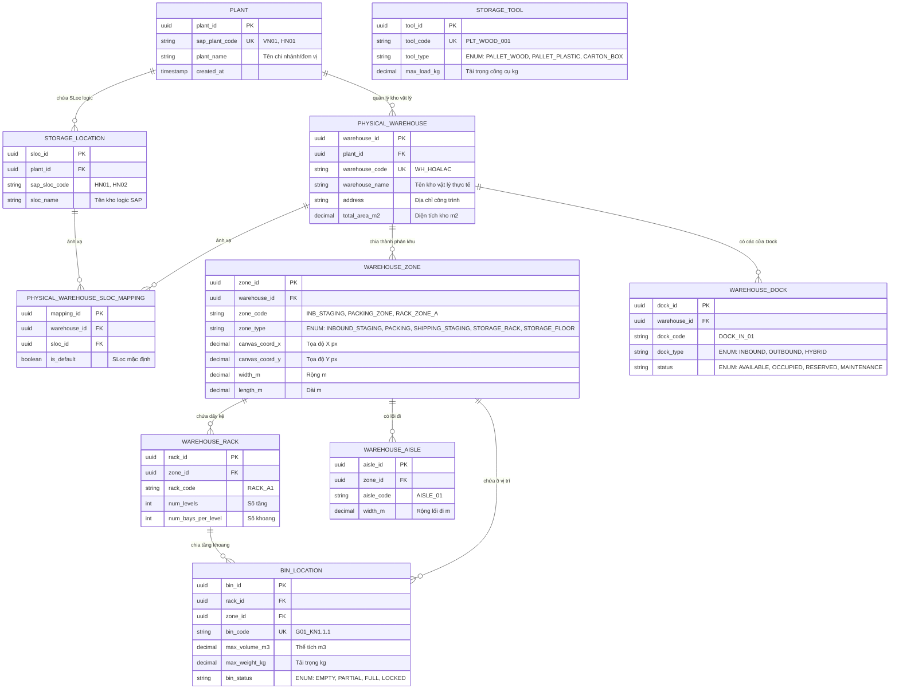
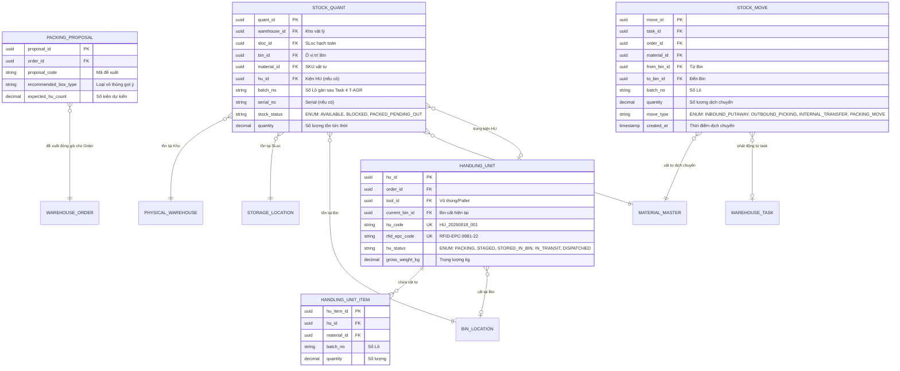

# THIẾT KẾ MÔ HÌNH DỮ LIỆU & TỪ ĐIỂN THỰC THỂ HỆ THỐNG KHO THÔNG MINH AIWS (AI-WS CORE DATA MODEL & ERD)

> **Căn cứ thiết kế:**
> - Master Context & Kiến trúc tổng thể hệ thống (`AIWS_Project_Overview_And_Architecture.md`).
> - Tài liệu nghiệp vụ chi tiết Luồng Nhập kho mua mới từ NCC (`AIWS_MM10A_Tai_Lieu_Nghiep_Vu_Nhap_Kho_Mua_Moi_NCC.md`).
> - Bộ quy trình Nhập kho chuẩn SOP (`MM.10A`, `MM.10B`, `MM.10C`, `MM.10D`, `MM.10G`).
> - Bộ quy trình Xuất kho chuẩn SOP (`sIVN.10.4.2.B1` — Xuất có vận chuyển/TMS, `sIVN.10.4.2.B2` — Xuất kho khác/Tự nhận).
> - Sơ đồ quy trình tích hợp SAP × V-Office × AIWS (`SAP_MM10_All_GR_Processes.drawio.xml`).
> - 6 Nguyên tắc thiết kế cốt lõi: Phân cấp 4 tầng quy trình, Bóc tách Mã Cha - Con gán Số Lô sau KCS, Bẻ luồng song song, Giao việc đa nhân sự (Grab-style), Điều phối vận tải thông minh (TMS/Slotting/V-Tracking), và Hội tụ Tồn kho Lõi Duy Nhất (Single Core Stock Ledger).

---

## 1. NGUYÊN TẮC THIẾT KẾ & PHÂN ĐỊNH RANH GIỚI HỆ THỐNG (SAP S/4HANA vs AIWS vs V-OFFICE)

Tài liệu này tập trung thiết kế **Cơ sở Dữ liệu Nội bộ của Hệ thống AIWS (AI Smart Warehouse Management System)**. Để đảm bảo sự minh bạch và tránh nhầm lẫn giữa hệ thống ERP quản trị tài chính và hệ thống thực thi vận hành kho vật lý, ranh giới dữ liệu và quyền sở hữu được quy định bất biến như sau:

| Tiêu chí | SAP S/4HANA (External ERP System) | AIWS Core DB (Native Physical Warehouse DB) | V-Office (External Signing Platform) |
|---|---|---|---|
| **Bản chất hệ thống** | Hệ thống Quản trị Tài nguyên & Kế toán Doanh nghiệp. | Lớp Quản lý Thực thi Công việc Kho Vật lý (**Task Execution Layer**). | Hệ thống Tr trình ký & Chữ ký số Tập đoàn. |
| **Sở hữu dữ liệu (Ownership)** | • Chứng từ gốc: Purchase Order (PO), Inbound/Outbound Delivery, PM Order, WBS Element. • Hạch toán tài chính & Sổ cái vật tư (Material Document, Movement Type 101/201). • Kết quả KCS chính thức (Unrestricted Use `UU` / Blocked Stock). • Danh mục SKU Master của Tập đoàn. | • Hạ tầng mặt bằng kho vật lý (Kho, Phân khu Zone, Dãy kệ Rack, Ô vị trí Bin, Cửa Dock). • Phân cấp 4 tầng quy trình & Task Engine (Mẫu Task, Giao việc Grab-style, Task Assignment). • Sổ cái tồn kho tức thời (Stock Quant & Stock Move). • Đóng gói Kiện Handling Unit (HU) & Mã thẻ chip RFID. • An ninh cổng kho (Gate Security Events) & Slotting lịch xe cập bến. • Biên bản bàn giao (BBBG) ký điện tử tại hiện trường. | • Luồng phê duyệt văn bản điện tử, danh sách người duyệt & Chữ ký số CA. |
| **Biểu diễn trên AIWS DB** | **Không lưu bảng master của SAP trong AIWS DB**. Dữ liệu SAP được dẫn chiếu qua các **Trường Ngoại Tham Chiếu (External Reference Attributes)** hoặc lưu trong **Bảng Staging Tích hợp (`sap_inbound_staging_*`)** để làm căn cứ sinh Order. | **Lưu trữ 100% các bảng Core DB** thuộc 10 miền vận hành của AIWS. | Chỉ lưu **Mã giao dịch trình ký (`voffice_trans_id`)**, trạng thái ký và URL file PDF đã ký. |

---

## MỤC LỤC TỔNG QUAN

- [PHẦN 1: SƠ ĐỒ MỐI QUAN HỆ THỰC THỂ (ER DIAGRAMS)](#phần-1-sơ-đồ-mối-quan-hệ-thực-thể-er-diagrams)
  - [1.1. Sơ đồ Quan hệ Tổng thể Hệ thống AIWS (Comprehensive Macro ERD)](#11-sơ-đồ-quan-hệ-tổng-thể-hệ-thống-aiws-comprehensive-macro-erd)
  - [1.2. Sơ đồ ERD Miền 1: Hạ Tầng Mặt Bằng Kho Vật Lý, Vị Trí Ô Kệ & Không Gian](#12-sơ-đồ-erd-miền-1-hạ-tầng-mặt-bằng-kho-vật-lý-vị-trí-ô-kệ--không-gian)
  - [1.3. Sơ đồ ERD Miền 2 & 3: Master Data Vật Tư, Mã Cha-Con, Nhân Sự & Phân Quyền](#13-sơ-đồ-erd-miền-2--3-master-data-vật-tư-mã-cha-con-nhân-sự--phân-quyền)
  - [1.4. Sơ đồ ERD Miền 4 & 5: Catalog Quy Trình 4 Tầng, Lệnh Kho & Task Engine (Grab-Style)](#14-sơ-đồ-erd-miền-4--5-catalog-quy-trình-4-tầng-lệnh-kho--task-engine-grab-style)
  - [1.5. Sơ đồ ERD Miền 6 & 7: Handling Unit (HU), RFID, Bẻ Luồng Song Song & Single Stock Ledger](#15-sơ-đồ-erd-miền-6--7-handling-unit-hu-rfid-bẻ-luồng-song-song--single-stock-ledger)
  - [1.6. Sơ đồ ERD Miền 8, 9 & 10: Chứng Từ, An Ninh, TMS Vận Tải, SLA Alerts & SAP Staging](#16-sơ-đồ-erd-miền-8-9--10-chứng-từ-an-ninh-tms-vận-tải-sla-alerts--sap-staging)
- [PHẦN 2: BẢNG MA TRẬN TỔNG HỢP & PHÂN TÍCH OPERATIONAL MATRIX 53 THỰC THỂ AIWS](#phần-2-bảng-ma-trận-tổng-hợp--phân-tích-operational-matrix-53-thực-thể-aiws)
  - [2.1. Bảng Ma Trận Tổng Hợp 53 Thực Thể AIWS (Summary Matrix Table với Phân Tích Chức Năng, Vòng Đời & Trigger Chi Tiết)](#21-bảng-ma-trận-tổng-hợp-53-thực-thể-aiws-summary-matrix-table-với-phân-tích-chức-năng-vòng-đời--trigger-chi-tiết)
- [PHẦN 3: TỪ ĐIỂN DỮ LIỆU CHI TIẾT 53 THỰC THỂ AIWS (DATA DICTIONARY)](#phần-3-từ-điển-dữ-liệu-chi-tiết-53-thực-thể-aiws-data-dictionary)
  - [NHÓM 1: MASTER DATA HẠ TẦNG KHO VẬT LÝ & MẶT BẰNG (10 Thực thể)](#nhóm-1-master-data-hạ-tầng-kho-vật-lý--mặt-bằng-10-thực-thể)
  - [NHÓM 2: MASTER DATA VẬT TƯ AIWS, MÃ CHA - CON & BOM (3 Thực thể)](#nhóm-2-master-data-vật-tư-aiws-mã-cha---con--bom-3-thực-thể)
  - [NHÓM 3: DANH MỤC DÙNG CHUNG, NHÂN SỰ, PHÂN QUYỀN & ĐỐI TÁC (8 Thực thể)](#nhóm-3-danh-mục-dùng-chung-nhân-sự-phân-quyền--đối-tác-8-thực-thể)
  - [NHÓM 4: PHÂN CẤP QUY TRÌNH 4 TẦNG & CATALOG TASK ENGINE (5 Thực thể)](#nhóm-4-phân-cấp-quy-trình-4-tầng--catalog-task-engine-5-thực-thể)
  - [NHÓM 5: QUẢN LÝ LỆNH KHO & THỰC THI TASK GRAB-STYLE (9 Thực thể)](#nhóm-5-quản-lý-lệnh-kho--thực-thi-task-grab-style-9-thực-thể)
  - [NHÓM 6: ĐÓNG GÓI HANDLING UNIT (HU), RFID & BẺ LUỒNG SONG SONG (3 Thực thể)](#nhóm-6-đóng-gói-handling-unit-hu-rfid--bẻ-luồng-song-song-3-thực-thể)
  - [NHÓM 7: SỔ CÁI TỒN KHO LÕI TỨC THỜI (SINGLE CORE STOCK LEDGER) (2 Thực thể)](#nhóm-7-sổ-cái-tồn-kho-lõi-tức-thời-single-core-stock-ledger-2-thực-thể)
  - [NHÓM 8: BIÊN BẢN, KCS, V-OFFICE & AN NINH CỔNG KHO (5 Thực thể)](#nhóm-8-biên-bản-kcs-v-office--an-ninh-cổng-kho-5-thực-thể)
  - [NHÓM 9: ĐIỀU PHỐI VẬN TẢI TMS, LỊCH XE & V-TRACKING (3 Thực thể)](#nhóm-9-điều-phối-vận-tải-tms-lịch-xe--v-tracking-3-thực-thể)
  - [NHÓM 10: TÍCH HỢP SAP STAGING, LOG & SLA KPI ENGINE (5 Thực thể)](#nhóm-10-tích-hợp-sap-staging-log--sla-kpi-engine-5-thực-thể)

---

# PHẦN 1: SƠ ĐỒ MỐI QUAN HỆ THỰC THỂ (ER DIAGRAMS)

## 1.1. Sơ đồ Quan hệ Tổng thể Hệ thống AIWS (Comprehensive Macro ERD)

```mermaid
erDiagram
    %% MIỀN 1: HẠ TẦNG KHO & MẶT BẰNG VẬT LÝ
    PLANT ||--o{ STORAGE_LOCATION : "chứa SLoc logic (1-n)"
    PLANT ||--o{ PHYSICAL_WAREHOUSE : "quản lý công trình kho vật lý"
    PHYSICAL_WAREHOUSE ||--o{ PHYSICAL_WAREHOUSE_SLOC_MAPPING : "ánh xạ kho vật lý ⇄ SLoc"
    STORAGE_LOCATION ||--o{ PHYSICAL_WAREHOUSE_SLOC_MAPPING : "mapped"
    PHYSICAL_WAREHOUSE ||--o{ WAREHOUSE_ZONE : "chia thành các phân khu"
    PHYSICAL_WAREHOUSE ||--o{ WAREHOUSE_DOCK : "có các cửa Dock"
    PHYSICAL_WAREHOUSE ||--o{ WAREHOUSE_AISLE : "có lối đi"
    WAREHOUSE_ZONE ||--o{ WAREHOUSE_RACK : "chứa dãy kệ"
    WAREHOUSE_ZONE ||--o{ BIN_LOCATION : "chứa ô vị trí"
    WAREHOUSE_RACK ||--o{ BIN_LOCATION : "chia tầng/khoang"

    %% MIỀN 2 & 3: MASTER DATA VẬT TƯ, MÃ CHA-CON & NHÂN SỰ
    MATERIAL_MASTER ||--o{ MATERIAL_MASTER : "Mã Cha -> Mã Con"
    MATERIAL_MASTER ||--o{ MATERIAL_BOM_STRUCTURE : "BOM Cha"
    MATERIAL_MASTER ||--o{ MATERIAL_BOM_STRUCTURE : "BOM Con"
    MATERIAL_MASTER ||--o{ MATERIAL_SERIAL_REGISTRY : "quản lý serial"

    EMPLOYEE ||--o{ EMPLOYEE_ROLE : "gán Role"
    ROLE ||--o{ EMPLOYEE_ROLE : "thuộc Role"
    ROLE ||--o{ ROLE_PERMISSION : "chứa quyền"
    EMPLOYEE ||--o| USER_ACCOUNT : "có tài khoản"
    EMPLOYEE ||--o| PHYSICAL_WAREHOUSE : "làm việc tại kho"
    PARTNER ||--o{ DRIVER : "quản lý tài xế"
    PARTNER ||--o{ VEHICLE : "sở hữu xe"

    %% MIỀN 4: CATALOG QUY TRÌNH 4 TẦNG & TASK TEMPLATE
    WORKFLOW_DOMAIN ||--o{ PROCESS_PROFILE : "Tầng 1 -> Tầng 2 (Domain -> Profile)"
    PROCESS_PROFILE ||--o{ PROCESS_STAGE : "Tầng 2 -> Tầng 3 (Giai đoạn Dashboard %)"
    PROCESS_PROFILE ||--o{ TASK_TEMPLATE : "Tầng 2 -> Tầng 4 (Mẫu Task tác nghiệp)"
    PROCESS_STAGE ||--o{ TASK_TEMPLATE : "nhóm các task"
    TASK_TEMPLATE ||--o{ TASK_DEPENDENCY_RULE : "quy tắc tiền đề & song song"
    TASK_TEMPLATE }o--|| ROLE : "chỉ định Role thực hiện"

    %% MIỀN 5: LỆNH (ORDER) & TASK EXECUTION (GRAB MATCHING)
    WAREHOUSE_ORDER }o--|| PROCESS_PROFILE : "áp dụng quy trình"
    WAREHOUSE_ORDER }o--|| PHYSICAL_WAREHOUSE : "thực thi tại kho vật lý"
    WAREHOUSE_ORDER }o--|| STORAGE_LOCATION : "hạch toán SLoc"
    WAREHOUSE_ORDER ||--o{ WAREHOUSE_ORDER_ITEM : "chứa các dòng hàng"
    WAREHOUSE_ORDER_ITEM }o--|| MATERIAL_MASTER : "là SKU"
    WAREHOUSE_ORDER_ITEM ||--o{ WAREHOUSE_ORDER_ITEM : "Dòng Cha -> Dòng Con (KCS)"

    WAREHOUSE_ORDER ||--o| ORDER_EXTENSION_INBOUND_NCC : "mở rộng MM.10A"
    WAREHOUSE_ORDER ||--o| ORDER_EXTENSION_INBOUND_RETURN : "mở rộng Thu hồi"
    WAREHOUSE_ORDER ||--o| ORDER_EXTENSION_OUTBOUND : "mở rộng Xuất kho"

    WAREHOUSE_ORDER ||--o{ WAREHOUSE_TASK : "sinh chuỗi task"
    WAREHOUSE_TASK }o--|| TASK_TEMPLATE : "theo mẫu task"
    WAREHOUSE_TASK }o--|| PROCESS_STAGE : "thuộc stage"
    WAREHOUSE_TASK ||--o{ TASK_ASSIGNMENT : "phân công 1 hoặc N người"
    EMPLOYEE ||--o{ TASK_ASSIGNMENT : "nhân viên thực hiện"
    WAREHOUSE_TASK ||--o{ TASK_ITEM_DETAIL : "chi tiết hàng xử lý"
    WAREHOUSE_TASK ||--o{ TASK_EVIDENCE : "bằng chứng hình ảnh/mã quét"

    %% MIỀN 6 & 7: HU, RFID & SINGLE STOCK LEDGER
    WAREHOUSE_ORDER ||--o{ HANDLING_UNIT : "sinh kiện đóng gói"
    STORAGE_TOOL ||--o{ HANDLING_UNIT : "dùng vỏ thùng/pallet"
    HANDLING_UNIT ||--o{ HANDLING_UNIT_ITEM : "chứa SKU + Số lô"
    HANDLING_UNIT }o--o| BIN_LOCATION : "cất tại Bin"

    WAREHOUSE_TASK ||--o{ STOCK_MOVE : "phát động dịch chuyển"
    STOCK_MOVE }o--|| MATERIAL_MASTER : "vật tư dịch chuyển"
    STOCK_MOVE }o--|| PHYSICAL_WAREHOUSE : "tại Kho vật lý"
    STOCK_MOVE }o--o| BIN_LOCATION : "từ Bin"
    STOCK_MOVE }o--o| BIN_LOCATION : "đến Bin"

    STOCK_QUANT }o--|| PHYSICAL_WAREHOUSE : "tồn tại Kho"
    STOCK_QUANT }o--|| STORAGE_LOCATION : "tồn tại SLoc"
    STOCK_QUANT }o--|| BIN_LOCATION : "tồn tại ô Bin"
    STOCK_QUANT }o--|| MATERIAL_MASTER : "tồn SKU"
    STOCK_QUANT }o--o| HANDLING_UNIT : "trong kiện HU"

    %% MIỀN 8, 9 & 10: TÍCH HỢP SAP, V-OFFICE, AN NINH & TMS
    WAREHOUSE_ORDER ||--o| GATE_SECURITY_EVENT : "sự kiện vào/ra cổng (T-Scr)"
    WAREHOUSE_ORDER ||--o| DELIVERY_SCHEDULE_SLOT : "hẹn giờ Dock"
    WAREHOUSE_ORDER ||--o| DELIVERY_HANDOVER_RECORD : "BBBG điện tử (T-Ho)"
    WAREHOUSE_ORDER ||--o| KCS_INSPECTION_RESULT : "KCS SAP (T-API5)"
    WAREHOUSE_ORDER ||--o{ VOFFICE_SIGNING_DOSSIER : "trình ký V-Office (T-Sig)"

    WAREHOUSE_ORDER }o--o| VEHICLE_DISPATCH_SCHEDULE : "gán chuyến xe TMS (B1)"
    VEHICLE_DISPATCH_SCHEDULE ||--o{ DISPATCH_ROUTE_STOP : "các điểm dừng"
    VEHICLE_TRACKING_LOG }o--|| VEHICLE_DISPATCH_SCHEDULE : "GPS log"

    SAP_INBOUND_STAGING_HEADER ||--o{ SAP_INBOUND_STAGING_ITEM : "chứa dòng staging"
    WAREHOUSE_ORDER }o--o| SAP_INBOUND_STAGING_HEADER : "sinh từ staging T-API1"
    WAREHOUSE_ORDER ||--o{ SAP_INTEGRATION_MESSAGE_LOG : "log API T-API1..5"
    WAREHOUSE_TASK ||--o{ SLA_ALERT_LOG : "cảnh báo SLA (T-S11/S12)"
    USER_ACCOUNT ||--o{ SYSTEM_AUDIT_LOG : "log audit thao tác"
```

---

## 1.2. Sơ đồ ERD Miền 1: Hạ Tầng Mặt Bằng Kho Vật Lý, Vị Trí Ô Kệ & Không Gian

---

## 1.3. Sơ đồ ERD Miền 2 & 3: Master Data Vật Tư, Mã Cha-Con, Nhân Sự & Phân Quyền

```mermaid
erDiagram
    MATERIAL_MASTER {
        uuid material_id PK
        string sap_material_code UK "10029341"
        string material_name "Tên SKU vật tư"
        uuid parent_material_id FK "Null nếu là Mã Cha"
        string base_uom "PNC, BO, M, KG"
        decimal weight_kg "Trọng lượng kg"
        decimal volume_m3 "Thể tích m3"
        boolean is_packing_required "Cờ bẻ luồng RFID (Nhánh A vs B)"
        boolean is_serialized "Có quản lý Serial"
    }
    MATERIAL_BOM_STRUCTURE {
        uuid bom_id PK
        uuid parent_material_id FK
        uuid child_material_id FK
        decimal component_ratio "Tỷ lệ phân rã"
    }
    MATERIAL_SERIAL_REGISTRY {
        uuid serial_id PK
        uuid material_id FK
        string serial_no UK "Số Serial"
        string batch_no "Số Lô"
        string serial_status "ENUM: IN_STOCK, ISSUED, DEFECTIVE_REPAIRED, SCRAPPED"
    }
    EMPLOYEE {
        uuid employee_id PK
        uuid warehouse_id FK "Kho vật lý chính"
        string employee_code UK "NV_00123"
        string full_name "Họ tên"
        string phone_number "SĐT"
        string email "Email"
    }
    USER_ACCOUNT {
        uuid user_id PK
        uuid employee_id FK "Null nếu là đối tác"
        uuid partner_id FK "Null nếu là nội bộ"
        string username UK "Tên đăng nhập"
        string password_hash "Mật khẩu"
        boolean is_active "Đang hoạt động"
    }
    ROLE {
        uuid role_id PK
        string role_code UK "ROLE_WAREHOUSE_MASTER, ROLE_WAREHOUSE_WORKER"
        string role_name "Tên Role hiển thị"
    }
    EMPLOYEE_ROLE {
        uuid emp_role_id PK
        uuid employee_id FK
        uuid role_id FK
    }
    ROLE_PERMISSION {
        uuid perm_id PK
        uuid role_id FK
        string permission_code "ORDER_CONFIRM, TASK_ACCEPT"
    }
    PARTNER {
        uuid partner_id PK
        string sap_vendor_code UK "VEND_9001"
        string partner_name "Tên đối tác"
        string partner_type "ENUM: SUPPLIER, TRANSPORT_CARRIER_TSA, CUSTOMER"
    }
    DRIVER {
        uuid driver_id PK
        uuid partner_id FK
        string driver_name "Họ tên tài xế"
        string id_card_no "CCCD tài xế"
        string phone_number "SĐT"
    }
    VEHICLE {
        uuid vehicle_id PK
        uuid partner_id FK
        string license_plate UK "Biển số xe"
        string vehicle_type "CONTAINER_40FT, TRUCK_5TON"
        decimal max_payload_kg "Tải trọng tối đa"
    }

    MATERIAL_MASTER ||--o{ MATERIAL_MASTER : "Mã Cha -> Mã Con"
    MATERIAL_MASTER ||--o{ MATERIAL_BOM_STRUCTURE : "BOM Cha"
    MATERIAL_MASTER ||--o{ MATERIAL_BOM_STRUCTURE : "BOM Con"
    MATERIAL_MASTER ||--o{ MATERIAL_SERIAL_REGISTRY : "quản lý serial"

    EMPLOYEE ||--o{ EMPLOYEE_ROLE : "gán Role"
    ROLE ||--o{ EMPLOYEE_ROLE : "thuộc Role"
    ROLE ||--o{ ROLE_PERMISSION : "chứa quyền"
    EMPLOYEE ||--o| USER_ACCOUNT : "có tài khoản nội bộ"
    PARTNER ||--o| USER_ACCOUNT : "có tài khoản đối tác"
    PARTNER ||--o{ DRIVER : "quản lý tài xế"
    PARTNER ||--o{ VEHICLE : "sở hữu xe"
```

---

## 1.4. Sơ đồ ERD Miền 4 & 5: Catalog Quy Trình 4 Tầng, Lệnh Kho & Task Engine (Grab-Style)

```mermaid
erDiagram
    WORKFLOW_DOMAIN {
        uuid domain_id PK
        string domain_code UK "INBOUND, OUTBOUND, TRANSFER, INVENTORY"
        string domain_name "Tầng 1: Phân hệ luồng lớn"
    }
    PROCESS_PROFILE {
        uuid profile_id PK
        uuid domain_id FK
        string profile_code UK "MM.10A, MM.10B, MM.10C, OUT.01A"
        string profile_name "Tầng 2: Quy trình nghiệp vụ"
        boolean has_kcs_step "Có bước KCS"
        boolean has_voffice_step "Có bước V-Office"
    }
    PROCESS_STAGE {
        uuid stage_id PK
        uuid profile_id FK
        int stage_order "1, 2, 3, 4, 5"
        string stage_name "Tầng 3: Stage 20%, Stage 40%"
        decimal progress_percentage "20, 40, 60, 80, 100"
    }
    TASK_TEMPLATE {
        uuid template_id PK
        uuid profile_id FK
        uuid stage_id FK
        uuid role_id FK "Role xử lý Task"
        string task_type_code UK "T-Unl, T-Ho, T-Mv1, T-AGR, T-Pac, T-Mv3"
        string template_name "Tầng 4: Mẫu Task"
        int default_sla_minutes "SLA phút"
        string execution_mode "ENUM: SINGLE_USER, JOINT_USER_2P, AUTOMATIC_SYSTEM"
    }
    TASK_DEPENDENCY_RULE {
        uuid rule_id PK
        uuid template_id FK "Task hiện tại"
        uuid prerequisite_template_id FK "Task phải xong trước"
        string dependency_type "ENUM: SEQUENTIAL_COMPLETED, PARALLEL_FORK, PARALLEL_JOIN"
    }

    WAREHOUSE_ORDER {
        uuid order_id PK
        uuid profile_id FK
        uuid warehouse_id FK "Kho vật lý"
        uuid sloc_id FK "SLoc hạch toán"
        string order_code UK "ORD-INB-20260818-001"
        string sap_po_number "Ref SAP PO"
        string sap_delivery_note_no "Ref SAP Inbound Delivery"
        string order_status "ENUM: WAIT_CONFIRM, APPROVED, IN_PROGRESS, COMPLETED, CANCELED"
        timestamp confirmed_at "Thủ kho duyệt -> TRIGGER sinh Task"
    }
    WAREHOUSE_ORDER_ITEM {
        uuid order_item_id PK
        uuid order_id FK
        uuid material_id FK
        uuid parent_item_id FK "Dòng cha KCS"
        string batch_no "Số lô gán sau Task 4 T-AGR"
        decimal planned_qty "Số lượng kế hoạch"
        decimal actual_received_qty "Số lượng thực nhận"
        string item_status "ENUM: PENDING, UNLOADED, KCS_PASSED, PACKED, STORED"
    }
    ORDER_EXTENSION_INBOUND_NCC {
        uuid ext_id PK
        uuid order_id FK
        string sap_contract_no "Số hợp đồng SAP"
        uuid supplier_partner_id FK "Nhà cung cấp"
        string packing_list_doc_no "Packing list BOM"
    }
    ORDER_EXTENSION_INBOUND_RETURN {
        uuid ext_id PK
        uuid order_id FK
        string sap_reservation_no "Số Reservation PS MM.10B"
        string sap_pm_order_no "Số PM Order MM.10C"
        string project_wbs_code "Mã WBS dự án"
    }
    ORDER_EXTENSION_OUTBOUND {
        uuid ext_id PK
        uuid order_id FK
        string receiver_customer_name "Tên đơn vị nhận"
        string shipping_address "Địa chỉ giao"
        uuid dispatch_schedule_id FK "Chuyến xe TMS"
    }

    WAREHOUSE_TASK {
        uuid task_id PK
        uuid order_id FK
        uuid template_id FK
        uuid stage_id FK
        string task_code UK "TSK-20260818-0001"
        string task_status "ENUM: NEW, AVAILABLE, IN_PROGRESS, COMPLETED, CANCELED"
        boolean is_parallel_branch "Cờ song song"
        string branch_code "BRANCH_A_PACKING, BRANCH_B_DIRECT_PUTAWAY"
        timestamp unlocked_at "Giờ chuyển AVAILABLE"
        timestamp completed_at "Giờ COMPLETED"
    }
    TASK_ASSIGNMENT {
        uuid assignment_id PK
        uuid task_id FK
        uuid employee_id FK
        uuid role_id FK
        string assignment_status "ENUM: ASSIGNED, ACCEPTED, IN_PROGRESS, FINISHED"
        timestamp accepted_at "Nhân viên bấm Nhận việc"
        timestamp finished_at "Nhân viên bấm Hoàn thành"
    }
    TASK_ITEM_DETAIL {
        uuid detail_id PK
        uuid task_id FK
        uuid order_item_id FK
        decimal processed_qty "Số lượng xử lý"
        string serial_no "Serial"
    }
    TASK_EVIDENCE {
        uuid evidence_id PK
        uuid task_id FK
        string evidence_type "ENUM: IMAGE, SIGNATURE, RFID_SCAN, BARCODE_SCAN"
        string file_url "Đường dẫn file"
    }

    WORKFLOW_DOMAIN ||--o{ PROCESS_PROFILE : "T1 -> T2"
    PROCESS_PROFILE ||--o{ PROCESS_STAGE : "T2 -> T3"
    PROCESS_PROFILE ||--o{ TASK_TEMPLATE : "T2 -> T4"
    PROCESS_STAGE ||--o{ TASK_TEMPLATE : "nhóm task"
    TASK_TEMPLATE ||--o{ TASK_DEPENDENCY_RULE : "quy tắc tuần tự/song song"

    WAREHOUSE_ORDER }o--|| PROCESS_PROFILE : "áp dụng"
    WAREHOUSE_ORDER ||--o{ WAREHOUSE_ORDER_ITEM : "chứa"
    WAREHOUSE_ORDER ||--o| ORDER_EXTENSION_INBOUND_NCC : "mở rộng MM.10A"
    WAREHOUSE_ORDER ||--o| ORDER_EXTENSION_INBOUND_RETURN : "mở rộng Thu hồi"
    WAREHOUSE_ORDER ||--o| ORDER_EXTENSION_OUTBOUND : "mở rộng Xuất"
    WAREHOUSE_ORDER ||--o{ WAREHOUSE_TASK : "sinh task"
    WAREHOUSE_TASK }o--|| TASK_TEMPLATE : "theo mẫu"
    WAREHOUSE_TASK }o--|| PROCESS_STAGE : "thuộc stage"
    WAREHOUSE_TASK ||--o{ TASK_ASSIGNMENT : "giao N người"
    EMPLOYEE ||--o{ TASK_ASSIGNMENT : "thực hiện"
    WAREHOUSE_TASK ||--o{ TASK_ITEM_DETAIL : "xử lý"
    WAREHOUSE_TASK ||--o{ TASK_EVIDENCE : "bằng chứng"
```

---

## 1.5. Sơ đồ ERD Miền 6 & 7: Handling Unit (HU), RFID, Bẻ Luồng Song Song & Single Stock Ledger

---

## 1.6. Sơ đồ ERD Miền 8, 9 & 10: Chứng Từ, An Ninh, TMS Vận Tải, SLA Alerts & SAP Staging

```mermaid
erDiagram
    GATE_SECURITY_EVENT {
        uuid gate_event_id PK
        uuid order_id FK
        uuid vehicle_id FK
        uuid driver_id FK
        timestamp check_in_time "Bảo vệ quét T-Scr vào"
        timestamp check_out_time "Bảo vệ chốt ra"
        string gate_status "ENUM: CHECKED_IN, LOADING_UNLOADING, CHECKED_OUT"
    }
    DELIVERY_SCHEDULE_SLOT {
        uuid slot_id PK
        uuid order_id FK
        uuid dock_id FK
        timestamp scheduled_arrival_time "Hẹn giờ xe cập bến"
        timestamp actual_arrival_time "Xe thực tế đến"
        string slot_status "ENUM: BOOKED, CONFIRMED, COMPLETED, CANCELLED"
    }
    DELIVERY_HANDOVER_RECORD {
        uuid record_id PK
        uuid order_id FK
        string record_code UK "BBBG-20260818-01"
        string signature_type "ENUM: ELECTRONIC_TOUCH, CA_DIGITAL_CERT"
        string signed_pdf_url "File PDF ký"
        timestamp signed_at "Thời điểm ký Task 2 T-Ho"
    }
    KCS_INSPECTION_RESULT {
        uuid kcs_id PK
        uuid order_id FK
        string sap_kcs_doc_no "Mã chứng từ KCS SAP T-API5"
        string kcs_status "ENUM: PASSED_UU, FAILED_BLOCKED, PARTIAL"
        timestamp received_at
    }
    VOFFICE_SIGNING_DOSSIER {
        uuid dossier_id PK
        uuid order_id FK
        string voffice_trans_id UK "Mã giao dịch T-Sig"
        string dossier_title "Tiêu đề trình ký"
        string signing_status "ENUM: DRAFT, SUBMITTED, APPROVED, REJECTED"
        string signed_file_url "File đã duyệt"
    }

    VEHICLE_DISPATCH_SCHEDULE {
        uuid schedule_id PK
        uuid partner_id FK "Hãng xe TSA"
        uuid vehicle_id FK
        uuid driver_id FK
        string dispatch_code UK "DISP-20260818-01"
        timestamp scheduled_departure_time "Giờ xuất phát"
        string status "ENUM: PLANNED, APPROVED_VDA, ASSIGNED_TSA, IN_TRANSIT, COMPLETED"
    }
    DISPATCH_ROUTE_STOP {
        uuid stop_id PK
        uuid schedule_id FK
        uuid order_id FK
        int stop_sequence "Thứ tự dừng 1, 2, 3"
    }
    VEHICLE_TRACKING_LOG {
        uuid log_id PK
        uuid schedule_id FK
        decimal gps_latitude "Vĩ độ GPS"
        decimal gps_longitude "Kinh độ GPS"
        timestamp logged_at
    }

    SAP_INBOUND_STAGING_HEADER {
        uuid staging_header_id PK
        string sap_inbound_delivery_no UK "T-API1 Inbound Delivery"
        string sap_po_number "Số PO"
        string sap_vendor_code "Mã NCC"
        timestamp payload_received_at
        string sync_status "ENUM: PENDING, PROCESSED, ERROR"
    }
    SAP_INBOUND_STAGING_ITEM {
        uuid staging_item_id PK
        uuid staging_header_id FK
        string sap_material_code "Mã SKU SAP"
        decimal quantity "Số lượng"
        string parent_material_code "Mã Cha Packing List"
    }
    SAP_INTEGRATION_MESSAGE_LOG {
        uuid message_id PK
        uuid order_id FK
        string api_code "T-API1, T-API2, T-API3, T-API5"
        string direction "ENUM: INBOUND_FROM_SAP, OUTBOUND_TO_SAP"
        string payload_json "Request JSON"
        string response_json "Response JSON"
        string status "ENUM: SUCCESS, FAILED"
        timestamp created_at
    }
    SLA_ALERT_LOG {
        uuid alert_id PK
        uuid task_id FK
        string alert_type "ENUM: WARNING_90_PERCENT_T_S11, TIMEOUT_CANCEL_T_S12"
        string notification_message "Nội dung cảnh báo"
        timestamp triggered_at
    }
    SYSTEM_AUDIT_LOG {
        uuid audit_id PK
        uuid user_id FK
        string action_name "Tên hành động"
        string entity_affected "Bảng bị tác động"
        string details_json "Chi tiết thay đổi"
        timestamp timestamp
    }

    WAREHOUSE_ORDER ||--o| GATE_SECURITY_EVENT : "sự kiện cổng"
    WAREHOUSE_ORDER ||--o| DELIVERY_SCHEDULE_SLOT : "hẹn giờ Dock"
    WAREHOUSE_ORDER ||--o| DELIVERY_HANDOVER_RECORD : "BBBG điện tử"
    WAREHOUSE_ORDER ||--o| KCS_INSPECTION_RESULT : "KCS SAP"
    WAREHOUSE_ORDER ||--o{ VOFFICE_SIGNING_DOSSIER : "trình ký V-Office"

    WAREHOUSE_ORDER }o--o| VEHICLE_DISPATCH_SCHEDULE : "gán xe TMS"
    VEHICLE_DISPATCH_SCHEDULE ||--o{ DISPATCH_ROUTE_STOP : "điểm dừng"
    VEHICLE_TRACKING_LOG }o--|| VEHICLE_DISPATCH_SCHEDULE : "GPS log"

    SAP_INBOUND_STAGING_HEADER ||--o{ SAP_INBOUND_STAGING_ITEM : "chứa dòng"
    WAREHOUSE_ORDER }o--o| SAP_INBOUND_STAGING_HEADER : "sinh từ staging T-API1"
    WAREHOUSE_ORDER ||--o{ SAP_INTEGRATION_MESSAGE_LOG : "log API"
    WAREHOUSE_TASK ||--o{ SLA_ALERT_LOG : "cảnh báo SLA"
    USER_ACCOUNT ||--o{ SYSTEM_AUDIT_LOG : "log audit"
```

---

# PHẦN 2: BẢNG MA TRẬN TỔNG HỢP & PHÂN TÍCH OPERATIONAL MATRIX 53 THỰC THỂ AIWS

## 2.1. Bảng Ma Trận Tổng Hợp 53 Thực Thể AIWS (Summary Matrix Table với Phân Tích Chức Năng, Vòng Đời & Trigger Chi Tiết)

| STT | Tên Thực Thể (PascalCase) | Tên Bảng DB (snake_case) | Nhóm / Miền Vận Hành | Hệ Thống Quản Lý / Ownership | Mô Tả Chức Năng Chi Tiết, Vòng Đời & Trigger Vận Hành Trong AIWS |
|---|---|---|---|---|---|
| **1** | `Plant` | `plant` | Nhóm 1: Hạ tầng kho | AIWS Core DB (Ref SAP) | **Mục đích**: Định danh Chi nhánh / Đơn vị cấp cao nhất theo cấu trúc SAP (VD: `VN01` Tập đoàn, `HN01` Chi nhánh Hà Nội). **Quan hệ**: $1 \rightarrow N$ với `storage_location` và `physical_warehouse`. **Vòng đời & Trigger**: Tạo lập khi cấu hình master data đơn vị, ít biến động. **Phân định**: SAP sở hữu mã `sap_plant_code`; AIWS lưu làm trường ngoại tham chiếu để phân vùng dữ liệu. |
| **2** | `StorageLocation` | `storage_location` | Nhóm 1: Hạ tầng kho | AIWS Core DB (Ref SAP) | **Mục đích**: Định danh Kho Logic hạch toán Kế toán SAP (SLoc `HN01`, `HN02`) để ghi nhận tồn kho kế toán trên SAP. **Quan hệ**: FK trỏ `plant_id`; $N \rightarrow N$ với `physical_warehouse` qua `physical_warehouse_sloc_mapping`. **Vòng đời & Trigger**: Khởi tạo từ danh mục SLoc SAP. **Phân định**: SAP hạch toán tài chính theo SLoc; AIWS tham chiếu SLoc để định tuyến hạch toán kế toán cho Lệnh kho. |
| **3** | `PhysicalWarehouse` | `physical_warehouse` | Nhóm 1: Hạ tầng kho | **AIWS Native Core** | **Mục đích**: **Bảng Core của AIWS** quản lý công trình Kho Vật Lý thực tế ngoài đời (Kho Hòa Lạc, Kho Đông Anh...) trực tiếp vận hành. **Quan hệ**: FK trỏ `plant_id`; chứa $N$ `warehouse_zone`, $N$ `warehouse_dock`, $N$ `warehouse_order`. **Vòng đời & Trigger**: Sinh khi thành lập công trình kho bãi mới. **Phân định**: **AIWS làm chủ 100%** thực thi kho vật lý. |
| **4** | `PhysicalWarehouseSlocMapping` | `physical_warehouse_sloc_mapping` | Nhóm 1: Hạ tầng kho | **AIWS Native Core** | **Mục đích**: Ánh xạ $N-N$ giữa Kho Vật Lý thực tế và Kho Logic SLoc kế toán SAP. **Quan hệ**: FK trỏ `warehouse_id` và FK trỏ `sloc_id`. **Vòng đời & Trigger**: Cấu hình khi thiết lập luồng hạch toán cho kho. **Phân định**: AIWS quản lý để giải quyết bài toán 1 công trình kho chứa hàng thuộc nhiều SLoc kế toán khác nhau. |
| **5** | `WarehouseZone` | `warehouse_zone` | Nhóm 1: Hạ tầng kho | **AIWS Native Core** | **Mục đích**: Phân chia mặt bằng kho thành các phân khu chức năng (`INBOUND_STAGING`, `PACKING`, `STORAGE_RACK`, `STORAGE_FLOOR`). **Quan hệ**: FK trỏ `warehouse_id`; chứa $N$ `warehouse_rack`, $N$ `bin_location`. **Vòng đời & Trigger**: Cấu hình trên sơ đồ 2D Canvas layout. **Phân định**: AIWS làm chủ 100% không gian mặt bằng kho. |
| **6** | `WarehouseRack` | `warehouse_rack` | Nhóm 1: Hạ tầng kho | **AIWS Native Core** | **Mục đích**: Quản lý cấu trúc dãy kệ chứa hàng đa tầng (Rack A1, Rack B2) gồm số tầng `num_levels` và số khoang `num_bays_per_level`. **Quan hệ**: FK trỏ `zone_id`; chứa $N$ `bin_location`. **Vòng đời & Trigger**: Sinh ra khi dựng sơ đồ kệ kho. **Phân định**: AIWS làm chủ 100% quản lý dãy kệ. |
| **7** | `BinLocation` | `bin_location` | Nhóm 1: Hạ tầng kho | **AIWS Native Core** | **Mục đích**: **Ô vị trí Putaway nhỏ nhất trong kho (`G01_KN1.1.1`)** để xe nâng cất/lấy hàng. **Quan hệ**: FK trỏ `rack_id`/`zone_id`; trỏ $1 \rightarrow N$ tới `stock_quant`, `handling_unit`. **Vòng đời & Trigger**: Cập nhật trạng thái `EMPTY` $\rightarrow$ `PARTIAL` $\rightarrow$ `FULL` $\rightarrow$ `LOCKED` tự động mỗi khi có cất/xuất hàng. **Phân định**: AIWS làm chủ 100%. |
| **8** | `StorageTool` | `storage_tool` | Nhóm 1: Hạ tầng kho | **AIWS Native Core** | **Mục đích**: Quản lý công cụ chứa hàng (Pallet gỗ/nhựa, Thùng khay nhựa, Thùng carton) & tải trọng max $kg$. **Quan hệ**: Trỏ $1 \rightarrow N$ tới `handling_unit`. **Vòng đời & Trigger**: Cấu hình danh mục công cụ. **Phân định**: AIWS làm chủ 100% vỏ công cụ đóng gói. |
| **9** | `WarehouseDock` | `warehouse_dock` | Nhóm 1: Hạ tầng kho | **AIWS Native Core** | **Mục đích**: Quản lý Cửa Dock tiếp nhận xe tải/container xuất nhập hàng. **Quan hệ**: FK trỏ `warehouse_id`; liên kết $1 \rightarrow N$ với `delivery_schedule_slot`. **Vòng đời & Trigger**: Cập nhật `AVAILABLE` $\rightarrow$ `OCCUPIED` $\rightarrow$ `RESERVED` theo lịch xe cập bến. **Phân định**: AIWS làm chủ 100% slotting bến xe. |
| **10** | `WarehouseAisle` | `warehouse_aisle` | Nhóm 1: Hạ tầng kho | **AIWS Native Core** | **Mục đích**: Quản lý lối đi giữa các dãy kệ phục vụ thuật toán tìm đường đi xe nâng (Pathfinding Route Optimization). **Quan hệ**: FK trỏ `zone_id`. **Vòng đời & Trigger**: Sinh khi vẽ bản đồ kho. **Phân định**: AIWS làm chủ 100%. |
| **11** | `MaterialMaster` | `material_master` | Nhóm 2: Vật tư & BOM | AIWS Core DB (Ref SAP) | **Mục đích**: Danh mục SKU vật tư AIWS (kích thước, trọng lượng, UOM) & **cờ `is_packing_required` bẻ luồng song song sau KCS T-API5**. **Quan hệ**: Đệ quy $1 \rightarrow N$ (`parent_material_id`); trỏ tới `material_bom_structure`, `material_serial_registry`, `stock_quant`. **Vòng đời & Trigger**: Đồng bộ từ Material Master SAP. **Phân định**: SAP sở hữu mã master; AIWS bổ sung thuộc tính vận hành kho. |
| **12** | `MaterialBomStructure` | `material_bom_structure` | Nhóm 2: Vật tư & BOM | **AIWS Native Core** | **Mục đích**: Định mức phân rã danh mục từ Mã Cha (`ZPAR`) thành các Mã Con theo Packing List. **Quan hệ**: FK trỏ `parent_material_id` và `child_material_id`. **Vòng đời & Trigger**: Tra cứu tự động khi SAP đẩy `T-API1` hoặc khi KCS `T-API5` bóc tách. **Phân định**: AIWS làm chủ quy tắc phân rã tác nghiệp. |
| **13** | `MaterialSerialRegistry` | `material_serial_registry` | Nhóm 2: Vật tư & BOM | **AIWS Native Core** | **Mục đích**: Sổ cái quản lý danh mục số Serial đích danh của thiết bị viễn thông (Router, Switch, Card...). **Quan hệ**: FK trỏ `material_id`. **Vòng đời & Trigger**: Tạo khi quét nhập kho Task `T-Ho`/`T-AGR`; cập nhật `IN_STOCK` $\rightarrow$ `ISSUED` $\rightarrow$ `DEFECTIVE_REPAIRED`. **Phân định**: AIWS làm chủ quản lý Serial hiện trường. |
| **14** | `Employee` | `employee` | Nhóm 3: Nhân sự & Đối tác | **AIWS Native Core** | **Mục đích**: Hồ sơ nhân sự kho nội bộ (Thủ kho, NV dỡ hàng, NV đóng gói, Lái xe nâng, Bảo vệ). **Quan hệ**: FK trỏ `warehouse_id`; trỏ $1 \rightarrow N$ tới `employee_role`, `task_assignment`. **Vòng đời & Trigger**: Khởi tạo khi tuyển dụng/phân công. **Phân định**: AIWS làm chủ danh mục nhân sự kho. |
| **15** | `UserAccount` | `user_account` | Nhóm 3: Nhân sự & Đối tác | **AIWS Native Core** | **Mục đích**: Quản lý tài khoản đăng nhập Web/App cho cả nhân viên nội bộ và đối tác bên ngoài. **Quan hệ**: FK trỏ `employee_id` hoặc `partner_id`. **Vòng đời & Trigger**: Tạo khi cấp quyền sử dụng hệ thống. **Phân định**: AIWS làm chủ xác thực hệ thống. |
| **16** | `Role` | `role` | Nhóm 3: Nhân sự & Đối tác | **AIWS Native Core** | **Mục đích**: **Danh mục Role cốt lõi của Grab-style Task Engine** (`ROLE_WAREHOUSE_MASTER`, `ROLE_WAREHOUSE_WORKER`, `ROLE_FORKLIFT_DRIVER`...). **Quan hệ**: $N-N$ với `employee` qua `employee_role`; trỏ $1 \rightarrow N$ tới `task_template`. **Vòng đời & Trigger**: Danh mục bất biến hệ thống. **Phân định**: AIWS làm chủ mô hình giao việc. |
| **17** | `EmployeeRole` | `employee_role` | Nhóm 3: Nhân sự & Đối tác | **AIWS Native Core** | **Mục đích**: Bảng gán đa vai trò cho nhân sự (VD: Thủ kho kiêm Nhân viên kiểm đếm). **Quan hệ**: FK trỏ `employee_id` và `role_id`. **Vòng đời & Trigger**: Cập nhật khi phân công kiêm nhiệm. **Phân định**: AIWS làm chủ 100%. |
| **18** | `RolePermission` | `role_permission` | Nhóm 3: Nhân sự & Đối tác | **AIWS Native Core** | **Mục đích**: Phân quyền truy cập chi tiết API endpoint và chức năng màn hình UI. **Quan hệ**: FK trỏ `role_id`. **Vòng đời & Trigger**: Cấu hình phân quyền hệ thống. **Phân định**: AIWS làm chủ 100%. |
| **19** | `Partner` | `partner` | Nhóm 3: Nhân sự & Đối tác | AIWS Core DB (Ref SAP) | **Mục đích**: Danh mục đối tác ngoài (Nhà cung cấp NCC, Hãng xe TSA, Khách hàng). **Quan hệ**: Đồng bộ mã `sap_vendor_code` từ SAP. **Vòng đời & Trigger**: Tạo khi phát sinh giao dịch. **Phân định**: SAP quản lý mã master; AIWS tham chiếu đối soát. |
| **20** | `Driver` | `driver` | Nhóm 3: Nhân sự & Đối tác | **AIWS Native Core** | **Mục đích**: Thông tin tài xế giao/nhận hàng & số CCCD đối soát an ninh cổng `T-Scr`. **Quan hệ**: FK trỏ `partner_id`. **Vòng đời & Trigger**: Đăng ký khi cập bến/đặt lịch. **Phân định**: AIWS làm chủ quản lý tài xế bến. |
| **21** | `Vehicle` | `vehicle` | Nhóm 3: Nhân sự & Đối tác | **AIWS Native Core** | **Mục đích**: Danh sách phương tiện vận tải (Biển số xe, loại xe, tải trọng max). **Quan hệ**: FK trỏ `partner_id`. **Vòng đời & Trigger**: Đăng ký khi vào cổng/gán chuyến xe TMS. **Phân định**: AIWS làm chủ quản lý xe bến. |
| **22** | `WorkflowDomain` | `workflow_domain` | Nhóm 4: Phân cấp Quy trình | **AIWS Native Core** | **Mục đích**: Tầng 1: Phân hệ luồng lớn (`INBOUND`, `OUTBOUND`, `TRANSFER`, `INVENTORY`). **Quan hệ**: Trỏ $1 \rightarrow N$ tới `process_profile`. **Vòng đời & Trigger**: Khởi tạo danh mục quy trình chuẩn. **Phân định**: AIWS làm chủ kiến trúc 4 tầng. |
| **23** | `ProcessProfile` | `process_profile` | Nhóm 4: Phân cấp Quy trình | **AIWS Native Core** | **Mục đích**: Tầng 2: Quy trình nghiệp vụ cụ thể (`MM.10A`, `MM.10B`, `OUT.01A`...). **Quan hệ**: FK trỏ `domain_id`; trỏ $1 \rightarrow N$ tới `process_stage`, `task_template`. **Vòng đời & Trigger**: Áp dụng khi sinh Warehouse Order. **Phân định**: AIWS làm chủ 100%. |
| **24** | `ProcessStage` | `process_stage` | Nhóm 4: Phân cấp Quy trình | **AIWS Native Core** | **Mục đích**: Tầng 3: Các Cụm Giai Đoạn (Stage) phục vụ tính toán progress Dashboard % ($20\% \rightarrow 100\%$). **Quan hệ**: FK trỏ `profile_id`. **Vòng đời & Trigger**: Tự động tính toán khi hoàn thành Task. **Phân định**: AIWS làm chủ 100%. |
| **25** | `TaskTemplate` | `task_template` | Nhóm 4: Phân cấp Quy trình | **AIWS Native Core** | **Mục đích**: Tầng 4: **Catalog Mẫu Task Tác Nghiệp Core** (`T-Unl`, `T-Ho`, `T-Mv1`, `T-AGR`, `T-Pac`, `T-Mv3`) quy định Role, SLA phút, Chế độ 1P/2P. **Quan hệ**: FK trỏ `profile_id`, `stage_id`, `role_id`. **Vòng đời & Trigger**: Mẫu chuẩn để sinh Warehouse Task. **Phân định**: AIWS làm chủ 100%. |
| **26** | `TaskDependencyRule` | `task_dependency_rule` | Nhóm 4: Phân cấp Quy trình | **AIWS Native Core** | **Mục đích**: Quy tắc phụ thuộc Task (Mở khóa tuần tự `SEQUENTIAL` hoặc bẻ luồng `PARALLEL_FORK`). **Quan hệ**: FK trỏ `template_id` và `prerequisite_template_id`. **Vòng đời & Trigger**: Tra cứu tự động khi hoàn thành Task. **Phân định**: AIWS làm chủ 100%. |
| **27** | `WarehouseOrder` | `warehouse_order` | Nhóm 5: Lệnh & Task Engine | **AIWS Native Core** | **Mục đích**: **Lệnh Kho Trung Tâm AIWS**. Sinh ra từ `T-API1`; Thủ kho duyệt `confirmed_at` chuyển `APPROVED` ➔ **TRIGGER Task Engine sinh chuỗi Task**. **Quan hệ**: FK trỏ `profile_id`, `warehouse_id`, `sloc_id`. **Vòng đời & Trigger**: `WAIT_CONFIRM` $\rightarrow$ `APPROVED` $\rightarrow$ `IN_PROGRESS` $\rightarrow$ `COMPLETED`. **Phân định**: AIWS làm chủ thực thi Lệnh kho. |
| **28** | `WarehouseOrderItem` | `warehouse_order_item` | Nhóm 5: Lệnh & Task Engine | **AIWS Native Core** | **Mục đích**: Chi tiết các dòng hàng thuộc Lệnh kho, bóc tách Mã Cha/Con sau KCS & **nơi lưu giữ Số Lô (`batch_no`) chính thức được gán**. **Quan hệ**: FK trỏ `order_id`, `material_id`. **Vòng đời & Trigger**: `PENDING` $\rightarrow$ `UNLOADED` $\rightarrow$ `KCS_PASSED` $\rightarrow$ `PACKED` $\rightarrow$ `STORED`. **Phân định**: AIWS làm chủ quản lý dòng hàng. |
| **29** | `OrderExtensionInboundNcc` | `order_extension_inbound_ncc` | Nhóm 5: Lệnh & Task Engine | **AIWS Native Core** | **Mục đích**: Thuộc tính mở rộng chuyên biệt cho Lệnh Nhập NCC (MM.10A): Số hợp đồng SAP, mã NCC, Packing List. **Quan hệ**: FK trỏ `order_id`. **Vòng đời & Trigger**: Tạo cùng Lệnh kho MM.10A. **Phân định**: AIWS lưu vết chứng từ nhập. |
| **30** | `OrderExtensionInboundReturn` | `order_extension_inbound_return` | Nhóm 5: Lệnh & Task Engine | **AIWS Native Core** | **Mục đích**: Thuộc tính mở rộng chuyên biệt cho Lệnh Nhập Thu Hồi (MM.10B/C/D): Reservation PS, PM Order, WBS. **Quan hệ**: FK trỏ `order_id`. **Vòng đời & Trigger**: Tạo cùng Lệnh kho Thu hồi. **Phân định**: AIWS lưu vết chứng từ thu hồi. |
| **31** | `OrderExtensionOutbound` | `order_extension_outbound` | Nhóm 5: Lệnh & Task Engine | **AIWS Native Core** | **Mục đích**: Thuộc tính mở rộng chuyên biệt cho Lệnh Xuất Kho (OUT.01A/B): Đơn vị nhận, địa chỉ giao, chuyến xe TMS. **Quan hệ**: FK trỏ `order_id`. **Vòng đời & Trigger**: Tạo cùng Lệnh xuất kho. **Phân định**: AIWS lưu vết xuất kho. |
| **32** | `WarehouseTask` | `warehouse_task` | Nhóm 5: Lệnh & Task Engine | **AIWS Native Core** | **Mục đích**: **Task Tác Nghiệp Thực Tế ("Grab Cuốc Xe")**. **Quan hệ**: FK trỏ `order_id`, `template_id`, `stage_id`. **Vòng đời & Trigger**: `NEW` $\rightarrow$ `AVAILABLE` $\rightarrow$ `IN_PROGRESS` $\rightarrow$ `COMPLETED`. **Phân định**: AIWS làm chủ 100% Grab Engine. |
| **33** | `TaskAssignment` | `task_assignment` | Nhóm 5: Lệnh & Task Engine | **AIWS Native Core** | **Mục đích**: Phân công & nhận việc Grab-style (giao việc 1 người hoặc **Joint Task 2 người dỡ xe cùng làm**). **Quan hệ**: FK trỏ `task_id`, `employee_id`, `role_id`. **Vòng đời & Trigger**: `ASSIGNED` $\rightarrow$ `ACCEPTED` $\rightarrow$ `IN_PROGRESS` $\rightarrow$ `FINISHED`. **Phân định**: AIWS làm chủ 100%. |
| **34** | `TaskItemDetail` | `task_item_detail` | Nhóm 5: Lệnh & Task Engine | **AIWS Native Core** | **Mục đích**: Ghi nhận số lượng thực tế kiểm đếm/đóng gói/cất kệ & mã Serial/Lô thao tác trong từng Task. **Quan hệ**: FK trỏ `task_id`, `order_item_id`. **Vòng đời & Trigger**: Ghi nhận khi làm Task. **Phân định**: AIWS làm chủ 100%. |
| **35** | `TaskEvidence` | `task_evidence` | Nhóm 5: Lệnh & Task Engine | **AIWS Native Core** | **Mục đích**: Bằng chứng di động (Ảnh dỡ hàng hỏng, chữ ký điện tử, mã quét RFID/Barcode). **Quan hệ**: FK trỏ `task_id`. **Vòng đời & Trigger**: Đính kèm khi hoàn thành Task. **Phân định**: AIWS làm chủ 100%. |
| **36** | `HandlingUnit` | `handling_unit` | Nhóm 6: Đóng gói & RFID | **AIWS Native Core** | **Mục đích**: Kiện hàng đóng gói (Thùng carton/Pallet) & **gán mã chip RFID EPC (`rfid_epc_code`)** tại Task 6 `T-Pac`. **Quan hệ**: FK trỏ `order_id`, `tool_id`, `current_bin_id`. **Vòng đời & Trigger**: `PACKING` $\rightarrow$ `STAGED` $\rightarrow$ `STORED_IN_BIN` $\rightarrow$ `DISPATCHED`. **Phân định**: AIWS làm chủ 100% RFID HU. |
| **37** | `HandlingUnitItem` | `handling_unit_item` | Nhóm 6: Đóng gói & RFID | **AIWS Native Core** | **Mục đích**: Chi tiết danh mục SKU vật tư, số lượng và số Lô (`batch_no`) đóng trong kiện HU. **Quan hệ**: FK trỏ `hu_id`, `material_id`. **Vòng đời & Trigger**: Tạo khi đóng gói Task `T-Pac`. **Phân định**: AIWS làm chủ 100%. |
| **38** | `PackingProposal` | `packing_proposal` | Nhóm 6: Đóng gói & RFID | **AIWS Native Core** | **Mục đích**: Gợi ý đóng gói tự động AIWS (Task T-S10): Đề xuất số kiện, loại vỏ thùng chứa tối ưu. **Quan hệ**: FK trỏ `order_id`. **Vòng đời & Trigger**: Sinh tự động trước bước `T-Pac`. **Phân định**: AIWS làm chủ thuật toán gợi ý. |
| **39** | `StockQuant` | `stock_quant` | Nhóm 7: Tồn kho Lõi | **AIWS Native Core** | **Mục đích**: **SỔ CÁI TỒN KHO THỰC TẾ TỨC THỜI DUY NHẤT TOÀN HỆ THỐNG AIWS** theo 6 chiều: [Kho + SLoc + Bin + SKU + Batch + Status]. **Quan hệ**: FK trỏ `warehouse_id`, `sloc_id`, `bin_id`, `material_id`, `hu_id`. **Vòng đời & Trigger**: Cập nhật tức thì từ giao dịch `stock_move` (`T-Mv3`, `T-Pac`, `T-Ldg`). **Phân định**: **AIWS sở hữu 100% tồn kho vật lý real-time**. |
| **40** | `StockMove` | `stock_move` | Nhóm 7: Tồn kho Lõi | **AIWS Native Core** | **Mục đích**: **SỔ NHẬT KÝ BIẾN ĐỘNG TỒN KHO CHI TIẾT (AUDIT TRAIL)** ghi nhận 100% dịch chuyển từ Bin nguồn tới Bin đích. **Quan hệ**: FK trỏ `task_id`, `order_id`, `material_id`, `from_bin_id`, `to_bin_id`. **Vòng đời & Trigger**: Ghi nhật ký bất biến mỗi khi có cất/chuyển/xuất hàng. **Phân định**: AIWS làm chủ 100%. |
| **41** | `GateSecurityEvent` | `gate_security_event` | Nhóm 8: Chứng từ & An ninh | **AIWS Native Core** | **Mục đích**: Ghi nhận sự kiện xe vào/ra cổng kho do Bảo vệ thực hiện (Task `T-Scr`) & thời gian nằm bến (Dwell time). **Quan hệ**: FK trỏ `order_id`, `vehicle_id`, `driver_id`. **Vòng đời & Trigger**: `CHECKED_IN` $\rightarrow$ `LOADING_UNLOADING` $\rightarrow$ `CHECKED_OUT`. **Phân định**: AIWS làm chủ 100% an ninh cổng. |
| **42** | `DeliveryScheduleSlot` | `delivery_schedule_slot` | Nhóm 8: Chứng từ & An ninh | **AIWS Native Core** | **Mục đích**: Đặt lịch hẹn giờ xe cập bến (Dock Slotting) tránh ùn tắc cổng kho. **Quan hệ**: FK trỏ `order_id`, `dock_id`. **Vòng đời & Trigger**: `BOOKED` $\rightarrow$ `CONFIRMED` $\rightarrow$ `COMPLETED`. **Phân định**: AIWS làm chủ 100%. |
| **43** | `DeliveryHandoverRecord` | `delivery_handover_record` | Nhóm 8: Chứng từ & An ninh | **AIWS Native Core** | **Mục đích**: Biên bản bàn giao (BBBG) điện tử lập tại Task 2 `T-Ho` & chữ ký cảm ứng di động/CA. **Quan hệ**: FK trỏ `order_id`. **Vòng đời & Trigger**: Lập & ký tại Task `T-Ho`. **Phân định**: AIWS làm chủ 100% BBBG di động. |
| **44** | `KcsInspectionResult` | `kcs_inspection_result` | Nhóm 8: Chứng từ & An ninh | AIWS Core DB (Ref SAP) | **Mục đích**: Tiếp nhận kết quả KCS từ SAP (`T-API5`) để gắn trạng thái tồn kho `PASSED_UU` (Đạt) hoặc `FAILED_BLOCKED` (Khóa lỗi). **Quan hệ**: FK trỏ `order_id`. **Vòng đời & Trigger**: Nhận tin `T-API5` ➔ Cập nhật `stock_quant`. **Phân định**: SAP sở hữu kết quả KCS; AIWS tiếp nhận thực thi. |
| **45** | `VofficeSigningDossier` | `voffice_signing_dossier` | Nhóm 8: Chứng từ & An ninh | AIWS Core DB (Ref V-Off) | **Mục đích**: Quản lý hồ sơ trình ký V-Office Phiếu nhập/xuất kho (`T-Sig`) & chữ ký số CA. **Quan hệ**: FK trỏ `order_id`. **Vòng đời & Trigger**: `DRAFT` $\rightarrow$ `SUBMITTED` $\rightarrow$ `APPROVED`. **Phân định**: V-Office xử lý luồng duyệt; AIWS lưu mã giao dịch `voffice_trans_id`. |
| **46** | `VehicleDispatchSchedule` | `vehicle_dispatch_schedule` | Nhóm 9: Vận tải TMS | **AIWS Native Core** | **Mục đích**: Lịch điều phối chuyến xe vận tải xuất kho TMS (Task `T-S2`/`T-VDA`/`T-TSA`). **Quan hệ**: FK trỏ `partner_id`, `vehicle_id`, `driver_id`. **Vòng đời & Trigger**: `PLANNED` $\rightarrow$ `APPROVED_VDA` $\rightarrow$ `ASSIGNED_TSA` $\rightarrow$ `IN_TRANSIT` $\rightarrow$ `COMPLETED`. **Phân định**: AIWS làm chủ 100% TMS xuất kho. |
| **47** | `DispatchRouteStop` | `dispatch_route_stop` | Nhóm 9: Vận tải TMS | **AIWS Native Core** | **Mục đích**: Danh sách các điểm dừng giao hàng theo thứ tự tuyến đường (`stop_sequence`). **Quan hệ**: FK trỏ `schedule_id`, `order_id`. **Vòng đời & Trigger**: Tạo cùng chuyến xe TMS. **Phân định**: AIWS làm chủ 100%. |
| **48** | `VehicleTrackingLog` | `vehicle_tracking_log` | Nhóm 9: Vận tải TMS | **AIWS Native Core** | **Mục đích**: Nhật ký tọa độ GPS định vị phương tiện theo thời gian thực (V-Tracking). **Quan hệ**: FK trỏ `schedule_id`. **Vòng đời & Trigger**: Ghi log GPS định kỳ từ thiết bị định vị. **Phân định**: AIWS làm chủ 100%. |
| **49** | `SapInboundStagingHeader` | `sap_inbound_staging_header` | Nhóm 10: Tích hợp Staging | AIWS Staging Table | **Mục đích**: **Bảng Staging Tạm tiếp nhận bản tin Header `T-API1` đẩy từ SAP** (SAP Inbound Delivery VL31N). **Quan hệ**: Trỏ $1 \rightarrow N$ tới `sap_inbound_staging_item`. **Vòng đời & Trigger**: `PENDING` $\rightarrow$ `PROCESSED` $\rightarrow$ `ERROR`. **Phân định**: Bảng tạm AIWS tiếp nhận SAP. |
| **50** | `SapInboundStagingItem` | `sap_inbound_staging_item` | Nhóm 10: Tích hợp Staging | AIWS Staging Table | **Mục đích**: Bảng Staging Tạm tiếp nhận chi tiết các dòng hàng & Packing List từ SAP. **Quan hệ**: FK trỏ `staging_header_id`. **Vòng đời & Trigger**: Nhận cùng tin `T-API1`. **Phân định**: Bảng tạm AIWS tiếp nhận SAP. |
| **51** | `SapIntegrationMessageLog` | `sap_integration_message_log` | Nhóm 10: Tích hợp Staging | AIWS Staging Table | **Mục đích**: Sổ nhật ký lưu vết thông điệp API truyền nhận 2 chiều giữa SAP và AIWS (`T-API1..5`). **Quan hệ**: FK trỏ `order_id`. **Vòng đời & Trigger**: Ghi log tự động khi có gọi API. **Phân định**: AIWS lưu vết tích hợp. |
| **52** | `SlaAlertLog` | `sla_alert_log` | Nhóm 10: SLA & Log | **AIWS Native Core** | **Mục đích**: Lưu vết các cảnh báo vi phạm SLA quá hạn Task (`T-S11` 90% SLA / `T-S12` timeout). **Quan hệ**: FK trỏ `task_id`. **Vòng đời & Trigger**: Kích hoạt tự động từ SLA Engine. **Phân định**: AIWS làm chủ SLA Engine. |
| **53** | `SystemAuditLog` | `system_audit_log` | Nhóm 10: SLA & Log | **AIWS Native Core** | **Mục đích**: Sổ nhật ký Audit Trail ghi lại mọi hành vi tác động thay đổi dữ liệu của người dùng hệ thống. **Quan hệ**: FK trỏ `user_id`. **Vòng đời & Trigger**: Ghi vết tự động ở mọi API mutating state. **Phân định**: AIWS làm chủ Audit Trail. |

---

# PHẦN 3: TỪ ĐIỂN DỮ LIỆU CHI TIẾT 53 THỰC THỂ AIWS (DATA DICTIONARY)

---

## NHÓM 1: MASTER DATA HẠ TẦNG KHO VẬT LÝ & MẶT BẰNG (10 Thực thể)

### 1. `Plant` (Tên Bảng DB: `plant`)
*Mô tả: Bảng quản lý danh mục Đơn vị / Chi nhánh cấp cao nhất theo cấu trúc quản trị Viettel (Tham chiếu SAP Plant).*

| STT | Tên Cột (Column Name) | Kiểu Dữ Liệu (Data Type) | Ràng Buộc (Constraints) | Mô Tả & Quy Tắc Nghiệp Vụ (Description & Rules) |
|---|---|---|---|---|
| 1 | `plant_id` | `UUID` | `PK, NOT NULL` | Định danh duy nhất Plant trong hệ thống AIWS. |
| 2 | `sap_plant_code` | `VARCHAR(10)` | `UK, NOT NULL` | Mã Plant tham chiếu từ SAP ERP (VD: `VN01`, `HN01`). |
| 3 | `plant_name` | `VARCHAR(255)` | `NOT NULL` | Tên Chi nhánh / Đơn vị quản lý cấp cao. |
| 4 | `created_at` | `TIMESTAMP` | `NOT NULL` | Thời điểm khởi tạo bản ghi dữ liệu. |

---

### 2. `StorageLocation` (Tên Bảng DB: `storage_location`)
*Mô tả: Bảng quản lý kho logic hạch toán Kế toán tài chính trên SAP ERP (Tham chiếu SAP SLoc).*

| STT | Tên Cột (Column Name) | Kiểu Dữ Liệu (Data Type) | Ràng Buộc (Constraints) | Mô Tả & Quy Tắc Nghiệp Vụ (Description & Rules) |
|---|---|---|---|---|
| 1 | `sloc_id` | `UUID` | `PK, NOT NULL` | Định danh duy nhất Kho hạch toán SLoc. |
| 2 | `plant_id` | `UUID` | `FK, NOT NULL` | Trỏ tới `plant.plant_id` — Chi nhánh đơn vị quản lý. |
| 3 | `sap_sloc_code` | `VARCHAR(10)` | `NOT NULL` | Mã Kho logic SLoc tham chiếu từ SAP (VD: `HN01`, `HN02`). |
| 4 | `sloc_name` | `VARCHAR(255)` | `NOT NULL` | Tên Kho logic hạch toán kế toán. |

---

### 3. `PhysicalWarehouse` (Tên Bảng DB: `physical_warehouse`)
*Mô tả: Bảng Core của AIWS quản lý công trình Kho Bãi Vật Lý thực tế ngoài đời do AIWS trực tiếp điều hành.*

| STT | Tên Cột (Column Name) | Kiểu Dữ Liệu (Data Type) | Ràng Buộc (Constraints) | Mô Tả & Quy Tắc Nghiệp Vụ (Description & Rules) |
|---|---|---|---|---|
| 1 | `warehouse_id` | `UUID` | `PK, NOT NULL` | Định danh duy nhất Công trình Kho Vật Lý. |
| 2 | `plant_id` | `UUID` | `FK, NOT NULL` | Trỏ tới `plant.plant_id` — Thuộc đơn vị Chi nhánh nào. |
| 3 | `warehouse_code` | `VARCHAR(50)` | `UK, NOT NULL` | Mã Kho vật lý AIWS (VD: `WH_HOALAC`, `WH_DONGANH`). |
| 4 | `warehouse_name` | `VARCHAR(255)` | `NOT NULL` | Tên công trình kho vật lý thực tế. |
| 5 | `address` | `VARCHAR(500)` | `NULL` | Địa chỉ địa lý vị trí kho bãi. |
| 6 | `total_area_m2` | `DECIMAL(12,2)` | `NULL` | Tổng diện tích công trình kho ($m^2$). |

---

### 4. `PhysicalWarehouseSlocMapping` (Tên Bảng DB: `physical_warehouse_sloc_mapping`)
*Mô tả: Bảng ánh xạ mối quan hệ N-N giữa 1 Kho vật lý thực tế và N Kho logic SLoc hạch toán Kế toán SAP.*

| STT | Tên Cột (Column Name) | Kiểu Dữ Liệu (Data Type) | Ràng Buộc (Constraints) | Mô Tả & Quy Tắc Nghiệp Vụ (Description & Rules) |
|---|---|---|---|---|
| 1 | `mapping_id` | `UUID` | `PK, NOT NULL` | Định danh duy nhất bản ghi ánh xạ. |
| 2 | `warehouse_id` | `UUID` | `FK, NOT NULL` | Trỏ tới `physical_warehouse.warehouse_id` — Kho vật lý. |
| 3 | `sloc_id` | `UUID` | `FK, NOT NULL` | Trỏ tới `storage_location.sloc_id` — Kho logic SLoc. |
| 4 | `is_default` | `BOOLEAN` | `NOT NULL, DEFAULT true` | Cờ đánh dấu SLoc hạch toán mặc định của kho. |

---

### 5. `WarehouseZone` (Tên Bảng DB: `warehouse_zone`)
*Mô tả: Bảng quản lý các phân khu chức năng trên mặt bằng kho vật lý và lưu tọa độ sơ đồ 2D Canvas layout.*

| STT | Tên Cột (Column Name) | Kiểu Dữ Liệu (Data Type) | Ràng Buộc (Constraints) | Mô Tả & Quy Tắc Nghiệp Vụ (Description & Rules) |
|---|---|---|---|---|
| 1 | `zone_id` | `UUID` | `PK, NOT NULL` | Định danh duy nhất Phân khu Zone. |
| 2 | `warehouse_id` | `UUID` | `FK, NOT NULL` | Trỏ tới `physical_warehouse.warehouse_id` — Thuộc kho nào. |
| 3 | `zone_code` | `VARCHAR(50)` | `NOT NULL` | Mã phân khu (VD: `INB_STAGING`, `PACKING_ZONE`, `RACK_A`). |
| 4 | `zone_type` | `VARCHAR(50)` | `NOT NULL` | Loạn phân khu (`ENUM: INBOUND_STAGING, PACKING, SHIPPING_STAGING, STORAGE_RACK, STORAGE_FLOOR`). |
| 5 | `canvas_coord_x` | `DECIMAL(10,2)` | `NULL` | Tọa độ X trên sơ đồ 2D Canvas mặt bằng kho ($px$). |
| 6 | `canvas_coord_y` | `DECIMAL(10,2)` | `NULL` | Tọa độ Y trên sơ đồ 2D Canvas mặt bằng kho ($px$). |
| 7 | `width_m` | `DECIMAL(10,2)` | `NULL` | Chiều rộng thực tế phân khu ($m$). |
| 8 | `length_m` | `DECIMAL(10,2)` | `NULL` | Chiều dài thực tế phân khu ($m$). |

---

### 6. `WarehouseRack` (Tên Bảng DB: `warehouse_rack`)
*Mô tả: Bảng quản lý cấu trúc vật lý của từng dãy kệ lưu trữ đa tầng trong phân khu kho.*

| STT | Tên Cột (Column Name) | Kiểu Dữ Liệu (Data Type) | Ràng Buộc (Constraints) | Mô Tả & Quy Tắc Nghiệp Vụ (Description & Rules) |
|---|---|---|---|---|
| 1 | `rack_id` | `UUID` | `PK, NOT NULL` | Định danh duy nhất Dãy kệ Rack. |
| 2 | `zone_id` | `UUID` | `FK, NOT NULL` | Trỏ tới `warehouse_zone.zone_id` — Thuộc phân khu nào. |
| 3 | `rack_code` | `VARCHAR(50)` | `NOT NULL` | Mã dãy kệ (VD: `RACK_A1`, `RACK_B2`). |
| 4 | `num_levels` | `INT` | `NOT NULL` | Số tầng của dãy kệ. |
| 5 | `num_bays_per_level` | `INT` | `NOT NULL` | Số khoang trên mỗi tầng của dãy kệ. |

---

### 7. `BinLocation` (Tên Bảng DB: `bin_location`)
*Mô tả: Đơn vị cất giữ hàng hóa nhỏ nhất trong kho vật lý (Bin Putaway) định danh địa chỉ 3D bất biến.*

| STT | Tên Cột (Column Name) | Kiểu Dữ Liệu (Data Type) | Ràng Buộc (Constraints) | Mô Tả & Quy Tắc Nghiệp Vụ (Description & Rules) |
|---|---|---|---|---|
| 1 | `bin_id` | `UUID` | `PK, NOT NULL` | Định danh duy nhất Ô vị trí Bin. |
| 2 | `rack_id` | `UUID` | `FK, NULL` | Trỏ tới `warehouse_rack.rack_id` (Null nếu là Bãi sàn Floor). |
| 3 | `zone_id` | `UUID` | `FK, NOT NULL` | Trỏ tới `warehouse_zone.zone_id` — Thuộc phân khu nào. |
| 4 | `bin_code` | `VARCHAR(50)` | `UK, NOT NULL` | Mã địa chỉ ô vị trí bất biến duy nhất (VD: `G01_KN1.1.1`). |
| 5 | `max_volume_m3` | `DECIMAL(10,3)` | `NULL` | Thể tích chứa tối đa của ô Bin ($m^3$). |
| 6 | `max_weight_kg` | `DECIMAL(10,2)` | `NULL` | Tải trọng tối đa cho phép của ô Bin ($kg$). |
| 7 | `bin_status` | `VARCHAR(20)` | `NOT NULL, DEFAULT 'EMPTY'` | Trạng thái ô vị trí (`ENUM: EMPTY, PARTIAL, FULL, LOCKED`). |

---

### 8. `StorageTool` (Tên Bảng DB: `storage_tool`)
*Mô tả: Bảng quản lý danh mục vỏ công cụ chứa hàng (Pallet gỗ/nhựa, Thùng khay nhựa, Thùng carton).*

| STT | Tên Cột (Column Name) | Kiểu Dữ Liệu (Data Type) | Ràng Buộc (Constraints) | Mô Tả & Quy Tắc Nghiệp Vụ (Description & Rules) |
|---|---|---|---|---|
| 1 | `tool_id` | `UUID` | `PK, NOT NULL` | Định danh duy nhất vỏ công cụ chứa. |
| 2 | `tool_code` | `VARCHAR(50)` | `UK, NOT NULL` | Mã quản lý vỏ công cụ (VD: `PLT_WOOD_001`, `CTN_BOX_99`). |
| 3 | `tool_type` | `VARCHAR(50)` | `NOT NULL` | Loạn công cụ (`ENUM: PALLET_WOOD, PALLET_PLASTIC, CARTON_BOX, MESH_CONTAINER`). |
| 4 | `max_load_kg` | `DECIMAL(10,2)` | `NULL` | Tải trọng tối đa vỏ công cụ có thể mang ($kg$). |

---

### 9. `WarehouseDock` (Tên Bảng DB: `warehouse_dock`)
*Mô tả: Bảng quản lý danh mục Cửa Dock xuất/nhập hàng tại mặt tiền kho vật lý.*

| STT | Tên Cột (Column Name) | Kiểu Dữ Liệu (Data Type) | Ràng Buộc (Constraints) | Mô Tả & Quy Tắc Nghiệp Vụ (Description & Rules) |
|---|---|---|---|---|
| 1 | `dock_id` | `UUID` | `PK, NOT NULL` | Định danh duy nhất cửa Dock. |
| 2 | `warehouse_id` | `UUID` | `FK, NOT NULL` | Trỏ tới `physical_warehouse.warehouse_id` — Thuộc kho nào. |
| 3 | `dock_code` | `VARCHAR(50)` | `NOT NULL` | Mã cửa Dock (VD: `DOCK_IN_01`, `DOCK_OUT_02`). |
| 4 | `dock_type` | `VARCHAR(20)` | `NOT NULL` | Loạn Cửa Dock (`ENUM: INBOUND, OUTBOUND, HYBRID`). |
| 5 | `status` | `VARCHAR(20)` | `NOT NULL, DEFAULT 'AVAILABLE'` | Trạng thái cửa Dock (`ENUM: AVAILABLE, OCCUPIED, RESERVED, MAINTENANCE`). |

---

### 10. `WarehouseAisle` (Tên Bảng DB: `warehouse_aisle`)
*Mô tả: Bảng quản lý lối đi giữa các dãy kệ kho phục vụ bài toán tính toán đường đi xe nâng Pathfinding.*

| STT | Tên Cột (Column Name) | Kiểu Dữ Liệu (Data Type) | Ràng Buộc (Constraints) | Mô Tả & Quy Tắc Nghiệp Vụ (Description & Rules) |
|---|---|---|---|---|
| 1 | `aisle_id` | `UUID` | `PK, NOT NULL` | Định danh duy nhất lối đi. |
| 2 | `zone_id` | `UUID` | `FK, NOT NULL` | Trỏ tới `warehouse_zone.zone_id` — Thuộc phân khu nào. |
| 3 | `aisle_code` | `VARCHAR(50)` | `NOT NULL` | Mã lối đi (VD: `AISLE_01`). |
| 4 | `width_m` | `DECIMAL(10,2)` | `NULL` | Bề rộng lối đi thực tế ($m$) cho xe nâng di chuyển. |

---

## NHÓM 2: MASTER DATA VẬT TƯ AIWS, MÃ CHA - CON & BOM (3 Thực thể)

### 11. `MaterialMaster` (Tên Bảng DB: `material_master`)
*Mô tả: Danh mục SKU vật tư AIWS (đồng bộ SAP) chứa cờ bẻ luồng song song RFID `is_packing_required`.*

| STT | Tên Cột (Column Name) | Kiểu Dữ Liệu (Data Type) | Ràng Buộc (Constraints) | Mô Tả & Quy Tắc Nghiệp Vụ (Description & Rules) |
|---|---|---|---|---|
| 1 | `material_id` | `UUID` | `PK, NOT NULL` | Định danh duy nhất SKU vật tư trên AIWS. |
| 2 | `sap_material_code` | `VARCHAR(50)` | `UK, NOT NULL` | Mã SKU vật tư SAP reference (VD: `10029341`). |
| 3 | `material_name` | `VARCHAR(255)` | `NOT NULL` | Tên vật tư viễn thông / thiết bị / CCDC. |
| 4 | `parent_material_id` | `UUID` | `FK, NULL` | Trỏ tới `material_master.material_id` nếu là Mã Con phân rã. |
| 5 | `base_uom` | `VARCHAR(20)` | `NOT NULL` | Đơn vị tính cơ sở (`PNC`, `BO`, `M`, `KG`). |
| 6 | `weight_kg` | `DECIMAL(10,3)` | `NULL` | Trọng lượng 1 đơn vị sản phẩm ($kg$). |
| 7 | `volume_m3` | `DECIMAL(10,4)` | `NULL` | Thể tích 1 đơn vị sản phẩm ($m^3$). |
| 8 | `is_packing_required` | `BOOLEAN` | `NOT NULL, DEFAULT false` | **Cờ bẻ luồng song song**: `true` ➔ Đóng gói RFID (Nhánh A); `false` ➔ Cất thẳng Bin/Sàn (Nhánh B). |
| 9 | `is_serialized` | `BOOLEAN` | `NOT NULL, DEFAULT false` | Cờ xác định vật tư quản lý theo số Serial đích danh. |

---

### 12. `MaterialBomStructure` (Tên Bảng DB: `material_bom_structure`)
*Mô tả: Bảng định mức phân rã danh mục từ Mã Cha (material type ZPAR) thành các Mã Con theo Packing List.*

| STT | Tên Cột (Column Name) | Kiểu Dữ Liệu (Data Type) | Ràng Buộc (Constraints) | Mô Tả & Quy Tắc Nghiệp Vụ (Description & Rules) |
|---|---|---|---|---|
| 1 | `bom_id` | `UUID` | `PK, NOT NULL` | Định danh duy nhất cấu trúc BOM. |
| 2 | `parent_material_id` | `UUID` | `FK, NOT NULL` | Trỏ tới `material_master.material_id` — Mã Cha (ZPAR). |
| 3 | `child_material_id` | `UUID` | `FK, NOT NULL` | Trỏ tới `material_master.material_id` — Mã Con thành phần. |
| 4 | `component_ratio` | `DECIMAL(12,4)` | `NOT NULL` | Tỷ lệ định mức phân rã (VD: 1 Mã Cha gồm 4 Mã Con A). |

---

### 13. `MaterialSerialRegistry` (Tên Bảng DB: `material_serial_registry`)
*Mô tả: Sổ cái đăng ký quản lý danh mục số Serial đích danh của các thiết bị viễn thông.*

| STT | Tên Cột (Column Name) | Kiểu Dữ Liệu (Data Type) | Ràng Buộc (Constraints) | Mô Tả & Quy Tắc Nghiệp Vụ (Description & Rules) |
|---|---|---|---|---|
| 1 | `serial_id` | `UUID` | `PK, NOT NULL` | Định danh duy nhất bản ghi Serial. |
| 2 | `material_id` | `UUID` | `FK, NOT NULL` | Trỏ tới `material_master.material_id` — SKU vật tư sở hữu. |
| 3 | `serial_no` | `VARCHAR(100)` | `UK, NOT NULL` | Số Serial duy nhất của thiết bị viễn thông. |
| 4 | `batch_no` | `VARCHAR(50)` | `NULL` | Số Lô (Batch No) đi kèm thiết bị. |
| 5 | `serial_status` | `VARCHAR(30)` | `NOT NULL, DEFAULT 'IN_STOCK'` | Trạng thái (`ENUM: IN_STOCK, ISSUED, DEFECTIVE_REPAIRED, SCRAPPED`). |

---

## NHÓM 3: DANH MỤC DÙNG CHUNG, NHÂN SỰ, PHÂN QUYỀN & ĐỐI TÁC (8 Thực thể)

### 14. `Employee` (Tên Bảng DB: `employee`)
*Mô tả: Bảng quản lý thông tin hồ sơ nhân sự nội bộ thuộc hệ thống kho AIWS.*

| STT | Tên Cột (Column Name) | Kiểu Dữ Liệu (Data Type) | Ràng Buộc (Constraints) | Mô Tả & Quy Tắc Nghiệp Vụ (Description & Rules) |
|---|---|---|---|---|
| 1 | `employee_id` | `UUID` | `PK, NOT NULL` | Định danh duy nhất nhân viên. |
| 2 | `warehouse_id` | `UUID` | `FK, NULL` | Trỏ tới `physical_warehouse.warehouse_id` — Kho phân công chính. |
| 3 | `employee_code` | `VARCHAR(50)` | `UK, NOT NULL` | Mã nhân viên nội bộ (VD: `NV_00123`). |
| 4 | `full_name` | `VARCHAR(255)` | `NOT NULL` | Họ và tên nhân viên. |
| 5 | `phone_number` | `VARCHAR(20)` | `NULL` | Số điện thoại liên lạc. |
| 6 | `email` | `VARCHAR(255)` | `NULL` | Email công việc. |

---

### 15. `UserAccount` (Tên Bảng DB: `user_account`)
*Mô tả: Bảng quản lý tài khoản đăng nhập Web/App cho cả nhân viên nội bộ và đối tác bên ngoài.*

| STT | Tên Cột (Column Name) | Kiểu Dữ Liệu (Data Type) | Ràng Buộc (Constraints) | Mô Tả & Quy Tắc Nghiệp Vụ (Description & Rules) |
|---|---|---|---|---|
| 1 | `user_id` | `UUID` | `PK, NOT NULL` | Định danh duy nhất tài khoản. |
| 2 | `employee_id` | `UUID` | `FK, NULL` | Trỏ tới `employee.employee_id` (Null nếu là đối tác ngoài). |
| 3 | `partner_id` | `UUID` | `FK, NULL` | Trỏ tới `partner.partner_id` (Null nếu là nhân viên nội bộ). |
| 4 | `username` | `VARCHAR(50)` | `UK, NOT NULL` | Tên đăng nhập hệ thống AIWS. |
| 5 | `password_hash` | `VARCHAR(255)` | `NOT NULL` | Mật khẩu mã hóa BCrypt / Argon2. |
| 6 | `is_active` | `BOOLEAN` | `NOT NULL, DEFAULT true` | Trạng thái hoạt động tài khoản (`true`/`false`). |

---

### 16. `Role` (Tên Bảng DB: `role`)
*Mô tả: Danh mục vai trò cốt lõi trong mô hình Grab-style Task Engine.*

| STT | Tên Cột (Column Name) | Kiểu Dữ Liệu (Data Type) | Ràng Buộc (Constraints) | Mô Tả & Quy Tắc Nghiệp Vụ (Description & Rules) |
|---|---|---|---|---|
| 1 | `role_id` | `UUID` | `PK, NOT NULL` | Định danh duy nhất Role. |
| 2 | `role_code` | `VARCHAR(50)` | `UK, NOT NULL` | Mã vai trò (`ROLE_WAREHOUSE_MASTER`, `ROLE_WAREHOUSE_WORKER`, `ROLE_FORKLIFT_DRIVER`, `ROLE_SECURITY`, `ROLE_PARTNER`). |
| 3 | `role_name` | `VARCHAR(255)` | `NOT NULL` | Tên vai trò nghiệp vụ hiển thị. |

---

### 17. `EmployeeRole` (Tên Bảng DB: `employee_role`)
*Mô tả: Bảng gán mối quan hệ N-N giữa Nhân sự và Role (cho phép 1 nhân viên kiêm nhiệm đa vai trò).*

| STT | Tên Cột (Column Name) | Kiểu Dữ Liệu (Data Type) | Ràng Buộc (Constraints) | Mô Tả & Quy Tắc Nghiệp Vụ (Description & Rules) |
|---|---|---|---|---|
| 1 | `emp_role_id` | `UUID` | `PK, NOT NULL` | Định danh duy nhất bản ghi gán Role. |
| 2 | `employee_id` | `UUID` | `FK, NOT NULL` | Trỏ tới `employee.employee_id` — Nhân viên. |
| 3 | `role_id` | `UUID` | `FK, NOT NULL` | Trỏ tới `role.role_id` — Role gán. |

---

### 18. `RolePermission` (Tên Bảng DB: `role_permission`)
*Mô tả: Bảng phân quyền chi tiết theo từng API endpoint và chức năng màn hình UI.*

| STT | Tên Cột (Column Name) | Kiểu Dữ Liệu (Data Type) | Ràng Buộc (Constraints) | Mô Tả & Quy Tắc Nghiệp Vụ (Description & Rules) |
|---|---|---|---|---|
| 1 | `perm_id` | `UUID` | `PK, NOT NULL` | Định danh duy nhất quyền. |
| 2 | `role_id` | `UUID` | `FK, NOT NULL` | Trỏ tới `role.role_id` — Role sở hữu quyền. |
| 3 | `permission_code` | `VARCHAR(100)` | `NOT NULL` | Mã quyền API/UI (VD: `ORDER_CONFIRM`, `TASK_ACCEPT`, `PUTAWAY_EXEC`). |

---

### 19. `Partner` (Tên Bảng DB: `partner`)
*Mô tả: Danh mục các đối tác bên ngoài giao dịch với kho AIWS (NCC, Hãng xe TSA, Khách hàng).*

| STT | Tên Cột (Column Name) | Kiểu Dữ Liệu (Data Type) | Ràng Buộc (Constraints) | Mô Tả & Quy Tắc Nghiệp Vụ (Description & Rules) |
|---|---|---|---|---|
| 1 | `partner_id` | `UUID` | `PK, NOT NULL` | Định danh duy nhất đối tác. |
| 2 | `sap_vendor_code` | `VARCHAR(50)` | `UK, NULL` | Mã NCC / Đối tác trên SAP (VD: `VEND_9001`). |
| 3 | `partner_name` | `VARCHAR(255)` | `NOT NULL` | Tên công ty đối tác. |
| 4 | `partner_type` | `VARCHAR(50)` | `NOT NULL` | Loạn đối tác (`ENUM: SUPPLIER, TRANSPORT_CARRIER_TSA, CUSTOMER`). |

---

### 20. `Driver` (Tên Bảng DB: `driver`)
*Mô tả: Bảng quản lý thông tin tài xế vận tải giao/nhận hàng và số CCCD đối soát an ninh cổng.*

| STT | Tên Cột (Column Name) | Kiểu Dữ Liệu (Data Type) | Ràng Buộc (Constraints) | Mô Tả & Quy Tắc Nghiệp Vụ (Description & Rules) |
|---|---|---|---|---|
| 1 | `driver_id` | `UUID` | `PK, NOT NULL` | Định danh duy nhất tài xế. |
| 2 | `partner_id` | `UUID` | `FK, NULL` | Trỏ tới `partner.partner_id` — Thuộc nhà xe đối tác nào. |
| 3 | `driver_name` | `VARCHAR(255)` | `NOT NULL` | Họ tên tài xế lái xe. |
| 4 | `id_card_no` | `VARCHAR(20)` | `NOT NULL` | Số CCCD tài xế (đối soát an ninh cổng Task `T-Scr`). |
| 5 | `phone_number` | `VARCHAR(20)` | `NULL` | Số điện thoại liên lạc tài xế. |

---

### 21. `Vehicle` (Tên Bảng DB: `vehicle`)
*Mô tả: Bảng quản lý danh sách phương tiện vận tải (Biển số xe, loại xe Container/Xe tải, tải trọng).*

| STT | Tên Cột (Column Name) | Kiểu Dữ Liệu (Data Type) | Ràng Buộc (Constraints) | Mô Tả & Quy Tắc Nghiệp Vụ (Description & Rules) |
|---|---|---|---|---|
| 1 | `vehicle_id` | `UUID` | `PK, NOT NULL` | Định danh duy nhất phương tiện vận tải. |
| 2 | `partner_id` | `UUID` | `FK, NULL` | Trỏ tới `partner.partner_id` — Thuộc nhà xe nào. |
| 3 | `license_plate` | `VARCHAR(20)` | `UK, NOT NULL` | Biển số xe vận tải (VD: `29H-123.45`). |
| 4 | `vehicle_type` | `VARCHAR(50)` | `NULL` | Loạn phương tiện (`CONTAINER_40FT`, `TRUCK_5TON`). |
| 5 | `max_payload_kg` | `DECIMAL(10,2)` | `NULL` | Tải trọng chở tối đa của phương tiện ($kg$). |

---

## NHÓM 4: PHÂN CẤP QUY TRÌNH 4 TẦNG & CATALOG TASK ENGINE (5 Thực thể)

### 22. `WorkflowDomain` (Tên Bảng DB: `workflow_domain`)
*Mô tả: Tầng 1 trong Kiến trúc Phân cấp Quy trình 4 Tầng — Phân hệ luồng lớn trong chuỗi cung ứng.*

| STT | Tên Cột (Column Name) | Kiểu Dữ Liệu (Data Type) | Ràng Buộc (Constraints) | Mô Tả & Quy Tắc Nghiệp Vụ (Description & Rules) |
|---|---|---|---|---|
| 1 | `domain_id` | `UUID` | `PK, NOT NULL` | Định danh duy nhất Domain. |
| 2 | `domain_code` | `VARCHAR(50)` | `UK, NOT NULL` | Mã Domain (`INBOUND`, `OUTBOUND`, `TRANSFER`, `INVENTORY`). |
| 3 | `domain_name` | `VARCHAR(255)` | `NOT NULL` | Tên phân hệ nghiệp vụ lớn. |

---

### 23. `ProcessProfile` (Tên Bảng DB: `process_profile`)
*Mô tả: Tầng 2 trong Kiến trúc Phân cấp Quy trình 4 Tầng — Quy trình Nghiệp vụ Cụ thể.*

| STT | Tên Cột (Column Name) | Kiểu Dữ Liệu (Data Type) | Ràng Buộc (Constraints) | Mô Tả & Quy Tắc Nghiệp Vụ (Description & Rules) |
|---|---|---|---|---|
| 1 | `profile_id` | `UUID` | `PK, NOT NULL` | Định danh duy nhất Profile quy trình. |
| 2 | `domain_id` | `UUID` | `FK, NOT NULL` | Trỏ tới `workflow_domain.domain_id` — Thuộc Domain nào. |
| 3 | `profile_code` | `VARCHAR(50)` | `UK, NOT NULL` | Mã quy trình (`MM.10A`, `MM.10B`, `MM.10C`, `OUT.01A`). |
| 4 | `profile_name` | `VARCHAR(255)` | `NOT NULL` | Tên chi tiết quy trình nghiệp vụ. |
| 5 | `has_kcs_step` | `BOOLEAN` | `NOT NULL, DEFAULT true` | Cờ quy định quy trình có bước KCS hay không. |
| 6 | `has_voffice_step` | `BOOLEAN` | `NOT NULL, DEFAULT true` | Cờ quy định quy trình có bước trình ký V-Office hay không. |

---

### 24. `ProcessStage` (Tên Bảng DB: `process_stage`)
*Mô tả: Tầng 3 — Cụm Giai Đoạn (Stage) phục vụ tính toán phần trăm đóng góp tiến độ thanh Dashboard.*

| STT | Tên Cột (Column Name) | Kiểu Dữ Liệu (Data Type) | Ràng Buộc (Constraints) | Mô Tả & Quy Tắc Nghiệp Vụ (Description & Rules) |
|---|---|---|---|---|
| 1 | `stage_id` | `UUID` | `PK, NOT NULL` | Định danh duy nhất Stage. |
| 2 | `profile_id` | `UUID` | `FK, NOT NULL` | Trỏ tới `process_profile.profile_id` — Thuộc Profile nào. |
| 3 | `stage_order` | `INT` | `NOT NULL` | Thứ tự giai đoạn (1, 2, 3, 4, 5). |
| 4 | `stage_name` | `VARCHAR(255)` | `NOT NULL` | Tên giai đoạn (VD: `STAGE 1: Tiếp nhận 20%`). |
| 5 | `progress_percentage` | `DECIMAL(5,2)` | `NOT NULL` | Phần trăm đóng góp tiến độ Dashboard (20.00, 40.00, 60.00, 80.00, 100.00). |

---

### 25. `TaskTemplate` (Tên Bảng DB: `task_template`)
*Mô tả: Tầng 4 — Catalog Mẫu Task Tác Nghiệp Core quy định Role, SLA phút và Chế độ thực thi 1P/2P.*

| STT | Tên Cột (Column Name) | Kiểu Dữ Liệu (Data Type) | Ràng Buộc (Constraints) | Mô Tả & Quy Tắc Nghiệp Vụ (Description & Rules) |
|---|---|---|---|---|
| 1 | `template_id` | `UUID` | `PK, NOT NULL` | Định danh duy nhất mẫu Task. |
| 2 | `profile_id` | `UUID` | `FK, NOT NULL` | Trỏ tới `process_profile.profile_id` — Thuộc Profile nào. |
| 3 | `stage_id` | `UUID` | `FK, NOT NULL` | Trỏ tới `process_stage.stage_id` — Thuộc Stage nào. |
| 4 | `role_id` | `UUID` | `FK, NOT NULL` | Trỏ tới `role.role_id` — Role chịu trách nhiệm thực hiện Task. |
| 5 | `task_type_code` | `VARCHAR(50)` | `UK, NOT NULL` | Mã mẫu Task (`T-Unl`, `T-Ho`, `T-Mv1`, `T-AGR`, `T-Pac`, `T-Mv3`). |
| 6 | `template_name` | `VARCHAR(255)` | `NOT NULL` | Tên công việc tác nghiệp thực tế. |
| 7 | `default_sla_minutes` | `INT` | `NOT NULL, DEFAULT 60` | SLA định mức chuẩn của Task (phút). |
| 8 | `execution_mode` | `VARCHAR(30)` | `NOT NULL, DEFAULT 'SINGLE_USER'` | Chế độ thực thi (`ENUM: SINGLE_USER, JOINT_USER_2P, AUTOMATIC_SYSTEM`). |

---

### 26. `TaskDependencyRule` (Tên Bảng DB: `task_dependency_rule`)
*Mô tả: Quản lý quy tắc phụ thuộc giữa các Task (mở khóa tuần tự SEQUENTIAL hoặc bẻ luồng PARALLEL_FORK).*

| STT | Tên Cột (Column Name) | Kiểu Dữ Liệu (Data Type) | Ràng Buộc (Constraints) | Mô Tả & Quy Tắc Nghiệp Vụ (Description & Rules) |
|---|---|---|---|---|
| 1 | `rule_id` | `UUID` | `PK, NOT NULL` | Định danh duy nhất quy tắc phụ thuộc. |
| 2 | `template_id` | `UUID` | `FK, NOT NULL` | Trỏ tới `task_template.template_id` — Task hiện tại. |
| 3 | `prerequisite_template_id` | `UUID` | `FK, NOT NULL` | Trỏ tới `task_template.template_id` — Task tiền đề phải xong trước. |
| 4 | `dependency_type` | `VARCHAR(30)` | `NOT NULL, DEFAULT 'SEQUENTIAL_COMPLETED'` | Loại phụ thuộc (`ENUM: SEQUENTIAL_COMPLETED, PARALLEL_FORK, PARALLEL_JOIN`). |

---

## NHÓM 5: QUẢN LÝ LỆNH KHO & THỰC THI TASK GRAB-STYLE (9 Thực thể)

### 27. `WarehouseOrder` (Tên Bảng DB: `warehouse_order`)
*Mô tả: Lệnh Kho Trung Tâm AIWS (sinh ra từ T-API1, Thủ kho xác nhận confirmed_at trigger sinh Task).*

| STT | Tên Cột (Column Name) | Kiểu Dữ Liệu (Data Type) | Ràng Buộc (Constraints) | Mô Tả & Quy Tắc Nghiệp Vụ (Description & Rules) |
|---|---|---|---|---|
| 1 | `order_id` | `UUID` | `PK, NOT NULL` | Định danh duy nhất Lệnh kho. |
| 2 | `profile_id` | `UUID` | `FK, NOT NULL` | Trỏ tới `process_profile.profile_id` — Quy trình nghiệp vụ áp dụng. |
| 3 | `warehouse_id` | `UUID` | `FK, NOT NULL` | Trỏ tới `physical_warehouse.warehouse_id` — Kho vật lý thực thi. |
| 4 | `sloc_id` | `UUID` | `FK, NOT NULL` | Trỏ tới `storage_location.sloc_id` — Kho logic SLoc hạch toán. |
| 5 | `order_code` | `VARCHAR(50)` | `UK, NOT NULL` | Mã Lệnh kho AIWS (VD: `ORD-INB-20260818-0001`). |
| 6 | `sap_po_number` | `VARCHAR(50)` | `NULL` | Mã PO tham chiếu từ SAP ERP (External Ref). |
| 7 | `sap_delivery_note_no` | `VARCHAR(50)` | `NULL` | Mã Inbound Delivery Note SAP tham chiếu (External Ref). |
| 8 | `order_status` | `VARCHAR(30)` | `NOT NULL, DEFAULT 'WAIT_CONFIRM'` | Trạng thái Lệnh (`ENUM: WAIT_CONFIRM, APPROVED, IN_PROGRESS, COMPLETED, CANCELED`). |
| 9 | `created_at` | `TIMESTAMP` | `NOT NULL` | Thời điểm nhận tin SAP `T-API1` sinh Lệnh. |
| 10 | `confirmed_at` | `TIMESTAMP` | `NULL` | Thời điểm Thủ kho duyệt Lệnh ➔ **TRIGGER KÍCH HOẠT TASK ENGINE**. |

---

### 28. `WarehouseOrderItem` (Tên Bảng DB: `warehouse_order_item`)
*Mô tả: Chi tiết các dòng hàng thuộc Lệnh kho (bóc tách dòng Cha/Con sau KCS & lưu giữ Số Lô batch_no).*

| STT | Tên Cột (Column Name) | Kiểu Dữ Liệu (Data Type) | Ràng Buộc (Constraints) | Mô Tả & Quy Tắc Nghiệp Vụ (Description & Rules) |
|---|---|---|---|---|
| 1 | `order_item_id` | `UUID` | `PK, NOT NULL` | Định danh duy nhất dòng Lệnh. |
| 2 | `order_id` | `UUID` | `FK, NOT NULL` | Trỏ tới `warehouse_order.order_id` — Lệnh kho sở hữu. |
| 3 | `material_id` | `UUID` | `FK, NOT NULL` | Trỏ tới `material_master.material_id` — SKU vật tư. |
| 4 | `parent_item_id` | `UUID` | `FK, NULL` | Trỏ tới `warehouse_order_item.order_item_id` nếu bóc tách Dòng Cha sang Dòng Con. |
| 5 | `batch_no` | `VARCHAR(50)` | `NULL` | **Số Lô (Batch No)** — *Chính thức được gán sau Task 4 T-AGR KCS*. |
| 6 | `planned_qty` | `DECIMAL(15,3)` | `NOT NULL` | Số lượng kế hoạch theo chứng từ SAP. |
| 7 | `actual_received_qty` | `DECIMAL(15,3)` | `NULL, DEFAULT 0` | Số lượng thực nhận sau dỡ hàng & KCS. |
| 8 | `item_status` | `VARCHAR(30)` | `NOT NULL, DEFAULT 'PENDING'` | Trạng thái dòng (`ENUM: PENDING, UNLOADED, KCS_PASSED, PACKED, STORED`). |

---

### 29. `OrderExtensionInboundNcc` (Tên Bảng DB: `order_extension_inbound_ncc`)
*Mô tả: Thuộc tính mở rộng chuyên biệt cho Lệnh Nhập NCC (MM.10A): Số hợp đồng SAP, NCC, Packing List.*

| STT | Tên Cột (Column Name) | Kiểu Dữ Liệu (Data Type) | Ràng Buộc (Constraints) | Mô Tả & Quy Tắc Nghiệp Vụ (Description & Rules) |
|---|---|---|---|---|
| 1 | `ext_id` | `UUID` | `PK, NOT NULL` | Định danh duy nhất mở rộng. |
| 2 | `order_id` | `UUID` | `FK, UK, NOT NULL` | Trỏ tới `warehouse_order.order_id` — Lệnh kho MM.10A. |
| 3 | `sap_contract_no` | `VARCHAR(50)` | `NULL` | Số hợp đồng mua hàng trên SAP. |
| 4 | `supplier_partner_id` | `UUID` | `FK, NULL` | Trỏ tới `partner.partner_id` — Nhà cung cấp giao hàng. |
| 5 | `packing_list_doc_no` | `VARCHAR(100)` | `NULL` | Số chứng từ Packing List phân rã mã cha-con. |

---

### 30. `OrderExtensionInboundReturn` (Tên Bảng DB: `order_extension_inbound_return`)
*Mô tả: Thuộc tính mở rộng chuyên biệt cho Lệnh Nhập Thu Hồi (MM.10B/C/D): Reservation PS, PM Order, WBS.*

| STT | Tên Cột (Column Name) | Kiểu Dữ Liệu (Data Type) | Ràng Buộc (Constraints) | Mô Tả & Quy Tắc Nghiệp Vụ (Description & Rules) |
|---|---|---|---|---|
| 1 | `ext_id` | `UUID` | `PK, NOT NULL` | Định danh duy nhất mở rộng. |
| 2 | `order_id` | `UUID` | `FK, UK, NOT NULL` | Trỏ tới `warehouse_order.order_id` — Lệnh kho Thu hồi. |
| 3 | `sap_reservation_no` | `VARCHAR(50)` | `NULL` | Số Reservation PS (MM.10B Công trình). |
| 4 | `sap_pm_order_no` | `VARCHAR(50)` | `NULL` | Số PM Order (MM.10C Thu hồi Trạm). |
| 5 | `project_wbs_code` | `VARCHAR(100)` | `NULL` | Mã WBS dự án công trình thu hồi. |

---

### 31. `OrderExtensionOutbound` (Tên Bảng DB: `order_extension_outbound`)
*Mô tả: Thuộc tính mở rộng chuyên biệt cho Lệnh Xuất Kho (OUT.01A/B): Đơn vị nhận, địa chỉ giao, chuyến xe TMS.*

| STT | Tên Cột (Column Name) | Kiểu Dữ Liệu (Data Type) | Ràng Buộc (Constraints) | Mô Tả & Quy Tắc Nghiệp Vụ (Description & Rules) |
|---|---|---|---|---|
| 1 | `ext_id` | `UUID` | `PK, NOT NULL` | Định danh duy nhất mở rộng. |
| 2 | `order_id` | `UUID` | `FK, UK, NOT NULL` | Trỏ tới `warehouse_order.order_id` — Lệnh xuất kho. |
| 3 | `receiver_customer_name` | `VARCHAR(255)` | `NULL` | Tên đơn vị / dự án nhận xuất kho. |
| 4 | `shipping_address` | `VARCHAR(500)` | `NULL` | Địa chỉ giao hàng xuất kho. |
| 5 | `dispatch_schedule_id` | `UUID` | `NULL` | Mã chuyến xe điều phối vận tải TMS gán cho đơn. |

---

### 32. `WarehouseTask` (Tên Bảng DB: `warehouse_task`)
*Mô tả: Task Tác Nghiệp Thực Tế ("Grab Cuốc Xe") với vòng đời bất biến NEW ➔ AVAILABLE ➔ IN_PROGRESS ➔ COMPLETED.*

| STT | Tên Cột (Column Name) | Kiểu Dữ Liệu (Data Type) | Ràng Buộc (Constraints) | Mô Tả & Quy Tắc Nghiệp Vụ (Description & Rules) |
|---|---|---|---|---|
| 1 | `task_id` | `UUID` | `PK, NOT NULL` | Định danh duy nhất Task. |
| 2 | `order_id` | `UUID` | `FK, NOT NULL` | Trỏ tới `warehouse_order.order_id` — Lệnh kho sở hữu. |
| 3 | `template_id` | `UUID` | `FK, NOT NULL` | Trỏ tới `task_template.template_id` — Mẫu Task áp dụng. |
| 4 | `stage_id` | `UUID` | `FK, NOT NULL` | Trỏ tới `process_stage.stage_id` — Giai đoạn Dashboard. |
| 5 | `task_code` | `VARCHAR(50)` | `UK, NOT NULL` | Mã Task tác nghiệp duy nhất (VD: `TSK-20260818-0001`). |
| 6 | `task_status` | `VARCHAR(30)` | `NOT NULL, DEFAULT 'NEW'` | Trạng thái bất biến (`ENUM: NEW, AVAILABLE, IN_PROGRESS, COMPLETED, CANCELED`). |
| 7 | `is_parallel_branch` | `BOOLEAN` | `NOT NULL, DEFAULT false` | Cờ bẻ luồng song song sau KCS T-API5. |
| 8 | `branch_code` | `VARCHAR(50)` | `NULL` | Mã nhánh song song (`BRANCH_A_PACKING`, `BRANCH_B_DIRECT_PUTAWAY`). |
| 9 | `unlocked_at` | `TIMESTAMP` | `NULL` | Thời điểm thỏa mãn tiền đề ➔ Chuyển `AVAILABLE`. |
| 10 | `completed_at` | `TIMESTAMP` | `NULL` | Thời điểm hoàn thành chính thức `COMPLETED`. |

---

### 33. `TaskAssignment` (Tên Bảng DB: `task_assignment`)
*Mô tả: Bảng phân công & nhận việc Grab-style (hỗ trợ cả Task 1 người và Joint Task 2 người cùng làm).*

| STT | Tên Cột (Column Name) | Kiểu Dữ Liệu (Data Type) | Ràng Buộc (Constraints) | Mô Tả & Quy Tắc Nghiệp Vụ (Description & Rules) |
|---|---|---|---|---|
| 1 | `assignment_id` | `UUID` | `PK, NOT NULL` | Định danh duy nhất bản ghi phân công. |
| 2 | `task_id` | `UUID` | `FK, NOT NULL` | Trỏ tới `warehouse_task.task_id` — Task được nhận. |
| 3 | `employee_id` | `UUID` | `FK, NOT NULL` | Trỏ tới `employee.employee_id` — Nhân viên nhận task. |
| 4 | `role_id` | `UUID` | `FK, NOT NULL` | Trỏ tới `role.role_id` — Role tại thời điểm nhận task. |
| 5 | `assignment_status` | `VARCHAR(30)` | `NOT NULL, DEFAULT 'ASSIGNED'` | Trạng thái cá nhân (`ENUM: ASSIGNED, ACCEPTED, IN_PROGRESS, FINISHED`). |
| 6 | `accepted_at` | `TIMESTAMP` | `NULL` | Thời điểm nhân viên bấm **Nhận việc** trên App. |
| 7 | `finished_at` | `TIMESTAMP` | `NULL` | Thời điểm nhân viên bấm **Hoàn thành phần việc của mình**. |

---

### 34. `TaskItemDetail` (Tên Bảng DB: `task_item_detail`)
*Mô tả: Ghi nhận số lượng thực tế kiểm đếm/đóng gói/cất kệ & mã Serial/Lô thao tác trong từng Task.*

| STT | Tên Cột (Column Name) | Kiểu Dữ Liệu (Data Type) | Ràng Buộc (Constraints) | Mô Tả & Quy Tắc Nghiệp Vụ (Description & Rules) |
|---|---|---|---|---|
| 1 | `detail_id` | `UUID` | `PK, NOT NULL` | Định danh duy nhất chi tiết xử lý. |
| 2 | `task_id` | `UUID` | `FK, NOT NULL` | Trỏ tới `warehouse_task.task_id` — Task xử lý. |
| 3 | `order_item_id` | `UUID` | `FK, NOT NULL` | Trỏ tới `warehouse_order_item.order_item_id` — Dòng Lệnh tương ứng. |
| 4 | `processed_qty` | `DECIMAL(15,3)` | `NOT NULL` | Số lượng thực tế kiểm đếm / cất kệ trong task. |
| 5 | `serial_no` | `VARCHAR(100)` | `NULL` | Mã Serial thực tế đã quét xử lý (nếu có). |

---

### 35. `TaskEvidence` (Tên Bảng DB: `task_evidence`)
*Mô tả: Bằng chứng di động (Ảnh dỡ hàng hỏng, chữ ký điện tử, mã quét RFID/Barcode) đính kèm Task.*

| STT | Tên Cột (Column Name) | Kiểu Dữ Liệu (Data Type) | Ràng Buộc (Constraints) | Mô Tả & Quy Tắc Nghiệp Vụ (Description & Rules) |
|---|---|---|---|---|
| 1 | `evidence_id` | `UUID` | `PK, NOT NULL` | Định danh duy nhất bằng chứng. |
| 2 | `task_id` | `UUID` | `FK, NOT NULL` | Trỏ tới `warehouse_task.task_id` — Task đính kèm bằng chứng. |
| 3 | `evidence_type` | `VARCHAR(30)` | `NOT NULL` | Loạn bằng chứng (`ENUM: IMAGE, SIGNATURE, RFID_SCAN, BARCODE_SCAN`). |
| 4 | `file_url` | `VARCHAR(500)` | `NOT NULL` | Đường dẫn đính kèm file ảnh / chữ ký / raw scan data. |

---

## NHÓM 6: ĐÓNG GÓI HANDLING UNIT (HU), RFID & BẺ LUỒNG SONG SONG (3 Thực thể)

### 36. `HandlingUnit` (Tên Bảng DB: `handling_unit`)
*Mô tả: Kiện hàng đóng gói (Thùng carton/Pallet) & gán mã chip RFID EPC (`rfid_epc_code`) tại Task 6 T-Pac.*

| STT | Tên Cột (Column Name) | Kiểu Dữ Liệu (Data Type) | Ràng Buộc (Constraints) | Mô Tả & Quy Tắc Nghiệp Vụ (Description & Rules) |
|---|---|---|---|---|
| 1 | `hu_id` | `UUID` | `PK, NOT NULL` | Định danh duy nhất kiện HU. |
| 2 | `order_id` | `UUID` | `FK, NOT NULL` | Trỏ tới `warehouse_order.order_id` — Thuộc Lệnh kho nào. |
| 3 | `tool_id` | `UUID` | `FK, NULL` | Trỏ tới `storage_tool.tool_id` — Loạn vỏ thùng/pallet sử dụng. |
| 4 | `current_bin_id` | `UUID` | `FK, NULL` | Trỏ tới `bin_location.bin_id` — Ô vị trí Bin hiện tại cất kiện HU. |
| 5 | `hu_code` | `VARCHAR(50)` | `UK, NOT NULL` | Mã số kiện HU (VD: `HU_20260818_001`). |
| 6 | `rfid_epc_code` | `VARCHAR(100)` | `UK, NULL` | **Mã chip RFID EPC gán cho kiện** tại Task 6 `T-Pac`. |
| 7 | `hu_status` | `VARCHAR(30)` | `NOT NULL, DEFAULT 'PACKING'` | Trạng thái kiện (`ENUM: PACKING, STAGED, STORED_IN_BIN, IN_TRANSIT, DISPATCHED`). |
| 8 | `gross_weight_kg` | `DECIMAL(10,2)` | `NULL` | Tổng trọng lượng cả vỏ kiện đóng gói ($kg$). |

---

### 37. `HandlingUnitItem` (Tên Bảng DB: `handling_unit_item`)
*Mô tả: Chi tiết danh mục SKU vật tư, số lượng và số Lô (`batch_no`) đóng trong từng kiện HU.*

| STT | Tên Cột (Column Name) | Kiểu Dữ Liệu (Data Type) | Ràng Buộc (Constraints) | Mô Tả & Quy Tắc Nghiệp Vụ (Description & Rules) |
|---|---|---|---|---|
| 1 | `hu_item_id` | `UUID` | `PK, NOT NULL` | Định danh duy nhất dòng trong kiện HU. |
| 2 | `hu_id` | `UUID` | `FK, NOT NULL` | Trỏ tới `handling_unit.hu_id` — Kiện HU sở hữu. |
| 3 | `material_id` | `UUID` | `FK, NOT NULL` | Trỏ tới `material_master.material_id` — SKU vật tư trong kiện. |
| 4 | `batch_no` | `VARCHAR(50)` | `NOT NULL` | **Số Lô (Batch No)** đóng gói trong kiện. |
| 5 | `quantity` | `DECIMAL(15,3)` | `NOT NULL` | Số lượng vật tư chứa trong kiện HU này. |

---

### 38. `PackingProposal` (Tên Bảng DB: `packing_proposal`)
*Mô tả: Đề xuất đóng gói tự động do AIWS tính toán (Task T-S10): Gợi ý số kiện, loại vỏ thùng chứa tối ưu.*

| STT | Tên Cột (Column Name) | Kiểu Dữ Liệu (Data Type) | Ràng Buộc (Constraints) | Mô Tả & Quy Tắc Nghiệp Vụ (Description & Rules) |
|---|---|---|---|---|
| 1 | `proposal_id` | `UUID` | `PK, NOT NULL` | Định danh duy nhất đề xuất đóng gói. |
| 2 | `order_id` | `UUID` | `FK, NOT NULL` | Trỏ tới `warehouse_order.order_id` — Lệnh kho áp dụng. |
| 3 | `proposal_code` | `VARCHAR(50)` | `NOT NULL` | Mã bản đề xuất đóng gói. |
| 4 | `recommended_box_type` | `VARCHAR(50)` | `NULL` | Loạn vỏ thùng đề xuất sử dụng. |
| 5 | `expected_hu_count` | `INT` | `NULL` | Số lượng kiện HU dự kiến sinh ra. |

---

## NHÓM 7: SỔ CÁI TỒN KHO LÕI TỨC THỜI (SINGLE CORE STOCK LEDGER) (2 Thực thể)

### 39. `StockQuant` (Tên Bảng DB: `stock_quant`)
*Mô tả: SỔ CÁI TỒN KHO THỰC TẾ TỨC THỜI DUY NHẤT TOÀN HỆ THỐNG AIWS theo 6 chiều.*

| STT | Tên Cột (Column Name) | Kiểu Dữ Liệu (Data Type) | Ràng Buộc (Constraints) | Mô Tả & Quy Tắc Nghiệp Vụ (Description & Rules) |
|---|---|---|---|---|
| 1 | `quant_id` | `UUID` | `PK, NOT NULL` | Định danh duy nhất bản ghi tồn kho Quant. |
| 2 | `warehouse_id` | `UUID` | `FK, NOT NULL` | Trỏ tới `physical_warehouse.warehouse_id` — Kho vật lý. |
| 3 | `sloc_id` | `UUID` | `FK, NOT NULL` | Trỏ tới `storage_location.sloc_id` — Kho logic SLoc hạch toán. |
| 4 | `bin_id` | `UUID` | `FK, NOT NULL` | Trỏ tới `bin_location.bin_id` — **Ô vị trí Bin cất hàng** (`G01_KN1.1.1`). |
| 5 | `material_id` | `UUID` | `FK, NOT NULL` | Trỏ tới `material_master.material_id` — SKU vật tư tồn kho. |
| 6 | `hu_id` | `UUID` | `FK, NULL` | Trỏ tới `handling_unit.hu_id` — Kiện HU chứa (nếu có). |
| 7 | `batch_no` | `VARCHAR(50)` | `NOT NULL` | **Số Lô (Batch No)** quản lý tồn kho. |
| 8 | `serial_no` | `VARCHAR(100)` | `NULL` | Số Serial đích danh (nếu có). |
| 9 | `stock_status` | `VARCHAR(30)` | `NOT NULL, DEFAULT 'AVAILABLE'` | Trạng thái tồn (`ENUM: AVAILABLE, BLOCKED, PACKED_PENDING_OUT`). |
| 10 | `quantity` | `DECIMAL(15,3)` | `NOT NULL` | **Số lượng tồn kho thực tế tức thời tại ô vị trí Bin**. |

---

### 40. `StockMove` (Tên Bảng DB: `stock_move`)
*Mô tả: SỔ NHẬT KÝ BIẾN ĐỘNG TỒN KHO CHI TIẾT (AUDIT TRAIL) ghi nhận 100% dịch chuyển từ Bin nguồn ➔ Bin đích.*

| STT | Tên Cột (Column Name) | Kiểu Dữ Liệu (Data Type) | Ràng Buộc (Constraints) | Mô Tả & Quy Tắc Nghiệp Vụ (Description & Rules) |
|---|---|---|---|---|
| 1 | `move_id` | `UUID` | `PK, NOT NULL` | Định danh duy nhất bản ghi dịch chuyển. |
| 2 | `task_id` | `UUID` | `FK, NULL` | Trỏ tới `warehouse_task.task_id` — Task phát động dịch chuyển. |
| 3 | `order_id` | `UUID` | `FK, NOT NULL` | Trỏ tới `warehouse_order.order_id` — Thuộc Lệnh kho nào. |
| 4 | `material_id` | `UUID` | `FK, NOT NULL` | Trỏ tới `material_master.material_id` — SKU vật tư dịch chuyển. |
| 5 | `from_bin_id` | `UUID` | `FK, NULL` | Trỏ tới `bin_location.bin_id` — Ô vị trí Bin nguồn (Null nếu nhập mới). |
| 6 | `to_bin_id` | `UUID` | `FK, NULL` | Trỏ tới `bin_location.bin_id` — Ô vị trí Bin đích (Null nếu xuất kho). |
| 7 | `batch_no` | `VARCHAR(50)` | `NOT NULL` | Số Lô (Batch No) vật tư dịch chuyển. |
| 8 | `quantity` | `DECIMAL(15,3)` | `NOT NULL` | Số lượng dịch chuyển. |
| 9 | `move_type` | `VARCHAR(30)` | `NOT NULL` | Loại dịch chuyển (`ENUM: INBOUND_PUTAWAY, OUTBOUND_PICKING, INTERNAL_TRANSFER, PACKING_MOVE`). |
| 10 | `created_at` | `TIMESTAMP` | `NOT NULL` | Thời điểm ghi nhận phát sinh dịch chuyển bất biến. |

---

## NHÓM 8: BIÊN BẢN, KCS, V-OFFICE & AN NINH CỔNG KHO (5 Thực thể)

### 41. `GateSecurityEvent` (Tên Bảng DB: `gate_security_event`)
*Mô tả: Ghi nhận sự kiện xe vào/ra cổng kho do Bảo vệ thực hiện (Task T-Scr) & thời gian nằm bến Dwell time.*

| STT | Tên Cột (Column Name) | Kiểu Dữ Liệu (Data Type) | Ràng Buộc (Constraints) | Mô Tả & Quy Tắc Nghiệp Vụ (Description & Rules) |
|---|---|---|---|---|
| 1 | `gate_event_id` | `UUID` | `PK, NOT NULL` | Định danh duy nhất sự kiện cổng. |
| 2 | `order_id` | `UUID` | `FK, NOT NULL` | Trỏ tới `warehouse_order.order_id` — Lệnh kho tương ứng. |
| 3 | `vehicle_id` | `UUID` | `FK, NOT NULL` | Trỏ tới `vehicle.vehicle_id` — Xe vận tải vào cổng. |
| 4 | `driver_id` | `UUID` | `FK, NOT NULL` | Trỏ tới `driver.driver_id` — Tài xế lái xe. |
| 5 | `check_in_time` | `TIMESTAMP` | `NOT NULL` | Thời điểm Bảo vệ chốt xe vào cổng (`T-Scr`). |
| 6 | `check_out_time` | `TIMESTAMP` | `NULL` | Thời điểm Bảo vệ chốt xe rời cổng. |
| 7 | `gate_status` | `VARCHAR(30)` | `NOT NULL, DEFAULT 'CHECKED_IN'` | Trạng thái cổng (`ENUM: CHECKED_IN, LOADING_UNLOADING, CHECKED_OUT`). |

---

### 42. `DeliveryScheduleSlot` (Tên Bảng DB: `delivery_schedule_slot`)
*Mô tả: Quản lý lịch hẹn giờ xe cập bến (Dock Slotting) tránh ùn tắc trước cổng kho.*

| STT | Tên Cột (Column Name) | Kiểu Dữ Liệu (Data Type) | Ràng Buộc (Constraints) | Mô Tả & Quy Tắc Nghiệp Vụ (Description & Rules) |
|---|---|---|---|---|
| 1 | `slot_id` | `UUID` | `PK, NOT NULL` | Định danh duy nhất khung giờ hẹn. |
| 2 | `order_id` | `UUID` | `FK, NOT NULL` | Trỏ tới `warehouse_order.order_id` — Lệnh kho đặt lịch. |
| 3 | `dock_id` | `UUID` | `FK, NOT NULL` | Trỏ tới `warehouse_dock.dock_id` — Cửa Dock phân bổ. |
| 4 | `scheduled_arrival_time` | `TIMESTAMP` | `NOT NULL` | Khung giờ hẹn xe cập bến dự kiến. |
| 5 | `actual_arrival_time` | `TIMESTAMP` | `NULL` | Thời điểm thực tế xe đến bến. |
| 6 | `slot_status` | `VARCHAR(30)` | `NOT NULL, DEFAULT 'BOOKED'` | Trạng thái lịch (`ENUM: BOOKED, CONFIRMED, COMPLETED, CANCELLED`). |

---

### 43. `DeliveryHandoverRecord` (Tên Bảng DB: `delivery_handover_record`)
*Mô tả: Biên bản bàn giao (BBBG) điện tử lập tại Task 2 T-Ho & chữ ký cảm ứng di động/CA.*

| STT | Tên Cột (Column Name) | Kiểu Dữ Liệu (Data Type) | Ràng Buộc (Constraints) | Mô Tả & Quy Tắc Nghiệp Vụ (Description & Rules) |
|---|---|---|---|---|
| 1 | `record_id` | `UUID` | `PK, NOT NULL` | Định danh duy nhất biên bản bàn giao. |
| 2 | `order_id` | `UUID` | `FK, NOT NULL` | Trỏ tới `warehouse_order.order_id` — Lệnh kho lập BBBG. |
| 3 | `record_code` | `VARCHAR(50)` | `UK, NOT NULL` | Mã BBBG điện tử (VD: `BBBG-20260818-001`). |
| 4 | `signature_type` | `VARCHAR(30)` | `NOT NULL` | Loại chữ ký (`ENUM: ELECTRONIC_TOUCH, CA_DIGITAL_CERT`). |
| 5 | `signed_pdf_url` | `VARCHAR(500)` | `NULL` | Đường dẫn file BBBG PDF đã hoàn tất chữ ký. |
| 6 | `signed_at` | `TIMESTAMP` | `NULL` | Thời điểm hoàn tất ký BBBG (`Task 2 T-Ho`). |

---

### 44. `KcsInspectionResult` (Tên Bảng DB: `kcs_inspection_result`)
*Mô tả: Tiếp nhận kết quả KCS từ SAP (T-API5) để gắn trạng thái tồn kho PASSED_UU hoặc FAILED_BLOCKED.*

| STT | Tên Cột (Column Name) | Kiểu Dữ Liệu (Data Type) | Ràng Buộc (Constraints) | Mô Tả & Quy Tắc Nghiệp Vụ (Description & Rules) |
|---|---|---|---|---|
| 1 | `kcs_id` | `UUID` | `PK, NOT NULL` | Định danh duy nhất kết quả KCS. |
| 2 | `order_id` | `UUID` | `FK, NOT NULL` | Trỏ tới `warehouse_order.order_id` — Lệnh kho kiểm định. |
| 3 | `sap_kcs_doc_no` | `VARCHAR(100)` | `NOT NULL` | Mã chứng từ kiểm định chất lượng KCS trên SAP. |
| 4 | `kcs_status` | `VARCHAR(30)` | `NOT NULL` | Kết quả kiểm định (`ENUM: PASSED_UU, FAILED_BLOCKED, PARTIAL`). |
| 5 | `received_at` | `TIMESTAMP` | `NOT NULL` | Thời điểm tiếp nhận bản tin `T-API5` từ SAP. |

---

### 45. `VofficeSigningDossier` (Tên Bảng DB: `voffice_signing_dossier`)
*Mô tả: Quản lý hồ sơ trình ký V-Office Phiếu nhập/xuất kho (T-Sig) & chữ ký số CA.*

| STT | Tên Cột (Column Name) | Kiểu Dữ Liệu (Data Type) | Ràng Buộc (Constraints) | Mô Tả & Quy Tắc Nghiệp Vụ (Description & Rules) |
|---|---|---|---|---|
| 1 | `dossier_id` | `UUID` | `PK, NOT NULL` | Định danh duy nhất hồ sơ V-Office. |
| 2 | `order_id` | `UUID` | `FK, NOT NULL` | Trỏ tới `warehouse_order.order_id` — Lệnh kho trình ký. |
| 3 | `voffice_trans_id` | `VARCHAR(100)` | `UK, NOT NULL` | Mã giao dịch trình ký V-Office (`Task T-Sig`). |
| 4 | `dossier_title` | `VARCHAR(255)` | `NOT NULL` | Tiêu đề hồ sơ trình ký Phiếu nhập/xuất kho. |
| 5 | `signing_status` | `VARCHAR(30)` | `NOT NULL, DEFAULT 'SUBMITTED'` | Trạng thái trình ký (`ENUM: DRAFT, SUBMITTED, APPROVED, REJECTED`). |
| 6 | `signed_file_url` | `VARCHAR(500)` | `NULL` | Đường dẫn file PDF đính kèm đã phê duyệt chữ ký số CA. |

---

## NHÓM 9: ĐIỀU PHỐI VẬN TẢI TMS, LỊCH XE & V-TRACKING (3 Thực thể)

### 46. `VehicleDispatchSchedule` (Tên Bảng DB: `vehicle_dispatch_schedule`)
*Mô tả: Lịch điều phối chuyến xe vận tải xuất kho TMS (Task T-S2/T-VDA/T-TSA).*

| STT | Tên Cột (Column Name) | Kiểu Dữ Liệu (Data Type) | Ràng Buộc (Constraints) | Mô Tả & Quy Tắc Nghiệp Vụ (Description & Rules) |
|---|---|---|---|---|
| 1 | `schedule_id` | `UUID` | `PK, NOT NULL` | Định danh duy nhất chuyến xe vận tải. |
| 2 | `partner_id` | `UUID` | `FK, NOT NULL` | Trỏ tới `partner.partner_id` — Hãng xe đối tác TSA. |
| 3 | `vehicle_id` | `UUID` | `FK, NOT NULL` | Trỏ tới `vehicle.vehicle_id` — Xe vận tải điều phối. |
| 4 | `driver_id` | `UUID` | `FK, NOT NULL` | Trỏ tới `driver.driver_id` — Tài xế phụ trách. |
| 5 | `dispatch_code` | `VARCHAR(50)` | `UK, NOT NULL` | Mã chuyến xe điều phối (VD: `DISP-20260818-01`). |
| 6 | `scheduled_departure_time` | `TIMESTAMP` | `NOT NULL` | Giờ khởi hành dự kiến của chuyến xe. |
| 7 | `status` | `VARCHAR(30)` | `NOT NULL, DEFAULT 'PLANNED'` | Trạng thái chuyến (`ENUM: PLANNED, APPROVED_VDA, ASSIGNED_TSA, IN_TRANSIT, COMPLETED`). |

---

### 47. `DispatchRouteStop` (Tên Bảng DB: `dispatch_route_stop`)
*Mô tả: Quản lý danh sách các điểm dừng giao/nhận hàng theo thứ tự tuyến đường stop_sequence.*

| STT | Tên Cột (Column Name) | Kiểu Dữ Liệu (Data Type) | Ràng Buộc (Constraints) | Mô Tả & Quy Tắc Nghiệp Vụ (Description & Rules) |
|---|---|---|---|---|
| 1 | `stop_id` | `UUID` | `PK, NOT NULL` | Định danh duy nhất điểm dừng. |
| 2 | `schedule_id` | `UUID` | `FK, NOT NULL` | Trỏ tới `vehicle_dispatch_schedule.schedule_id` — Thuộc chuyến xe nào. |
| 3 | `order_id` | `UUID` | `FK, NOT NULL` | Trỏ tới `warehouse_order.order_id` — Lệnh xuất kho tương ứng điểm dừng. |
| 4 | `stop_sequence` | `INT` | `NOT NULL` | Thứ tự dừng trên hành trình (1, 2, 3...). |

---

### 48. `VehicleTrackingLog` (Tên Bảng DB: `vehicle_tracking_log`)
*Mô tả: Nhật ký tọa độ GPS định vị phương tiện theo thời gian thực (V-Tracking).*

| STT | Tên Cột (Column Name) | Kiểu Dữ Liệu (Data Type) | Ràng Buộc (Constraints) | Mô Tả & Quy Tắc Nghiệp Vụ (Description & Rules) |
|---|---|---|---|---|
| 1 | `log_id` | `UUID` | `PK, NOT NULL` | Định danh duy nhất bản ghi định vị. |
| 2 | `schedule_id` | `UUID` | `FK, NOT NULL` | Trỏ tới `vehicle_dispatch_schedule.schedule_id` — Chuyến xe định vị. |
| 3 | `gps_latitude` | `DECIMAL(10,8)` | `NOT NULL` | Vĩ độ GPS định vị phương tiện. |
| 4 | `gps_longitude` | `DECIMAL(11,8)` | `NOT NULL` | Kinh độ GPS định vị phương tiện. |
| 5 | `logged_at` | `TIMESTAMP` | `NOT NULL` | Thời điểm ghi nhận vị trí định vị. |

---

## NHÓM 10: TÍCH HỢP SAP STAGING, LOG & SLA KPI ENGINE (5 Thực thể)

### 49. `SapInboundStagingHeader` (Tên Bảng DB: `sap_inbound_staging_header`)
*Mô tả: Bảng Staging Tạm tiếp nhận bản tin Header T-API1 đẩy từ SAP (SAP Inbound Delivery VL31N).*

| STT | Tên Cột (Column Name) | Kiểu Dữ Liệu (Data Type) | Ràng Buộc (Constraints) | Mô Tả & Quy Tắc Nghiệp Vụ (Description & Rules) |
|---|---|---|---|---|
| 1 | `staging_header_id` | `UUID` | `PK, NOT NULL` | Định danh duy nhất bản ghi tạm Staging. |
| 2 | `sap_inbound_delivery_no` | `VARCHAR(50)` | `UK, NOT NULL` | Số Lệnh nhập kho SAP Inbound Delivery (VL31N). |
| 3 | `sap_po_number` | `VARCHAR(50)` | `NOT NULL` | Số Purchase Order từ SAP. |
| 4 | `sap_vendor_code` | `VARCHAR(50)` | `NOT NULL` | Mã Nhà cung cấp trên SAP. |
| 5 | `payload_received_at` | `TIMESTAMP` | `NOT NULL` | Thời điểm hệ thống AIWS nhận bản tin JSON `T-API1`. |
| 6 | `sync_status` | `VARCHAR(20)` | `NOT NULL, DEFAULT 'PENDING'` | Trạng thái xử lý (`ENUM: PENDING, PROCESSED, ERROR`). |

---

### 50. `SapInboundStagingItem` (Tên Bảng DB: `sap_inbound_staging_item`)
*Mô tả: Bảng Staging Tạm tiếp nhận chi tiết các dòng hàng & Packing List phân rã mã cha-con từ SAP.*

| STT | Tên Cột (Column Name) | Kiểu Dữ Liệu (Data Type) | Ràng Buộc (Constraints) | Mô Tả & Quy Tắc Nghiệp Vụ (Description & Rules) |
|---|---|---|---|---|
| 1 | `staging_item_id` | `UUID` | `PK, NOT NULL` | Định danh duy nhất dòng tạm Staging. |
| 2 | `staging_header_id` | `UUID` | `FK, NOT NULL` | Trỏ tới `sap_inbound_staging_header.staging_header_id` — Header sở hữu. |
| 3 | `sap_material_code` | `VARCHAR(50)` | `NOT NULL` | Mã SKU vật tư trên SAP. |
| 4 | `quantity` | `DECIMAL(15,3)` | `NOT NULL` | Số lượng kế hoạch tiếp nhận. |
| 5 | `parent_material_code` | `VARCHAR(50)` | `NULL` | Mã Cha trong Packing List phân rã (nếu có). |

---

### 51. `SapIntegrationMessageLog` (Tên Bảng DB: `sap_integration_message_log`)
*Mô tả: Sổ nhật ký lưu vết thông điệp API truyền nhận 2 chiều giữa SAP và AIWS (T-API1..5).*

| STT | Tên Cột (Column Name) | Kiểu Dữ Liệu (Data Type) | Ràng Buộc (Constraints) | Mô Tả & Quy Tắc Nghiệp Vụ (Description & Rules) |
|---|---|---|---|---|
| 1 | `message_id` | `UUID` | `PK, NOT NULL` | Định danh duy nhất bản ghi log API. |
| 2 | `order_id` | `UUID` | `FK, NULL` | Trỏ tới `warehouse_order.order_id` — Lệnh kho liên quan (nếu có). |
| 3 | `api_code` | `VARCHAR(50)` | `NOT NULL` | Mã API giao tiếp (`T-API1`, `T-API2`, `T-API3`, `T-API5`). |
| 4 | `direction` | `VARCHAR(30)` | `NOT NULL` | Hướng API (`ENUM: INBOUND_FROM_SAP, OUTBOUND_TO_SAP`). |
| 5 | `payload_json` | `TEXT` | `NOT NULL` | Nội dung request payload JSON truyền nhận. |
| 6 | `response_json` | `TEXT` | `NULL` | Nội dung response payload JSON trả về. |
| 7 | `status` | `VARCHAR(20)` | `NOT NULL` | Trạng thái truyền nhận (`ENUM: SUCCESS, FAILED`). |
| 8 | `created_at` | `TIMESTAMP` | `NOT NULL` | Thời điểm phát sinh giao dịch API. |

---

### 52. `SlaAlertLog` (Tên Bảng DB: `sla_alert_log`)
*Mô tả: Bảng lưu vết các cảnh báo vi phạm SLA quá hạn Task (T-S11 90% SLA / T-S12 timeout).*

| STT | Tên Cột (Column Name) | Kiểu Dữ Liệu (Data Type) | Ràng Buộc (Constraints) | Mô Tả & Quy Tắc Nghiệp Vụ (Description & Rules) |
|---|---|---|---|---|
| 1 | `alert_id` | `UUID` | `PK, NOT NULL` | Định danh duy nhất bản ghi cảnh báo SLA. |
| 2 | `task_id` | `UUID` | `FK, NOT NULL` | Trỏ tới `warehouse_task.task_id` — Task vi phạm SLA. |
| 3 | `alert_type` | `VARCHAR(50)` | `NOT NULL` | Loại cảnh báo (`ENUM: WARNING_90_PERCENT_T_S11, TIMEOUT_CANCEL_T_S12`). |
| 4 | `notification_message` | `VARCHAR(500)` | `NOT NULL` | Nội dung thông báo Push Notification gửi công nhân/quản lý. |
| 5 | `triggered_at` | `TIMESTAMP` | `NOT NULL` | Thời điểm phát thông báo cảnh báo. |

---

### 53. `SystemAuditLog` (Tên Bảng DB: `system_audit_log`)
*Mô tả: Sổ nhật ký Audit Trail ghi lại mọi hành vi tác động thay đổi dữ liệu của người dùng trên toàn hệ thống AIWS.*

| STT | Tên Cột (Column Name) | Kiểu Dữ Liệu (Data Type) | Ràng Buộc (Constraints) | Mô Tả & Quy Tắc Nghiệp Vụ (Description & Rules) |
|---|---|---|---|---|
| 1 | `audit_id` | `UUID` | `PK, NOT NULL` | Định danh duy nhất bản ghi audit log. |
| 2 | `user_id` | `UUID` | `FK, NULL` | Trỏ tới `user_account.user_id` — Tài khoản thực hiện thao tác. |
| 3 | `action_name` | `VARCHAR(100)` | `NOT NULL` | Tên hành động (VD: `CONFIRM_ORDER`, `ACCEPT_TASK`, `PUTAWAY_CONFIRM`). |
| 4 | `entity_affected` | `VARCHAR(100)` | `NOT NULL` | Tên thực thể / bảng bị tác động (`warehouse_order`, `stock_quant`). |
| 5 | `details_json` | `TEXT` | `NULL` | Chi tiết dữ liệu JSON trước và sau khi thay đổi. |
| 6 | `timestamp` | `TIMESTAMP` | `NOT NULL` | Thời điểm thực hiện thao tác. |
