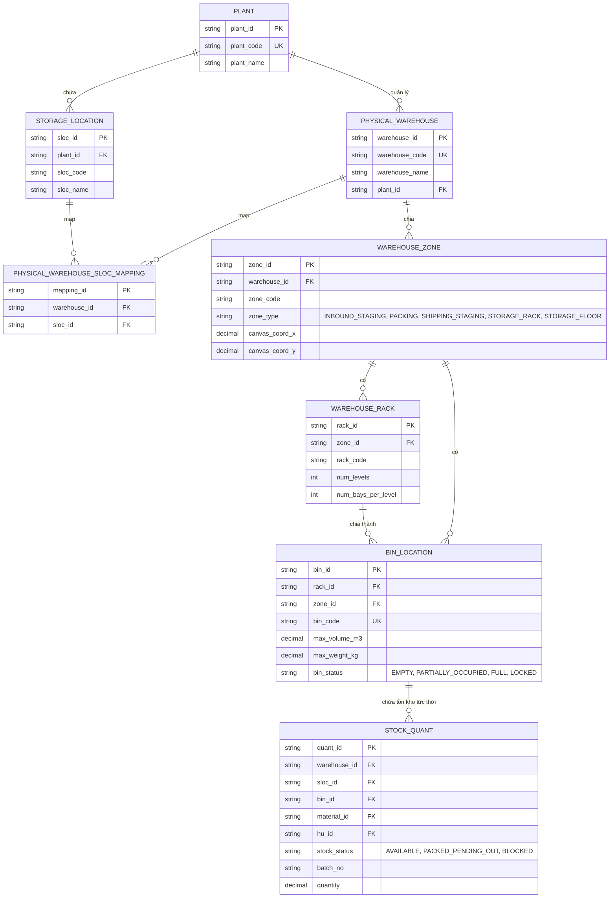
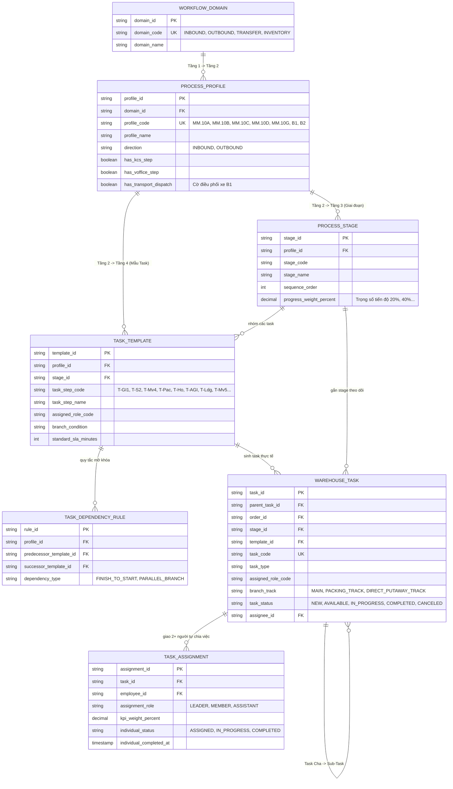
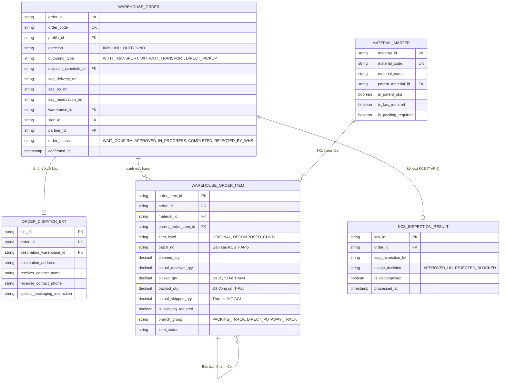
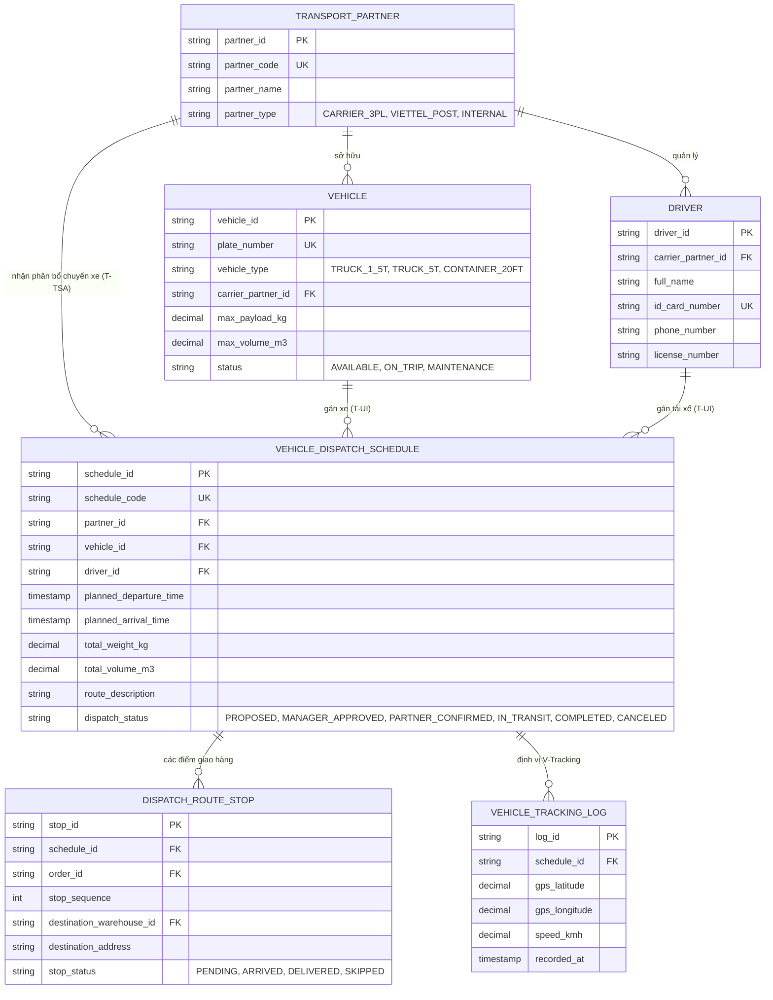
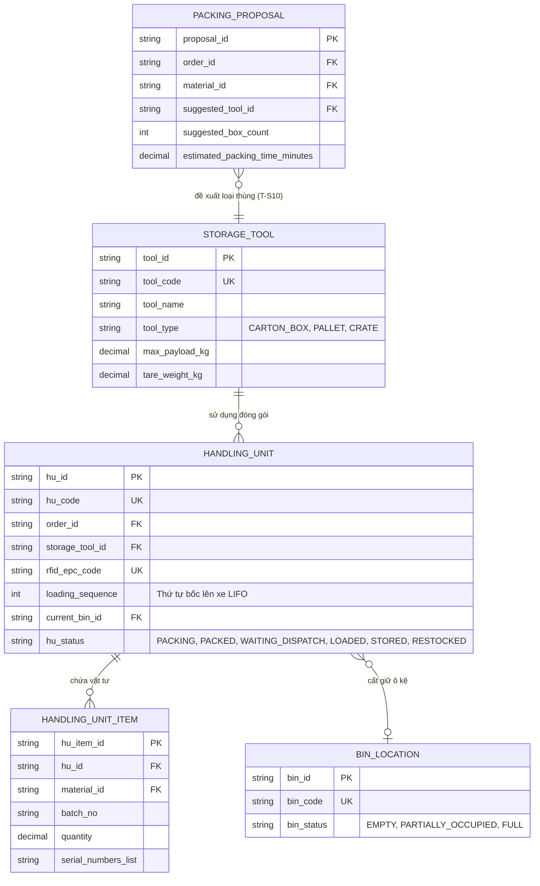
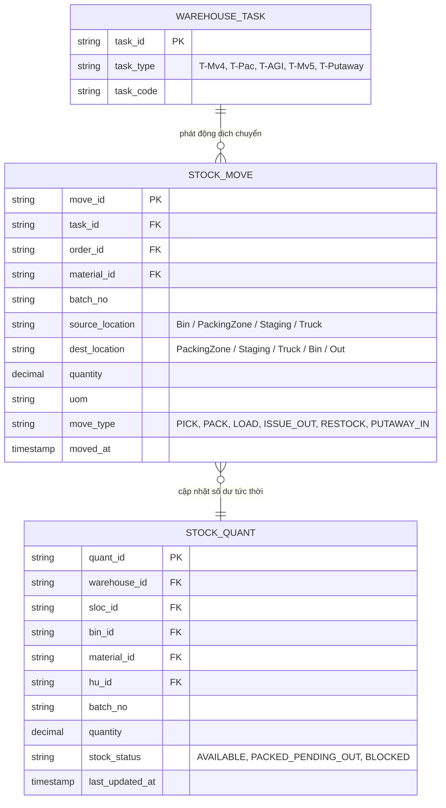
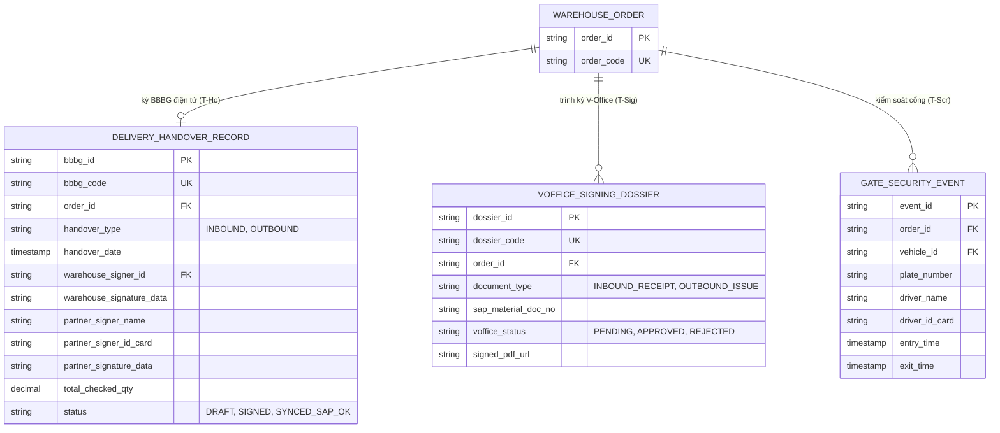

# THIẾT KẾ MÔ HÌNH DỮ LIỆU & TỪ ĐIỂN THỰC THỂ TOÀN DIỆN (DATA MODEL & ERD)
## Nền Tảng Kho Thông Minh AI-WMS (Inbound & Outbound Platform)

> **Căn cứ thiết kế:**
> - Master Context & Kiến trúc tổng thể (`AIWS_Project_Overview_And_Architecture.md`).
> - Bộ quy trình Nhập kho chuẩn SOP (`MM.10A`, `MM.10B`, `MM.10C`, `MM.10D`, `MM.10G`).
> - Bộ quy trình Xuất kho chuẩn SOP (`sIVN.10.4.2.B1` — Xuất có vận chuyển/TMS, `sIVN.10.4.2.B2` — Xuất kho khác/Tự nhận).
> - Sơ đồ quy trình tích hợp SAP × V-Office × AI-WS (`SAP_MM10_All_GR_Processes.drawio.xml`).
> - 6 Nguyên tắc thiết kế cốt lõi: Phân cấp 4 tầng quy trình, Bóc tách Mã Cha - Con gán Số Lô sau KCS, Bẻ luồng song song, Giao việc đa nhân sự (Grab-style), Điều phối vận tải thông minh (TMS/Slotting/V-Tracking), và Hội tụ Tồn kho Lõi Duy Nhất (Single Core Stock Ledger).

---

## MỤC LỤC TỔNG QUAN

- [PHẦN 1: SƠ ĐỒ MỐI QUAN HỆ THỰC THỂ (ER DIAGRAMS)](#phần-1-sơ-đồ-mối-quan-hệ-thực-thể-er-diagrams)
  - [1.1. Sơ đồ Quan hệ Tổng thể Hệ thống (Comprehensive Macro ERD)](#11-sơ-đồ-quan-hệ-tổng-thể-hệ-thống-comprehensive-macro-erd)
  - [1.2. Sơ đồ ERD Miền 1: Hạ Tầng Mặt Bằng Kho, Vị Trí Ô Kệ & Không Gian](#12-sơ-đồ-erd-miền-1-hạ-tầng-mặt-bằng-kho-vị-trí-ô-kệ--không-gian)
  - [1.3. Sơ đồ ERD Miền 2: Phân Cấp 4 Tầng Quy Trình & Điều Phối Task Bằng AI](#13-sơ-đồ-erd-miền-2-phân-cấp-4-tầng-quy-trình--điều-phối-task-bằng-ai)
  - [1.4. Sơ đồ ERD Miền 3: Lệnh Kho (Order), Bóc Tách Cha-Con & Gán Số Lô](#14-sơ-đồ-erd-miền-3-lệnh-kho-order-bóc-tách-cha-con--gán-số-lô)
  - [1.5. Sơ đồ ERD Miền 4: Điều Phối Vận Tải, Lịch Xe TMS & Định Vị V-Tracking](#15-sơ-đồ-erd-miền-4-điều-phối-vận-tải-lịch-xe-tms--định-vị-v-tracking)
  - [1.6. Sơ đồ ERD Miền 5: Đóng Gói Handling Unit (HU), RFID, Tải Hàng & Cất Kho](#16-sơ-đồ-erd-miền-5-đóng-gói-handling-unit-hu-rfid-tải-hàng--cất-kho)
  - [1.7. Sơ đồ ERD Miền 6: Sổ Cái Biến Động Tồn Kho Lõi (Single Stock Ledger Convergence)](#17-sơ-đồ-erd-miền-6-sổ-cái-biến-động-tồn-kho-lõi-single-stock-ledger-convergence)
  - [1.8. Sơ đồ ERD Miền 7: Chứng Từ Bàn Giao, Trình Ký V-Office & Tích Hợp 3 Bên](#18-sơ-đồ-erd-miền-7-chứng-từ-bàn-giao-trình-ký-v-office--tích-hợp-3-bên)
- [PHẦN 2: BẢNG TỔNG HỢP MA TRẬN 54 THỰC THỂ (SUMMARY MATRIX)](#phần-2-bảng-tổng-hợp-ma-trận-54-thực-thể-summary-matrix)
- [PHẦN 3: TỪ ĐIỂN DỮ LIỆU CHI TIẾT 54 THỰC THỂ (DATA DICTIONARY)](#phần-3-từ-điển-dữ-liệu-chi-tiết-54-thực-thể-data-dictionary)
  - [NHÓM 1: MASTER DATA VẬN HÀNH KHO & MẶT BẰNG (10 Thực thể)](#nhóm-1-master-data-vận-hành-kho--mặt-bằng-10-thực-thể)
  - [NHÓM 2: DANH MỤC DÙNG CHUNG, VẬT TƯ & ĐỐI TÁC (9 Thực thể)](#nhóm-2-danh-mục-dùng-chung-vật-tư--đối-tác-9-thực-thể)
  - [NHÓM 3: CATALOG QUY TRÌNH & ĐIỀU PHỐI TASK BẰNG AI (5 Thực thể)](#nhóm-3-catalog-quy-trình--điều-phối-task-bằng-ai-5-thực-thể)
  - [NHÓM 4: VẬN HÀNH LỆNH & THỰC THI TASK (11 Thực thể)](#nhóm-4-vận-hành-lệnh--thực-thi-task-11-thực-thể)
  - [NHÓM 5: ĐIỀU PHỐI VẬN TẢI TMS, LỊCH XE & AN NINH CỔNG (6 Thực thể)](#nhóm-5-điều-phối-vận-tải-tms-lịch-xe--an-ninh-cổng-6-thực-thể)
  - [NHÓM 6: ĐÓNG GÓI, RFID & HANDLING UNIT (3 Thực thể)](#nhóm-6-đóng-gói-rfid--handling-unit-3-thực-thể)
  - [NHÓM 7: SỔ CÁI TỒN KHO LÕI (CORE STOCK LEDGER) (2 Thực thể)](#nhóm-7-sổ-cái-tồn-kho-lõi-core-stock-ledger-2-thực-thể)
  - [NHÓM 8: CHỨNG TỪ, BIÊN BẢN, KÝ DUYỆT & KCS (4 Thực thể)](#nhóm-8-chứng-từ-biên-bản-ký-duyệt--kcs-4-thực-thể)
  - [NHÓM 9: DASHBOARD, GIÁM SÁT SLA & CẢNH BÁO (3 Thực thể)](#nhóm-9-dashboard-giám-sát-sla--cảnh-báo-3-thực-thể)
  - [NHÓM 10: QUẢN TRỊ HỆ THỐNG & PHÂN QUYỀN (1 Thực thể)](#nhóm-10-quản-trị-hệ-thống--phân-quyền-1-thực-thể)

---

# PHẦN 1: SƠ ĐỒ MỐI QUAN HỆ THỰC THỂ (ER DIAGRAMS)

## 1.1. Sơ đồ Quan hệ Tổng thể Hệ thống (Comprehensive Macro ERD)

```mermaid
erDiagram
    %% MIỀN 1: MASTER DATA HẠ TẦNG KHO & MẶT BẰNG
    PLANT ||--o{ STORAGE_LOCATION : "chứa (1-n)"
    PLANT ||--o{ PHYSICAL_WAREHOUSE : "quản lý (1-n)"
    PHYSICAL_WAREHOUSE ||--o{ PHYSICAL_WAREHOUSE_SLOC_MAPPING : "ánh xạ"
    STORAGE_LOCATION ||--o{ PHYSICAL_WAREHOUSE_SLOC_MAPPING : "thuộc"
    PHYSICAL_WAREHOUSE ||--o{ WAREHOUSE_ZONE : "chia thành phân khu"
    PHYSICAL_WAREHOUSE ||--o{ WAREHOUSE_DOCK : "có cửa xuất/nhập"
    PHYSICAL_WAREHOUSE ||--o{ WAREHOUSE_AISLE : "có lối đi"
    WAREHOUSE_ZONE ||--o{ WAREHOUSE_RACK : "chứa dãy kệ"
    WAREHOUSE_ZONE ||--o{ BIN_LOCATION : "chứa ô vị trí"
    WAREHOUSE_RACK ||--o{ BIN_LOCATION : "chia thành tầng/khoang"
    WAREHOUSE_ZONE ||--o{ STORAGE_AREA_PALLET_BLOCK : "khu bãi sàn"

    %% MIỀN 2: DANH MỤC DÙNG CHUNG, NHÂN SỰ & PHÂN QUYỀN
    EMPLOYEE }o--o{ ROLE : "gán qua Employee_Role"
    EMPLOYEE ||--o{ EMPLOYEE_ROLE : "có"
    ROLE ||--o{ EMPLOYEE_ROLE : "thuộc"
    ROLE ||--o{ ROLE_PERMISSION : "có quyền"
    EMPLOYEE ||--o| PHYSICAL_WAREHOUSE : "làm việc tại"
    EMPLOYEE ||--o| USER_ACCOUNT : "tài khoản NV"
    PARTNER ||--o| USER_ACCOUNT : "tài khoản đối tác"
    PARTNER ||--o{ VEHICLE : "sở hữu xe"
    PARTNER ||--o{ DRIVER : "quản lý tài xế"

    %% MIỀN 3: PHÂN CẤP QUY TRÌNH 4 TẦNG & TASK CATALOG
    WORKFLOW_DOMAIN ||--o{ PROCESS_PROFILE : "Tầng 1 -> Tầng 2 (Domain -> Process)"
    PROCESS_PROFILE ||--o{ PROCESS_STAGE : "Tầng 2 -> Tầng 3 (Giai đoạn Dashboard %)"
    PROCESS_PROFILE ||--o{ TASK_TEMPLATE : "Tầng 2 -> Tầng 4 (Mẫu Task tác nghiệp)"
    PROCESS_STAGE ||--o{ TASK_TEMPLATE : "nhóm các task"
    TASK_TEMPLATE ||--o{ TASK_DEPENDENCY_RULE : "quy tắc tiền đề"
    TASK_TEMPLATE }o--|| ROLE : "chỉ định Role thực hiện"
    PROCESS_PROFILE ||--o{ KPI_CONFIG : "cấu hình SLA"

    %% MIỀN 4: VẬT TƯ, MÃ CHA - CON & ĐỊNH MỨC BOM
    MATERIAL_MASTER ||--o{ MATERIAL_MASTER : "Mã Cha -> Mã Con"
    MATERIAL_MASTER ||--o{ MATERIAL_BOM_STRUCTURE : "BOM Cha"
    MATERIAL_MASTER ||--o{ MATERIAL_BOM_STRUCTURE : "BOM Con"

    %% MIỀN 5: LỆNH (ORDER) & THỰC THI TASK TÁC NGHIỆP
    WAREHOUSE_ORDER }o--|| PROCESS_PROFILE : "áp dụng quy trình"
    WAREHOUSE_ORDER }o--|| PHYSICAL_WAREHOUSE : "tiếp nhận/xuất tại"
    WAREHOUSE_ORDER }o--|| STORAGE_LOCATION : "hạch toán SLoc"
    WAREHOUSE_ORDER }o--|| PARTNER : "giao/nhận từ"
    WAREHOUSE_ORDER ||--o| ORDER_SUPPLIER_EXT : "mở rộng Nhập NCC (MM.10A)"
    WAREHOUSE_ORDER ||--o| ORDER_CONSTRUCTION_EXT : "mở rộng Thu hồi (MM.10B/C)"
    WAREHOUSE_ORDER ||--o| ORDER_DISPATCH_EXT : "mở rộng Xuất kho (B1/B2)"
    WAREHOUSE_ORDER ||--o{ WAREHOUSE_ORDER_ITEM : "gồm các dòng hàng"
    WAREHOUSE_ORDER_ITEM }o--|| MATERIAL_MASTER : "là SKU"
    WAREHOUSE_ORDER_ITEM ||--o{ WAREHOUSE_ORDER_ITEM : "Dòng Cha -> Dòng Con (KCS)"
    
    WAREHOUSE_ORDER ||--o{ WAREHOUSE_TASK : "sinh chuỗi task"
    WAREHOUSE_TASK }o--|| TASK_TEMPLATE : "theo mẫu"
    WAREHOUSE_TASK }o--|| PROCESS_STAGE : "thuộc stage"
    WAREHOUSE_TASK ||--o{ WAREHOUSE_TASK : "Task Cha -> Sub-Task"
    WAREHOUSE_TASK ||--o{ TASK_ASSIGNMENT : "phân công 2+ người"
    EMPLOYEE ||--o{ TASK_ASSIGNMENT : "tham gia làm"
    WAREHOUSE_TASK ||--o{ TASK_ITEM_DETAIL : "chỉ định hàng xử lý"
    WAREHOUSE_ORDER_ITEM ||--o{ TASK_ITEM_DETAIL : "phân bổ vào task"
    WAREHOUSE_TASK ||--o{ TASK_EVIDENCE : "bằng chứng ảnh/mã"
    WAREHOUSE_TASK ||--o{ TASK_SLA_EXTENSION : "xin gia hạn KPI (T-S16)"

    %% MIỀN 6: ĐIỀU PHỐI VẬN TẢI TMS, LỊCH XE & AN NINH
    VEHICLE_DISPATCH_SCHEDULE }o--|| PARTNER : "đối tác vận tải"
    VEHICLE_DISPATCH_SCHEDULE }o--|| VEHICLE : "phương tiện"
    VEHICLE_DISPATCH_SCHEDULE }o--|| DRIVER : "tài xế"
    VEHICLE_DISPATCH_SCHEDULE ||--o{ DISPATCH_ROUTE_STOP : "các điểm dừng dỡ"
    VEHICLE_DISPATCH_SCHEDULE ||--o{ VEHICLE_TRACKING_LOG : "nhật ký GPS"
    WAREHOUSE_ORDER }o--o| VEHICLE_DISPATCH_SCHEDULE : "gán chuyến xe (B1)"
    
    WAREHOUSE_ORDER ||--o| DELIVERY_SCHEDULE_SLOT : "hẹn giờ cập bến"
    DELIVERY_SCHEDULE_SLOT }o--|| WAREHOUSE_DOCK : "tại cửa Dock"
    WAREHOUSE_ORDER ||--o{ GATE_SECURITY_EVENT : "sự kiện vào/ra cổng (T-Scr)"
    GATE_SECURITY_EVENT }o--|| VEHICLE : "biển số xe"
    GATE_SECURITY_EVENT }o--|| DRIVER : "tài xế"

    %% MIỀN 7: ĐÓNG GÓI, RFID, HANDLING UNIT & TỒN KHO LÕI
    WAREHOUSE_ORDER ||--o{ PACKING_PROPOSAL : "AI đề xuất đóng gói (T-S10)"
    WAREHOUSE_ORDER ||--o{ HANDLING_UNIT : "sinh kiện đóng gói (T-Pac)"
    STORAGE_TOOL ||--o{ HANDLING_UNIT : "sử dụng vỏ thùng/pallet"
    HANDLING_UNIT ||--o{ HANDLING_UNIT_ITEM : "chứa chi tiết vật tư"
    MATERIAL_MASTER ||--o{ HANDLING_UNIT_ITEM : "SKU trong kiện"
    HANDLING_UNIT }o--|| BIN_LOCATION : "cất tại ô kệ"

    %% SỔ CÁI TỒN KHO LÕI (CORE STOCK LEDGER)
    WAREHOUSE_TASK ||--o{ STOCK_MOVE : "phát động dịch chuyển"
    STOCK_MOVE }o--|| MATERIAL_MASTER : "vật tư dịch chuyển"
    STOCK_MOVE }o--|| PHYSICAL_WAREHOUSE : "tại kho"
    STOCK_MOVE }o--|| STORAGE_LOCATION : "tại SLoc"
    STOCK_MOVE }o--o| BIN_LOCATION : "từ Bin"
    STOCK_MOVE }o--o| BIN_LOCATION : "đến Bin"
    
    STOCK_QUANT }o--|| PHYSICAL_WAREHOUSE : "tồn tại kho"
    STOCK_QUANT }o--|| STORAGE_LOCATION : "tồn tại SLoc"
    STOCK_QUANT }o--|| BIN_LOCATION : "tồn tại ô vị trí"
    STOCK_QUANT }o--|| MATERIAL_MASTER : "tồn SKU"
    STOCK_QUANT }o--o| HANDLING_UNIT : "trong kiện (nếu có)"

    %% MIỀN 8: CHỨNG TỪ, KÝ DUYỆT & KCS
    WAREHOUSE_ORDER ||--o| DELIVERY_HANDOVER_RECORD : "ký BBBG điện tử (T-Ho)"
    WAREHOUSE_ORDER ||--o{ VOFFICE_SIGNING_DOSSIER : "trình ký phiếu nhập/xuất (T-Sig)"
    SIGNATURE_TEMPLATE ||--o{ VOFFICE_SIGNING_DOSSIER : "theo luồng mẫu"
    WAREHOUSE_ORDER ||--o| KCS_INSPECTION_RESULT : "kết quả KCS SAP (T-API5)"
    
    %% MIỀN 9: LOG HỆ THỐNG & CẢNH BÁO
    WAREHOUSE_ORDER ||--o{ SYSTEM_INTEGRATION_LOG : "lịch sử API (T-API1..5)"
    WAREHOUSE_TASK ||--o{ SLA_ALERT_LOG : "cảnh báo quá hạn (T-S11/S12)"
    EMPLOYEE ||--o{ USER_NOTIFICATION : "nhận thông báo push"
    USER_ACCOUNT ||--o{ SYSTEM_AUDIT_LOG : "thao tác audit log"
```

---

## 1.2. Sơ đồ ERD Miền 1: Hạ Tầng Mặt Bằng Kho, Vị Trí Ô Kệ & Không Gian

---

## 1.3. Sơ đồ ERD Miền 2: Phân Cấp 4 Tầng Quy Trình & Điều Phối Task Bằng AI

---

## 1.4. Sơ đồ ERD Miền 3: Lệnh Kho (Order), Bóc Tách Cha-Con & Gán Số Lô

---

## 1.5. Sơ đồ ERD Miền 4: Điều Phối Vận Tải, Lịch Xe TMS & Định Vị V-Tracking

---

## 1.6. Sơ đồ ERD Miền 5: Đóng Gói Handling Unit (HU), RFID, Tải Hàng & Cất Kho

---

## 1.7. Sơ đồ ERD Miền 6: Sổ Cái Biến Động Tồn Kho Lõi (Single Stock Ledger Convergence)

---

## 1.8. Sơ đồ ERD Miền 7: Chứng Từ Bàn Giao, Trình Ký V-Office & Tích Hợp 3 Bên

---

# PHẦN 2: BẢNG TỔNG HỢP MA TRẬN 54 THỰC THỂ (SUMMARY MATRIX)

| STT | Tên Thực Thể (Entity Name) | Tên Bảng Kỹ Thuật (Table Name) | Nhóm Phân Loại | Vai Trò & Nghiệp Vụ Cốt Lõi |
|:---:|---|---|---|---|
| **1** | Plant | `plant` | 1. Hạ tầng mặt bằng | Chi nhánh / Trung tâm mạng lưới Viettel |
| **2** | Storage_Location | `storage_location` | 1. Hạ tầng mặt bằng | Kho logic hạch toán kế toán SAP (SLoc) |
| **3** | Physical_Warehouse | `physical_warehouse` | 1. Hạ tầng mặt bằng | Kho vật lý thực tế tại địa bàn |
| **4** | Physical_Warehouse_SLoc_Mapping | `warehouse_sloc_mapping` | 1. Hạ tầng mặt bằng | Ánh xạ giữa kho vật lý và các SLoc logic |
| **5** | Warehouse_Zone | `warehouse_zone` | 1. Hạ tầng mặt bằng | Phân khu chức năng (Staging, Packing, Rack, Floor, Dock) |
| **6** | Warehouse_Rack | `warehouse_rack` | 1. Hạ tầng mặt bằng | Dãy giá kệ nhiều tầng/nhiều khoang |
| **7** | Bin_Location | `bin_location` | 1. Hạ tầng mặt bằng | Tọa độ ô vị trí lưu trữ chi tiết (Bin Code) |
| **8** | Storage_Area_Pallet_Block | `pallet_block` | 1. Hạ tầng mặt bằng | Phân khu lưu trữ sàn/thùng gỗ không dùng kệ |
| **9** | Warehouse_Aisle | `warehouse_aisle` | 1. Hạ tầng mặt bằng | Lối đi giao thông phục vụ routing xe nâng |
| **10**| Warehouse_Dock | `warehouse_dock` | 1. Hạ tầng mặt bằng | Cửa xuất/nhập hàng cập bến xe tải |
| **11**| Employee | `employee` | 2. Danh mục dùng chung | Nhân sự vận hành kho (Thủ kho, NVK, Lái xe nâng, Bảo vệ) |
| **12**| Role | `role` | 2. Danh mục dùng chung | Danh mục vai trò thực thi (RBAC) |
| **13**| Employee_Role | `employee_role` | 2. Danh mục dùng chung | Bảng trung gian gán vai trò cho nhân sự |
| **14**| Material_Master | `material` | 2. Danh mục dùng chung | Danh mục vật tư SKU, hỗ trợ phân cấp Cha - Con |
| **15**| Material_BOM_Structure | `material_bom` | 2. Danh mục dùng chung | Định mức phân rã bóc tách từ Mã Cha ra Mã Con |
| **16**| Partner | `partner` | 2. Danh mục dùng chung | Nhà cung cấp, Đơn vị vận chuyển, Đơn vị nhận hàng |
| **17**| Storage_Tool | `storage_tool` | 2. Danh mục dùng chung | Danh mục công cụ lưu trữ (Thùng carton, Pallet, Khay) |
| **18**| KPI_Config | `kpi_config` | 2. Danh mục dùng chung | Cấu hình SLA chuẩn cho từng bước quy trình |
| **19**| Signature_Template | `signature_template` | 2. Danh mục dùng chung | Mẫu chân ký luồng trình duyệt V-Office |
| **20**| Workflow_Domain | `workflow_domain` | 3. Catalog quy trình | Tầng 1: Phân hệ lớn (`INBOUND`, `OUTBOUND`, `TRANSFER`, `INVENTORY`) |
| **21**| Process_Profile | `process_catalog` | 3. Catalog quy trình | Tầng 2: Loại quy trình (`MM.10A`, `MM.10B`, `B1`, `B2`...) |
| **22**| Process_Stage | `process_stage` | 3. Catalog quy trình | Tầng 3: Giai đoạn trạm theo dõi % Dashboard |
| **23**| Task_Template | `process_task_template` | 3. Catalog quy trình | Tầng 4: Mẫu task chuẩn tác nghiệp |
| **24**| Task_Dependency_Rule | `task_dependency_rule` | 3. Catalog quy trình | Quy tắc tiền đề mở khóa task liên hoàn/song song |
| **25**| Warehouse_Order | `order` | 4. Vận hành Lệnh & Task | Lệnh kho tổng thể (Inbound / Outbound Header) |
| **26**| Order_Supplier_Ext | `order_supplier_ext` | 4. Vận hành Lệnh & Task | Mở rộng thông tin đơn hàng Nhập NCC (`MM.10A`) |
| **27**| Order_Construction_Ext | `order_construction_ext` | 4. Vận hành Lệnh & Task | Mở rộng thông tin đơn Thu hồi công trình (`MM.10B/C`) |
| **28**| Order_Dispatch_Ext | `order_dispatch_ext` | 4. Vận hành Lệnh & Task | **Mới:** Mở rộng tuyến giao/điểm nhận hàng Xuất kho (`B1/B2`) |
| **29**| Warehouse_Order_Item | `order_product` | 4. Vận hành Lệnh & Task | Dòng hàng SKU trong đơn hàng (Kế hoạch vs Thực tế) |
| **30**| Order_Product_Component | `order_product_component` | 4. Vận hành Lệnh & Task | Chi tiết mã con, Số Lô sau KCS, Cờ bẻ luồng đóng gói |
| **31**| Warehouse_Task | `task` | 4. Vận hành Lệnh & Task | Task thực thi tác nghiệp (Picking, Packing, BBBG, Putaway...) |
| **32**| Task_Assignment | `task_assignment` | 4. Vận hành Lệnh & Task | Phân công đa nhân sự (2+ người cùng làm dỡ hàng/kiểm kê) |
| **33**| Task_Item_Detail | `task_item_detail` | 4. Vận hành Lệnh & Task | Chi tiết hàng hóa phân bổ cho từng Task riêng biệt |
| **34**| Task_Evidence | `task_evidence` | 4. Vận hành Lệnh & Task | Bằng chứng ảnh hiện trường, mã quét Barcode/RFID |
| **35**| Task_SLA_Extension | `task_sla_extension` | 4. Vận hành Lệnh & Task | Xin gia hạn KPI (`T-S16` trong ngày hoặc sang ngày sau) |
| **36**| Vehicle | `vehicle` | 5. Điều phối vận tải TMS | Danh mục phương tiện vận tải (Biển số, tải trọng, thể tích) |
| **37**| Driver | `driver` | 5. Điều phối vận tải TMS | **Mới:** Danh mục tài xế lái xe (Họ tên, CCCD, bằng lái, SĐT) |
| **38**| Vehicle_Dispatch_Schedule | `vehicle_dispatch_schedule`| 5. Điều phối vận tải TMS | **Mới:** Lịch xe / Chuyến xe vận chuyển tối ưu (`T-S2/VDA/TSA/UI`) |
| **39**| Dispatch_Route_Stop | `dispatch_route_stop` | 5. Điều phối vận tải TMS | **Mới:** Các điểm dừng dỡ hàng trên cùng chuyến xe |
| **40**| Vehicle_Tracking_Log | `vehicle_tracking_log` | 5. Điều phối vận tải TMS | **Mới:** Nhật ký định vị GPS / V-Tracking theo thời gian thực |
| **41**| Delivery_Schedule_Slot | `delivery_schedule_slot` | 5. Điều phối vận tải TMS | Lịch hẹn xe cập bến cửa Dock (Slotting) |
| **42**| Gate_Security_Event | `gate_security_event` | 5. Điều phối vận tải TMS | Nhật ký an ninh cổng xe vào/ra (`T-Scr Check-in/out`) |
| **43**| Packing_Proposal | `packing_proposal` | 6. Đóng gói & HU | **Mới:** Đề xuất phương án đóng gói tối ưu do AI tính (`T-S10`) |
| **44**| Handling_Unit | `handling_unit` | 6. Đóng gói & HU | Kiện hàng / Pallet đóng gói mang mã thẻ RFID (`T-Pac`) |
| **45**| Handling_Unit_Item | `handling_unit_item` | 6. Đóng gói & HU | Danh mục vật tư con chi tiết chứa trong kiện HU |
| **46**| Stock_Move | `stock_move` | 7. Sổ cái tồn kho lõi | **Mới:** Sổ cái biến động kho (Pick, Pack, Load, Issue, Restock) |
| **47**| Stock_Quant | `stock_quant` | 7. Sổ cái tồn kho lõi | Số dư tồn kho lõi tức thời theo Kho, SLoc, Bin, SKU, Lô |
| **48**| Delivery_Handover_Record | `bbbg` | 8. Chứng từ & Ký duyệt | Biên bản bàn giao điện tử có chữ ký 2 bên (`T-Ho`) |
| **49**| VOffice_Signing_Dossier | `voffice_signing_dossier`| 8. Chứng từ & Ký duyệt | Hồ sơ trình ký V-Office Phiếu nhập/xuất kho (`T-Sig`) |
| **50**| KCS_Inspection_Result | `kcs_inspection_result` | 8. Chứng từ & Ký duyệt | Kết quả kiểm định KCS và bóc tách Cha-Con (`T-API5`) |
| **51**| System_Integration_Log | `system_integration_log` | 9. Dashboard & SLA | Nhật ký gọi API 2 chiều (`T-API1..5`, V-Office, GPS) |
| **52**| SLA_Alert_Log | `sla_alert_log` | 9. Dashboard & SLA | Cảnh báo vi phạm ngưỡng SLA/KPI (`T-S11`, `T-S12`) |
| **53**| User_Notification | `user_notification` | 9. Dashboard & SLA | Thông báo đẩy (Push Notification) gửi App mobile |
| **54**| User_Account | `user_account` | 10. Quản trị hệ thống | Tài khoản đăng nhập hệ thống cho NV và Đối tác |

---

# PHẦN 3: TỪ ĐIỂN DỮ LIỆU CHI TIẾT 54 THỰC THỂ (DATA DICTIONARY)

## NHÓM 1: MASTER DATA VẬN HÀNH KHO & MẶT BẰNG (10 Thực thể)

### 1. Thực thể `Plant` (Chi Nhánh / Trung Tâm Mạng Lưới)
| Tên trường | Kiểu dữ liệu | Ràng buộc | Mô tả |
|---|---|---|---|
| `plant_id` | VARCHAR(50) | PK, NOT NULL | ID định danh Plant |
| `plant_code` | VARCHAR(50) | UNIQUE, NOT NULL | Mã Plant trên SAP (VD: `V011`, `V012`, `V101`) |
| `plant_name` | VARCHAR(255) | NOT NULL | Tên chi nhánh / đơn vị |
| `address` | VARCHAR(500) | NULL | Địa chỉ địa lý |
| `is_active` | BOOLEAN | NOT NULL, DEFAULT true | Trạng thái hoạt động |

### 2. Thực thể `Storage_Location` (Kho Logic Kế Toán - SLoc)
| Tên trường | Kiểu dữ liệu | Ràng buộc | Mô tả |
|---|---|---|---|
| `sloc_id` | VARCHAR(50) | PK, NOT NULL | ID định danh SLoc |
| `plant_id` | VARCHAR(50) | FK -> `Plant.plant_id`, NOT NULL | Thuộc Plant nào |
| `sloc_code` | VARCHAR(50) | NOT NULL | Mã SLoc trên SAP (VD: `1000`, `2000`, `NV01`) |
| `sloc_name` | VARCHAR(255) | NOT NULL | Tên kho logic kế toán |
| `sloc_type` | VARCHAR(50) | NOT NULL, DEFAULT 'STANDARD' | `STANDARD`, `VALUATED`, `NON_VALUATED`, `TRANSIT` |
| `is_active` | BOOLEAN | NOT NULL, DEFAULT true | Trạng thái hiệu lực |

### 3. Thực thể `Physical_Warehouse` (Kho Vật Lý Thực Tế)
| Tên trường | Kiểu dữ liệu | Ràng buộc | Mô tả |
|---|---|---|---|
| `warehouse_id` | VARCHAR(50) | PK, NOT NULL | ID định danh kho vật lý |
| `warehouse_code` | VARCHAR(50) | UNIQUE, NOT NULL | Mã kho thực tế (VD: `WH_DANANG_01`) |
| `warehouse_name` | VARCHAR(255) | NOT NULL | Tên kho vật lý |
| `plant_id` | VARCHAR(50) | FK -> `Plant.plant_id`, NOT NULL | Trực thuộc Plant nào |
| `total_area_m2` | DECIMAL(10,2)| NOT NULL | Tổng diện tích sàn ($m^2$) |
| `max_capacity_m3`| DECIMAL(12,2)| NOT NULL | Dung tích chứa tối đa ($m^3$) |
| `address` | VARCHAR(500) | NOT NULL | Địa chỉ kho |
| `latitude` | DECIMAL(10,7)| NULL | Tọa độ GPS Vĩ độ |
| `longitude` | DECIMAL(10,7)| NULL | Tọa độ GPS Kinh độ |
| `is_active` | BOOLEAN | NOT NULL, DEFAULT true | Trạng thái hoạt động |

### 4. Thực thể `Physical_Warehouse_SLoc_Mapping` (Ánh Xạ Kho Vật Lý & SLoc)
| Tên trường | Kiểu dữ liệu | Ràng buộc | Mô tả |
|---|---|---|---|
| `mapping_id` | VARCHAR(50) | PK, NOT NULL | ID bản ghi ánh xạ |
| `warehouse_id` | VARCHAR(50) | FK -> `Physical_Warehouse.warehouse_id`, NOT NULL | Kho vật lý |
| `sloc_id` | VARCHAR(50) | FK -> `Storage_Location.sloc_id`, NOT NULL | Kho logic |
| `is_default` | BOOLEAN | NOT NULL, DEFAULT false | SLoc mặc định của kho |

### 5. Thực thể `Warehouse_Zone` (Phân Khu Chức Năng Trong Kho)
| Tên trường | Kiểu dữ liệu | Ràng buộc | Mô tả |
|---|---|---|---|
| `zone_id` | VARCHAR(50) | PK, NOT NULL | ID phân khu |
| `warehouse_id` | VARCHAR(50) | FK -> `Physical_Warehouse.warehouse_id`, NOT NULL | Thuộc kho nào |
| `zone_code` | VARCHAR(50) | NOT NULL | Mã phân khu (VD: `INB_STG_01`, `PACK_ZONE_A`, `RACK_G01`) |
| `zone_name` | VARCHAR(255) | NOT NULL | Tên hiển thị phân khu |
| `zone_type` | VARCHAR(50) | NOT NULL | `INBOUND_STAGING`, `WAITING_INBOUND`, `PACKING`, `STORAGE_RACK`, `STORAGE_FLOOR`, `SHIPPING_STAGING`, `LOADING_DOCK`, `AISLE` |
| `canvas_coord_x`| DECIMAL(10,2)| NOT NULL | Tọa độ X trên Canvas 2D |
| `canvas_coord_y`| DECIMAL(10,2)| NOT NULL | Tọa độ Y trên Canvas 2D |
| `width_m` | DECIMAL(10,2)| NOT NULL | Chiều rộng (m) |
| `length_m` | DECIMAL(10,2)| NOT NULL | Chiều dài (m) |
| `height_m` | DECIMAL(10,2)| NULL | Chiều cao trần (m) |
| `is_temperature_controlled` | BOOLEAN | DEFAULT false | Cờ kho lạnh/kiểm soát nhiệt độ |
| `status` | VARCHAR(30) | NOT NULL, DEFAULT 'ACTIVE' | `ACTIVE`, `INACTIVE` |

### 6. Thực thể `Warehouse_Rack` (Dãy Kệ Lưu Trữ)
| Tên trường | Kiểu dữ liệu | Ràng buộc | Mô tả |
|---|---|---|---|
| `rack_id` | VARCHAR(50) | PK, NOT NULL | ID định danh dãy kệ |
| `zone_id` | VARCHAR(50) | FK -> `Warehouse_Zone.zone_id`, NOT NULL | Thuộc phân khu lưu trữ nào |
| `rack_code` | VARCHAR(50) | NOT NULL | Mã dãy kệ (VD: `G01_R01`, `G01_R02`) |
| `rack_name` | VARCHAR(255) | NOT NULL | Tên hiển thị dãy kệ |
| `num_levels` | INT | NOT NULL | Số tầng của kệ (VD: 4 tầng) |
| `num_bays_per_level` | INT | NOT NULL | Số khoang (Bay) trên mỗi tầng |
| `max_weight_capacity_kg` | DECIMAL(10,2) | NOT NULL | Tải trọng tối đa cho phép của dãy kệ (kg) |
| `canvas_coord_x`| DECIMAL(10,2)| NOT NULL | Tọa độ đặt trên Canvas |
| `canvas_coord_y`| DECIMAL(10,2)| NOT NULL | Tọa độ đặt trên Canvas |
| `orientation_deg`| DECIMAL(5,2) | DEFAULT 0 | Góc xoay hướng kệ ($0^\circ, 90^\circ...$) |

### 7. Thực thể `Bin_Location` (Vị Trí Ô Kệ Lưu Trữ - Bin Code)
| Tên trường | Kiểu dữ liệu | Ràng buộc | Mô tả |
|---|---|---|---|
| `bin_id` | VARCHAR(50) | PK, NOT NULL | ID định danh ô kệ |
| `rack_id` | VARCHAR(50) | FK -> `Warehouse_Rack.rack_id`, NULL | Thuộc dãy kệ nào (NULL nếu là ô mặt sàn) |
| `zone_id` | VARCHAR(50) | FK -> `Warehouse_Zone.zone_id`, NOT NULL | Thuộc phân khu nào |
| `bin_code` | VARCHAR(100)| UNIQUE, NOT NULL | Mã vạch ô vị trí (VD: `G01_KN1.1.1`, `FLOOR_A1`) |
| `level_index` | INT | NULL | Tầng số mấy (1, 2, 3...) |
| `bay_index` | INT | NULL | Khoang số mấy |
| `max_volume_m3` | DECIMAL(10,3)| NOT NULL | Thể tích tối đa của ô ($m^3$) |
| `max_weight_kg` | DECIMAL(10,2)| NOT NULL | Tải trọng tối đa của ô (kg) |
| `current_occupied_volume_m3` | DECIMAL(10,3)| DEFAULT 0 | Thể tích đang sử dụng |
| `current_occupied_weight_kg` | DECIMAL(10,2)| DEFAULT 0 | Tải trọng đang sử dụng |
| `bin_status` | VARCHAR(30) | NOT NULL | `EMPTY` (Trống), `PARTIALLY_OCCUPIED` (Có chứa 1 phần), `FULL` (Đầy), `LOCKED` (Khóa bảo trì) |
| `is_restricted` | BOOLEAN | DEFAULT false | Ô dành riêng cho hàng đặc thù / KCS Blocked |

### 8. Thực thể `Storage_Area_Pallet_Block` (Khu Lưu Trữ Sàn / Pallet Block)
| Tên trường | Kiểu dữ liệu | Ràng buộc | Mô tả |
|---|---|---|---|
| `block_id` | VARCHAR(50) | PK, NOT NULL | ID khối lưu trữ sàn |
| `zone_id` | VARCHAR(50) | FK -> `Warehouse_Zone.zone_id`, NOT NULL | Thuộc phân khu nào |
| `block_code` | VARCHAR(50) | NOT NULL | Mã khối (VD: `PALLET_BLK_01`, `WOOD_BOX_A`) |
| `storage_type` | VARCHAR(50) | NOT NULL | `PALLET_GROUND`, `WOOD_CONTAINER_ROW` |
| `max_stack_layers` | INT | NOT NULL, DEFAULT 1 | Số tầng chồng tối đa cho phép |
| `max_capacity_units` | INT | NOT NULL | Số lượng pallet/thùng tối đa chứa được |

### 9. Thực thể `Warehouse_Aisle` (Đường Giao Thông / Lối Đi Trong Kho)
| Tên trường | Kiểu dữ liệu | Ràng buộc | Mô tả |
|---|---|---|---|
| `aisle_id` | VARCHAR(50) | PK, NOT NULL | ID định danh lối đi |
| `warehouse_id` | VARCHAR(50) | FK -> `Physical_Warehouse.warehouse_id`, NOT NULL | Thuộc kho nào |
| `aisle_code` | VARCHAR(50) | NOT NULL | Mã lối đi (VD: `AISLE_MAIN_01`) |
| `direction_type` | VARCHAR(30) | NOT NULL | `ONE_WAY` (Một chiều), `TWO_WAY` (Hai chiều) |
| `width_m` | DECIMAL(6,2)| NOT NULL | Độ rộng lối đi (m) (kiểm tra xe nâng lọt qua) |
| `start_coord_x` | DECIMAL(10,2)| NOT NULL | Tọa độ điểm đầu |
| `start_coord_y` | DECIMAL(10,2)| NOT NULL | Tọa độ điểm đầu |
| `end_coord_x` | DECIMAL(10,2)| NOT NULL | Tọa độ điểm cuối |
| `end_coord_y` | DECIMAL(10,2)| NOT NULL | Tọa độ điểm cuối |

### 10. Thực thể `Warehouse_Dock` (Cửa Nhập / Cửa Xuất Hàng)
| Tên trường | Kiểu dữ liệu | Ràng buộc | Mô tả |
|---|---|---|---|
| `dock_id` | VARCHAR(50) | PK, NOT NULL | ID cửa Dock |
| `warehouse_id` | VARCHAR(50) | FK -> `Physical_Warehouse.warehouse_id`, NOT NULL | Thuộc kho nào |
| `dock_code` | VARCHAR(50) | NOT NULL | Mã Dock (VD: `DOCK_IN_01`, `DOCK_OUT_02`) |
| `dock_name` | VARCHAR(100)| NOT NULL | Tên hiển thị cửa Dock |
| `dock_type` | VARCHAR(30) | NOT NULL | `INBOUND`, `OUTBOUND`, `HYBRID` |
| `supported_vehicle_types` | VARCHAR(255)| NULL | Loại xe hỗ trợ (Xe 5 tấn, Cont 20ft, Cont 40ft...) |
| `current_status` | VARCHAR(30) | NOT NULL | `AVAILABLE` (Sẵn sàng), `OCCUPIED` (Đang có xe), `MAINTENANCE` |

---

## NHÓM 2: DANH MỤC DÙNG CHUNG, VẬT TƯ & ĐỐI TÁC (9 Thực thể)

### 11. Thực thể `Employee` (Nhân Sự Vận Hành Kho)
| Tên trường | Kiểu dữ liệu | Ràng buộc | Mô tả |
|---|---|---|---|
| `employee_id` | VARCHAR(50) | PK, NOT NULL | ID nhân viên hệ thống |
| `employee_code` | VARCHAR(50) | UNIQUE, NOT NULL | Mã nhân viên (VD: `NV00124`) |
| `full_name` | VARCHAR(255) | NOT NULL | Họ và tên |
| `phone_number` | VARCHAR(20) | NULL | Số điện thoại liên hệ |
| `email` | VARCHAR(150) | NULL | Email công vụ |
| `job_title` | VARCHAR(100) | NULL | Chức danh chuyên môn |
| `default_warehouse_id` | VARCHAR(50) | FK -> `Physical_Warehouse.warehouse_id`, NULL | Kho vật lý làm việc mặc định |
| `work_status` | VARCHAR(30) | NOT NULL, DEFAULT 'OFFLINE' | Trạng thái ca trực: `ONLINE_IDLE`, `BUSY`, `OFFLINE` |
| `current_active_task_id`| VARCHAR(50) | NULL | ID Task đang thực hiện |
| `is_active` | BOOLEAN | NOT NULL, DEFAULT true | Còn làm việc hay đã nghỉ |

### 12. Thực thể `Role` (Hệ Thống Vai Trò)
| Tên trường | Kiểu dữ liệu | Ràng buộc | Mô tả |
|---|---|---|---|
| `role_id` | VARCHAR(50) | PK, NOT NULL | ID định danh Role |
| `role_code` | VARCHAR(50) | UNIQUE, NOT NULL | Mã Role: `ROLE_WAREHOUSE_DIRECTOR`, `ROLE_WAREHOUSE_MASTER`, `ROLE_UNIT_MANAGER`, `ROLE_WAREHOUSE_WORKER`, `ROLE_FORKLIFT_DRIVER`, `ROLE_SECURITY`, `ROLE_ADMIN`, `ROLE_PARTNER` |
| `role_name` | VARCHAR(255) | NOT NULL | Tên vai trò hiển thị |
| `description` | VARCHAR(500) | NULL | Mô tả nhiệm vụ |

### 13. Thực thể `Employee_Role` (Phân Gán Vai Trò Nhân Sự)
| Tên trường | Kiểu dữ liệu | Ràng buộc | Mô tả |
|---|---|---|---|
| `employee_id` | VARCHAR(50) | FK -> `Employee.employee_id`, NOT NULL | ID nhân viên |
| `role_id` | VARCHAR(50) | FK -> `Role.role_id`, NOT NULL | ID vai trò |

### 14. Thực thể `Material_Master` (Danh Mục Sản Phẩm / Vật Tư)
| Tên trường | Kiểu dữ liệu | Ràng buộc | Mô tả |
|---|---|---|---|
| `material_id` | VARCHAR(50) | PK, NOT NULL | ID định danh vật tư trên AI-WS |
| `material_code` | VARCHAR(50) | UNIQUE, NOT NULL | Mã vật tư SAP (VD: `VT-RRU-01`, `VT-ANTENNA-8P`) |
| `material_name` | VARCHAR(255) | NOT NULL | Tên mô tả vật tư |
| `material_type` | VARCHAR(50) | NOT NULL | `RAW_MATERIAL`, `FINISHED_GOOD`, `SPARE_PART`, `KIT_PARENT`, `COMPONENT_CHILD` |
| `base_uom` | VARCHAR(20) | NOT NULL | Đơn vị tính cơ sở (Cái, Bộ, Mét, Cuộn, Chiếc...) |
| `parent_material_id` | VARCHAR(50) | FK -> `Material_Master.material_id`, NULL | Mã cha (Nếu đây là Mã Con phân rã) |
| `is_parent_sku` | BOOLEAN | NOT NULL, DEFAULT false | Cờ đánh dấu vật tư này là Mã Cha |
| `is_kcs_required` | BOOLEAN | NOT NULL, DEFAULT true | Cờ bắt buộc kiểm định chất lượng (KCS) |
| `is_packing_required`| BOOLEAN | NOT NULL, DEFAULT true | Cờ quy định có cần qua khâu Đóng gói |
| `length_cm` | DECIMAL(10,2)| NULL | Chiều dài (cm) |
| `width_cm` | DECIMAL(10,2)| NULL | Chiều rộng (cm) |
| `height_cm` | DECIMAL(10,2)| NULL | Chiều cao (cm) |
| `unit_volume_m3` | DECIMAL(12,6)| NULL | Thể tích 1 đơn vị ($m^3$) |
| `unit_weight_kg` | DECIMAL(10,3)| NULL | Khối lượng 1 đơn vị (kg) |
| `standard_packing_qty`| INT | DEFAULT 1 | Quy cách đóng gói tiêu chuẩn (Số cái/Thùng) |
| `storage_condition` | VARCHAR(100)| NULL | Điều kiện bảo quản |
| `is_serialized` | BOOLEAN | DEFAULT true | Hàng có quản lý theo số Serial / RFID |
| `is_active` | BOOLEAN | DEFAULT true | Trạng thái hiệu lực |

### 15. Thực thể `Material_BOM_Structure` (Định Mức Bóc Tách Cha - Con)
| Tên trường | Kiểu dữ liệu | Ràng buộc | Mô tả |
|---|---|---|---|
| `bom_id` | VARCHAR(50) | PK, NOT NULL | ID bản ghi định mức |
| `parent_material_id` | VARCHAR(50) | FK -> `Material_Master.material_id`, NOT NULL | Mã vật tư cha |
| `child_material_id` | VARCHAR(50) | FK -> `Material_Master.material_id`, NOT NULL | Mã vật tư con |
| `quantity_per_parent`| DECIMAL(10,2)| NOT NULL | Số lượng mã con phân rã từ 1 mã cha |
| `child_uom` | VARCHAR(20) | NOT NULL | Đơn vị tính của mã con |
| `is_mandatory_component` | BOOLEAN | DEFAULT true | Thành phần bắt buộc |

### 16. Thực thể `Partner` (Đối Tác / Nhà Cung Cấp / Khách Hàng / Đơn Vị Nhận)
| Tên trường | Kiểu dữ liệu | Ràng buộc | Mô tả |
|---|---|---|---|
| `partner_id` | VARCHAR(50) | PK, NOT NULL | ID đối tác |
| `partner_code` | VARCHAR(50) | UNIQUE, NOT NULL | Mã đối tác trên SAP (VD: `VND00123`, `CUST_HN01`) |
| `partner_name` | VARCHAR(255) | NOT NULL | Tên đối tác / Tên nhà cung cấp |
| `partner_type` | VARCHAR(50) | NOT NULL | `SUPPLIER`, `CARRIER_3PL`, `CUSTOMER`, `INTERNAL_UNIT` |
| `tax_code` | VARCHAR(50) | NULL | Mã số thuế |
| `contact_person`| VARCHAR(150) | NULL | Người liên hệ đại diện |
| `contact_phone` | VARCHAR(20) | NULL | SĐT liên hệ |
| `address` | VARCHAR(500) | NULL | Địa chỉ trụ sở |
| `is_active` | BOOLEAN | DEFAULT true | Trạng thái hoạt động |

### 17. Thực thể `Storage_Tool` (Công Cụ Lưu Trữ & Đóng Gói)
| Tên trường | Kiểu dữ liệu | Ràng buộc | Mô tả |
|---|---|---|---|
| `tool_id` | VARCHAR(50) | PK, NOT NULL | ID công cụ lưu trữ |
| `tool_code` | VARCHAR(50) | UNIQUE, NOT NULL | Mã công cụ (VD: `PALLET_WOOD_1210`, `CARTON_BOX_L`) |
| `tool_name` | VARCHAR(255) | NOT NULL | Tên hiển thị |
| `tool_type` | VARCHAR(50) | NOT NULL | `PALLET`, `CARTON_BOX`, `WOODEN_CRATE`, `TOTE_BIN` |
| `length_cm` | DECIMAL(8,2) | NOT NULL | Chiều dài chuẩn (cm) |
| `width_cm` | DECIMAL(8,2) | NOT NULL | Chiều rộng chuẩn (cm) |
| `height_cm` | DECIMAL(8,2) | NOT NULL | Chiều cao chuẩn (cm) |
| `max_payload_kg`| DECIMAL(10,2)| NOT NULL | Tải trọng chịu tải tối đa (kg) |
| `tare_weight_kg`| DECIMAL(8,2) | NOT NULL | Tự trọng vỏ công cụ (kg) |
| `total_quantity`| INT | NOT NULL, DEFAULT 0 | Tổng số lượng trong kho |
| `available_quantity` | INT | NOT NULL, DEFAULT 0 | Số lượng đang rảnh rỗi |

### 18. Thực thể `KPI_Config` (Cấu Hình Chỉ Tiêu SLA/KPI Vận Hành)
| Tên trường | Kiểu dữ liệu | Ràng buộc | Mô tả |
|---|---|---|---|
| `kpi_config_id` | VARCHAR(50) | PK, NOT NULL | ID cấu hình KPI |
| `process_profile_id`| VARCHAR(50)| FK -> `Process_Profile.profile_id`, NOT NULL | Áp dụng cho loại quy trình nào |
| `task_template_code`| VARCHAR(50)| NOT NULL | Mã loại Task (VD: `T_UNL`, `T_PAC`, `T_MV4`, `T_HO`) |
| `role_code` | VARCHAR(50) | NOT NULL | Role thực hiện |
| `standard_duration_minutes`| INT | NOT NULL | Thời gian chuẩn hoàn thành (phút) |
| `warning_threshold_minutes` | INT | NOT NULL | Ngưỡng cảnh báo sắp quá hạn (phút) |
| `weight_score` | DECIMAL(4,2) | DEFAULT 1.00 | Trọng số KPI |

### 19. Thực thể `Signature_Template` (Mẫu Chân Ký Trình Duyệt V-Office)
| Tên trường | Kiểu dữ liệu | Ràng buộc | Mô tả |
|---|---|---|---|
| `template_id` | VARCHAR(50) | PK, NOT NULL | ID mẫu chân ký |
| `template_name` | VARCHAR(255) | NOT NULL | Tên mẫu luồng ký |
| `document_type` | VARCHAR(50) | NOT NULL | `GOODS_RECEIPT_PO`, `GOODS_RECEIPT_RETURN`, `GOODS_ISSUE_DELIVERY` |
| `signer_order` | INT | NOT NULL | Thứ tự ký trong luồng (1: Thủ kho, 2: Kế toán, 3: Thủ trưởng) |
| `signer_role_title`| VARCHAR(100)| NOT NULL | Chức danh người ký |
| `signer_employee_id`| VARCHAR(50)| FK -> `Employee.employee_id`, NULL | Nhân sự cụ thể (nếu chỉ định cố định) |

---

## NHÓM 3: CATALOG QUY TRÌNH & ĐIỀU PHỐI TASK BẰNG AI (5 Thực thể)

### 20. Thực thể `Workflow_Domain` (Phân Hệ Luồng Lớn - Tầng 1)
| Tên trường | Kiểu dữ liệu | Ràng buộc | Mô tả |
|---|---|---|---|
| `domain_id` | VARCHAR(50) | PK, NOT NULL | ID định danh Domain |
| `domain_code` | VARCHAR(50) | UNIQUE, NOT NULL | `INBOUND`, `OUTBOUND`, `TRANSFER`, `INVENTORY` |
| `domain_name` | VARCHAR(255) | NOT NULL | Tên phân hệ |

### 21. Thực thể `Process_Profile` (Loại Quy Trình Nghiệp Vụ - Tầng 2)
| Tên trường | Kiểu dữ liệu | Ràng buộc | Mô tả |
|---|---|---|---|
| `profile_id` | VARCHAR(50) | PK, NOT NULL | ID loại quy trình |
| `domain_id` | VARCHAR(50) | FK -> `Workflow_Domain.domain_id`, NOT NULL | Thuộc Domain nào |
| `profile_code` | VARCHAR(50) | UNIQUE, NOT NULL | `MM.10A`, `MM.10B`, `MM.10C`, `MM.10D`, `MM.10G`, `OUT_VC_B1`, `OUT_OTHER_B2` |
| `profile_name` | VARCHAR(255) | NOT NULL | Tên quy trình |
| `direction` | VARCHAR(20) | NOT NULL | `INBOUND`, `OUTBOUND`, `TRANSFER` |
| `source_system` | VARCHAR(50) | NOT NULL | `SAP_ERP`, `VERP`, `MANUAL` |
| `has_kcs_step` | BOOLEAN | NOT NULL, DEFAULT true | Có bước KCS hay không |
| `has_voffice_step` | BOOLEAN | NOT NULL, DEFAULT true | Có bước trình ký V-Office hay không |
| `has_transport_dispatch`| BOOLEAN | NOT NULL, DEFAULT false | Có bước điều phối lịch xe TMS hay không |
| `is_active` | BOOLEAN | DEFAULT true | Trạng thái áp dụng |

### 22. Thực thể `Process_Stage` (Giai Đoạn Trạm Quy Trình - Tầng 3)
| Tên trường | Kiểu dữ liệu | Ràng buộc | Mô tả |
|---|---|---|---|
| `stage_id` | VARCHAR(50) | PK, NOT NULL | ID định danh giai đoạn |
| `profile_id` | VARCHAR(50) | FK -> `Process_Profile.profile_id`, NOT NULL | Thuộc quy trình nào |
| `stage_code` | VARCHAR(50) | NOT NULL | Mã giai đoạn (VD: `STAGE_DISPATCH`, `STAGE_PICK_PACK`, `STAGE_HANDOVER_OUT`) |
| `stage_name` | VARCHAR(255) | NOT NULL | Tên hiển thị giai đoạn |
| `sequence_order` | INT | NOT NULL | Thứ tự giai đoạn (1..5) |
| `progress_weight_percent`| DECIMAL(5,2)| NOT NULL | Trọng số % đóng góp vào thanh tiến độ Dashboard ($20\%, 40\%...$) |

### 23. Thực thể `Task_Template` (Mẫu Task Chuẩn Thuộc Quy Trình - Tầng 4)
| Tên trường | Kiểu dữ liệu | Ràng buộc | Mô tả |
|---|---|---|---|
| `template_id` | VARCHAR(50) | PK, NOT NULL | ID mẫu Task |
| `profile_id` | VARCHAR(50) | FK -> `Process_Profile.profile_id`, NOT NULL | Thuộc quy trình nào |
| `stage_id` | VARCHAR(50) | FK -> `Process_Stage.stage_id`, NULL | Thuộc giai đoạn nào |
| `task_step_code` | VARCHAR(50) | NOT NULL | `T_GI1`, `T_S2_DISPATCH`, `T_MV4_PICK`, `T_PAC`, `T_HO`, `T_AGI`, `T_SIG`, `T_LDG`, `T_MV5_RESTOCK` |
| `task_step_name` | VARCHAR(255) | NOT NULL | Tên hiển thị công việc |
| `assigned_role_code`| VARCHAR(50) | NOT NULL | Role phụ trách |
| `step_sequence` | INT | NOT NULL | Thứ tự bước |
| `branch_condition` | VARCHAR(100)| NULL | Điều kiện rẽ nhánh |
| `is_skippable` | BOOLEAN | DEFAULT false | Cờ cho phép bỏ qua nếu không thỏa |
| `standard_sla_minutes`| INT | NOT NULL | Thời gian SLA chuẩn (phút) |

### 24. Thực thể `Task_Dependency_Rule` (Quy Tắc Phụ Thuộc Mở Khóa Task)
| Tên trường | Kiểu dữ liệu | Ràng buộc | Mô tả |
|---|---|---|---|
| `rule_id` | VARCHAR(50) | PK, NOT NULL | ID quy tắc |
| `profile_id` | VARCHAR(50) | FK -> `Process_Profile.profile_id`, NOT NULL | Thuộc quy trình nào |
| `predecessor_template_id`| VARCHAR(50)| FK -> `Task_Template.template_id`, NOT NULL | Task tiền đề |
| `successor_template_id` | VARCHAR(50)| FK -> `Task_Template.template_id`, NOT NULL | Task kế tiếp |
| `dependency_type` | VARCHAR(30) | NOT NULL, DEFAULT 'FINISH_TO_START'| `FINISH_TO_START`, `PARALLEL_BRANCH` |
| `condition_expression` | VARCHAR(255)| NULL | Biểu thức điều kiện mở khóa |

---

## NHÓM 4: VẬN HÀNH LỆNH & THỰC THI TASK (11 Thực thể)

### 25. Thực thể `Warehouse_Order` (Lệnh Nhập / Xuất Kho - Header)
| Tên trường | Kiểu dữ liệu | Ràng buộc | Mô tả |
|---|---|---|---|
| `order_id` | VARCHAR(50) | PK, NOT NULL | ID định danh Lệnh trên AI-WS |
| `order_code` | VARCHAR(50) | UNIQUE, NOT NULL | Mã lệnh hiển thị (VD: `INB-2026-00045`, `OUT-2026-00128`) |
| `profile_id` | VARCHAR(50) | FK -> `Process_Profile.profile_id`, NOT NULL | Loại quy trình áp dụng |
| `direction` | VARCHAR(20) | NOT NULL | `INBOUND`, `OUTBOUND` |
| `outbound_type` | VARCHAR(50) | NULL | `WITH_TRANSPORT` (B1), `WITHOUT_TRANSPORT` (B2), `DIRECT_PICKUP`, `INTERNAL_TRANSFER` |
| `dispatch_schedule_id` | VARCHAR(50) | FK -> `Vehicle_Dispatch_Schedule.schedule_id`, NULL | Chuyến xe được gán (nếu có) |
| `sap_delivery_no`| VARCHAR(50) | NULL | Số Inbound/Outbound Delivery trên SAP |
| `sap_po_no` | VARCHAR(50) | NULL | Số PO mua hàng |
| `sap_reservation_no`| VARCHAR(50)| NULL | Số Reservation trên SAP |
| `warehouse_id` | VARCHAR(50) | FK -> `Physical_Warehouse.warehouse_id`, NOT NULL | Kho vật lý |
| `sloc_id` | VARCHAR(50) | FK -> `Storage_Location.sloc_id`, NOT NULL | Kho logic SLoc |
| `partner_id` | VARCHAR(50) | FK -> `Partner.partner_id`, NOT NULL | Đối tác giao/nhận |
| `total_lines` | INT | NOT NULL, DEFAULT 0 | Tổng số dòng hàng |
| `total_planned_qty`| DECIMAL(12,2)| NOT NULL | Tổng số lượng kế hoạch |
| `total_actual_qty` | DECIMAL(12,2)| DEFAULT 0 | Tổng số lượng thực nhận / thực xuất |
| `total_weight_kg` | DECIMAL(12,2)| NULL | Tổng khối lượng |
| `total_volume_m3` | DECIMAL(12,3)| NULL | Tổng thể tích |
| `expected_date` | DATE | NOT NULL | Ngày kế hoạch |
| `expected_time_window`| VARCHAR(50)| NULL | Khung giờ hẹn |
| `assigned_staging_zone_id`| VARCHAR(50)| FK -> `Warehouse_Zone.zone_id`, NULL | Vùng Staging được chỉ định |
| `assigned_dock_id` | VARCHAR(50)| FK -> `Warehouse_Dock.dock_id`, NULL | Cửa Dock chỉ định |
| `manager_assignee_id` | VARCHAR(50)| FK -> `Employee.employee_id`, NULL | Thủ kho phụ trách đơn |
| `rejection_reason` | VARCHAR(500)| NULL | Lý do từ chối lệnh |
| `order_status` | VARCHAR(50) | NOT NULL | `WAIT_CONFIRM`, `APPROVED`, `IN_PROGRESS`, `COMPLETED`, `REJECTED_BY_WHS`, `CANCELED` |
| `overall_sla_deadline` | TIMESTAMP | NULL | Hạn chót hoàn thành toàn bộ đơn |
| `created_at` | TIMESTAMP | NOT NULL | Thời điểm tiếp nhận |
| `confirmed_at` | TIMESTAMP | NULL | Thời điểm Thủ kho bấm Xác nhận |
| `completed_at` | TIMESTAMP | NULL | Thời điểm đóng đơn hoàn tất |

### 26. Thực thể `Order_Supplier_Ext` (Mở Rộng Đơn Nhập Mua NCC - MM.10A)
| Tên trường | Kiểu dữ liệu | Ràng buộc | Mô tả |
|---|---|---|---|
| `ext_id` | VARCHAR(50) | PK, NOT NULL | ID bản ghi mở rộng |
| `order_id` | VARCHAR(50) | FK -> `Warehouse_Order.order_id`, UNIQUE, NOT NULL | Gắn với đơn hàng nào |
| `supplier_invoice_no` | VARCHAR(100)| NULL | Số hóa đơn NCC |
| `supplier_contract_no`| VARCHAR(100)| NULL | Số hợp đồng mua sắm |
| `vat_invoice_date` | DATE | NULL | Ngày xuất hóa đơn VAT |

### 27. Thực thể `Order_Construction_Ext` (Mở Rộng Đơn Thu Hồi Công Trình/Trạm - MM.10B/C)
| Tên trường | Kiểu dữ liệu | Ràng buộc | Mô tả |
|---|---|---|---|
| `ext_id` | VARCHAR(50) | PK, NOT NULL | ID bản ghi mở rộng |
| `order_id` | VARCHAR(50) | FK -> `Warehouse_Order.order_id`, UNIQUE, NOT NULL | Gắn với đơn hàng nào |
| `wbs_element_code` | VARCHAR(100)| NOT NULL | Mã phân rã công việc WBS Element trên SAP PS |
| `construction_project_name`| VARCHAR(255)| NOT NULL | Tên công trình / dự án xây dựng |
| `bts_station_code` | VARCHAR(50) | NULL | Mã trạm BTS thu hồi (với luồng PM MM.10C) |
| `handover_officer_name` | VARCHAR(150)| NOT NULL | Cán bộ kỹ thuật bàn giao tại hiện trường |

### 28. Thực thể `Order_Dispatch_Ext` (Mở Rộng Thông Tin Giao Nhận Xuất Kho - B1/B2)
| Tên trường | Kiểu dữ liệu | Ràng buộc | Mô tả |
|---|---|---|---|
| `ext_id` | VARCHAR(50) | PK, NOT NULL | ID bản ghi mở rộng |
| `order_id` | VARCHAR(50) | FK -> `Warehouse_Order.order_id`, UNIQUE, NOT NULL | Gắn với đơn xuất nào |
| `destination_warehouse_id`| VARCHAR(50)| FK -> `Physical_Warehouse.warehouse_id`, NULL | Kho đích nhận hàng (Kho A2 trong luồng chuyển kho) |
| `destination_address` | VARCHAR(500)| NOT NULL | Địa chỉ giao hàng chi tiết |
| `receiver_contact_name` | VARCHAR(150)| NOT NULL | Người liên hệ nhận hàng tại điểm đến |
| `receiver_contact_phone`| VARCHAR(20) | NOT NULL | SĐT người nhận hàng |
| `special_packaging_instruction`| VARCHAR(500)| NULL | Chỉ dẫn đóng gói đặc biệt |

### 29. Thực thể `Warehouse_Order_Item` (Dòng Hàng Trong Lệnh Kho)
| Tên trường | Kiểu dữ liệu | Ràng buộc | Mô tả |
|---|---|---|---|
| `order_item_id` | VARCHAR(50) | PK, NOT NULL | ID dòng hàng |
| `order_id` | VARCHAR(50) | FK -> `Warehouse_Order.order_id`, NOT NULL | Thuộc lệnh nào |
| `sap_item_line_no` | VARCHAR(20) | NULL | Số thứ tự dòng trên SAP |
| `material_id` | VARCHAR(50) | FK -> `Material_Master.material_id`, NOT NULL | Mã SKU |
| `parent_order_item_id`| VARCHAR(50)| FK -> `Warehouse_Order_Item.order_item_id`, NULL | Trỏ về dòng Mã Cha ban đầu (nếu là mã con sau KCS) |
| `item_level` | VARCHAR(20) | NOT NULL, DEFAULT 'ORIGINAL'| `ORIGINAL`, `DECOMPOSED_CHILD` |
| `batch_no` | VARCHAR(50) | NULL | Số Lô gán sau KCS T-API5 & Task 4 |
| `planned_qty` | DECIMAL(12,2)| NOT NULL | Số lượng kế hoạch |
| `actual_received_qty` | DECIMAL(12,2)| DEFAULT 0 | Số lượng thực nhận khi nhập |
| `picked_qty` | DECIMAL(12,2)| DEFAULT 0 | Số lượng đã lấy từ kệ Bin ra khu đóng gói (`T-Mv4`) |
| `packed_qty` | DECIMAL(12,2)| DEFAULT 0 | Số lượng đã đóng thùng dán nhãn (`T-Pac`) |
| `actual_shipped_qty` | DECIMAL(12,2)| DEFAULT 0 | Số lượng thực xuất kho (`T-AGI`) |
| `damaged_qty` | DECIMAL(12,2)| DEFAULT 0 | Số lượng móp hỏng |
| `kcs_passed_qty` | DECIMAL(12,2)| DEFAULT 0 | Số lượng đạt KCS |
| `kcs_blocked_qty` | DECIMAL(12,2)| DEFAULT 0 | Số lượng lỗi KCS |
| `uom` | VARCHAR(20) | NOT NULL | Đơn vị tính |
| `is_packing_required`| BOOLEAN | NOT NULL, DEFAULT true | Cờ phân nhánh có cần đóng gói không |
| `branch_group` | VARCHAR(30) | NOT NULL, DEFAULT 'PACKING_TRACK' | `PACKING_TRACK`, `DIRECT_PUTAWAY_TRACK` |
| `storage_bin_id` | VARCHAR(50) | FK -> `Bin_Location.bin_id`, NULL | Vị trí ô kệ lưu trữ |
| `item_status` | VARCHAR(30) | NOT NULL | `PENDING`, `PICKED`, `PACKED`, `SHIPPED`, `STORED_IN_BIN`, `REJECTED` |

### 30. Thực thể `Order_Product_Component` (Chi Tiết Phân Rã Mã Con & Quản Lý Lô)
| Tên trường | Kiểu dữ liệu | Ràng buộc | Mô tả |
|---|---|---|---|
| `component_id` | VARCHAR(50) | PK, NOT NULL | ID bản ghi thành phần con |
| `order_item_id` | VARCHAR(50) | FK -> `Warehouse_Order_Item.order_item_id`, NOT NULL | Thuộc dòng hàng nào |
| `material_id` | VARCHAR(50) | FK -> `Material_Master.material_id`, NOT NULL | Mã vật tư con |
| `batch_no` | VARCHAR(50) | NULL | Số Lô gán sau KCS |
| `serial_no` | VARCHAR(100)| NULL | Số Serial vật tư con |
| `quantity` | DECIMAL(12,2)| NOT NULL | Số lượng thành phần |
| `is_packing_required`| BOOLEAN | NOT NULL, DEFAULT true | Cờ đóng gói mã con |
| `branch_group` | VARCHAR(30) | NOT NULL, DEFAULT 'PACKING_TRACK' | Nhánh thực thi |

### 31. Thực thể `Warehouse_Task` (Nhiệm Vụ Kho Thực Tế - Task Execution)
| Tên trường | Kiểu dữ liệu | Ràng buộc | Mô tả |
|---|---|---|---|
| `task_id` | VARCHAR(50) | PK, NOT NULL | ID định danh Task |
| `parent_task_id` | VARCHAR(50) | FK -> `Warehouse_Task.task_id`, NULL | Task Cha (Nếu là Sub-Task chia việc) |
| `task_code` | VARCHAR(50) | UNIQUE, NOT NULL | Mã nhiệm vụ (VD: `TSK-UNL-0012`, `TSK-MV4-0054`, `TSK-PAC-0089`) |
| `order_id` | VARCHAR(50) | FK -> `Warehouse_Order.order_id`, NOT NULL | Sinh ra từ Lệnh nào |
| `stage_id` | VARCHAR(50) | FK -> `Process_Stage.stage_id`, NULL | Thuộc Giai đoạn (Stage) nào |
| `template_id` | VARCHAR(50) | FK -> `Task_Template.template_id`, NOT NULL | Theo mẫu Task nào |
| `task_type` | VARCHAR(50) | NOT NULL | `T_GI1`, `T_UNLOADING`, `T_HO`, `T_MV_STAGING`, `T_AGR_KCS`, `T_MV4_PICK`, `T_PAC`, `T_AGI`, `T_SIG`, `T_LDG`, `T_MV5_RESTOCK`, `T_PUTAWAY_BIN`, `T_SCR` |
| `assigned_role_code`| VARCHAR(50) | NOT NULL | Vai trò được phép nhận việc |
| `branch_track` | VARCHAR(50) | NOT NULL, DEFAULT 'MAIN' | `MAIN`, `PACKING_TRACK`, `DIRECT_PUTAWAY_TRACK` |
| `source_location_code`| VARCHAR(100)| NULL | Vị trí lấy hàng (Bin, Staging, Packing Area) |
| `dest_location_code` | VARCHAR(100)| NULL | Vị trí đặt hàng (Packing Area, Staging, Truck, Bin) |
| `target_hu_id` | VARCHAR(50) | FK -> `Handling_Unit.hu_id`, NULL | Kiện HU mục tiêu đang xử lý |
| `task_status` | VARCHAR(30) | NOT NULL | `NEW`, `AVAILABLE`, `IN_PROGRESS`, `PAUSED`, `COMPLETED`, `CANCELED`, `TIMEOUT_FAILED` |
| `assignee_id` | VARCHAR(50) | FK -> `Employee.employee_id`, NULL | Nhân viên nhận việc chính |
| `assignment_type` | VARCHAR(30) | NULL | `AUTO_MATCH`, `MANUAL_DISPATCH`, `SELF_CLAIM` |
| `proposed_kpi_minutes`| INT | NOT NULL | Thời gian KPI dự kiến (phút) |
| `actual_duration_minutes`| INT | NULL | Thời gian làm thực tế (phút) |
| `sla_deadline` | TIMESTAMP | NULL | Hạn chót hoàn thành |
| `sla_status` | VARCHAR(30) | NOT NULL, DEFAULT 'ON_TIME'| `ON_TIME`, `NEAR_OVERDUE`, `OVERDUE` |
| `unlocked_at` | TIMESTAMP | NULL | Thời điểm mở khóa |
| `started_at` | TIMESTAMP | NULL | Thời điểm bắt đầu |
| `completed_at` | TIMESTAMP | NULL | Thời điểm hoàn thành |
| `completion_note` | VARCHAR(500)| NULL | Ghi chú khi đóng task |

### 32. Thực thể `Task_Assignment` (Phân Công Đa Nhân Sự Cho 1 Task)
| Tên trường | Kiểu dữ liệu | Ràng buộc | Mô tả |
|---|---|---|---|
| `assignment_id` | VARCHAR(50) | PK, NOT NULL | ID bản ghi phân công |
| `task_id` | VARCHAR(50) | FK -> `Warehouse_Task.task_id`, NOT NULL | Thuộc Task nào |
| `employee_id` | VARCHAR(50) | FK -> `Employee.employee_id`, NOT NULL | Nhân sự được giao |
| `assignment_role` | VARCHAR(30) | NOT NULL | `LEADER`, `MEMBER`, `ASSISTANT` |
| `allocated_quantity` | DECIMAL(12,2)| NULL | Số lượng phân bổ riêng |
| `kpi_weight_percent` | DECIMAL(5,2) | NOT NULL, DEFAULT 50.00 | Tỷ lệ % phân bổ tính KPI |
| `individual_status` | VARCHAR(30) | NOT NULL, DEFAULT 'ASSIGNED'| `ASSIGNED`, `IN_PROGRESS`, `COMPLETED` |
| `individual_started_at` | TIMESTAMP | NULL | Giờ bắt đầu làm |
| `individual_completed_at`| TIMESTAMP | NULL | Giờ hoàn thành |

### 33. Thực thể `Task_Item_Detail` (Chi Tiết Hàng Hóa Thuộc Task)
| Tên trường | Kiểu dữ liệu | Ràng buộc | Mô tả |
|---|---|---|---|
| `task_item_id` | VARCHAR(50) | PK, NOT NULL | ID chi tiết |
| `task_id` | VARCHAR(50) | FK -> `Warehouse_Task.task_id`, NOT NULL | Thuộc Task nào |
| `order_item_id` | VARCHAR(50) | FK -> `Warehouse_Order_Item.order_item_id`, NOT NULL | Thuộc dòng hàng nào |
| `allocated_qty` | DECIMAL(12,2)| NOT NULL | Số lượng phân bổ |
| `processed_qty` | DECIMAL(12,2)| DEFAULT 0 | Số lượng thực tế đã xử lý |
| `target_location_code`| VARCHAR(100)| NULL | Vị trí đích chỉ định |

### 34. Thực thể `Task_Evidence` (Bằng Chứng & Kết Quả Thực Thi Task)
| Tên trường | Kiểu dữ liệu | Ràng buộc | Mô tả |
|---|---|---|---|
| `evidence_id` | VARCHAR(50) | PK, NOT NULL | ID bằng chứng |
| `task_id` | VARCHAR(50) | FK -> `Warehouse_Task.task_id`, NOT NULL | Thuộc Task nào |
| `evidence_type` | VARCHAR(50) | NOT NULL | `PHOTO_DAMAGE`, `PHOTO_UNLOAD`, `BARCODE_SCAN`, `TOUCH_SIGNATURE`, `DOCUMENT_FILE` |
| `file_url` | VARCHAR(500) | NULL | URL ảnh / file |
| `scanned_value` | VARCHAR(255) | NULL | Giá trị chuỗi quét được Barcode/RFID |
| `created_by` | VARCHAR(50) | FK -> `Employee.employee_id`, NOT NULL | Người tạo |
| `created_at` | TIMESTAMP | NOT NULL | Thời điểm ghi nhận |

### 35. Thực thể `Task_SLA_Extension` (Yêu Cầu Gia Hạn KPI - T-S16)
| Tên trường | Kiểu dữ liệu | Ràng buộc | Mô tả |
|---|---|---|---|
| `extension_id` | VARCHAR(50) | PK, NOT NULL | ID yêu cầu gia hạn |
| `task_id` | VARCHAR(50) | FK -> `Warehouse_Task.task_id`, NOT NULL | Task cần gia hạn |
| `requester_id` | VARCHAR(50) | FK -> `Employee.employee_id`, NOT NULL | Người xin gia hạn |
| `extension_type` | VARCHAR(30) | NOT NULL, DEFAULT 'SAME_DAY' | `SAME_DAY` (Gia hạn trong ngày), `NEXT_DAY` (Gia hạn sang ngày sau) |
| `requested_extra_minutes`| INT | NOT NULL | Số phút xin gia hạn thêm |
| `reason` | VARCHAR(500) | NOT NULL | Lý do xin gia hạn (Xe đến muộn, kẹt đường, sự cố...) |
| `approver_id` | VARCHAR(50) | FK -> `Employee.employee_id`, NULL | Lãnh đạo duyệt |
| `approval_status` | VARCHAR(30) | NOT NULL, DEFAULT 'PENDING'| `PENDING`, `APPROVED`, `REJECTED` |
| `approval_note` | VARCHAR(500) | NULL | Ý kiến phê duyệt |
| `created_at` | TIMESTAMP | NOT NULL | Thời điểm gửi |

---

## NHÓM 5: ĐIỀU PHỐI VẬN TẢI TMS, LỊCH XE & AN NINH CỔNG (6 Thực thể)

### 36. Thực thể `Vehicle` (Phương Tiện Vận Chuyển)
| Tên trường | Kiểu dữ liệu | Ràng buộc | Mô tả |
|---|---|---|---|
| `vehicle_id` | VARCHAR(50) | PK, NOT NULL | ID phương tiện |
| `plate_number` | VARCHAR(30) | UNIQUE, NOT NULL | Biển số xe (VD: `29C-123.45`) |
| `vehicle_type` | VARCHAR(50) | NOT NULL | `TRUCK_1_5T`, `TRUCK_2_5T`, `TRUCK_5T`, `CONTAINER_20FT`, `CONTAINER_40FT` |
| `carrier_partner_id`| VARCHAR(50) | FK -> `Partner.partner_id`, NULL | Thuộc đối tác vận chuyển nào |
| `max_payload_kg`| DECIMAL(10,2)| NOT NULL | Tải trọng tối đa cho phép chở (kg) |
| `max_volume_m3` | DECIMAL(10,2)| NOT NULL | Thể tích thùng xe ($m^3$) |
| `status` | VARCHAR(30) | NOT NULL, DEFAULT 'AVAILABLE'| `AVAILABLE`, `ON_TRIP`, `MAINTENANCE` |

### 37. Thực thể `Driver` (Danh Mục Tài Xế Lái Xe)
| Tên trường | Kiểu dữ liệu | Ràng buộc | Mô tả |
|---|---|---|---|
| `driver_id` | VARCHAR(50) | PK, NOT NULL | ID định danh tài xế |
| `carrier_partner_id`| VARCHAR(50) | FK -> `Partner.partner_id`, NOT NULL | Thuộc đơn vị vận tải nào |
| `full_name` | VARCHAR(150) | NOT NULL | Họ và tên tài xế |
| `id_card_number`| VARCHAR(30) | UNIQUE, NOT NULL | Số CCCD đối chiếu |
| `phone_number` | VARCHAR(20) | NOT NULL | SĐT liên lạc |
| `license_number`| VARCHAR(50) | NULL | Số giấy phép lái xe |
| `is_active` | BOOLEAN | NOT NULL, DEFAULT true | Trạng thái hiệu lực |

### 38. Thực thể `Vehicle_Dispatch_Schedule` (Lịch Xe / Chuyến Xe Vận Chuyển - T-S2)
| Tên trường | Kiểu dữ liệu | Ràng buộc | Mô tả |
|---|---|---|---|
| `schedule_id` | VARCHAR(50) | PK, NOT NULL | ID chuyến vận chuyển |
| `schedule_code` | VARCHAR(50) | UNIQUE, NOT NULL | Mã chuyến xe (VD: `SCH-2026-0045`) |
| `partner_id` | VARCHAR(50) | FK -> `Partner.partner_id`, NOT NULL | Đối tác vận tải được giao (`T-S3`) |
| `vehicle_id` | VARCHAR(50) | FK -> `Vehicle.vehicle_id`, NULL | Xe được phân bổ (`T-UI`) |
| `driver_id` | VARCHAR(50) | FK -> `Driver.driver_id`, NULL | Tài xế phụ trách (`T-UI`) |
| `planned_departure_time`| TIMESTAMP| NOT NULL | Giờ xuất phát kế hoạch |
| `planned_arrival_time` | TIMESTAMP| NOT NULL | Giờ đến dự kiến |
| `actual_departure_time` | TIMESTAMP| NULL | Giờ xuất phát thực tế |
| `actual_arrival_time` | TIMESTAMP| NULL | Giờ đến đích thực tế |
| `total_orders_count` | INT | NOT NULL, DEFAULT 1 | Số đơn hàng gom trên chuyến xe |
| `total_weight_kg` | DECIMAL(10,2)| NOT NULL | Tổng trọng lượng hàng trên xe |
| `total_volume_m3` | DECIMAL(10,2)| NOT NULL | Tổng thể tích hàng |
| `route_description` | VARCHAR(500)| NULL | Lộ trình vận chuyển |
| `dispatch_status` | VARCHAR(50) | NOT NULL | `PROPOSED` (AI đề xuất T-S2), `MANAGER_APPROVED` (Quản lý duyệt T-VDA), `SENT_TO_PARTNER` (Chuyển đối tác T-S3), `PARTNER_CONFIRMED` (Đối tác duyệt T-TSA), `PARTNER_REJECTED` (Đối tác từ chối), `IN_TRANSIT` (Đang vận chuyển), `COMPLETED` (Hoàn thành), `CANCELED` (Đã hủy) |

### 39. Thực thể `Dispatch_Route_Stop` (Các Điểm Dừng Giao Hàng Trên Tuyến Xe)
| Tên trường | Kiểu dữ liệu | Ràng buộc | Mô tả |
|---|---|---|---|
| `stop_id` | VARCHAR(50) | PK, NOT NULL | ID điểm dừng |
| `schedule_id` | VARCHAR(50) | FK -> `Vehicle_Dispatch_Schedule.schedule_id`, NOT NULL | Thuộc chuyến xe nào |
| `order_id` | VARCHAR(50) | FK -> `Warehouse_Order.order_id`, NOT NULL | Giao đơn hàng nào |
| `stop_sequence` | INT | NOT NULL | Thứ tự dừng dỡ hàng (Stop 1, Stop 2...) |
| `destination_warehouse_id`| VARCHAR(50)| FK -> `Physical_Warehouse.warehouse_id`, NULL | Kho đích nhận hàng |
| `destination_address` | VARCHAR(500)| NOT NULL | Địa chỉ giao hàng chi tiết |
| `stop_status` | VARCHAR(30) | NOT NULL, DEFAULT 'PENDING' | `PENDING`, `ARRIVED`, `DELIVERED`, `SKIPPED` |

### 40. Thực thể `Vehicle_Tracking_Log` (Nhật Ký Định Vị V-Tracking Theo Thời Gian Thực)
| Tên trường | Kiểu dữ liệu | Ràng buộc | Mô tả |
|---|---|---|---|
| `log_id` | VARCHAR(50) | PK, NOT NULL | ID bản ghi định vị |
| `schedule_id` | VARCHAR(50) | FK -> `Vehicle_Dispatch_Schedule.schedule_id`, NOT NULL | Thuộc chuyến xe nào |
| `gps_latitude` | DECIMAL(10,7)| NOT NULL | Vĩ độ GPS |
| `gps_longitude` | DECIMAL(10,7)| NOT NULL | Kinh độ GPS |
| `speed_kmh` | DECIMAL(5,2) | NULL | Tốc độ di chuyển (km/h) |
| `recorded_at` | TIMESTAMP | NOT NULL | Mốc thời gian ghi nhận từ thiết bị V-Tracking |

### 41. Thực thể `Delivery_Schedule_Slot` (Lịch Hẹn Cập Bến Cửa Dock Kho)
| Tên trường | Kiểu dữ liệu | Ràng buộc | Mô tả |
|---|---|---|---|
| `slot_id` | VARCHAR(50) | PK, NOT NULL | ID lịch hẹn |
| `order_id` | VARCHAR(50) | FK -> `Warehouse_Order.order_id`, NOT NULL | Gắn với đơn hàng |
| `scheduled_date`| DATE | NOT NULL | Ngày hẹn |
| `time_slot_start`| TIME | NOT NULL | Giờ bắt đầu khung tiếp nhận |
| `time_slot_end` | TIME | NOT NULL | Giờ kết thúc khung tiếp nhận |
| `dock_id` | VARCHAR(50) | FK -> `Warehouse_Dock.dock_id`, NULL | Cửa Dock phân bổ |
| `slot_status` | VARCHAR(30) | NOT NULL | `BOOKED`, `ARRIVED`, `COMPLETED`, `CANCELED`, `NO_SHOW` |

### 42. Thực thể `Gate_Security_Event` (Sự Kiện An Ninh Cổng Kho - T-Scr)
| Tên trường | Kiểu dữ liệu | Ràng buộc | Mô tả |
|---|---|---|---|
| `event_id` | VARCHAR(50) | PK, NOT NULL | ID sự kiện an ninh |
| `order_id` | VARCHAR(50) | FK -> `Warehouse_Order.order_id`, NULL | Gắn với đơn hàng |
| `schedule_id` | VARCHAR(50) | FK -> `Vehicle_Dispatch_Schedule.schedule_id`, NULL | Gắn với chuyến xe |
| `vehicle_id` | VARCHAR(50) | FK -> `Vehicle.vehicle_id`, NULL | Xe ghi nhận |
| `plate_number` | VARCHAR(30) | NOT NULL | Biển số xe thực tế |
| `driver_name` | VARCHAR(150) | NOT NULL | Họ tên tài xế |
| `driver_id_card`| VARCHAR(30) | NOT NULL | Số CCCD tài xế đối chiếu |
| `security_guard_id`| VARCHAR(50)| FK -> `Employee.employee_id`, NOT NULL | Bảo vệ trực cổng |
| `entry_time` | TIMESTAMP | NOT NULL | Thời điểm xe vào cổng (`T-Scr In`) |
| `exit_time` | TIMESTAMP | NULL | Thời điểm xe ra cổng (`T-Scr Out`) |
| `security_note` | VARCHAR(500) | NULL | Ghi chú an ninh |

---

## NHÓM 6: ĐÓNG GÓI, RFID & HANDLING UNIT (3 Thực thể)

### 43. Thực thể `Packing_Proposal` (Phương Án Đóng Gói Do AI Tính Toán - T-S10)
| Tên trường | Kiểu dữ liệu | Ràng buộc | Mô tả |
|---|---|---|---|
| `proposal_id` | VARCHAR(50) | PK, NOT NULL | ID phương án đóng gói |
| `order_id` | VARCHAR(50) | FK -> `Warehouse_Order.order_id`, NOT NULL | Thuộc đơn xuất nào |
| `material_id` | VARCHAR(50) | FK -> `Material_Master.material_id`, NOT NULL | Mã vật tư cần đóng |
| `suggested_tool_id` | VARCHAR(50) | FK -> `Storage_Tool.tool_id`, NOT NULL | Loại thùng/pallet AI đề xuất |
| `suggested_box_count`| INT | NOT NULL | Số lượng thùng/kiện dự kiến |
| `estimated_packing_time_minutes`| DECIMAL(6,2)| NOT NULL | Thời gian đóng gói ước tính |

### 44. Thực thể `Handling_Unit` (Kiện Đóng Gói / Thùng Carton / Pallet - HU)
| Tên trường | Kiểu dữ liệu | Ràng buộc | Mô tả |
|---|---|---|---|
| `hu_id` | VARCHAR(50) | PK, NOT NULL | ID định danh kiện HU |
| `hu_code` | VARCHAR(100)| UNIQUE, NOT NULL | Mã vạch kiện HU (VD: `HU2026-00001234`) |
| `order_id` | VARCHAR(50) | FK -> `Warehouse_Order.order_id`, NOT NULL | Thuộc Lệnh nào |
| `storage_tool_id`| VARCHAR(50) | FK -> `Storage_Tool.tool_id`, NOT NULL | Sử dụng loại thùng/pallet nào |
| `hu_type` | VARCHAR(30) | NOT NULL | `CARTON_BOX`, `PALLET`, `CRATE` |
| `gross_weight_kg`| DECIMAL(10,3)| NOT NULL | Tổng khối lượng cả vỏ và ruột (kg) |
| `net_weight_kg` | DECIMAL(10,3)| NOT NULL | Khối lượng tịnh hàng hóa bên trong (kg) |
| `volume_m3` | DECIMAL(10,4)| NOT NULL | Thể tích kiện ($m^3$) |
| `rfid_epc_code` | VARCHAR(100)| UNIQUE, NULL | Mã chip RFID gắn trên kiện |
| `loading_sequence` | INT | NULL | Thứ tự bốc lên xe tải (LIFO theo tuyến dừng dỡ) |
| `current_bin_id` | VARCHAR(50) | FK -> `Bin_Location.bin_id`, NULL | Vị trí ô kệ hiện tại (nếu đang lưu kho) |
| `packed_by` | VARCHAR(50) | FK -> `Employee.employee_id`, NOT NULL | Công nhân thực hiện đóng gói |
| `packed_at` | TIMESTAMP | NOT NULL | Thời điểm đóng gói xong |
| `hu_status` | VARCHAR(30) | NOT NULL | `PACKING`, `PACKED`, `WAITING_DISPATCH`, `LOADED_ON_TRUCK`, `STORED`, `RESTOCKED` |

### 45. Thực thể `Handling_Unit_Item` (Chi Tiết Vật Tư Nằm Trong Kiện HU)
| Tên trường | Kiểu dữ liệu | Ràng buộc | Mô tả |
|---|---|---|---|
| `hu_item_id` | VARCHAR(50) | PK, NOT NULL | ID bản ghi chi tiết |
| `hu_id` | VARCHAR(50) | FK -> `Handling_Unit.hu_id`, NOT NULL | Nằm trong kiện HU nào |
| `material_id` | VARCHAR(50) | FK -> `Material_Master.material_id`, NOT NULL | Mã SKU chứa trong kiện |
| `batch_no` | VARCHAR(50) | NULL | Số Lô của vật tư trong kiện |
| `quantity` | DECIMAL(10,2)| NOT NULL | Số lượng đóng vào kiện |
| `serial_numbers_list`| TEXT | NULL | Danh sách số Serial chi tiết |
| `kcs_status` | VARCHAR(30) | NOT NULL, DEFAULT 'PASSED'| `PASSED`, `BLOCKED` |

---

## NHÓM 7: SỔ CÁI TỒN KHO LÕI (CORE STOCK LEDGER) (2 Thực thể)

### 46. Thực thể `Stock_Move` (Sổ Cái Biến Động Dịch Chuyển Kho)
| Tên trường | Kiểu dữ liệu | Ràng buộc | Mô tả |
|---|---|---|---|
| `move_id` | VARCHAR(50) | PK, NOT NULL | ID giao dịch dịch chuyển |
| `task_id` | VARCHAR(50) | FK -> `Warehouse_Task.task_id`, NULL | Gắn với Task nào phát động |
| `order_id` | VARCHAR(50) | FK -> `Warehouse_Order.order_id`, NOT NULL | Thuộc đơn hàng nào |
| `material_id` | VARCHAR(50) | FK -> `Material_Master.material_id`, NOT NULL | Mã vật tư dịch chuyển |
| `batch_no` | VARCHAR(50) | NULL | Số Lô |
| `hu_id` | VARCHAR(50) | FK -> `Handling_Unit.hu_id`, NULL | Kiện HU di chuyển |
| `source_location` | VARCHAR(100)| NOT NULL | Vị trí nguồn (VD: `BIN:G01_KN1.1.1`, `ZONE:PACKING`, `ZONE:STAGING`) |
| `dest_location` | VARCHAR(100)| NOT NULL | Vị trí đích (VD: `ZONE:PACKING`, `ZONE:SHIPPING_STAGING`, `TRUCK:29C-123.45`, `OUT`) |
| `quantity` | DECIMAL(12,2)| NOT NULL | Số lượng dịch chuyển |
| `uom` | VARCHAR(20) | NOT NULL | Đơn vị tính |
| `move_type` | VARCHAR(50) | NOT NULL | `PICK_TO_PACK` (`T-Mv4`), `PACK_TO_STAGING` (`T-Pac`), `LOAD_TO_TRUCK` (`T-Ldg`), `OUTBOUND_ISSUE` (`T-AGI`), `RESTOCK_TO_BIN` (`T-Mv5`), `PUTAWAY_INBOUND` |
| `performed_by` | VARCHAR(50) | FK -> `Employee.employee_id`, NOT NULL | Nhân sự thực hiện |
| `moved_at` | TIMESTAMP | NOT NULL | Thời điểm dịch chuyển |

### 47. Thực thể `Stock_Quant` (Số Dư Tồn Kho Lõi Tức Thời)
| Tên trường | Kiểu dữ liệu | Ràng buộc | Mô tả |
|---|---|---|---|
| `quant_id` | VARCHAR(50) | PK, NOT NULL | ID bản ghi số dư |
| `warehouse_id` | VARCHAR(50) | FK -> `Physical_Warehouse.warehouse_id`, NOT NULL | Tại kho vật lý nào |
| `sloc_id` | VARCHAR(50) | FK -> `Storage_Location.sloc_id`, NOT NULL | Kho logic SLoc |
| `bin_id` | VARCHAR(50) | FK -> `Bin_Location.bin_id`, NOT NULL | Tại ô vị trí nào |
| `material_id` | VARCHAR(50) | FK -> `Material_Master.material_id`, NOT NULL | Mã vật tư |
| `hu_id` | VARCHAR(50) | FK -> `Handling_Unit.hu_id`, NULL | Nằm trong kiện HU nào |
| `stock_status` | VARCHAR(30) | NOT NULL | `AVAILABLE` (Khả dụng), `PACKED_PENDING_OUT` (Đã đóng gói chờ xuất), `BLOCKED` (Khóa KCS/Hỏng) |
| `batch_no` | VARCHAR(50) | NULL | Số Lô |
| `quantity` | DECIMAL(12,2)| NOT NULL | Số lượng tồn hiện tại |
| `uom` | VARCHAR(20) | NOT NULL | Đơn vị tính |
| `last_updated_at`| TIMESTAMP | NOT NULL | Thời điểm cập nhật số dư gần nhất |

---

## NHÓM 8: CHỨNG TỪ, BIÊN BẢN, KÝ DUYỆT & KCS (4 Thực thể)

### 48. Thực thể `Delivery_Handover_Record` (Biên Bản Bàn Giao Điện Tử - BBBG)
| Tên trường | Kiểu dữ liệu | Ràng buộc | Mô tả |
|---|---|---|---|
| `bbbg_id` | VARCHAR(50) | PK, NOT NULL | ID biên bản bàn giao |
| `bbbg_code` | VARCHAR(50) | UNIQUE, NOT NULL | Mã số BBBG (VD: `BBBG-2026-000123`) |
| `order_id` | VARCHAR(50) | FK -> `Warehouse_Order.order_id`, NOT NULL | Thuộc lệnh nhập/xuất nào |
| `handover_type` | VARCHAR(20) | NOT NULL | `INBOUND`, `OUTBOUND` |
| `handover_date` | TIMESTAMP | NOT NULL | Ngày giờ lập và ký biên bản |
| `warehouse_signer_id` | VARCHAR(50)| FK -> `Employee.employee_id`, NOT NULL | Thủ kho ký nhận/xuất |
| `warehouse_signature_data`| TEXT | NOT NULL | Dữ liệu chữ ký cảm ứng hoặc CA |
| `partner_signer_name` | VARCHAR(150)| NOT NULL | Họ tên người giao/nhận (Lái xe/NCC) |
| `partner_signer_id_card` | VARCHAR(30) | NOT NULL | Số CCCD đối chiếu |
| `partner_signature_data` | TEXT | NOT NULL | Chữ ký đại diện đối tác |
| `total_checked_qty` | DECIMAL(12,2)| NOT NULL | Tổng số lượng thực tế bàn giao |
| `total_discrepancy_qty` | DECIMAL(12,2)| DEFAULT 0 | Số lượng sai lệch |
| `pdf_file_url` | VARCHAR(500)| NULL | Đường dẫn file PDF hoàn chỉnh sau khi ký 2 bên |
| `status` | VARCHAR(30) | NOT NULL | `DRAFT`, `SIGNED`, `SYNCED_SAP_OK`, `SYNCED_SAP_FAILED` |

### 49. Thực thể `VOffice_Signing_Dossier` (Hồ Sơ Trình Ký V-Office)
| Tên trường | Kiểu dữ liệu | Ràng buộc | Mô tả |
|---|---|---|---|
| `dossier_id` | VARCHAR(50) | PK, NOT NULL | ID hồ sơ trình ký |
| `dossier_code` | VARCHAR(100)| UNIQUE, NOT NULL | Mã hồ sơ V-Office sinh ra |
| `order_id` | VARCHAR(50) | FK -> `Warehouse_Order.order_id`, NOT NULL | Gắn với lệnh kho nào |
| `document_type` | VARCHAR(50) | NOT NULL | `INBOUND_RECEIPT_DOC`, `OUTBOUND_ISSUE_DOC` |
| `sap_material_doc_no`| VARCHAR(50)| NOT NULL | Mã Phiếu nhập/xuất kho SAP (Material Document) |
| `template_id` | VARCHAR(50) | FK -> `Signature_Template.template_id`, NOT NULL | Luồng trình ký mẫu áp dụng |
| `submitted_by` | VARCHAR(50) | FK -> `Employee.employee_id`, NOT NULL | Thủ kho phát động trình ký |
| `submitted_at` | TIMESTAMP | NOT NULL | Thời điểm gửi sang V-Office |
| `voffice_status` | VARCHAR(30) | NOT NULL | `PENDING_APPROVAL`, `APPROVED`, `REJECTED` |
| `approved_at` | TIMESTAMP | NULL | Thời điểm duyệt thành công |
| `signed_pdf_url` | VARCHAR(500)| NULL | URL file PDF có chữ ký số CA |
| `sap_sync_status`| VARCHAR(30) | NOT NULL, DEFAULT 'PENDING'| Trạng thái đồng bộ kết quả về SAP |

### 50. Thực thể `KCS_Inspection_Result` (Kết Quả Kiểm Tra Chất Lượng SAP - T-API5)
| Tên trường | Kiểu dữ liệu | Ràng buộc | Mô tả |
|---|---|---|---|
| `kcs_id` | VARCHAR(50) | PK, NOT NULL | ID kết quả KCS |
| `order_id` | VARCHAR(50) | FK -> `Warehouse_Order.order_id`, NOT NULL | Thuộc lệnh nào |
| `sap_inspection_lot` | VARCHAR(50)| NULL | Mã lô kiểm định trên SAP QM |
| `usage_decision` | VARCHAR(30) | NOT NULL | `APPROVED_UU`, `REJECTED_BLOCKED` |
| `is_decomposed` | BOOLEAN | NOT NULL, DEFAULT false | Cờ đánh dấu có bóc tách Cha-Con |
| `received_api_payload`| TEXT | NOT NULL | JSON payload nhận từ `T-API5` |
| `processed_at` | TIMESTAMP | NOT NULL | Thời điểm AI-WS xử lý |

### 51. Thực thể `File_Attachment` (Tài Liệu Đính Kèm Đa Năng)
| Tên trường | Kiểu dữ liệu | Ràng buộc | Mô tả |
|---|---|---|---|
| `attachment_id` | VARCHAR(50) | PK, NOT NULL | ID tệp đính kèm |
| `target_entity_type`| VARCHAR(50)| NOT NULL | `ORDER`, `TASK`, `BBBG`, `VOFFICE`, `SECURITY`, `DISPATCH` |
| `target_entity_id` | VARCHAR(50)| NOT NULL | ID của đối tượng liên quan |
| `file_name` | VARCHAR(255) | NOT NULL | Tên file gốc |
| `file_size_bytes` | BIGINT | NOT NULL | Dung lượng file (bytes) |
| `mime_type` | VARCHAR(100) | NOT NULL | Loại file |
| `storage_url` | VARCHAR(500) | NOT NULL | URL Cloud Storage |
| `uploaded_by` | VARCHAR(50) | FK -> `Employee.employee_id`, NOT NULL | Người tải lên |
| `created_at` | TIMESTAMP | NOT NULL | Thời điểm tải lên |

---

## NHÓM 9: DASHBOARD, GIÁM SÁT SLA & CẢNH BÁO (3 Thực thể)

### 52. Thực thể `System_Integration_Log` (Nhật Ký Tích Hợp API Hệ Thống)
| Tên trường | Kiểu dữ liệu | Ràng buộc | Mô tả |
|---|---|---|---|
| `log_id` | VARCHAR(50) | PK, NOT NULL | ID bản ghi log |
| `api_code` | VARCHAR(50) | NOT NULL | `T-API1`, `T-API2`, `T-API3`, `T-API5`, `VOFFICE_SUBMIT`, `V_TRACKING_GPS` |
| `direction` | VARCHAR(20) | NOT NULL | `INBOUND`, `OUTBOUND` |
| `order_id` | VARCHAR(50) | NULL | Gắn với Order nào |
| `endpoint_url` | VARCHAR(500) | NOT NULL | URL endpoint |
| `request_body` | TEXT | NULL | Gói tin gửi đi |
| `response_body` | TEXT | NULL | Gói tin phản hồi |
| `http_status_code` | INT | NOT NULL | Mã HTTP |
| `integration_status`| VARCHAR(30) | NOT NULL | `SUCCESS`, `FAILED`, `RETRYING` |
| `error_message` | TEXT | NULL | Chi tiết lỗi |
| `execution_time_ms` | INT | NOT NULL | Thời gian phản hồi (ms) |
| `created_at` | TIMESTAMP | NOT NULL | Mốc thời gian |

### 53. Thực thể `SLA_Alert_Log` (Cảnh Báo Vi Phạm SLA/KPI - T-S11/S12)
| Tên trường | Kiểu dữ liệu | Ràng buộc | Mô tả |
|---|---|---|---|
| `alert_id` | VARCHAR(50) | PK, NOT NULL | ID cảnh báo |
| `task_id` | VARCHAR(50) | FK -> `Warehouse_Task.task_id`, NULL | Task vi phạm |
| `order_id` | VARCHAR(50) | FK -> `Warehouse_Order.order_id`, NOT NULL | Lệnh vi phạm |
| `alert_level` | VARCHAR(30) | NOT NULL | `WARNING` (90% KPI - Cam), `CRITICAL` (Quá hạn Timeout - Đỏ) |
| `alert_message` | VARCHAR(500) | NOT NULL | Nội dung cảnh báo |
| `responsible_employee_id`| VARCHAR(50)| FK -> `Employee.employee_id`, NULL | Nhân sự phụ trách |
| `is_resolved` | BOOLEAN | NOT NULL, DEFAULT false | Đã xử lý chưa |
| `created_at` | TIMESTAMP | NOT NULL | Thời điểm phát hiện |

### 54. Thực thể `User_Notification` (Thông Báo Đẩy Người Dùng)
| Tên trường | Kiểu dữ liệu | Ràng buộc | Mô tả |
|---|---|---|---|
| `notification_id`| VARCHAR(50) | PK, NOT NULL | ID thông báo |
| `recipient_employee_id`| VARCHAR(50)| FK -> `Employee.employee_id`, NOT NULL | Người nhận thông báo |
| `title` | VARCHAR(255) | NOT NULL | Tiêu đề thông báo |
| `content` | TEXT | NOT NULL | Nội dung chi tiết |
| `notification_type`| VARCHAR(50)| NOT NULL | `TASK_UNLOCKED`, `TASK_ASSIGNED`, `SLA_WARNING`, `ORDER_CANCELED`, `DISPATCH_ASSIGNED` |
| `target_url` | VARCHAR(255) | NULL | URL điều hướng |
| `is_read` | BOOLEAN | NOT NULL, DEFAULT false | Đã đọc hay chưa |
| `created_at` | TIMESTAMP | NOT NULL | Thời điểm gửi |

---

## NHÓM 10: QUẢN TRỊ HỆ THỐNG & PHÂN QUYỀN (1 Thực thể)

### 55. Thực thể `System_Audit_Log` (Nhật Ký Kiểm Toán Toàn Diện)
| Tên trường | Kiểu dữ liệu | Ràng buộc | Mô tả |
|---|---|---|---|
| `audit_id` | VARCHAR(50) | PK, NOT NULL | ID bản ghi kiểm toán |
| `user_id` | VARCHAR(50) | NOT NULL | Người thực hiện |
| `username` | VARCHAR(100) | NOT NULL | Tên tài khoản |
| `ip_address` | VARCHAR(50) | NULL | IP máy khách |
| `action` | VARCHAR(50) | NOT NULL | `APPROVE_ORDER`, `REJECT_ORDER`, `CLAIM_TASK`, `COMPLETE_TASK`, `SUBMIT_VOFFICE`, `SCAN_RFID`, `APPROVE_DISPATCH` |
| `target_entity` | VARCHAR(50) | NOT NULL | Tên bảng bị tác động (`order`, `task`, `vehicle_dispatch_schedule`...) |
| `target_id` | VARCHAR(50) | NOT NULL | ID bản ghi |
| `old_value_json`| TEXT | NULL | Dữ liệu cũ |
| `new_value_json`| TEXT | NULL | Dữ liệu mới |
| `created_at` | TIMESTAMP | NOT NULL | Thời điểm thực hiện |
