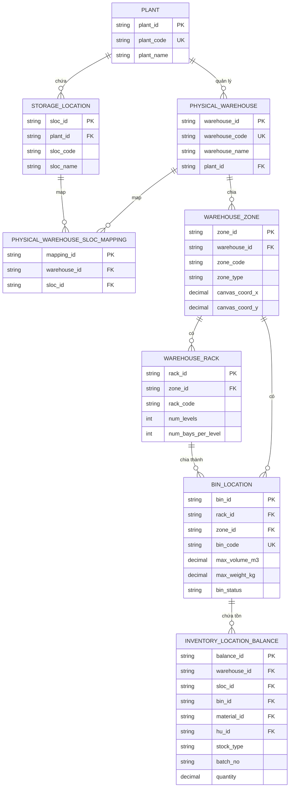
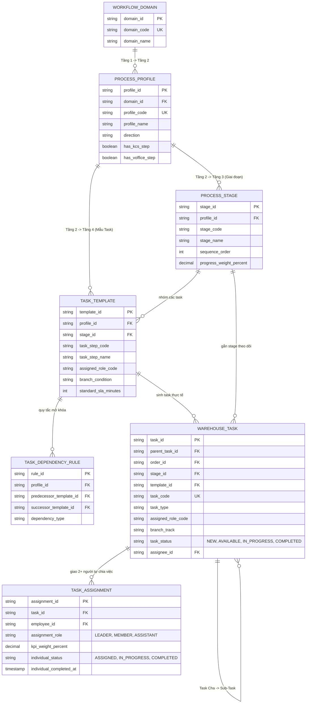
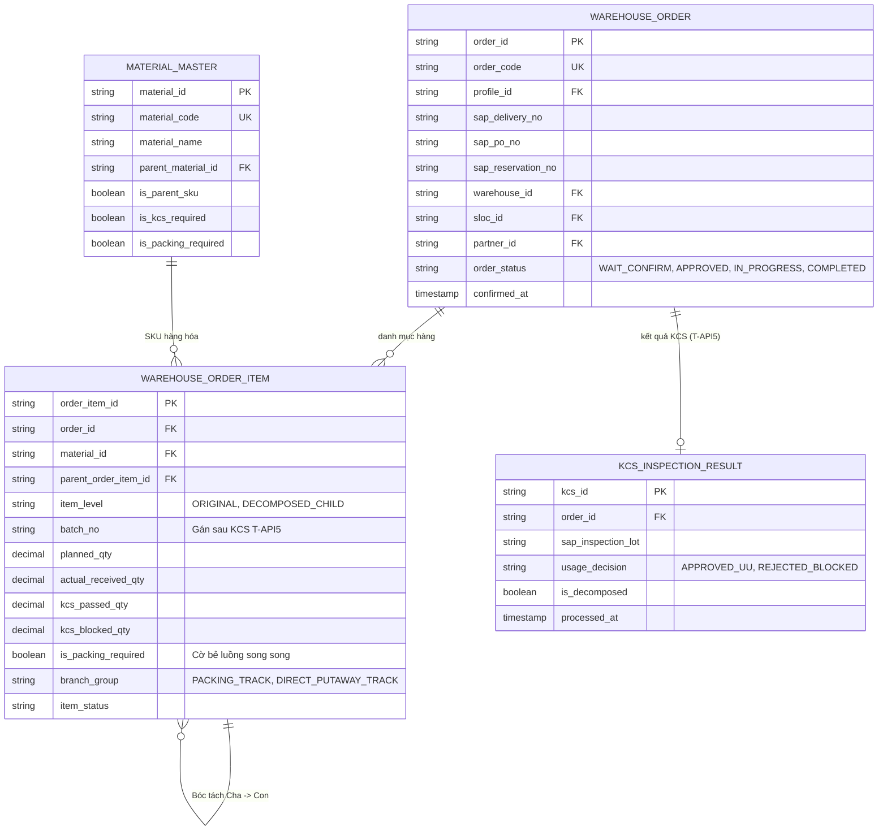
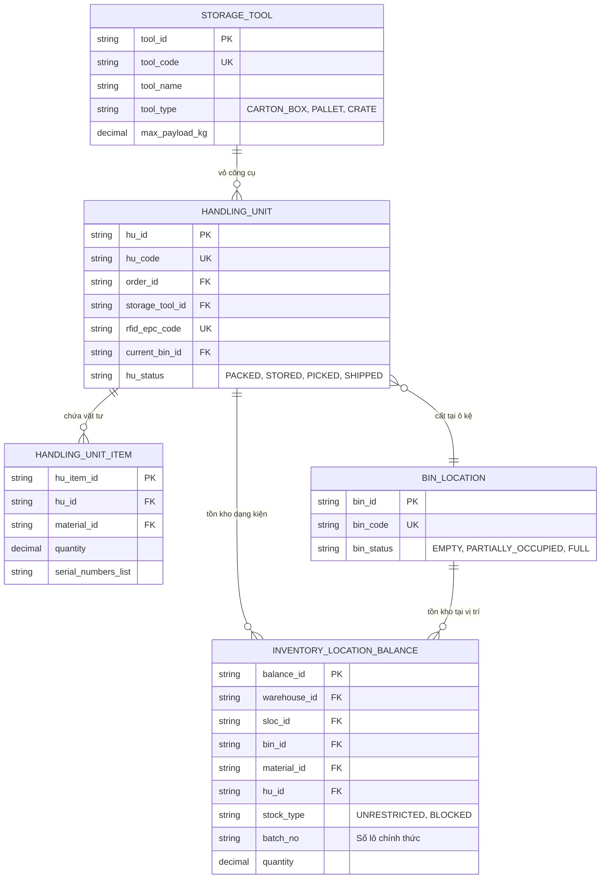
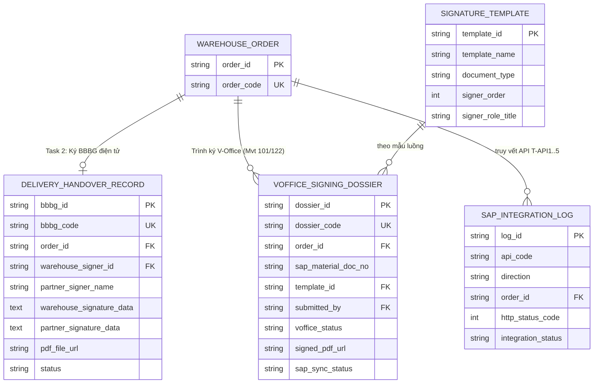

# THIẾT KẾ MÔ HÌNH DỮ LIỆU & TỪ ĐIỂN THỰC THỂ TOÀN DIỆN (DATA MODEL & ERD)
## Hệ Thống Quản Lý Kho Thông Minh (AI-WS Platform)

> **Căn cứ thiết kế:** Tổng quan kiến trúc hệ thống (`AIWS_Project_Overview_And_Architecture.md`), Bộ quy trình nhập xuất chi tiết (`MM.10A`, `MM.10B`, `MM.10C`, `MM.10D`, `MM.10G`, `OUT.01A`), Các ràng buộc nghiệp vụ: Phân cấp 4 tầng, Mã Cha - Con gán Số Lô sau KCS, Bẻ luồng song song, và Giao việc 2 người (Đồng thực hiện không chia cứng số lượng).  
> **Nguyên tắc:** Trích xuất thuần túy từ luồng nghiệp vụ & đặc tả chức năng (không truy cập/sử dụng file DB có sẵn).

---

## MỤC LỤC TỔNG QUAN

- [PHẦN 1: SƠ ĐỒ MỐI QUAN HỆ THỰC THỂ (ER DIAGRAMS)](#phần-1-sơ-đồ-mối-quan-hệ-thực-thể-er-diagrams)
  - [1.1. Sơ đồ Quan hệ Tổng thể Hệ thống (Comprehensive Macro ERD)](#11-sơ-đồ-quan-hệ-tổng-thể-hệ-thống-comprehensive-macro-erd)
  - [1.2. Sơ đồ ERD Miền 1: Không gian Kho, Vị trí Ô Kệ & Tồn kho Vị trí](#12-sơ-đồ-erd-miền-1-không-gian-kho-vị-trí-ô-kệ--tồn-kho-vị-trí)
  - [1.3. Sơ đồ ERD Miền 2: Phân cấp 4 Tầng Quy trình & Điều phối Task Giao 2 Người](#13-sơ-đồ-erd-miền-2-phân-cấp-4-tầng-quy-trình--điều-phối-task-giao-2-người)
  - [1.4. Sơ đồ ERD Miền 3: Lệnh (Order), Bóc tách Mã Cha - Con & Gán Số Lô (Batch Allocation)](#14-sơ-đồ-erd-miền-3-lệnh-order-bóc-tách-mã-cha---con--gán-số-lô-batch-allocation)
  - [1.5. Sơ đồ ERD Miền 4: Đóng gói Handling Unit (HU), RFID & Cất kho Putaway](#15-sơ-đồ-erd-miền-4-đóng-gói-handling-unit-hu-rfid--cất-kho-putaway)
  - [1.6. Sơ đồ ERD Miền 5: Chứng từ Bàn giao, Trình ký V-Office & Tích hợp 3 Bên](#16-sơ-đồ-erd-miền-5-chứng-từ-bàn-giao-trình-ký-v-office--tích-hợp-3-bên)
- [PHẦN 2: BẢNG TỔNG HỢP DANH MỤC CÁC THỰC THỂ (SUMMARY MATRIX)](#phần-2-bảng-tổng-hợp-danh-mục-các-thực-thể-summary-matrix)
- [PHẦN 3: TỪ ĐIỂN DỮ LIỆU CHI TIẾT CÁC THỰC THỂ (DATA DICTIONARY)](#phần-3-từ-điển-dữ-liệu-chi-tiết-các-thực-thể-data-dictionary)
  - [NHÓM 1: MASTER DATA VẬN HÀNH KHO & MẶT BẰNG (10 Thực thể)](#nhóm-1-master-data-vận-hành-kho--mặt-bằng)
  - [NHÓM 2: DANH MỤC DÙNG CHUNG (10 Thực thể)](#nhóm-2-danh-mục-dùng-chung)
  - [NHÓM 3: CATALOG QUY TRÌNH & ĐIỀU PHỐI TASK (5 Thực thể)](#nhóm-3-catalog-quy-trình--điều-phối-task)
  - [NHÓM 4: VẬN HÀNH CHÍNH (ORDER & TASK EXECUTION) (7 Thực thể)](#nhóm-4-vận-hành-chính-order--task-execution)
  - [NHÓM 5: AN NINH & ĐIỀU PHỐI VẬN CHUYỂN (4 Thực thể)](#nhóm-5-an-ninh--điều-phối-vận-chuyển)
  - [NHÓM 6: ĐÓNG GÓI, RFID & TỒN KHO VỊ TRÍ (3 Thực thể)](#nhóm-6-đóng-gói-rfid--tồn-kho-vị-trí)
  - [NHÓM 7: CHỨNG TỪ, KÝ DUYỆT & KCS (4 Thực thể)](#nhóm-7-chứng-từ-ký-duyệt--kcs)
  - [NHÓM 8: DASHBOARD, GIÁM SÁT SLA & CẢNH BÁO (3 Thực thể)](#nhóm-8-dashboard-giám-sát-sla--cảnh-báo)
  - [NHÓM 9: QUẢN TRỊ HỆ THỐNG & PHÂN QUYỀN (3 Thực thể)](#nhóm-9-quản-trị-hệ-thống--phân-quyền)

---

# PHẦN 1: SƠ ĐỒ MỐI QUAN HỆ THỰC THỂ (ER DIAGRAMS)

## 1.1. Sơ đồ Quan hệ Tổng thể Hệ thống (Comprehensive Macro ERD)

```mermaid
erDiagram
    %% ====================================================
    %% MIỀN 1: MASTER DATA HẠ TẦNG KHO & MẶT BẰNG
    %% ====================================================
    PLANT ||--o{ STORAGE_LOCATION : "chứa (1-n)"
    PLANT ||--o{ PHYSICAL_WAREHOUSE : "quản lý (1-n)"
    PHYSICAL_WAREHOUSE ||--o{ PHYSICAL_WAREHOUSE_SLOC_MAPPING : "ánh xạ"
    STORAGE_LOCATION ||--o{ PHYSICAL_WAREHOUSE_SLOC_MAPPING : "thuộc"
    PHYSICAL_WAREHOUSE ||--o{ WAREHOUSE_ZONE : "chia thành"
    PHYSICAL_WAREHOUSE ||--o{ WAREHOUSE_DOCK : "có cửa"
    PHYSICAL_WAREHOUSE ||--o{ WAREHOUSE_AISLE : "có lối đi"
    WAREHOUSE_ZONE ||--o{ WAREHOUSE_RACK : "chứa kệ"
    WAREHOUSE_ZONE ||--o{ BIN_LOCATION : "chứa ô vị trí"
    WAREHOUSE_RACK ||--o{ BIN_LOCATION : "chia thành tầng/khoang"
    WAREHOUSE_ZONE ||--o{ STORAGE_AREA_PALLET_BLOCK : "khu bãi sàn"

    %% ====================================================
    %% MIỀN 2: DANH MỤC DÙNG CHUNG, NHÂN SỰ & PHÂN QUYỀN
    %% ====================================================
    EMPLOYEE }o--o{ ROLE : "gán qua Employee_Role"
    EMPLOYEE ||--o{ EMPLOYEE_ROLE : "có"
    ROLE ||--o{ EMPLOYEE_ROLE : "thuộc"
    ROLE ||--o{ ROLE_PERMISSION : "có quyền"
    EMPLOYEE ||--o| PHYSICAL_WAREHOUSE : "làm việc tại"
    EMPLOYEE ||--o| USER_ACCOUNT : "tài khoản NV"
    PARTNER ||--o| USER_ACCOUNT : "tài khoản đối tác"
    PARTNER ||--o{ VEHICLE : "sở hữu xe"

    %% ====================================================
    %% MIỀN 3: PHÂN CẤP QUY TRÌNH 4 TẦNG & TASK CATALOG
    %% ====================================================
    WORKFLOW_DOMAIN ||--o{ PROCESS_PROFILE : "Tầng 1 -> Tầng 2"
    PROCESS_PROFILE ||--o{ PROCESS_STAGE : "Tầng 2 -> Tầng 3 (Giai đoạn)"
    PROCESS_PROFILE ||--o{ TASK_TEMPLATE : "Tầng 2 -> Tầng 4 (Mẫu task)"
    PROCESS_STAGE ||--o{ TASK_TEMPLATE : "nhóm các task"
    TASK_TEMPLATE ||--o{ TASK_DEPENDENCY_RULE : "quy tắc tiền đề"
    TASK_TEMPLATE }o--|| ROLE : "chỉ định Role thực hiện"
    PROCESS_PROFILE ||--o{ KPI_CONFIG : "cấu hình SLA"

    %% ====================================================
    %% MIỀN 4: VẬT TƯ, MÃ CHA - CON & ĐỊNH MỨC BOM
    %% ====================================================
    MATERIAL_MASTER ||--o{ MATERIAL_MASTER : "Mã Cha -> Mã Con (Self-ref)"
    MATERIAL_MASTER ||--o{ MATERIAL_BOM_STRUCTURE : "BOM Cha"
    MATERIAL_MASTER ||--o{ MATERIAL_BOM_STRUCTURE : "BOM Con"

    %% ====================================================
    %% MIỀN 5: LỆNH (ORDER) & THỰC THI TASK TÁC NGHIỆP
    %% ====================================================
    WAREHOUSE_ORDER }o--|| PROCESS_PROFILE : "áp dụng quy trình"
    WAREHOUSE_ORDER }o--|| PHYSICAL_WAREHOUSE : "tiếp nhận tại"
    WAREHOUSE_ORDER }o--|| STORAGE_LOCATION : "hạch toán SLoc"
    WAREHOUSE_ORDER }o--|| PARTNER : "giao/nhận từ"
    WAREHOUSE_ORDER ||--o{ WAREHOUSE_ORDER_ITEM : "gồm các dòng hàng"
    WAREHOUSE_ORDER_ITEM }o--|| MATERIAL_MASTER : "là SKU"
    WAREHOUSE_ORDER_ITEM ||--o{ WAREHOUSE_ORDER_ITEM : "Dòng Cha -> Dòng Con (KCS)"
    
    WAREHOUSE_ORDER ||--o{ WAREHOUSE_TASK : "sinh chuỗi task"
    WAREHOUSE_TASK }o--|| TASK_TEMPLATE : "theo mẫu"
    WAREHOUSE_TASK }o--|| PROCESS_STAGE : "thuộc stage"
    WAREHOUSE_TASK ||--o{ WAREHOUSE_TASK : "Task Cha -> Sub-Task"
    WAREHOUSE_TASK ||--o{ TASK_ASSIGNMENT : "phân công 2+ người"
    EMPLOYEE ||--o{ TASK_ASSIGNMENT : "tham gia làm"
    WAREHOUSE_TASK ||--o{ TASK_ITEM_DETAIL : "chỉ định hàng xử lý"
    WAREHOUSE_ORDER_ITEM ||--o{ TASK_ITEM_DETAIL : "phân bổ vào task"
    WAREHOUSE_TASK ||--o{ TASK_EVIDENCE : "có bằng chứng ảnh/mã"
    WAREHOUSE_TASK ||--o{ TASK_SLA_EXTENSION : "xin gia hạn KPI"

    %% ====================================================
    %% MIỀN 6: AN NINH CỔNG & GOM ĐƠN XUẤT KHO
    %% ====================================================
    WAREHOUSE_ORDER ||--o| DELIVERY_SCHEDULE_SLOT : "hẹn giờ cập bến"
    DELIVERY_SCHEDULE_SLOT }o--|| WAREHOUSE_DOCK : "tại cửa Dock"
    WAREHOUSE_ORDER ||--o{ GATE_SECURITY_EVENT : "sự kiện vào/ra cổng"
    GATE_SECURITY_EVENT }o--|| VEHICLE : "biển số xe"
    
    OUTBOUND_SHIPMENT_ROUTE ||--o{ SHIPMENT_ORDER_MAPPING : "gom đơn"
    WAREHOUSE_ORDER ||--o{ SHIPMENT_ORDER_MAPPING : "nằm trong tuyến"
    OUTBOUND_SHIPMENT_ROUTE }o--|| VEHICLE : "chở bằng xe"

    %% ====================================================
    %% MIỀN 7: ĐÓNG GÓI, RFID & TỒN KHO VỊ TRÍ (BIN BALANCE)
    %% ====================================================
    WAREHOUSE_ORDER ||--o{ HANDLING_UNIT : "sinh kiện đóng gói"
    STORAGE_TOOL ||--o{ HANDLING_UNIT : "sử dụng vỏ thùng/pallet"
    HANDLING_UNIT ||--o{ HANDLING_UNIT_ITEM : "chứa chi tiết vật tư"
    MATERIAL_MASTER ||--o{ HANDLING_UNIT_ITEM : "SKU trong kiện"
    HANDLING_UNIT }o--|| BIN_LOCATION : "cất tại ô kệ"
    
    INVENTORY_LOCATION_BALANCE }o--|| PHYSICAL_WAREHOUSE : "tại kho"
    INVENTORY_LOCATION_BALANCE }o--|| STORAGE_LOCATION : "tại SLoc"
    INVENTORY_LOCATION_BALANCE }o--|| BIN_LOCATION : "tại ô vị trí"
    INVENTORY_LOCATION_BALANCE }o--|| MATERIAL_MASTER : "tồn SKU"
    INVENTORY_LOCATION_BALANCE }o--o| HANDLING_UNIT : "trong kiện (nếu có)"

    %% ====================================================
    %% MIỀN 8: CHỨNG TỪ, KÝ DUYỆT & KCS
    %% ====================================================
    WAREHOUSE_ORDER ||--o| DELIVERY_HANDOVER_RECORD : "ký BBBG điện tử"
    WAREHOUSE_ORDER ||--o{ VOFFICE_SIGNING_DOSSIER : "trình ký phiếu nhập/xuất"
    SIGNATURE_TEMPLATE ||--o{ VOFFICE_SIGNING_DOSSIER : "theo luồng mẫu"
    WAREHOUSE_ORDER ||--o| KCS_INSPECTION_RESULT : "kết quả KCS SAP"
    
    %% ====================================================
    %% MIỀN 9: LOG HỆ THỐNG & CẢNH BÁO
    %% ====================================================
    WAREHOUSE_ORDER ||--o{ SAP_INTEGRATION_LOG : "lịch sử API"
    WAREHOUSE_TASK ||--o{ SLA_ALERT_LOG : "cảnh báo quá hạn"
    EMPLOYEE ||--o{ USER_NOTIFICATION : "nhận thông báo"
    USER_ACCOUNT ||--o{ SYSTEM_AUDIT_LOG : "thao tác audit log"
```

---

## 1.2. Sơ đồ ERD Miền 1: Không gian Kho, Vị trí Ô Kệ & Tồn kho Vị trí

---

## 1.3. Sơ đồ ERD Miền 2: Phân cấp 4 Tầng Quy trình & Điều phối Task Giao 2 Người

---

## 1.4. Sơ đồ ERD Miền 3: Lệnh (Order), Bóc tách Mã Cha - Con & Gán Số Lô (Batch Allocation)

---

## 1.5. Sơ đồ ERD Miền 4: Đóng gói Handling Unit (HU), RFID & Cất kho Putaway

---

## 1.6. Sơ đồ ERD Miền 5: Chứng từ Bàn giao, Trình ký V-Office & Tích hợp 3 Bên

---

# PHẦN 2: BẢNG TỔNG HỢP DANH MỤC CÁC THỰC THỂ (SUMMARY MATRIX)

| STT | Tên Bảng (Entity) | Khóa chính (PK) | Khóa ngoại chính (FKs) | Ý nghĩa nghiệp vụ |
|---|---|---|---|---|
| **1** | `Plant` | `plant_id` | - | Đơn vị/Chi nhánh cấp cao đồng bộ từ SAP (Read-only) |
| **2** | `Storage_Location` | `sloc_id` | `plant_id` | Kho logic kế toán SLoc trên SAP |
| **3** | `Physical_Warehouse` | `warehouse_id` | `plant_id`, `manager_id` | Công trình kho bãi thực tế |
| **4** | `Physical_Warehouse_SLoc_Mapping` | `mapping_id` | `warehouse_id`, `sloc_id` | Ánh xạ n-n giữa Kho vật lý và SLoc |
| **5** | `Warehouse_Zone` | `zone_id` | `warehouse_id` | Phân khu chức năng (Staging, C02, Packing, Storage) |
| **6** | `Warehouse_Rack` | `rack_id` | `zone_id` | Dãy giá kệ nhiều tầng/khoang |
| **7** | `Bin_Location` | `bin_id` | `rack_id`, `zone_id` | Vị trí ô kệ chi tiết nhất (Bin Code) |
| **8** | `Storage_Area_Pallet_Block` | `block_id` | `zone_id` | Khu vực bãi sàn lưu trữ Pallet/Thùng gỗ |
| **9** | `Warehouse_Aisle` | `aisle_id` | `warehouse_id` | Lối đi giao thông phục vụ routing xe nâng |
| **10**| `Warehouse_Dock` | `dock_id` | `warehouse_id` | Cửa bốc dỡ xe tải cập bến |
| **11**| `Employee` | `employee_id` | `default_warehouse_id` | Nhân sự kho, trạng thái `ONLINE_IDLE` / `BUSY` |
| **12**| `Role` | `role_id` | - | 8 Roles phân quyền và giao việc |
| **13**| `Employee_Role` | `(employee_id, role_id)` | `employee_id`, `role_id` | Phân vai trò kiêm nhiệm cho nhân sự |
| **14**| `Material_Master` | `material_id` | `parent_material_id` | SKU vật tư, quản lý Mã Cha/Con, cờ đóng gói/KCS |
| **15**| `Material_BOM_Structure` | `bom_id` | `parent_material_id`, `child_material_id` | Định mức bóc tách 1 Cha ra n Con |
| **16**| `Partner` | `partner_id` | - | Nhà cung cấp, Lái xe, Khách hàng, Trạm BTS |
| **17**| `Storage_Tool` | `tool_id` | - | Công cụ lưu trữ (Thùng carton, Pallet, Thùng gỗ) |
| **18**| `Vehicle` | `vehicle_id` | `carrier_partner_id` | Phương tiện vận chuyển, biển số xe |
| **19**| `KPI_Config` | `kpi_config_id` | `process_profile_id` | Cấu hình thời gian chuẩn SLA cho từng Task/Role |
| **20**| `Signature_Template` | `template_id` | `signer_employee_id` | Mẫu chân ký và luồng duyệt V-Office |
| **21**| `Workflow_Domain` | `domain_id` | - | Tầng 1: Phân hệ luồng lớn (INBOUND, OUTBOUND...) |
| **22**| `Process_Profile` | `profile_id` | `domain_id` | Tầng 2: Quy trình nghiệp vụ cụ thể (MM.10A, MM.10B...) |
| **23**| `Process_Stage` | `stage_id` | `profile_id` | Tầng 3: Cụm giai đoạn trạm theo dõi tiến độ Order |
| **24**| `Task_Template` | `template_id` | `profile_id`, `stage_id` | Tầng 4: Mẫu Task thực thi gắn Role |
| **25**| `Task_Dependency_Rule` | `rule_id` | `profile_id`, `predecessor_id`, `successor_id` | Quy tắc mở khóa tuần tự và song song giữa các task |
| **26**| `Warehouse_Order` | `order_id` | `profile_id`, `warehouse_id`, `sloc_id`, `partner_id` | Lệnh nhập/xuất kho chính thức |
| **27**| `Warehouse_Order_Item` | `order_item_id` | `order_id`, `material_id`, `parent_order_item_id` | Dòng hàng trong lệnh, quản lý Cha/Con, Số Lô (`batch_no`) |
| **28**| `Warehouse_Task` | `task_id` | `parent_task_id`, `order_id`, `stage_id`, `template_id` | Task thực thi, trạng thái `NEW`, `AVAILABLE`, `IN_PROGRESS` |
| **29**| `Task_Assignment` | `assignment_id` | `task_id`, `employee_id` | Phân công 2+ người cùng làm 1 task (Tự chia việc) |
| **30**| `Task_Item_Detail` | `task_item_id` | `task_id`, `order_item_id` | Phân bổ số lượng hàng vào task cụ thể |
| **31**| `Task_Evidence` | `evidence_id` | `task_id`, `created_by` | Bằng chứng ảnh, mã quét RFID, chữ ký cảm ứng |
| **32**| `Task_SLA_Extension` | `extension_id` | `task_id`, `requester_id`, `approver_id` | Đơn xin gia hạn KPI/SLA khi có sự cố |
| **33**| `Delivery_Schedule_Slot`| `slot_id` | `order_id`, `dock_id` | Lịch hẹn xe cập bến theo khung giờ |
| **34**| `Gate_Security_Event` | `event_id` | `order_id`, `security_guard_id` | Ghi nhận xe vào/ra cổng kho (`T-Scr`) |
| **35**| `Outbound_Shipment_Route`| `route_id` | `assigned_vehicle_id`, `approved_by` | Tuyến gom nhiều đơn hàng xuất kho |
| **36**| `Shipment_Order_Mapping`| `mapping_id` | `route_id`, `order_id` | Bảng gán các đơn hàng vào tuyến gom |
| **37**| `Handling_Unit` | `hu_id` | `order_id`, `storage_tool_id`, `current_bin_id` | Kiện hàng đóng gói gắn mã RFID |
| **38**| `Handling_Unit_Item` | `hu_item_id` | `hu_id`, `material_id` | Chi tiết SKU và số lượng nằm trong kiện HU |
| **39**| `Inventory_Location_Balance`| `balance_id`| `warehouse_id`, `sloc_id`, `bin_id`, `material_id`, `hu_id`| Số dư tồn kho vật lý tại ô kệ, chia theo Số Lô & UU/Blocked |
| **40**| `Delivery_Handover_Record`| `bbbg_id` | `order_id`, `warehouse_signer_id` | Biên bản bàn giao điện tử 2 bên ký |
| **41**| `VOffice_Signing_Dossier`| `dossier_id` | `order_id`, `template_id`, `submitted_by` | Hồ sơ trình ký số Phiếu nhập kho lên V-Office |
| **42**| `KCS_Inspection_Result` | `kcs_id` | `order_id` | Kết quả KCS SAP gửi qua T-API5 |
| **43**| `File_Attachment` | `attachment_id` | `uploaded_by` | Tệp đính kèm đa năng trên Cloud Storage |
| **44**| `SAP_Integration_Log` | `log_id` | `order_id` | Nhật ký chi tiết gọi API 2 chiều với SAP |
| **45**| `SLA_Alert_Log` | `alert_id` | `task_id`, `order_id`, `responsible_employee_id` | Cảnh báo chậm tiến độ trên Dashboard |
| **46**| `User_Notification` | `notification_id`| `recipient_employee_id` | Thông báo chuông Web và Push App |
| **47**| `User_Account` | `user_id` | `employee_id`, `partner_id` | Tài khoản đăng nhập nội bộ & đối tác |
| **48**| `Role_Permission` | `permission_id` | - | Ma trận phân quyền chức năng |
| **49**| `System_Audit_Log` | `audit_id` | `user_id` | Nhật ký kiểm toán truy vết thao tác |

---

# PHẦN 3: TỪ ĐIỂN DỮ LIỆU CHI TIẾT CÁC THỰC THỂ (DATA DICTIONARY)

## NHÓM 1: MASTER DATA VẬN HÀNH KHO & MẶT BẰNG

### 1. Thực thể `Plant` (Đơn vị / Chi nhánh cấp cao)
- **Mục đích:** Quản lý mã đơn vị cấp cao nhất đồng bộ từ SAP S/4HANA (VD: `VN01`).
- **Nguồn dữ liệu:** Đồng bộ từ SAP (Read-only trên AI-WS).

| Tên trường | Kiểu dữ liệu | Ràng buộc | Mô tả |
|---|---|---|---|
| `plant_id` | VARCHAR(50) | PK, NOT NULL | Mã định danh Plant nội bộ hệ thống |
| `plant_code` | VARCHAR(20) | UNIQUE, NOT NULL | Mã Plant trên SAP (VD: `VN01`, `VN02`) |
| `plant_name` | VARCHAR(255) | NOT NULL | Tên chi nhánh / đơn vị quản lý |
| `address` | VARCHAR(500) | NULL | Địa chỉ địa lý của Plant |
| `is_active` | BOOLEAN | NOT NULL, DEFAULT true | Trạng thái hoạt động |
| `created_at` | TIMESTAMP | NOT NULL | Thời điểm đồng bộ |
| `updated_at` | TIMESTAMP | NOT NULL | Thời điểm cập nhật cuối |

---

### 2. Thực thể `Storage_Location` (Kho Logic SAP - SLoc)
- **Mục đích:** Quản lý kho logic trực thuộc Plant để hạch toán số lượng tồn kho kế toán.
- **Nguồn dữ liệu:** Đồng bộ từ SAP (Read-only).

| Tên trường | Kiểu dữ liệu | Ràng buộc | Mô tả |
|---|---|---|---|
| `sloc_id` | VARCHAR(50) | PK, NOT NULL | ID định danh kho logic |
| `plant_id` | VARCHAR(50) | FK -> `Plant.plant_id`, NOT NULL | Thuộc Plant nào |
| `sloc_code` | VARCHAR(20) | NOT NULL | Mã SLoc trên SAP (VD: `HN01`, `HN02`, `1001`) |
| `sloc_name` | VARCHAR(255) | NOT NULL | Tên kho logic theo nghiệp vụ kế toán |
| `sloc_type` | VARCHAR(50) | NULL | Loại kho logic (Kho thương mại, kho dự án, kho bảo hành...) |
| `is_active` | BOOLEAN | NOT NULL, DEFAULT true | Trạng thái hiệu lực |

---

### 3. Thực thể `Physical_Warehouse` (Kho Vật Lý)
- **Mục đích:** Quản lý công trình kho bãi thực tế trong đời thực (VD: Kho Hòa Lạc, Kho Quang Trung). Một kho vật lý ánh xạ tới 1 hoặc nhiều SLoc.
- **Nguồn dữ liệu:** Tạo và cấu hình trực tiếp trên AI-WS.

| Tên trường | Kiểu dữ liệu | Ràng buộc | Mô tả |
|---|---|---|---|
| `warehouse_id` | VARCHAR(50) | PK, NOT NULL | ID định danh kho vật lý |
| `warehouse_code` | VARCHAR(50) | UNIQUE, NOT NULL | Mã kho vật lý (VD: `WH_HOALAC`, `WH_QTRUNG`) |
| `warehouse_name` | VARCHAR(255) | NOT NULL | Tên kho vật lý |
| `plant_id` | VARCHAR(50) | FK -> `Plant.plant_id`, NOT NULL | Trực thuộc Plant nào |
| `manager_id` | VARCHAR(50) | FK -> `Employee.employee_id`, NULL | Giám đốc kho / Thủ kho trưởng phụ trách |
| `address` | VARCHAR(500) | NOT NULL | Địa chỉ thực tế |
| `total_area_m2` | DECIMAL(12,2)| NULL | Tổng diện tích kho ($m^2$) |
| `usable_area_m2` | DECIMAL(12,2)| NULL | Diện tích hữu dụng ($m^2$) |
| `total_volume_m3`| DECIMAL(12,2)| NULL | Tổng dung tích thiết kế ($m^3$) |
| `status` | VARCHAR(30) | NOT NULL | `ACTIVE`, `MAINTENANCE`, `INACTIVE` |

---

### 4. Thực thể `Physical_Warehouse_SLoc_Mapping` (Bảng Ánh Xạ Kho Vật Lý & SLoc)
- **Mục đích:** Liên kết n-n giữa Kho vật lý và Kho logic SLoc của SAP.

| Tên trường | Kiểu dữ liệu | Ràng buộc | Mô tả |
|---|---|---|---|
| `mapping_id` | VARCHAR(50) | PK, NOT NULL | ID bản ghi ánh xạ |
| `warehouse_id` | VARCHAR(50) | FK -> `Physical_Warehouse.warehouse_id`, NOT NULL | Kho vật lý |
| `sloc_id` | VARCHAR(50) | FK -> `Storage_Location.sloc_id`, NOT NULL | Kho logic SLoc |

---

### 5. Thực thể `Warehouse_Zone` (Phân Khu Chức Năng Kho)
- **Mục đích:** Quản lý các phân khu chức năng trên mặt bằng 2D Canvas (Khu tiếp nhận Staging, Khu kiểm hàng, Khu chờ nhập C02, Khu đóng gói Packing, Khu lưu trữ chính, Khu phòng lạnh, Khu xuất hàng...).

| Tên trường | Kiểu dữ liệu | Ràng buộc | Mô tả |
|---|---|---|---|
| `zone_id` | VARCHAR(50) | PK, NOT NULL | ID định danh phân khu |
| `warehouse_id` | VARCHAR(50) | FK -> `Physical_Warehouse.warehouse_id`, NOT NULL | Thuộc kho vật lý nào |
| `zone_code` | VARCHAR(50) | NOT NULL | Mã phân khu (VD: `STAGING_IN`, `C02_WAIT`, `PACKING_01`, `STORAGE_G01`, `DOCK_AREA`) |
| `zone_name` | VARCHAR(255) | NOT NULL | Tên phân khu |
| `zone_type` | VARCHAR(50) | NOT NULL | `INBOUND_STAGING`, `WAITING_INBOUND`, `PACKING`, `STORAGE`, `COLD_ROOM`, `OUTBOUND_STAGING`, `AISLE` |
| `canvas_coord_x`| DECIMAL(10,2)| NOT NULL | Tọa độ X trên Canvas 2D |
| `canvas_coord_y`| DECIMAL(10,2)| NOT NULL | Tọa độ Y trên Canvas 2D |
| `width_m` | DECIMAL(10,2)| NOT NULL | Chiều rộng (m) |
| `length_m` | DECIMAL(10,2)| NOT NULL | Chiều dài (m) |
| `height_m` | DECIMAL(10,2)| NULL | Chiều cao trần (m) |
| `is_temperature_controlled` | BOOLEAN | DEFAULT false | Cờ kho lạnh/kiểm soát nhiệt độ |
| `status` | VARCHAR(30) | NOT NULL, DEFAULT 'ACTIVE' | `ACTIVE`, `INACTIVE` |

---

### 6. Thực thể `Warehouse_Rack` (Dãy Kệ Lưu Trữ)
- **Mục đích:** Quản lý thông tin cấu hình dãy giá kệ nhiều tầng/nhiều khoang trong phân khu lưu trữ.

| Tên trường | Kiểu dữ liệu | Ràng buộc | Mô tả |
|---|---|---|---|
| `rack_id` | VARCHAR(50) | PK, NOT NULL | ID định danh dãy kệ |
| `zone_id` | VARCHAR(50) | FK -> `Warehouse_Zone.zone_id`, NOT NULL | Thuộc phân khu lưu trữ nào |
| `rack_code` | VARCHAR(50) | NOT NULL | Mã dãy kệ (VD: `G01_R01`, `G01_R02`) |
| `rack_name` | VARCHAR(255) | NOT NULL | Tên hiển thị dãy kệ |
| `num_levels` | INT | NOT NULL | Số tầng của kệ (VD: 4 tầng) |
| `num_bays_per_level` | INT | NOT NULL | Số khoang (Bay) trên mỗi tầng |
| `max_weight_capacity_kg` | DECIMAL(10,2) | NOT NULL | Tải trọng tối đa cho phép của dãy kệ (kg) |
| `canvas_coord_x`| DECIMAL(10,2)| NOT NULL | Tọa độ đặt trên Canvas |
| `canvas_coord_y`| DECIMAL(10,2)| NOT NULL | Tọa độ đặt trên Canvas |
| `orientation_deg`| DECIMAL(5,2) | DEFAULT 0 | Góc xoay hướng kệ ($0^\circ, 90^\circ...$) |

---

### 7. Thực thể `Bin_Location` (Vị Trí Ô Kệ Lưu Trữ - Bin Code)
- **Mục đích:** Đơn vị vị trí lưu trữ vật lý chi tiết nhất trong kho (VD: `G01_KN1.1.1` - Kệ 1, Tầng 1, Khoang 1).

| Tên trường | Kiểu dữ liệu | Ràng buộc | Mô tả |
|---|---|---|---|
| `bin_id` | VARCHAR(50) | PK, NOT NULL | ID định danh ô kệ |
| `rack_id` | VARCHAR(50) | FK -> `Warehouse_Rack.rack_id`, NULL | Thuộc dãy kệ nào (NULL nếu là ô mặt sàn) |
| `zone_id` | VARCHAR(50) | FK -> `Warehouse_Zone.zone_id`, NOT NULL | Thuộc phân khu nào |
| `bin_code` | VARCHAR(100)| UNIQUE, NOT NULL | Mã vạch ô vị trí (VD: `G01_KN1.1.1`, `FLOOR_A1`) |
| `level_index` | INT | NULL | Tầng số mấy (1, 2, 3...) |
| `bay_index` | INT | NULL | Khoang số mấy |
| `max_volume_m3` | DECIMAL(10,3)| NOT NULL | Thể tích tối đa của ô ($m^3$) |
| `max_weight_kg` | DECIMAL(10,2)| NOT NULL | Tải trọng tối đa của ô (kg) |
| `current_occupied_volume_m3` | DECIMAL(10,3)| DEFAULT 0 | Thể tích đang sử dụng |
| `current_occupied_weight_kg` | DECIMAL(10,2)| DEFAULT 0 | Tải trọng đang sử dụng |
| `bin_status` | VARCHAR(30) | NOT NULL | `EMPTY` (Trống), `PARTIALLY_OCCUPIED` (Có chứa 1 phần), `FULL` (Đầy), `LOCKED` (Khóa bảo trì) |
| `is_restricted` | BOOLEAN | DEFAULT false | Ô dành riêng cho hàng đặc thù / KCS Blocked |

---

### 8. Thực thể `Storage_Area_Pallet_Block` (Khu Lưu Trữ Sàn / Pallet / Thùng Gỗ)
- **Mục đích:** Quản lý các ô vị trí lưu trữ mặt sàn không dùng giá kệ (Pallet block, thùng gỗ block).

| Tên trường | Kiểu dữ liệu | Ràng buộc | Mô tả |
|---|---|---|---|
| `block_id` | VARCHAR(50) | PK, NOT NULL | ID khối lưu trữ sàn |
| `zone_id` | VARCHAR(50) | FK -> `Warehouse_Zone.zone_id`, NOT NULL | Thuộc phân khu nào |
| `block_code` | VARCHAR(50) | NOT NULL | Mã khối (VD: `PALLET_BLK_01`, `WOOD_BOX_A`) |
| `storage_type` | VARCHAR(50) | NOT NULL | `PALLET_GROUND`, `WOOD_CONTAINER_ROW` |
| `max_stack_layers` | INT | NOT NULL, DEFAULT 1 | Số tầng chồng tối đa cho phép |
| `max_capacity_units` | INT | NOT NULL | Số lượng pallet/thùng tối đa chứa được |

---

### 9. Thực thể `Warehouse_Aisle` (Đường Giao Thông / Lối Đi Trong Kho)
- **Mục đích:** Định nghĩa các luồng di chuyển của người và xe nâng phục vụ thuật toán tối ưu đường đi lấy hàng / cất hàng.

| Tên trường | Kiểu dữ liệu | Ràng buộc | Mô tả |
|---|---|---|---|
| `aisle_id` | VARCHAR(50) | PK, NOT NULL | ID định danh lối đi |
| `warehouse_id` | VARCHAR(50) | FK -> `Physical_Warehouse.warehouse_id`, NOT NULL | Thuộc kho nào |
| `aisle_code` | VARCHAR(50) | NOT NULL | Mã lối đi (VD: `AISLE_MAIN_01`) |
| `direction_type` | VARCHAR(30) | NOT NULL | `ONE_WAY` (Một chiều), `TWO_WAY` (Hai chiều) |
| `width_m` | DECIMAL(6,2)| NOT NULL | Độ rộng lối đi (m) (kiểm tra xe nâng lọt qua) |
| `start_coord_x` | DECIMAL(10,2)| NOT NULL | Tọa độ điểm đầu |
| `start_coord_y` | DECIMAL(10,2)| NOT NULL | Tọa độ điểm đầu |
| `end_coord_x` | DECIMAL(10,2)| NOT NULL | Tọa độ điểm cuối |
| `end_coord_y` | DECIMAL(10,2)| NOT NULL | Tọa độ điểm cuối |

---

### 10. Thực thể `Warehouse_Dock` (Cửa Nhập / Cửa Xuất Hàng)
- **Mục đích:** Quản lý các cửa bốc dỡ hàng xe tải cập bến, gắn với lịch hẹn xe (Slotting).

| Tên trường | Kiểu dữ liệu | Ràng buộc | Mô tả |
|---|---|---|---|
| `dock_id` | VARCHAR(50) | PK, NOT NULL | ID cửa Dock |
| `warehouse_id` | VARCHAR(50) | FK -> `Physical_Warehouse.warehouse_id`, NOT NULL | Thuộc kho nào |
| `dock_code` | VARCHAR(50) | NOT NULL | Mã Dock (VD: `DOCK_IN_01`, `DOCK_OUT_02`) |
| `dock_name` | VARCHAR(100)| NOT NULL | Tên hiển thị cửa Dock |
| `dock_type` | VARCHAR(30) | NOT NULL | `INBOUND`, `OUTBOUND`, `HYBRID` |
| `supported_vehicle_types` | VARCHAR(255)| NULL | Loại xe hỗ trợ (Xe 5 tấn, Cont 20ft, Cont 40ft...) |
| `current_status` | VARCHAR(30) | NOT NULL | `AVAILABLE` (Sẵn sàng), `OCCUPIED` (Đang có xe), `MAINTENANCE` |

---

## NHÓM 2: DANH MỤC DÙNG CHUNG

### 11. Thực thể `Employee` (Nhân Sự Kho)
- **Mục đích:** Quản lý thông tin nhân viên tham gia vận hành kho, gán Plant/SLoc và phục vụ cơ chế giao việc "Grab-style".
- **Nguồn dữ liệu:** Đồng bộ từ hệ thống HR/Bên thứ 3 + cấu hình phân quyền trên AI-WS.

| Tên trường | Kiểu dữ liệu | Ràng buộc | Mô tả |
|---|---|---|---|
| `employee_id` | VARCHAR(50) | PK, NOT NULL | ID nhân viên hệ thống |
| `employee_code` | VARCHAR(50) | UNIQUE, NOT NULL | Mã nhân viên (VD: `NV00124`) |
| `full_name` | VARCHAR(255) | NOT NULL | Họ và tên |
| `phone_number` | VARCHAR(20) | NULL | Số điện thoại liên hệ |
| `email` | VARCHAR(150) | NULL | Email công vụ |
| `job_title` | VARCHAR(100) | NULL | Chức danh chuyên môn |
| `default_warehouse_id` | VARCHAR(50) | FK -> `Physical_Warehouse.warehouse_id`, NULL | Kho vật lý làm việc mặc định |
| `work_status` | VARCHAR(30) | NOT NULL, DEFAULT 'OFFLINE' | Trạng thái ca trực: `ONLINE_IDLE` (Rảnh), `BUSY` (Đang làm Task), `OFFLINE` (Nghỉ/Không trực) |
| `current_active_task_id`| VARCHAR(50) | NULL | ID Task đang thực hiện (Nếu NULL -> Coi là Rảnh để Auto-match) |
| `is_active` | BOOLEAN | NOT NULL, DEFAULT true | Còn làm việc hay đã nghỉ |

---

### 12. Thực thể `Role` & `Employee_Role` (Hệ Thống Vai Trò)
- **Mục đích:** Định danh nhóm quyền và vai trò thực thi Task.

| Tên trường | Kiểu dữ liệu | Ràng buộc | Mô tả |
|---|---|---|---|
| `role_id` | VARCHAR(50) | PK, NOT NULL | ID định danh Role |
| `role_code` | VARCHAR(50) | UNIQUE, NOT NULL | Mã Role: `ROLE_WAREHOUSE_DIRECTOR`, `ROLE_WAREHOUSE_MASTER`, `ROLE_UNIT_MANAGER`, `ROLE_WAREHOUSE_WORKER`, `ROLE_FORKLIFT_DRIVER`, `ROLE_SECURITY`, `ROLE_ADMIN`, `ROLE_PARTNER` |
| `role_name` | VARCHAR(255) | NOT NULL | Tên vai trò hiển thị |
| `description` | VARCHAR(500) | NULL | Mô tả nhiệm vụ |

*Bảng trung gian `Employee_Role`:* `(employee_id, role_id)`. 1 nhân sự có thể kiêm nhiệm nhiều Role.

---

### 13. Thực thể `Material_Master` (Danh Mục Sản Phẩm / Vật Tư - Hỗ Trợ Mã Cha / Mã Con)
- **Mục đích:** Quản lý danh mục vật tư SAP đồng bộ về, quản lý quan hệ **Mã Cha (Parent SKU) - Mã Con (Child SKU / Component SKU)**, cờ KCS, cờ đóng gói, kích thước, thể tích.

| Tên trường | Kiểu dữ liệu | Ràng buộc | Mô tả |
|---|---|---|---|
| `material_id` | VARCHAR(50) | PK, NOT NULL | ID định danh vật tư trên AI-WS |
| `material_code` | VARCHAR(50) | UNIQUE, NOT NULL | Mã vật tư SAP (VD: `VT-RRU-01`, `VT-ANTENNA-8P`) |
| `material_name` | VARCHAR(255) | NOT NULL | Tên mô tả vật tư |
| `material_type` | VARCHAR(50) | NOT NULL | `RAW_MATERIAL`, `FINISHED_GOOD`, `SPARE_PART`, `KIT_PARENT`, `COMPONENT_CHILD` |
| `base_uom` | VARCHAR(20) | NOT NULL | Đơn vị tính cơ sở (Cái, Bộ, Mét, Cuộn, Chiếc...) |
| **`parent_material_id`**| VARCHAR(50) | FK -> `Material_Master.material_id`, NULL | **Mã cha (Nếu đây là Mã Con phân rã). Để NULL nếu là Mã gốc / Độc lập** |
| **`is_parent_sku`** | BOOLEAN | NOT NULL, DEFAULT false | **Cờ đánh dấu vật tư này là Mã Cha (Có thể bóc tách thành nhiều mã con)** |
| **`is_kcs_required`** | BOOLEAN | NOT NULL, DEFAULT true | **Cờ vật tư này có bắt buộc kiểm định chất lượng (KCS) hay không** |
| **`is_packing_required`**| BOOLEAN | NOT NULL, DEFAULT true | **Cờ quy định vật tư có cần qua khâu Đóng gói hay đi thẳng vào lưu trữ** (True: Hàng chuẩn cần đóng gói; False: Hàng to/quá khổ/nguyên kiện đưa thẳng vào Bin Putaway) |
| `length_cm` | DECIMAL(10,2)| NULL | Chiều dài (cm) |
| `width_cm` | DECIMAL(10,2)| NULL | Chiều rộng (cm) |
| `height_cm` | DECIMAL(10,2)| NULL | Chiều cao (cm) |
| `unit_volume_m3` | DECIMAL(12,6)| NULL | Thể tích 1 đơn vị ($m^3$) $= D \times R \times C$ |
| `unit_weight_kg` | DECIMAL(10,3)| NULL | Khối lượng 1 đơn vị (kg) |
| `standard_packing_qty`| INT | DEFAULT 1 | Quy cách đóng gói tiêu chuẩn (Số cái/Thùng) |
| `storage_condition` | VARCHAR(100)| NULL | Điều kiện bảo quản (Khô ráo, Phòng lạnh, Tránh ẩm...) |
| `is_serialized` | BOOLEAN | DEFAULT true | Hàng có quản lý theo số Serial / RFID không |
| `is_active` | BOOLEAN | DEFAULT true | Trạng thái hiệu lực |

---

### 14. Thực thể `Material_BOM_Structure` (Cấu Trúc Định Mức Bóc Tách Cha - Con)
- **Mục đích:** Lưu định mức bóc tách từ 1 Mã Cha ra các Mã Con khi nhận kết quả KCS từ SAP (`T-API5`).

| Tên trường | Kiểu dữ liệu | Ràng buộc | Mô tả |
|---|---|---|---|
| `bom_id` | VARCHAR(50) | PK, NOT NULL | ID bản ghi định mức |
| `parent_material_id` | VARCHAR(50) | FK -> `Material_Master.material_id`, NOT NULL | Mã vật tư cha |
| `child_material_id` | VARCHAR(50) | FK -> `Material_Master.material_id`, NOT NULL | Mã vật tư con |
| `quantity_per_parent`| DECIMAL(10,2)| NOT NULL | Số lượng mã con phân rã được từ 1 đơn vị mã cha |
| `child_uom` | VARCHAR(20) | NOT NULL | Đơn vị tính của mã con |
| `is_mandatory_component` | BOOLEAN | DEFAULT true | Thành phần bắt buộc |

---

### 15. Thực thể `Partner` (Đối Tác / Nhà Cung Cấp / Đơn Vị Nhận)
- **Mục đích:** Danh mục Nhà cung cấp (NCC), Đơn vị vận tải, Khách hàng, Trạm BTS nhận hàng.

| Tên trường | Kiểu dữ liệu | Ràng buộc | Mô tả |
|---|---|---|---|
| `partner_id` | VARCHAR(50) | PK, NOT NULL | ID đối tác |
| `partner_code` | VARCHAR(50) | UNIQUE, NOT NULL | Mã đối tác trên SAP (VD: `VND00123`, `CUST_HN01`) |
| `partner_name` | VARCHAR(255) | NOT NULL | Tên đối tác / Tên nhà cung cấp |
| `partner_type` | VARCHAR(50) | NOT NULL | `SUPPLIER` (NCC), `CARRIER` (Vận chuyển), `CUSTOMER` (Khách), `INTERNAL_UNIT` (Công trình/Trạm) |
| `tax_code` | VARCHAR(50) | NULL | Mã số thuế |
| `contact_person`| VARCHAR(150) | NULL | Người liên hệ đại diện |
| `contact_phone` | VARCHAR(20) | NULL | SĐT liên hệ |
| `address` | VARCHAR(500) | NULL | Địa chỉ trụ sở |
| `is_active` | BOOLEAN | DEFAULT true | Trạng thái hoạt động |

---

### 16. Thực thể `Storage_Tool` (Công Cụ Lưu Trữ - CCLT)
- **Mục đích:** Danh mục thùng carton, pallet, giá kệ di động, gán mã thẻ RFID phục vụ đóng gói và theo dõi tồn kho dụng cụ.

| Tên trường | Kiểu dữ liệu | Ràng buộc | Mô tả |
|---|---|---|---|
| `tool_id` | VARCHAR(50) | PK, NOT NULL | ID công cụ lưu trữ |
| `tool_code` | VARCHAR(50) | UNIQUE, NOT NULL | Mã công cụ (VD: `PALLET_WOOD_1210`, `CARTON_BOX_L`) |
| `tool_name` | VARCHAR(255) | NOT NULL | Tên hiển thị (Pallet gỗ chuẩn, Thùng Carton size L...) |
| `tool_type` | VARCHAR(50) | NOT NULL | `PALLET`, `CARTON_BOX`, `WOODEN_CRATE`, `TOTE_BIN` |
| `length_cm` | DECIMAL(8,2) | NOT NULL | Chiều dài chuẩn (cm) |
| `width_cm` | DECIMAL(8,2) | NOT NULL | Chiều rộng chuẩn (cm) |
| `height_cm` | DECIMAL(8,2) | NOT NULL | Chiều cao chuẩn (cm) |
| `max_payload_kg`| DECIMAL(10,2)| NOT NULL | Tải trọng chịu tải tối đa (kg) |
| `tare_weight_kg`| DECIMAL(8,2) | NOT NULL | Tự trọng vỏ công cụ (kg) |
| `total_quantity`| INT | NOT NULL, DEFAULT 0 | Tổng số lượng trong kho |
| `available_quantity` | INT | NOT NULL, DEFAULT 0 | Số lượng đang rảnh rỗi sẵn sàng dùng |

---

### 17. Thực thể `Vehicle` (Phương Tiện Vận Chuyển)
- **Mục đích:** Danh mục xe tải, container vận chuyển phục vụ module An ninh cổng và Gom đơn xuất kho.

| Tên trường | Kiểu dữ liệu | Ràng buộc | Mô tả |
|---|---|---|---|
| `vehicle_id` | VARCHAR(50) | PK, NOT NULL | ID phương tiện |
| `plate_number` | VARCHAR(30) | UNIQUE, NOT NULL | Biển số xe (VD: `29C-123.45`) |
| `vehicle_type` | VARCHAR(50) | NOT NULL | `TRUCK_1_5T`, `TRUCK_5T`, `TRUCK_10T`, `CONTAINER_20FT`, `CONTAINER_40FT` |
| `carrier_partner_id`| VARCHAR(50) | FK -> `Partner.partner_id`, NULL | Thuộc đối tác vận chuyển nào |
| `max_payload_kg`| DECIMAL(10,2)| NOT NULL | Tải trọng tối đa cho phép chở (kg) |
| `max_volume_m3` | DECIMAL(10,2)| NOT NULL | Thể tích thùng xe tối đa ($m^3$) |
| `driver_name` | VARCHAR(150) | NULL | Tên tài xế phụ trách thường trực |
| `driver_id_card`| VARCHAR(30) | NULL | Số CCCD tài xế |
| `driver_phone` | VARCHAR(20) | NULL | Số điện thoại tài xế |
| `status` | VARCHAR(30) | NOT NULL, DEFAULT 'AVAILABLE'| `AVAILABLE`, `ON_TRIP`, `MAINTENANCE` |

---

### 18. Thực thể `KPI_Config` (Cấu Hình Chỉ Tiêu SLA/KPI)
- **Mục đích:** Cấu hình thời gian chuẩn (Lead time) và trọng số đánh giá hiệu suất cho từng Task và Role.

| Tên trường | Kiểu dữ liệu | Ràng buộc | Mô tả |
|---|---|---|---|
| `kpi_config_id` | VARCHAR(50) | PK, NOT NULL | ID cấu hình KPI |
| `process_profile_id`| VARCHAR(50)| FK -> `Process_Profile.profile_id`, NOT NULL | Áp dụng cho loại quy trình nào |
| `task_template_code`| VARCHAR(50)| NOT NULL | Mã loại Task (VD: `T_UNL`, `T_HO`, `T_PAC`, `T_PUTAWAY`) |
| `role_code` | VARCHAR(50) | NOT NULL | Role thực hiện |
| `standard_duration_minutes`| INT | NOT NULL | Thời gian chuẩn hoàn thành (phút) |
| `warning_threshold_minutes` | INT | NOT NULL | Ngưỡng cảnh báo sắp quá hạn (phút) |
| `weight_score` | DECIMAL(4,2) | DEFAULT 1.00 | Trọng số KPI |

---

### 19. Thực thể `Signature_Template` (Mẫu Chân Ký / Luồng Phê Duyệt)
- **Mục đích:** Cấu hình chân ký, chức danh và luồng trình ký mẫu phục vụ phân hệ V-Office.

| Tên trường | Kiểu dữ liệu | Ràng buộc | Mô tả |
|---|---|---|---|
| `template_id` | VARCHAR(50) | PK, NOT NULL | ID mẫu chân ký |
| `template_name` | VARCHAR(255) | NOT NULL | Tên mẫu luồng ký (VD: `LUONG_KY_NHAP_MUA_PO_STANDARD`) |
| `document_type` | VARCHAR(50) | NOT NULL | `GOODS_RECEIPT_PO`, `GOODS_RECEIPT_RETURN`, `GOODS_ISSUE_DELIVERY` |
| `signer_order` | INT | NOT NULL | Thứ tự ký trong luồng (1: Thủ kho, 2: Kế toán kho, 3: Thủ trưởng đơn vị) |
| `signer_role_title`| VARCHAR(100)| NOT NULL | Chức danh người ký |
| `signer_employee_id`| VARCHAR(50)| FK -> `Employee.employee_id`, NULL | Nhân sự cụ thể (nếu chỉ định cố định) |

---

## NHÓM 3: CATALOG QUY TRÌNH & ĐIỀU PHỐI TASK

### 20. Thực thể `Workflow_Domain` (Phân Hệ Luồng Lớn - Tầng 1)
- **Mục đích:** Phân loại cấp cao nhất của chuỗi cung ứng.

| Tên trường | Kiểu dữ liệu | Ràng buộc | Mô tả |
|---|---|---|---|
| `domain_id` | VARCHAR(50) | PK, NOT NULL | ID định danh Domain |
| `domain_code` | VARCHAR(50) | UNIQUE, NOT NULL | `INBOUND`, `OUTBOUND`, `TRANSFER`, `INVENTORY` |
| `domain_name` | VARCHAR(255) | NOT NULL | Tên phân hệ (Nhập kho, Xuất kho...) |

---

### 21. Thực thể `Process_Profile` (Loại Quy Trình Nghiệp Vụ - Tầng 2)
- **Mục đích:** Định danh danh mục các loại quy trình Nhập / Xuất (VD: `MM.10A`, `MM.10B`, `MM.10C`, `MM.10D`, `MM.10G`, `OUT.01A`...).

| Tên trường | Kiểu dữ liệu | Ràng buộc | Mô tả |
|---|---|---|---|
| `profile_id` | VARCHAR(50) | PK, NOT NULL | ID loại quy trình |
| `domain_id` | VARCHAR(50) | FK -> `Workflow_Domain.domain_id`, NOT NULL | Thuộc Domain nào |
| `profile_code` | VARCHAR(50) | UNIQUE, NOT NULL | Mã quy trình (VD: `MM.10A`, `MM.10B`, `OUT.DELIVERY`) |
| `profile_name` | VARCHAR(255) | NOT NULL | Tên quy trình |
| `direction` | VARCHAR(20) | NOT NULL | `INBOUND` (Nhập kho), `OUTBOUND` (Xuất kho), `INTERNAL_TRANSFER` (Chuyển kho) |
| `source_system` | VARCHAR(50) | NOT NULL | `SAP_ERP`, `VERP`, `MANUAL` |
| `has_kcs_step` | BOOLEAN | NOT NULL, DEFAULT true | Quy trình này có bước KCS hay không |
| `has_voffice_step` | BOOLEAN | NOT NULL, DEFAULT true | Quy trình này có bước trình ký V-Office hay không |
| `has_security_gate`| BOOLEAN | NOT NULL, DEFAULT true | Có qua chốt an ninh cổng kiểm soát xe không |
| `is_active` | BOOLEAN | DEFAULT true | Trạng thái áp dụng |

---

### 22. Thực thể `Process_Stage` (Giai Đoạn Quy Trình - Tầng 3 trong Mô hình 4 Tầng)
- **Mục đích:** Định nghĩa các giai đoạn/cụm trạm lớn (Stage/Phase) trong quy trình để phục vụ theo dõi thanh tiến độ Dashboard cho cấp quản lý.

| Tên trường | Kiểu dữ liệu | Ràng buộc | Mô tả |
|---|---|---|---|
| `stage_id` | VARCHAR(50) | PK, NOT NULL | ID định danh giai đoạn |
| `profile_id` | VARCHAR(50) | FK -> `Process_Profile.profile_id`, NOT NULL | Thuộc quy trình nào |
| `stage_code` | VARCHAR(50) | NOT NULL | Mã giai đoạn: `STAGE_GATE_IN`, `STAGE_UNLOAD_HANDOVER`, `STAGE_GR_KCS`, `STAGE_PACK_RFID`, `STAGE_PUTAWAY_FINAL` |
| `stage_name` | VARCHAR(255) | NOT NULL | Tên hiển thị giai đoạn (VD: Giai đoạn 2: Bốc dỡ & Kiểm đếm) |
| `sequence_order` | INT | NOT NULL | Thứ tự giai đoạn (1, 2, 3, 4, 5) |
| `progress_weight_percent`| DECIMAL(5,2)| NOT NULL | Trọng số % đóng góp vào thanh tiến độ tổng Order (VD: 20%, 40%...) |

---

### 23. Thực thể `Task_Template` (Mẫu Task Thuộc Quy Trình - Tầng 4)
- **Mục đích:** Định nghĩa các bước Task chuẩn sẽ được sinh ra cho từng Process Profile khi lệnh được xác nhận.

| Tên trường | Kiểu dữ liệu | Ràng buộc | Mô tả |
|---|---|---|---|
| `template_id` | VARCHAR(50) | PK, NOT NULL | ID mẫu Task |
| `profile_id` | VARCHAR(50) | FK -> `Process_Profile.profile_id`, NOT NULL | Thuộc quy trình nào |
| `stage_id` | VARCHAR(50) | FK -> `Process_Stage.stage_id`, NULL | Thuộc giai đoạn (Stage) nào |
| `task_step_code` | VARCHAR(50) | NOT NULL | Mã bước: `T_UNL`, `T_HO`, `T_MV_WAIT`, `T_AGR_KCS`, `T_MV_PACK`, `T_PAC`, `T_PUTAWAY`, `T_VOFFICE` |
| `task_step_name` | VARCHAR(255) | NOT NULL | Tên hiển thị công việc |
| `assigned_role_code`| VARCHAR(50) | NOT NULL | Role phụ trách thực hiện |
| `step_sequence` | INT | NOT NULL | Thứ tự bước trong chuỗi tiêu chuẩn |
| **`branch_condition`** | VARCHAR(100)| NULL | **Điều kiện rẽ nhánh (VD: `IF_PACKING_REQUIRED == TRUE`, `IF_PACKING_REQUIRED == FALSE`, `ALWAYS`)** |
| `is_skippable` | BOOLEAN | DEFAULT false | Cờ cho phép tự động bỏ qua nếu không thỏa điều kiện |
| `standard_sla_minutes`| INT | NOT NULL | Thời gian SLA mặc định (phút) |

---

### 24. Thực thể `Task_Dependency_Rule` (Quy Tắc Phụ Thuộc Mở Khóa Task Liên Hoàn)
- **Mục đích:** Định nghĩa logic: Hoàn thành Task nào thì mở khóa (`NEW` -> `AVAILABLE`) cho Task tiếp theo nào (Hỗ trợ cấu hình chuỗi tuần tự và chuỗi song song).

| Tên trường | Kiểu dữ liệu | Ràng buộc | Mô tả |
|---|---|---|---|
| `rule_id` | VARCHAR(50) | PK, NOT NULL | ID quy tắc phụ thuộc |
| `profile_id` | VARCHAR(50) | FK -> `Process_Profile.profile_id`, NOT NULL | Thuộc quy trình nào |
| `predecessor_template_id`| VARCHAR(50)| FK -> `Task_Template.template_id`, NOT NULL | Task tiền đề (phải hoàn thành trước) |
| `successor_template_id` | VARCHAR(50)| FK -> `Task_Template.template_id`, NOT NULL | Task kế tiếp (sẽ được mở khóa) |
| `dependency_type` | VARCHAR(30) | NOT NULL, DEFAULT 'FINISH_TO_START'| `FINISH_TO_START`, `START_TO_START`, `PARALLEL_BRANCH` |
| `condition_expression` | VARCHAR(255)| NULL | Biểu thức điều kiện nghiệp vụ để mở khóa |

---

## NHÓM 4: VẬN HÀNH CHÍNH (ORDER & TASK EXECUTION)

### 25. Thực thể `Warehouse_Order` (Lệnh Nhập / Xuất Kho)
- **Mục đích:** Quản lý toàn bộ thông tin vòng đời của Đơn hàng Nhập/Xuất kho đồng bộ từ SAP hoặc vERP.

| Tên trường | Kiểu dữ liệu | Ràng buộc | Mô tả |
|---|---|---|---|
| `order_id` | VARCHAR(50) | PK, NOT NULL | ID định danh Lệnh trên AI-WS |
| `order_code` | VARCHAR(50) | UNIQUE, NOT NULL | Mã lệnh hiển thị (VD: `INB-2026-00045`, `OUT-2026-00128`) |
| `profile_id` | VARCHAR(50) | FK -> `Process_Profile.profile_id`, NOT NULL | Loại quy trình áp dụng (VD: `MM.10A`) |
| `direction` | VARCHAR(20) | NOT NULL | `INBOUND`, `OUTBOUND` |
| `sap_delivery_no`| VARCHAR(50) | NULL | Số Inbound/Outbound Delivery trên SAP (VL31N / VL02N) |
| `sap_po_no` | VARCHAR(50) | NULL | Số đơn mua hàng PO (Purchase Order) trên SAP |
| `sap_reservation_no`| VARCHAR(50)| NULL | Số yêu cầu thu hồi / đặt chỗ (Reservation) trên SAP PS |
| `warehouse_id` | VARCHAR(50) | FK -> `Physical_Warehouse.warehouse_id`, NOT NULL | Kho vật lý thực hiện tiếp nhận/xuất |
| `sloc_id` | VARCHAR(50) | FK -> `Storage_Location.sloc_id`, NOT NULL | Kho logic SLoc kế toán |
| `partner_id` | VARCHAR(50) | FK -> `Partner.partner_id`, NOT NULL | Nhà cung cấp giao hàng hoặc Đơn vị nhận hàng |
| `total_lines` | INT | NOT NULL, DEFAULT 0 | Tổng số dòng hàng |
| `total_planned_qty`| DECIMAL(12,2)| NOT NULL | Tổng số lượng kế hoạch |
| `total_actual_qty` | DECIMAL(12,2)| DEFAULT 0 | Tổng số lượng thực tế kiểm nhận / thực xuất |
| `total_weight_kg` | DECIMAL(12,2)| NULL | Tổng khối lượng hàng |
| `total_volume_m3` | DECIMAL(12,3)| NULL | Tổng thể tích hàng ($m^3$) |
| `expected_date` | DATE | NOT NULL | Ngày kế hoạch giao/nhận dự kiến |
| `expected_time_window`| VARCHAR(50)| NULL | Khung giờ hẹn giao nhận (VD: `08:00 - 10:00`) |
| `assigned_staging_zone_id`| VARCHAR(50)| FK -> `Warehouse_Zone.zone_id`, NULL | Vùng tiếp nhận/tập kết (Staging Area) được chỉ định |
| `assigned_dock_id` | VARCHAR(50)| FK -> `Warehouse_Dock.dock_id`, NULL | Cửa Dock được chỉ định cập bến |
| `manager_assignee_id` | VARCHAR(50)| FK -> `Employee.employee_id`, NULL | Thủ kho / Điều phối viên phụ trách đơn hàng |
| `rejection_reason` | VARCHAR(500)| NULL | Lý do từ chối lệnh (Nếu bị Reject tại Gate 1 hoặc Gate 2) |
| `order_status` | VARCHAR(50) | NOT NULL | `WAIT_CONFIRM` (Chờ duyệt lệnh), `APPROVED` (Đã duyệt lịch), `IN_PROGRESS` (Đang tác nghiệp), `COMPLETED` (Đã hoàn tất cất kho/thực xuất), `REJECTED_BY_WHS` (Thủ kho từ chối tiếp nhận), `CANCELED` (SAP hủy lệnh) |
| `overall_sla_deadline` | TIMESTAMP | NULL | Hạn chót hoàn thành toàn bộ đơn hàng |
| `created_at` | TIMESTAMP | NOT NULL | Thời điểm đồng bộ từ SAP |
| `confirmed_at` | TIMESTAMP | NULL | Thời điểm Thủ kho bấm Xác nhận lệnh |
| `completed_at` | TIMESTAMP | NULL | Thời điểm đóng đơn hoàn tất |

---

### 26. Thực thể `Warehouse_Order_Item` (Chi Tiết Dòng Hàng Trong Lệnh - Quản Lý Mã Cha / Mã Con & Nhánh Luồng)
- **Mục đích:** Lưu danh sách các SKU hàng hóa trong đơn hàng, phân biệt Mã Cha ban đầu và Mã Con sau khi nhận kết quả KCS, gắn cờ điều khiển rẽ nhánh đóng gói.

| Tên trường | Kiểu dữ liệu | Ràng buộc | Mô tả |
|---|---|---|---|
| `order_item_id` | VARCHAR(50) | PK, NOT NULL | ID dòng hàng trong Lệnh |
| `order_id` | VARCHAR(50) | FK -> `Warehouse_Order.order_id`, NOT NULL | Thuộc lệnh nào |
| `sap_item_line_no` | VARCHAR(20) | NULL | Số thứ tự dòng trên chứng từ SAP (Item 10, 20...) |
| **`material_id`** | VARCHAR(50) | FK -> `Material_Master.material_id`, NOT NULL | Mã SKU của dòng hàng hiện tại |
| **`parent_order_item_id`**| VARCHAR(50)| FK -> `Warehouse_Order_Item.order_item_id`, NULL | **Nếu dòng này là Mã Con sinh ra từ KCS bóc tách thì trỏ về ID dòng Mã Cha ban đầu** |
| `item_level` | VARCHAR(20) | NOT NULL, DEFAULT 'ORIGINAL'| `ORIGINAL` (Dòng gốc từ SAP), `DECOMPOSED_CHILD` (Dòng mã con sau khi phân rã KCS) |
| **`batch_no`** | VARCHAR(50) | NULL | **Số Lô sản xuất/tồn kho (Giai đoạn đầu T-API1 để NULL, sau KCS T-API5 & Task 4 mới chính thức gán)** |
| `planned_qty` | DECIMAL(12,2)| NOT NULL | Số lượng kế hoạch theo chứng từ SAP |
| `actual_received_qty` | DECIMAL(12,2)| DEFAULT 0 | Số lượng thực đếm khi dỡ hàng và ký BBBG |
| `damaged_qty` | DECIMAL(12,2)| DEFAULT 0 | Số lượng móp hỏng / không đạt sơ bộ |
| `kcs_passed_qty` | DECIMAL(12,2)| DEFAULT 0 | Số lượng đạt KCS (sẽ chuyển tồn kho `UU`) |
| `kcs_blocked_qty` | DECIMAL(12,2)| DEFAULT 0 | Số lượng lỗi KCS (sẽ chuyển tồn kho `Blocked Stock`) |
| `uom` | VARCHAR(20) | NOT NULL | Đơn vị tính |
| **`is_packing_required`**| BOOLEAN | NOT NULL, DEFAULT true | **Cờ phân nhánh: TRUE = Chuyển sang Task Đóng gói; FALSE = Đi thẳng vào Task Lưu trữ Putaway** |
| **`branch_group`** | VARCHAR(30) | NOT NULL, DEFAULT 'PACKING_TRACK' | **Nhánh luồng thực thi: `PACKING_TRACK` (Luồng có đóng gói) hoặc `DIRECT_PUTAWAY_TRACK` (Luồng cất kho thẳng)** |
| `storage_bin_id` | VARCHAR(50) | FK -> `Bin_Location.bin_id`, NULL | Vị trí ô kệ lưu trữ cuối cùng đã xếp vào |
| `item_status` | VARCHAR(30) | NOT NULL | `PENDING`, `COUNTED`, `KCS_PROCESSED`, `PACKED`, `STORED_IN_BIN`, `REJECTED` |

---

### 27. Thực thể `Warehouse_Task` (Nhiệm Vụ Kho Thực Tế - Physical Execution Task)
- **Mục đích:** Quản lý từng Task điện tử cụ thể sinh ra từ Order, gắn với Role, phân phối cho nhân viên thực hiện theo mô hình Grab cuốn chiếu.

| Tên trường | Kiểu dữ liệu | Ràng buộc | Mô tả |
|---|---|---|---|
| `task_id` | VARCHAR(50) | PK, NOT NULL | ID định danh Task |
| **`parent_task_id`** | VARCHAR(50) | FK -> `Warehouse_Task.task_id`, NULL | **Task Cha (Nếu Task này là Sub-Task được tách ra từ 1 Task lớn để giao cho nhiều nhân viên cùng làm trong Grab model)** |
| `task_code` | VARCHAR(50) | UNIQUE, NOT NULL | Mã nhiệm vụ (VD: `TSK-UNL-0012`, `TSK-PAC-0054`, `TSK-PUT-0089`) |
| `order_id` | VARCHAR(50) | FK -> `Warehouse_Order.order_id`, NOT NULL | Sinh ra từ Lệnh nào |
| `stage_id` | VARCHAR(50) | FK -> `Process_Stage.stage_id`, NULL | Thuộc Giai đoạn (Stage) nào trong mô hình 4 tầng |
| `template_id` | VARCHAR(50) | FK -> `Task_Template.template_id`, NOT NULL | Theo mẫu Task nào trong Catalog |
| `task_type` | VARCHAR(50) | NOT NULL | `UNLOADING`, `CHECKING_BBBG`, `MOVE_TO_STAGING`, `KCS_CONFIRM`, `MOVE_TO_PACKING`, `PACKING_RFID`, `PUTAWAY_BIN`, `VOFFICE_SIGNING` |
| `assigned_role_code`| VARCHAR(50) | NOT NULL | Vai trò được phép nhận việc |
| **`branch_track`** | VARCHAR(50) | NOT NULL, DEFAULT 'MAIN' | **Nhánh thực thi: `MAIN` (Chung), `PACKING_TRACK` (Nhánh có đóng gói), `DIRECT_PUTAWAY_TRACK` (Nhánh không đóng gói - song song)** |
| `task_status` | VARCHAR(30) | NOT NULL | `NEW` (Khởi tạo mới / Chờ điều kiện mở khóa), `AVAILABLE` (Khả dụng - chờ nhận), `IN_PROGRESS` (Đang làm), `PAUSED` (Tạm dừng), `COMPLETED` (Đã hoàn thành), `CANCELED` (Đã hủy) |
| `assignee_id` | VARCHAR(50) | FK -> `Employee.employee_id`, NULL | Nhân viên nhận việc chính (Leader) hoặc được điều phối gán |
| `assignment_type` | VARCHAR(30) | NULL | `AUTO_MATCH` (Hệ thống ghép tự động), `MANUAL_DISPATCH` (Điều phối thủ công), `SELF_CLAIM` (Nhân viên tự nhận) |
| `proposed_kpi_minutes`| INT | NOT NULL | Thời gian KPI dự kiến thực hiện (phút) |
| `actual_duration_minutes`| INT | NULL | Thời gian làm thực tế (phút) |
| `sla_deadline` | TIMESTAMP | NULL | Hạn chót hoàn thành theo SLA |
| `sla_status` | VARCHAR(30) | NOT NULL, DEFAULT 'ON_TIME'| `ON_TIME` (Trong hạn), `NEAR_OVERDUE` (Sắp quá hạn), `OVERDUE` (Quá hạn) |
| `unlocked_at` | TIMESTAMP | NULL | Thời điểm mở khóa chuyển `AVAILABLE` |
| `started_at` | TIMESTAMP | NULL | Thời điểm nhân viên bấm Bắt đầu làm |
| `completed_at` | TIMESTAMP | NULL | Thời điểm bấm Hoàn thành |
| `completion_note` | VARCHAR(500)| NULL | Ghi chú khi đóng task |

---

### 28. Thực thể `Task_Assignment` (Phân Công Đa Nhân Sự Cho 1 Task - Tổ Đội / Leader - Member)
- **Mục đích:** Hỗ trợ trường hợp 1 Task có 2 hoặc nhiều người cùng tham gia làm chung (ví dụ 2 người cùng dỡ xe, 1 thủ kho chính + 1 nhân viên kiểm đếm phụ trợ), nhân viên tự chia việc tại hiện trường, Task chỉ `COMPLETED` khi cả 2 hoàn tất 100%.

| Tên trường | Kiểu dữ liệu | Ràng buộc | Mô tả |
|---|---|---|---|
| `assignment_id` | VARCHAR(50) | PK, NOT NULL | ID bản ghi phân công |
| `task_id` | VARCHAR(50) | FK -> `Warehouse_Task.task_id`, NOT NULL | Thuộc Task nào |
| `employee_id` | VARCHAR(50) | FK -> `Employee.employee_id`, NOT NULL | Nhân sự được giao |
| `assignment_role` | VARCHAR(30) | NOT NULL | `LEADER` (Người phụ trách chính / bấm hoàn thành), `MEMBER` (Thành viên cùng làm), `ASSISTANT` (Phụ việc) |
| `allocated_quantity` | DECIMAL(12,2)| NULL | Số lượng phân bổ riêng cho nhân sự này (nếu có chia) |
| `kpi_weight_percent` | DECIMAL(5,2) | NOT NULL, DEFAULT 50.00 | Tỷ lệ % phân bổ tính KPI (VD: 50% - 50% hoặc 70% - 30%) |
| `individual_status` | VARCHAR(30) | NOT NULL, DEFAULT 'ASSIGNED'| Trạng thái riêng của nhân viên: `ASSIGNED`, `IN_PROGRESS`, `COMPLETED` |
| `individual_started_at` | TIMESTAMP | NULL | Giờ nhân viên bắt đầu làm |
| `individual_completed_at`| TIMESTAMP | NULL | Giờ nhân viên hoàn thành phần việc của mình |

---

### 29. Thực thể `Task_Item_Detail` (Chi Tiết Hàng Hóa Thuộc Task Cụ Thể)
- **Mục đích:** Liên kết dòng hàng `Warehouse_Order_Item` vào từng Task tương ứng, đặc biệt khi hệ thống sinh **2 Task song song** (1 Task cho danh sách hàng cần đóng gói, 1 Task cho danh sách hàng không cần đóng gói).

| Tên trường | Kiểu dữ liệu | Ràng buộc | Mô tả |
|---|---|---|---|
| `task_item_id` | VARCHAR(50) | PK, NOT NULL | ID chi tiết hàng trong Task |
| `task_id` | VARCHAR(50) | FK -> `Warehouse_Task.task_id`, NOT NULL | Thuộc Task nào |
| `order_item_id` | VARCHAR(50) | FK -> `Warehouse_Order_Item.order_item_id`, NOT NULL | Thuộc dòng hàng nào của Order |
| `allocated_qty` | DECIMAL(12,2)| NOT NULL | Số lượng hàng được phân bổ giao cho Task này xử lý |
| `processed_qty` | DECIMAL(12,2)| DEFAULT 0 | Số lượng thực tế đã xử lý trong Task |
| `target_location_code`| VARCHAR(100)| NULL | Vị trí đích chỉ định cho Task (Vị trí bãi chờ, bàn đóng gói, hoặc Bin Putaway) |

---

### 30. Thực thể `Task_Evidence` (Bằng Chứng & Kết Quả Thực Thi Task)
- **Mục đích:** Lưu trữ biên bản, hình ảnh chụp tại hiện trường, mã quét Barcode/RFID, chữ ký cảm ứng.

| Tên trường | Kiểu dữ liệu | Ràng buộc | Mô tả |
|---|---|---|---|
| `evidence_id` | VARCHAR(50) | PK, NOT NULL | ID bằng chứng |
| `task_id` | VARCHAR(50) | FK -> `Warehouse_Task.task_id`, NOT NULL | Thuộc Task nào |
| `evidence_type` | VARCHAR(50) | NOT NULL | `PHOTO_DAMAGE` (Ảnh hỏng hóc), `PHOTO_UNLOAD` (Ảnh bốc dỡ), `BARCODE_SCAN` (Mã quét), `TOUCH_SIGNATURE` (Chữ ký), `DOCUMENT_FILE` |
| `file_url` | VARCHAR(500) | NULL | Đường dẫn file ảnh / tài liệu lưu trên storage |
| `scanned_value` | VARCHAR(255) | NULL | Giá trị chuỗi quét được từ mã Barcode / RFID Tag |
| `created_by` | VARCHAR(50) | FK -> `Employee.employee_id`, NOT NULL | Người chụp / người quét |
| `created_at` | TIMESTAMP | NOT NULL | Thời điểm ghi nhận |

---

### 31. Thực thể `Task_SLA_Extension` (Yêu Cầu Gia Hạn SLA/KPI)
- **Mục đích:** Quản lý chức năng `[T-Extend]` khi nhân viên hiện trường xin gia hạn thời gian làm việc do sự cố khách quan.

| Tên trường | Kiểu dữ liệu | Ràng buộc | Mô tả |
|---|---|---|---|
| `extension_id` | VARCHAR(50) | PK, NOT NULL | ID yêu cầu gia hạn |
| `task_id` | VARCHAR(50) | FK -> `Warehouse_Task.task_id`, NOT NULL | Task cần gia hạn |
| `requester_id` | VARCHAR(50) | FK -> `Employee.employee_id`, NOT NULL | Nhân viên xin gia hạn |
| `requested_extra_minutes`| INT | NOT NULL | Số phút xin gia hạn thêm |
| `reason` | VARCHAR(500) | NOT NULL | Lý do xin gia hạn (Mất điện, kẹt hàng...) |
| `approver_id` | VARCHAR(50) | FK -> `Employee.employee_id`, NULL | Lãnh đạo / Giám đốc kho duyệt |
| `approval_status` | VARCHAR(30) | NOT NULL, DEFAULT 'PENDING'| `PENDING`, `APPROVED`, `REJECTED` |
| `approval_note` | VARCHAR(500) | NULL | Ý kiến phê duyệt |
| `created_at` | TIMESTAMP | NOT NULL | Thời điểm gửi yêu cầu |

---

## NHÓM 5: AN NINH & ĐIỀU PHỐI VẬN CHUYỂN

### 32. Thực thể `Delivery_Schedule_Slot` (Lịch Hẹn Xe & Slotting)
- **Mục đích:** Quản lý khung giờ xe NCC cập bến, điều phối cửa Dock và tránh ùn tắc tại cổng.

| Tên trường | Kiểu dữ liệu | Ràng buộc | Mô tả |
|---|---|---|---|
| `slot_id` | VARCHAR(50) | PK, NOT NULL | ID lịch hẹn |
| `order_id` | VARCHAR(50) | FK -> `Warehouse_Order.order_id`, NOT NULL | Gắn với đơn hàng nào |
| `scheduled_date`| DATE | NOT NULL | Ngày hẹn |
| `time_slot_start`| TIME | NOT NULL | Giờ bắt đầu khung tiếp nhận |
| `time_slot_end` | TIME | NOT NULL | Giờ kết thúc khung tiếp nhận |
| `dock_id` | VARCHAR(50) | FK -> `Warehouse_Dock.dock_id`, NULL | Cửa Dock phân bổ |
| `slot_status` | VARCHAR(30) | NOT NULL | `BOOKED`, `ARRIVED`, `COMPLETED`, `CANCELED`, `NO_SHOW` |

---

### 33. Thực thể `Gate_Security_Event` (Sự Kiện An Ninh Cổng Kho - T-Scr)
- **Mục đích:** Bảo vệ đối soát biển số xe, số CCCD tài xế và chốt mốc thời gian vào/ra cổng kho (`Time Screening`).

| Tên trường | Kiểu dữ liệu | Ràng buộc | Mô tả |
|---|---|---|---|
| `event_id` | VARCHAR(50) | PK, NOT NULL | ID sự kiện an ninh |
| `order_id` | VARCHAR(50) | FK -> `Warehouse_Order.order_id`, NOT NULL | Gắn với đơn hàng |
| `plate_number` | VARCHAR(30) | NOT NULL | Biển số xe thực tế |
| `driver_name` | VARCHAR(150) | NOT NULL | Họ tên tài xế |
| `driver_id_card`| VARCHAR(30) | NOT NULL | Số CCCD tài xế đối chiếu |
| `driver_phone` | VARCHAR(20) | NULL | SĐT tài xế |
| `security_guard_id`| VARCHAR(50)| FK -> `Employee.employee_id`, NOT NULL | Bảo vệ trực cổng kiểm soát |
| `entry_time` | TIMESTAMP | NOT NULL | Thời điểm xe vào cổng (`T-Scr In`) -> **Trigger mở khóa Task 1 Dỡ hàng** |
| `exit_time` | TIMESTAMP | NULL | Thời điểm xe ra khỏi cổng (`T-Scr Out`) |
| `security_note` | VARCHAR(500) | NULL | Ghi chú kiểm tra ngoại quan xe |

---

### 34. Thực thể `Outbound_Shipment_Route` (Tuyến Gom Đơn Hàng Xuất Kho)
- **Mục đích:** Gom nhiều đơn hàng xuất trong DO Pool thành 1 tuyến lộ trình tối ưu tải trọng và thể tích xe.

| Tên trường | Kiểu dữ liệu | Ràng buộc | Mô tả |
|---|---|---|---|
| `route_id` | VARCHAR(50) | PK, NOT NULL | ID tuyến gom |
| `route_code` | VARCHAR(50) | UNIQUE, NOT NULL | Mã tuyến (VD: `ROUTE-HN-BN-BG-01`) |
| `route_name` | VARCHAR(255) | NOT NULL | Tên tuyến giao hàng |
| `delivery_date` | DATE | NOT NULL | Ngày giao hàng |
| `total_orders_count` | INT | NOT NULL, DEFAULT 0 | Số lượng đơn gom trong tuyến |
| `total_weight_kg` | DECIMAL(10,2)| NOT NULL | Tổng trọng lượng hàng gom |
| `total_volume_m3` | DECIMAL(10,2)| NOT NULL | Tổng thể tích gom |
| `suggested_vehicle_type`| VARCHAR(50)| NOT NULL | Loại xe đề xuất (Container 20ft, Xe 5T...) |
| `assigned_vehicle_id` | VARCHAR(50)| FK -> `Vehicle.vehicle_id`, NULL | Phương tiện vận chuyển thực tế được duyệt |
| `approval_status` | VARCHAR(30) | NOT NULL, DEFAULT 'WAIT_APPROVAL'| `WAIT_APPROVAL`, `APPROVED`, `IN_TRANSIT`, `COMPLETED` |
| `approved_by` | VARCHAR(50) | FK -> `Employee.employee_id`, NULL | Người duyệt tuyến gom |

---

### 35. Thực thể `Shipment_Order_Mapping` (Chi Tiết Đơn Hàng Thuộc Tuyến Gom)
- **Mục đích:** Bảng liên kết gom các đơn `Warehouse_Order` xuất kho vào một `Outbound_Shipment_Route`.

| Tên trường | Kiểu dữ liệu | Ràng buộc | Mô tả |
|---|---|---|---|
| `mapping_id` | VARCHAR(50) | PK, NOT NULL | ID bản ghi gom |
| `route_id` | VARCHAR(50) | FK -> `Outbound_Shipment_Route.route_id`, NOT NULL | Thuộc tuyến gom nào |
| `order_id` | VARCHAR(50) | FK -> `Warehouse_Order.order_id`, NOT NULL | Đơn hàng xuất được gom |
| `drop_sequence` | INT | NOT NULL | Thứ tự dỡ hàng tại các điểm đến trên hành trình (1, 2, 3...) |

---

## NHÓM 6: ĐÓNG GÓI, RFID & TỒN KHO VỊ TRÍ

### 36. Thực thể `Handling_Unit` (Kiện Đóng Gói / Thùng Carton / Pallet Đóng Gói - HU)
- **Mục đích:** Quản lý từng kiện hàng đóng gói tại Task 6 (`T-Pac`), in tem nhãn Zebra ZT411, gắn mã RFID và cất vào ô kệ tại Task 7 (`T-Mv3`).

| Tên trường | Kiểu dữ liệu | Ràng buộc | Mô tả |
|---|---|---|---|
| `hu_id` | VARCHAR(50) | PK, NOT NULL | ID định danh kiện HU |
| `hu_code` | VARCHAR(100)| UNIQUE, NOT NULL | Mã vạch kiện HU (VD: `HU2026-00001234`) |
| `order_id` | VARCHAR(50) | FK -> `Warehouse_Order.order_id`, NOT NULL | Đóng gói từ Lệnh nào |
| `storage_tool_id`| VARCHAR(50) | FK -> `Storage_Tool.tool_id`, NOT NULL | Sử dụng loại thùng/pallet nào |
| `hu_type` | VARCHAR(30) | NOT NULL | `CARTON_BOX`, `PALLET`, `CRATE` |
| `gross_weight_kg`| DECIMAL(10,3)| NOT NULL | Tổng khối lượng cả vỏ và ruột (kg) |
| `net_weight_kg` | DECIMAL(10,3)| NOT NULL | Khối lượng tịnh hàng hóa bên trong (kg) |
| `volume_m3` | DECIMAL(10,4)| NOT NULL | Thể tích kiện |
| `rfid_epc_code` | VARCHAR(100)| UNIQUE, NULL | Mã chip RFID gắn trên kiện |
| `current_bin_id` | VARCHAR(50) | FK -> `Bin_Location.bin_id`, NULL | Vị trí Bin ô kệ hiện tại đang cất giữ |
| `packed_by` | VARCHAR(50) | FK -> `Employee.employee_id`, NOT NULL | Công nhân kho thực hiện đóng gói |
| `packed_at` | TIMESTAMP | NOT NULL | Thời điểm đóng gói xong |
| `hu_status` | VARCHAR(30) | NOT NULL | `PACKED` (Vừa đóng gói xong), `STORED` (Đã xếp vào Bin), `PICKED` (Đã lấy ra xuất), `SHIPPED` (Đã xuất khỏi kho) |

---

### 37. Thực thể `Handling_Unit_Item` (Chi Tiết Danh Mục SKU Con Nằm Trong Kiện HU)
- **Mục đích:** Quản lý danh sách các vật tư (đặc biệt là các Mã Con phân rã sau KCS) và số lượng cụ thể chứa bên trong từng thùng carton/pallet.

| Tên trường | Kiểu dữ liệu | Ràng buộc | Mô tả |
|---|---|---|---|
| `hu_item_id` | VARCHAR(50) | PK, NOT NULL | ID bản ghi |
| `hu_id` | VARCHAR(50) | FK -> `Handling_Unit.hu_id`, NOT NULL | Nằm trong kiện HU nào |
| `material_id` | VARCHAR(50) | FK -> `Material_Master.material_id`, NOT NULL | Mã SKU chứa trong kiện |
| `quantity` | DECIMAL(10,2)| NOT NULL | Số lượng đóng vào kiện |
| `serial_numbers_list`| TEXT | NULL | Danh sách số Serial chi tiết (nếu có) |
| `kcs_status` | VARCHAR(30) | NOT NULL, DEFAULT 'PASSED'| `PASSED` (Đạt KCS), `BLOCKED` (Không đạt) |

---

### 38. Thực thể `Inventory_Location_Balance` (Tồn Kho Theo Vị Trí Ô Kệ Chi Tiết)
- **Mục đích:** Quản lý số lượng tồn kho vật lý tại từng ô vị trí Bin, hỗ trợ phân loại trạng thái chất lượng (`UU` - Khả dụng vs `Blocked Stock` - Khóa KCS) khớp chuẩn với SAP S/4HANA.

| Tên trường | Kiểu dữ liệu | Ràng buộc | Mô tả |
|---|---|---|---|
| `balance_id` | VARCHAR(50) | PK, NOT NULL | ID bản ghi tồn kho |
| `warehouse_id` | VARCHAR(50) | FK -> `Physical_Warehouse.warehouse_id`, NOT NULL | Tại kho vật lý nào |
| `sloc_id` | VARCHAR(50) | FK -> `Storage_Location.sloc_id`, NOT NULL | Kho logic hạch toán |
| `bin_id` | VARCHAR(50) | FK -> `Bin_Location.bin_id`, NOT NULL | Tại ô vị trí nào |
| `material_id` | VARCHAR(50) | FK -> `Material_Master.material_id`, NOT NULL | Mã vật tư |
| `hu_id` | VARCHAR(50) | FK -> `Handling_Unit.hu_id`, NULL | Nằm trong kiện HU nào (nếu có đóng gói) |
| `stock_type` | VARCHAR(30) | NOT NULL | `UNRESTRICTED` (Khả dụng - UU), `BLOCKED` (Khóa KCS/Hỏng), `IN_QUALITY_CHECK` (Đang chờ KCS) |
| `batch_no` | VARCHAR(50) | NULL | Số lô sản xuất chính thức (Batch Number) |
| `quantity` | DECIMAL(12,2)| NOT NULL | Số lượng tồn tại vị trí |
| `uom` | VARCHAR(20) | NOT NULL | Đơn vị tính |
| `last_putaway_at`| TIMESTAMP | NOT NULL | Thời điểm đưa vào vị trí gần nhất |

---

## NHÓM 7: CHỨNG TỪ, KÝ DUYỆT & KCS

### 39. Thực thể `Delivery_Handover_Record` (Biên Bản Bàn Giao Điện Tử - BBBG)
- **Mục đích:** Quản lý biên bản giao nhận hàng hóa tại Task 2 (`T-Ho`), ghi nhận chữ ký số/chữ ký cảm ứng của Thủ kho và Đại diện bên giao (NCC / Lái xe).

| Tên trường | Kiểu dữ liệu | Ràng buộc | Mô tả |
|---|---|---|---|
| `bbbg_id` | VARCHAR(50) | PK, NOT NULL | ID biên bản bàn giao |
| `bbbg_code` | VARCHAR(50) | UNIQUE, NOT NULL | Mã số BBBG (VD: `BBBG-2026-000123`) |
| `order_id` | VARCHAR(50) | FK -> `Warehouse_Order.order_id`, NOT NULL | Thuộc lệnh nhập/xuất nào |
| `handover_date` | TIMESTAMP | NOT NULL | Ngày giờ lập và ký biên bản |
| `warehouse_signer_id` | VARCHAR(50)| FK -> `Employee.employee_id`, NOT NULL | Thủ kho ký nhận |
| `warehouse_signature_data`| TEXT | NOT NULL | Dữ liệu chữ ký (Base64 cảm ứng hoặc Token CA) |
| `partner_signer_name` | VARCHAR(150)| NOT NULL | Họ tên đại diện NCC / Lái xe giao hàng |
| `partner_signer_id_card` | VARCHAR(30) | NOT NULL | Số CCCD đại diện NCC |
| `partner_signature_data` | TEXT | NOT NULL | Dữ liệu chữ ký đại diện đối tác |
| `total_checked_qty` | DECIMAL(12,2)| NOT NULL | Tổng số lượng thực tế bàn giao |
| `total_discrepancy_qty` | DECIMAL(12,2)| DEFAULT 0 | Tổng số lượng chênh lệch/hư hỏng phát hiện |
| `pdf_file_url` | VARCHAR(500)| NULL | Đường dẫn file PDF hoàn chỉnh sau khi ký 2 bên |
| `status` | VARCHAR(30) | NOT NULL | `DRAFT`, `SIGNED`, `SYNCED_SAP_OK`, `SYNCED_SAP_FAILED` |

---

### 40. Thực thể `VOffice_Signing_Dossier` (Hồ Sơ Trình Ký V-Office Phiếu Nhập Kho)
- **Mục đích:** Quản lý việc trình ký số văn bản Phiếu nhập kho (Material Document Mvt 101/122) trực tiếp từ giao diện AI-WS lên hệ thống V-Office.

| Tên trường | Kiểu dữ liệu | Ràng buộc | Mô tả |
|---|---|---|---|
| `dossier_id` | VARCHAR(50) | PK, NOT NULL | ID hồ sơ trình ký |
| `dossier_code` | VARCHAR(100)| UNIQUE, NOT NULL | Mã hồ sơ V-Office sinh ra |
| `order_id` | VARCHAR(50) | FK -> `Warehouse_Order.order_id`, NOT NULL | Gắn với lệnh kho nào |
| `sap_material_doc_no`| VARCHAR(50)| NOT NULL | Mã Phiếu nhập kho SAP (Material Document) |
| `template_id` | VARCHAR(50) | FK -> `Signature_Template.template_id`, NOT NULL | Luồng trình ký mẫu áp dụng |
| `submitted_by` | VARCHAR(50) | FK -> `Employee.employee_id`, NOT NULL | Thủ kho thực hiện phát động trình ký |
| `submitted_at` | TIMESTAMP | NOT NULL | Thời điểm gửi sang V-Office |
| `voffice_status` | VARCHAR(30) | NOT NULL | `PENDING_APPROVAL` (Chờ duyệt), `APPROVED` (Đã ký duyệt xong), `REJECTED` (Bị từ chối ký) |
| `approved_at` | TIMESTAMP | NULL | Thời điểm V-Office trả kết quả duyệt thành công |
| `signed_pdf_url` | VARCHAR(500)| NULL | Đường dẫn file PDF có gắn chữ ký số CA trả về |
| `sap_sync_status`| VARCHAR(30) | NOT NULL, DEFAULT 'PENDING'| Trạng thái đồng bộ kết quả ký về lại SAP (`SYNCED`, `FAILED`) |

---

### 41. Thực thể `KCS_Inspection_Result` (Kết Quả Kiểm Tra Chất Lượng SAP - T-API5)
- **Mục đích:** Lưu trữ bản tin kết quả KCS và **chi tiết bóc tách Mã Cha -> Mã Con** do SAP gửi sang qua `T-API5`.

| Tên trường | Kiểu dữ liệu | Ràng buộc | Mô tả |
|---|---|---|---|
| `kcs_id` | VARCHAR(50) | PK, NOT NULL | ID kết quả KCS |
| `order_id` | VARCHAR(50) | FK -> `Warehouse_Order.order_id`, NOT NULL | Thuộc lệnh nào |
| `sap_inspection_lot` | VARCHAR(50)| NULL | Mã lô kiểm định trên SAP QM (Inspection Lot) |
| `usage_decision` | VARCHAR(30) | NOT NULL | Quyết định sử dụng của KCS: `APPROVED_UU` (Đạt -> Vào UU), `REJECTED_BLOCKED` (Không đạt -> Vào Blocked) |
| **`is_decomposed`** | BOOLEAN | NOT NULL, DEFAULT false | **Cờ đánh dấu có bóc tách từ Mã Cha sang Danh mục Mã Con chi tiết hay không** |
| `received_api_payload`| TEXT | NOT NULL | Toàn văn dữ liệu JSON nhận từ API `T-API5` |
| `processed_at` | TIMESTAMP | NOT NULL | Thời điểm AI-WS tiếp nhận và tự động bẻ luồng |

---

### 42. Thực thể `File_Attachment` (Tài Liệu Đính Kèm Đa Năng)
- **Mục đích:** Lưu trữ chung các tệp file đính kèm (hóa đơn NCC, ảnh hiện trường, biên bản vi phạm...).

| Tên trường | Kiểu dữ liệu | Ràng buộc | Mô tả |
|---|---|---|---|
| `attachment_id` | VARCHAR(50) | PK, NOT NULL | ID tệp đính kèm |
| `target_entity_type`| VARCHAR(50)| NOT NULL | `ORDER`, `TASK`, `BBBG`, `VOFFICE`, `SECURITY` |
| `target_entity_id` | VARCHAR(50)| NOT NULL | ID của đối tượng liên quan |
| `file_name` | VARCHAR(255) | NOT NULL | Tên file gốc |
| `file_size_bytes` | BIGINT | NOT NULL | Dung lượng file (bytes) |
| `mime_type` | VARCHAR(100) | NOT NULL | Loại file (`application/pdf`, `image/jpeg`...) |
| `storage_url` | VARCHAR(500) | NOT NULL | Đường dẫn truy cập file trên Cloud Storage |
| `uploaded_by` | VARCHAR(50) | FK -> `Employee.employee_id`, NOT NULL | Người tải lên |
| `created_at` | TIMESTAMP | NOT NULL | Thời điểm tải lên |

---

## NHÓM 8: DASHBOARD, GIÁM SÁT SLA & CẢNH BÁO

### 43. Thực thể `SAP_Integration_Log` (Nhật Ký Tích Hợp API SAP & V-Office)
- **Mục đích:** Ghi log chi tiết 100% các cuộc gọi API 2 chiều (`T-API1`, `T-API2`, `T-API3`, `T-API5`, V-Office Webhook) để đảm bảo tính toàn vẹn và khả năng đối soát lỗi tích hợp.

| Tên trường | Kiểu dữ liệu | Ràng buộc | Mô tả |
|---|---|---|---|
| `log_id` | VARCHAR(50) | PK, NOT NULL | ID bản ghi log |
| `api_code` | VARCHAR(50) | NOT NULL | Mã API (`T-API1`, `T-API2`, `T-API3`, `T-API5`, `VOFFICE_SUBMIT`, `VOFFICE_CALLBACK`) |
| `direction` | VARCHAR(20) | NOT NULL | `INBOUND` (Từ ngoài vào AI-WS), `OUTBOUND` (AI-WS gọi ra ngoài) |
| `order_id` | VARCHAR(50) | NULL | Gắn với Order nào (nếu có) |
| `endpoint_url` | VARCHAR(500) | NOT NULL | URL dịch vụ |
| `request_body` | TEXT | NULL | Nội dung gói tin gửi đi |
| `response_body` | TEXT | NULL | Nội dung gói tin phản hồi |
| `http_status_code` | INT | NOT NULL | Mã trạng thái HTTP (200, 400, 500...) |
| `integration_status`| VARCHAR(30) | NOT NULL | `SUCCESS`, `FAILED`, `RETRYING` |
| `error_message` | TEXT | NULL | Thông báo lỗi chi tiết |
| `execution_time_ms` | INT | NOT NULL | Thời gian phản hồi (ms) |
| `created_at` | TIMESTAMP | NOT NULL | Thời điểm giao tiếp |

---

### 44. Thực thể `SLA_Alert_Log` (Cảnh Báo Vượt Ngưỡng SLA/KPI)
- **Mục đích:** Ghi nhận các sự kiện Task hoặc Order bị chậm tiến độ, gửi cảnh báo đỏ lên Dashboard Giám đốc kho.

| Tên trường | Kiểu dữ liệu | Ràng buộc | Mô tả |
|---|---|---|---|
| `alert_id` | VARCHAR(50) | PK, NOT NULL | ID cảnh báo |
| `task_id` | VARCHAR(50) | FK -> `Warehouse_Task.task_id`, NULL | Task vi phạm (nếu là cảnh báo task) |
| `order_id` | VARCHAR(50) | FK -> `Warehouse_Order.order_id`, NOT NULL | Lệnh bị nghẽn SLA |
| `alert_level` | VARCHAR(30) | NOT NULL | `WARNING` (Sắp quá hạn - Cam), `CRITICAL` (Đã quá hạn - Đỏ) |
| `alert_message` | VARCHAR(500) | NOT NULL | Nội dung cảnh báo (VD: "Task Dỡ hàng TSK-001 quá hạn 15 phút") |
| `responsible_employee_id`| VARCHAR(50)| FK -> `Employee.employee_id`, NULL | Nhân sự đang phụ trách bị chậm |
| `is_resolved` | BOOLEAN | NOT NULL, DEFAULT false | Đã được xử lý / thông suốt chưa |
| `created_at` | TIMESTAMP | NOT NULL | Thời điểm phát hiện cảnh báo |

---

### 45. Thực thể `User_Notification` (Thông Báo Tới Người Dùng)
- **Mục đích:** Đẩy thông báo chuông (Web Portal) và Push Notification (Mobile App) khi có Task mới mở khóa, được gán việc, hoặc có lệnh bị từ chối.

| Tên trường | Kiểu dữ liệu | Ràng buộc | Mô tả |
|---|---|---|---|
| `notification_id`| VARCHAR(50) | PK, NOT NULL | ID thông báo |
| `recipient_employee_id`| VARCHAR(50)| FK -> `Employee.employee_id`, NOT NULL | Người nhận thông báo |
| `title` | VARCHAR(255) | NOT NULL | Tiêu đề thông báo |
| `content` | TEXT | NOT NULL | Nội dung chi tiết |
| `notification_type`| VARCHAR(50)| NOT NULL | `TASK_UNLOCKED`, `TASK_ASSIGNED`, `SLA_WARNING`, `ORDER_REJECTED`, `VOFFICE_RESULT` |
| `target_url` | VARCHAR(255) | NULL | Đường dẫn điều hướng nhanh khi bấm vào |
| `is_read` | BOOLEAN | NOT NULL, DEFAULT false | Đã đọc hay chưa |
| `created_at` | TIMESTAMP | NOT NULL | Thời điểm gửi |

---

## NHÓM 9: QUẢN TRỊ HỆ THỐNG & PHÂN QUYỀN

### 46. Thực thể `User_Account` (Tài Khoản Đăng Nhập Người Dùng & Đối Tác)
- **Mục đích:** Quản lý tài khoản truy cập hệ thống AI-WS cho cả Nhân sự nội bộ và Đối tác bên ngoài (NCC, Lái xe).

| Tên trường | Kiểu dữ liệu | Ràng buộc | Mô tả |
|---|---|---|---|
| `user_id` | VARCHAR(50) | PK, NOT NULL | ID người dùng |
| `username` | VARCHAR(100) | UNIQUE, NOT NULL | Tên đăng nhập |
| `password_hash` | VARCHAR(255) | NOT NULL | Mật khẩu mã hóa BCrypt/Argon2 |
| `employee_id` | VARCHAR(50) | FK -> `Employee.employee_id`, NULL | Liên kết nhân viên nội bộ (Nếu là NV) |
| `partner_id` | VARCHAR(50) | FK -> `Partner.partner_id`, NULL | Liên kết đối tác bên ngoài (Nếu là NCC/Tài xế) |
| `user_type` | VARCHAR(30) | NOT NULL | `INTERNAL_STAFF`, `EXTERNAL_PARTNER` |
| `is_active` | BOOLEAN | NOT NULL, DEFAULT true | Trạng thái khóa/kích hoạt |
| `last_login_at` | TIMESTAMP | NULL | Thời điểm đăng nhập gần nhất |

---

### 47. Thực thể `Role_Permission` (Phân Quyền Chức Năng Chi Tiết)
- **Mục đích:** Định nghĩa ma trận phân quyền (RBAC) theo từng màn hình và hành động (Xem, Sửa, Duyệt, Trình ký).

| Tên trường | Kiểu dữ liệu | Ràng buộc | Mô tả |
|---|---|---|---|
| `permission_id` | VARCHAR(50) | PK, NOT NULL | ID quyền |
| `role_code` | VARCHAR(50) | NOT NULL | Áp dụng cho Role nào |
| `module_code` | VARCHAR(50) | NOT NULL | `INBOUND_ORDERS`, `TASK_EXECUTION`, `SECURITY_GATE`, `SLOTTING`, `VOFFICE`, `MASTER_DATA` |
| `action_code` | VARCHAR(50) | NOT NULL | `VIEW`, `CREATE`, `UPDATE`, `DELETE`, `APPROVE`, `REJECT`, `CLAIM_TASK` |

---

### 48. Thực thể `System_Audit_Log` (Nhật Ký Kiểm Toán Toàn Diện)
- **Mục đích:** Ghi vết bất biến toàn bộ các hành động tạo, cập nhật, xóa, duyệt của mọi người dùng trên hệ thống để phục vụ an ninh và truy vết vòng đời gói hàng.

| Tên trường | Kiểu dữ liệu | Ràng buộc | Mô tả |
|---|---|---|---|
| `audit_id` | VARCHAR(50) | PK, NOT NULL | ID bản ghi kiểm toán |
| `user_id` | VARCHAR(50) | NOT NULL | Người thực hiện |
| `username` | VARCHAR(100) | NOT NULL | Username |
| `ip_address` | VARCHAR(50) | NULL | Địa chỉ IP máy khách |
| `action` | VARCHAR(50) | NOT NULL | `APPROVE_ORDER`, `REJECT_ORDER`, `CLAIM_TASK`, `COMPLETE_TASK`, `SUBMIT_VOFFICE`, `SCAN_RFID` |
| `target_entity` | VARCHAR(50) | NOT NULL | Tên bảng bị tác động (`Warehouse_Order`, `Warehouse_Task`...) |
| `target_id` | VARCHAR(50) | NOT NULL | Khóa chính của bản ghi bị tác động |
| `old_value_json`| TEXT | NULL | Dữ liệu trước khi sửa (JSON) |
| `new_value_json`| TEXT | NULL | Dữ liệu sau khi sửa (JSON) |
| `created_at` | TIMESTAMP | NOT NULL | Thời điểm thực hiện hành động |
