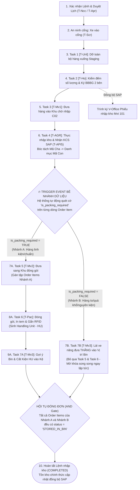

# ĐẶC TẢ LUỒNG DỮ LIỆU QUY TRÌNH, MÃ CHA - CON & BẺ NHÁNH SONG SONG
## Hệ Thống Quản Lý Kho Thông Minh (AI-WS Platform)

> **Mục đích tài liệu:** Mô tả chi tiết cách dữ liệu được lưu trữ, biến đổi qua từng bước của từng quy trình nghiệp vụ (Nhập NCC, Thu hồi công trình/trạm, Xuất kho), cơ chế bóc tách **Mã Cha $\rightarrow$ Mã Con** từ kết quả KCS của SAP, và kiến trúc **bẻ luồng song song (Parallel Branching Execution)** cho hàng cần đóng gói và hàng to không cần đóng gói trong cùng một Lệnh nhập kho.

---

## PHẦN 1: MA TRẬN QUY TRÌNH NGHIỆP VỤ (PROCESS MATRIX)

Hệ thống AI-WS được thiết kế theo kiến trúc Catalog quy trình đa dạng. Mỗi luồng nghiệp vụ lớn có từ 1 đến 2 quy trình cụ thể với các đặc thù khác nhau:

| Nhóm Luồng | Mã Quy trình | Tên Quy trình | Nguồn Khởi tạo | Đặc thù nghiệp vụ & Dữ liệu |
|---|---|---|---|---|
| **Nhập kho** | `MM.10A` | Nhập kho Mua hàng từ NCC (PO) | SAP Inbound Delivery (`T-API1`) | • Có dỡ hàng, kiểm đếm sơ bộ & ký BBBG 2 bên.<br>• Trình ký V-Office Phiếu nhập kho (Mvt 101) trực tiếp trên AI-WS.<br>• SAP chủ trì KCS, bóc tách Mã Cha $\rightarrow$ Mã Con (`T-API5`).<br>• Bẻ 2 nhánh: Đóng gói vs Cất kho thẳng. |
| **Nhập kho** | `MM.10B` | Nhập kho Thu hồi từ Công trình (PS) | SAP Reservation (`T-API1`) | • Thu hồi theo nguyên giá xuất ban đầu, gắn WBS Element.<br>• Trình ký V-Office 2 lần (Lần 1 từ SAP, Lần 2 từ AI-WS cho Mvt 122).<br>• KCS theo lô kiểm định QM.04. |
| **Nhập kho** | `MM.10C` | Nhập kho Thu hồi từ Trạm BTS (PM) | SAP PM Order (`T-API1`) | • Thu hồi thiết bị hỏng/thay thế từ trạm viễn thông.<br>• Quản lý chặt chẽ danh mục Serial thiết bị cũ.<br>• KCS phân loại: Tái sử dụng (`UU`), Sửa chữa, hoặc Thanh lý (`Blocked`). |
| **Nhập kho** | `MM.10D` | Nhập thu hồi Tài sản Non-Telco | SAP Asset (`T-API1`) | • Thu hồi bàn ghế, máy tính, công cụ dụng cụ văn phòng. |
| **Nhập kho** | `MM.10G` | Nhập kho khác | SAP / Thủ công | • Nhập điều chỉnh kiểm kê, nhập hàng mẫu, hàng tặng. |
| **Xuất kho** | `OUT.01A` | Xuất kho Vận chuyển / Cấp phát | SAP Outbound Delivery | • Gom nhiều đơn hàng trong DO Pool vào Tuyến xe.<br>• AIWS Task Engine tự động sinh việc cuốn chiếu (Picking $\rightarrow$ Packing $\rightarrow$ Staging).<br>• Kiểm đối soát RFID tại cửa Dock & ký BBBG tài xế.<br>• Thủ kho xác nhận thực xuất và ký số V-Office. |
| **Xuất kho** | `OUT.01B` | Xuất kho Công trình / Trạm | SAP Reservation | • Xuất đích danh theo dự án/trạm BTS, không qua gom đơn lớn. |

---

## PHẦN 2: CƠ CHẾ DỮ LIỆU SẢN PHẨM MÃ CHA — MÃ CON (PARENT - CHILD SKU DECOMPOSITION)

### 2.1. Bản chất nghiệp vụ & Thời điểm Gán Số Lô (Batch Allocation)
- **Giai đoạn 1 (Đồng bộ Lệnh ban đầu - `T-API1`):** 
  - Bản tin `T-API1` từ SAP đẩy sang AI-WS **đã chứa sẵn cấu trúc phân cấp cả Mã Cha và danh mục các Mã Con dự kiến**.
  - Tuy nhiên, ở giai đoạn này **CHƯA lưu số lượng vào Số Lô (Batch No / Lô sản xuất) nào**.
  - Khi dỡ hàng (`T-Unl`) và ký BBBG (`T-Ho`), Thủ kho và NCC chỉ thực hiện đối soát tổng số lượng thực tế nhận được theo đơn hàng.
- **Giai đoạn 2 (Thực nhập kho sau khi nhận kết quả KCS - `T-API5` & Task 4 `T-AGR`):** 
  - SAP gửi kết quả KCS kèm chi tiết bóc tách BOM chính thức.
  - Khi Thủ kho xác nhận **Thực nhập kho (`Task 4 [T-AGR]`)**, hệ thống mới **CHÍNH THỨC lưu và phân bổ số lượng cụ thể vào từng Số Lô (`batch_no`)** cho từng Mã Con (hoặc mã hàng).
- **Giai đoạn 3 (Đóng gói & Cất kho trên AI-WS):** 
  - AI-WS tiếp nhận danh mục Mã Con đã có Số Lô (`batch_no`), in tem nhãn SKU con (Zebra ZT411), gán mã RFID cho từng kiện HU và cất vào vị trí ô kệ (`Bin Putaway`).

### 2.2. Luồng dịch chuyển dữ liệu qua các bảng

```mermaid
flowchart TD
    SAP_PO["SAP PO / Inbound Delivery<br>(Đẩy cả Mã Cha & Danh mục Mã Con dự kiến)"] -->|T-API1 (Chưa gán Batch No)| ORD_ITEMS["Warehouse_Order_Item<br>• Dòng Cha: VT-KIT-RRU-5G (10 Bộ)<br>• Dòng Con dự kiến: VT-RRU-BODY, VT-CAB-PWR...<br>• batch_no: NULL (Chưa lưu vào Batch)"]
    
    ORD_ITEMS -->|Task 1, 2, 3: Dỡ & Đếm sơ bộ| BBBG_REC["Delivery_Handover_Record<br>(Ký BBBG: Đối soát số lượng thực nhận)"]
    
    BBBG_REC -->|Đồng bộ SAP & KCS| SAP_KCS["SAP KCS & Kết quả phân định BOM (T-API5)"]
    
    SAP_KCS -->|T-API5 Response| KCS_RESULT["KCS_Inspection_Result<br>• usage_decision: 'APPROVED_UU'<br>• Gán Số Lô chính thức cho từng Mã Con"]
    
    KCS_RESULT -->|Thực nhập kho: Cập nhật Batch No| CHILD_1["Warehouse_Order_Item (Mã Con 1)<br>• material_id: VT-RRU-BODY (10 Cái)<br>• batch_no: 'BATCH-20260815-01' (Chính thức lưu Batch)<br>• is_packing_required: TRUE"]
    
    KCS_RESULT -->|Thực nhập kho: Cập nhật Batch No| CHILD_2["Warehouse_Order_Item (Mã Con 2)<br>• material_id: VT-CAB-PWR (20 Sợi)<br>• batch_no: 'BATCH-20260815-01'<br>• is_packing_required: TRUE"]

    KCS_RESULT -->|Thực nhập kho: Cập nhật Batch No| CHILD_3["Warehouse_Order_Item (Mã Con 3 - Hàng To)<br>• material_id: VT-ANTENNA-BIG (10 Cột)<br>• batch_no: 'BATCH-20260815-02'<br>• is_packing_required: FALSE (Hàng to cất thẳng)"]
```

---

## PHẦN 3: CƠ CHẾ BẺ LUỒNG & CHẠY SONG SONG TRONG CÙNG 1 LỆNH (PARALLEL WORKFLOW BRANCHING)

### 3.1. Bài toán nghiệp vụ bẻ luồng
Trong thực tế vận hành tại các tổng kho lớn của Viettel, trong cùng 1 Lệnh nhập kho `Warehouse_Order` luôn tồn tại đồng thời 2 nhóm hàng hóa có đặc tính vật lý trái ngược nhau:
1. **Nhóm hàng chuẩn / linh kiện nhỏ (Cần đóng gói):** Module thu phát, dây nhảy quang, bo mạch, card điều khiển $\rightarrow$ Bắt buộc phải đưa vào Bàn đóng gói, đóng thùng Carton/Pallet, in tem dán mã RFID $\rightarrow$ mới đưa vào giá kệ (Rack).
2. **Nhóm hàng to / quá khổ / nguyên đai kiện (Không cần đóng gói):** Cột anten, cuộn cáp quang lớn, máy nổ dự phòng, tủ nguồn cồng kềnh $\rightarrow$ Không thể và không cần đóng gói $\rightarrow$ Sau khi KCS xong phải cho xe nâng đưa **thẳng vào vị trí lưu trữ (Bin Putaway / Bãi sàn Pallet)**.

Hai chuỗi công việc này phải **chạy song song độc lập** trên cùng một Lệnh nhập kho để tối ưu hóa thời gian giải phóng mặt bằng kho.

---

### 3.2. Sơ đồ bẻ luồng chi tiết (Parallel Task Execution Flow)



---

### 3.3. Bảng phân tích trạng thái dữ liệu qua từng bước bẻ luồng

| Bước | Hành động | Dữ liệu sinh ra / cập nhật | Trạng thái Task | Trạng thái Order Item |
|---|---|---|---|---|
| **1** | Nhận `T-API1` từ SAP | Tạo 1 `Warehouse_Order`<br>Tạo n `Warehouse_Order_Item` (Dòng Cha) | Chưa sinh Task vận hành | `PENDING` |
| **2** | Thủ kho bấm Xác nhận lệnh | Task Engine tra cứu Catalog `MM.10A` $\rightarrow$ Sinh sẵn chuỗi Task ở trạng thái `NEW` | Task Kiểm tra: `COMPLETED`<br>Task 1: Chờ an ninh | `PENDING` |
| **3** | An ninh cổng bấm Cho xe vào | Ghi nhận `Gate_Security_Event` (`entry_time`) $\rightarrow$ **Trigger mở khóa Task 1** | Task 1 (`T-Unl`): `AVAILABLE` | `PENDING` |
| **4** | Hoàn thành Task 1 | Ghi nhận `actual_received_qty` sơ bộ | Task 2 (`T-Ho`): `AVAILABLE` | `COUNTED` |
| **5** | Hoàn thành Task 2 & Ký BBBG | Tạo `Delivery_Handover_Record` có chữ ký 2 bên. Kích hoạt gửi SAP lấy Mvt 101 | Task 3 (`T-Mv1`): `AVAILABLE`<br>Task VOffice: `AVAILABLE` | `COUNTED` |
| **6** | Hoàn thành Task 3 | Cập nhật vị trí tạm sang `C02_WAIT` | Task 3: `COMPLETED` | `COUNTED` |
| **7** | SAP trả KCS (`T-API5`) & Xác nhận Task 4 | • Tạo `KCS_Inspection_Result`<br>• Sinh các dòng `Warehouse_Order_Item` (Dòng Con)<br>• Phân loại `branch_group` thành 2 tập hợp A & B | Task 4 (`T-AGR`): `COMPLETED` | `KCS_PROCESSED` |
| **8** | **Bẻ luồng song song (Trigger)** | • **Nhánh A:** Sinh Task 5 (`T-Mv2`) ở trạng thái `AVAILABLE`<br>• **Nhánh B:** Sinh Task 7B (`T-Mv3`) ở trạng thái `AVAILABLE` (Bỏ qua Task 5 & 6) | **Task 5 (Nhánh A): `AVAILABLE`**<br>**Task 7B (Nhánh B): `AVAILABLE`** | Nhánh A: `KCS_PROCESSED`<br>Nhánh B: `KCS_PROCESSED` |
| **9A** | Hoàn thành Task 5 (Nhánh A) | Vị trí hàng Nhánh A chuyển sang `PACKING_ZONE` | Task 6 (`T-Pac`): `AVAILABLE` | Nhánh A: `KCS_PROCESSED` |
| **10A**| Hoàn thành Task 6 (Nhánh A) | • Tạo các bản ghi `Handling_Unit` (HU)<br>• Tạo `Handling_Unit_Item`<br>• Gán thẻ `rfid_epc_code` | Task 7A (`T-Mv3`): `AVAILABLE` | Nhánh A: `PACKED` |
| **11A**| Hoàn thành Task 7A (Nhánh A) | • Kiện HU được xếp vào `Bin_Location`<br>• Tạo `Inventory_Location_Balance` | Task 7A: `COMPLETED` | Nhánh A: `STORED_IN_BIN` |
| **11B**| Hoàn thành Task 7B (Nhánh B) | • Hàng to được xếp trực tiếp vào `Bin_Location`<br>• Tạo `Inventory_Location_Balance` | Task 7B: `COMPLETED` | Nhánh B: `STORED_IN_BIN` |
| **12** | **Hội tụ đóng Lệnh** | Kiểm tra toàn bộ Order Items đã `STORED_IN_BIN` $\rightarrow$ Cập nhật `Warehouse_Order` sang `COMPLETED` | Toàn bộ Task: `COMPLETED` | 100% Items: `STORED_IN_BIN` |

---

## PHẦN 4: CHI TIẾT DỮ LIỆU CÁC QUY TRÌNH ĐẶC THÙ KHÁC

### 4.1. Quy trình `MM.10B` — Nhập kho Thu hồi từ Công trình (PS)
- **Điểm khác biệt so với MM.10A:**
  1. Dữ liệu tham chiếu: Không dùng `sap_po_no` mà dùng `sap_reservation_no` và `wbs_element_code` (Mã dự án/gói thầu).
  2. Hạch toán: Phiếu nhập kho tạo trên SAP mang Movement Type **`122` (Hoàn trả từ công trình)** thay vì `101`.
  3. KCS: Lô kiểm tra chất lượng là `QM.04` (Kiểm định vật tư thu hồi).
  4. Trình ký V-Office: Có **2 lần trình ký**:
     - Lần 1: Trình phiếu yêu cầu thu hồi (xuất phát từ SAP).
     - Lần 2: Trình phiếu nhập kho chính thức (xuất phát từ AI-WS sau khi dỡ hàng kiểm đếm).

### 4.2. Quy trình `MM.10C` — Nhập kho Thu hồi từ Trạm BTS (PM)
- **Điểm khác biệt:**
  1. Quản lý Serial 100%: Toàn bộ dòng hàng `Warehouse_Order_Item` bắt buộc quét mã vạch Serial / RFID từng thiết bị cũ tháo dỡ từ trạm BTS về.
  2. Phân loại KCS 3 ngả:
     - Đạt chuẩn tái sử dụng $\rightarrow$ Nhập vào tồn kho `UU`.
     - Hỏng có thể sửa $\rightarrow$ Chuyển vào phân khu `KHO_BAO_HANH_SUA_CHUA`.
     - Hỏng nát thanh lý $\rightarrow$ Chuyển vào tồn kho `BLOCKED_SCRAP` (Chờ rã phế liệu).

### 4.3. Quy trình `OUT.01A` — Xuất kho Vận chuyển Cấp phát (Gom Đơn Tuyến Xe)
- **Chuỗi dữ liệu biến đổi:**
  1. SAP đẩy các đơn hàng `Outbound Delivery` $\rightarrow$ Đưa vào **`DO Pool`** (Trạng thái `WAIT_CONFIRM`).
  2. Điều phối viên gom các đơn cùng tuyến/ngày $\rightarrow$ Tạo `Outbound_Shipment_Route` và gắn các đơn vào `Shipment_Order_Mapping`.
  3. Duyệt chuyến xe $\rightarrow$ Task Engine tự động sinh chuỗi Task xuất:
     - `Task Picking` (Lấy hàng từ Bin): Điều phối Lái xe nâng lấy theo thứ tự lộ trình tối ưu (FIFO/FEFO).
     - `Task Packing` (Đóng gói kiện xuất): Gán tem xuất kho `Shipping Label`.
     - `Task Gate Staging`: Tập kết ra cửa Dock chỉ định.
     - `Task Check Dock & Sign BBBG`: Đối soát RFID tự động tại cửa Dock khi bốc lên xe và ký BBBG với tài xế.
     - `Task Thực xuất & Ký V-Office`: Trừ tồn kho chính thức và gửi chữ ký số sang SAP.

### 4.4. Mô hình Phân cấp Quy trình 4 Tầng (4-Tier Process Hierarchy)
- **Tầng 1 - Workflow Domain:** `INBOUND` (Nhập), `OUTBOUND` (Xuất), `TRANSFER` (Chuyển kho), `INVENTORY` (Kiểm kê).
- **Tầng 2 - Process Profile:** Quy trình cụ thể (`MM.10A`, `MM.10B`, `MM.10C`, `OUT.01A`).
- **Tầng 3 - Process Stage:** Giai đoạn trạm lớn để theo dõi thanh tiến độ Dashboard ($20\% \rightarrow 40\% \rightarrow 60\% \rightarrow 80\% \rightarrow 100\%$).
- **Tầng 4 - Task Execution:** Từng Task vật lý cụ thể được giao theo cơ chế Grab cuốn chiếu.

### 4.5. Cơ chế Giao việc Đa Nhân Sự (1 Task Giao Cho 2 Người Cùng Làm)
- **Giao việc linh hoạt:** Hệ thống phân công Task dỡ hàng xe container cho cả 2 nhân viên (NV A và NV B) qua `Task_Assignment`. Hệ thống **không chia cứng số lượng thùng** cho từng người mà để 2 nhân sự tự phối hợp chia việc tại hiện trường.
- **Trạng thái thực thi:** Cả 2 cùng ở trạng thái `IN_PROGRESS`. Từng người xác nhận khi làm xong phần việc của mình.
- **Nguyên tắc mở khóa:** Task dỡ hàng chỉ chuyển trạng thái `COMPLETED` khi **toàn bộ xe hàng đã dỡ xong 100%**. Chỉ khi đó, Task tiếp theo (**Kiểm hàng & Ký BBBG**) mới được mở khóa chuyển `AVAILABLE`.

---

## PHẦN 5: ĐẶC TẢ LUỒNG DỮ LIỆU & CHUYỂN ĐỔI TRẠNG THÁI LUỒNG XUẤT KHO (MM.11A — MM.11G)

### 5.1. Bảng Chuyển Đổi Trạng Thái Lệnh Kho & Bảng Mở Rộng Theo Giai Đoạn Xuất Kho

```mermaid
flowchart TD
    SAP_RES["1. SAP Reservation (MB21) / Sales Order (VA01) / Outbound Delivery (VL01N)"] -->|GI-API1 / T-API1| ORD_INIT["Tạo Warehouse_Order & Warehouse_Order_Item<br>• order_status = 'WAIT_CONFIRM'<br>• Sinh bản ghi Order_Extension_Outbound_* tương ứng"]
    
    ORD_INIT -->|V-Office duyệt Lần 1| ORD_APP["Duyệt Lệnh xuất: order_status = 'APPROVED'<br>• Task Engine sinh Picking Task (T-S9) & Lịch xe (T-S2)"]
    
    ORD_APP -->|Công nhân PDA Picking| TASK_PICK["Picking Task (T-Mv4):<br>• Suggested Bin (FIFO/FEFO) ➔ Actual Picked Bin<br>• Quét Serial trực tiếp hoặc Upload Excel (GI-API4)<br>• Sinh Stock_Move (move_type = OUTBOUND_PICKING)"]
    
    TASK_PICK -->|Đóng gói & Tem QR| TASK_PACK["Packing Task (T-Pac):<br>• Sinh Handling_Unit (HU) & Handling_Unit_Item<br>• Cập nhật Stock_Quant (stock_status = 'PACKED_PENDING_OUT')"]
    
    TASK_PACK -->|Ký BBBG Điện tử| TASK_HO["Handover Task (T-Ho):<br>• Sinh Delivery_Handover_Record (Chữ ký cảm ứng / CA)<br>• An ninh Gate-In (Gate_Security_Event = 'CHECKED_IN')"]
    
    TASK_HO -->|Thủ kho chốt T-AGI| SAP_PGI["Gửi GI-API5 / T-API3 về SAP:<br>• SAP sinh Material Document WA (49xx)<br>• SAP hạch toán Kế toán tự động (632 / 641 / 241 / 261 / 122)"]
    
    SAP_PGI -->|Tích hợp S-Invoice| SINVOICE["Phát hành PXKKVC Điện tử (GI-API6):<br>• Sinh bản ghi SInvoice_E_Transit_Slip (sinvoice_status = 'ISSUED')"]
    
    SINVOICE -->|Trình ký V-Office Lần 2| VOFFICE_L2["Trình ký V-Office (T-Sig):<br>• Sinh Voffice_Signing_Dossier (signing_status = 'APPROVED')"]
    
    VOFFICE_L2 -->|Xe ra cổng Gate-Out| COMPLETE["Hoàn tất Lệnh xuất kho:<br>• order_status = 'COMPLETED'<br>• Gate_Security_Event = 'CHECKED_OUT'<br>• Cập nhật Stock_Quant trừ tồn kho chính thức"]
```



### 5.2. Ma Trận Dữ Liệu Biến Đổi Cho 7 Quy Trình Xuất Kho

| Mã Luồng | Chứng từ Khởi tạo | Bảng Mở rộng Sử dụng | Giao dịch SAP & Movement Type | Bảng Tích hợp Phát sinh | Cơ chế Xử lý Ngoại lệ / Hủy (MM.16) |
|---|---|---|---|---|---|
| **MM.11A** (Cost Center) | Reservation `MB21` | `OrderExtensionOutbound` | `MIGO` (Mvt 201) | `DeliveryHandoverRecord`, `VofficeSigningDossier` | Sửa Reservation `MB22` hoặc Hủy MIGO Material Document. |
| **MM.11B** (AuC / Asset) | Reservation `MB21` | `OrderExtensionOutbound` | `MIGO` (Mvt 241) | `DeliveryHandoverRecord`, `VofficeSigningDossier` | Tham chiếu mã Tài sản AuC (FI-AA). Sửa Reservation `MB22`. |
| **MM.11C** (Dự án PS) | YC Cấp VT `Z-program` | `OrderExtensionOutboundPS` | `Z-program` (Mvt 221 / STO 1-step) | `SInvoiceETransitSlip`, `VofficeSigningDossier` | Upload file Excel Serial (`GI-API4`). Nếu hủy: Mark Z-program Rejected. |
| **MM.11D** (Trạm PM) | PM Work Order | `OrderExtensionOutboundPM` | `MIGO` (Mvt 261) | `SInvoiceETransitSlip`, `DeliveryHandoverRecord` | Đặt cờ `is_urgent_priority = true`. Sửa PM Work Order nếu hủy. |
| **MM.11E** (Trả NCC) | Return PO `ME21N` | `OrderExtensionOutboundReturnSupplier` | `MIGO` (Mvt 122 / 161) | `KcsInspectionResult`, `SInvoiceETransitSlip` | Định vị xuất từ `Blocked Stock`. Hủy Return PO `ME22N` nếu bị từ chối. |
| **MM.11F** (Bán SD) | Sales Order `VA01` ➔ Delivery `VL01N` | `OrderExtensionOutbound` | `VL02N` (PGI Mvt 601) ➔ Billing `VF01` | `SInvoiceETransitSlip`, `VofficeSigningDossier` | Hủy PGI `VL09` ➔ Hủy Hóa đơn Billing `VF11` ➔ Sửa Delivery `VL02N`. |
| **MM.11G** (Xuất Khác) | Tường trình Non-SAP ➔ `MB21` | `OrderExtensionOutboundOther` | `MIGO` (Mvt Z06 / Z07 / Z11) | `DeliveryHandoverRecord`, `VofficeSigningDossier` | Phân nhánh `Z06_DISASTER`, `Z07_EMPLOYEE_LOSS`, `Z11_LENT_RETURN` (Z11 không hạch toán). |
