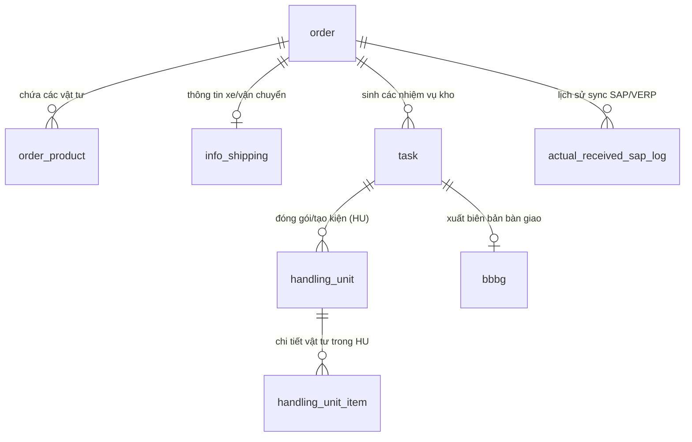
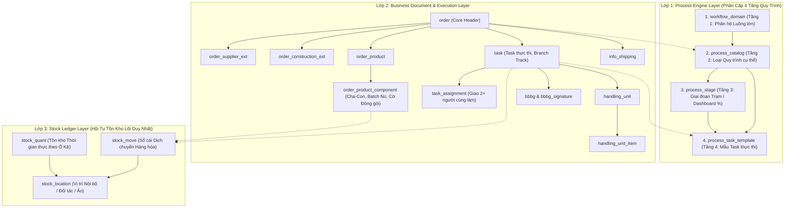
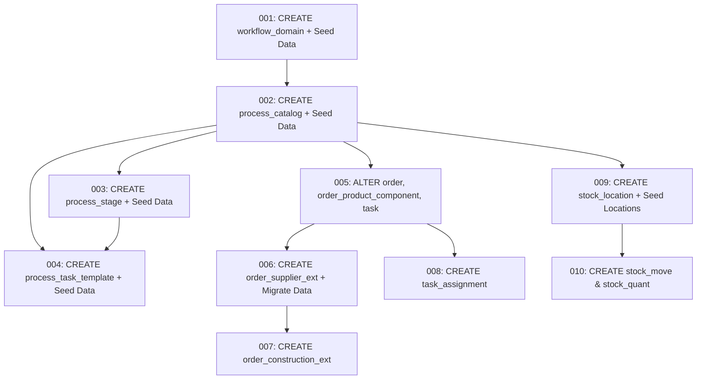

# KIẾN TRÚC & TỐI ƯU MÔ HÌNH DỮ LIỆU NHẬP KHO WMS (WMS INBOUND DB ARCHITECTURE)

> **Mục đích tài liệu:** Phân tích thực trạng các data entries trong cơ sở dữ liệu hiện tại (`vo_warehouse_vtit`), đánh giá nguyên nhân xung đột dữ liệu (DB Conflict) khi phát triển Agile qua các Sprint, và đề xuất cấu trúc Database mở rộng (Modular/Extensible Architecture) phục vụ cho Sprint 1 (Nhập kho NCC), Sprint 2 (Nhập kho Thu hồi công trình) và các luồng nhập kho trong tương lai.

---

## MỤC LỤC

- [I. Phân tích Thực trạng Data Entries trong DB](#i-phân-tích-thực-trạng-data-entries-trong-dump-db-vo_warehouse_vtit)
- [II. Đánh giá Nguyên nhân Xung đột DB khi chạy Agile](#ii-đánh-giá-nguyên-nhân-xung-đột-db-conflict-khi-chạy-agile)
- [III. 6 Nguyên tắc Thiết kế Cốt lõi](#iii-6-nguyên-tắc-thiết-kế-cốt-lõi)
- [IV. Kiến trúc Tổng thể 3 Lớp Kỹ thuật & Mô hình Phân cấp 4 Tầng Quy trình](#iv-kiến-trúc-tổng-thể-3-lớp-kỹ-thuật--mô-hình-phân-cấp-4-tầng-quy-trình)
- [V. Lớp 1: Process Engine Layer — Thiết kế Chi tiết & DDL](#v-lớp-1-process-engine-layer--thiết-kế-chi-tiết--ddl)
- [VI. Lớp 2: Business Document & Execution Layer — Thiết kế Chi tiết & DDL](#vi-lớp-2-business-document--execution-layer--thiết-kế-chi-tiết--ddl)
- [VII. Lớp 3: Stock Ledger Layer — Thiết kế Chi tiết & DDL](#vii-lớp-3-stock-ledger-layer--thiết-kế-chi-tiết--ddl)
- [VIII. Chiến lược Migration: Expand–Contract 3 Pha](#viii-chiến-lược-migration-expandcontract-3-pha)
- [IX. Thứ tự Thực thi Migration Scripts (001 ➔ 010)](#ix-thứ-tự-thực-thi-migration-scripts-001--010)
- [X. Kế hoạch Kiểm tra & Xác minh (Verification Plan)](#x-kế-hoạch-kiểm-tra--xác-minh-verification-plan)

---

## I. PHÂN TÍCH THỰC TRẠNG DATA ENTRIES TRONG DUMP DB (`vo_warehouse_vtit`)

Dựa trên file DDL DB gốc `vo_warehouse_vtit.txt`, luồng Nhập kho (Inbound) hiện tại đang được cấu thành bởi các Data Entities chính sau:



### 1. Chi tiết Bảng Lõi `"order"` (Thực trạng hiện tại: 41 cột)
Bảng `"order"` đang đóng vai trò là "God Table" (Bảng ôm tất cả thuộc tính). Qua phân tích 41 cột hiện tại, dữ liệu bị trộn lẫn thành các nhóm:

| Nhóm dữ liệu | Danh sách các cột (Data Entries) | Nhận xét & Đánh giá |
| :--- | :--- | :--- |
| **1. Nhóm Lõi (Core Inbound)** | `id`, `uuid`, `order_code`, `order_type`, `order_flow`, `status`, `warehouse_id`, `warehouse_code`, `company_id`, `total_quantity`, `line_count`, `sla_status`, `sla_due_at`, `create_date`, `updated_date`, `create_user_id`, `modified_user_id`, `deleted` | Dùng chung cho **mọi loại phiếu nhập/xuất**. Đây là phần Core tiêu chuẩn. |
| **2. Nhóm Vận hành / Sync** | `shipping_id`, `planned_date`, `expected_inbound_at`, `transport_flag`, `kcs_flag`, `source_kcs`, `packing_flag`, `voffice_sign_flag`, `sap_sync_status`, `sap_last_sync_at`, `reject_reason`, `exception_reason` | Điều khiển trạng thái vận hành, đồng bộ SAP và cờ nghiệp vụ. |
| **3. Nhóm Nghiệp vụ NCC (Sprint 1)** | `supplier_name`, `contract_code`, `sign_contract_date`, `no_date_code`, `document_code_src` | **Thuộc tính riêng của Nhập NCC.** Nếu phiếu là "Thu hồi" thì toàn bộ các cột này bị `NULL`. |
| **4. Nhóm Nghiệp vụ Thu Hồi (Sprint 2)** | `external_project_code`, `reason_order`, `description` | **Thuộc tính riêng của Thu hồi công trình.** Đang bắt đầu dính conflict với thuộc tính NCC. |

### 2. Chi tiết các Bảng phụ thuộc (Sub-Entities)
- **`order_product`**: Lưu thông tin vật tư trong đơn (`order_id`, `product_id`).
- **`task`**: Nhiệm vụ kho (`task_code`, `task_name`, `id_order`, `assignee_id`, `zone_code`, `status`, `priority`, `start_time`, `end_time`...). Đây là nơi thực thi các công việc: Nhận hàng, Kiểm kê (KCS), Phân loại, Putaway (Xếp kho).
- **`info_shipping` & `info_shipping_issue`**: Quản lý thông tin xe vận chuyển (`shipment_code`, `carrier_name`, `planned_plate_no`, `actual_plate_no`, `driver_name`, `driver_phone`, `gate_in_at`, `dock_in_at`...) và sự cố vận chuyển.
- **`handling_unit` & `handling_unit_item`**: Quản lý Mã kiện/Pallet (`hu_code`, `rfid_code`, `status`, `print_status`...) phục vụ quét mã QR/RFID thực nhập.
- **`bbbg` & `bbbg_signature`**: Biên bản bàn giao giữa bên giao và bên nhận (`party_giao_name`, `party_nhan_name`, `total_qty`...).
- **`actual_received_sap_log`**: Log tương tác API với SAP/VERP (`gr_document_no`, `request_payload`, `response_payload`, `status`...).

---

## II. ĐÁNH GIÁ NGUYÊN NHÂN XUNG ĐỘT (DB CONFLICT) KHI CHẠY AGILE

### 1. Tại sao dính Conflict khi bước sang Sprint 2?
- Trong **Sprint 1**, team phát triển đã thêm trực tiếp các trường đặc thù của NCC vào bảng `"order"` (`supplier_name`, `contract_code`, `sign_contract_date`...).
- Sang **Sprint 2 (Nhập kho Thu hồi công trình)**, nghiệp vụ phát sinh các yêu cầu mới:
  - Cần quản lý: Mã dự án (`project_id`), Mã công trình (`construction_id`), Đơn vị thu hồi (`recovery_unit`), Đánh giá chất lượng hàng thu hồi (Hàng mới 100%, Hàng cũ dùng được, Hàng hỏng/phế liệu), Biên bản kiểm định chất lượng...
  - Nếu tiếp tục nhét các thuộc tính này vào bảng `"order"`, bảng sẽ bị phình to (60+ cột), dữ liệu trống `NULL` chiếm 70-80%, và các constraint (NOT NULL, UNIQUE) bị xung đột chéo giữa các quy trình.

### 2. Hệ quả nếu tiếp tục thiết kế DB theo kiểu "Cuốn chiếu từng Sprint":
1. **Phá vỡ tính đóng gói (Vi phạm Open/Closed Principle):** Mỗi khi có quy trình nhập kho mới (Nhập điều chuyển, Nhập mượn, Nhập trả lại...), lại phải chạy script `ALTER TABLE "order" ADD COLUMN...`.
2. **Khó bảo trì API & DTO:** Backend API phải xử lý một Object Đơn nhập kho khổng lồ chứa hàng chục trường không liên quan.
3. **Rủi ro ảnh hưởng luồng cũ:** Sửa bảng `"order"` ở Sprint 2 có rủi ro làm lỗi regression luồng Nhập NCC của Sprint 1 đã golive/test xong.

---

## III. 6 NGUYÊN TẮC THIẾT KẾ CỐT LÕI

| # | Nguyên tắc | Mô tả |
|---|---|---|
| **1** | **Order Header Process-Agnostic** | Bảng `order` chỉ giữ các field mà MỌI quy trình đều có: mã order, kho, ngày, trạng thái, tổng SL, SLA. Không chứa bất kỳ thuộc tính đặc thù của riêng 1 quy trình nào. |
| **2** | **Process Catalog Độc lập & Có Version** | `process_catalog` là thực thể riêng, có version. Mỗi `order` trỏ về đúng 1 `process_type_id` (FK integer). Logic sinh Task tra cứu qua FK, **không** qua string `order_type`. |
| **3** | **Task Chain Scope theo `process_type_id`** | Chuỗi Task mẫu (`process_task_template`) được cấu hình riêng cho từng quy trình. Backend chỉ viết 1 hàm generic `TaskEngine.advanceChain(orderId)` dùng chung cho mọi quy trình. |
| **4** | **Extension Table cho Field Đặc Thù** | Thuộc tính riêng từng quy trình → bảng mở rộng nối `1-1` với `order` (VD: `order_supplier_ext`, `order_construction_ext`). Không nhồi vào bảng chung. |
| **5** | **Expand–Contract Migration** | Thêm mới song song (Expand), migrate dữ liệu cũ (Migrate), dọn dẹp sau (Contract). **Không breaking change** với MM.10A đang chạy. |
| **6** | **Single Core Stock Ledger Convergence** | **Hội tụ Tồn kho Lõi Duy Nhất:** Mọi `process_type` (Nhập NCC, Thu hồi công trình/trạm, Xuất kho, Điều chuyển, Kiểm kê...), dù có chuỗi Task, chứng từ và luồng nghiệp vụ khác nhau thế nào ở Tầng 2, ở bước cuối cùng (Task Putaway / Final Step) **BẮT BUỘC đều phải hội tụ về đúng 1 bảng sổ cái biến động (`stock_move`) và 1 bảng số dư tồn kho lõi (`stock_quant` / `zone_inventory_balance`)**. Tuyệt đối không tạo bảng tồn kho riêng biệt theo từng quy trình. |

**Bổ sung — Nguyên lý Location-Based Ledger:** Mọi biến động tồn kho = dịch chuyển hàng từ `src_location` → `dest_location`. Zero schema change ở tầng tồn kho khi thêm quy trình mới.

---

## IV. KIẾN TRÚC TỔNG THỂ 3 LỚP KỸ THUẬT & MÔ HÌNH PHÂN CẤP 4 TẦNG QUY TRÌNH

Hệ thống kết hợp hài hòa giữa **Góc nhìn Phân cấp Nghiệp vụ 4 Tầng** (chuẩn hóa theo `AIWS_Project_Overview_And_Architecture.md`) và **Kiến trúc Dữ liệu Kỹ thuật 3 Lớp** (Đóng gói, mở rộng linh hoạt, hội tụ tồn kho):



**Tóm tắt chức năng 3 Lớp Dữ liệu Kỹ thuật:**

| Lớp Kỹ thuật | Thành phần Thực thể | Nhiệm vụ Nghiệp vụ & Kỹ thuật |
| :--- | :--- | :--- |
| **1. Process Engine** | `workflow_domain`, `process_catalog`, `process_stage`, `process_task_template` | Định nghĩa phân cấp 4 tầng quy trình, cấu hình chuỗi Task mẫu, điều kiện mở khóa, trigger và trọng số % tiến độ Stage cho Dashboard Lãnh đạo. Hỗ trợ Versioning. |
| **2. Business Document & Execution** | `order` (Core) + `order_..._ext` (Extension) + `task`, `task_assignment`, `handling_unit`, `bbbg`, `info_shipping` | Quản lý UI/UX, Đơn hàng, Chứng từ, Trình ký V-Office, Thông tin xe, Cơ chế Grab giao việc 2 người, và bẻ luồng song song sau KCS. |
| **3. Stock Ledger** | `stock_location` + `stock_move` + `stock_quant` | **Hội tụ Tồn kho Lõi Duy Nhất (Nguyên tắc #6):** Mọi quy trình ở Lớp 2 khi hoàn thành đều ghi sổ biến động (`src` → `dest`) và cân bằng số dư tại ô kệ. Zero schema change khi thêm quy trình mới. |

---

## V. LỚP 1: PROCESS ENGINE LAYER — THIẾT KẾ CHI TIẾT & DDL

### 1. Bảng `workflow_domain` — Phân Hệ Luồng Lớn (Tầng 1)

```sql
CREATE TABLE vo_warehouse_vtit.workflow_domain (
    id              BIGINT PRIMARY KEY GENERATED ALWAYS AS IDENTITY,
    domain_code     VARCHAR(50)  NOT NULL UNIQUE,  -- 'INBOUND', 'OUTBOUND', 'TRANSFER', 'INVENTORY'
    domain_name     VARCHAR(255) NOT NULL,
    description     TEXT,
    is_active       BOOLEAN      DEFAULT TRUE NOT NULL,
    create_date     TIMESTAMP    DEFAULT CURRENT_TIMESTAMP
);

-- Seed Data Tầng 1
INSERT INTO vo_warehouse_vtit.workflow_domain (domain_code, domain_name)
VALUES 
    ('INBOUND',   'Phân hệ Nhập kho'),
    ('OUTBOUND',  'Phân hệ Xuất kho'),
    ('TRANSFER',  'Phân hệ Điều chuyển kho'),
    ('INVENTORY', 'Phân hệ Kiểm kê kho');
```

---

### 2. Bảng `process_catalog` — Danh mục Quy trình Nghiệp vụ (Tầng 2 - Có Versioning)

Thay vì hardcode logic `if (orderType == 'SUPPLIER') { ... }`, hệ thống dùng `process_catalog` làm **Workflow Registry**. Mỗi `order` trỏ về đúng 1 `process_type_id`.

```sql
CREATE TABLE vo_warehouse_vtit.process_catalog (
    id                 BIGINT PRIMARY KEY GENERATED ALWAYS AS IDENTITY,
    domain_id          BIGINT NOT NULL REFERENCES vo_warehouse_vtit.workflow_domain(id),
    process_code       VARCHAR(50)  NOT NULL,  -- 'MM.10A', 'MM.10B', 'MM.10C', 'MM.10G', 'OUT.01A'...
    process_name       VARCHAR(255) NOT NULL,
    direction          VARCHAR(10)  NOT NULL DEFAULT 'IN',  -- 'IN' / 'OUT' / 'TRANSFER'
    version            VARCHAR(20)  NOT NULL DEFAULT '1.0',
    is_active          BOOLEAN      NOT NULL DEFAULT TRUE,
    description        TEXT,
    src_location_type  VARCHAR(30),  -- 'SUPPLIER', 'CONSTRUCTION', 'BTS_STATION'...
    dest_location_type VARCHAR(30) DEFAULT 'INTERNAL',
    create_date        TIMESTAMP    DEFAULT CURRENT_TIMESTAMP,
    create_user_id     BIGINT,
    modified_date      TIMESTAMP,
    modified_user_id   BIGINT,
    deleted            BOOLEAN      DEFAULT FALSE,
    CONSTRAINT uk_process_code_version UNIQUE (process_code, version)
);

-- Seed Data Tầng 2
INSERT INTO vo_warehouse_vtit.process_catalog (domain_id, process_code, process_name, direction, version, src_location_type, dest_location_type)
VALUES 
    (1, 'MM.10A',  'Nhập kho mua hàng NCC (PO)',              'IN', '1.0', 'SUPPLIER',     'INTERNAL'),
    (1, 'MM.10B',  'Nhập kho thu hồi Công trình (PS)',        'IN', '1.0', 'CONSTRUCTION', 'INTERNAL'),
    (1, 'MM.10C',  'Nhập kho thu hồi Trạm BTS (PM)',          'IN', '1.0', 'BTS_STATION',  'INTERNAL'),
    (1, 'MM.10G',  'Nhập kho khác (Mượn/Đền bù/Mẫu)',         'IN', '1.0', 'EXTERNAL_MISC','INTERNAL'),
    (2, 'OUT.01A', 'Xuất kho cấp phát vận chuyển gom xe',     'OUT','1.0', 'INTERNAL',     'CUSTOMER');
```

---

### 3. Bảng `process_stage` — Giai Đoạn Trạm / Dashboard % (Tầng 3)

Phục vụ thanh tiến độ trực quan ($20\% \rightarrow 40\% \rightarrow 60\% \rightarrow 80\% \rightarrow 100\%$) cho cấp Lãnh đạo / Giám đốc kho.

```sql
CREATE TABLE vo_warehouse_vtit.process_stage (
    id                     BIGINT PRIMARY KEY GENERATED ALWAYS AS IDENTITY,
    process_type_id        BIGINT NOT NULL REFERENCES vo_warehouse_vtit.process_catalog(id),
    stage_code             VARCHAR(50) NOT NULL,  -- 'STAGE_GATE_IN', 'STAGE_UNLOAD_HANDOVER', 'STAGE_GR_KCS'...
    stage_name             VARCHAR(255) NOT NULL,
    sequence_order         INT NOT NULL,          -- 1, 2, 3, 4, 5
    progress_weight_percent NUMERIC(5,2) NOT NULL, -- 20.00, 40.00, 60.00...
    description            TEXT,
    CONSTRAINT uk_process_stage UNIQUE (process_type_id, sequence_order)
);

-- Seed Data Tầng 3 (5 Stages cho MM.10A)
INSERT INTO vo_warehouse_vtit.process_stage (process_type_id, stage_code, stage_name, sequence_order, progress_weight_percent)
VALUES
    (1, 'STAGE_GATE_IN',        'Giai đoạn 1: Tiếp nhận & Kiểm soát cổng', 1, 20.00),
    (1, 'STAGE_UNLOAD_HANDOVER','Giai đoạn 2: Dỡ hàng & Kiểm đếm BBBG',    2, 40.00),
    (1, 'STAGE_GR_KCS',         'Giai đoạn 3: Thực nhập & KCS SAP',        3, 60.00),
    (1, 'STAGE_PACK_RFID',      'Giai đoạn 4: Đóng gói & Gắn mã RFID',     4, 80.00),
    (1, 'STAGE_PUTAWAY_FINAL',  'Giai đoạn 5: Cất kho Putaway & Hoàn tất', 5, 100.00);
```

---

### 4. Bảng `process_task_template` — Cấu hình Chuỗi Task Mẫu (Tầng 4)

Backend đọc bảng này để tự động sinh chuỗi Task khi `order` được Thủ kho xác nhận. Hỗ trợ rẽ nhánh song song (`branch_condition`), phụ thuộc tuần tự (`predecessor_step`) và trigger bên ngoài (`external_trigger`).

```sql
CREATE TABLE vo_warehouse_vtit.process_task_template (
    id                  BIGINT PRIMARY KEY GENERATED ALWAYS AS IDENTITY,
    process_type_id     BIGINT  NOT NULL REFERENCES vo_warehouse_vtit.process_catalog(id),
    stage_id            BIGINT  REFERENCES vo_warehouse_vtit.process_stage(id),
    step_order          INT     NOT NULL,           -- Thứ tự: 1, 2, 3...
    task_type_code      VARCHAR(50) NOT NULL,        -- 'T_UNL', 'T_HO', 'T_MV1', 'T_AGR', 'T_MV2', 'T_PAC', 'T_MV3'
    task_name_template  VARCHAR(255) NOT NULL,
    assigned_role_code  VARCHAR(50),                 -- 'ROLE_WAREHOUSE_WORKER', 'ROLE_WAREHOUSE_MASTER', 'ROLE_FORKLIFT_DRIVER'
    is_mandatory        BOOLEAN DEFAULT TRUE,
    sla_minutes         INT,                         -- SLA deadline tính bằng phút
    auto_assign_delay_seconds INT DEFAULT 300,       -- Thời gian chờ Grab trước khi Force Assign (5 phút)
    predecessor_step    INT,                         -- step_order của Task phải COMPLETED trước khi mở khóa
    external_trigger    VARCHAR(100),                -- Event bên ngoài cần chờ (VD: 'GATE_CHECK_IN', 'SAP_KCS_T_API5')
    branch_condition    VARCHAR(100),                -- 'ALWAYS', 'IF_PACKING_REQUIRED == TRUE', 'IF_PACKING_REQUIRED == FALSE'
    create_date         TIMESTAMP DEFAULT CURRENT_TIMESTAMP,
    CONSTRAINT uk_process_step UNIQUE (process_type_id, step_order)
);

-- Seed Data — Chuỗi 7 Task cho MM.10A (Nhập NCC):
INSERT INTO vo_warehouse_vtit.process_task_template 
    (process_type_id, stage_id, step_order, task_type_code, task_name_template, assigned_role_code, is_mandatory, sla_minutes, predecessor_step, external_trigger, branch_condition)
VALUES
    (1, 1, 1, 'T_UNL', 'Dỡ hàng khỏi xe',                     'ROLE_WAREHOUSE_WORKER', TRUE, 60,  NULL, 'GATE_CHECK_IN', 'ALWAYS'),
    (1, 2, 2, 'T_HO',  'Kiểm hàng & Ký BBBG Điện tử',         'ROLE_WAREHOUSE_MASTER', TRUE, 120, 1,    NULL,            'ALWAYS'),
    (1, 2, 3, 'T_MV1', 'Đưa hàng vào Khu chờ nhập C02',       'ROLE_WAREHOUSE_WORKER', TRUE, 45,  2,    NULL,            'ALWAYS'),
    (1, 3, 4, 'T_AGR', 'Thực nhập kho (Xác nhận KCS & Mã Con)','ROLE_WAREHOUSE_MASTER', TRUE, 60,  3,    'SAP_KCS_T_API5','ALWAYS'),
    (1, 4, 5, 'T_MV2', 'Đưa sang khu đóng gói (Nhánh A)',     'ROLE_WAREHOUSE_WORKER', TRUE, 30,  4,    NULL,            'IF_PACKING_REQUIRED == TRUE'),
    (1, 4, 6, 'T_PAC', 'Đóng gói & In tem RFID (Nhánh A)',    'ROLE_WAREHOUSE_WORKER', TRUE, 90,  5,    NULL,            'IF_PACKING_REQUIRED == TRUE'),
    (1, 5, 7, 'T_MV3', 'Đưa vào lưu trữ Bin Putaway',         'ROLE_FORKLIFT_DRIVER',  TRUE, 45,  6,    NULL,            'ALWAYS');
```

---

## VI. LỚP 2: BUSINESS DOCUMENT & EXECUTION LAYER — THIẾT KẾ CHI TIẾT & DDL

### 1. Refactor Bảng `"order"` — Core Header (Process-Agnostic)

**Chiến lược Expand–Contract Pha 1:** Thêm cột `process_type_id` (FK mới). Giữ nguyên tất cả cột cũ.

```sql
-- Pha 1: EXPAND — Thêm FK process_type_id, không xóa cột cũ
ALTER TABLE vo_warehouse_vtit."order"
    ADD COLUMN IF NOT EXISTS process_type_id BIGINT REFERENCES vo_warehouse_vtit.process_catalog(id);

-- Backfill: Gán process_type_id cho dữ liệu MM.10A hiện có
UPDATE vo_warehouse_vtit."order" o
SET process_type_id = (
    SELECT id FROM vo_warehouse_vtit.process_catalog 
    WHERE process_code = 'MM.10A' AND version = '1.0'
)
WHERE o.order_type = 'SUPPLIER' 
  AND o.order_flow = 'IN' 
  AND o.process_type_id IS NULL;
```

---

### 2. Bảng Mở Rộng: `order_supplier_ext` (Nhập Kho NCC - Sprint 1)

```sql
CREATE TABLE vo_warehouse_vtit.order_supplier_ext (
    order_id            BIGINT PRIMARY KEY REFERENCES vo_warehouse_vtit."order"(id) ON DELETE CASCADE,
    supplier_id         BIGINT,
    supplier_name       VARCHAR(200),
    contract_code       VARCHAR(50),
    sign_contract_date  TIMESTAMP,
    no_date_code        VARCHAR(50),
    document_code_src   VARCHAR(50),
    delivery_name       VARCHAR(100),
    source_order        VARCHAR(200),
    kcs_flag            BOOLEAN DEFAULT FALSE,
    source_kcs          VARCHAR(100),
    kcs_update_at       TIMESTAMP,
    packing_flag        BOOLEAN DEFAULT FALSE,
    voffice_sign_flag   BOOLEAN DEFAULT FALSE
);

-- Pha 2: MIGRATE — Copy dữ liệu từ cột cũ sang bảng mới
INSERT INTO vo_warehouse_vtit.order_supplier_ext 
    (order_id, supplier_name, contract_code, sign_contract_date, no_date_code, 
     document_code_src, delivery_name, source_order, kcs_flag, source_kcs, 
     kcs_update_at, packing_flag, voffice_sign_flag)
SELECT 
    id, supplier_name, contract_code, sign_contract_date, no_date_code,
    document_code_src, delivery_name, source_order, kcs_flag, source_kcs,
    kcs_update_at, packing_flag, voffice_sign_flag
FROM vo_warehouse_vtit."order"
WHERE order_flow = 'IN' AND order_type = 'SUPPLIER'
ON CONFLICT (order_id) DO NOTHING;
```

---

### 3. Bảng Mở Rộng: `order_construction_ext` (Nhập Kho Thu Hồi - Sprint 2)

```sql
CREATE TABLE vo_warehouse_vtit.order_construction_ext (
    order_id              BIGINT PRIMARY KEY REFERENCES vo_warehouse_vtit."order"(id) ON DELETE CASCADE,
    project_id            BIGINT,
    external_project_code VARCHAR(100),
    construction_id       BIGINT,
    construction_code     VARCHAR(100),
    construction_name     VARCHAR(255),
    handover_user_id      BIGINT,
    handover_user_name    VARCHAR(100),
    recovery_reason       TEXT,
    quality_inspection_code VARCHAR(100),
    quality_grade         VARCHAR(30),       -- 'NEW_100', 'USABLE', 'DAMAGED', 'SCRAP'
    inspection_date       TIMESTAMP,
    note                  TEXT
);
```

---

### 4. Bổ sung Điều Khiển Bẻ Luồng Song Song & Gán Số Lô sau KCS: `order_product_component`

```sql
ALTER TABLE vo_warehouse_vtit.order_product_component
    ADD COLUMN IF NOT EXISTS batch_no VARCHAR(50),                         -- Gán sau KCS T-API5 & Task 4
    ADD COLUMN IF NOT EXISTS is_packing_required BOOLEAN DEFAULT TRUE,     -- Cờ bẻ luồng song song
    ADD COLUMN IF NOT EXISTS branch_group VARCHAR(30) DEFAULT 'PACKING_TRACK'; -- 'PACKING_TRACK' / 'DIRECT_PUTAWAY_TRACK'
```

---

### 5. Bảng `task_assignment` — Cơ Chế Giao Việc Đa Nhân Sự (Joint Task 2 Người Cùng Làm)

```sql
CREATE TABLE vo_warehouse_vtit.task_assignment (
    id                      BIGINT PRIMARY KEY GENERATED ALWAYS AS IDENTITY,
    task_id                 BIGINT NOT NULL REFERENCES vo_warehouse_vtit.task(id) ON DELETE CASCADE,
    employee_id             BIGINT NOT NULL,
    assignment_role         VARCHAR(30) DEFAULT 'MEMBER' NOT NULL, -- 'LEADER', 'MEMBER', 'ASSISTANT'
    kpi_weight_percent      NUMERIC(5,2) DEFAULT 50.00 NOT NULL,
    individual_status       VARCHAR(30) DEFAULT 'ASSIGNED' NOT NULL, -- 'ASSIGNED', 'IN_PROGRESS', 'COMPLETED'
    individual_started_at   TIMESTAMP,
    individual_completed_at TIMESTAMP
);

ALTER TABLE vo_warehouse_vtit.task
    ADD COLUMN IF NOT EXISTS branch_track VARCHAR(50) DEFAULT 'MAIN',
    ADD COLUMN IF NOT EXISTS parent_task_id BIGINT REFERENCES vo_warehouse_vtit.task(id);
```

---

## VII. LỚP 3: STOCK LEDGER LAYER — THIẾT KẾ CHI TIẾT & DDL

### 1. Nguyên lý Cốt lõi: Location-Based Ledger (Double-Entry Inventory) & Hội Tụ Tồn Kho Lõi Duy Nhất (Nguyên Tắc #6)

Mọi sự thay đổi tồn kho thực chất chỉ là hành vi dịch chuyển hàng từ **Vị trí Nguồn (`src_location`)** sang **Vị trí Đích (`dest_location`)**:

```
[Source Location] ──── (Stock Move: Product + Qty) ────► [Destination Location]
```

### 2. Phân loại Hệ thống Vị trí (Location Taxonomy)
1. **Internal Locations (Vị trí Nội bộ):** Kho bãi thực tế thuộc doanh nghiệp (VD: *Kho tổng, Receiving Dock, Rack A-01-02*).
2. **External Locations (Vị trí Bên ngoài):** Đối tác ngoài hệ thống nhưng có giao dịch nhận/giao (VD: *Supplier Location*, *Construction Site Location*, *Customer Location*).
3. **Virtual / Loss Locations (Vị trí Ảo / Hao hụt):** Vị trí ảo để cân bằng sổ cái tồn kho (VD: *Scrap Location - Hàng phế liệu*, *Inventory Loss Location - Hàng mất mát kiểm kê*).

### 3. Minh họa Dịch chuyển theo từng Sprint (Zero Schema Change)

| Quy trình Nghiệp vụ | Sprint | Vị trí Nguồn (`src_location`) | Vị trí Đích (`dest_location`) |
| :--- | :--- | :--- | :--- |
| **Nhập kho Nhà cung cấp (MM.10A)** | **Sprint 1** | `Supplier Location` *(External)* | `Receiving Dock` *(Internal)* |
| **Nhập kho Thu hồi Công trình (MM.10B)** | **Sprint 2** | `Construction Site Location` *(External)* | `Receiving Dock` *(Internal)* |
| **Cất hàng vào Kệ (Putaway)** | All Sprints | `Receiving Dock` *(Internal)* | `Bin A-01-02` *(Internal)* |
| **Xuất Tiêu hủy / Phế liệu** | Sprint N | `Bin A-01-02` *(Internal)* | `Scrap Location` *(Virtual)* |
| **Kiểm kê phát hiện Mất hàng** | Sprint N | `Bin A-01-02` *(Internal)* | `Inventory Loss` *(Virtual)* |

---

### 4. Bảng `stock_location` — Hệ thống Vị trí (Cây phân cấp)

```sql
CREATE TABLE vo_warehouse_vtit.stock_location (
    id              BIGINT PRIMARY KEY GENERATED ALWAYS AS IDENTITY,
    code            VARCHAR(50) NOT NULL UNIQUE,
    name            VARCHAR(255) NOT NULL,
    location_type   VARCHAR(30) NOT NULL,  -- 'INTERNAL', 'SUPPLIER', 'CONSTRUCTION', 'BTS_STATION', 'CUSTOMER', 'VIRTUAL_SCRAP', 'VIRTUAL_LOSS'
    parent_id       BIGINT REFERENCES vo_warehouse_vtit.stock_location(id),
    warehouse_id    BIGINT REFERENCES vo_warehouse_vtit.warehouse(id),
    is_active       BOOLEAN DEFAULT TRUE,
    create_date     TIMESTAMP DEFAULT CURRENT_TIMESTAMP,
    create_user_id  BIGINT,
    deleted         BOOLEAN DEFAULT FALSE
);

CREATE INDEX idx_stock_location_parent ON vo_warehouse_vtit.stock_location(parent_id);
CREATE INDEX idx_stock_location_type   ON vo_warehouse_vtit.stock_location(location_type);
```

---

### 5. Bảng `stock_move` — Sổ Cái Dịch Chuyển Tồn Kho

```sql
CREATE TABLE vo_warehouse_vtit.stock_move (
    id               BIGINT PRIMARY KEY GENERATED ALWAYS AS IDENTITY,
    code             VARCHAR(50) NOT NULL UNIQUE,
    order_id         BIGINT REFERENCES vo_warehouse_vtit."order"(id),
    task_id          BIGINT REFERENCES vo_warehouse_vtit.task(id),
    product_id       BIGINT NOT NULL REFERENCES vo_warehouse_vtit.product(id),
    unit_id          BIGINT,
    planned_qty      NUMERIC(18, 4) NOT NULL,
    executed_qty     NUMERIC(18, 4) DEFAULT 0,
    src_location_id  BIGINT NOT NULL REFERENCES vo_warehouse_vtit.stock_location(id),
    dest_location_id BIGINT NOT NULL REFERENCES vo_warehouse_vtit.stock_location(id),
    status           VARCHAR(30) NOT NULL DEFAULT 'DRAFT',
    process_type_id  BIGINT REFERENCES vo_warehouse_vtit.process_catalog(id),
    create_date      TIMESTAMP DEFAULT CURRENT_TIMESTAMP,
    executed_date    TIMESTAMP,
    create_user_id   BIGINT,
    deleted          BOOLEAN DEFAULT FALSE,
    CONSTRAINT chk_stock_move_status CHECK (status IN ('DRAFT','WAITING','ASSIGNED','DONE','CANCELLED'))
);

CREATE INDEX idx_stock_move_order      ON vo_warehouse_vtit.stock_move(order_id);
CREATE INDEX idx_stock_move_src_loc    ON vo_warehouse_vtit.stock_move(src_location_id);
CREATE INDEX idx_stock_move_dest_loc   ON vo_warehouse_vtit.stock_move(dest_location_id);
CREATE INDEX idx_stock_move_product    ON vo_warehouse_vtit.stock_move(product_id);
```

---

### 6. Bảng `stock_quant` — Tồn Kho Thời Gian Thực (Materialized Balance)

Mỗi bản ghi = số lượng 1 sản phẩm tại 1 vị trí cụ thể. Cập nhật khi `stock_move.status = 'DONE'`. Đảm bảo hiệu năng truy vấn O(1) cho tồn kho hiện tại.

```sql
CREATE TABLE vo_warehouse_vtit.stock_quant (
    id              BIGINT PRIMARY KEY GENERATED ALWAYS AS IDENTITY,
    product_id      BIGINT NOT NULL REFERENCES vo_warehouse_vtit.product(id),
    location_id     BIGINT NOT NULL REFERENCES vo_warehouse_vtit.stock_location(id),
    quantity        NUMERIC(18, 4) NOT NULL DEFAULT 0,
    reserved_qty    NUMERIC(18, 4) NOT NULL DEFAULT 0,
    lot_number      VARCHAR(100),
    serial_number   VARCHAR(100),
    last_move_id    BIGINT REFERENCES vo_warehouse_vtit.stock_move(id),
    create_date     TIMESTAMP DEFAULT CURRENT_TIMESTAMP,
    modified_date   TIMESTAMP,
    CONSTRAINT uk_stock_quant UNIQUE (product_id, location_id, lot_number),
    CONSTRAINT chk_quantity_non_negative CHECK (quantity >= 0)
);

CREATE INDEX idx_stock_quant_location ON vo_warehouse_vtit.stock_quant(location_id);
CREATE INDEX idx_stock_quant_product  ON vo_warehouse_vtit.stock_quant(product_id);
```

---

## VIII. CHIẾN LƯỢC MIGRATION: EXPAND–CONTRACT 3 PHA

```
Pha 1: EXPAND (Mở rộng)        Pha 2: MIGRATE (Đồng bộ)       Pha 3: CONTRACT (Thu hẹp)
┌─────────────────────────┐    ┌─────────────────────────┐    ┌─────────────────────────┐
│ - Tạo bảng mới          │    │ - Ghi song song (Dual)  │    │ - Ngắt kết nối cột cũ   │
│ - Thêm FK process_type  │    │ - Migrate data cũ sang  │    │ - Drop các cột rác cũ   │
│ - Giữ nguyên cột cũ     │ ──►│ - Chuyển API đọc/ghi   │ ──►│ - Thêm NOT NULL mới     │
│ - Zero breaking change! │    │   sang cấu trúc mới     │    │ - DB sạch đẹp 100%!     │
└─────────────────────────┘    └─────────────────────────┘    └─────────────────────────┘
```

### Pha 1: EXPAND (Thực hiện ngay — Không ảnh hưởng MM.10A)
1. Tạo bảng `workflow_domain` + Seed 4 Domain (Inbound, Outbound, Transfer, Inventory).
2. Tạo bảng `process_catalog` + Seed data (MM.10A, MM.10B, MM.10C, MM.10G, OUT.01A).
3. Tạo bảng `process_stage` + Seed 5 Stages chuẩn.
4. Tạo bảng `process_task_template` + Seed chuỗi 7 Task MM.10A + 5 Task Thu hồi.
5. `ALTER TABLE "order" ADD COLUMN process_type_id` + Backfill dữ liệu hiện có.
6. `ALTER TABLE order_product_component` + `ALTER TABLE task`.
7. Tạo bảng `order_supplier_ext` + Copy dữ liệu cột cũ sang.
8. Tạo bảng `order_construction_ext` (trống, sẵn sàng cho Sprint 2).
9. Tạo bảng `task_assignment` (giao việc 2 người).
10. Tạo bảng `stock_location`, `stock_move`, `stock_quant`.

### Pha 2: DUAL WRITE (Backend code — Transition period)
1. API ghi song song: vẫn ghi vào cột cũ trên `order` + ghi thêm vào bảng `order_supplier_ext`.
2. API đọc ưu tiên từ bảng ext mới; fallback về cột cũ nếu ext chưa có dữ liệu.
3. Task Engine bắt đầu đọc `process_task_template` thay vì hardcode.
4. Regression test toàn bộ MM.10A End-to-End.

### Pha 3: CONTRACT (Chỉ sau khi Sprint 2 Golive thành công)
1. Drop cột đặc thù NCC trên bảng `order`: `supplier_name`, `contract_code`, `sign_contract_date`, `no_date_code`, `document_code_src`, `delivery_name`, `source_order`.
2. Drop cột nghiệp vụ riêng: `kcs_flag`, `source_kcs`, `kcs_update_at`, `packing_flag`, `voffice_sign_flag`.
3. Drop cột `order_type` (thay bằng `process_type_id`).
4. Thêm constraint `NOT NULL` cho `process_type_id`.

---

## IX. THỨ TỰ THỰC THI MIGRATION SCRIPTS (001 ➔ 010)



| Pha | Script | Mô tả | Ảnh hưởng MM.10A |
|---|---|---|---|
| **Pha 1 (Expand)** | 001 → 010 | Tạo tất cả bảng mới, thêm `process_type_id`, migrate dữ liệu | ❌ Không ảnh hưởng — chỉ **thêm mới**, không **xóa/sửa** |
| **Pha 2 (Dual Write)** | Backend code | API ghi song song: vẫn ghi cột cũ + ghi thêm bảng ext | ❌ Không ảnh hưởng — code cũ chạy bình thường |
| **Pha 3 (Contract)** | Drop cột cũ | Xóa cột `supplier_name`, `order_type`... trên `order` | ⚠️ Chỉ thực hiện sau khi regression test 100% Pass |

---

## X. KẾ HOẠCH KIỂM TRA & XÁC MINH (VERIFICATION PLAN)

### 1. Kiểm tra tự động (Automated Tests)

```bash
# 1. Chạy migration scripts trên DB staging (theo thứ tự 001 -> 010)
psql -h <staging-host> -U <user> -d <db> -f dev/db/migration/001_workflow_domain.sql
psql -h <staging-host> -U <user> -d <db> -f dev/db/migration/002_process_catalog.sql
# ... (003 → 010)

# 2. Validate data integrity sau migration
psql -c "SELECT count(*) FROM vo_warehouse_vtit.order WHERE process_type_id IS NULL AND order_flow = 'IN';"
# Expected: 0 (tất cả order IN đã được gán process_type_id)

psql -c "SELECT count(*) FROM vo_warehouse_vtit.order_supplier_ext;"
# Expected: = số lượng order NCC hiện có

# 3. Regression test MM.10A API endpoints
npm test -- --grep "MM10A"
# Hoặc: mvn test -pl warehouse-service -Dtest="InboundSupplier*"
```

### 2. Kiểm tra thủ công (Manual Verification)
1. **Luồng MM.10A End-to-End trên Staging:** Tạo order NCC → Duyệt Gate 1 → Duyệt lịch T+1 → Bảo vệ Check-in → 7 Task liên hoàn → Putaway → Sync SAP (T-API6).
2. **Luồng Sprint 2 End-to-End:** Tạo order Thu hồi → Duyệt → 5 Task → Putaway.
3. **Xác nhận `task_assignment`:** Giao 2 người cùng dỡ xe, cả 2 xác nhận thì Task dỡ hàng mới hoàn thành và mở khóa Task Kiểm đếm.
4. **Xác nhận `stock_move` & `stock_quant`:** Ghi đúng `src_location_id` và `dest_location_id`, cập nhật số dư tồn kho thời gian thực tức thì khi Task Putaway hoàn tất.
