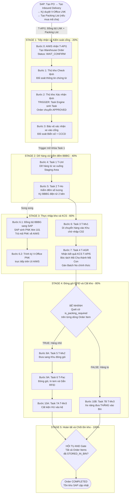
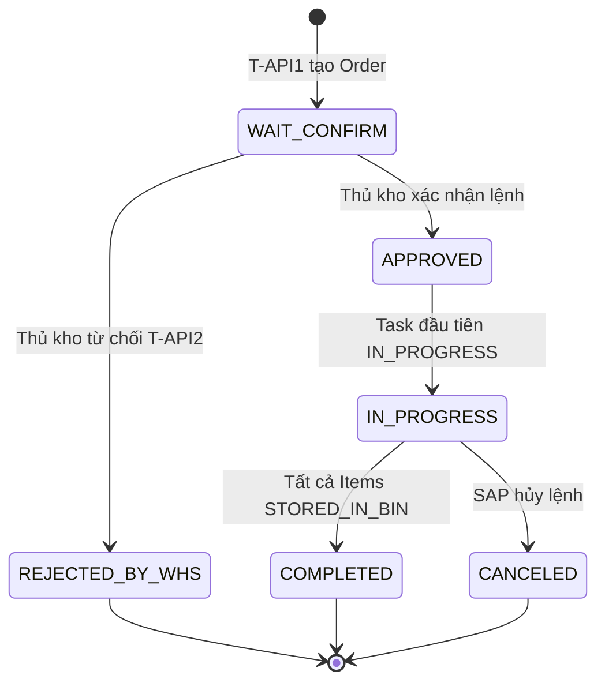
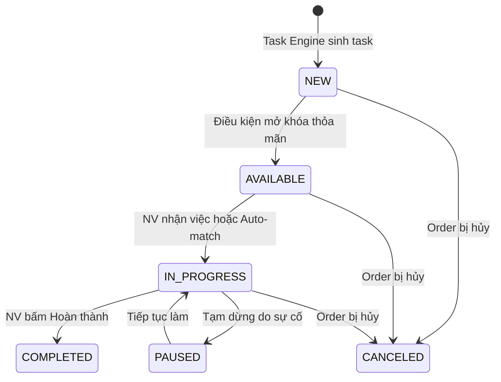
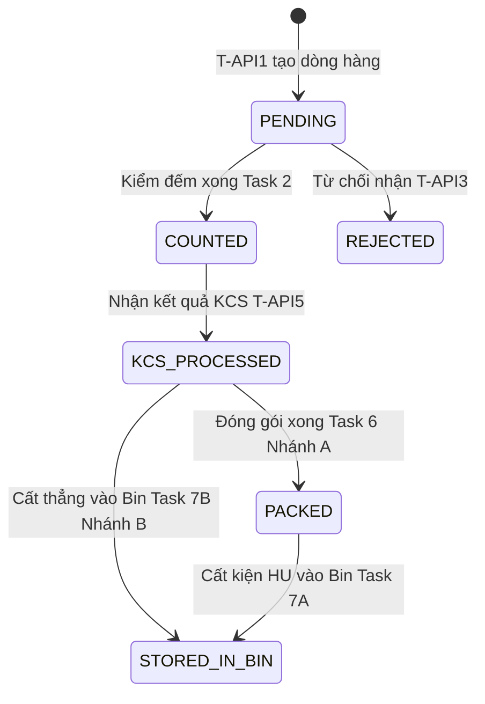
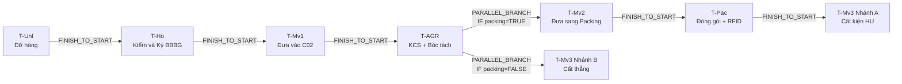

 TÀI LIỆU NGHIỆP VỤ — LUỒNG NHẬP KHO MUA MỚI TỪ NHÀ CUNG CẤP (MM.10A)
## Hệ Thống Kho Thông Minh AI-WS (AIWS)

> **Mã quy trình:** `MM.10A` (Nhập mua NCC)  
> **Phiên bản:** v1.0  
> **Ngày lập:** 15/08/2026  
> **Trạng thái:** Thiết kế hoàn chỉnh — Sẵn sàng triển khai  
> **Đối tượng đọc:** Developer, Tech Lead, QA/Tester  
> **Mục đích:** Cung cấp đầy đủ thông tin nghiệp vụ để dev có thể **tự xây dựng cơ sở dữ liệu** và **tự triển khai logic** mà không cần hỏi thêm BA.

---

## MỤC LỤC

- [1. TỔNG QUAN QUY TRÌNH](#1-tổng-quan-quy-trình)
- [2. TÁC NHÂN VÀ VAI TRÒ](#2-tác-nhân-và-vai-trò)
- [3. LUỒNG CHÍNH END-TO-END (HAPPY PATH)](#3-luồng-chính-end-to-end-happy-path)
- [4. CHI TIẾT TỪNG BƯỚC NGHIỆP VỤ](#4-chi-tiết-từng-bước-nghiệp-vụ)
- [5. LUỒNG NGOẠI LỆ VÀ TỪ CHỐI](#5-luồng-ngoại-lệ-và-từ-chối)
- [6. QUY TẮC NGHIỆP VỤ BẤT BIẾN (BUSINESS RULES)](#6-quy-tắc-nghiệp-vụ-bất-biến-business-rules)
- [7. MÔ HÌNH TRẠNG THÁI (STATE MACHINES)](#7-mô-hình-trạng-thái-state-machines)
- [8. CƠ CHẾ SINH TASK VÀ ĐIỀU PHỐI (TASK ENGINE)](#8-cơ-chế-sinh-task-và-điều-phối-task-engine)
- [9. CƠ CHẾ BÓC TÁCH MÃ CHA — MÃ CON VÀ GÁN SỐ LÔ](#9-cơ-chế-bóc-tách-mã-cha--mã-con-và-gán-số-lô)
- [10. CƠ CHẾ BẺ LUỒNG SONG SONG (PARALLEL BRANCHING)](#10-cơ-chế-bẻ-luồng-song-song-parallel-branching)
- [11. CƠ CHẾ GIAO VIỆC ĐA NHÂN SỰ (JOINT TASK)](#11-cơ-chế-giao-việc-đa-nhân-sự-joint-task)
- [12. TÍCH HỢP HỆ THỐNG NGOÀI (SAP, V-OFFICE)](#12-tích-hợp-hệ-thống-ngoài-sap-v-office)
- [13. SLA, KPI VÀ CẢNH BÁO](#13-sla-kpi-và-cảnh-báo)
- [14. DỮ LIỆU ĐẦU VÀO / ĐẦU RA TỪNG BƯỚC](#14-dữ-liệu-đầu-vào--đầu-ra-từng-bước)
- [15. PHỤ LỤC: BẢNG ÁNH XẠ DỮ LIỆU NGHIỆP VỤ ↔ THỰC THỂ DỮ LIỆU](#15-phụ-lục-bảng-ánh-xạ-dữ-liệu-nghiệp-vụ--thực-thể-dữ-liệu)

---

## 1. TỔNG QUAN QUY TRÌNH

### 1.1. Định nghĩa

Quy trình **MM.10A — Nhập kho mua mới từ NCC** mô tả toàn bộ hành trình của một lô hàng vật tư viễn thông được mua từ Nhà cung cấp (NCC), kể từ khi SAP đẩy Lệnh nhập kho (Inbound Delivery) sang hệ thống AIWS, qua các bước tiếp nhận, kiểm đếm, ký biên bản bàn giao, kiểm định chất lượng (KCS), đóng gói, gán RFID, đến khi hàng hóa được cất vào đúng vị trí ô kệ (Bin Putaway) trong kho và tồn kho chính thức được cập nhật.

### 1.2. Phạm vi

| Hạng mục | Chi tiết |
|---|---|
| **Hệ thống chủ trì** | AI-WS (Lớp vận hành thực thi kho vật lý) |
| **Hệ thống tích hợp** | SAP S/4HANA (ERP — Chứng từ, Kế toán, KCS), V-Office (Ký duyệt điện tử) |
| **Workflow Domain** | `INBOUND` (Tầng 1) |
| **Process Profile** | `MM.10A` (Tầng 2) |
| **Nguồn khởi tạo** | SAP Inbound Delivery (VL31N) tham chiếu PO |
| **Đối tượng hàng hóa** | Vật tư viễn thông: thiết bị mạng (RRU, Antenna, Switch), linh kiện, cáp, phụ kiện |
| **Đặc thù nổi bật** | Bóc tách Mã Cha → Mã Con, bẻ luồng song song Đóng gói vs Cất thẳng, giao việc 2 người, tích hợp V-Office trực tiếp từ UI |

### 1.3. Điểm bắt đầu & Kết thúc

| | Mô tả |
|---|---|
| **Start** | SAP tạo Inbound Delivery (VL31N) từ PO, đẩy `T-API1` sang AIWS → AIWS tạo **Warehouse Order** ở trạng thái `WAIT_CONFIRM` |
| **End (AIWS)** | Toàn bộ dòng hàng đã được cất vào vị trí ô kệ (Bin Putaway), Warehouse Order chuyển `COMPLETED` |
| **End (SAP)** | Tồn kho SAP cập nhật chính thức: `UU` (Unrestricted Use) nếu đạt KCS, `Blocked Stock` nếu không đạt |

### 1.4. Điều kiện tiên quyết (Pre-conditions)

1. PO (Purchase Order) đã được tạo và duyệt trên SAP.
2. Inbound Delivery (VL31N) đã được tạo tham chiếu PO.
3. LNK (Lệnh nhập kho) đã được ký duyệt/ban hành trên V-Office.
4. Nếu LNK mua mã cha (material type = `ZPAR`), **Packing List** (BOM phân rã tỷ trọng kỹ thuật và tài chính) phải đã được tạo trên SAP.
5. Kết nối API giữa SAP ↔ AIWS hoạt động bình thường.

---

## 2. TÁC NHÂN VÀ VAI TRÒ

| Tác nhân | Role Code | Mô tả vai trò trong quy trình MM.10A |
|---|---|---|
| **Bộ phận Mua sắm** | *(Ngoài AIWS — trên SAP)* | Tạo PO, tạo Inbound Delivery, tạo Packing List, trình ký LNK trên V-Office. Hoạt động trên SAP, **AIWS không quản lý tác nhân này**. |
| **Thủ kho** | `ROLE_WAREHOUSE_MASTER` | Tiếp nhận lệnh trên AIWS, check lệnh, xác nhận lệnh (trigger sinh Task), phân công ca trực, chỉ định Staging Area, kiểm hàng & ký BBBG, xác nhận thực nhập kho, trình ký V-Office Phiếu nhập kho. |
| **Bảo vệ cổng kho** | `ROLE_SECURITY` | Đối soát biển số xe & CCCD tài xế NCC tại cổng kho, ghi nhận giờ xe vào/ra cổng (`T-Scr`). |
| **Nhân viên kho** | `ROLE_WAREHOUSE_WORKER` | Dỡ hàng từ xe, di chuyển hàng giữa các khu vực, kiểm đếm hỗ trợ, đóng gói (Carton/Pallet), in tem nhãn SKU, gán RFID. |
| **Lái xe nâng** | `ROLE_FORKLIFT_DRIVER` | Cất hàng (đã đóng gói hoặc nguyên kiện to) vào vị trí Bin Putaway trên kệ/bãi sàn. |
| **Đại diện NCC** | `ROLE_PARTNER` | Ký BBBG điện tử trên App AIWS, theo dõi trạng thái giao hàng. Truy cập hệ thống với quyền hạn chế. |
| **Giám đốc kho** | `ROLE_WAREHOUSE_DIRECTOR` | Phê duyệt trên V-Office, giám sát Dashboard, phê duyệt gia hạn SLA. |

---

## 3. LUỒNG CHÍNH END-TO-END (HAPPY PATH)



---

## 4. CHI TIẾT TỪNG BƯỚC NGHIỆP VỤ

### Bước 0: Tiếp nhận lệnh từ SAP (T-API1)

| Hạng mục | Chi tiết |
|---|---|
| **Trigger** | SAP gọi API `T-API1` khi LNK đã được ký duyệt V-Office và đã tạo Packing List (nếu mua mã cha) |
| **Hệ thống thực hiện** | SAP → AIWS (tự động) |
| **Dữ liệu nhận** | Số Inbound Delivery, Số PO, Mã NCC (Vendor), Mã Plant, Mã SLoc, Danh sách dòng hàng (Mã vật tư cha + danh mục mã con dự kiến nếu có Packing List, số lượng kế hoạch, đơn vị tính) |
| **Hành vi AIWS** | 1. Tạo 1 bản ghi **Warehouse Order** (status = `WAIT_CONFIRM`)<br>2. Tạo n bản ghi **Warehouse Order Item** cho từng dòng hàng (item_level = `ORIGINAL`, batch_no = `NULL`)<br>3. Ghi log vào **SAP Integration Log** (api_code = `T-API1`, direction = `INBOUND`) |
| **Quy tắc đặc biệt** | • Nếu `sap_delivery_no` đã tồn tại trên AIWS → Không tạo mới, không cập nhật, trả về trạng thái "Đã đồng bộ"<br>• Nếu AIWS trả lỗi → SAP lưu thông tin lỗi để chạy đồng bộ lại (Re-process)<br>• Lưu toàn bộ request/response JSON vào Integration Log |
| **Chưa thực hiện** | Chưa gán Batch No, chưa sinh Task vận hành |

---

### Bước 1: Thủ kho Check lệnh

| Hạng mục | Chi tiết |
|---|---|
| **Tác nhân** | Thủ kho (`ROLE_WAREHOUSE_MASTER`) |
| **Nền tảng** | Web PC / Tablet |
| **Hành vi** | Thủ kho mở danh sách Order có status `WAIT_CONFIRM`, xem chi tiết lệnh để đối soát:<br>• Thông tin NCC có khớp không<br>• Danh sách hàng hóa, số lượng có hợp lý không<br>• Kho tiếp nhận (warehouse_id, sloc_id) có đúng không<br>• Ngày dự kiến giao hàng có phù hợp lịch kho không |
| **Kết quả** | Thủ kho quyết định: **Xác nhận** (→ Bước 2) hoặc **Từ chối** (→ Luồng từ chối 1) |
| **Dữ liệu thay đổi** | Chưa thay đổi trạng thái Order |

---

### Bước 2: Thủ kho Xác nhận lệnh — TRIGGER SINH TASK

| Hạng mục | Chi tiết |
|---|---|
| **Tác nhân** | Thủ kho (`ROLE_WAREHOUSE_MASTER`) |
| **Hành vi** | Thủ kho bấm nút **"Xác nhận lệnh"** trên giao diện AIWS. Khi xác nhận, Thủ kho đồng thời thiết lập:<br>• **Ca trực/ngày** nhận hàng<br>• **Staging Area** (Khu vực bãi tạm tiếp nhận) — chọn từ danh sách `Warehouse_Zone` loại `INBOUND_STAGING`<br>• **Cửa Dock** chỉ định — chọn từ danh sách `Warehouse_Dock` loại `INBOUND` hoặc `HYBRID`<br>• **Khung giờ hẹn xe** (VD: 08:00 - 10:00) |
| **Sự kiện hệ thống** | **TRIGGER EVENT — Task Engine được kích hoạt:**<br>1. Cập nhật Order: `order_status` = `APPROVED`, `confirmed_at` = NOW()<br>2. Ghi nhận `assigned_staging_zone_id`, `assigned_dock_id`, `manager_assignee_id`<br>3. Tạo bản ghi **Delivery Schedule Slot** (lịch hẹn xe cập bến)<br>4. **Task Engine** tra cứu **Catalog quy trình** (`Process_Profile` = `MM.10A`) → Lấy danh sách **Task_Template** → **Sinh toàn bộ chuỗi Task** (Warehouse_Task) ở trạng thái `NEW` |
| **Task được sinh** | Xem chi tiết tại [Mục 8: Cơ chế sinh Task](#8-cơ-chế-sinh-task-và-điều-phối-task-engine) |

---

### Bước 3: Bảo vệ xác nhận xe vào cổng (T-Scr)

| Hạng mục | Chi tiết |
|---|---|
| **Tác nhân** | Bảo vệ cổng kho (`ROLE_SECURITY`) |
| **Nền tảng** | Mobile App |
| **Trigger** | Xe NCC đến cổng kho |
| **Hành vi** | 1. Bảo vệ mở App AIWS, tìm Order đã được duyệt lịch trong ngày<br>2. Đối soát thông tin tài xế: **Biển số xe** và **Số CCCD** so với dữ liệu trên Order/Vehicle<br>3. Ghi nhận **ngoại quan xe** (kiểm tra seal niêm phong, tình trạng xe)<br>4. Bấm **"Cho xe vào"** |
| **Dữ liệu sinh ra** | Tạo bản ghi **Gate Security Event**: `entry_time` = NOW(), `plate_number`, `driver_name`, `driver_id_card`, `security_guard_id` |
| **Sự kiện hệ thống** | `entry_time` được ghi nhận → **Trigger mở khóa Task 1 [T-Unl]**: Task 1 chuyển từ `NEW` → `AVAILABLE` |
| **Quy tắc** | Task 1 không thể AVAILABLE nếu chưa có sự kiện xe vào cổng |

---

### Bước 4: Task 1 [T-Unl] — Dỡ hàng từ xe

| Hạng mục | Chi tiết |
|---|---|
| **Mã Task** | `T-Unl` (Unloading) |
| **Role thực hiện** | `ROLE_WAREHOUSE_WORKER` |
| **Chế độ giao việc** | 1 người hoặc **2 người cùng làm** (Joint Task — xem [Mục 11](#11-cơ-chế-giao-việc-đa-nhân-sự-joint-task)) |
| **Nền tảng** | Mobile App / Tablet |
| **Hành vi** | 1. NV kho nhìn thấy Task `AVAILABLE` trên danh sách Task trong ngày → Bấm **"Nhận việc"** (hoặc Auto-match)<br>2. Task chuyển `IN_PROGRESS`<br>3. NV thực hiện dỡ hàng từ xe xuống Staging Area đã chỉ định<br>4. NV có thể chụp ảnh hiện trường (Task Evidence: `PHOTO_UNLOAD`)<br>5. Bấm **"Hoàn thành"** |
| **Dữ liệu cập nhật** | • `Warehouse_Task`: `task_status` = `COMPLETED`, `completed_at` = NOW()<br>• Ghi nhận `actual_duration_minutes`<br>• Nếu Joint Task: Chỉ `COMPLETED` khi cả 2 NV hoàn thành (xem Mục 11) |
| **Sự kiện hệ thống** | Task 1 `COMPLETED` → **Mở khóa Task 2 [T-Ho]**: Task 2 chuyển `NEW` → `AVAILABLE` |

---

### Bước 5: Task 2 [T-Ho] — Kiểm đếm số lượng & Ký BBBG

| Hạng mục | Chi tiết |
|---|---|
| **Mã Task** | `T-Ho` (Handover) |
| **Role thực hiện** | `ROLE_WAREHOUSE_MASTER` (Thủ kho) + `ROLE_PARTNER` (Đại diện NCC) |
| **Nền tảng** | Tablet (có màn hình ký cảm ứng) |
| **Hành vi** | 1. Thủ kho kiểm đếm số lượng thực tế từng dòng hàng đã dỡ xuống:<br>&nbsp;&nbsp;&nbsp;• Nhập `actual_received_qty` cho từng `Warehouse_Order_Item`<br>&nbsp;&nbsp;&nbsp;• Nếu phát hiện hỏng hóc: Nhập `damaged_qty`, chụp ảnh (Task Evidence: `PHOTO_DAMAGE`)<br>2. So sánh `actual_received_qty` vs `planned_qty`:<br>&nbsp;&nbsp;&nbsp;• **Đúng đủ** → Tiếp tục ký BBBG<br>&nbsp;&nbsp;&nbsp;• **Sai lệch/Hư hỏng** → Luồng từ chối 2 (xem [Mục 5](#5-luồng-ngoại-lệ-và-từ-chối))<br>3. Thủ kho ký chữ ký cảm ứng trên màn hình → Lưu `warehouse_signature_data`<br>4. Đại diện NCC ký chữ ký cảm ứng → Lưu `partner_signature_data`<br>5. Hệ thống tự động tạo file PDF BBBG hoàn chỉnh → Lưu `pdf_file_url` |
| **Dữ liệu sinh ra** | Tạo bản ghi **Delivery Handover Record** (BBBG): `bbbg_code`, `handover_date`, chữ ký 2 bên, tổng số lượng kiểm nhận, chênh lệch |
| **Trạng thái BBBG** | `DRAFT` → `SIGNED` (sau khi cả 2 bên ký) |
| **Sự kiện hệ thống** | Task 2 `COMPLETED` → **Đồng thời:**<br>• Mở khóa Task 3 [T-Mv1]<br>• Kích hoạt đồng bộ BBBG sang SAP (Bước 6.1) |

---

### Bước 6: Task 3 [T-Mv1] — Di chuyển hàng vào Khu chờ nhập

| Hạng mục | Chi tiết |
|---|---|
| **Mã Task** | `T-Mv1` (Move to Waiting Zone) |
| **Role thực hiện** | `ROLE_WAREHOUSE_WORKER` |
| **Hành vi** | NV kho di chuyển toàn bộ lô hàng vừa ký BBBG từ Staging Area vào **Khu vực chờ nhập kho (C02 / Inbound Waiting Zone)**. |
| **Dữ liệu cập nhật** | Ghi nhận target_location = zone `WAITING_INBOUND` (`C02_WAIT`) trong `Task_Item_Detail` |
| **Sự kiện** | Task 3 `COMPLETED` → Chờ điều kiện tiếp theo: KCS SAP trả kết quả → mở khóa Task 4 |

---

### Bước 6.1: Đồng bộ BBBG sang SAP → Sinh Phiếu nhập kho (PNK)

| Hạng mục | Chi tiết |
|---|---|
| **Hệ thống** | AIWS → SAP (tự động, chạy song song với Task 3) |
| **Hành vi** | 1. AIWS gửi dữ liệu BBBG đã ký sang SAP<br>2. SAP tự động tạo **Phiếu nhập kho (Material Document)** — Movement Type `101`<br>3. SAP hạch toán kế toán: Nợ `152/156`, Có `3388`<br>4. SAP trả **Mã PNK** (Material Document Number) về AIWS |
| **Dữ liệu cập nhật** | • `Delivery_Handover_Record.status` = `SYNCED_SAP_OK`<br>• Lưu `sap_material_doc_no` vào `VOffice_Signing_Dossier` (chuẩn bị trình ký) |
| **Quy tắc** | Nếu đồng bộ thất bại: Status = `SYNCED_SAP_FAILED`, ghi log lỗi, cho phép retry |

---

### Bước 6.2: Trình ký V-Office Phiếu nhập kho

| Hạng mục | Chi tiết |
|---|---|
| **Tác nhân** | Thủ kho (`ROLE_WAREHOUSE_MASTER`) — thao tác **trực tiếp trên giao diện AIWS** |
| **Hành vi** | 1. Thủ kho mở màn hình PNK đã nhận mã từ SAP<br>2. Bấm **"Trình ký V-Office"** → AIWS tạo hồ sơ trình ký<br>3. AIWS gửi request sang V-Office API kèm file PDF PNK + Luồng ký mẫu (Signature Template)<br>4. Luồng ký: Thủ kho → Kế toán kho → Thủ trưởng đơn vị<br>5. V-Office trả callback kết quả ký về AIWS<br>6. AIWS tự động truyền kết quả ký về SAP |
| **Dữ liệu sinh ra** | Tạo bản ghi **VOffice Signing Dossier**: `dossier_code`, `sap_material_doc_no`, `template_id`, `submitted_by`, `voffice_status` |
| **Trạng thái** | `PENDING_APPROVAL` → `APPROVED` (khi ký xong) hoặc `REJECTED` (bị từ chối ký) |
| **Quy tắc** | Bước này **chạy song song** với các Task vận hành (Task 3, Task 4...), không chặn luồng chính |

---

### Bước 7: Task 4 [T-AGR] — Thực nhập kho & Nhận kết quả KCS (T-API5)

| Hạng mục | Chi tiết |
|---|---|
| **Mã Task** | `T-AGR` (Agree / Goods Receipt Confirmation) |
| **Role thực hiện** | `ROLE_WAREHOUSE_MASTER` (Thủ kho) |
| **Trigger mở khóa** | SAP gửi `T-API5` trả kết quả KCS về AIWS |
| **Hành vi** | 1. SAP chủ trì KCS, thực hiện kiểm định chất lượng:<br>&nbsp;&nbsp;&nbsp;• SAP **bóc tách danh mục Mã Cha → Mã Con** theo BOM / Packing List<br>&nbsp;&nbsp;&nbsp;• SAP phân định: Đạt KCS (`APPROVED_UU`) hay Không đạt (`REJECTED_BLOCKED`)<br>&nbsp;&nbsp;&nbsp;• SAP gửi `T-API5` kèm toàn bộ chi tiết<br>2. AIWS nhận `T-API5`:<br>&nbsp;&nbsp;&nbsp;• Tạo bản ghi **KCS Inspection Result**<br>&nbsp;&nbsp;&nbsp;• Sinh các dòng **Warehouse Order Item** mới (`item_level` = `DECOMPOSED_CHILD`) nếu có bóc tách<br>&nbsp;&nbsp;&nbsp;• **GÁN BATCH NO CHÍNH THỨC** cho từng dòng con<br>&nbsp;&nbsp;&nbsp;• Phân loại `is_packing_required` và `branch_group` cho từng dòng<br>3. Thủ kho xem xét kết quả KCS trên AIWS → Bấm **"Xác nhận thực nhập"** |
| **Sự kiện hệ thống** | Task 4 `COMPLETED` → **TRIGGER BẺ NHÁNH** (xem [Mục 10](#10-cơ-chế-bẻ-luồng-song-song-parallel-branching)) |

---

### Bước 8A: Task 5 [T-Mv2] — Đưa hàng sang Khu đóng gói (Nhánh A)

| Hạng mục | Chi tiết |
|---|---|
| **Mã Task** | `T-Mv2` (Move to Packing Zone) |
| **Nhánh** | **Nhánh A** — Chỉ áp dụng cho các dòng hàng có `is_packing_required = TRUE` |
| **Role thực hiện** | `ROLE_WAREHOUSE_WORKER` |
| **Hành vi** | NV kho di chuyển nhóm hàng chuẩn/linh kiện nhỏ từ Khu chờ nhập (C02) sang **Khu đóng gói (Packing Zone)**. |
| **Dữ liệu** | `Task_Item_Detail` chứa danh sách `order_item_id` thuộc Nhánh A |
| **Sự kiện** | Task 5 `COMPLETED` → Mở khóa Task 6 [T-Pac] |

---

### Bước 9A: Task 6 [T-Pac] — Đóng gói, In tem & Gắn RFID (Nhánh A)

| Hạng mục | Chi tiết |
|---|---|
| **Mã Task** | `T-Pac` (Packing and RFID Tagging) |
| **Nhánh** | **Nhánh A** |
| **Role thực hiện** | `ROLE_WAREHOUSE_WORKER` |
| **Hành vi** | 1. NV chọn **công cụ lưu trữ** (Storage Tool): Thùng Carton size L, Pallet gỗ...<br>2. Đóng hàng vào thùng/pallet theo quy cách tiêu chuẩn (`standard_packing_qty`)<br>3. Hệ thống tạo bản ghi **Handling Unit (HU)**: Mã kiện `hu_code`, gắn `storage_tool_id`<br>4. Tạo các bản ghi **Handling Unit Item**: Mã SKU con + số lượng + Serial (nếu có)<br>5. **In tem nhãn SKU** con bằng máy in Zebra ZT411<br>6. **Gán mã thẻ chip RFID** (`rfid_epc_code`) lên kiện HU<br>7. Ghi nhận `packed_by`, `packed_at`, `hu_status` = `PACKED` |
| **Sự kiện** | Task 6 `COMPLETED` → Mở khóa Task 7A [T-Mv3] (Nhánh A) |

---

### Bước 10A: Task 7A [T-Mv3] — Cất kiện HU vào kệ (Nhánh A)

| Hạng mục | Chi tiết |
|---|---|
| **Mã Task** | `T-Mv3` (Putaway) |
| **Nhánh** | **Nhánh A** |
| **Role thực hiện** | `ROLE_FORKLIFT_DRIVER` (Lái xe nâng) |
| **Hành vi** | 1. Hệ thống **gợi ý vị trí ô kệ (Bin Putaway)** tối ưu dựa trên:<br>&nbsp;&nbsp;&nbsp;• Loại vật tư, kích thước, trọng lượng kiện HU<br>&nbsp;&nbsp;&nbsp;• Dung tích còn trống / tải trọng còn lại của Bin<br>&nbsp;&nbsp;&nbsp;• Điều kiện bảo quản (nhiệt độ, độ ẩm nếu có)<br>2. Lái xe nâng vận chuyển kiện HU đến Bin chỉ định<br>3. Quét mã Bin (barcode/QR) → Xác nhận đã xếp vào<br>4. Hệ thống cập nhật:<br>&nbsp;&nbsp;&nbsp;• `Handling_Unit.current_bin_id` = Bin đã xếp, `hu_status` = `STORED`<br>&nbsp;&nbsp;&nbsp;• `Bin_Location`: Cập nhật `current_occupied_volume_m3`, `current_occupied_weight_kg`, `bin_status`<br>&nbsp;&nbsp;&nbsp;• Tạo bản ghi **Inventory Location Balance**: `stock_type`, `batch_no`, `quantity`<br>&nbsp;&nbsp;&nbsp;• `Warehouse_Order_Item.item_status` = `STORED_IN_BIN`, `storage_bin_id` = Bin ID |

---

### Bước 10B: Task 7B [T-Mv3] — Xe nâng đưa THẲNG vào Bin (Nhánh B)

| Hạng mục | Chi tiết |
|---|---|
| **Mã Task** | `T-Mv3` (Direct Putaway) |
| **Nhánh** | **Nhánh B** — Chỉ áp dụng cho dòng hàng có `is_packing_required = FALSE` |
| **Role thực hiện** | `ROLE_FORKLIFT_DRIVER` |
| **Hành vi** | Giống Bước 10A nhưng **bỏ qua Task 5 và Task 6** (không qua đóng gói).<br>Hàng to/quá khổ/nguyên đai kiện được xe nâng đưa **thẳng** vào Bin Putaway hoặc bãi sàn Pallet Block. |
| **Dữ liệu** | • Không tạo Handling Unit (đặt trực tiếp vào Bin)<br>• Tạo bản ghi **Inventory Location Balance** với `hu_id` = NULL<br>• Cập nhật `item_status` = `STORED_IN_BIN` |
| **Đặc biệt** | Task 7B được mở khóa `AVAILABLE` **đồng thời** với Task 5 (Nhánh A) ngay sau Task 4 COMPLETED |

---

### Bước 11: Hội tụ đóng lệnh (AND Gate)

| Hạng mục | Chi tiết |
|---|---|
| **Trigger** | Hệ thống kiểm tra: **Tất cả** `Warehouse_Order_Item` thuộc Order đều có `item_status` = `STORED_IN_BIN` |
| **Hành vi** | 1. Cập nhật `Warehouse_Order.order_status` = `COMPLETED`, `completed_at` = NOW()<br>2. Tồn kho SAP cập nhật chính thức:<br>&nbsp;&nbsp;&nbsp;• Hàng đạt KCS → `stock_type` = `UNRESTRICTED` (UU)<br>&nbsp;&nbsp;&nbsp;• Hàng không đạt KCS → `stock_type` = `BLOCKED`<br>3. Ghi nhận sự kiện xe ra cổng (`exit_time` trong Gate Security Event) khi xe NCC rời kho |

---

## 5. LUỒNG NGOẠI LỆ VÀ TỪ CHỐI

### 5.1. Luồng từ chối 1: Thủ kho từ chối lệnh (T-API2)

| Hạng mục | Chi tiết |
|---|---|
| **Thời điểm** | Bước 1 — Thủ kho check lệnh phát hiện bất thường |
| **Lý do** | Thông tin chứng từ sai, kho không đủ năng lực tiếp nhận, lịch giao hàng không phù hợp |
| **Hành vi** | 1. Thủ kho nhập `rejection_reason` trên AIWS<br>2. Bấm **"Từ chối lệnh"**<br>3. `Warehouse_Order.order_status` = `REJECTED_BY_WHS`<br>4. AIWS tự động gọi **`T-API2`** → SAP cập nhật trạng thái chứng từ thành `Rejected by Whs`<br>5. Ghi log vào **SAP Integration Log** (api_code = `T-API2`, direction = `OUTBOUND`) |
| **Kết thúc** | Quy trình dừng lại. Bộ phận Mua sắm trên SAP xử lý tiếp (sửa lệnh hoặc hủy). |

### 5.2. Luồng từ chối 2: Sai lệch kiểm đếm (T-API3)

| Hạng mục | Chi tiết |
|---|---|
| **Thời điểm** | Bước 5 — Kiểm đếm phát hiện sai lệch số lượng hoặc hư hỏng |
| **Hành vi** | 1. Thủ kho ghi nhận `damaged_qty`, mô tả chi tiết sai lệch<br>2. Chụp ảnh bằng chứng (Task Evidence: `PHOTO_DAMAGE`)<br>3. Bấm **"Báo sai lệch"**<br>4. AIWS gọi **`T-API3`** → SAP ghi nhận sai lệch thực tế<br>5. SAP xử lý khiếu nại NCC |
| **Quy tắc** | • Nếu sai lệch **nhỏ** (thiếu vài đơn vị): Thủ kho có thể chấp nhận nhận một phần → Ký BBBG với số lượng thực tế → Luồng tiếp tục bình thường<br>• Nếu sai lệch **nghiêm trọng** (toàn bộ lô hỏng, thiếu quá nhiều): Thủ kho từ chối nhận → Gọi `T-API3` → Quy trình dừng |

### 5.3. Hủy lệnh từ SAP

| Hạng mục | Chi tiết |
|---|---|
| **Trigger** | SAP phát lệnh Cancel tới AIWS |
| **Hành vi** | Tất cả Task chưa `COMPLETED` chuyển sang `CANCELED`. Order chuyển `CANCELED`. |

### 5.4. Đồng bộ SAP thất bại (Lỗi kết nối)

| Hạng mục | Chi tiết |
|---|---|
| **Hành vi** | Ghi log lỗi chi tiết vào `SAP_Integration_Log` (`integration_status` = `FAILED`, `error_message` = nội dung lỗi). Cho phép retry (Re-process) từ giao diện quản trị. |

---

## 6. QUY TẮC NGHIỆP VỤ BẤT BIẾN (BUSINESS RULES)

### 6.1. Quy tắc Lệnh (Order Rules)

| Mã | Quy tắc | Hành vi |
|---|---|---|
| **BR-O01** | Mã `sap_delivery_no` là duy nhất trên toàn hệ thống | Nếu đã tồn tại → Không tạo mới, không cập nhật, trả về status "Đã đồng bộ" |
| **BR-O02** | Chỉ Order ở trạng thái `WAIT_CONFIRM` mới cho phép Thủ kho xác nhận hoặc từ chối | Các trạng thái khác: Disable nút |
| **BR-O03** | Order chỉ chuyển `COMPLETED` khi 100% Order Items đều `STORED_IN_BIN` | Đây là điều kiện AND Gate hội tụ |
| **BR-O04** | Order bị `REJECTED_BY_WHS` hoặc `CANCELED` không thể quay lại trạng thái trước | Trạng thái cuối cùng, bất khả hồi |

### 6.2. Quy tắc Task (Task Rules)

| Mã | Quy tắc | Hành vi |
|---|---|---|
| **BR-T01** | Task chỉ sinh khi Thủ kho bấm "Xác nhận lệnh" | Trước đó: Không có Task nào tồn tại cho Order |
| **BR-T02** | Task sinh ra ở trạng thái `NEW`, chờ điều kiện mở khóa | Không hiển thị cho NV kho |
| **BR-T03** | Task chỉ chuyển `AVAILABLE` khi tất cả Task tiền đề (predecessor) đã `COMPLETED` | Tra cứu `Task_Dependency_Rule` |
| **BR-T04** | Đặc biệt Task 1 [T-Unl]: Chuyển `AVAILABLE` khi xe vào cổng (`Gate_Security_Event.entry_time` IS NOT NULL) | Không phụ thuộc Task trước mà phụ thuộc sự kiện an ninh |
| **BR-T05** | 1 NV chỉ có thể `IN_PROGRESS` tối đa 1 Task tại 1 thời điểm | `current_active_task_id` IS NOT NULL → Không cho nhận thêm |
| **BR-T06** | Task Joint (2 người): Chỉ `COMPLETED` khi tất cả `Task_Assignment.individual_status` = `COMPLETED` | Bắt buộc 100% nhân sự hoàn thành |
| **BR-T07** | NV chỉ nhìn thấy Task có `assigned_role_code` khớp với Role của mình | Role-Based Visibility |

### 6.3. Quy tắc Dữ liệu (Data Rules)

| Mã | Quy tắc | Hành vi |
|---|---|---|
| **BR-D01** | `batch_no` trong `Warehouse_Order_Item` = `NULL` từ `T-API1` đến trước `T-API5` | Chỉ gán chính thức sau khi nhận KCS |
| **BR-D02** | Dòng `DECOMPOSED_CHILD` bắt buộc có `parent_order_item_id` NOT NULL | Trỏ về dòng Mã Cha ban đầu |
| **BR-D03** | `is_packing_required` quyết định `branch_group`: TRUE → `PACKING_TRACK`, FALSE → `DIRECT_PUTAWAY_TRACK` | Phân nhánh tự động, không can thiệp thủ công |
| **BR-D04** | Kiện HU chỉ được tạo tại Task 6 [T-Pac] (Nhánh A). Nhánh B không tạo HU | Hàng to cất thẳng không đóng gói |
| **BR-D05** | `Inventory_Location_Balance` chỉ được tạo khi hàng thực sự xếp vào Bin (Task 7A/7B) | Trước đó chưa có tồn kho vị trí |

---

## 7. MÔ HÌNH TRẠNG THÁI (STATE MACHINES)

### 7.1. Vòng đời Warehouse Order



| Trạng thái | Mô tả | Chuyển tiếp |
|---|---|---|
| `WAIT_CONFIRM` | Order vừa được tạo từ T-API1, chờ Thủ kho xem xét | → `APPROVED` hoặc → `REJECTED_BY_WHS` |
| `APPROVED` | Thủ kho đã xác nhận, Task đã được sinh | → `IN_PROGRESS` |
| `IN_PROGRESS` | Có ít nhất 1 Task đang `IN_PROGRESS` | → `COMPLETED` hoặc → `CANCELED` |
| `COMPLETED` | Toàn bộ hàng đã cất vào Bin | Trạng thái cuối |
| `REJECTED_BY_WHS` | Thủ kho từ chối tiếp nhận | Trạng thái cuối |
| `CANCELED` | SAP hủy lệnh | Trạng thái cuối |

### 7.2. Vòng đời Warehouse Task



### 7.3. Vòng đời Warehouse Order Item



### 7.4. Vòng đời BBBG (Delivery Handover Record)

| Trạng thái | Mô tả |
|---|---|
| `DRAFT` | Đang lập, chưa ký |
| `SIGNED` | Cả 2 bên đã ký chữ ký cảm ứng |
| `SYNCED_SAP_OK` | Đã đồng bộ SAP thành công, nhận mã PNK |
| `SYNCED_SAP_FAILED` | Đồng bộ SAP thất bại, chờ retry |

### 7.5. Vòng đời V-Office Dossier

| Trạng thái | Mô tả |
|---|---|
| `PENDING_APPROVAL` | Đã gửi sang V-Office, chờ duyệt |
| `APPROVED` | Tất cả người ký đã ký duyệt |
| `REJECTED` | Bị từ chối ký |

---

## 8. CƠ CHẾ SINH TASK VÀ ĐIỀU PHỐI (TASK ENGINE)

### 8.1. Khi nào sinh Task?

**Trigger duy nhất:** Thủ kho bấm **"Xác nhận lệnh"** (Bước 2).

### 8.2. Danh sách Task sinh ra cho quy trình MM.10A

| STT | Mã Task | Tên Task | Stage (Tầng 3) | Role | Điều kiện mở khóa | Branch |
|---|---|---|---|---|---|---|
| 1 | `T-Unl` | Dỡ hàng từ xe | Stage 1: Tiếp nhận | `ROLE_WAREHOUSE_WORKER` | `Gate_Security_Event.entry_time` IS NOT NULL | `MAIN` |
| 2 | `T-Ho` | Kiểm đếm và Ký BBBG | Stage 2: Dỡ hàng và Kiểm đếm | `ROLE_WAREHOUSE_MASTER` | Task 1 `COMPLETED` | `MAIN` |
| 3 | `T-Mv1` | Đưa vào Khu chờ nhập | Stage 2: Dỡ hàng và Kiểm đếm | `ROLE_WAREHOUSE_WORKER` | Task 2 `COMPLETED` | `MAIN` |
| 4 | `T-AGR` | Thực nhập kho và Nhận KCS | Stage 3: Thực nhập và KCS | `ROLE_WAREHOUSE_MASTER` | Task 3 `COMPLETED` + `T-API5` nhận xong | `MAIN` |
| 5 | `T-Mv2` | Đưa sang Khu đóng gói | Stage 4: Đóng gói và RFID | `ROLE_WAREHOUSE_WORKER` | Task 4 `COMPLETED` + `is_packing_required = TRUE` | `PACKING_TRACK` |
| 6 | `T-Pac` | Đóng gói, In tem và Gắn RFID | Stage 4: Đóng gói và RFID | `ROLE_WAREHOUSE_WORKER` | Task 5 `COMPLETED` | `PACKING_TRACK` |
| 7A | `T-Mv3` | Cất kiện HU vào kệ | Stage 5: Lưu trữ Putaway | `ROLE_FORKLIFT_DRIVER` | Task 6 `COMPLETED` | `PACKING_TRACK` |
| 7B | `T-Mv3` | Đưa thẳng vào Bin | Stage 5: Lưu trữ Putaway | `ROLE_FORKLIFT_DRIVER` | Task 4 `COMPLETED` + `is_packing_required = FALSE` | `DIRECT_PUTAWAY_TRACK` |

### 8.3. Cơ chế mở khóa Task (Dependency Engine)



**Logic mở khóa (pseudo-code):**

```
WHEN task.status changes to COMPLETED:
    FOR EACH rule IN Task_Dependency_Rule WHERE predecessor_template_id = task.template_id:
        successor_task = find Warehouse_Task WHERE template_id = rule.successor_template_id AND order_id = task.order_id
        
        IF rule.dependency_type = 'FINISH_TO_START':
            all_predecessors_done = check ALL predecessors of successor_task are COMPLETED
            IF all_predecessors_done:
                IF successor_task has branch_condition:
                    evaluate branch_condition against Order Items
                    IF condition_met:
                        successor_task.status = 'AVAILABLE'
                ELSE:
                    successor_task.status = 'AVAILABLE'
        
        IF rule.dependency_type = 'PARALLEL_BRANCH':
            // Mở khóa đồng thời nhiều task ở các nhánh khác nhau
            successor_task.status = 'AVAILABLE'
```

### 8.4. Cơ chế Auto-Match (Grab-style)

```
WHEN task.status changes to AVAILABLE:
    candidates = find Employees WHERE:
        - role_code matches task.assigned_role_code
        - default_warehouse_id = order.warehouse_id
        - work_status = 'ONLINE_IDLE'
        - current_active_task_id IS NULL
    
    IF candidates.count > 0:
        // Gửi notification tới tất cả candidates
        SEND push_notification to ALL candidates
        // NV đầu tiên bấm "Nhận việc" sẽ được assign
    ELSE:
        // Task vẫn AVAILABLE, chờ NV rảnh
```

---

## 9. CƠ CHẾ BÓC TÁCH MÃ CHA — MÃ CON VÀ GÁN SỐ LÔ

### 9.1. Dòng thời gian (Timeline)

| Giai đoạn | Sự kiện | `batch_no` | `item_level` | Dòng Mã Con |
|---|---|---|---|---|
| **T-API1** (Lệnh ban đầu) | SAP đẩy LNK + Packing List | `NULL` | `ORIGINAL` | Có thể đã có dòng con dự kiến nhưng chưa chính thức |
| **Task 1-2-3** (Dỡ, Đếm, Di chuyển) | Thao tác vật lý | `NULL` | Không thay đổi | Không thay đổi |
| **T-API5 + Task 4** (KCS và Thực nhập) | SAP trả KCS, bóc tách BOM | **GÁN CHÍNH THỨC** | Sinh `DECOMPOSED_CHILD` | Sinh n dòng con mới |
| **Task 5-6-7** (Đóng gói, Cất kho) | Sử dụng batch_no đã gán | Đã có giá trị | Không thay đổi | Không thay đổi |

### 9.2. Logic xử lý T-API5

```
WHEN receive T-API5:
    1. Tạo KCS_Inspection_Result:
        - order_id, sap_inspection_lot, usage_decision, is_decomposed
        - received_api_payload = toàn bộ JSON gốc
    
    2. IF is_decomposed = TRUE:
        FOR EACH parent_item IN original_order_items WHERE is_parent_sku = TRUE:
            FOR EACH child_material IN T-API5.decomposed_children:
                CREATE new Warehouse_Order_Item:
                    - order_id = parent_item.order_id
                    - material_id = child_material.material_id
                    - parent_order_item_id = parent_item.order_item_id
                    - item_level = 'DECOMPOSED_CHILD'
                    - batch_no = child_material.batch_number  // GÁN BATCH
                    - planned_qty = child_material.quantity
                    - actual_received_qty = child_material.actual_qty
                    - kcs_passed_qty = child_material.passed_qty
                    - kcs_blocked_qty = child_material.blocked_qty
                    - is_packing_required = lookup Material_Master.is_packing_required
                    - branch_group = IF is_packing_required THEN 'PACKING_TRACK' ELSE 'DIRECT_PUTAWAY_TRACK'
                    - item_status = 'KCS_PROCESSED'
    
    3. IF is_decomposed = FALSE:
        // Cập nhật dòng gốc trực tiếp
        UPDATE Warehouse_Order_Item SET:
            - batch_no = T-API5.batch_number
            - kcs_passed_qty = T-API5.passed_qty
            - kcs_blocked_qty = T-API5.blocked_qty
            - item_status = 'KCS_PROCESSED'
```

---

## 10. CƠ CHẾ BẺ LUỒNG SONG SONG (PARALLEL BRANCHING)

### 10.1. Điều kiện kích hoạt

**Trigger:** Task 4 [T-AGR] chuyển `COMPLETED`.

**Logic bẻ nhánh:**

```
WHEN Task 4 COMPLETED:
    items_need_packing = Warehouse_Order_Item WHERE order_id AND is_packing_required = TRUE AND item_status = 'KCS_PROCESSED'
    items_direct_putaway = Warehouse_Order_Item WHERE order_id AND is_packing_required = FALSE AND item_status = 'KCS_PROCESSED'
    
    IF items_need_packing.count > 0:
        CREATE Task 5 [T-Mv2] (branch_track = 'PACKING_TRACK', status = 'AVAILABLE')
        LINK Task_Item_Detail cho Task 5 với items_need_packing
    
    IF items_direct_putaway.count > 0:
        CREATE Task 7B [T-Mv3] (branch_track = 'DIRECT_PUTAWAY_TRACK', status = 'AVAILABLE')
        LINK Task_Item_Detail cho Task 7B với items_direct_putaway
```

### 10.2. Quy tắc hội tụ (AND Gate)

```
AFTER any Task 7A or Task 7B COMPLETED:
    all_items = Warehouse_Order_Item WHERE order_id = current_order
    all_stored = all_items.ALL(item_status = 'STORED_IN_BIN')
    
    IF all_stored:
        UPDATE Warehouse_Order SET order_status = 'COMPLETED', completed_at = NOW()
```

### 10.3. Các kịch bản đặc biệt

| Kịch bản | Hành vi |
|---|---|
| **100% hàng cần đóng gói** (không có Nhánh B) | Chỉ sinh Task 5 → 6 → 7A. Không có Task 7B. Order COMPLETED khi 7A xong. |
| **100% hàng to** (không có Nhánh A) | Chỉ sinh Task 7B. Không có Task 5, 6, 7A. Order COMPLETED khi 7B xong. |
| **Hỗn hợp** (có cả 2 nhánh) | Sinh cả 2 nhánh song song. Order COMPLETED khi **CẢ 2** nhánh xong. |

---

## 11. CƠ CHẾ GIAO VIỆC ĐA NHÂN SỰ (JOINT TASK)

### 11.1. Khi nào áp dụng?

Áp dụng cho **Task dỡ hàng [T-Unl]** khi lô hàng lớn (VD: xe Container 40ft, 500+ thùng hàng) cần 2 nhân viên cùng dỡ.

### 11.2. Luồng xử lý

```
1. Thủ kho/Hệ thống giao Task cho 2 NV:
   - CREATE Task_Assignment(task_id, employee_A, role='LEADER', kpi_weight=50%)
   - CREATE Task_Assignment(task_id, employee_B, role='MEMBER', kpi_weight=50%)

2. Cả 2 NV nhìn thấy Task -> Cùng bấm "Nhận việc":
   - Task_Assignment[A].individual_status = 'IN_PROGRESS'
   - Task_Assignment[B].individual_status = 'IN_PROGRESS'
   - Warehouse_Task.task_status = 'IN_PROGRESS'

3. NV A xong phần mình -> Bấm "Hoàn thành":
   - Task_Assignment[A].individual_status = 'COMPLETED'
   - Task_Assignment[A].individual_completed_at = NOW()
   - Kiểm tra: NV B đã COMPLETED chưa? -> CHƯA -> Task vẫn IN_PROGRESS

4. NV B xong phần mình -> Bấm "Hoàn thành":
   - Task_Assignment[B].individual_status = 'COMPLETED'
   - Task_Assignment[B].individual_completed_at = NOW()
   - Kiểm tra: Tất cả Assignment đã COMPLETED? -> CÓ -> Task chuyển COMPLETED

5. Task COMPLETED -> Trigger mở khóa Task tiếp theo
```

### 11.3. Quy tắc bất biến

- **Không chia cứng số lượng:** Hệ thống **không** áp đặt "NV A dỡ 250 thùng, NV B dỡ 250 thùng". Hai NV tự phối hợp tại hiện trường.
- **Bắt buộc 100%:** Task chỉ `COMPLETED` khi **tất cả** `Task_Assignment` đều `COMPLETED`.
- **KPI phân bổ:** Mỗi NV nhận `kpi_weight_percent` tương ứng (mặc định 50% - 50%).

---

## 12. TÍCH HỢP HỆ THỐNG NGOÀI (SAP, V-OFFICE)

### 12.1. Bản đồ API

| Mã API | Hướng | Trigger | Dữ liệu truyền | Dữ liệu nhận lại |
|---|---|---|---|---|
| **`T-API1`** | SAP → AIWS | LNK ký duyệt V-Office + Packing List (nếu có) | Số Inbound Delivery, PO, Mã NCC, Plant, SLoc, Danh sách hàng (Mã cha + Mã con dự kiến), Số lượng, ĐVT | AIWS trả: Mã Order AIWS, Status đồng bộ |
| **`T-API2`** | AIWS → SAP | Thủ kho từ chối lệnh | Số Inbound Delivery, Lý do từ chối | SAP trả: Trạng thái cập nhật "Rejected by Whs" |
| **`T-API3`** | AIWS → SAP | Kiểm đếm phát hiện sai lệch | Số Inbound Delivery, Danh sách dòng hàng sai lệch (Mã VT, SL kế hoạch, SL thực tế, SL hỏng) | SAP trả: Xác nhận ghi nhận |
| **`T-API5`** | SAP → AIWS | SAP hoàn tất KCS | Số Inbound Delivery, Kết quả KCS (UU/Blocked), Danh sách bóc tách Mã Con + Batch No + Số lượng từng loại | AIWS trả: Xác nhận nhận thành công |
| **V-Office Submit** | AIWS → V-Office | Thủ kho trình ký PNK | File PDF PNK, Mã phiếu SAP, Luồng ký (Thủ kho → KT → TT), Metadata | V-Office trả: Mã hồ sơ V-Office |
| **V-Office Callback** | V-Office → AIWS | Ký duyệt hoàn tất | Mã hồ sơ, Trạng thái (Approved/Rejected), File PDF có chữ ký số | AIWS cập nhật Dossier + đồng bộ SAP |

### 12.2. Quy tắc retry và Idempotency

- Mọi API đều **idempotent**: Gọi lại cùng request không tạo bản ghi trùng.
- Mọi API đều có **retry mechanism**: Nếu lỗi kết nối, hệ thống tự retry tối đa 3 lần, sau đó ghi log chờ xử lý thủ công.
- Mọi API đều **ghi log đầy đủ** vào `SAP_Integration_Log`: request body, response body, HTTP status, thời gian xử lý.

---

## 13. SLA, KPI VÀ CẢNH BÁO

### 13.1. Thời gian SLA tiêu chuẩn (Tham khảo)

| Task | SLA Tiêu chuẩn | Ngưỡng cảnh báo |
|---|---|---|
| `T-Unl` (Dỡ hàng) | 120 phút | 100 phút (83%) |
| `T-Ho` (Kiểm đếm và Ký BBBG) | 60 phút | 50 phút |
| `T-Mv1` (Di chuyển vào C02) | 30 phút | 25 phút |
| `T-AGR` (Thực nhập và KCS) | Không áp SLA (phụ thuộc SAP KCS) | — |
| `T-Mv2` (Đưa sang Packing) | 30 phút | 25 phút |
| `T-Pac` (Đóng gói và RFID) | 90 phút | 75 phút |
| `T-Mv3` (Cất vào Bin) | 45 phút | 38 phút |

> **Lưu ý:** SLA được cấu hình trong `KPI_Config` và có thể tùy chỉnh theo từng kho, từng quy trình.

### 13.2. Cơ chế cảnh báo

```
CRON JOB (chạy mỗi 5 phút):
    FOR EACH task IN Warehouse_Task WHERE task_status = 'IN_PROGRESS':
        elapsed = NOW() - task.started_at
        sla = task.proposed_kpi_minutes
        warning = KPI_Config.warning_threshold_minutes
        
        IF elapsed >= warning AND task.sla_status = 'ON_TIME':
            task.sla_status = 'NEAR_OVERDUE'
            CREATE SLA_Alert_Log(alert_level='WARNING', task_id, order_id)
            SEND notification to task.assignee_id + Thủ kho + GĐ Kho
        
        IF elapsed >= sla AND task.sla_status != 'OVERDUE':
            task.sla_status = 'OVERDUE'
            CREATE SLA_Alert_Log(alert_level='CRITICAL', task_id, order_id)
            SEND notification (CRITICAL) to GĐ Kho
```

### 13.3. Gia hạn SLA

NV có thể gửi yêu cầu gia hạn thông qua `Task_SLA_Extension`:
- Nhập `requested_extra_minutes` và `reason`
- GĐ Kho phê duyệt (`approval_status` = `APPROVED`) hoặc từ chối
- Nếu duyệt: `task.sla_deadline` được cập nhật cộng thêm thời gian gia hạn

---

## 14. DỮ LIỆU ĐẦU VÀO / ĐẦU RA TỪNG BƯỚC

| Bước | Dữ liệu đầu vào | Dữ liệu đầu ra / Bản ghi sinh ra |
|---|---|---|
| **Bước 0** (T-API1) | JSON: sap_delivery_no, sap_po_no, vendor_code, plant, sloc, items[] | `Warehouse_Order` (WAIT_CONFIRM), n x `Warehouse_Order_Item` (PENDING), `SAP_Integration_Log` |
| **Bước 1** (Check lệnh) | Thủ kho đọc thông tin Order | Không thay đổi dữ liệu |
| **Bước 2** (Xác nhận) | staging_zone_id, dock_id, expected_time_window | Order -> APPROVED, `Delivery_Schedule_Slot`, n x `Warehouse_Task` (NEW) |
| **Bước 3** (An ninh cổng) | plate_number, driver_name, driver_id_card | `Gate_Security_Event`, Task 1 -> AVAILABLE |
| **Bước 4** (Dỡ hàng) | Thao tác vật lý, ảnh chụp | `Task_Evidence` (PHOTO_UNLOAD), Task 1 -> COMPLETED |
| **Bước 5** (Kiểm đếm và BBBG) | actual_received_qty[], damaged_qty[], chữ ký 2 bên | `Delivery_Handover_Record` (SIGNED), cập nhật actual_received_qty, `Task_Evidence` |
| **Bước 6** (Di chuyển C02) | Thao tác vật lý | Cập nhật target_location trong `Task_Item_Detail` |
| **Bước 6.1** (Đồng bộ SAP) | BBBG data | `SAP_Integration_Log`, BBBG -> SYNCED_SAP_OK, nhận sap_material_doc_no |
| **Bước 6.2** (V-Office) | sap_material_doc_no, template_id | `VOffice_Signing_Dossier` (PENDING_APPROVAL) |
| **Bước 7** (KCS T-API5) | JSON: kcs_result, decomposed_items[], batch_numbers[] | `KCS_Inspection_Result`, n x `Warehouse_Order_Item` (DECOMPOSED_CHILD with batch_no) |
| **Bước 8A** (Đưa sang Packing) | Thao tác vật lý | Cập nhật `Task_Item_Detail` |
| **Bước 9A** (Đóng gói) | storage_tool_id, items per HU, rfid_epc_code | `Handling_Unit` (PACKED), n x `Handling_Unit_Item` |
| **Bước 10A/10B** (Cất vào Bin) | bin_id (gợi ý hoặc chọn) | `Handling_Unit` -> STORED, `Inventory_Location_Balance`, `Bin_Location` cập nhật, `Warehouse_Order_Item` -> STORED_IN_BIN |
| **Bước 11** (Hoàn tất) | Tự động kiểm tra | `Warehouse_Order` -> COMPLETED |

---

## 15. PHỤ LỤC: BẢNG ÁNH XẠ DỮ LIỆU NGHIỆP VỤ ↔ THỰC THỂ DỮ LIỆU

Bảng dưới đây giúp dev ánh xạ từ **khái niệm nghiệp vụ** sang **thực thể/bảng** cần xây dựng trong database.

| Khái niệm nghiệp vụ | Thực thể DB tương ứng | Ghi chú |
|---|---|---|
| Lệnh nhập kho (LNK) | `Warehouse_Order` | 1 LNK = 1 Order |
| Dòng hàng trong lệnh | `Warehouse_Order_Item` | Quản lý cả Mã Cha và Mã Con (self-ref qua `parent_order_item_id`) |
| Quy trình MM.10A | `Process_Profile` | Tầng 2 trong mô hình 4 tầng |
| Giai đoạn tiến độ | `Process_Stage` | Tầng 3 — phục vụ Dashboard |
| Mẫu Task | `Task_Template` | Tầng 4 — cấu hình sẵn trong Catalog |
| Task thực tế | `Warehouse_Task` | Sinh ra khi Thủ kho xác nhận lệnh |
| Giao việc 2 người | `Task_Assignment` | Liên kết n NV với 1 Task |
| Phân bổ hàng vào Task | `Task_Item_Detail` | Đặc biệt quan trọng khi bẻ nhánh song song |
| Biên bản bàn giao (BBBG) | `Delivery_Handover_Record` | Chữ ký cảm ứng 2 bên |
| Phiếu nhập kho (PNK) | `VOffice_Signing_Dossier` | Trình ký trên V-Office |
| Kết quả KCS | `KCS_Inspection_Result` | Nhận từ SAP qua T-API5 |
| Kiện đóng gói | `Handling_Unit` + `Handling_Unit_Item` | Chỉ Nhánh A |
| Tồn kho vị trí | `Inventory_Location_Balance` | Cả 2 nhánh |
| Vị trí ô kệ | `Bin_Location` | Putaway cuối cùng |
| Sự kiện an ninh cổng | `Gate_Security_Event` | Trigger mở khóa Task 1 |
| Lịch hẹn xe | `Delivery_Schedule_Slot` | Tạo khi xác nhận lệnh |
| Bằng chứng (ảnh, scan) | `Task_Evidence` | Gắn theo Task |
| Log API SAP | `SAP_Integration_Log` | Ghi mọi cuộc gọi API |
| Cảnh báo SLA | `SLA_Alert_Log` | Chạy bởi Cron job |
| Thông báo | `User_Notification` | Push/Bell notification |
| Gia hạn SLA | `Task_SLA_Extension` | Workflow duyệt gia hạn |

---

## LỊCH SỬ CẬP NHẬT TÀI LIỆU

| Version | Ngày | Mô tả |
|---|---|---|
| **v1.0** | 15/08/2026 | Khởi tạo tài liệu nghiệp vụ MM.10A đầy đủ: Luồng chính 11 bước, 2 luồng từ chối, 4 quy tắc Order, 7 quy tắc Task, 5 quy tắc Data, 5 State Machine, cơ chế sinh Task và Auto-match, bóc tách Mã Cha-Con và Batch, bẻ nhánh song song, giao việc 2 người, tích hợp 5 API SAP + V-Office, SLA/KPI, ánh xạ nghiệp vụ và DB. |
