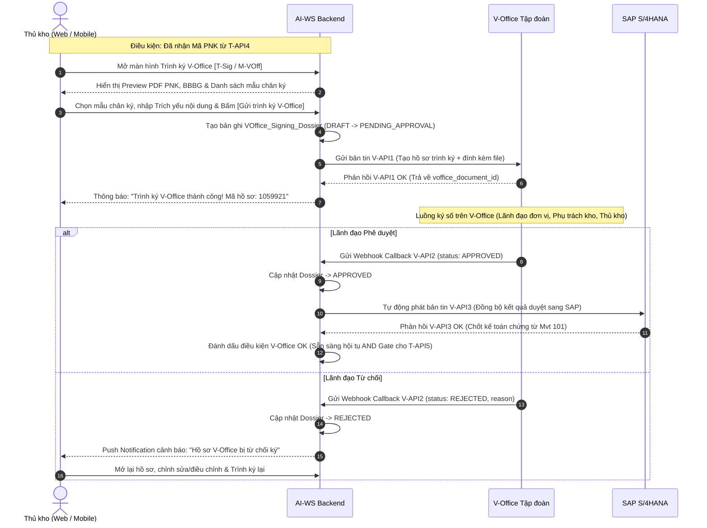
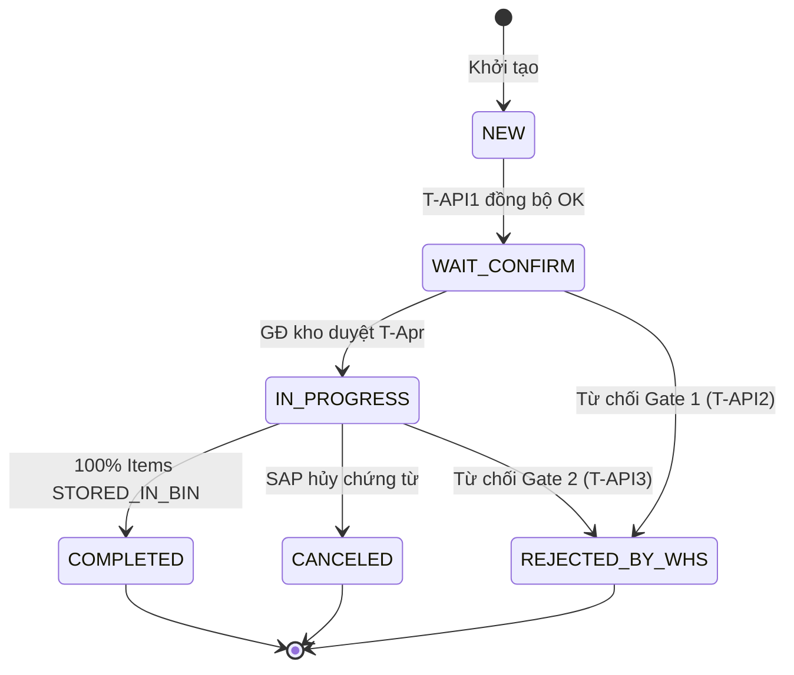
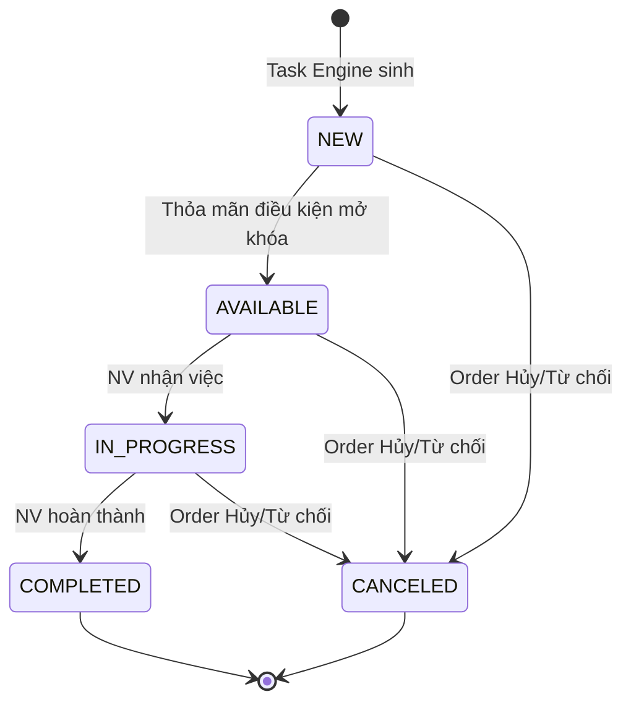
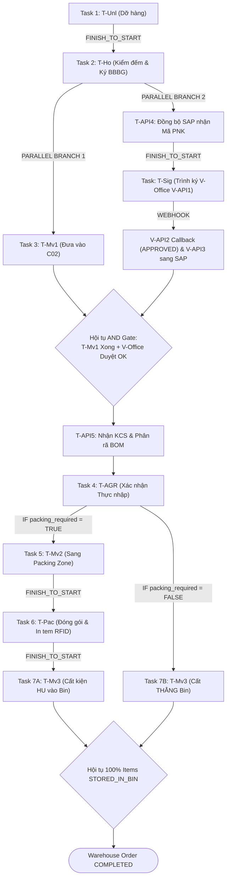

TÀI LIỆU PHÂN TÍCH YÊU CẦU NGƯỜI SỬ DỤNG — PHÂN HỆ NHẬP KHO MUA MỚI TỪ NCC (MM.10A)

> **Mã hiệu dự án:** QTR.VIC.Warehouse  
> **Mã hiệu tài liệu:** VIC_Warehouse_PTYC_Phân hệ Nhập Kho Mua Mới NCC_v2.0.0  
> **Mã quy trình:** `MM.10A`  
> **Phiên bản:** v2.0.0  
> **Ngày cập nhật:** 22/08/2026  

---

## BẢNG GHI NHẬN THAY ĐỔI

*A – Tạo mới, M – Sửa đổi, D – Xóa bỏ*

| Ngày thay đổi | Vị trí thay đổi | A/M/D | Phiên bản cũ | Mô tả thay đổi | Phiên bản mới |
|---|---|---|---|---|---|
| T8/2026 |  | A |  | Khởi tạo tài liệu PTYC Nhập kho Mua mới NCC MM.10A | v1.0.0 |
| 22/08/2026 | Toàn bộ | M | v1.0.0 | Viết lại theo template PTYC chuẩn, chuẩn hóa 16 bước End-to-End, đồng bộ 8 API | v2.0.0 |
| 22/08/2026 | Mục 4, 5, 9, 11, 14, 16 | M | v2.0.0 | Bổ sung và chuẩn hóa toàn diện tính năng Trình ký V-Office (`T-Sig` / `[M-VOff]`) trên Web/Mobile, đồng bộ luồng Dependency Engine và 8 API | v2.0.1 |

---

## MỤC LỤC

**PHẦN I — GIỚI THIỆU & TỔNG QUAN**

- [1. GIỚI THIỆU](#1-giới-thiệu)
- [2. TỔNG QUAN QUY TRÌNH](#2-tổng-quan-quy-trình)
- [3. TÁC NHÂN VÀ VAI TRÒ](#3-tác-nhân-và-vai-trò)

**PHẦN II — QUY TRÌNH & ĐẶC TẢ CHỨC NĂNG**

- [4. LUỒNG CHÍNH END-TO-END (HAPPY PATH - 16 BƯỚC)](#4-luồng-chính-end-to-end-happy-path---16-bước)
- [5. CHI TIẾT TỪNG BƯỚC NGHIỆP VỤ (ĐẶC TẢ USE CASE)](#5-chi-tiết-từng-bước-nghiệp-vụ-đặc-tả-use-case)
  - [A. Nhóm chức năng Điều hành & Kiểm soát cổng](#a-nhóm-chức-năng-điều-hành--kiểm-soát-cổng)
  - [B. Nhóm Task thực địa kho (Physical Task Chain)](#b-nhóm-task-thực-địa-kho-physical-task-chain)
  - [C. Nhóm Chức năng Trình ký & Tích hợp điện tử](#c-nhóm-chức-năng-trình-ký--tích-hợp-điện-tử)
- [6. LUỒNG NGOẠI LỆ VÀ TỪ CHỐI](#6-luồng-ngoại-lệ-và-từ-chối)

**PHẦN III — QUY TẮC & MÔ HÌNH NGHIỆP VỤ**

- [7. QUY TẮC NGHIỆP VỤ BẤT BIẾN (BUSINESS RULES)](#7-quy-tắc-nghiệp-vụ-bất-biến-business-rules)
- [8. MÔ HÌNH TRẠNG THÁI (STATE MACHINES)](#8-mô-hình-trạng-thái-state-machines)
- [9. CƠ CHẾ SINH TASK VÀ ĐIỀU PHỐI (TASK ENGINE)](#9-cơ-chế-sinh-task-và-điều-phối-task-engine)
- [10. CƠ CHẾ BÓC TÁCH MÃ CHA — MÃ CON VÀ GÁN SỐ LÔ](#10-cơ-chế-bóc-tách-mã-cha--mã-con-và-gán-số-lô)
- [11. CƠ CHẾ BẺ LUỒNG SONG SONG (PARALLEL BRANCHING)](#11-cơ-chế-bẻ-luồng-song-song-parallel-branching)
- [12. CƠ CHẾ GIAO VIỆC ĐA NHÂN SỰ (JOINT TASK)](#12-cơ-chế-giao-việc-đa-nhân-sự-joint-task)

**PHẦN IV — TÍCH HỢP, SLA & DỮ LIỆU**

- [13. TÍCH HỢP HỆ THỐNG NGOÀI (SAP, V-OFFICE)](#13-tích-hợp-hệ-thống-ngoài-sap-v-office)
- [14. SLA, KPI VÀ CẢNH BÁO](#14-sla-kpi-và-cảnh-báo)
- [15. DỮ LIỆU ĐẦU VÀO / ĐẦU RA TỪNG BƯỚC](#15-dữ-liệu-đầu-vào--đầu-ra-từng-bước)
- [16. PHỤ LỤC: BẢNG ÁNH XẠ DỮ LIỆU NGHIỆP VỤ ↔ THỰC THỂ DỮ LIỆU](#16-phụ-lục-bảng-ánh-xạ-dữ-liệu-nghiệp-vụ--thực-thể-dữ-liệu)

**PHẦN V — YÊU CẦU PHI CHỨC NĂNG & NGHIỆM THU**

- [17. CÁC YÊU CẦU PHI CHỨC NĂNG](#17-các-yêu-cầu-phi-chức-năng)
- [18. TIÊU CHUẨN NGHIỆM THU HỆ THỐNG](#18-tiêu-chuẩn-nghiệm-thu-hệ-thống)

---

# PHẦN I — GIỚI THIỆU & TỔNG QUAN

## 1. GIỚI THIỆU

### 1.1. Mục đích tài liệu

Tài liệu này mô tả chi tiết yêu cầu nghiệp vụ, luồng xử lý, đặc tả chức năng và các ràng buộc kỹ thuật cho **Phân hệ Nhập kho Mua mới từ Nhà cung cấp (MM.10A)** thuộc hệ thống Kho thông minh AI-WS (AIWS). Tài liệu phục vụ làm cơ sở cho việc thiết kế kỹ thuật, phát triển phần mềm, kiểm thử và nghiệm thu hệ thống.

### 1.2. Phạm vi tài liệu

Tài liệu tập trung mô tả yêu cầu nghiệp vụ số hoá cho quy trình **Nhập kho mua mới từ Nhà cung cấp (NCC)** — từ khi SAP S/4HANA đẩy Lệnh nhập kho (Inbound Delivery) sang AI-WS, qua các bước tiếp nhận, kiểm soát an ninh cổng, dỡ hàng, kiểm đếm, ký BBBG điện tử, **Trình ký V-Office Phiếu nhập kho**, KCS bóc tách mã cha-con, đóng gói in tem RFID, đến khi hàng hóa được cất xếp vào Bin Putaway và tồn kho chính thức cập nhật.

### 1.3. Định nghĩa thuật ngữ và các từ viết tắt

| Thuật ngữ | Định nghĩa | Ghi chú |
|---|---|---|
| AIWS / AI-WS | Hệ thống Kho thông minh (AI Warehouse System) | WMS Platform |
| NCC | Nhà cung cấp |  |
| LNK | Lệnh nhập kho |  |
| PO | Purchase Order (Đơn mua hàng) |  |
| BBBG | Biên bản bàn giao |  |
| PNK | Phiếu nhập kho (Material Document - Mvt 101) |  |
| KCS | Kiểm tra chất lượng sản phẩm (Quality Control) |  |
| HU | Handling Unit (Kiện hàng đóng gói) |  |
| RFID | Radio-Frequency Identification |  |
| V-Office | Hệ thống Quản lý văn bản điện tử Tập đoàn Viettel | Ký duyệt số |
| SAP S/4HANA | Hệ thống ERP quản trị nguồn lực doanh nghiệp |  |
| UU | Unrestricted Use (Tồn kho khả dụng) |  |
| BOM | Bill of Materials (Danh mục vật tư phân rã) |  |

### 1.4. Tài liệu tham khảo

| STT | Tên tài liệu | Phiên bản |
|---|---|---|
| 1 | SRS_MM.10A_QuyTrinh_Va_ManHinh_Task_NhapKho_NCC_v1.0.0 | v1.0.0 |
| 2 | SRS_MM.10A_QuyTrinh_Va_ManHinh_Task_NhapKho_NCC_Mobile_v1.0.0 | v1.0.0 |
| 3 | VIC_Warehouse_PTYC_Phân hệ Xuất Kho_v1.0.0 (Template cấu trúc) | v1.0.0 |

### 1.5. Mô tả tài liệu

Tài liệu này được xây dựng nhằm phục vụ các cấp quản lý, đội ngũ phát triển và kiểm thử trong việc triển khai, theo dõi và nghiệm thu phân hệ **Nhập kho Mua mới từ NCC (MM.10A)**.

---

## 2. TỔNG QUAN QUY TRÌNH

### 2.1. Phát biểu bài toán

#### 2.1.1. Tổng quan bài toán

Quy trình **MM.10A — Nhập kho mua mới từ NCC** mô tả toàn bộ hành trình liên hoàn 16 bước của lô hàng vật tư viễn thông từ Nhà cung cấp (NCC), kể từ khi SAP S/4HANA khởi tạo Lệnh nhập kho đồng bộ sang AI-WS, qua các khâu điều hành, kiểm soát an ninh cổng, dỡ hàng, kiểm đếm ký BBBG điện tử, **Trình ký V-Office Phiếu nhập kho**, kiểm định KCS bóc tách mã cha-con, đóng gói in tem RFID, cho đến khi vật tư được cất xếp chính thức vào vị trí ô kệ (Bin Putaway) và cập nhật tồn kho ERP.

#### 2.1.2. Hiện trạng quy trình nghiệp vụ

- N/a

#### 2.1.3. Hiện trạng hạ tầng dữ liệu

- N/a

### 2.2. Mục tiêu hệ thống

Xây dựng hệ thống số hoá quy trình **Nhập kho mua mới từ NCC** nhằm:

- Số hoá và chuẩn hóa toàn bộ quy trình nhập kho 16 bước End-to-End.
- Quản lý tập trung thông tin Lệnh nhập kho (`Warehouse_Order`).
- Tự động sinh chuỗi Task tác nghiệp thực địa (Task Engine).
- Đồng bộ dữ liệu với SAP S/4HANA (8 API: `T-API1` đến `T-API5` và `V-API1` đến `V-API3`).
- **Tích hợp tính năng Trình ký V-Office Tập đoàn trực tiếp trên giao diện Web PC và Mobile App của AI-WS**.
- Số hoá BBBG điện tử với chữ ký cảm ứng 2 bên (Thủ kho & Đại diện NCC).
- Tự động bóc tách Mã Cha → Mã Con và gán Batch No chính thức sau KCS.

### 2.3. Phạm vi hệ thống

| Hạng mục | Chi tiết đặc tả |
|---|---|
| **Hệ thống chủ trì** | AI-WS (WMS Platform — Thực thi kho vật lý và điều phối Task) |
| **Hệ thống tích hợp ERP** | SAP S/4HANA (Chứng từ PO/Inbound Delivery, kế toán Mvt 101, chủ trì KCS) |
| **Hệ thống ký điện tử** | V-Office (Trình ký PNK trực tiếp từ UI Web/Mobile của AI-WS) |
| **Workflow Domain** | `INBOUND` (Tầng 1) |
| **Process Profile** | `MM.10A` (Tầng 2) |
| **Nguồn phát động** | SAP Inbound Delivery (VL31N) tham chiếu PO |
| **Đối tượng hàng hóa** | Vật tư viễn thông: RRU, Antenna, Switch, Cáp quang, phụ kiện |
| **Đặc thù nghiệp vụ** | Bóc tách Mã Cha → Mã Con (`T-API5`), bẻ luồng song song Trình ký V-Office vs Vận hành thực địa, đóng gói RFID vs cất thẳng, Joint Task 2 người |

### 2.4. Điểm bắt đầu & Kết thúc

| Điểm | Mô tả |
|---|---|
| **Start** | SAP phát động `T-API1` truyền Lệnh nhập kho sang AI-WS. AI-WS tạo `Warehouse_Order` (`WAIT_CONFIRM`). |
| **End (AI-WS)** | Toàn bộ dòng hàng đã cất vào Bin Putaway, `Warehouse_Order` chuyển `COMPLETED`. |
| **End (SAP)** | Tồn kho SAP hạch toán chính thức: `UU` nếu KCS đạt, `Blocked Stock` nếu không đạt. |

### 2.5. Điều kiện tiên quyết (Pre-conditions)

1. PO đã được phê duyệt trên SAP.
2. Inbound Delivery (VL31N) đã được tạo tham chiếu PO.
3. Nếu mua Mã Cha (`ZPAR`), Packing List / BOM đã được thiết lập trên SAP.
4. Hạ tầng kết nối API giữa SAP ↔ AI-WS ↔ V-Office hoạt động bình thường.

---

## 3. TÁC NHÂN VÀ VAI TRÒ

| STT | Tác nhân | Role Code | Mô tả vai trò trong quy trình MM.10A |
|---|---|---|---|
| 1 | Bộ phận Mua sắm (SAP) | *(Ngoài AI-WS)* | Tạo PO, Inbound Delivery, Packing List trên SAP. |
| 2 | Thủ kho | `ROLE_WAREHOUSE_MASTER` | Duyệt lệnh Gate 1 (`T-Ncc`), kiểm đếm & ký BBBG (`T-Ho`), xác nhận thực nhập KCS (`T-AGR`), **Trình ký V-Office Phiếu nhập kho (`T-Sig`)**. |
| 3 | Giám đốc kho | `ROLE_WAREHOUSE_DIRECTOR` | Duyệt lịch giao việc T+1 (`T-Apr`), chỉ định Staging/Dock, phê duyệt gia hạn SLA / KPI trình ký. |
| 4 | Bảo vệ cổng kho | `ROLE_SECURITY` | Kiểm tra Biển số xe + CCCD (`T-Scr`), ghi nhận giờ xe vào/ra cổng. |
| 5 | Nhân viên kho | `ROLE_WAREHOUSE_WORKER` | Dỡ hàng (`T-Unl`), di chuyển C02 (`T-Mv1`), đưa sang Packing (`T-Mv2`), đóng gói & RFID (`T-Pac`). |
| 6 | Lái xe nâng | `ROLE_FORKLIFT_DRIVER` | Cất xếp HU/hàng to vào Bin Putaway (`T-Mv3`). |
| 7 | Đại diện NCC / Lái xe | `ROLE_PARTNER` | Kiểm đếm cùng Thủ kho và ký BBBG điện tử trên App. |
| 8 | Hệ thống SAP S/4HANA | *(Hệ thống)* | Đẩy LNK, nhận BBBG (`T-API4`), cung cấp KCS (`T-API5`) và nhận kết quả ký V-Office (`V-API3`). |
| 9 | Hệ thống V-Office | *(Hệ thống)* | Tiếp nhận hồ sơ trình ký (`V-API1`), thực hiện luồng ký số Tập đoàn và trả kết quả Webhook (`V-API2`). |

---

# PHẦN II — QUY TRÌNH & ĐẶC TẢ CHỨC NĂNG

## 4. LUỒNG CHÍNH END-TO-END (HAPPY PATH - 16 BƯỚC)

### 4.1. Sơ đồ luồng End-to-End (U-Turn Flow)

```mermaid
flowchart TD
    subgraph MAIN ["Sơ đồ luồng End-to-End Nhập kho MM.10A (Bao gồm Nhánh Trình ký V-Office)"]
        direction LR
        subgraph COL1 ["CỘT 1: BƯỚC 1 - 7 (TIẾP NHẬN & BÀN GIAO)"]
            direction TB
            START([Bắt đầu: SAP tạo PO & Inbound Delivery]) --> STEP1["1. SAP gửi T-API1: Đồng bộ LNK"]
            STEP1 --> STEP2{"2. Duyệt lệnh Gate 1 (Thủ kho - T-Ncc)"}
            STEP2 -- Từ chối --> REJ1["2.1. T-API2 sang SAP: Rejected by Whs"]
            REJ1 --> END_REJ1([Kết thúc từ chối])
            STEP2 -- Đồng ý --> STEP3["3. Duyệt lịch giao việc (GĐ kho - T-Apr)"]
            STEP3 --> STEP4["4. An ninh cổng (Bảo vệ - T-Scr)"]
            STEP4 --> STEP5["5. Task 1 [T-Unl]: Dỡ hàng"]
            STEP5 --> STEP6{"6. Task 2 [T-Ho]: Kiểm đếm & Ký BBBG"}
            STEP6 -- Từ chối --> REJ2["6.1. T-API3 sang SAP"]
            REJ2 --> END_REJ2([Kết thúc từ chối])
            STEP6 -- Đồng ý --> SIGN_BBBG["7. Ký BBBG điện tử"]
        end
        subgraph COL2 ["CỘT 2: BƯỚC 8 - 16 (TRÌNH KÝ V-OFFICE, KCS & CẤT KHO)"]
            direction BT
            SYNC_SAP["9. Đồng bộ SAP (T-API4)<br>Lấy mã PNK (Mvt 101)"] --> VOFFICE["10. Task [T-Sig]: Trình ký V-Office PNK<br>(Thủ kho gửi V-API1 trên Web/Mobile)"]
            VOFFICE --> VOFFICE_CB["11. Nhận kết quả V-Office<br>(Webhook V-API2 & đồng bộ SAP V-API3)"]
            STEP7["8. Task 3 [T-Mv1]: Đưa vào C02"] --> JOIN(["Chờ KCS (AND Gate: T-Mv1 + V-Office)"])
            VOFFICE_CB --> JOIN
            JOIN --> WAIT_KCS["12. SAP gửi T-API5: Kết quả KCS & Phân rã BOM"]
            WAIT_KCS --> STEP8["13. Task 4 [T-AGR]: Thực nhập kho"]
            STEP8 --> STEP9["14. Task 5 [T-Mv2]: Sang Packing Zone"]
            STEP9 --> STEP10["15. Task 6 [T-Pac]: Đóng gói & RFID"]
            STEP10 --> STEP11["16. Task 7 [T-Mv3]: Cất vào Bin Putaway"]
            STEP11 --> FINISH([Kết thúc: Tồn kho SAP & AI-WS cập nhật])
        end
        SIGN_BBBG --> STEP7
        SIGN_BBBG --> SYNC_SAP
    end
    classDef mainNode fill:#ffffff,stroke:#000000,color:#000000,stroke-width:1.5px;
    class START,STEP1,STEP2,REJ1,END_REJ1,STEP3,STEP4,STEP5,STEP6,REJ2,END_REJ2,SIGN_BBBG,STEP7,SYNC_SAP,VOFFICE,VOFFICE_CB,JOIN,WAIT_KCS,STEP8,STEP9,STEP10,STEP11,FINISH mainNode;
```



### 4.2. Đặc tả mô hình tổng thể 16 bước

| STT | Tên Bước / Mã Task | Đầu vào | Hệ thống thực hiện | Nhân sự thực hiện | Đầu ra |
|---|---|---|---|---|---|
| 1 | Start (T-API1) | LNK từ SAP qua API. | Nhận API, tạo `Warehouse_Order` (`WAIT_CONFIRM`), tạo `Order_Item`. | Không (Tự động). | LNK hiển thị trên AI-WS. |
| 2 | Duyệt Gate 1 (T-Ncc) | LNK `WAIT_CONFIRM`. | Hiển thị chi tiết. Nếu từ chối → `T-API2`. | Thủ kho duyệt/từ chối. | Duyệt → Bước 3. Từ chối → `REJECTED_BY_WHS`. |
| 3 | Duyệt lịch T+1 (T-Apr) — TRIGGER | Lệnh đã duyệt Gate 1. | Chỉ định Staging/Dock. **Task Engine sinh chuỗi Task** (`NEW`). | GĐ kho duyệt kế hoạch. | Order `APPROVED`. Chuỗi Task sinh. |
| 4 | An ninh cổng (T-Scr) | Xe NCC đến cổng. | Tạo `Gate_Security_Event`. **Mở khóa Task 1**. | Bảo vệ xác nhận xe vào. | Task 1 `AVAILABLE`. |
| 5 | Task 1: Dỡ hàng (T-Unl) | Task `AVAILABLE`. | Ghi `Task_Evidence`. **Mở khóa Task 2**. | NV kho dỡ hàng. | T-Unl `COMPLETED`. |
| 6 | Task 2: Kiểm đếm (T-Ho) | Task `AVAILABLE`. | Tính sai lệch. Nếu NOK → `T-API3`. | Thủ kho + NCC kiểm đếm. | OK → Bước 7. NOK → `REJECTED`. |
| 7 | Ký BBBG | Kết quả OK. | Sinh PDF BBBG. **Kích hoạt song song Bước 8 (Vận hành) & 9 (Tích hợp SAP/V-Office)**. | 2 bên ký cảm ứng Tablet. | T-Ho `COMPLETED`. BBBG `SIGNED`. |
| 8 | Task 3: Đưa vào C02 (T-Mv1) | Song song với Bước 9-11. | Di chuyển Staging → C02. | NV kho di chuyển. | T-Mv1 `COMPLETED`. |
| 9 | Đồng bộ SAP (T-API4) | BBBG `SIGNED`. | Gửi BBBG → SAP sinh PNK Mvt 101 → Nhận mã PNK. | Không (Tự động). | BBBG `SYNCED_SAP_OK`. |
| 10 | **Trình ký V-Office (T-Sig / V-API1)** | **Mã PNK từ SAP + BBBG**. | **Load template chân ký, hiển thị PDF, gửi `V-API1` sang V-Office**. | **Thủ kho kiểm tra & bấm Trình ký trên Web/Mobile**. | **Hồ sơ `PENDING_APPROVAL` trên V-Office**. |
| 11 | **Nhận & Trả kết quả V-Office (V-API2/3)** | **Webhook V-Office**. | **Nhận Callback `V-API2` → Cập nhật trạng thái → Phát `V-API3` đồng bộ SAP. AND Gate chờ KCS**. | **Không (Tự động)**. | **Dossier `APPROVED`, SAP cập nhật. Hội tụ chờ KCS**. |
| 12 | SAP gửi KCS (T-API5) | Bản tin KCS. | Sinh `DECOMPOSED_CHILD`, gán `batch_no`. **Mở khóa Task 4**. | Không (Tự động). | Task 4 `AVAILABLE`. |
| 13 | Task 4: Thực nhập (T-AGR) | Task `AVAILABLE` + KCS. | **Bẻ nhánh**: `is_packing_required`. | Thủ kho xác nhận. | T-AGR `COMPLETED`. Bẻ nhánh A/B. |
| 14 | Task 5: Sang Packing (T-Mv2) — Nhánh A | `is_packing_required = TRUE`. | Di chuyển C02 → Packing Zone. | NV kho di chuyển. | T-Mv2 `COMPLETED`. |
| 15 | Task 6: Đóng gói & RFID (T-Pac) — Nhánh A | Task `AVAILABLE`. | Tạo HU, in tem, gán RFID. | NV kho đóng gói. | T-Pac `COMPLETED`. HU `PACKED`. |
| 16 | Task 7: Cất Bin (T-Mv3) | Task `AVAILABLE`. | Gợi ý Bin, quét mã Bin, tạo `Inventory_Location_Balance`. **AND Gate → COMPLETED**. | Lái xe nâng cất hàng. | T-Mv3 `COMPLETED`. Order `COMPLETED`. |

---

## 5. CHI TIẾT TỪNG BƯỚC NGHIỆP VỤ (ĐẶC TẢ USE CASE)

### A. Nhóm chức năng Điều hành & Kiểm soát cổng

#### A1. Duyệt tiếp nhận Lệnh nhập kho NCC (Gate 1 - T-Ncc)

##### A1.1. Thông tin chung chức năng

| Hạng mục | Nội dung |
|---|---|
| **Tên chức năng** | Duyệt tiếp nhận Lệnh nhập kho NCC (Gate 1) |
| **Mục tiêu** | Thủ kho xem xét, đối soát chứng từ LNK từ SAP và quyết định duyệt/từ chối. |
| **Tác nhân** | Thủ kho (`ROLE_WAREHOUSE_MASTER`) |
| **Điều kiện kích hoạt** | AI-WS nhận thành công `T-API1`. `order_status = WAIT_CONFIRM`. |
| **Điều kiện đầu vào** | LNK đã đồng bộ thành công từ SAP (Bước 1). |
| **Điều kiện đầu ra** | Duyệt → Chuyển Bước 3. Từ chối → `REJECTED_BY_WHS` + `T-API2` sang SAP. |

##### A1.2. Mô tả dòng sự kiện chính

| Hành động của tác nhân | Phản ứng của hệ thống | C/R/U/D |
|---|---|---|
| 1. Truy cập danh sách LNK `WAIT_CONFIRM`. | 2. Hiển thị danh sách lệnh chờ duyệt. | R |
| 3. Xem chi tiết lệnh, đối soát chứng từ. | 4. Hiển thị Mã NCC, PO, dòng hàng, kho tiếp nhận. | R |
| 5a. Nhấn **"Duyệt lệnh"**. | 6a. Chuyển sang bước Duyệt lịch (T-Apr). | U |
| 5b. Nhấn **"Từ chối lệnh"** + nhập lý do. | 6b. `order_status = REJECTED_BY_WHS`. Gọi `T-API2`. | U |

##### A1.3. Ghi chú

- Hỗ trợ duyệt đơn lẻ (Single) hoặc duyệt theo lô (Batch).

---

#### A2. Duyệt lịch giao việc T+1 (T-Apr) — TRIGGER SINH TASK

##### A2.1. Thông tin chung chức năng

| Hạng mục | Nội dung |
|---|---|
| **Tên chức năng** | Duyệt kế hoạch & Lịch giao việc T+1 |
| **Mục tiêu** | GĐ kho chỉ định Staging/Dock, khung giờ xe. **TRIGGER SINH TASK** chính thức. |
| **Tác nhân** | Giám đốc kho (`ROLE_WAREHOUSE_DIRECTOR`) |
| **Điều kiện kích hoạt** | Lệnh đã qua Gate 1. |
| **Điều kiện đầu ra** | Order `APPROVED`. `Delivery_Schedule_Slot` tạo. Task Engine sinh chuỗi Task (`NEW`). |

##### A2.2. Mô tả dòng sự kiện chính

| Hành động của tác nhân | Phản ứng của hệ thống | C/R/U/D |
|---|---|---|
| 1. Truy cập danh sách lệnh chờ duyệt lịch. | 2. Hiển thị danh sách lệnh đã qua Gate 1. | R |
| 3. Chọn Staging Area, Dock, khung giờ xe, phân công ca. | 4. Ghi nhận, kiểm tra trùng lịch. | C/U |
| 5. Nhấn **"Duyệt kế hoạch"**. | 6. `APPROVED`. Sinh `Delivery_Schedule_Slot`. **Task Engine sinh chuỗi Task**. | C/U |

##### A2.3. Ghi chú

- Duyệt 1 lần/ngày (Batch Approval). Bước này **không có từ chối**.

---

#### A3. Giám sát an ninh cổng kho (T-Scr)

##### A3.1. Thông tin chung chức năng

| Hạng mục | Nội dung |
|---|---|
| **Tên chức năng** | Giám sát an ninh cổng kho |
| **Mục tiêu** | Đối soát Biển số xe + CCCD tài xế NCC, ghi nhận giờ xe vào/ra. |
| **Tác nhân** | Bảo vệ (`ROLE_SECURITY`) |
| **Điều kiện kích hoạt** | Xe NCC đến cổng kho. Order `APPROVED` có lịch trong ngày. |
| **Điều kiện đầu ra** | `Gate_Security_Event` tạo. Task 1 `T-Unl` → `AVAILABLE`. |

##### A3.2. Mô tả dòng sự kiện chính

| Hành động của tác nhân | Phản ứng của hệ thống | C/R/U/D |
|---|---|---|
| 1. Bảo vệ mở App, tra cứu lệnh theo biển số xe. | 2. Hiển thị lệnh: Mã LNK, NCC, Dock. | R |
| 3. Đăng ký tài xế: Biển số, Tên, SĐT, CCCD. | 4. Ghi nhận thông tin. | C |
| 5. Nhấn **"Xác nhận xe vào cổng"**. | 6. Tạo `Gate_Security_Event` (`entry_time`). Task 1 → `AVAILABLE`. | C/U |

---

### B. Nhóm Task thực địa kho (Physical Task Chain)

#### B1. Task 1: Dỡ hàng khỏi xe (T-Unl)

##### B1.1. Thông tin chung chức năng

| Hạng mục | Nội dung |
|---|---|
| **Tên chức năng** | Dỡ hàng khỏi xe xuống bãi Staging |
| **Tác nhân** | NV kho (`ROLE_WAREHOUSE_WORKER`) — 1 hoặc 2 người (Joint Task) |
| **Điều kiện kích hoạt** | `Gate_Security_Event.entry_time IS NOT NULL`. Task `AVAILABLE`. |
| **Điều kiện đầu ra** | Task `COMPLETED`. Task 2 `T-Ho` → `AVAILABLE`. |

##### B1.2. Mô tả dòng sự kiện chính

| Hành động của tác nhân | Phản ứng của hệ thống | C/R/U/D |
|---|---|---|
| 1. Truy cập Task trên App Mobile. | 2. Hiển thị Task `AVAILABLE`, Staging Area. | R |
| 3. Nhấn **"Nhận việc"**. | 4. Task → `IN_PROGRESS`. | U |
| 5. Dỡ hàng, chụp ảnh (nếu cần). | 6. Lưu `Task_Evidence` (`PHOTO_UNLOAD`). | C |
| 7. Nhấn **"Hoàn thành"**. | 8. Task → `COMPLETED`. Task 2 → `AVAILABLE`. | U |

##### B1.3. Ghi chú

- **Joint Task**: Nếu 2 người, Task chỉ `COMPLETED` khi cả 2 NV bấm "Hoàn thành".

---

#### B2. Task 2: Kiểm đếm & Ký BBBG (T-Ho)

##### B2.1. Thông tin chung chức năng

| Hạng mục | Nội dung |
|---|---|
| **Tên chức năng** | Kiểm đếm hàng hóa và Ký Biên bản bàn giao điện tử |
| **Tác nhân** | Thủ kho (`ROLE_WAREHOUSE_MASTER`) + Đại diện NCC (`ROLE_PARTNER`) |
| **Điều kiện kích hoạt** | Task 1 `COMPLETED`. Task 2 `AVAILABLE`. |
| **Điều kiện đầu ra** | OK: BBBG `SIGNED` → Song song Bước 8 & 9. NOK: `T-API3` → `REJECTED`. |

##### B2.2. Mô tả dòng sự kiện chính

| Hành động của tác nhân | Phản ứng của hệ thống | C/R/U/D |
|---|---|---|
| 1. Truy cập Task 2. | 2. Hiển thị danh mục hàng: Mã VT, SL kế hoạch, ĐVT. | R |
| 3. Kiểm đếm, nhập `actual_received_qty`. | 4. Tính sai lệch vs `planned_qty`. | U |
| Nếu hư hỏng: Nhập `damaged_qty`, chụp ảnh. | Lưu `Task_Evidence` (`PHOTO_DAMAGE`). | C |
| **NOK:** Nhấn **"Báo sai lệch"**. | Gọi `T-API3`. Order → `REJECTED`. | U |
| **OK:** 2 bên ký cảm ứng Tablet. | Tạo `Delivery_Handover_Record` (`SIGNED`). Sinh PDF BBBG. | C/U |
| Nhấn **"Hoàn thành"**. | Task → `COMPLETED`. **Song song**: Task 3 + T-API4. | U |

##### B2.3. Ghi chú

- Sai lệch **nhỏ**: Thủ kho có thể chấp nhận nhận một phần → Ký BBBG với số lượng thực tế.

---

#### B3. Task 3: Đưa vào Khu chờ nhập (T-Mv1)

##### B3.1. Thông tin chung chức năng

| Hạng mục | Nội dung |
|---|---|
| **Tên chức năng** | Đưa hàng vào Khu chờ nhập kho (C02 Waiting Zone) |
| **Tác nhân** | NV kho (`ROLE_WAREHOUSE_WORKER`) |
| **Điều kiện kích hoạt** | Task 2 `COMPLETED`. Chạy song song với Bước 9-11. |
| **Điều kiện đầu ra** | Task `COMPLETED`. Hàng chờ KCS tại C02. |

##### B3.2. Mô tả dòng sự kiện chính

| Hành động của tác nhân | Phản ứng của hệ thống | C/R/U/D |
|---|---|---|
| 1. Truy cập Task 3. | 2. Hiển thị Staging → C02. | R |
| 3. Nhấn **"Nhận việc"**, di chuyển hàng. | 4. Task → `IN_PROGRESS`. | U |
| 5. Nhấn **"Hoàn thành"**. | 6. Task → `COMPLETED`. `target_location = C02_WAIT`. | U |

---

#### B4. Task 4: Xác nhận Thực nhập kho — KCS (T-AGR)

##### B4.1. Thông tin chung chức năng

| Hạng mục | Nội dung |
|---|---|
| **Tên chức năng** | Xác nhận Thực nhập kho và Nhận kết quả KCS |
| **Tác nhân** | Thủ kho (`ROLE_WAREHOUSE_MASTER`) |
| **Điều kiện kích hoạt** | Task 3 `COMPLETED` + `T-API5` nhận OK + V-Office `APPROVED` (AND Gate). |
| **Điều kiện đầu ra** | Task `COMPLETED`. **Bẻ nhánh**: Nhánh A (Đóng gói) / Nhánh B (Cất thẳng). |

##### B4.2. Mô tả dòng sự kiện chính

| Hành động của tác nhân | Phản ứng của hệ thống | C/R/U/D |
|---|---|---|
| 1. Truy cập Task 4. | 2. Hiển thị danh mục hàng + KCS (Đạt/Không đạt, Mã Con, Batch No). | R |
| 3. Nhấn **"Xác nhận thực nhập"**. | 4. Task → `COMPLETED`. Quét `is_packing_required` → Mở khóa Task 5 (A) / Task 7B (B). | U |

##### B4.3. Ghi chú

- SAP chủ trì KCS, phân rã BOM, gửi `T-API5`. AI-WS sinh `DECOMPOSED_CHILD` + gán `batch_no`.

---

#### B5. Task 5: Đưa sang Khu đóng gói (T-Mv2) — Nhánh A

##### B5.1. Thông tin chung chức năng

| Hạng mục | Nội dung |
|---|---|
| **Tên chức năng** | Đưa hàng sang Khu đóng gói (Packing Zone) |
| **Tác nhân** | NV kho (`ROLE_WAREHOUSE_WORKER`) |
| **Áp dụng** | Dòng hàng `is_packing_required = TRUE` (Nhánh A / `PACKING_TRACK`). |
| **Điều kiện đầu ra** | Task `COMPLETED` → Mở khóa Task 6 `T-Pac`. |

##### B5.2. Mô tả dòng sự kiện chính

| Hành động của tác nhân | Phản ứng của hệ thống | C/R/U/D |
|---|---|---|
| 1. Truy cập Task 5. | 2. Hiển thị hàng Nhánh A, C02 → Packing Zone. | R |
| 3. Nhấn **"Nhận việc"**, di chuyển hàng. | 4. Task → `IN_PROGRESS`. | U |
| 5. Nhấn **"Hoàn thành"**. | 6. Task → `COMPLETED`. Task 6 → `AVAILABLE`. | U |

---

#### B6. Task 6: Đóng gói, In tem & RFID (T-Pac) — Nhánh A

##### B6.1. Thông tin chung chức năng

| Hạng mục | Nội dung |
|---|---|
| **Tên chức năng** | Đóng gói, In tem nhãn SKU và Gắn thẻ RFID |
| **Tác nhân** | NV kho (`ROLE_WAREHOUSE_WORKER`) |
| **Điều kiện đầu ra** | HU `PACKED`. Tem RFID gán. Task `COMPLETED` → Mở khóa Task 7A. |

##### B6.2. Mô tả dòng sự kiện chính

| Hành động của tác nhân | Phản ứng của hệ thống | C/R/U/D |
|---|---|---|
| 1. Truy cập Task 6. | 2. Hiển thị hàng cần đóng gói + phương án. | R |
| 3. Chọn công cụ (Thùng/Pallet). | 4. Tạo `Handling_Unit` + `Handling_Unit_Item`. | C |
| 5. Nhấn **"In tem"**. | 6. Gửi lệnh in (Zebra ZT411). | R |
| 7. Gán RFID. | 8. Cập nhật `rfid_epc_code`. | U |
| 9. Nhấn **"Hoàn thành"**. | 10. HU `PACKED`. Task → `COMPLETED`. Task 7A → `AVAILABLE`. | U |

---

#### B7. Task 7: Cất hàng vào Bin Putaway (T-Mv3)

##### B7.1. Thông tin chung chức năng

| Hạng mục | Nội dung |
|---|---|
| **Tên chức năng** | Cất hàng vào vị trí ô kệ Bin Putaway |
| **Tác nhân** | Lái xe nâng (`ROLE_FORKLIFT_DRIVER`) |
| **Phân loại** | **7A** (Nhánh A): Cất kiện HU. **7B** (Nhánh B): Cất THẲNG hàng to vào Bin. |
| **Điều kiện đầu ra** | `item_status = STORED_IN_BIN`. `Inventory_Location_Balance` tạo. AND Gate → Order `COMPLETED`. |

##### B7.2. Mô tả dòng sự kiện chính

| Hành động của tác nhân | Phản ứng của hệ thống | C/R/U/D |
|---|---|---|
| 1. Truy cập Task 7. | 2. Hiển thị Bin gợi ý tối ưu (loại VT, kích thước, tải trọng). | R |
| 3. Nhấn **"Nhận việc"**, vận chuyển đến Bin. | 4. Task → `IN_PROGRESS`. | U |
| 5. Quét mã Barcode/QR Bin Code. | 6. Xác nhận Bin, cập nhật HU, `Inventory_Location_Balance`. | C/U |
| 7. Nhấn **"Xác nhận cất kho"**. | 8. `STORED_IN_BIN`. Task `COMPLETED`. AND Gate → Order `COMPLETED`. | U |

---

### C. Nhóm Chức năng Trình ký & Tích hợp điện tử

#### C1. Trình ký V-Office Phiếu nhập kho (`T-Sig` / `[M-VOff]`)

##### C1.1. Thông tin chung chức năng

| Hạng mục | Nội dung |
|---|---|
| **Tên chức năng** | **Trình ký V-Office Phiếu nhập kho** (`V-Office Goods Receipt Submission & Tracking`) |
| **Mã chức năng** | `T-Sig` (Web PC) / `[M-VOff]` (Mobile App) |
| **Mục tiêu** | Cho phép Thủ kho xem trước file PDF Phiếu nhập kho (Mvt 101 từ SAP `T-API4`) và Biên bản bàn giao đính kèm; chọn mẫu luồng ký quy chuẩn Tập đoàn; cấu hình danh sách người duyệt ký số; khởi tạo hồ sơ trình ký gửi sang hệ thống V-Office qua `V-API1`; theo dõi tiến độ duyệt real-time; nhận Webhook Callback `V-API2` và đồng bộ kết quả về SAP qua `V-API3`. |
| **Tác nhân** | Thủ kho (`ROLE_WAREHOUSE_MASTER`) |
| **Điều kiện kích hoạt** | - Bước 9 hoàn tất: Bản tin `T-API4` gửi thành công sang SAP, SAP hạch toán Material Document Mvt 101 và trả về `sap_material_doc_no` cho AI-WS.<br>- BBBG điện tử đã được ký ở Bước 7 (`Delivery_Handover_Record.status = SIGNED`). |
| **Điều kiện đầu vào** | - Mã Phiếu nhập kho (`sap_material_doc_no`) đã lưu trong hệ thống.<br>- File PDF Phiếu nhập kho và file PDF BBBG đã sẵn sàng.<br>- Danh mục mẫu chân ký / luồng ký V-Office có sẵn trong hệ thống (`/api/registration/voffice/templates`). |
| **Điều kiện đầu ra** | - Hồ sơ trình ký được tạo thành công trên V-Office Tập đoàn, nhận `voffice_document_id` (VD: `1059921`).<br>- Trạng thái hồ sơ trên AI-WS chuyển thành `PENDING_APPROVAL` (Chờ ký).<br>- Khi nhận Webhook Callback `V-API2`: Cập nhật trạng thái `APPROVED` hoặc `REJECTED`.<br>- Nếu `APPROVED`: Phát động `V-API3` đồng bộ kết quả sang SAP, mở khóa điều kiện hội tụ AND Gate để chuẩn bị cho Bước 12 (KCS `T-API5`). |

##### C1.2. Biểu đồ luồng xử lý chức năng



##### C1.3. Mô tả dòng sự kiện chính

| Bước | Hành động của tác nhân | Phản ứng của hệ thống | Dữ liệu liên quan (C/R/U/D) |
|---|---|---|---|
| 1 | Thủ kho truy cập màn hình Trình ký V-Office từ Web PC (Menu *Quản lý nhập kho* ➔ *Trình ký V-Office*) hoặc Mobile App (`[M-VOff]`). | Hệ thống hiển thị giao diện Trình ký: Tóm tắt thông tin Phiếu nhập kho, số chứng từ SAP (`101-2026-889900`), tổng giá trị tiền, số dòng SKU, và trình xem trước file PDF PNK + file scan BBBG. | R |
| 2 | Thủ kho chọn **Mẫu luồng trình ký** từ dropdown (VD: *Phiếu nhập kho Mua sắm — V-Office Standard Flow*). | Hệ thống tự động điền danh sách người duyệt theo cấu hình mẫu (Lãnh đạo đơn vị, Phụ trách kho, Kế toán kho, Thủ kho). | R |
| 3 | Thủ kho nhập **Trích yếu nội dung trình ký** (Textarea), chọn mức độ ưu tiên (Checkbox *Trình ký hỏa tốc* nếu cần), kiểm tra danh sách cán bộ nhận thông báo. | Hệ thống kiểm tra tính hợp lệ dữ liệu (Validate bắt buộc trích yếu, kiểm tra file đính kèm hợp lệ). | U |
| 4 | Thủ kho nhấn **[Xem trước file V-Office]** để kiểm tra layout chữ ký, sau đó nhấn **[Gửi trình ký V-Office]**. | Hệ thống hiển thị Modal xác nhận: *"Xác nhận gửi hồ sơ Phiếu nhập kho GR-2026/05/14-018 sang V-Office trình ký?"*. | R |
| 5 | Thủ kho nhấn **[Đồng ý]** trên Modal xác nhận. | - Tạo bản ghi `VOffice_Signing_Dossier` ở trạng thái `PENDING_APPROVAL`.<br>- Đóng gói Payload và phát bản tin **`V-API1`** sang hệ thống V-Office.<br>- Nhận kết quả phản hồi từ V-Office kèm `voffice_document_id`.<br>- Hiển thị Badge trạng thái màu cam **"Đang trình ký"** (01 - ĐANG XỬ LÝ). | C/U |
| 6 | *(Hệ thống tự động)* Tiếp nhận kết quả ký duyệt từ V-Office qua Webhook **`V-API2`**. | - Khi toàn bộ chân ký hoàn tất, V-Office bắn Webhook `V-API2` (`status: APPROVED`).<br>- Hệ thống cập nhật `VOffice_Signing_Dossier.status = APPROVED`.<br>- Đổi Badge sang màu xanh **"Đã ký duyệt"**.<br>- Hệ thống tự động phát bản tin **`V-API3`** truyền kết quả sang SAP S/4HANA để chốt trạng thái chứng từ ERP. | U |
| 7 | *(Hệ thống tự động)* Hoàn tất Task `T-Sig`. | Task `T-Sig` chuyển sang `COMPLETED`. Hệ thống ghi nhận điều kiện tiên quyết cho hội tụ AND Gate tại Bước 11-12. | U |

##### C1.4. Mô tả dòng sự kiện phụ

- **Luồng 5.1a — Lãnh đạo Từ chối ký trên V-Office:**
  - Khi có một cấp duyệt từ chối trên V-Office, Webhook `V-API2` gửi về AI-WS với `status = REJECTED` kèm lý do từ chối.
  - Hệ thống cập nhật `VOffice_Signing_Dossier.status = REJECTED`, gửi Push Notification và thông báo chuông (Bell) đến Thủ kho.
  - Thủ kho mở lại màn hình `[T-Sig]`, kiểm tra lý do từ chối, chỉnh sửa thông tin hồ sơ/tài liệu đính kèm và thực hiện trình ký lại (Quay lại Bước 3).
- **Luồng 5.1b — Thủ kho xin Gia hạn KPI trình ký (`btn_extend_kpi`):**
  - Nếu gặp sự cố chưa thể trình ký đúng hạn SLA (120 phút), Thủ kho nhấn nút **[Gia hạn KPI]**.
  - Hệ thống hiển thị Dialog: Nhập số phút xin gia hạn (`requested_extra_minutes`) và lý do gia hạn (`extend_reason`).
  - Gửi yêu cầu `Task_SLA_Extension` đến Giám đốc kho phê duyệt. Khi GĐ kho duyệt, hệ thống cập nhật `sla_deadline` mới.
- **Luồng 5.1c — Lưu nháp hồ sơ trình ký:**
  - Thủ kho có thể nhấn nút **[Lưu nháp]** để lưu lại các thông tin đã điền (Mẫu luồng, Trích yếu) mà chưa gửi sang V-Office. Hồ sơ lưu ở trạng thái `DRAFT`.

##### C1.5. Ghi chú & Đặc tả giao diện

- **Giao diện Web PC (`Frame 2.png`):**
  - **Header & Action Bar:** Tiêu đề `Trình ký V-Office Phiếu nhập kho - INB-2026-0012`, Nút `Xem trước file V-Office` (Outline), Nút `Lưu nháp` (Outline), Nút `Gửi trình ký V-Office` (Nền đỏ solid Viettel).
  - **Status Badge Bar:** Badge Trạng thái V-Office (`Chưa trình ký` - Xám / `Đang trình ký` - Cam / `Đã ký duyệt` - Xanh), Mã chứng từ SAP (`101-2026-889900`), Số dòng SKU, Tổng giá trị (`1.240.000.000 VNĐ`), Người tạo tờ trình (`Phạm Trần Hùng - Thủ kho`).
  - **Card 1 — Thông tin hồ sơ:** Dropdown chọn luồng ký mẫu, Textarea trích yếu nội dung, Checkbox hỏa tốc.
  - **Card 2 — Danh sách người duyệt & Luồng ký số:** Bảng danh sách thứ tự ký (Cột: Thứ tự, Họ tên, Chức danh, Đơn vị, Vai trò ký - Ký duyệt / Ký nháy / Nhận thông báo).
  - **Card 3 — Danh mục vật tư & Tài liệu đính kèm:** Bảng dòng hàng SKU + Danh sách file đính kèm (File PDF PNK tự sinh, File PDF BBBG đã ký có chữ ký cảm ứng).
- **Giao diện Mobile App (`[M-VOff]`):**
  - Tối ưu cho màn hình di động/Tablet: Card tóm tắt hồ sơ, Nút xem trước PDF trực tiếp trong App, Dropdown chọn mẫu luồng ký, Nút `Gia hạn KPI`, và Modal Xác nhận gửi trình ký.

---

## 6. LUỒNG NGOẠI LỆ VÀ TỪ CHỐI

### 6.1. Luồng 2.1: Thủ kho Từ chối Lệnh (T-API2)

- **Thời điểm:** Bước 2 (T-Ncc).
- **Lý do:** Chứng từ sai lệch, kho hết năng lực, lịch giao không phù hợp.
- **Xử lý:** Thủ kho nhập lý do → `REJECTED_BY_WHS` → `T-API2` sang SAP → Dừng quy trình.

### 6.2. Luồng 6.1: Từ chối nhận hàng (T-API3)

- **Thời điểm:** Bước 6 (T-Ho).
- **Xử lý:** Nhập `damaged_qty`, chụp ảnh → **"Báo sai lệch"** → `T-API3` sang SAP → Order `REJECTED` → Dừng quy trình.
- **Quy tắc:** Sai lệch **nhỏ** → Nhận một phần, ký BBBG số thực tế. Sai lệch **nghiêm trọng** → Từ chối hoàn toàn.

### 6.3. Hủy lệnh từ SAP

- **Thời điểm:** Bất kỳ lúc nào trước `COMPLETED`.
- **Xử lý:** SAP phát bản tin Cancel → Tất cả Task chưa `COMPLETED` → `CANCELED`. Order → `CANCELED`.

### 6.4. Đồng bộ SAP / V-Office thất bại

- **Xử lý:** Ghi log lỗi vào `SAP_Integration_Log` (`FAILED`). Cho phép retry từ giao diện quản trị.

---

# PHẦN III — QUY TẮC & MÔ HÌNH NGHIỆP VỤ

## 7. QUY TẮC NGHIỆP VỤ BẤT BIẾN (BUSINESS RULES)

### 7.1. Quy tắc Lệnh (Order Rules)

| Mã | Quy tắc | Hành vi |
|---|---|---|
| **BR-O01** | `sap_delivery_no` duy nhất trên toàn hệ thống | Nếu trùng → Trả "Đã đồng bộ" (Idempotency) |
| **BR-O02** | Chỉ Order `WAIT_CONFIRM` cho phép duyệt/từ chối Gate 1 | Trạng thái khác: Disable nút |
| **BR-O03** | Order chỉ `COMPLETED` khi 100% Items `STORED_IN_BIN` | AND Gate hội tụ |
| **BR-O04** | `REJECTED_BY_WHS` và `CANCELED` bất khả hồi | Trạng thái cuối |

### 7.2. Quy tắc Task (Task Rules)

| Mã | Quy tắc | Hành vi |
|---|---|---|
| **BR-T01** | Chuỗi Task chỉ sinh khi GĐ kho duyệt lịch (Bước 3) | Trước đó không có Task |
| **BR-T02** | Task 1 chỉ `AVAILABLE` khi xe vào cổng (`entry_time IS NOT NULL`) | Phụ thuộc sự kiện an ninh |
| **BR-T03** | 1 NV tối đa `IN_PROGRESS` 1 Task tại 1 thời điểm | `current_active_task_id IS NOT NULL` → Không nhận thêm |
| **BR-T04** | Task Joint (2 người): Chỉ `COMPLETED` khi 100% NV hoàn thành | Bắt buộc toàn bộ |
| **BR-T05** | NV chỉ thấy Task khớp `assigned_role_code` | Role-Based Visibility |
| **BR-T06** | Task `T-Sig` chỉ mở khóa khi nhận `sap_material_doc_no` từ `T-API4` | Phụ thuộc kết quả SAP |

### 7.3. Quy tắc Dữ liệu (Data Rules)

| Mã | Quy tắc | Hành vi |
|---|---|---|
| **BR-D01** | `batch_no` = `NULL` đến trước `T-API5` | Gán chính thức sau KCS |
| **BR-D02** | `DECOMPOSED_CHILD` bắt buộc `parent_order_item_id NOT NULL` | Trỏ về Mã Cha gốc |
| **BR-D03** | `is_packing_required` → `PACKING_TRACK` / `DIRECT_PUTAWAY_TRACK` | Phân nhánh tự động |
| **BR-D04** | HU chỉ tạo tại Task 6 (Nhánh A). Nhánh B không tạo HU | Hàng to cất thẳng |
| **BR-D05** | `Inventory_Location_Balance` chỉ tạo khi xếp vào Bin (Task 7) | Trước đó chưa có tồn kho vị trí |

---

## 8. MÔ HÌNH TRẠNG THÁI (STATE MACHINES)

### 8.1. Vòng đời Warehouse Order

**Chuỗi trạng thái:** `NEW` → `WAIT_CONFIRM` → `IN_PROGRESS` → `COMPLETED` / `CANCELED` / `REJECTED_BY_WHS`



| Trạng thái | Mô tả | Chuyển tiếp |
|---|---|---|
| `NEW` | Bản ghi vừa tạo | → `WAIT_CONFIRM` |
| `WAIT_CONFIRM` | Chờ duyệt | → `IN_PROGRESS` / `REJECTED_BY_WHS` |
| `IN_PROGRESS` | Đang thực thi Task | → `COMPLETED` / `CANCELED` / `REJECTED_BY_WHS` |
| `COMPLETED` | Hoàn tất cất kho | Terminated |
| `CANCELED` | SAP hủy | Terminated |
| `REJECTED_BY_WHS` | Kho từ chối | Terminated |

### 8.2. Vòng đời Warehouse Task

**Chuỗi trạng thái:** `NEW` → `AVAILABLE` → `IN_PROGRESS` → `COMPLETED` / `CANCELED`



| Trạng thái | Mô tả | Chuyển tiếp |
|---|---|---|
| `NEW` | Chưa đủ điều kiện | → `AVAILABLE` / `CANCELED` |
| `AVAILABLE` | Sẵn sàng nhận việc | → `IN_PROGRESS` / `CANCELED` |
| `IN_PROGRESS` | Đang tác nghiệp | → `COMPLETED` / `CANCELED` |
| `COMPLETED` | Hoàn thành | Terminated |
| `CANCELED` | Bị hủy | Terminated |

### 8.3. Vòng đời BBBG

| Trạng thái | Mô tả |
|---|---|
| `DRAFT` | Đang kiểm đếm, chưa ký |
| `SIGNED` | 2 bên đã ký cảm ứng |
| `SYNCED_SAP_OK` | Đồng bộ SAP OK (`T-API4`), nhận mã PNK |
| `SYNCED_SAP_FAILED` | Đồng bộ SAP thất bại, chờ retry |

### 8.4. Vòng đời V-Office Dossier

| Trạng thái | Mã số V-Office | Mô tả |
|---|---|---|
| `DRAFT` | — | Thủ kho đang soạn hồ sơ, chưa gửi |
| `PENDING_APPROVAL` | `01 - ĐANG XỬ LÝ` | Đã gửi sang V-Office qua `V-API1`, chờ các cấp ký |
| `APPROVED` | `02 - ĐÃ PHÊ DUYỆT` | Toàn bộ lãnh đạo/chân ký đã hoàn tất ký số |
| `REJECTED` | `03 - TỪ CHỐI` | Bị một cấp duyệt từ chối ký, cần xử lý lại |

---

## 9. CƠ CHẾ SINH TASK VÀ ĐIỀU PHỐI (TASK ENGINE)

### 9.1. Trigger sinh Task

**Trigger duy nhất:** GĐ kho bấm **"Duyệt kế hoạch"** (Bước 3 — T-Apr).

### 9.2. Danh mục Task MM.10A

| STT | Mã Task | Tên Task | Role | Điều kiện mở khóa (`AVAILABLE`) | Branch |
|---|---|---|---|---|---|
| 1 | `T-Unl` | Dỡ hàng khỏi xe | `ROLE_WAREHOUSE_WORKER` | `Gate_Security_Event.entry_time IS NOT NULL` | `MAIN` |
| 2 | `T-Ho` | Kiểm đếm & Ký BBBG | `ROLE_WAREHOUSE_MASTER` | Task 1 `COMPLETED` | `MAIN` |
| 3 | `T-Mv1` | Đưa hàng vào C02 | `ROLE_WAREHOUSE_WORKER` | Task 2 `COMPLETED` | `PHYSICAL_TRACK` (Song song `T-Sig`) |
| **4** | **`T-Sig`** | **Trình ký V-Office PNK** | **`ROLE_WAREHOUSE_MASTER`** | **`T-API4` hoàn thành (Nhận mã PNK từ SAP)** | **`INTEGRATION_TRACK` (Song song `T-Mv1`)** |
| 5 | `T-AGR` | Thực nhập kho KCS | `ROLE_WAREHOUSE_MASTER` | Task 3 `COMPLETED` + `T-API5` + V-Office OK | `MAIN` |
| 6 | `T-Mv2` | Sang Packing Zone | `ROLE_WAREHOUSE_WORKER` | Task 5 `COMPLETED` + `is_packing = TRUE` | `PACKING_TRACK` |
| 7 | `T-Pac` | Đóng gói & In tem RFID | `ROLE_WAREHOUSE_WORKER` | Task 6 `COMPLETED` | `PACKING_TRACK` |
| 8A | `T-Mv3` | Cất kiện HU vào Bin | `ROLE_FORKLIFT_DRIVER` | Task 7 `COMPLETED` | `PACKING_TRACK` |
| 8B | `T-Mv3` | Cất THẲNG Bin | `ROLE_FORKLIFT_DRIVER` | Task 5 `COMPLETED` + `is_packing = FALSE` | `DIRECT_PUTAWAY_TRACK` |

### 9.3. Dependency Engine (Mở khóa Task)



### 9.4. Auto-Match (Grab-style)

Khi Task chuyển `AVAILABLE`, hệ thống tìm NV kho phù hợp (`role_code` khớp, `work_status = ONLINE_IDLE`, `current_active_task_id IS NULL`) → Push notification → NV đầu tiên bấm "Nhận việc" được assign.

---

## 10. CƠ CHẾ BÓC TÁCH MÃ CHA — MÃ CON VÀ GÁN SỐ LÔ

### 10.1. Dòng thời gian (Timeline)

| Giai đoạn | `batch_no` | `item_level` | Dòng Mã Con |
|---|---|---|---|
| **T-API1** (Lệnh ban đầu) | `NULL` | `ORIGINAL` | Chưa chính thức |
| **Task 1-2-3** (Vật lý) | `NULL` | Không đổi | Không đổi |
| **T-API5 + Task 4** (KCS) | **GÁN CHÍNH THỨC** | Sinh `DECOMPOSED_CHILD` | Sinh n dòng con mới |
| **Task 5-6-7** (Đóng gói, Cất) | Đã có giá trị | Không đổi | Không đổi |

### 10.2. Logic xử lý T-API5

```
WHEN receive T-API5:
    1. Tạo KCS_Inspection_Result
    
    2. IF is_decomposed = TRUE:
        FOR EACH parent_item WHERE is_parent_sku = TRUE:
            FOR EACH child IN T-API5.decomposed_children:
                CREATE Warehouse_Order_Item:
                    - item_level = 'DECOMPOSED_CHILD'
                    - parent_order_item_id = parent_item.id
                    - batch_no = child.batch_number
                    - is_packing_required = lookup Material_Master
                    - branch_group = IF is_packing THEN 'PACKING_TRACK' ELSE 'DIRECT_PUTAWAY_TRACK'
    
    3. IF is_decomposed = FALSE:
        UPDATE Warehouse_Order_Item SET batch_no, kcs_passed_qty, kcs_blocked_qty
```

---

## 11. CƠ CHẾ BẺ LUỒNG SONG SONG (PARALLEL BRANCHING)

### 11.1. Song song Post-BBBG (Bước 7 → 8 & 9-11)

Sau khi ký BBBG (Bước 7), hệ thống kích hoạt **đồng thời**:
- **Nhánh Vận hành thực địa (`PHYSICAL_TRACK`):** Task 3 `T-Mv1` (Đưa hàng từ Staging vào C02 Waiting Zone).
- **Nhánh Tích hợp điện tử (`INTEGRATION_TRACK`):** Đồng bộ SAP (`T-API4`) → Nhận mã PNK Mvt 101 → Mở khóa Task `T-Sig` (Trình ký V-Office qua `V-API1`) → Nhận Callback Webhook `V-API2` → Đồng bộ `V-API3` về SAP.

### 11.2. Hội tụ AND Gate chờ KCS (Bước 11 ➔ 12)

Cả 2 nhánh phải hoàn tất thì hệ thống mới sẵn sàng tiếp nhận bản tin `T-API5` (KCS & Phân rã BOM) từ SAP:
1. `T-Mv1` (Đưa hàng vào C02) ở trạng thái `COMPLETED`.
2. `VOffice_Signing_Dossier` ở trạng thái `APPROVED` (và đã gửi `V-API3` về SAP).

### 11.3. Song song Post-KCS (Bước 13 → 14 & 16)

Sau Task 4 `T-AGR`, hệ thống quét `is_packing_required` từng dòng hàng:
- **Nhánh A** (`TRUE` — Hàng nhỏ): Task 5 → 6 → 7A.
- **Nhánh B** (`FALSE` — Hàng to): Task 7B cất thẳng.

### 11.4. Hội tụ AND Gate hoàn thành Order

```
AFTER any Task 7A or 7B COMPLETED:
    all_items = Warehouse_Order_Item WHERE order_id = current
    IF all_items.ALL(item_status = 'STORED_IN_BIN'):
        Warehouse_Order.order_status = 'COMPLETED'
```

### 11.5. Kịch bản đặc biệt

| Kịch bản | Hành vi |
|---|---|
| 100% cần đóng gói (Không có Nhánh B) | Chỉ Task 5 → 6 → 7A. COMPLETED khi 7A xong. |
| 100% hàng to (Không có Nhánh A) | Chỉ Task 7B. COMPLETED khi 7B xong. |
| Hỗn hợp (Cả 2 nhánh) | Song song. COMPLETED khi **CẢ 2** xong. |

---

## 12. CƠ CHẾ GIAO VIỆC ĐA NHÂN SỰ (JOINT TASK)

### 12.1. Áp dụng

Task dỡ hàng `T-Unl` khi lô hàng lớn (VD: Container 40ft, 500+ thùng) cần 2 NV cùng dỡ.

### 12.2. Luồng xử lý

```
1. Giao Task cho 2 NV:
   CREATE Task_Assignment(employee_A, role='LEADER', kpi_weight=50%)
   CREATE Task_Assignment(employee_B, role='MEMBER', kpi_weight=50%)

2. Cả 2 NV bấm "Nhận việc" → IN_PROGRESS

3. NV A hoàn thành → Kiểm tra NV B? CHƯA → Task vẫn IN_PROGRESS

4. NV B hoàn thành → Tất cả COMPLETED? CÓ → Task COMPLETED

5. Task COMPLETED → Mở khóa Task tiếp theo
```

### 12.3. Quy tắc

- Không chia cứng số lượng. 2 NV tự phối hợp tại hiện trường.
- Task chỉ `COMPLETED` khi **100%** `Task_Assignment` đều `COMPLETED`.
- KPI phân bổ: Mỗi NV nhận `kpi_weight_percent` tương ứng (mặc định 50-50).

---

# PHẦN IV — TÍCH HỢP, SLA & DỮ LIỆU

## 13. TÍCH HỢP HỆ THỐNG NGOÀI (SAP, V-OFFICE)

### 13.1. Bản đồ API

| Mã API | Hướng | Bước | Mục đích |
|---|---|---|---|
| **`T-API1`** | SAP → AI-WS | 1 | Đồng bộ Lệnh nhập kho (Inbound Delivery). |
| **`T-API2`** | AI-WS → SAP | 2 (Luồng 2.1) | Đồng bộ từ chối Gate 1 (`Rejected by Whs`). |
| **`T-API3`** | AI-WS → SAP | 6 (Luồng 6.1) | Đồng bộ báo sai lệch/từ chối Gate 2. |
| **`T-API4`** | AI-WS → SAP | 9 | Đồng bộ BBBG & sinh PNK Mvt 101. |
| **`V-API1`** | AI-WS → V-Office | 10 | Trình ký hồ sơ PNK từ AI-WS sang V-Office. |
| **`V-API2`** | V-Office → AI-WS | 11 | Webhook Callback kết quả ký duyệt từ V-Office về AI-WS. |
| **`V-API3`** | AI-WS → SAP | 11 | Đồng bộ kết quả phê duyệt V-Office từ AI-WS về SAP. |
| **`T-API5`** | SAP → AI-WS | 12 | Đồng bộ KCS, Mã Con phân rã, Batch No từ SAP về AI-WS. |

### 13.2. Quy tắc retry & Idempotency

- Mọi API đều **idempotent**: Gọi lại cùng request không tạo bản ghi trùng.
- Retry tối đa **3 lần**, sau đó ghi log chờ xử lý thủ công.
- Mọi API ghi log vào `SAP_Integration_Log`: request, response, HTTP status, thời gian.

---

## 14. SLA, KPI VÀ CẢNH BÁO

### 14.1. Bảng SLA Tiêu chuẩn

| Mã Task | Tên Task | SLA Tiêu chuẩn | Ngưỡng cảnh báo (80%) |
|---|---|---|---|
| `T-Unl` | Dỡ hàng khỏi xe | 120 phút | 96 phút |
| `T-Ho` | Kiểm đếm & Ký BBBG | 60 phút | 48 phút |
| `T-Mv1` | Đưa hàng vào C02 | 30 phút | 24 phút |
| **`T-Sig`** | **Trình ký V-Office PNK** | **120 phút** | **96 phút** |
| `T-AGR` | Thực nhập kho KCS | Theo tiến độ SAP KCS | — |
| `T-Mv2` | Đưa sang Packing Zone | 30 phút | 24 phút |
| `T-Pac` | Đóng gói & In tem RFID | 90 phút | 72 phút |
| `T-Mv3` | Cất hàng vào Bin Putaway | 45 phút | 36 phút |

> SLA cấu hình trong `KPI_Config`, tùy chỉnh theo kho/quy trình.

### 14.2. Cơ chế cảnh báo

```
CRON JOB (5 phút):
    FOR EACH task WHERE status = 'IN_PROGRESS':
        elapsed = NOW() - started_at
        IF elapsed >= warning → sla_status = 'NEAR_OVERDUE' + Alert WARNING
        IF elapsed >= sla → sla_status = 'OVERDUE' + Alert CRITICAL to GĐ Kho
```

### 14.3. Gia hạn SLA

NV gửi `Task_SLA_Extension` (nhập `requested_extra_minutes` + `reason`). GĐ kho phê duyệt → Cập nhật `sla_deadline`.

---

## 15. DỮ LIỆU ĐẦU VÀO / ĐẦU RA TỪNG BƯỚC

| Bước | Dữ liệu Đầu vào | Dữ liệu Đầu ra / Bản ghi sinh ra |
|---|---|---|
| **1** (T-API1) | JSON: `sap_delivery_no`, PO, NCC, items[] | `Warehouse_Order` (`WAIT_CONFIRM`), `Order_Item`, `Integration_Log` |
| **2** (T-Ncc) | Thao tác duyệt/từ chối | Cập nhật `order_status`, `T-API2` (nếu từ chối) |
| **3** (T-Apr) | Staging, Dock, khung giờ | `Delivery_Schedule_Slot`, chuỗi `Warehouse_Task` (`NEW`) |
| **4** (T-Scr) | Biển số, CCCD tài xế | `Gate_Security_Event`, Task 1 → `AVAILABLE` |
| **5** (T-Unl) | Thao tác dỡ hàng + ảnh | `Task_Evidence`, Task 1 → `COMPLETED` |
| **6** (T-Ho) | `actual_received_qty`, chữ ký 2 bên | `Delivery_Handover_Record` (`SIGNED`), `T-API3` (nếu từ chối) |
| **7** (Ký BBBG) | Xác nhận ký | File PDF BBBG, song song Bước 8 (Vận hành) & 9 (Tích hợp) |
| **8** (T-Mv1) | Thao tác di chuyển | `Task_Item_Detail`, Task 3 → `COMPLETED` |
| **9** (T-API4) | Dữ liệu BBBG | `sap_material_doc_no`, BBBG → `SYNCED_SAP_OK` |
| **10** (T-Sig / V-API1) | **Mã PNK, Mẫu luồng ký, Trích yếu, File đính kèm** | **`VOffice_Signing_Dossier` (`PENDING_APPROVAL`), `voffice_submissions`** |
| **11** (V-API2 / V-API3) | **Webhook Callback từ V-Office** | **Dossier → `APPROVED`, đồng bộ `V-API3` sang SAP** |
| **12** (T-API5) | JSON: KCS, Mã Con, Batch No | `KCS_Inspection_Result`, `Order_Item` (`DECOMPOSED_CHILD` + `batch_no`) |
| **13** (T-AGR) | Xác nhận thực nhập | Task 4 → `COMPLETED`, bẻ nhánh A/B |
| **14** (T-Mv2) | Thao tác di chuyển | Task 5 → `COMPLETED` |
| **15** (T-Pac) | Thùng/Pallet + RFID | `Handling_Unit` (`PACKED`), `HU_Item`, tem RFID |
| **16** (T-Mv3) | Quét Bin Code | HU → `STORED`, `Inventory_Location_Balance`, Task → `COMPLETED` |

---

## 16. PHỤ LỤC: BẢNG ÁNH XẠ DỮ LIỆU NGHIỆP VỤ ↔ THỰC THỂ DỮ LIỆU

| Khái niệm Nghiệp vụ | Thực thể DB | Ghi chú |
|---|---|---|
| Lệnh nhập kho (LNK) | `Warehouse_Order` | 1 LNK = 1 Order |
| Dòng hàng trong lệnh | `Warehouse_Order_Item` | Mã Cha + Mã Con (`parent_order_item_id`) |
| Quy trình MM.10A | `Process_Profile` | Tầng 2 |
| Giai đoạn tiến độ | `Process_Stage` | Tầng 3 — Dashboard |
| Mẫu Task | `Task_Template` | Tầng 4 — Catalog |
| Task thực tế | `Warehouse_Task` | Sinh khi duyệt T-Apr |
| **Hồ sơ Trình ký V-Office** | **`VOffice_Signing_Dossier`** | **Lưu thông tin hồ sơ trình ký V-Office** |
| **Danh sách người ký V-Office** | **`VOffice_Signer_List`** | **Danh sách các cấp duyệt ký số** |
| **Lịch sử trình ký V-Office** | **`voffice_submissions`** | **Log lịch sử các lần submit & callback** |
| Giao việc 2 người | `Task_Assignment` | Liên kết n NV với 1 Task |
| Phân bổ hàng vào Task | `Task_Item_Detail` | Đặc biệt khi bẻ nhánh |
| BBBG | `Delivery_Handover_Record` | Chữ ký cảm ứng 2 bên |
| Kết quả KCS | `KCS_Inspection_Result` | Từ SAP qua T-API5 |
| Kiện đóng gói | `Handling_Unit` + `Handling_Unit_Item` | Chỉ Nhánh A |
| Tồn kho vị trí | `Inventory_Location_Balance` | Cả 2 nhánh |
| Vị trí ô kệ | `Bin_Location` | Putaway cuối |
| Sự kiện an ninh | `Gate_Security_Event` | Trigger Task 1 |
| Lịch hẹn xe | `Delivery_Schedule_Slot` | Tạo khi duyệt T-Apr |
| Bằng chứng | `Task_Evidence` | Gắn theo Task |
| Log API SAP / V-Office | `SAP_Integration_Log` | Ghi mọi cuộc gọi API |
| Cảnh báo SLA | `SLA_Alert_Log` | Cron job |
| Thông báo | `User_Notification` | Push/Bell |
| Gia hạn SLA | `Task_SLA_Extension` | Workflow duyệt gia hạn |

---

# PHẦN V — YÊU CẦU PHI CHỨC NĂNG & NGHIỆM THU

## 17. CÁC YÊU CẦU PHI CHỨC NĂNG

### 17.1. Yêu cầu bảo mật hệ thống - ATTT

- Phân quyền theo Role Code. NV chỉ thấy Task khớp `assigned_role_code` (BR-T05).
- Tích hợp V-Office sử dụng Token xác thực bảo mật chuẩn Tập đoàn Viettel.

### 17.2. Yêu cầu sao lưu

- N/a

### 17.3. Yêu cầu về tính ổn định

- API idempotent. Retry tối đa 3 lần.

### 17.4. Yêu cầu về hiệu năng

- Tham khảo bảng SLA tại [Mục 14](#14-sla-kpi-và-cảnh-báo).

### 17.5. Yêu cầu về giao tiếp

#### 17.5.1. Giao diện người dùng

- Web PC / Tablet: Thủ kho, GĐ kho (Bao gồm màn hình Trình ký V-Office `Frame 2.png`).
- Mobile App: Bảo vệ, NV kho, Lái xe nâng, Đại diện NCC, Thủ kho (`[M-VOff]`).

#### 17.5.2. Giao tiếp phần mềm bên ngoài

- Tham khảo bản đồ 8 API tại [Mục 13](#13-tích-hợp-hệ-thống-ngoài-sap-v-office).

### 17.6. Yêu cầu về tính hỗ trợ

- N/a

### 17.7. Yêu cầu về công nghệ và các ràng buộc

- N/a

### 17.8. Yêu cầu tài liệu người dùng

- N/a

### 17.9. Yêu cầu về vận hành khai thác

- N/a

### 17.10. Yêu cầu về giải pháp hạ tầng

- N/a

### 17.11. Yêu cầu về tính ghi log

- Mọi API ghi log vào `SAP_Integration_Log`: request, response, HTTP status, thời gian xử lý.

### 17.12. Yêu cầu tuân thủ Quản trị dữ liệu

- N/a

---

## 18. TIÊU CHUẨN NGHIỆM THU HỆ THỐNG

| STT | Tiêu chí nghiệm thu | Yêu cầu |
|---|---|---|
| 1 | Đồng bộ T-API1 | AI-WS nhận thành công LNK từ SAP, tạo Order + Items. |
| 2 | Duyệt Gate 1 (T-Ncc) | Duyệt/từ chối, T-API2 đồng bộ SAP khi từ chối. |
| 3 | Duyệt lịch T-Apr | GĐ kho duyệt, Task Engine sinh đầy đủ chuỗi Task. |
| 4 | An ninh cổng (T-Scr) | Xác nhận xe, Task 1 mở khóa `AVAILABLE`. |
| 5 | Chuỗi Task B1-B7 | 7 Task đúng trình tự, chuyển trạng thái chính xác. |
| 6 | BBBG điện tử | Ký cảm ứng 2 bên, xuất PDF, T-API4 đồng bộ SAP. |
| **7** | **Trình ký V-Office (T-Sig)** | **Thủ kho gửi `V-API1` thành công từ Web/Mobile, V-Office trả document ID; Webhook `V-API2` nhận callback phê duyệt; `V-API3` đồng bộ kết quả sang SAP**. |
| 8 | KCS & Bóc tách (T-API5) | Nhận KCS, sinh DECOMPOSED_CHILD, gán Batch No. |
| 9 | Đóng gói & RFID | Tạo HU, in tem, gán RFID cho Nhánh A. |
| 10 | Cất kho Bin Putaway | Gợi ý Bin, quét mã Bin, tồn kho cập nhật. AND Gate. |

---

## LỊCH SỬ CẬP NHẬT TÀI LIỆU

| Version | Ngày | Tác giả | Mô tả |
|---|---|---|---|
| v1.0.0 | 15/08/2026 | BA Team | Khởi tạo tài liệu nghiệp vụ MM.10A. |
| v2.0.0 | 22/08/2026 | BA Team / Tech Lead | Viết lại theo template PTYC chuẩn Viettel, kết hợp đầy đủ 18 mục. |
| **v2.0.1** | 22/08/2026 | BA Team / Tech Lead | **Bổ sung và chuẩn hóa toàn diện tính năng Trình ký V-Office (`T-Sig` / `[M-VOff]`):** Thêm chi tiết Use Case C1 (5 phần: C1.1–C1.5, Sequence Diagram, bảng tương tác Web/Mobile, luồng từ chối/gia hạn KPI/lưu nháp), cập nhật bảng Task Catalog 9.2, sơ đồ Dependency Engine 9.3, bảng SLA 14.1, Data I/O 15 và DB Mapping 16. |
