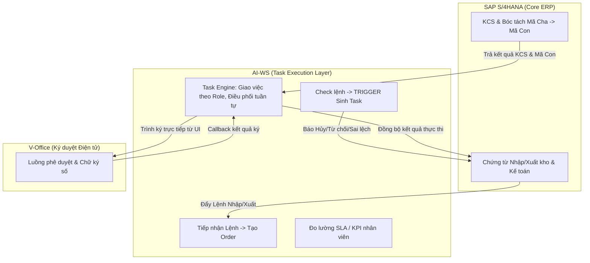
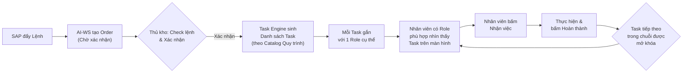
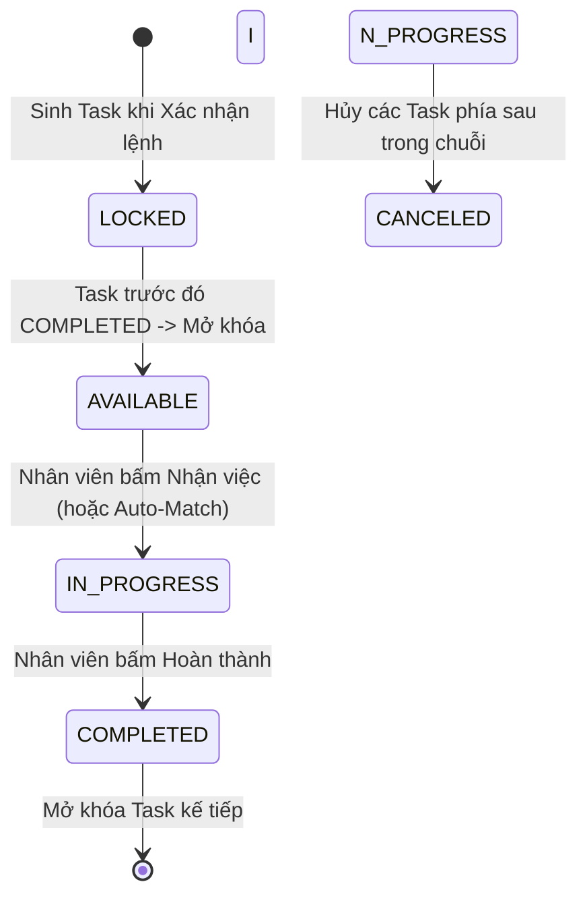

# TỔNG QUAN DỰ ÁN VÀ KIẾN TRÚC HỆ THỐNG KHO THÔNG MINH (AI-WS)
## AI-WS Master Project Overview & System Architecture Context

> **Mục đích tài liệu:** Đây là tài liệu nền tảng (Master Context) để tất cả thành viên dự án (BA, Dev, Tester, PO, Partner) và AI Agent khi đọc vào đều hiểu được bức tranh toàn cảnh hệ thống AI-WS.

---

## 1. BỐI CẢNH DỰ ÁN & BÀI TOÁN KINH DOANH

### 1.1. Hiện trạng

| Hạng mục | Mô tả |
|---|---|
| **Hệ thống hiện có** | **SAP S/4HANA** — Đã quản lý đầy đủ: Chứng từ nhập xuất kho, Hạch toán kế toán, Quản lý tồn kho, KCS vật tư. |
| **Khoảng trống (Gap)** | SAP **chưa có** khả năng: Quản lý công việc vận hành kho vật lý (ai làm gì, ở đâu, bao giờ xong), Giao việc tự động cho nhân viên, Theo dõi tiến độ thực thi từng bước, Đo lường KPI/SLA nhân viên kho. |
| **Nhu cầu** | Cần một hệ thống bổ trợ SAP chuyên biệt cho **lớp vận hành thực thi kho vật lý** — Biến mỗi hoạt động kho thành Task điện tử có thể đo lường, giám sát và tối ưu hóa. |

### 1.2. Thông tin Dự án

| Hạng mục | Chi tiết |
|---|---|
| **Tên hệ thống** | Hệ thống Quản lý Kho Thông Minh AI-WS (AI Smart Warehouse Management System) |
| **Mã dự án** | `AI-WS Platform` |
| **Mục tiêu cốt lõi** | Xây dựng lớp Quản lý Công việc Kho (**Task Execution Layer**) bổ trợ SAP: Số hóa 100% vận hành kho, tự động giao việc theo Role, điều phối tuần tự, đo lường SLA/KPI nhân viên, đồng bộ chứng từ tài chính với SAP S/4HANA và ký duyệt điện tử V-Office. |
| **Mô hình vận hành** | **Task-Driven WMS — Mô hình "Grab for Warehouse"** *(chi tiết tại Mục 3)* |
| **Phạm vi kho** | **Multi-warehouse** — Phục vụ nhiều kho. Các quy trình giống nhau giữa các kho. |
| **Nền tảng** | **Multi-platform** — Web PC + Tablet + Mobile App |
| **Đối tượng sử dụng** | Nhân viên kho nội bộ (Thủ kho, NV kho, Lái xe,...) + Đối tác bên ngoài (NCC, Tài xế NCC) — Đối tác có truy cập trực tiếp hệ thống. |

---

## 2. KIẾN TRÚC TÍCH HỢP 3 HỆ THỐNG

Hệ thống AI-WS là **lớp vận hành thực thi kho vật lý (Physical Execution Layer)**, nằm giữa SAP (ERP/Chứng từ/Kế toán) và V-Office (Ký duyệt điện tử):

### Phân định rõ trách nhiệm:

| Hệ thống | Vai trò | Ví dụ cụ thể |
|---|---|---|
| **SAP S/4HANA** | Quản lý chứng từ, kế toán, tồn kho, KCS | Tạo PO, Inbound/Outbound Delivery, hạch toán Mvt 101/201, bóc tách mã Cha-Con, quản lý Blocked Stock/UU. |
| **AI-WS** | Quản lý công việc vận hành kho vật lý | Sinh Task, giao việc cho nhân viên theo Role, điều phối tuần tự, theo dõi tiến độ, đo SLA/KPI, quản lý vị trí Bin. |
| **V-Office** | Ký duyệt điện tử văn bản | Trình ký Phiếu nhập kho, phê duyệt chữ ký số CA. |

---

## 3. TRIẾT LÝ VẬN HÀNH: MÔ HÌNH "GRAB FOR WAREHOUSE"

### 3.1. Nguyên lý cốt lõi

> **"1 Trạm" (One-Station Principle):** Tối ưu hóa trải nghiệm sao cho người dùng chỉ cần vào ứng dụng, nhìn thấy Task được giao, thực hiện và **bấm Hoàn thành** là xong. Hệ thống lo toàn bộ việc giao việc, điều phối, đo lường.

Mô hình vận hành tương tự **Grab** nhưng áp dụng cho kho:

### 3.2. Quy tắc Sinh Task (Task Generation)

| Bước | Mô tả | Trạng thái |
|---|---|---|
| **Bước 1** | SAP đẩy bản tin Lệnh nhập/xuất (`T-API`) sang AI-WS | AI-WS tạo **Order** ở trạng thái `Chờ xác nhận` |
| **Bước 2** | Thủ kho thực hiện **Check lệnh** — đối soát thông tin chứng từ | Order vẫn `Chờ xác nhận`. **Chưa sinh Task.** |
| **Bước 3** | Thủ kho bấm **Xác nhận lệnh** ✅ | **🔥 TRIGGER EVENT:** Task Engine được kích hoạt |
| **Bước 4** | Task Engine tra cứu **Catalog Quy trình** áp dụng cho loại Order | Sinh ra đúng danh sách Task theo quy trình |

> **Lưu ý quan trọng:** Việc sinh Task **phụ thuộc vào Quy trình (Process Type)**. Mỗi loại quy trình (Nhập NCC, Nhập thu hồi, Xuất cấp phát,...) có danh sách Task khác nhau, được cấu hình trong **Catalog Task & Quy trình**.

### 3.3. Quy tắc Giao việc Tự động (Auto-Assignment — "Grab Matching")

| Quy tắc | Chi tiết |
|---|---|
| **Role-Based Visibility** | Mỗi Task thuộc quy trình được gán cho **1 Role cụ thể**. Chỉ người dùng có Role đó mới nhìn thấy Task trên màn hình của mình. |
| **Hiển thị theo ngày** | Nhân viên nhìn thấy danh sách Task khả dụng (Available Tasks) **theo ngày**. |
| **Điều kiện "Rảnh rỗi"** | Một nhân viên được coi là **rảnh rỗi** khi **không có Task nào đang được assign cho họ** (không có Task `IN_PROGRESS`). |
| **Sequential Dependency** | Các Task trong cùng 1 Order có **quan hệ phụ thuộc tuần tự**: phải hoàn thành Task trước mới mở khóa Task kế tiếp. |
| **Auto-Match** | Khi một nhân viên hoàn thành Task hiện tại → Hệ thống tự động kiểm tra: Có Task nào đúng Role của họ, đã được mở khóa (Task trước đó đã `COMPLETED`) và chưa ai nhận → **Ghép người và việc vào nhau** (như Grab ghép tài xế với cuốc xe). |

### 3.4. Vòng đời Task (Task Lifecycle)

| Trạng thái | Ý nghĩa |
|---|---|
| `LOCKED` | Task đã sinh nhưng Task trước đó chưa hoàn thành → Chưa ai nhìn thấy. |
| `AVAILABLE` | Task đã được mở khóa → Hiển thị cho nhân viên có Role phù hợp. |
| `IN_PROGRESS` | Nhân viên đã nhận việc và đang thao tác. |
| `COMPLETED` | Đã hoàn thành → Tự động mở khóa Task kế tiếp. |

| `CANCELED` | Hủy do Order bị từ chối/hủy. |

---

## 4. DANH MỤC QUY TRÌNH NGHIỆP VỤ (PROCESS CATALOG)

Hệ thống AI-WS hỗ trợ **nhiều loại quy trình Nhập và Xuất kho**. Mỗi quy trình có **danh sách Task riêng** được cấu hình trong Catalog.

### 4.1. Các quy trình đã xác định

| Nhóm | Mã Quy trình | Tên Quy trình | Trạng thái thiết kế |
|---|---|---|---|
| **Nhập kho** | `MM.10A` | Nhập kho mua hàng từ NCC (Purchase Order) | ✅ Đã thiết kế chi tiết |
| **Nhập kho** | `MM.10B` *(tạm)* | Nhập thu hồi từ Công trình | 🔲 Chưa thiết kế |
| **Nhập kho** | `MM.10C` *(tạm)* | Nhập thu hồi từ Trạm | 🔲 Chưa thiết kế |
| **Xuất kho** | *(chưa định mã)* | Xuất cấp phát (tương tự các luồng Nhập nhưng ngược chiều) | 🔲 Chưa thiết kế |
| **Xuất kho** | *(chưa định mã)* | Các luồng xuất khác | 🔲 Chưa thiết kế |

> **Ghi chú:** Danh sách quy trình sẽ được bổ sung dần. Kiến trúc hệ thống đã thiết kế linh hoạt để dễ dàng mở rộng thêm quy trình mới thông qua cơ chế **Catalog Task & Quy trình** (cấu hình danh sách Task cho từng loại Order).

### 4.2. Ví dụ chuỗi Task cho Quy trình MM.10A (Nhập NCC) — Đã chốt

| Thứ tự | Task | Role phụ trách |
|---|---|---|
| Task 1 | Dỡ hàng (`T-Unl`) | NV Kho / Bốc xếp |
| Task 2 | Kiểm hàng & Ký BBBG Điện tử | NV Kiểm hàng |
| Task 3 | Đưa hàng vào Khu chờ nhập (`C02-Wait`) | NV Kho / Vận chuyển |
| Task 4 | Thực nhập kho (Nhận KCS SAP & Mã Con `T-API5`) | Thủ kho / KCS |
| Task 5 | Đưa sang khu đóng gói | NV Kho / Vận chuyển |
| Task 6 | Đóng gói hàng & In tem SKU con (Zebra ZT411) | Nhân viên kho |
| Task 7 | Đưa vào lưu trữ (Bin Putaway `G01_KNx.x.x`) | Lái xe nâng |

---

## 5. HỆ THỐNG VAI TRÒ & PHÂN QUYỀN (ROLE SYSTEM)

### 5.1. Danh sách Role

| Nhóm | Role Code | Tên Role | Mô tả chức năng chính |
|---|---|---|---|
| **Quản lý** | `ROLE_WAREHOUSE_DIRECTOR` | Giám đốc kho | Phê duyệt, giám sát tổng thể, xem báo cáo KPI. |
| **Quản lý** | `ROLE_WAREHOUSE_MASTER` | Thủ kho | Check lệnh, xác nhận lệnh (Trigger sinh Task), quản lý kho, trình ký V-Office. |
| **Quản lý** | `ROLE_UNIT_MANAGER` | Quản lý Đơn vị | Quản lý cấp trung, giám sát và xem báo cáo/thông tin vận hành của toàn bộ các kho (Plant/SLoc) thuộc đơn vị mình phụ trách. |
| **Vận hành** | `ROLE_WAREHOUSE_WORKER` | Nhân viên kho | Dỡ hàng, kiểm đếm, đóng gói (Carton/Pallet), gán RFID, in tem nhãn SKU và di chuyển hàng hóa giữa các khu vực kho. |
| **Vận hành** | `ROLE_FORKLIFT_DRIVER` | Lái xe nâng | Cất hàng vào vị trí Bin Putaway ô kệ. |
| **An ninh** | `ROLE_SECURITY` | Bảo vệ cổng kho | Đối soát biển số xe & CCCD tài xế, chốt giờ xe ra/vào. |
| **Hệ thống** | `ROLE_ADMIN` | Quản trị hệ thống | Cấu hình quy trình, quản lý người dùng, Role, Catalog Task. |
| **Bên ngoài** | `ROLE_PARTNER` | Đối tác (NCC / Tài xế NCC) | Truy cập trực tiếp hệ thống AI-WS để ký BBBG, theo dõi trạng thái giao hàng. |

### 5.2. Nguyên tắc Phân quyền

- Mỗi Task trong Catalog Quy trình được gán cố định cho **1 Role**.
- Người dùng **chỉ nhìn thấy** Task thuộc Role của mình.
- Một người dùng có thể có **nhiều Role** (VD: Thủ kho kiêm NV Kiểm hàng).
- **Đối tác** có quyền truy cập hạn chế: Chỉ thao tác trên các bước liên quan (VD: ký BBBG, xem tiến độ giao hàng).

---

## 6. CÁC MODULE CHỨC NĂNG CHUYÊN BIỆT

Ngoài chuỗi Task vận hành kho thực thi chính, hệ thống còn có 4 Module quản lý riêng biệt:

| STT | Module | Tác nhân chính | Mô tả |
|---|---|---|---|
| 1 | **Đặt lịch & Quản lý Slotting** | Thủ kho / Điều phối | Lập lịch hẹn xe NCC, quản lý khung giờ cập bến, phân phối cửa Dock. |
| 2 | **An ninh Cổng kho** | Bảo vệ | Đối soát Biển số xe & CCCD tài xế, ghi nhận giờ xe vào/ra cổng (`T-Scr`). |
| 3 | **Quản lý & Trình ký V-Office** | Thủ kho / Kế toán / GĐ Kho | Lập hồ sơ trình ký V-Office gộp nhiều Order, theo dõi luồng duyệt. |
| 4 | **Dashboard Giám sát & Cảnh báo SLA** | Giám đốc kho / Admin | Theo dõi tiến độ tổng thể Order, phát hiện nghẽn SLA, báo cáo KPI. |

---

## 7. NỀN TẢNG & THIẾT BỊ HỖ TRỢ

| Hạng mục | Chi tiết |
|---|---|
| **Nền tảng ứng dụng** | Web PC + Tablet + Mobile App |
| **Thiết bị phần cứng** | Máy in nhãn (VD: Zebra ZT411) — *Chưa tích hợp trực tiếp, sẽ bổ sung sau.* |
| **Đo lường KPI** | Hệ thống sẽ hỗ trợ đo lường KPI nhân viên kho — *Chi tiết chỉ số KPI sẽ được cung cấp sau.* |

---

## 8. BẢN ĐỒ API TÍCH HỢP (SAP & V-OFFICE)

| Mã API | Hướng truyền | Mục đích nghiệp vụ |
|---|---|---|
| **`T-API1`** | SAP → AI-WS | Đẩy chứng từ Lệnh Nhập/Xuất (Inbound/Outbound Delivery) từ SAP sang AI-WS để tạo Order. |
| **`T-API2`** | AI-WS → SAP | Báo hủy/từ chối lệnh khi Thủ kho không chấp nhận tại bước Check lệnh. |
| **`T-API3`** | AI-WS → SAP | Báo cáo sai lệch số lượng/hư hỏng khi kiểm hàng thực tế. |
| **V-Office API** | AI-WS ⇄ V-Office | Phát động trình ký V-Office từ giao diện AI-WS & nhận webhook kết quả ký. |
| **`T-API5`** | SAP ⇄ AI-WS | SAP trả kết quả KCS kèm bóc tách Mã Cha → Mã Con để AI-WS đóng gói, cất kho. |

---

## 9. THUẬT NGỮ & TỪ ĐIỂN DỮ LIỆU (GLOSSARY)

| Thuật ngữ | Viết tắt | Định nghĩa |
|---|---|---|
| **Purchase Order** | PO | Đơn đặt hàng mua sắm vật tư trên SAP S/4HANA. |
| **Inbound Delivery** | IB / VL31N | Chứng từ yêu cầu giao hàng mua từ NCC trên SAP. |
| **Order** | INB / OUT | Đơn nhập/xuất kho trên AI-WS, được tạo từ Lệnh SAP. |
| **Task** | TSK | Công việc điện tử cụ thể trong chuỗi quy trình kho — đơn vị nhỏ nhất được giao cho 1 nhân viên. |
| **Catalog Task & Quy trình** | Process Catalog | Bảng cấu hình ánh xạ: Loại Quy trình → Danh sách Task (tên, thứ tự, Role). |
| **Staging Area** | Staging Zone | Khu vực bãi tạm dỡ hàng/kiểm đếm trước khi chuyển vào kho chính. |
| **BBBG** | BBBG Điện tử | Biên bản bàn giao hàng hóa có chữ ký số CA hoặc ký cảm ứng. |
| **Material Document** | Material Doc | Chứng từ ghi nhận biến động vật tư trên SAP (Mvt 101/201). |
| **KCS** | KCS | Kiểm tra chất lượng sản phẩm — SAP chủ trì và trả kết quả. |
| **Unrestricted Use** | `UU` | Trạng thái tồn kho đạt KCS, sẵn sàng sử dụng. |
| **Blocked Stock** | Blocked | Tồn kho bị khóa do không đạt KCS. |
| **Bin Code** | Bin Putaway | Mã vị trí ô kệ trong kho (VD: `G01_KN1.1.1`). |
| **Auto-Match** | Grab Matching | Cơ chế tự động ghép nhân viên rảnh rỗi với Task khả dụng đúng Role. |
| **Plant** | Plant | Đơn vị/Chi nhánh cấp cao nhất trên SAP S/4HANA (VD: `VN01`), dùng để quản lý tồn kho và hoạt động theo từng vùng địa lý. |
| **Storage Location** | SLoc | Kho logic trên SAP S/4HANA (VD: `HN01`) trực thuộc một Plant, dùng để phân vùng hạch toán số lượng tồn kho theo mục đích quản lý. |
| **Kho vật lý** | Physical WH | Công trình kho bãi thực tế trong đời thực (VD: Kho Hòa Lạc). Một kho vật lý có thể chứa các phân khu, dãy kệ (Bin) cụ thể và có thể tương ứng với một hoặc nhiều SLoc logic trên SAP. |

---

## 10. LỊCH SỬ CẬP NHẬT TÀI LIỆU

| Version | Ngày | Mô tả thay đổi |
|---|---|---|
| v1.0 | 06/08/2026 | Khởi tạo tài liệu với kiến trúc 3 hệ thống, quy trình MM.10A, Glossary. |
| v2.0 | 06/08/2026 | Viết lại toàn diện: Bổ sung bối cảnh SAP Gap, mô hình Grab-style Task Matching, đa quy trình Nhập/Xuất, Catalog Task & Quy trình, Multi-warehouse, Multi-platform, Role System chi tiết, Đối tác truy cập trực tiếp hệ thống. |
| v2.1 | 12/08/2026 | Bổ sung định nghĩa các khái niệm chung: Plant, SLoc, Kho vật lý vào mục Glossary. |
| v2.2 | 12/08/2026 | Bổ sung vai trò Quản lý Đơn vị (quản lý cấp trung) vào mục 5.1 Danh sách Role. |
