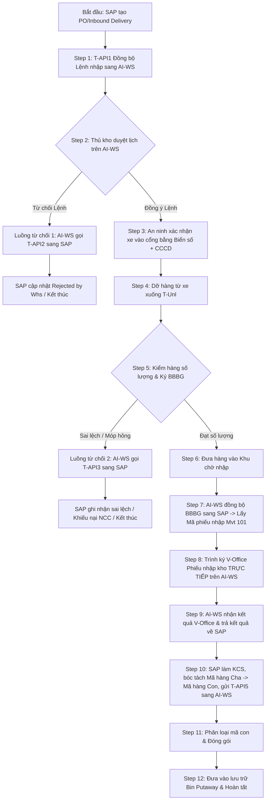

# MM.10A — Quy Trình Nhập Kho Mua Hàng Từ Nhà Cung Cấp — Kho Thông Minh AI-WMS

> **Mã quy trình:** MM.10A (Nhap_Mua_NCC)  
> **Tên quy trình:** Luồng Nhập Kho Mua Hàng Từ Nhà Cung Cấp (PO) — Kho Thông Minh AI-WMS  
> **Hệ thống tham gia:** SAP S/4HANA × AI-WS (Hệ thống Kho Thông Minh) × V-Office (Trình ký điện tử)  
> **Tài liệu nguồn:** `SAP-AIWS.drawio.xml` (Diagram: Nhập mua NCC)  
> **Trạng thái:** Standard Operating Procedure (SOP Baseline - Updated)  

---

## 1. TỔNG QUAN ĐIỂM BẮT ĐẦU, KẾT THÚC VÀ KIẾN TRÚC TÍCH HỢP

Quy trình nhập kho mua hàng từ Nhà cung cấp (PO - Purchase Order / Inbound Delivery) là luồng nhập kho quan trọng nhất trong quản lý chuỗi cung ứng. Hệ thống Kho Thông Minh AI-WMS kết nối trực tiếp với SAP S/4HANA và V-Office để số hóa toàn bộ khâu giao nhận, kiểm đếm vật lý, đối soát chứng từ và hạch toán kế toán.

### 1.1. Điểm bắt đầu (Start Point)
- Quy trình xuất phát từ **SAP S/4HANA**: Bộ phận Mua sắm tạo **Đơn mua hàng (PO)** và lập **Yêu cầu giao hàng (Inbound Delivery - VL31N)**. SAP tự động phát động bản tin đồng bộ lệnh nhập sang AI-WS (`T-API1`).

### 1.2. Điểm kết thúc (End Point)
- Quy trình kết thúc đồng thời trên **AI-WS** và **SAP S/4HANA**: 
  - **Trên AI-WS:** Công nhân hoàn tất bốc xếp vật tư vào vị trí ô kệ (Bin Putaway) chỉ định, dán nhãn SKU và đóng Task.
  - **Trên SAP:** Cập nhật trạng thái tồn kho chính thức (Khả dụng `UU` hoặc Khóa KCS `Blocked Stock`), chốt sổ chứng từ kế toán.

### 1.3. Điểm đặc thù quy trình & Tích hợp V-Office
- **Trình ký V-Office phát động từ AI-WS:** Sau khi đồng bộ BBBG sang SAP để lấy Mã phiếu nhập (Material Document Mvt 101), **thao tác trình ký V-Office được thực hiện trực tiếp trên giao diện AI-WS**. AI-WS nhận kết quả ký từ V-Office và đồng thời trả kết quả trình ký về cho SAP.
- **KCS bóc tách Mã hàng Cha $\rightarrow$ Mã hàng Con:** Hệ thống **SAP S/4HANA** chủ trì quy trình KCS, thực hiện bóc tách danh mục vật tư từ Mã hàng hóa cha thành các Mã hàng hóa con chi tiết và truyền kết quả đầy đủ sang AI-WS (`T-API5`) để phục vụ đóng gói và lưu kho.
- **Xác minh an ninh:** Bảo vệ cổng kho xác nhận thông tin tài xế dựa trên **Biển số xe** và **Số CCCD** trên App AI-WS An ninh.

---

## 2. QUY TRÌNH HỆ THỐNG CHI TIẾT (12 BƯỚC END-TO-END)

| STT | Tên bước | Hệ thống thực hiện | Tác nhân | Chi tiết kỹ thuật & Giao tiếp API / Tích hợp |
|---|---|---|---|---|
| **1** | **Đồng bộ lệnh nhập từ SAP** | SAP ➔ AI-WS | SAP (Auto) / Interface (`T-API1`) | • SAP tạo Inbound Delivery (VL31N) từ PO. • SAP gọi **`T-API1`** truyền bản tin Lệnh nhập kho (Mã NCC, Danh mục hàng hóa cha/con, Số lượng, Lô Serial) sang AI-WS. |
| **2** | **Duyệt lịch giao việc** | AI-WS (App Kho) | Thủ kho | Thủ kho kiểm tra thông tin lịch giao hàng từ NCC: • **Đồng ý lệnh:** Phân công ca trực, chỉ định vùng tiếp nhận (*Staging Area*) và chốt khung giờ xe cập bến $\rightarrow$ Chuyển Bước 3. • **Từ chối lệnh (Luồng từ chối 1):** Chuyển Bước 2.1 (Tự động gọi **`T-API2`** sang SAP). |
| **2.1** | **Cập nhật Rejected by Whs** | AI-WS ➔ SAP | Interface (`T-API2`) | AI-WS gọi **`T-API2`** báo SAP hủy/tạm dừng Lệnh nhập kho mua hàng. Trạng thái chứng từ trên SAP chuyển thành `Rejected by Whs`. |
| **3** | **Giám sát an ninh & Xác nhận xe vào cổng** | AI-WS (App Bảo vệ) | Bảo vệ cổng kho | Xe NCC tới cổng. Bảo vệ đối soát thông tin tài xế bằng **Biển số xe** và **CCCD** trên App AI-WS để xác nhận và ghi nhận thời gian xe vào cổng (`Time Screening - T-Scr`). |
| **4** | **Dỡ hàng từ xe xuống** | AI-WS (App Kho) | Đội dỡ hàng / Thủ kho | Dỡ hàng khỏi xe NCC xuống khu vực Staging, ghi nhận thời điểm dỡ hàng (`Time Unloading - T-Unl`). |
| **5** | **Kiểm hàng & Ký BBBG** | AI-WS (App Kho) | Thủ kho & Đại diện NCC | • Thủ kho **chỉ kiểm tra số lượng thực tế** vật tư dỡ xuống. • *Đúng đủ số lượng:* Thủ kho và NCC ký **Biên bản giao nhận (BBBG) điện tử** trực tiếp trên màn hình App AI-WS $\rightarrow$ Chuyển Bước 6. • *Sai lệch / Hư hỏng (Luồng từ chối 2):* Chuyển Bước 5.1 (Gọi **`T-API3`** báo SAP). |
| **5.1** | **Từ chối nhận do sai lệch kiểm đếm** | AI-WS ➔ SAP | Interface (`T-API3`) | AI-WS truyền bản tin **`T-API3`** ghi nhận số lượng thực tế sai lệch (thiếu/thừa/móp hỏng) về hệ thống SAP để xử lý khiếu nại NCC. |
| **6** | **Đưa hàng vào khu chờ nhập** | AI-WS | Đội vận chuyển kho | Di chuyển toàn bộ lô hàng vừa ký BBBG vào Khu vực chờ nhập kho (*Inbound Staging Zone*). |
| **7** | **Đồng bộ BBBG lấy Mã phiếu nhập** | AI-WS ➔ SAP | Interface | AI-WS đồng bộ dữ liệu BBBG đã ký sang SAP. SAP tự động khởi tạo **Phiếu nhập kho (Material Document - Movement Type 101)** + Hạch toán kế toán `Nợ 152/156, Có 3388` và trả Mã phiếu nhập về AI-WS. |
| **8** | **Trình ký V-Office Phiếu nhập kho** | AI-WS ➔ V-Office | Thủ kho (giao diện AI-WS) | Thủ kho thao tác **trình ký V-Office Phiếu nhập kho (Material Doc) trực tiếp trên hệ thống AI-WS** gửi Thủ trưởng + Kế toán phê duyệt. |
| **9** | **Nhận & Trả kết quả trình ký V-Office** | V-Office ➔ AI-WS ➔ SAP | Interface V-Office & SAP | • AI-WS nhận thông báo kết quả phê duyệt từ V-Office. • Đồng thời, AI-WS tự động **truyền trả kết quả trình ký V-Office về hệ thống SAP** để chốt trạng thái chứng từ. |
| **10** | **Đợi & Nhận kết quả KCS từ SAP** | SAP ➔ AI-WS | Interface (`T-API5`) | • SAP chủ trì thực hiện KCS. **Hệ thống SAP tự động bóc tách danh mục vật tư từ Mã hàng hóa cha thành các Mã hàng hóa con**. • SAP gửi kết quả KCS và danh sách mã hàng con đã bóc tách sang AI-WS (`T-API5`). |
| **11** | **Đóng gói** | AI-WS (App Kho) | Công nhân kho | AI-WS tiếp nhận thông tin mã hàng con, chỉ định khu vực đóng gói. Công nhân dán nhãn SKU con, đóng gói hoàn thiện. |
| **12** | **Đưa vào lưu trữ & Hoàn tất** | AI-WS & SAP | Công nhân kho & Hệ thống (Auto) | • AI-WS gợi ý vị trí ô kệ (Bin Putaway) tối ưu. • Công nhân xếp hàng vào Bin, quét mã hoàn thành Task trên AI-WS. • Tồn kho trên SAP cập nhật chính thức (`UU` nếu đạt KCS, `Blocked Stock` nếu không đạt KCS). Kết thúc quy trình. |

---

## 3. CÁC LUỒNG XỬ LÝ TỪ CHỐI (REJECTION FLOWS)

Quy trình thiết lập 2 điểm chặn từ chối (Rejection Gates) rõ ràng:

---

## 4. TỔNG HỢP GIAO TIẾP TÍCH HỢP VÀ API

1. **`T-API1` (SAP $\rightarrow$ AI-WS):** Đồng bộ Lệnh nhập kho mua hàng từ NCC (*Inbound Delivery*) sang AI-WS.
2. **`T-API2` (AI-WS $\rightarrow$ SAP):** Báo hủy/tạm dừng lệnh khi Thủ kho từ chối lịch nhập hàng (Luồng từ chối 1).
3. **`T-API3` (AI-WS $\rightarrow$ SAP):** Báo cáo sai lệch/hư hỏng thực tế khi kiểm đếm số lượng dỡ hàng (Luồng từ chối 2).
4. **V-Office Integration (AI-WS $\rightleftarrows$ V-Office $\rightarrow$ SAP):** Giao diện AI-WS phát động trình ký Phiếu nhập kho lên V-Office, tiếp nhận kết quả duyệt từ V-Office và đồng bộ trạng thái về SAP.
5. **`T-API5` (SAP $\rightarrow$ AI-WS):** SAP thực hiện KCS, bóc tách mã hàng hóa cha thành các mã hàng hóa con, truyền kết quả KCS kèm chi tiết mã con sang AI-WS để đóng gói và lưu kho.
