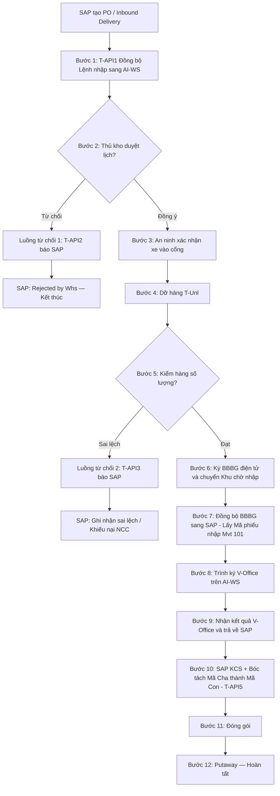
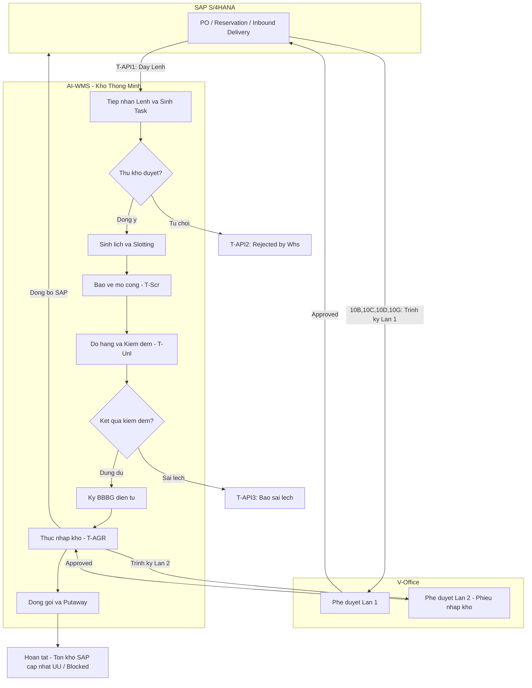

# 📦 TỔNG HỢP QUY TRÌNH NHẬP KHO SAP MM.10 — HỆ THỐNG KHO THÔNG MINH AI-WMS (VIETTEL)

> **Dự án:** Hệ thống Quản lý Kho Thông Minh AI-WMS (Viettel)  
> **Phiên bản:** V1.0 Consolidated | **Ngày tổng hợp:** 17/08/2026  
> **Hệ thống tham gia:** SAP S/4HANA × V-Office × AI-WS (Kho Thông Minh AI-WMS)  
> **Nguồn tham chiếu:** MM.10A, MM.10B, MM.10C, MM.10D, MM.10G, SAP_MM10_All_GR_Processes.drawio.xml, Sprint 1 Demo Script  

---

## 📑 MỤC LỤC

1. [Tổng quan kiến trúc 3 tầng](#1-tổng-quan-kiến-trúc-3-tầng)
2. [Bảng so sánh 5 luồng nhập kho](#2-bảng-so-sánh-5-luồng-nhập-kho)
3. [Luồng 10A — Nhập kho mua hàng từ NCC (PO)](#3-luồng-10a--nhập-kho-mua-hàng-từ-ncc-po)
4. [Luồng 10B — Nhập kho thu hồi từ công trình (PS)](#4-luồng-10b--nhập-kho-thu-hồi-từ-công-trình-ps)
5. [Luồng 10C — Nhập kho thu hồi từ trạm (PM)](#5-luồng-10c--nhập-kho-thu-hồi-từ-trạm-pm)
6. [Luồng 10D — Nhập kho thu hồi tài sản Non-Telco](#6-luồng-10d--nhập-kho-thu-hồi-tài-sản-non-telco)
7. [Luồng 10G — Nhập kho khác (Z10/Z08)](#7-luồng-10g--nhập-kho-khác-z10z08)
8. [Tổng hợp ma trận API tích hợp](#8-tổng-hợp-ma-trận-api-tích-hợp)
9. [Sơ đồ tổng quát — Tất cả luồng nhập kho](#9-sơ-đồ-tổng-quát--tất-cả-luồng-nhập-kho)

---

## 1. TỔNG QUAN KIẾN TRÚC 3 TẦNG

Toàn bộ 5 luồng nhập kho MM.10 đều vận hành trên kiến trúc **3 tầng hệ thống** phối hợp chặt chẽ:

| Tầng | Hệ thống | Vai trò chính |
|---|---|---|
| **Tầng 1 — ERP Core** | **SAP S/4HANA** | Quản lý chứng từ gốc (PO, Reservation, Material Document), hạch toán kế toán, quản lý tồn kho chính thức, thực hiện KCS (QM.04), bóc tách mã hàng Cha → Con. |
| **Tầng 2 — Trình ký số** | **V-Office** | Phê duyệt điện tử chứng từ nhập kho theo quy trình nội bộ Viettel (1–2 lần tùy luồng). |
| **Tầng 3 — Kho thông minh** | **AI-WS (AI-WMS)** | Điều phối tác nghiệp vật lý tại kho: Lập lịch xe, An ninh cổng (`T-Scr`), Dỡ hàng (`T-Unl`), Kiểm đếm, Ký BBBG điện tử, Thực nhập kho (`T-AGR`), Đóng gói, Putaway. |

---

## 2. BẢNG SO SÁNH 5 LUỒNG NHẬP KHO

| Tiêu chí | **MM.10A** | **MM.10B** | **MM.10C** | **MM.10D** | **MM.10G** |
|---|---|---|---|---|---|
| **Tên luồng** | Nhập mua hàng NCC | Thu hồi công trình (PS) | Thu hồi từ trạm (PM) | Thu hồi tài sản Non-Telco | Nhập kho khác (Z10/Z08) |
| **Chứng từ gốc SAP** | PO / Inbound Delivery (VL31N) | Reservation (WBS Element) | Reservation (Work Order PM) | Reservation (FI-AA) | Reservation (MB21: Z10/Z08) |
| **Số bước end-to-end** | 12 bước | 19 bước | 19 bước | 18 bước | 19 bước |
| **Trình ký V-Office** | 1 lần (Phiếu nhập kho) | 2 lần (YC thu hồi + Phiếu nhập) | 2 lần (YC thu hồi + Phiếu nhập) | 2 lần (Reservation + Phiếu nhập) | 2 lần (Reservation + Phiếu nhập) |
| **KCS (QM.04)** | ✅ SAP chủ trì, bóc tách Mã Cha→Con | ✅ SAP sinh Inspection Lot | ✅ SAP sinh Inspection Lot | ❌ KHÔNG qua KCS | ✅ Nếu vật tư bật QM |
| **Movement Type SAP** | 101 | 122 (Return from Construction) | Tùy loại PM | Tùy loại tài sản | Z10 (Mượn) / Z08 (Đền bù) |
| **Hạch toán kế toán** | Nợ 152/156, Có 3388 | Nguyên giá trị đã xuất | Tùy loại PM | Ghi giảm FI-AA | Z10: Không hạch toán; Z08: Có hạch toán |
| **Xác minh an ninh cổng** | ✅ (Biển số xe + CCCD) | ✅ (QR/Biển số) | ✅ (QR/Mã chuyến xe) | ✅ (QR/Mã chuyến xe) | ✅ (QR/Mã giao nhận) |
| **Bóc tách Mã Cha→Con** | ✅ (SAP T-API5) | ❌ | ❌ | ❌ | ❌ |
| **Đánh giá TS trước nhập** | ❌ | ❌ | ❌ | ✅ (Hội đồng) | ❌ |

---

## 3. LUỒNG 10A — NHẬP KHO MUA HÀNG TỪ NCC (PO)

> **Mã quy trình:** MM.10A (Nhap_Mua_NCC)  
> **Đặc thù:** Luồng nhập kho quan trọng nhất — mua từ Nhà cung cấp. SAP chủ trì KCS và bóc tách mã hàng Cha → Con.

### 3.1. Điểm bắt đầu & kết thúc

- **Bắt đầu:** SAP S/4HANA — Bộ phận Mua sắm tạo **Đơn mua hàng (PO)** và lập **Inbound Delivery (VL31N)**. SAP tự động đẩy lệnh nhập sang AI-WS qua `T-API1`.
- **Kết thúc:**
  - *Trên AI-WS:* Công nhân hoàn tất Putaway vào ô kệ (Bin), dán nhãn SKU, đóng Task.
  - *Trên SAP:* Cập nhật tồn kho chính thức (`UU` hoặc `Blocked Stock`), chốt sổ chứng từ kế toán.

### 3.2. Điểm đặc thù

- **Trình ký V-Office phát động từ AI-WS:** Sau khi đồng bộ BBBG sang SAP để lấy Mã phiếu nhập (Material Document Mvt 101), thao tác trình ký V-Office được thực hiện trực tiếp trên giao diện AI-WS. AI-WS nhận kết quả ký từ V-Office và đồng thời trả kết quả trình ký về cho SAP.
- **KCS bóc tách Mã hàng Cha → Mã hàng Con:** Hệ thống SAP S/4HANA chủ trì quy trình KCS, thực hiện bóc tách danh mục vật tư từ Mã hàng hóa cha thành các Mã hàng hóa con chi tiết và truyền kết quả đầy đủ sang AI-WS (`T-API5`) để phục vụ đóng gói và lưu kho.
- **Xác minh an ninh:** Bảo vệ cổng kho xác nhận thông tin tài xế dựa trên **Biển số xe** và **Số CCCD** trên App AI-WS An ninh.

### 3.3. Quy trình chi tiết 12 bước

| STT | Tên bước | Hệ thống | Tác nhân | Chi tiết kỹ thuật & API |
|---|---|---|---|---|
| **1** | Đồng bộ lệnh nhập từ SAP | SAP ➔ AI-WS | SAP (Auto) / `T-API1` | SAP tạo Inbound Delivery (VL31N) từ PO. SAP gọi **`T-API1`** truyền bản tin Lệnh nhập kho (Mã NCC, Danh mục hàng hóa cha/con, Số lượng, Lô Serial) sang AI-WS. |
| **2** | Duyệt lịch giao việc | AI-WS (App Kho) | Thủ kho | Thủ kho kiểm tra lịch giao hàng NCC: • **Đồng ý:** Phân công ca trực, chỉ định Staging Area, chốt khung giờ xe cập bến → Bước 3. • **Từ chối:** → Bước 2.1 (gọi `T-API2`). |
| **2.1** | ⛔ Cập nhật Rejected by Whs | AI-WS ➔ SAP | `T-API2` | AI-WS gọi **`T-API2`** báo SAP hủy/tạm dừng lệnh. Trạng thái SAP: `Rejected by Whs`. |
| **3** | Giám sát an ninh & Xác nhận xe | AI-WS (App Bảo vệ) | Bảo vệ cổng kho | Xe NCC tới cổng. Bảo vệ đối soát **Biển số xe** + **Số CCCD** tài xế trên App AI-WS. Ghi nhận `T-Scr` (Time Screening). |
| **4** | Dỡ hàng từ xe xuống | AI-WS (App Kho) | Đội dỡ hàng / Thủ kho | Dỡ hàng khỏi xe NCC xuống Staging Area. Ghi nhận `T-Unl` (Time Unloading). |
| **5** | Kiểm hàng & Ký BBBG | AI-WS (App Kho) | Thủ kho & Đại diện NCC | Thủ kho **chỉ kiểm tra số lượng** vật tư dỡ xuống. • *Đúng đủ:* Ký **BBBG điện tử** trên App AI-WS → Bước 6. • *Sai lệch/Hư hỏng:* → Bước 5.1 (gọi `T-API3`). |
| **5.1** | ⛔ Từ chối nhận do sai lệch | AI-WS ➔ SAP | `T-API3` | AI-WS gửi **`T-API3`** ghi nhận sai lệch (thiếu/thừa/hỏng) về SAP để khiếu nại NCC. |
| **6** | Đưa hàng vào khu chờ nhập | AI-WS | Đội vận chuyển kho | Di chuyển lô hàng đã ký BBBG vào *Inbound Staging Zone*. |
| **7** | Đồng bộ BBBG lấy Mã phiếu nhập | AI-WS ➔ SAP | Interface | AI-WS đồng bộ BBBG sang SAP. SAP tạo **Material Document (Mvt 101)** + Hạch toán kế toán `Nợ 152/156, Có 3388`, trả Mã phiếu nhập về AI-WS. |
| **8** | Trình ký V-Office Phiếu nhập kho | AI-WS ➔ V-Office | Thủ kho (trên AI-WS) | Thủ kho trình ký **V-Office Phiếu nhập kho** trực tiếp trên giao diện AI-WS → gửi Thủ trưởng + Kế toán phê duyệt. |
| **9** | Nhận & Trả kết quả V-Office | V-Office ➔ AI-WS ➔ SAP | Interface | AI-WS nhận kết quả phê duyệt từ V-Office, đồng thời **truyền trả kết quả trình ký về SAP** để chốt trạng thái chứng từ. |
| **10** | Đợi & Nhận KCS từ SAP | SAP ➔ AI-WS | `T-API5` | SAP chủ trì KCS, **bóc tách Mã hàng Cha → Mã hàng Con**. SAP gửi kết quả KCS + danh sách mã con sang AI-WS (`T-API5`). |
| **11** | Đóng gói | AI-WS (App Kho) | Công nhân kho | AI-WS nhận thông tin mã con, chỉ định khu vực đóng gói. Công nhân dán nhãn SKU con, đóng gói hoàn thiện. |
| **12** | Đưa vào lưu trữ & Hoàn tất | AI-WS & SAP | Công nhân kho & Auto | AI-WS gợi ý vị trí ô kệ (Bin Putaway) tối ưu. Công nhân xếp hàng, quét mã hoàn thành Task. SAP cập nhật tồn kho (`UU` nếu đạt KCS, `Blocked Stock` nếu không đạt). **Kết thúc.** |

### 3.4. Sơ đồ luồng từ chối (Rejection Flows)

### 3.5. Tổng hợp API

| API | Hướng | Chức năng |
|---|---|---|
| `T-API1` | SAP → AI-WS | Đồng bộ Lệnh nhập kho mua hàng (Inbound Delivery) |
| `T-API2` | AI-WS → SAP | Báo hủy/tạm dừng khi Thủ kho từ chối |
| `T-API3` | AI-WS → SAP | Báo sai lệch/hư hỏng khi kiểm đếm |
| V-Office | AI-WS ⇄ V-Office → SAP | Trình ký Phiếu nhập kho, trả kết quả về SAP |
| `T-API5` | SAP → AI-WS | KCS + Bóc tách mã hàng Cha → Con |

---

## 4. LUỒNG 10B — NHẬP KHO THU HỒI TỪ CÔNG TRÌNH (PS)

> **Mã quy trình:** MM.10B (ThuHoi_CongTrinh)  
> **Đặc thù:** Vật tư dư thừa thu hồi từ công trình xây dựng/dự án (PS). Nhập về kho với **nguyên giá trị đã xuất ban đầu**. Trình ký V-Office **2 lần**.

### 4.1. Điểm đặc thù

- Vật tư dư thừa thu hồi từ công trình được nhập về kho với **nguyên giá trị đã xuất ban đầu**.
- Mọi hoạt động kiểm đếm vật lý, dỡ hàng, tạo BBBG điện tử và thực nhập kho đều thao tác qua **App AI-WS**.
- Trình ký V-Office **2 lần**: Lần 1 (Yêu cầu thu hồi) + Lần 2 (Phiếu nhập kho).

### 4.2. Quy trình chi tiết 19 bước

| STT | Tên bước | Hệ thống | Tác nhân | Chi tiết kỹ thuật & API |
|---|---|---|---|---|
| **1** | Tạo Yêu cầu thu hồi | SAP S/4HANA (PS) | Ban QLDA / Giám sát | Tạo Yêu cầu thu hồi vật tư dư thừa công trình (Reservation) tham chiếu WBS Element. |
| **2** | Trình phiếu ký V-Office (Lần 1) | SAP ➔ V-Office | Ban QLDA | Trình Yêu cầu thu hồi đính kèm Mẫu phiếu yêu cầu nhập kho thu hồi công trình lên V-Office. |
| **3** | Phê duyệt V-Office Lần 1 | V-Office | Trưởng Ban QLDA / Thủ trưởng | Phê duyệt Yêu cầu thu hồi. • *Approved:* → Bước 3.1. • *Rejected:* Hủy yêu cầu. |
| **3.1** | SAP cập nhật Approved | SAP S/4HANA | Auto | Đồng bộ trạng thái duyệt từ V-Office về SAP (`Approved`). |
| **4** | Đẩy Lệnh sang AI-WS (`T-API1`) | SAP ➔ AI-WS | `T-API1` | SAP gọi **`T-API1`** truyền toàn bộ thông tin Yêu cầu thu hồi công trình (Mã vật tư, Số lượng, Serial, Mã dự án WBS) sang AI-WS. |
| **5** | AI-WS tiếp nhận & Sinh Task | AI-WS | Hệ thống AI-WS | Tự động tạo Task nhập kho thu hồi công trình và thông báo cho Thủ kho. |
| **6** | Thủ kho quyết định tiếp nhận | AI-WS (App) | Thủ kho | Xem xét kế hoạch tiếp nhận: • *Đồng ý:* → Bước 6.2. • *Từ chối:* → Bước 6.1 (gọi `T-API2`). |
| **6.1** | ⛔ Cập nhật Rejected by Whs | AI-WS ➔ SAP | `T-API2` | AI-WS gọi **`T-API2`** cập nhật lý do từ chối lên SAP, đóng Yêu cầu thu hồi. |
| **6.2** | Xác nhận giờ nhận hàng | AI-WS (App) | Thủ kho | Chốt khung giờ hẹn xe chở vật tư từ công trình về kho. |
| **7** | Sinh lịch giao việc & Slotting | AI-WS | Hệ thống AI-WS | Tính toán vị trí bãi dỡ hàng (Staging Area) và xếp lịch cho đội công nhân kho. |
| **8** | Cập nhật giờ xe vào cổng (`T-Scr`) | AI-WS (App Bảo vệ) | Bảo vệ cổng kho | Bảo vệ quét QR/nhập biển số xe trên App AI-WS. Ghi nhận `T-Scr`. |
| **9** | Dỡ hàng & Kiểm đếm (`T-Unl`) | AI-WS (App Kho) | Đội dỡ hàng / Thủ kho | Dỡ vật tư khỏi xe, kiểm đếm số lượng, quét mã Serial thực tế. Ghi nhận `T-Unl`. |
| **10** | Kết quả kiểm đếm | AI-WS | Thủ kho & App | Đối chiếu thực tế với Reservation: • *Đúng đủ:* → Bước 10.2. • *Sai lệch:* → Bước 10.1 (gọi `T-API3`). |
| **10.1** | ⛔ Từ chối nhận hàng do sai lệch | AI-WS ➔ SAP | `T-API3` | AI-WS gửi **`T-API3`** báo cáo sai lệch thực tế về SAP. |
| **10.2** | Ký BBBG điện tử & Chuyển khu chờ | AI-WS (App Kho) | Thủ kho & Cán bộ công trình | Ký **BBBG điện tử** trên màn hình App AI-WS. Chuyển vật tư vào Khu vực chờ nhập kho. |
| **11** | Cập nhật trạng thái chờ nhập | SAP S/4HANA | Auto | Ghi nhận vật tư đã cập bến kho an toàn. |
| **12** | Sinh Phiếu nhập (Material Doc Mvt 122) | SAP S/4HANA | Auto | SAP tạo **Material Document** (Movement Type 122 - Return from Construction Site). |
| **13** | Sinh Inspection Lot QM.04 & Trình V-Office Lần 2 | SAP & V-Office | SAP & Thủ kho | SAP tự động sinh **Lô kiểm tra QM.04**. Thủ kho dùng App AI-WS trình Phiếu nhập kho lên V-Office Lần 2 (Thủ trưởng + Kế toán ký chốt). |
| **14** | Thực nhập kho (`T-AGR`) & Gửi KCS | AI-WS ➔ SAP | `T-API5` | V-Office duyệt Lần 2 → Thủ kho bấm **Thực nhập kho (`T-AGR`)** trên App AI-WS. SAP gọi **`T-API5`** trao đổi KCS. |
| **15** | Nhận kết quả KCS & Cập nhật tồn kho | SAP S/4HANA | Auto | • SP Đạt: → **`UU` (Unrestricted-Use)**. • SP Không đạt: → **`Blocked Stock`**. |
| **18** | Đóng gói & Đưa vào vị trí Bin | AI-WS | Nhân viên kho | AI-WS định vị ô/kệ lưu trữ. Đóng gói và cất hàng. |
| **19** | Lưu trữ & Hoàn tất | AI-WS & SAP | Auto | Hoàn thành toàn bộ quy trình. Đóng Task. **Kết thúc.** |

### 4.3. Tổng hợp API

| API | Hướng | Chức năng |
|---|---|---|
| `T-API1` | SAP → AI-WS | Đẩy Lệnh thu hồi công trình (Reservation Approved) |
| `T-API2` | AI-WS → SAP | Báo đóng/hủy lệnh khi Thủ kho từ chối |
| `T-API3` | AI-WS → SAP | Báo sai lệch số lượng/chủng loại kiểm đếm |
| `T-API5` | SAP ⇄ AI-WS | Đồng bộ kết quả KCS (QM.04) & chuyển vùng tồn kho |

---

## 5. LUỒNG 10C — NHẬP KHO THU HỒI TỪ TRẠM (PM)

> **Mã quy trình:** MM.10C (NKK_ThuHoi)  
> **Đặc thù:** Thu hồi vật tư từ trạm viễn thông (PM). Có 3 trường hợp PM gốc: PM.02 (thiết bị dư thừa ứng cứu — nguyên giá), PM.05.01 (hủy trạm — chỉ quản lý số lượng), PM.03.02 (thu hồi sửa chữa — chỉ quản lý số lượng).

### 5.1. Kiến trúc 3 tầng chi tiết

| Tầng | Hệ thống | Vai trò |
|---|---|---|
| SAP S/4HANA | Core ERP | Tự động sinh Reservation từ Work Order PM, hạch toán kế toán kho, kích hoạt QM.04. |
| V-Office | Trình ký số | Phê duyệt 2 lần (Lần 1: YC thu hồi; Lần 2: Phiếu nhập kho). |
| AI-WS | Kho thông minh | Điều phối tác nghiệp vật lý: `T-Scr`, `T-Unl`, BBBG, `T-AGR`, Đóng gói & Lưu kho. |

### 5.2. Ba trường hợp PM gốc

| Trường hợp | Mã tham chiếu | Mô tả | Quản lý giá trị |
|---|---|---|---|
| Thiết bị dư thừa ứng cứu | PM.02 | Thu hồi thiết bị dư thừa sau ứng cứu thông tin | Nguyên giá |
| Hủy trạm | PM.05.01 | Thu hồi vật tư khi hủy trạm viễn thông | Chỉ quản lý số lượng, không quản lý giá |
| Thu hồi sửa chữa | PM.03.02 | Thu hồi thiết bị gửi đi sửa chữa | Chỉ quản lý số lượng, không quản lý giá |

### 5.3. Quy trình chi tiết 19 bước

| STT | Tên bước | Hệ thống | Tác nhân | Chi tiết kỹ thuật & API |
|---|---|---|---|---|
| **1** | Tự động tạo Reservation | SAP S/4HANA | Auto | Lập Work Order bảo trì/hủy trạm trên PM. SAP **tự động tạo Reservation**. |
| **2** | Trình phiếu ký V-Office (Lần 1) | SAP ➔ V-Office | NV kỹ thuật trạm | Trình Yêu cầu thu hồi đính kèm mẫu Phiếu nhập kho lên V-Office. |
| **3** | Phê duyệt V-Office Lần 1 | V-Office | Người phê duyệt | • *Phê duyệt:* → Bước 3.1. • *Từ chối:* Trả lại / Hủy Reservation. |
| **3.1** | Cập nhật Approved trên SAP | SAP S/4HANA | Auto | SAP nhận kết quả duyệt, cập nhật Reservation = `Approved`. |
| **4** | Đẩy Lệnh sang AI-WS (`T-API1`) | SAP ➔ AI-WS | `T-API1` | SAP gọi **`T-API1`** đẩy dữ liệu Lệnh nhập kho thu hồi (Reservation Approved) sang AI-WS. |
| **5** | AI-WS tiếp nhận & Sinh Task | AI-WS | Hệ thống AI-WS | Nhận `T-API1`, tạo Task và gửi Notification cho Thủ kho. |
| **6** | Thủ kho quyết định tiếp nhận | AI-WS (App) | Thủ kho | • *Đồng ý:* → Bước 6.2. • *Từ chối:* → Bước 6.1 (gọi `T-API2`). |
| **6.1** | ⛔ Hủy lệnh do Thủ kho từ chối | AI-WS ➔ SAP | `T-API2` | AI-WS gọi **`T-API2`** cập nhật `Rejected by Whs` trên SAP, đóng Work Order PM. |
| **6.2** | Xác nhận giờ nhận hàng | AI-WS (App) | Thủ kho | Chốt khung giờ tiếp nhận xe vận chuyển vật tư từ trạm. |
| **7** | Sinh lịch giao việc & Slotting | AI-WS | Hệ thống AI-WS | Tính toán Staging Area và phân công lịch cho đội bốc xếp. |
| **8** | Cập nhật giờ xe vào cổng (`T-Scr`) | AI-WS (App Bảo vệ) | Bảo vệ cổng kho | Quét QR/mã chuyến xe trên App AI-WS. Ghi nhận `T-Scr`. |
| **9** | Dỡ hàng & Kiểm đếm (`T-Unl`) | AI-WS (App Kho) | Đội dỡ hàng / Thủ kho | Dỡ hàng, quét mã/kiểm đếm số lượng thực tế. Ghi nhận `T-Unl`. |
| **10** | Đánh giá kết quả kiểm đếm | AI-WS | Thủ kho & App | • *Đúng đủ:* → Bước 10.2. • *Sai lệch:* → Bước 10.1 (gọi `T-API3`). |
| **10.1** | ⛔ Cập nhật Từ chối sai lệch | AI-WS ➔ SAP | `T-API3` | AI-WS gửi **`T-API3`** cập nhật lý do từ chối sai lệch thực tế. |
| **10.2** | Ký BBBG điện tử & Vào Khu chờ | AI-WS (App Kho) | Thủ kho & Tài xế | Ký **BBBG điện tử** trên App AI-WS. Hàng di chuyển vào Khu vực chờ nhập kho. |
| **11** | Cập nhật trạng thái chờ nhập | SAP S/4HANA | Auto | Đồng bộ trạng thái hàng đã vào khu chờ nhập kho. |
| **12** | Sinh Phiếu nhập kho (Material Doc) | SAP S/4HANA | Auto | SAP tạo **Material Document** (Chứng từ giao dịch kho). |
| **13** | Sinh Inspection Lot QM.04 & V-Office Lần 2 | SAP & V-Office | SAP & Thủ kho | SAP sinh **Lô kiểm tra QM.04**. Thủ kho trình ký Phiếu nhập kho lên V-Office Lần 2. |
| **14** | Thực nhập kho (`T-AGR`) & KCS | AI-WS ➔ SAP | `T-API5` | V-Office duyệt → Thủ kho bấm **`T-AGR`** trên App. SAP gọi **`T-API5`** trao đổi KCS. |
| **15** | Nhận kết quả KCS & Cập nhật tồn | SAP S/4HANA | Auto | • SP Đạt: → **`UU`**. • SP Không đạt: → **`Blocked Stock`**. |
| **18** | Đóng gói & Đưa vào giá kệ | AI-WS | Công nhân kho | AI-WS chỉ định vị trí Bin/Kệ. Đóng gói và đặt hàng. |
| **19** | Lưu trữ & Hoàn tất | AI-WS & SAP | Auto | Hoàn tất chuỗi Task. Đóng chứng từ trên cả 2 hệ thống. **Kết thúc.** |

### 5.4. Quy tắc chuyển trạng thái tồn kho

| Giai đoạn | Trạng thái |
|---|---|
| Khởi tạo khi MIGO (Bước 12) | `Quality Inspection (QI)` hoặc `UU` tạm tại Khu chờ |
| Sau KCS ĐẠT (Bước 15) | `QI` → **`UU` (Unrestricted-Use)** — Sẵn sàng xuất dùng |
| Sau KCS KHÔNG ĐẠT (Bước 15) | `QI` → **`Blocked Stock`** — Khóa, chuyển kho phế liệu/thanh lý |

### 5.5. Tổng hợp API

| API | Hướng | Chức năng |
|---|---|---|
| `T-API1` | SAP → AI-WS | Đẩy Reservation Approved từ SAP |
| `T-API2` | AI-WS → SAP | Thông báo đóng/hủy khi Thủ kho từ chối |
| `T-API3` | AI-WS → SAP | Báo sai lệch kiểm đếm vật lý |
| `T-API5` | SAP ⇄ AI-WS | Đồng bộ KCS (QM.04) & chuyển vùng tồn kho |

---

## 6. LUỒNG 10D — NHẬP KHO THU HỒI TÀI SẢN NON-TELCO

> **Mã quy trình:** MM.10D (ThuHoi_NonTelco)  
> **Đặc thù:** Tài sản không thuộc nhóm viễn thông (Laptop, Máy in, Bàn ghế, Máy điều hòa, Xe cộ...). Kết hợp **FI-AA** (Kế toán Tài sản). **KHÔNG qua KCS (QM.04)** sau nhập kho.

### 6.1. Điểm đặc thù MM.10D

1. **Đánh giá chất lượng TRƯỚC khi lập phiếu:** Hội đồng + BP Quản lý tài sản kiểm tra phân loại (Sửa chữa / Chuyển vị trí / Phân rã) trước khi tạo Reservation.
2. **KHÔNG qua KCS (QM.04) sau nhập kho:** Vì chất lượng đã kiểm định ở Bước 1.
3. **Tự động ghi giảm FI-AA:** Chứng từ nhập kho hoàn tất trên V-Office là căn cứ hạch toán giảm Tài sản cố định trên FI-AA.
4. **Số hóa 100% tác nghiệp kho:** Kiểm đếm Serial, dỡ hàng (`T-Unl`), ký BBBG, thực nhập kho (`T-AGR`) trên App AI-WS.

### 6.2. Phân loại tài sản đầu vào

| Phân loại | Hướng xử lý | Giá trị Reservation |
|---|---|---|
| Sửa được | Chuyển luồng FI.53.01 | — |
| Chưa loại biên chế | Chuyển Location trên FI.54.01 | — |
| Phân rã (Có QĐ loại biên chế) | Tách phiếu, tạo Reservation | Giá trị = 0 → Plant NV; Giá trị > 0 → Plant hạch toán |

### 6.3. Quy trình chi tiết 18 bước

| STT | Tên bước | Hệ thống | Tác nhân | Chi tiết kỹ thuật & API |
|---|---|---|---|---|
| **1** | Tiếp nhận & Phân loại tài sản | FI-AA / Z-program | BP Quản lý TS & Hội đồng | Kiểm tra phân loại: • *Sửa được:* → luồng FI.53.01. • *Chưa loại biên chế:* → Chuyển Location FI.54.01. • *Phân rã (Có QĐ loại biên chế):* Tách phiếu, tạo **Reservation**. |
| **2** | Trình phiếu ký V-Office (Lần 1) | SAP ➔ V-Office | BP Quản lý TS | Trình Reservation đính kèm *QĐ loại khỏi biên chế* & *Biên bản đánh giá* lên V-Office. |
| **3** | Phê duyệt V-Office Lần 1 | V-Office | Thủ trưởng đơn vị | • *Approved:* → Bước 3.1. • *Rejected:* Hủy yêu cầu. |
| **3.1** | SAP cập nhật Approved | SAP S/4HANA | Auto | Ghi nhận Reservation = `Approved`. |
| **4** | Đẩy Lệnh sang AI-WS (`T-API1`) | SAP ➔ AI-WS | `T-API1` | SAP gọi **`T-API1`** truyền Reservation tài sản Non-Telco (Mã vật tư, Số lượng, Serial, Plant NV/Valuated) sang AI-WS. |
| **5** | AI-WS tiếp nhận & Sinh Task | AI-WS | Hệ thống AI-WS | Tạo Task nhập kho tài sản thu hồi, gửi thông báo cho Thủ kho. |
| **6** | Thủ kho quyết định tiếp nhận | AI-WS (App) | Thủ kho | • *Đồng ý:* → Bước 6.2. • *Từ chối:* → Bước 6.1 (gọi `T-API2`). |
| **6.1** | ⛔ Cập nhật Rejected by Whs | AI-WS ➔ SAP | `T-API2` | AI-WS gọi **`T-API2`** báo SAP hủy Lệnh thu hồi tài sản. |
| **6.2** | Xác nhận giờ nhận hàng | AI-WS (App) | Thủ kho | Chốt khung giờ nhận tài sản tại kho. |
| **7** | Sinh lịch giao việc & Slotting | AI-WS | Hệ thống AI-WS | Tính toán Staging Area và phân công ca trực dỡ hàng. |
| **8** | Cập nhật giờ xe vào cổng (`T-Scr`) | AI-WS (App Bảo vệ) | Bảo vệ cổng kho | Quét QR/nhập mã chuyến xe. Ghi nhận `T-Scr`. |
| **9** | Dỡ hàng & Kiểm đếm (`T-Unl`) | AI-WS (App Kho) | Đội dỡ hàng / Thủ kho | Dỡ tài sản, quét mã Serial/Asset Tag từng thiết bị. Ghi nhận `T-Unl`. |
| **10** | Kết quả kiểm đếm | AI-WS | Thủ kho & App | • *Đúng đủ:* → Bước 10.2. • *Sai lệch:* → Bước 10.1 (gọi `T-API3`). |
| **10.1** | ⛔ Từ chối nhận hàng do sai lệch | AI-WS ➔ SAP | `T-API3` | AI-WS gửi **`T-API3`** báo cáo sai lệch về SAP. |
| **10.2** | Ký BBBG điện tử & Chuyển khu chờ | AI-WS (App Kho) | Thủ kho & BP Tài sản | Ký **BBBG điện tử** trên App. Chuyển tài sản vào Khu vực chờ nhập kho. |
| **11** | Cập nhật trạng thái chờ nhập | SAP S/4HANA | Auto | Đồng bộ trạng thái tài sản đã tập kết tại kho. |
| **12** | Sinh Phiếu nhập (Material Doc) | SAP S/4HANA | Auto | SAP tạo **Material Document** nhập kho tài sản. |
| **13** | Trình ký V-Office Lần 2 | Z-program ➔ V-Office | Thủ kho | Trình Phiếu nhập kho lên V-Office Lần 2 (Thủ trưởng + Kế toán tài sản + Thủ kho ký chốt). **KHÔNG qua KCS.** |
| **14** | Thực nhập kho (`T-AGR`) & Ghi giảm FI-AA | AI-WS ➔ SAP | `T-AGR` | V-Office duyệt → Thủ kho bấm **`T-AGR`** trên App. Ban Tài chính hạch toán ghi giảm Tài sản cố định trên **FI-AA**. |
| **18** | Đóng gói & Đưa vào vị trí Bin | AI-WS | Nhân viên kho | AI-WS định vị ô/kệ. Đóng gói và cất tài sản. |
| **19** | Lưu trữ & Hoàn tất | AI-WS & SAP | Auto | Hoàn thành. Đóng Task. **Kết thúc.** |

### 6.4. Tổng hợp API

| API | Hướng | Chức năng |
|---|---|---|
| `T-API1` | SAP → AI-WS | Đẩy Lệnh thu hồi tài sản Non-Telco (Reservation Approved) |
| `T-API2` | AI-WS → SAP | Báo đóng/hủy lệnh khi Thủ kho từ chối |
| `T-API3` | AI-WS → SAP | Báo sai lệch Serial/số lượng tài sản kiểm đếm |
| Tích hợp FI-AA | SAP nội bộ | Tự động/bán tự động ghi giảm giá trị TSCĐ ngoài viễn thông |

---

## 7. LUỒNG 10G — NHẬP KHO KHÁC (Z10/Z08)

> **Mã quy trình:** MM.10G (Nhap_Kho_Khac)  
> **Đặc thù:** Nhập kho với Movement Type đặc biệt — `Z10` (Hàng mượn từ NCC, KHÔNG hạch toán kế toán) hoặc `Z08` (Hàng đền bù thay thế, CÓ hạch toán kế toán tăng tồn kho).

### 7.1. Điểm đặc thù

- **Chứng từ gốc:** Tờ trình nhập kho khác được ban hành trên V-Office, tự động sync sang SAP.
- **Phân biệt Z10 và Z08:**

| Movement Type | Loại hàng | Hạch toán kế toán |
|---|---|---|
| `Z10` | Hàng mượn từ NCC | ❌ Không phát sinh hạch toán |
| `Z08` | Hàng đền bù thay thế | ✅ Phát sinh hạch toán tăng tồn kho |

- Mọi thao tác dỡ hàng, kiểm đếm, xác nhận nhập kho thực tế đều trên **App AI-WS**.

### 7.2. Quy trình chi tiết 19 bước

| STT | Tên bước | Hệ thống | Tác nhân | Chi tiết kỹ thuật & API |
|---|---|---|---|---|
| **1** | Tạo Tờ trình & Auto Reservation | Non-SAP ➔ V-Office ➔ SAP | Đơn vị yêu cầu / SAP | Ban hành Tờ trình trên V-Office. Số văn bản tự động Sync về SAP. Chạy `MB21` tạo Reservation (`Z10` hoặc `Z08`). |
| **2** | Trình phiếu ký V-Office (Lần 1) | SAP ➔ V-Office | Đơn vị yêu cầu | Trình Reservation đính kèm Tờ trình đã ban hành lên V-Office. |
| **3** | Phê duyệt V-Office Lần 1 | V-Office | Người phê duyệt | • *Approved:* → Bước 3.1. • *Rejected:* Hủy yêu cầu. |
| **3.1** | SAP cập nhật Approved | SAP S/4HANA | Auto | Ghi nhận Reservation = `Approved`. |
| **4** | Đẩy Lệnh sang AI-WS (`T-API1`) | SAP ➔ AI-WS | `T-API1` | SAP gọi **`T-API1`** truyền Reservation Nhập kho khác sang AI-WS. |
| **5** | AI-WS tiếp nhận & Sinh Task | AI-WS | Hệ thống AI-WS | Tạo Task nhập kho khác, thông báo Thủ kho. |
| **6** | Thủ kho quyết định tiếp nhận | AI-WS (App) | Thủ kho | • *Đồng ý:* → Bước 6.2. • *Từ chối:* → Bước 6.1 (gọi `T-API2`). |
| **6.1** | ⛔ Cập nhật Rejected by Whs | AI-WS ➔ SAP | `T-API2` | AI-WS gọi **`T-API2`** báo SAP hủy/tạm dừng Lệnh nhập kho khác. |
| **6.2** | Xác nhận giờ nhận hàng | AI-WS (App) | Thủ kho | Chốt khung giờ nhận hàng. |
| **7** | Sinh lịch giao việc & Slotting | AI-WS | Hệ thống AI-WS | Tính toán Staging Area và phân công bốc xếp. |
| **8** | Cập nhật giờ xe vào cổng (`T-Scr`) | AI-WS (App Bảo vệ) | Bảo vệ cổng kho | Quét QR/mã giao nhận trên App AI-WS. Ghi nhận `T-Scr`. |
| **9** | Dỡ hàng & Kiểm đếm (`T-Unl`) | AI-WS (App Kho) | Đội dỡ hàng / Thủ kho | Dỡ hàng, quét mã/kiểm đếm số lượng thực tế. Ghi nhận `T-Unl`. |
| **10** | Kết quả kiểm đếm | AI-WS | Thủ kho & App | • *Đúng đủ:* → Bước 10.2. • *Sai lệch:* → Bước 10.1 (gọi `T-API3`). |
| **10.1** | ⛔ Từ chối nhận hàng do sai lệch | AI-WS ➔ SAP | `T-API3` | AI-WS gửi **`T-API3`** báo cáo sai lệch về SAP. |
| **10.2** | Ký BBBG điện tử & Chuyển khu chờ | AI-WS (App Kho) | Thủ kho & Bên giao hàng | Ký **BBBG điện tử** trên App AI-WS. Chuyển hàng vào Khu vực chờ nhập kho. |
| **11** | Cập nhật trạng thái chờ nhập | SAP S/4HANA | Auto | Ghi nhận hàng đã qua kiểm đếm. |
| **12** | Sinh Phiếu nhập (Material Doc) | SAP S/4HANA | Auto | SAP tạo **Material Document** (Mvt `Z10` hoặc `Z08`). |
| **13** | Sinh Inspection Lot & V-Office Lần 2 | SAP & V-Office | SAP & Thủ kho | SAP sinh **Lô kiểm tra QM.04** (nếu vật tư có bật QM). Thủ kho trình Phiếu nhập kho lên V-Office Lần 2. |
| **14** | Thực nhập kho (`T-AGR`) & Gửi KCS | AI-WS ➔ SAP | `T-API5` | V-Office duyệt → Thủ kho bấm **`T-AGR`** trên App. SAP gọi **`T-API5`** trao đổi KCS. |
| **15** | Nhận kết quả KCS & Cập nhật tồn kho | SAP S/4HANA | Auto | • Hàng Đạt KCS (hoặc không bật QM): → **`UU`**. • Hàng Không đạt KCS: → **`Blocked Stock`**. |
| **18** | Đóng gói & Đưa vào vị trí Bin | AI-WS | Công nhân kho | AI-WS chỉ định Bin. Dán nhãn, đóng gói, cất kho. |
| **19** | Lưu trữ & Hoàn tất | AI-WS & SAP | Auto | Hoàn thành. Đóng Task. **Kết thúc.** |

### 7.3. Tổng hợp API

| API | Hướng | Chức năng |
|---|---|---|
| `T-API1` | SAP → AI-WS | Đẩy Lệnh nhập kho khác (Reservation Approved) |
| `T-API2` | AI-WS → SAP | Báo đóng/hủy lệnh khi Thủ kho từ chối |
| `T-API3` | AI-WS → SAP | Báo sai lệch vật tư kiểm đếm thực tế |
| `T-API5` | SAP ⇄ AI-WS | Đồng bộ KCS (QM.04) & chuyển vùng tồn kho |

---

## 8. TỔNG HỢP MA TRẬN API TÍCH HỢP

Bảng tổng hợp toàn bộ các điểm tích hợp API được sử dụng xuyên suốt 5 luồng nhập kho:

| API Code | Hướng giao tiếp | Chức năng chính | Luồng áp dụng |
|---|---|---|---|
| **`T-API1`** | SAP → AI-WS | Đẩy Lệnh nhập kho (Inbound Delivery / Reservation Approved) sang AI-WS để tạo Task kho | 10A, 10B, 10C, 10D, 10G |
| **`T-API2`** | AI-WS → SAP | Báo hủy/đóng lệnh nhập kho khi Thủ kho từ chối tiếp nhận trên App AI-WS (`Rejected by Whs`) | 10A, 10B, 10C, 10D, 10G |
| **`T-API3`** | AI-WS → SAP | Báo cáo sai lệch số lượng/chủng loại/Serial khi kiểm đếm vật lý thực tế tại kho | 10A, 10B, 10C, 10D, 10G |
| **`T-API5`** | SAP ⇄ AI-WS | Đồng bộ kết quả KCS (QM.04), bóc tách mã hàng Cha→Con (chỉ 10A), chuyển vùng tồn kho (`UU` / `Blocked Stock`) | 10A, 10B, 10C, 10G |
| **V-Office** | AI-WS ⇄ V-Office → SAP | Phát động trình ký Phiếu nhập kho, nhận kết quả phê duyệt, đồng bộ trạng thái về SAP | 10A, 10B, 10C, 10D, 10G |
| **FI-AA** | SAP nội bộ | Ghi giảm giá trị Tài sản cố định ngoài viễn thông | 10D |

### Các Timestamp quan trọng trên AI-WS

| Mã | Tên đầy đủ | Mô tả |
|---|---|---|
| `T-Scr` | Time Screening | Thời điểm Bảo vệ cổng kho xác nhận xe vào cổng |
| `T-Unl` | Time Unloading | Thời điểm bắt đầu dỡ hàng từ xe xuống |
| `T-AGR` | Time Agreed / Actual Goods Receipt | Thời điểm Thủ kho bấm nút Thực nhập kho trên App |

---

## 9. SƠ ĐỒ TỔNG QUÁT — TẤT CẢ LUỒNG NHẬP KHO

---

> **Tài liệu nguồn tham chiếu:**
> - [AIWS_SAP_MM.10A](file:///c:/Users/quantm18/Desktop/New%20folder/Project_Management/knowledge/processes/AIWS_SAP_MM.10A_quy_trinh_nhap_kho_mua_hang_NCC.md)
> - [AIWS_SAP_MM.10B](file:///c:/Users/quantm18/Desktop/New%20folder/Project_Management/knowledge/processes/AIWS_SAP_MM.10B_quy_trinh_nhap_kho_thu_hoi_tu_cong_trinh_PS.md)
> - [AIWS_SAP_MM.10C](file:///c:/Users/quantm18/Desktop/New%20folder/Project_Management/knowledge/processes/AIWS_SAP_MM.10C_quy_trinh_nhap_kho_thu_hoi_tu_tram_PM.md)
> - [AIWS_SAP_MM.10D](file:///c:/Users/quantm18/Desktop/New%20folder/Project_Management/knowledge/processes/AIWS_SAP_MM.10D_quy_trinh_nhap_kho_thu_hoi_tai_san_non_telco.md)
> - [AIWS_SAP_MM.10G](file:///c:/Users/quantm18/Desktop/New%20folder/Project_Management/knowledge/processes/AIWS_SAP_MM.10G_quy_trinh_nhap_kho_khac.md)
> - [SAP_MM10_All_GR_Processes.drawio.xml](file:///c:/Users/quantm18/Desktop/New%20folder/Project_Management/knowledge/processes/SAP_MM10_All_GR_Processes.drawio.xml)
> - [Sprint 1 Demo Script](file:///c:/Users/quantm18/Desktop/New%20folder/Project_Management/pm/schedule/sprint_1_demo_script.md)
