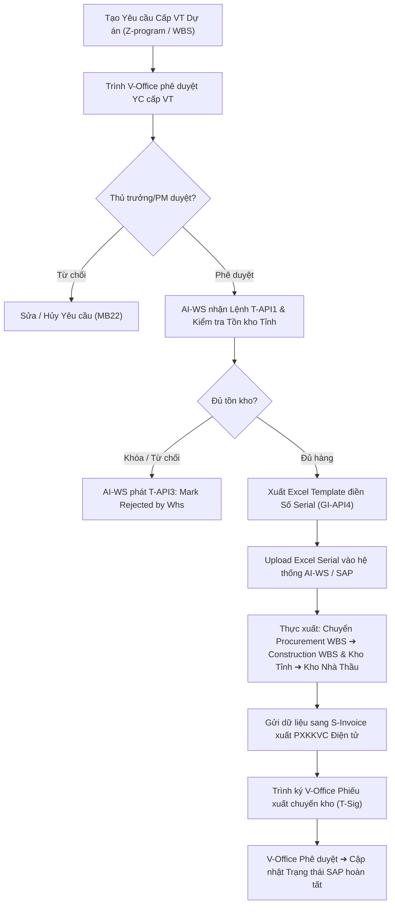
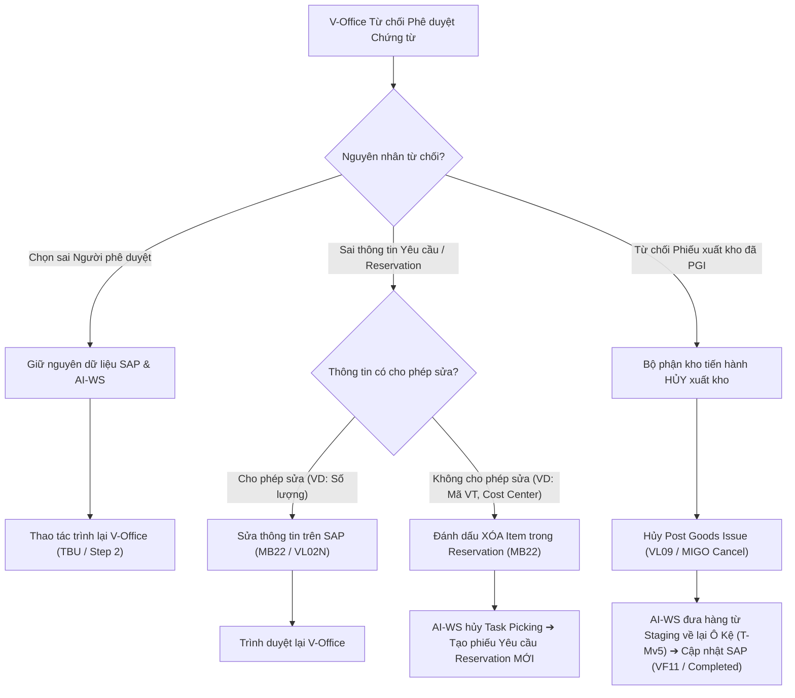
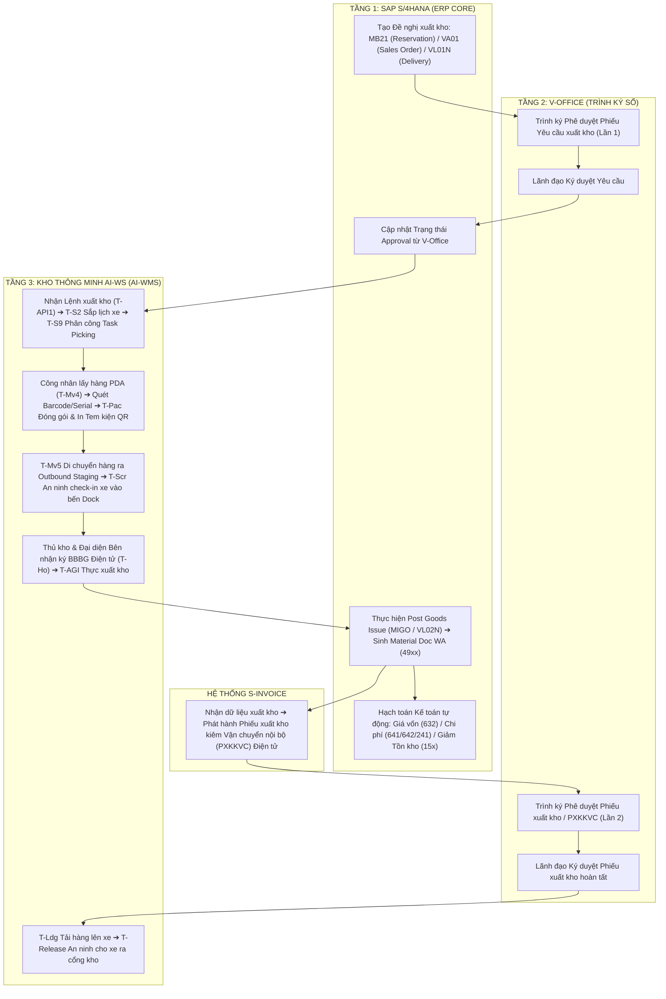

# 📦 TỔNG HỢP QUY TRÌNH XUẤT KHO SAP MM.11 — HỆ THỐNG KHO THÔNG MINH AI-WMS (VIETTEL)

> **Dự án:** Hệ thống Quản lý Kho Thông Minh AI-WMS (Viettel)  
> **Phiên bản:** V1.2 Deep Process Comparison | **Ngày tổng hợp:** 20/08/2026  
> **Hệ thống tham gia:** SAP S/4HANA × V-Office × AI-WS (Kho Thông Minh AI-WMS) × S-Invoice  
> **Nguồn tham chiếu:** Business Blueprint S406 MM.11 (MM.11A → MM.11G), MM.16, SCM-048, Quy trình kho AI-WS 2026 (`sIVN.10.4.2.B1`, `sIVN.10.4.2.B2`)  

---

## 📑 MỤC LỤC

1. [Tổng quan kiến trúc 3 tầng luồng xuất kho](#1-tổng-quan-kiến-trúc-3-tầng-luồng-xuất-kho)
2. [Bảng so sánh chuyên sâu 7 luồng xuất kho (MM.11A — MM.11G)](#2-bảng-so-sánh-chuyên-sâu-7-luồng-xuất-kho-mm11a--mm11g)
   - 2.1. [Ma trận so sánh đa tiêu chí tiêu chuẩn](#21-ma-trận-so-sánh-đa-tiêu-chí-tiêu-chuẩn)
   - 2.2. [So sánh ma trận quy trình 7 giai đoạn End-to-End](#22-so-sánh-ma-trận-quy-trình-7-giai-đoạn-end-to-end)
   - 2.3. [Phân tích điểm khác biệt cốt lõi & đặc thù nghiệp vụ](#23-phân-tích-điểm-khác-biệt-cốt-lõi--đặc-thù-nghiệp-vụ)
3. [Chi tiết vai trò & tác nghiệp của Hệ thống Kho Thông Minh AI-WS trong Luồng Xuất Kho](#3-chi-tiết-vai-trò--tác-nghiệp-của-hệ-thống-kho-thông-minh-ai-ws-trong-luồng-xuất-kho)
4. [Luồng 11A — Xuất kho sử dụng phòng ban (Cost Center)](#4-luồng-11a--xuất-kho-sử-dụng-phòng-ban-cost-center)
5. [Luồng 11B — Xuất kho hình thành tài sản dở dang (AuC / TSCĐ)](#5-luồng-11b--xuất-kho-hình-thành-tài-sản-dở-dang-auc--tscđ)
6. [Luồng 11C — Xuất kho cho dự án (PS - Project System)](#6-luồng-11c--xuất-kho-cho-dự-án-ps---project-system)
7. [Luồng 11D — Xuất kho cho trạm / Vận hành bảo trì (PM)](#7-luồng-11d--xuất-kho-cho-trạm--vận-hành-bảo-trì-pm)
8. [Luồng 11E — Xuất kho trả hàng nhà cung cấp (Return to Supplier)](#8-luồng-11e--xuất-kho-trả-hàng-nhà-cung-cấp-return-to-supplier)
9. [Luồng 11F — Xuất kho bán hàng trên SAP (SD - Outbound Delivery)](#9-luồng-11f--xuất-kho-bán-hàng-trên-sap-sd---outbound-delivery)
10. [Luồng 11G — Xuất kho khác (Z06 / Z07 / Z11)](#10-luồng-11g--xuất-kho-khác-z06--z07--z11)
11. [Quy trình xử lý khi chứng từ từ chối trên V-Office (MM.16)](#11-quy-trình-xử-lý-khi-chứng-từ-từ-chối-trên-v-office-mm16)
12. [Tổng hợp ma trận API tích hợp luồng xuất kho](#12-tổng-hợp-ma-trận-api-tích-hợp-luồng-xuất-kho)
13. [Sơ đồ tổng quát — Luồng xuất kho End-to-End](#13-sơ-đồ-tổng-quát--luồng-xuất-kho-end-to-end)

---

## 1. TỔNG QUAN KIẾN TRÚC 3 TẦNG LUỒNG XUẤT KHO

Toàn bộ 7 luồng xuất kho MM.11 đều vận hành dựa trên sự phối hợp nhịp nhàng giữa **3 tầng hệ thống lõi** và hệ thống phát hành chứng từ vận chuyển điện tử **S-Invoice**:

| Tầng | Hệ thống | Vai trò chính trong Luồng Xuất Kho |
|---|---|---|
| **Tầng 1 — ERP Core** | **SAP S/4HANA** | Phân quyền khởi tạo yêu cầu xuất kho (Reservation `MB21`, Outbound Delivery `VL01N`, Sales Order `VA01`), quản lý mã WBS dự án/đơn PM, hạch toán kế toán giá vốn/chi phí tự động, sinh chứng từ kho chính thức (**Material Document WA - 49xxxxxxxx**). |
| **Tầng 2 — Trình ký số** | **V-Office** | Thực hiện phê duyệt 2 cấp độc lập: (1) Phê duyệt Phiếu yêu cầu xuất kho / Reservation trước khi xuất hàng; (2) Ký số / Phê duyệt Phiếu xuất kho / PXKKVC sau khi thực xuất kho. |
| **Tầng 3 — Kho thông minh** | **AI-WS (AI-WMS)** | Điều phối tác nghiệp vật lý xuất kho tại mặt bằng: Lập danh sách lấy hàng (Picking Task), Gợi ý vị trí lấy hàng, Quét mã Serial/Barcode, Đóng gói (Packing), Xuất template Excel hỗ trợ quét Serial, Ký BBBG điện tử giao nhận hàng, Kiểm soát xe ra cổng (`T-Release`). |
| **Hệ thống vệ tinh** | **S-Invoice** | Tiếp nhận dữ liệu xuất kho từ SAP/AI-WS để tự động cấp mã và phát hành **Phiếu xuất kho kiêm vận chuyển nội bộ (PXKKVC)** điện tử. |

---

## 2. BẢNG SO SÁNH CHUYÊN SÂU 7 LUỒNG XUẤT KHO (MM.11A — MM.11G)

### 2.1. Ma Trận So Sánh Đa Tiêu Chí Tiêu Chuẩn

| Tiêu chí so sánh | **MM.11A** (Sử dụng Phòng ban) | **MM.11B** (Hình thành AuC/TSCĐ) | **MM.11C** (Dự án PS) | **MM.11D** (Trạm viễn thông PM) | **MM.11E** (Trả hàng NCC) | **MM.11F** (Bán hàng SD) | **MM.11G** (Xuất kho khác) |
|---|---|---|---|---|---|---|---|
| **Tên tiếng Anh (SAP Blueprint)** | Goods Issue to Cost Center | Goods Issue to AuC / Asset Process | Goods Issue to Construction Site (PS) | Goods Issue to Site Maintenance (PM) | Goods Issue Return to Supplier | Goods Issue for Sales (SD) | Other Goods Issue (Z06/Z07/Z11) |
| **Phân hệ SAP tích hợp chính** | MM-IM × FI-CO | MM-IM × FI-AA | MM-IM × PS (Project System) | MM-IM × PM (Plant Maintenance) | MM-IM × QM × MM-PUR | MM-IM × SD (Sales & Dist.) | MM-IM × FI-CO × Non-SAP |
| **Tác nhân phát động** | Người dùng Đơn vị / Phòng ban | Bộ phận Kế toán / Dự án | Kỹ thuật viên Hạ tầng Tỉnh | Kỹ thuật viên Bảo trì Trạm | Bộ phận KCS / QA Department | Phòng Kinh doanh / Bán hàng | Người khai báo / Đội xử lý sự cố |
| **Chứng từ khởi tạo & TCode** | Reservation (`MB21`) | Reservation (`MB21`) | YC xuất chuyển WBS (`Z-program`) | PM Work Order / Reservation | Return PO (`ME21N`) / Inspection | Sales Order (`VA01`) ➔ Outbound Delivery (`VL01N`) | Tường trình Non-SAP ➔ Reservation (`MB21`) |
| **Giao dịch thực xuất SAP** | `MIGO` (Movement 201) | `MIGO` (Movement 241) | `Z-program` (Mvt 221 / STO 1-step) | `MIGO` (Movement 261) | `MIGO` (Movement 122 / 161) | `VL02N` (Post Goods Issue - Mvt 601) | `MIGO` (Mvt Z06 / Z07 / Z11) |
| **Phê duyệt V-Office Lần 1** | Phê duyệt Reservation (`TBU`) | Phê duyệt Reservation (`TBU`) | Phê duyệt YC cấp VT WBS (`TBU`) | Phê duyệt YC xuất trạm (`TBU`) | Phê duyệt Return PO (`TBU`) | Không có (Duyệt Sales Order nội bộ) | Phê duyệt Tường trình / Yêu cầu xuất |
| **Phê duyệt V-Office Lần 2** | Phê duyệt Phiếu xuất kho PDF | Phê duyệt Phiếu xuất kho PDF | Phê duyệt Phiếu xuất chuyển WBS | Phê duyệt Phiếu xuất kho PM | Phê duyệt Phiếu xuất trả NCC | Phê duyệt Phiếu xuất kho (bản PDF có chữ ký tay) | Phê duyệt Phiếu xuất kho khác |
| **Loại kho / Trạng thái xuất** | Kho đơn vị (`UU` Stock) | Kho đơn vị (`UU` Stock) | Kho Tỉnh ➔ Kho Nhà thầu (WBS) | Kho đơn vị / Kho Huyện (`UU`) | Kho cách ly (`Blocked Stock` / `QI`) | Kho sản phẩm / Kho thương mại (`UU`) | Kho đơn vị (`UU` / Blocked) |
| **Phương thức quét Serial** | Quét trực tiếp qua PDA | Quét trực tiếp qua PDA | **Upload Excel Template (Z-program)** | Quét trực tiếp qua PDA | Đối soát Serial lô nhập ban đầu | Quét Barcode / Serial thùng | Quét trực tiếp qua PDA |
| **Tác nghiệp xe VC (`T-S2` / `T-Scr`)** | Tùy chọn (Nếu cần chuyển xe) | Tùy chọn (Nếu cần chuyển xe) | **✅ BẮT BUỘC (Giao công trình)** | **✅ BẮT BUỘC (Chuyển trạm)** | **✅ BẮT BUỘC (Trả xe NCC)** | **✅ BẮT BUỘC (Giao khách hàng)** | Tùy chọn |
| **Phát hành PXKKVC (S-Invoice)** | Tùy chọn | Tùy chọn | **✅ BẮT BUỘC** | **✅ BẮT BUỘC** | **✅ BẮT BUỘC** | **✅ BẮT BUỘC (Nếu giao xa)** | Tùy chọn |
| **Hạch toán kế toán tự động** | **Nợ 641/642 / Có 15x** (Chi phí vận hành) | **Nợ 241/211 / Có 15x** (Hình thành AuC/TSCĐ) | **Chuyển chi phí WBS công trình** (Tích lũy WBS) | **Nợ 627/642 / Có 15x** (Chi phí sửa chữa trạm) | **Nợ 3388/331 (GR/IR) / Có 15x** (Giảm công nợ) | **Nợ 632 / Có 155/156** (Giá vốn) & **Nợ 131 / Có 511, 333** (Doanh thu) | Z06: Nợ 632/642; Z07: Nợ 1388 (Bồi thường); Z11: **Không hạch toán** |
| **Cơ chế Hủy / Từ chối (MM.16)** | Sửa Reservation (`MB22`) hoặc Hủy MIGO | Sửa Reservation (`MB22`) hoặc Hủy MIGO | Đánh dấu Z-program Rejected ➔ Tạo lại WBS | Sửa PM Order / Hủy MIGO | Hủy Return PO (`ME22N`) / Hủy MIGO | Hủy PGI (`VL09`) ➔ Hủy Billing (`VF11`) ➔ Edit Delivery (`VL02N`) | Sửa/Hủy Tường trình ➔ Tạo mới Reservation |

---

### 2.2. So Sánh Ma Trận Quy Trình 7 Giai Đoạn End-to-End

Dưới đây là so sánh chi tiết luồng vận hành trải qua **7 Giai đoạn từ Khởi tạo đến Hoàn tất** giữa 7 quy trình:

```mermaid
gantt
    title SO SÁNH TIẾN TRÌNH CÁC GIAI ĐOẠN XUẤT KHO (END-TO-END)
    dateFormat  X
    axisFormat %s
    
    section MM.11A (Cost Center)
    G1: Tạo Reservation MB21          :active, a1, 0, 1
    G2: Trình V-Office Lần 1          :a2, 1, 2
    G3: AI-WS Nhận Lệnh & Picking     :a3, 2, 3
    G4: Đóng gói & Staging            :a4, 3, 4
    G5: Ký BBBG Điện tử & Thực xuất   :a5, 4, 5
    G6: SAP Hạch toán 641/642 & MIGO   :a6, 5, 6
    G7: Trình V-Office Lần 2          :a7, 6, 7

    section MM.11C (Dự án PS)
    G1: Tạo YC WBS (Z-program)        :active, c1, 0, 1
    G2: Trình V-Office Duyệt WBS      :c2, 1, 2
    G3: AI-WS Nhận Lệnh & Lịch Xe VC  :c3, 2, 3
    G4: Upload Excel Serial (Z-prog)  :c4, 3, 4
    G5: An ninh Gate In & Ký BBBG     :c5, 4, 5
    G6: SAP Chuyển WBS & S-Invoice    :c6, 5, 6
    G7: Trình V-Office Lần 2 & GateOut:c7, 6, 7

    section MM.11F (Bán hàng SD)
    G1: Sales Order VA01 ➔ Delivery   :active, f1, 0, 1
    G2: Duyệt Kinh doanh Nội bộ       :f2, 1, 2
    G3: AI-WS Nhận Lệnh & Lịch Xe VC  :f3, 2, 3
    G4: Picking, Packing & In Tem QR  :f4, 3, 4
    G5: Ký BBBG & Post Goods Issue    :f5, 4, 5
    G6: SAP Hạch toán 632 & Billing   :f6, 5, 6
    G7: Trình V-Office PDF & Gate Out :f7, 6, 7
```

#### Ma trận chi tiết các Giai đoạn quy trình:

| Giai đoạn quy trình | **MM.11A / MM.11B** | **MM.11C (Dự án PS)** | **MM.11D (Trạm PM)** | **MM.11E (Trả NCC)** | **MM.11F (Bán hàng SD)** | **MM.11G (Xuất khác)** |
|---|---|---|---|---|---|---|
| **Giai đoạn 1: Khởi tạo Yêu cầu** | Nhập Reservation `MB21` chọn Cost Center / Mã Tài sản. | Tạo Yêu cầu Cấp vật tư `Z-program` gán WBS Element. | Kỹ thuật phát động Lệnh sửa chữa từ PM Work Order. | Mua sắm tạo Return PO `ME21N` dựa trên QM Lot lỗi. | Phòng Kinh doanh lập Sales Order `VA01` ➔ Outbound Delivery `VL01N`. | Khai báo Tường trình sự cố/thiệt hại trên Non-SAP. |
| **Giai đoạn 2: Phê duyệt Lần 1** | Trình Reservation qua V-Office (`TBU`). Lãnh đạo đơn vị duyệt. | Trình Yêu cầu WBS qua V-Office. Ban QLDA / Lãnh đạo chi nhánh duyệt. | Trình Đề nghị xuất trạm qua V-Office. Trưởng quản lý trạm duyệt. | Trình Return PO qua V-Office. Trưởng phòng Mua sắm duyệt. | Phê duyệt nội bộ đơn Sales Order trên phân hệ SD (không qua V-Office). | Ký Tường trình qua V-Office ➔ Nhập số Tờ trình vào SAP `MB21`. |
| **Giai đoạn 3: AI-WS Nhận lệnh & Lập lịch** | AI-WS nhận `T-API1`, kiểm tra tồn kho `T-S1`, giao Picking Task `T-S9`. | AI-WS nhận `T-API1`, tính toán loại xe `T-S2`, điều xe đối tác `T-TSA`. | AI-WS nhận `T-API1`, phát Task Picking ưu tiên khẩn cấp (`Urgent Task`). | AI-WS nhận `T-API1`, xác định lô hàng tại khu cách ly Blocked Stock. | AI-WS nhận `T-API1`, lập lịch xe VC `T-S2` và gán Packing Zone. | AI-WS nhận `T-API1`, kiểm tra mã loại xuất Z06/Z07/Z11. |
| **Giai đoạn 4: Tác nghiệp Vật lý Kho** | Công nhân di chuyển đến ô kệ, quét PDA lấy đúng vật tư `T-Mv4`. | **Xuất Excel Template ➔ Quét & Upload danh sách Serial vào hệ thống**. | Công nhân quét barcode thiết bị thay thế tại ô kệ `T-Mv4`. | Di chuyển hàng lỗi từ Isolation Zone ra Outbound Dock `T-Mv4`. | Pick hàng `T-Mv4`, đóng thùng `T-Pac`, in tem kiện QR Code. | Lấy vật tư hư hỏng/mượn ra bến xuất `T-Mv4`. |
| **Giai đoạn 5: An ninh Gate-In & Ký BBBG** | Tùy chọn xe VC. Đối soát bên nhận & ký BBBG điện tử `T-Ho`. | **Bảo vệ check-in xe `T-Scr`**. Ký BBBG điện tử với Nhà thầu `T-Ho`. | **Bảo vệ check-in xe `T-Scr`**. Ký BBBG với Kỹ thuật trạm `T-Ho`. | **Bảo vệ check-in xe `T-Scr`**. Ký BBBG điện tử với đại diện NCC `T-Ho`. | **Bảo vệ check-in xe `T-Scr`**. Ký BBBG với Khách hàng/Xe VC `T-Ho`. | Đối soát & Ký BBBG điện tử với bên nhận `T-Ho`. |
| **Giai đoạn 6: Hạch toán & Phát hành PXKKVC** | `MIGO` Mvt 201/241. SAP hạch toán Nợ 641/642/241 - Có 15x. | `Z-program` chuyển tồn kho Procurement WBS ➔ Construction WBS. **Phát hành PXKKVC (S-Invoice)**. | `MIGO` Mvt 261. SAP hạch toán Nợ 627/642 - Có 15x. **Phát hành PXKKVC (S-Invoice)**. | `MIGO` Mvt 122/161. SAP hạch toán Nợ 3388/331 - Có 15x. **Phát hành PXKKVC (S-Invoice)**. | `VL02N` Post Goods Issue Mvt 601 (Nợ 632 - Có 155/156) & Billing `VF01` (Nợ 131 - Có 511, 333). **Xuất PXKKVC/Hóa đơn**. | `MIGO` Mvt Z06/Z07/Z11. SAP hạch toán theo quy định OBYC (Z11 không hạch toán). |
| **Giai đoạn 7: Phê duyệt Lần 2 & Gate-Out** | Trình Phiếu xuất kho bản PDF lên V-Office (`T-Sig`) ➔ Hoàn tất. | Trình Phiếu xuất chuyển WBS lên V-Office. **Bảo vệ cho xe ra cổng `T-Release`**. | Trình Phiếu xuất kho PM lên V-Office. **Bảo vệ cho xe ra cổng `T-Release`**. | Trình Phiếu xuất trả NCC lên V-Office. **Bảo vệ cho xe ra cổng `T-Release`**. | Trình Phiếu xuất kho (có bản chụp chữ ký tay) lên V-Office. **Bảo vệ cho xe ra cổng `T-Release`**. | Trình Phiếu xuất kho khác lên V-Office ➔ Hoàn tất. |

---

### 2.3. Phân Tích Điểm Khác Biệt Cốt Lõi & Đặc Thù Nghiệp Vụ

#### 1. MM.11A (Cost Center) vs MM.11B (AuC / Asset):
- **MM.11A (Sử dụng phòng ban)**: Hàng hóa xuất ra được coi là **chi phí tiêu dùng ngay trong kỳ** (hạch toán trực tiếp vào TK Chi phí quản lý/bán hàng `641x/642x`).
- **MM.11B (Hình thành AuC/TSCĐ)**: Hàng hóa xuất ra **không tính vào chi phí ngay**, mà được vốn hóa ghi tăng giá trị Tài sản xây dựng dở dang (`TK 241x`) hoặc Tài sản cố định (`TK 211x`) để thực hiện trích khấu hao phân bổ dần trong nhiều kỳ kế toán (kết nối trực tiếp với phân hệ Kế toán tài sản FI-AA).

#### 2. MM.11C (Dự án PS) — Luồng phức tạp nhất về Tồn kho & Quản lý Serial:
- **Quản lý tồn kho WBS**: Hàng hóa xuất kho không làm mất đi tồn kho toàn tập đoàn ngay lập tức, mà thực hiện **giao dịch chuyển trạng thái 1-step (Movement Type 221)**: Chuyển tồn kho từ *WBS Mua sắm (Procurement WBS)* sang *WBS Công trình (Construction WBS)*, đồng thời ghi chuyển vị trí từ *Kho chi nhánh Tỉnh* sang *Kho Nhà thầu xây lắp*.
- **Cơ chế Excel Template Upload (`GI-API4`)**: Do vật tư công trình có số lượng cực lớn (hàng nghìn số Serial cuộn cáp, thiết bị đầu cuối), AI-WS không bắt công nhân quét từng mã trên PDA tại ô kệ mà hỗ trợ **xuất file Excel mẫu**, cho phép quét/nhập số Serial hàng loạt trên máy tính rồi upload trực tiếp vào hệ thống.

#### 3. MM.11D (Trạm PM) — Luồng Ưu Tiên Khẩn Cấp (Urgent Flow):
- Phục vụ ứng cứu thông tin khi sự cố trạm xảy ra. Task xuất kho trên AI-WS được gán cờ **Urgent Priority**, tự động đẩy lên đầu danh sách Picking của công nhân kho để rút ngắn tối đa thời gian đáp ứng.

#### 4. MM.11E (Trả hàng NCC) — Luồng Kiểm Soát Kho Cách Ly:
- Vật tư xuất trả NCC bắt buộc phải được lấy từ **Kho cách ly (Blocked Stock / Isolation Zone)** — nơi lưu giữ các lô hàng bị KCS từ chối (QM.02/QM.04).
- Giao dịch SAP ghi giảm công nợ hoặc giảm tài khoản trung gian thanh toán **GR/IR (`TK 3388/331`)**, đòi lại tiền hoặc yêu cầu NCC đổi lô hàng mới.

#### 5. MM.11F (Bán hàng SD) — Luồng Thương Mại Đầy Đủ & Hủy Đa Cấp:
- Luồng duy nhất tích hợp đầy đủ chu trình **Order-to-Cash (O2C)** của phân hệ SD: Sales Order (`VA01`) ➔ Outbound Delivery (`VL01N`) ➔ Post Goods Issue (`VL02N` Mvt 601) ➔ Billing Hóa đơn (`VF01`).
- **Cơ chế Hủy đa cấp phức tạp khi bị V-Office từ chối**: Nếu Phiếu xuất kho bán hàng đã PGI bị V-Office từ chối, hệ thống phải thực hiện hủy ngược từ dưới lên: **Hủy Hóa đơn (`VF11`) ➔ Hủy Post Goods Issue (`VL09`) ➔ Sửa Outbound Delivery (`VL02N`) hoặc Chuyển trạng thái Delivery thành Completed**.

#### 6. MM.11G (Xuất kho khác) — Phân Hóa Kịch Bản Đặc Thù:
- **Z06 (Thiên tai/Hỏa hoạn)**: Ghi nhận chi phí bất khả kháng (hạch toán tổn thất).
- **Z07 (Cá nhân bồi thường)**: Kết nối dữ liệu Tường trình từ hệ thống Non-SAP sang SAP, hạch toán Phải thu cá nhân bồi thường (`TK 1388`).
- **Z11 (Trả hàng mượn NCC)**: Nghiệp vụ mượn - trả vật tư, **hoàn toàn không sinh chứng từ hạch toán kế toán**.

---

## 3. CHI TIẾT VAI TRÒ & TÁC NGHIỆP CỦA HỆ THỐNG KHO THÔNG MINH AI-WS TRONG LUỒNG XUẤT KHO

Hệ thống Kho Thông Minh AI-WS đóng vai trò là **trung tâm điều hành mặt bằng kho vật lý (Warehouse Execution Layer)**, số hóa 100% quy trình xuất kho thông qua các thuật toán thông minh, thiết bị cầm tay (PDA/Tablet) và kết nối API thời gian thực.

```mermaid
flowchart TD
    subgraph AIWS_FLOW ["LUỒNG TÁC NGHIỆP XUẤT KHO TRÊN HỆ THỐNG AI-WS"]
        A["1. Tiếp nhận Lệnh xuất từ SAP (T-API1)"] --> B["2. AI-WS Khởi tạo Task & Sắp lịch xe (T-S1, T-S2)"]
        B --> C["3. Phê duyệt vận chuyển & Điều đối tác xe (T-VDA, T-TSA, T-UI)"]
        C --> D["4. Thuật toán gợi ý ô kệ & Phát Task Picking (T-S5, T-S9)"]
        D --> E["5. Công nhân quét PDA/Tablet Lấy hàng tại Ô kệ (T-Mv4)"]
        E --> F["6. Đóng gói, In tem kiện QR & Chuyển Outbound Staging (T-S10, T-Pac, T-Mv5)"]
        F --> G["7. An ninh xác nhận xe vào bến Dock (T-Scr)"]
        G --> H["8. Đối soát & Ký BBBG Điện tử (T-Ho)"]
        H --> I["9. Xác nhận Thực xuất kho (T-AGI) ➔ Gọi T-API3 về SAP"]
        I --> J["10. Đẩy chứng từ ký V-Office (T-Sig) & Xuất PXKKVC (S-Invoice)"]
        J --> K["11. Cho xe ra cổng & Đóng quy trình (T-Ldg, T-Release)"]
    end
```



### 3.1. Tiếp nhận & Phân công Lệnh xuất kho (`T-API1`, `T-S1`)
- **Đồng bộ tự động (`T-API1`)**: Ngay khi Yêu cầu xuất kho (Reservation / Outbound Delivery) được phê duyệt trên V-Office và chuyển sang SAP, SAP phát bản tin **`T-API1`** truyền toàn bộ dữ liệu (Mã đơn, Mã vật tư, Số lượng, Kho xuất, Danh sách Serial quy định, Địa chỉ giao hàng) sang AI-WS.
- **Sinh Task xử lý (`T-S1`)**: AI-WS kiểm tra tính hợp lệ của dữ liệu ($\le 5$s), tự động tạo Lệnh xuất kho trên dashboard của Thủ kho và gán trạng thái `Wait for Picking`.

### 3.2. Sắp lịch xe & Điều phối đối tác vận chuyển (`T-S2`, `T-VDA`, `T-S3`, `T-TSA`, `T-UI`) — *Luồng xuất VC*
- **Tối ưu lịch xe (`T-S2`)**: Thuật toán AI-WS tự động tính toán tổng trọng lượng và thể tích của lô hàng xuất kho để đề xuất chủng loại xe tải phù hợp.
- **Phê duyệt vận chuyển (`T-VDA`)**: Quản lý kho duyệt phương án vận chuyển trên AI-WS App ($\le 1$h).
- **Điều đối tác xe (`T-S3` & `T-TSA`)**: Hệ thống tự động gửi yêu cầu đặt xe sang Đối tác vận chuyển (TSA) và ghi nhận phản hồi chấp thuận ($\le 2$h).
- **Cập nhật thông tin tài xế (`T-UI`)**: Tài xế/Đối tác vận chuyển cập nhật **Biển số xe**, **Họ tên tài xế** và **Số CCCD** lên App AI-WS.

### 3.3. Thuật toán gợi ý vị trí Lấy hàng & Tác nghiệp Picking (`T-S5`, `T-S9`, `T-Mv4`)
- **Gợi ý vị trí lấy hàng tối ưu (`T-S5`)**: AI-WS áp dụng thuật toán đường đi ngắn nhất (Shortest Pick Path) kết hợp nguyên tắc quản lý tồn kho **FIFO (First In First Out)** hoặc **FEFO (First Expired First Out)** để chỉ định chính xác mã Ô Kệ (Bin Location) cần lấy hàng.
- **Phát Task cho công nhân (`T-S9`)**: Hệ thống gửi Picking Task trực tiếp đến máy PDA/Tablet cầm tay của công nhân phụ trách khu vực kệ tương ứng ($\le 10$s).
- **Lấy hàng tại ô kệ (`T-Mv4`)**:
  - Công nhân di chuyển đến ô kệ được chỉ định.
  - Quét mã QR Code trên Ô Kệ để xác nhận đúng vị trí.
  - Quét Barcode/QR Code/Số Serial vật tư để xác nhận đúng mã hàng và đúng số lượng. Nếu sai lệch, PDA sẽ phát cảnh báo rung/chuông ngăn chặn lấy nhầm hàng.

### 3.4. Đóng gói, In tem kiện QR & Chuyển ra Outbound Staging (`T-S10`, `T-Pac`, `T-Mv5`)
- **Tính toán đóng gói (`T-S10`)**: AI-WS gợi ý quy cách đóng thùng/đóng pallet tối ưu cho lô hàng xuất.
- **In tem kiện & Đóng thùng (`T-Pac`)**:
  - Máy in di động tại kho in **Shipping Label / Tem kiện** có mã QR Code định danh duy nhất cho từng kiện hàng/pallet.
  - Công nhân dán tem kiện, đóng gói hoàn thiện và quét xác nhận đóng gói trên PDA ($\le 5$ phút).
- **Di chuyển ra Outbound Staging (`T-Mv5`)**: Xe nâng/Công nhân di chuyển các kiện hàng đã đóng gói ra *Khu vực chờ xuất (Outbound Staging Zone)*.

### 3.5. Kiểm soát An ninh Cổng & Check-in xe (`T-Scr`)
- **Bảo vệ cổng kho check-in (`T-Scr`)**:
  - Xe tải đến lấy hàng tại cổng kho.
  - Bảo vệ kho dùng App AI-WS An ninh đối soát **Biển số xe** và **Số CCCD tài xế** (hoặc quét mã QR Lệnh vận chuyển).
  - Xác nhận xe đủ điều kiện vào bến ➔ Barie tự động mở. AI-WS ghi nhận mốc thời gian xe vào cổng (`T-Scr` $\le 5$ phút).

### 3.6. Kiểm hàng, Ký BBBG Điện tử & Trình ký V-Office (`T-Ho`, `T-AGI`, `T-API3`, `T-Sig`)
- **Đối soát & Ký BBBG Điện tử (`T-Ho`)**:
  - Thủ kho và Tài xế/Bên nhận hàng đối soát số lượng kiện hàng tại cửa xuất (Outbound Dock).
  - Đại diện bên nhận ký **Biên bản bàn giao (BBBG) điện tử** trực tiếp trên màn hình Cảm ứng Tablet/PDA AI-WS ($\le 10$ phút).
- **Thực xuất kho (`T-AGI`)**: Thủ kho bấm nút **Chốt Thực Xuất Kho** trên AI-WS App ($\le 5$ phút).
- **Đồng bộ kết quả về SAP (`T-API3`)**: AI-WS phát bản tin **`T-API3`** gửi toàn bộ dữ liệu xuất thực tế (Mã vật tư, Số lượng thực xuất, Mã Serial, Bản chụp BBBG) sang SAP S/4HANA. SAP tự động sinh **Material Document WA (49xxxxxxxx)** và hạch toán kế toán.
- **Trình ký V-Office từ AI-WS (`T-Sig`)**: AI-WS đính kèm bản PDF Phiếu xuất kho + Chữ ký BBBG điện tử đẩy trực tiếp sang hệ thống V-Office. AI-WS nhận kết quả phê duyệt V-Office và cập nhật đồng thời cho SAP.

### 3.7. Tải hàng lên xe, Xuất PXKKVC & Cho xe ra cổng (`T-Ldg`, `S-Invoice`, `T-Release`)
- **Tải hàng lên xe (`T-Ldg`)**: Đội bốc xếp chất xếp các kiện hàng/pallet lên thùng xe tải theo chỉ dẫn phân tải trọng của AI-WS.
- **Xuất PXKKVC điện tử (`S-Invoice`)**: Hệ thống tự động đẩy dữ liệu sang S-Invoice để phát hành **Phiếu xuất kho kiêm vận chuyển nội bộ điện tử**.
- **Xác nhận xe ra cổng (`T-Release`)**: Xe di chuyển ra cổng. Bảo vệ quét xác nhận xe rời bến trên App AI-WS An ninh ➔ Chốt thời gian kết thúc quy trình xuất kho.

### 3.8. Bảng Thời Gian Chuẩn & Quản Lý KPI AI-WS (`T-S11`, `T-S12`)

AI-WS thiết lập định mức thời gian tác nghiệp tiêu chuẩn nhằm tối ưu hóa năng suất kho:

#### ⏱️ Thời gian chuẩn thao tác vật lý kho (Standard Handling Time):
| Loại hàng hóa | Đơn vị tính | Thời gian chuẩn thao tác |
|---|---|---|
| **Hàng nhẹ (< 50kg)** | Kiện / Thùng | **1 phút / kiện** |
| **Hàng trung bình (50kg — 1 tấn)** | Pallet | **3 phút / pallet** |
| **Hàng nặng (> 1 tấn / Thiết bị viễn thông cồng kềnh)** | Pallet / Cụm thiết bị | **5 — 7 phút / pallet** |

#### 🔔 Cơ chế Cảnh báo & Hủy Task Tự động:
- **Cảnh báo nhắc việc (`T-S11`)**: Khi bất kỳ Task tác nghiệp nào (Picking, Packing, BBBG, V-Office) thực hiện chạm mốc **90% thời gian KPI cho phép**, AI-WS tự động phát tin nhắn cảnh báo (SMS / App Notification) đến Thủ kho và Quản lý kho.
- **Hủy Task khi hết KPI (`T-S12`)**: Quá thời gian KPI quy định mà Task chưa hoàn thành, hệ thống tự động đánh dấu `Timeout`, chuyển cảnh báo mức Đỏ lên Dashboard quản lý để can thiệp kịp thời.

---

## 4. LUỒNG 11A — XUẤT KHO SỬ DỤNG PHÒNG BAN (COST CENTER)

> **Mã quy trình:** MM.11A (Cost_Center_GI)  
> **Mục đích:** Xuất vật tư, công cụ dụng cụ, văn phòng phẩm phục vụ hoạt động nội bộ của các phòng ban.

### 4.1. Các bước thực hiện chi tiết

1. **Khởi tạo Yêu cầu (`MB21`):** Bộ phận có nhu cầu tạo phiếu **Reservation** trên SAP S/4HANA, chọn mã Cost Center (Trung tâm chi phí) và danh mục vật tư.
2. **Trình V-Office lần 1 (`TBU`):** Sử dụng màn hình phát triển `TBU` đẩy yêu cầu Reservation sang V-Office. Thủ trưởng đơn vị phê duyệt.
3. **Tác nghiệp xuất kho trên AI-WS (`T-API1` ➔ `T-AGI`):**
   - AI-WS nhận lệnh `T-API1`, phát Task Picking `T-S9` cho công nhân.
   - Công nhân cầm PDA quét barcode ô kệ và lấy đúng vật tư `T-Mv4`.
   - Đại diện phòng ban ký BBBG điện tử trên Tablet AI-WS `T-Ho`.
   - Thủ kho xác nhận `T-AGI` ➔ AI-WS gọi `T-API3` về SAP S/4HANA (Movement Type 201).
   - SAP ghi giảm tồn kho, tự động sinh chứng từ kế toán: **Nợ TK 641x/642x / Có TK 15x**.
4. **Trình V-Office lần 2 (Phiếu xuất kho):** Đóng gói phiếu xuất bản PDF trình ký V-Office hoàn tất.

---

## 5. LUỒNG 11B — XUẤT KHO HÌNH THÀNH TÀI SẢN DỞ DANG (AuC / TSCĐ)

> **Mã quy trình:** MM.11B (Asset_AuC_GI)  
> **Mục đích:** Xuất máy móc, thiết bị tồn kho có giá trị lớn để hình thành Tài sản cố định (TSCĐ) hoặc Tài sản xây dựng dở dang (AuC) khấu hao phân bổ nhiều kỳ.

### 5.1. Các bước thực hiện chi tiết

1. **Tạo mã Tài sản (FI-AA):** Phân hệ Kế toán tài chính tạo mã AuC/TSCĐ trên SAP.
2. **Tạo Yêu cầu xuất (`MB21`):** Người dùng tạo Reservation tham chiếu Mã tài sản đã tạo.
3. **Phê duyệt V-Office:** Trình duyệt phiếu Reservation qua V-Office.
4. **Thực xuất kho trên AI-WS & SAP (`MIGO` Mvt 241):**
   - AI-WS tiếp nhận lệnh, chỉ định ô kệ lưu trữ máy móc/thiết bị nặng.
   - Công nhân dùng xe nâng di chuyển thiết bị ra khu Outbound Staging (Thời gian chuẩn 5–7 phút/pallet).
   - Ký BBBG điện tử `T-Ho` ➔ SAP sinh chứng từ hạch toán: **Nợ TK 241x (AuC) hoặc 211x (TSCĐ) / Có TK 15x**.
5. **Trình ký Phiếu xuất:** Trình Phiếu xuất kho lên V-Office và lưu vết lịch sử tài sản.

---

## 6. LUỒNG 11C — XUẤT KHO CHO DỰ ÁN (PS - PROJECT SYSTEM)

> **Mã quy trình:** MM.11C (Construction_PS_GI)  
> **Mục đích:** Xuất vật tư, thiết bị viễn thông cho các công trình/dự án đầu tư xây dựng hạ tầng do phân hệ PS quản lý theo mã WBS Element.

### 6.1. Các bước thực hiện chi tiết



1. **Khởi tạo Yêu cầu cấp vật tư:** Nhân viên kỹ thuật hạ tầng tỉnh tạo yêu cầu xuất chuyển kho trên SAP (`Z-program`) gán mã WBS công trình.
2. **Trình V-Office lần 1:** Đẩy phiếu yêu cầu lên V-Office để Lãnh đạo chi nhánh/Ban Quản lý dự án ký duyệt.
3. **Kiểm tra tồn kho Kho Tỉnh trên AI-WS:** Thủ kho tỉnh xác minh tồn kho khả dụng qua Dashboard AI-WS.
4. **Xuất & Upload Excel Serial (GI-API4 / AI-WS):**
   - Hệ thống xuất **Excel Template** chứa danh mục vật tư cần xuất.
   - Nhân viên quét/nhập số Serial của các cuộn cáp, thiết bị vào file Excel và upload lại hệ thống AI-WS.
5. **Thực hiện Xuất kho 2 giao dịch song song (`T-AGI`):**
   - (1) Chuyển tồn kho từ WBS Mua sắm (Procurement WBS) sang WBS Công trình (Construction WBS).
   - (2) Chuyển tồn kho từ Kho chi nhánh Tỉnh sang Kho Nhà thầu xây lắp.
6. **Tích hợp S-Invoice phát hành PXKKVC:** Chuyển dữ liệu sang S-Invoice xuất **Phiếu xuất kho kiêm vận chuyển nội bộ điện tử**.
7. **Trình V-Office lần 2:** Trình ký số Phiếu xuất chuyển kho trên V-Office (`T-Sig`).

---

## 7. LUỒNG 11D — XUẤT KHO CHO TRẠM / VẬN HÀNH BẢO TRÌ (PM)

> **Mã quy trình:** MM.11D (Maintenance_PM_GI)  
> **Mục đích:** Xuất vật tư, linh kiện thay thế phục vụ ứng cứu thông tin, bảo dưỡng, sửa chữa trạm viễn thông managed bởi phân hệ PM (Plant Maintenance).

### 7.1. Các bước thực hiện chi tiết

1. **Phát động Yêu cầu từ PM Work Order:** Kỹ thuật viên bảo trì tạo Lệnh sửa chữa (Work Order) trên PM, hệ thống tự động sinh nhu cầu vật tư.
2. **Trình duyệt Yêu cầu:** Trình phiếu đề nghị xuất vật tư trạm qua V-Office.
3. **Thực xuất kho trên AI-WS & SAP (`MIGO` Mvt 261):**
   - AI-WS phát Task Picking khẩn cấp cho công nhân kho.
   - Công nhân quét serial thiết bị, đóng gói `T-Pac` và giao cho kỹ thuật viên ứng cứu `T-Ho`.
   - Hạch toán: **Nợ TK 627x/642x (Chi phí vận hành trạm) / Có TK 15x**.
4. **Phát hành PXKKVC điện tử:** Phát hành chứng từ vận chuyển qua S-Invoice và trình ký V-Office.

---

## 8. LUỒNG 11E — XUẤT KHO TRẢ HÀNG NHÀ CUNG CẤP (RETURN TO SUPPLIER)

> **Mã quy trình:** MM.11E (Return_Supplier_GI)  
> **Mục đích:** Xuất trả/đổi hàng cho nhà cung cấp do hàng không đúng quy cách, lỗi chất lượng phát hiện ở khâu KCS đầu vào (QM.02) hoặc trong quá trình lưu kho (QM.04).

### 8.1. Các bước thực hiện chi tiết

1. **Xác định Lô hàng lỗi (QM):** Bộ phận KCS ghi nhận lô hàng không đạt chất lượng (Quality Inspection Lot Rejected).
2. **Tạo Đơn hàng trả (Return PO - `ME21N`):**
   - Bộ phận Mua sắm tạo Đơn mua hàng trả (Return Purchase Order) trên SAP.
   - Đẩy Return PO lên V-Office để Thủ trưởng đơn vị phê duyệt.
3. **Tác nghiệp Xuất trả hàng trên AI-WS (`T-AGI` Mvt 122 / 161):**
   - AI-WS định vị lô hàng nằm tại khu vực *Blocked Stock / Isolation Zone*.
   - Xe nâng di chuyển lô hàng hỏng ra bến xuất `T-Mv4`. Đại diện NCC kiểm đếm và ký BBBG điện tử `T-Ho`.
   - Hệ thống tự động ghi giảm công nợ/tồn kho trên SAP: **Nợ TK 3388/331 (GR/IR) / Có TK 15x**.
4. **Phát hành chứng từ xuất trả:** Tích hợp S-Invoice xuất PXKKVC điện tử giao hàng lại cho NCC.

---

## 9. LUỒNG 11F — XUẤT KHO BÁN HÀNG TRÊN SAP (SD - OUTBOUND DELIVERY)

> **Mã quy trình:** MM.11F (Sales_Order_GI)  
> **Mục đích:** Xuất kho hàng hóa, sản phẩm bán lẻ/bán sỉ thương mại trên hệ thống SAP (áp dụng cho các đơn vị kinh doanh như VHT, VTX,...).

### 9.1. Các bước thực hiện chi tiết

1. **Tạo Đơn bán hàng (Sales Order - `VA01`):** Phòng Kinh doanh lập Sales Order trên phân hệ SD.
2. **Tạo Lệnh xuất hàng (Outbound Delivery - `VL01N` / `VL10`):** Tạo Lệnh xuất kho tham chiếu Sales Order, đẩy sang AI-WS (`T-API1`).
3. **Tác nghiệp Lấy hàng & Đóng gói (AI-WS Picking & Packing):**
   - AI-WS tiếp nhận Lệnh xuất kho, phân công Picking Task cho công nhân kho.
   - Công nhân quét Barcode/Serial vật tư tại ô kệ, chuyển về khu vực đóng gói (Packing Zone).
   - In tem kiện QR Code và dán lên thùng hàng `T-Pac`.
4. **Thực xuất kho (Post Goods Issue - `VL02N`):**
   - Ký BBBG điện tử với người mua / đối tác VC `T-Ho`.
   - Thực hiện Post Goods Issue (Movement Type 601).
   - SAP tự động hạch toán Giá vốn hàng bán: **Nợ TK 632x / Có TK 155x, 156x**.
5. **Xuất Hóa đơn bán hàng (Billing - `VF01`):**
   - Phân hệ Tài chính tạo Hóa đơn Billing: **Nợ TK 131x / Có TK 511x, 333x**.
6. **Trình ký V-Office Phiếu xuất kho:** AI-WS đính kèm file PDF Phiếu xuất kho (có chữ ký người nhận) trình duyệt lên V-Office (`T-Sig`).

---

## 10. LUỒNG 11G — XUẤT KHO KHÁC (Z06 / Z07 / Z11)

> **Mã quy trình:** MM.11G (Other_Goods_Issue)  
> **Mục đích:** Xử lý các nghiệp vụ xuất kho đặc thù ngoài bán hàng, dự án hoặc trả nhà cung cấp.

### 10.1. Các kịch bản xuất kho khác

1. **Xuất thiệt hại do thiên tai / hỏa hoạn (Movement Type Z06):**
   - AI-WS hỗ trợ xuất kiểm đếm vật tư hư hỏng toàn bộ. SAP hạch toán chi phí bất khả kháng theo cấu hình OBYC.
2. **Xuất thiệt hại do cá nhân làm mất/hỏng (Movement Type Z07):**
   - Lập Tường trình khai báo trên Non-SAP $\rightarrow$ Ký V-Office $\rightarrow$ Ban hành quyết định xử lý bồi thường $\rightarrow$ Nhập số Tờ trình vào SAP tạo Reservation `MB21` $\rightarrow$ AI-WS thực xuất `T-AGI` Z07.
3. **Xuất trả hàng đi mượn của NCC (Movement Type Z11):**
   - AI-WS hỗ trợ lấy đúng lô vật tư đã mượn tạm của nhà cung cấp trước đó để xuất trả. **Không phát sinh chứng từ hạch toán kế toán**.

---

## 11. QUY TRÌNH XỬ LÝ KHI CHỨNG TỪ TỪ CHỐI TRÊN V-OFFICE (MM.16)

Trong tất cả các luồng xuất kho, nếu chứng từ (Reservation / Outbound Delivery / Phiếu xuất kho) bị từ chối trên V-Office, quy trình chuẩn **MM.16** sẽ được áp dụng:



---

## 12. TỔNG HỢP MA TRẬN API TÍCH HỢP LUỒNG XUẤT KHO

| Tên API / Interface | Hệ thống Nguồn ➔ Đích | Nội dung bản tin đồng bộ | Thời điểm kích hoạt |
|---|---|---|---|
| **GI-API1 / T-API1** | SAP ➔ AI-WS | Đồng bộ thông tin Phiếu yêu cầu xuất kho (Mã kho, WBS/Cost Center, Mã VT, Số lượng, Danh sách Serial quy định). | Khi Reservation/Outbound Delivery được duyệt trên V-Office. |
| **T-S1 / T-S2 / T-S9** | AI-WS (Internal) | Khởi tạo Lệnh xuất, tính toán lịch xe, tạo Picking Task & phân công đến thiết bị PDA của công nhân kho. | Tự động trong AI-WS khi nhận `T-API1` ($\le 5 - 10$s). |
| **GI-API3 / T-API2** | AI-WS ➔ SAP | Báo trạng thái Kho từ chối xuất (Do thiếu hàng, hỏng hàng, không đúng thông số). SAP cập nhật `Rejected by Whs`. | Khi Thủ kho bấm từ chối xuất trên App Kho AI-WS. |
| **GI-API4 (Serial Upload)** | Client ➔ AI-WS / SAP | Upload danh sách số Serial đã quét/kiểm đếm từ Excel Template vào Lệnh xuất kho. | Tại bước chuẩn bị hàng luồng 11C (Dự án PS). |
| **GI-API5 / T-API3** | AI-WS ➔ SAP | Truyền dữ liệu kết quả xuất thực tế (Mã VT, Số lượng thực xuất, Serial, BBBG điện tử) để SAP sinh chứng từ kho WA (49xx). | Sau khi chốt thực xuất kho `T-AGI` trên AI-WS. |
| **GI-API6 (S-Invoice)** | SAP ➔ S-Invoice | Truyền dữ liệu xuất kho để S-Invoice cấp mã và phát hành Phiếu xuất kho kiêm vận chuyển nội bộ (PXKKVC) điện tử. | Ngay sau khi sinh Material Document trên SAP. |
| **GI-API7 / T-Sig** | V-Office ➔ AI-WS ➔ SAP | Trả kết quả ký duyệt Phiếu xuất kho / PXKKVC từ V-Office về AI-WS và SAP để chốt sổ chứng từ. | Khi Thủ trưởng phê duyệt xong trên V-Office. |

---

## 13. SƠ ĐỒ TỔNG QUÁT — LUỒNG XUẤT KHO END-TO-END



---
*File tổng quan quy trình xuất kho SAP MM.11 & Kho thông minh AI-WS được lưu trữ tại `knowledge/processes/SAP_MM11_All_GI_Processes_Consolidated.md`.*
