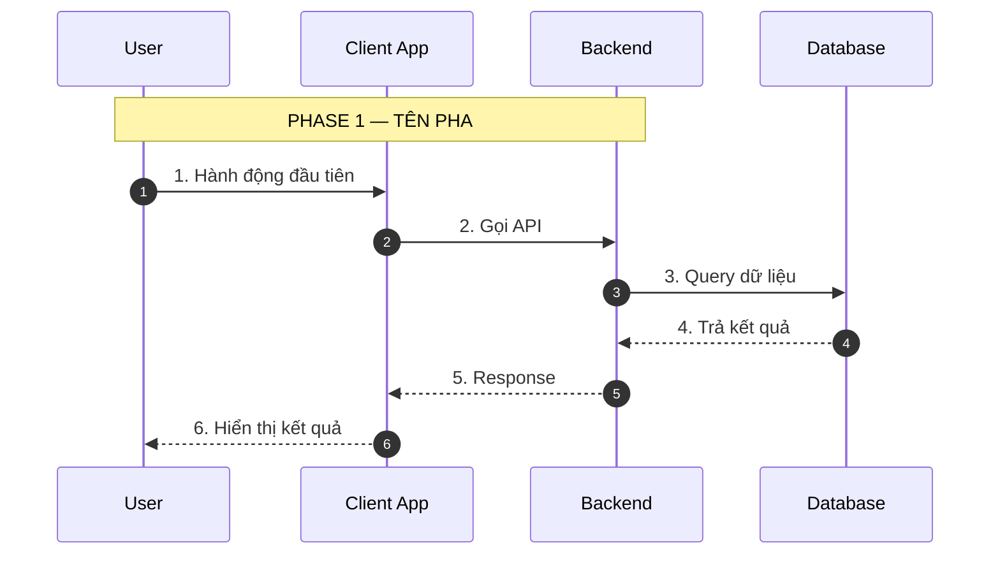

---
name: create-sequence-diagram
description: |
  Tạo Mermaid Sequence Diagram từ mô tả luồng chức năng — happy path, có đánh số
  bước, phân pha rõ ràng. Output file .mermaid sẵn sàng nhúng vào tài liệu.
  Dùng khi user nói "vẽ sequence diagram", "vẽ sơ đồ tuần tự", "vẽ luồng API",
  "vẽ tương tác FE-BE", "vẽ sequence cho chức năng".
  KHÔNG dùng cho: activity diagram (dùng skill: create-activity-diagram),
  ERD, state diagram, use case (dùng skill: create-uml).
---

# Goal

Sinh file Sequence Diagram theo cú pháp Mermaid từ mô tả luồng chức năng,
tập trung happy path, có đánh số bước và phân pha — giảm từ 15-30 phút viết
tay xuống 1-2 phút.

# Instructions

## Bước 1: Thu thập input

Đọc mô tả luồng chức năng user cung cấp (text, Use Case, BRD, Feature Spec).
Xác định:

- **Tên chức năng** (dùng đặt tên file output)
- **Danh sách actors/participants** theo thứ tự tương tác
- **Danh sách bước** tương tác theo thứ tự thời gian
- **Các pha** của luồng (ví dụ: Xác thực, Xử lý, Phản hồi)

Nếu thiếu thông tin → hỏi bổ sung ngắn gọn, tối đa 2-3 câu hỏi.

## Bước 2: Thiết kế diagram

### Thứ tự participants mặc định

```
User → Client App → Backend → Database → External System
```

Chỉ liệt kê participants thực sự xuất hiện trong luồng. Đặt alias ngắn gọn nếu tên dài.

### Phân pha

Dùng `Note over [participant(s)]: PHASE NAME` (ALL CAPS) để đánh dấu ranh giới pha.
Mỗi luồng phải có ít nhất 1 pha. Ví dụ:

```
Note over User,Backend: BƯỚC 1 — XÁC THỰC
Note over Backend,DB: BƯỚC 2 — XỬ LÝ
Note over User,Backend: BƯỚC 3 — KẾT QUẢ
```

### Đánh số bước

- Đánh số liên tục từ 1, không bỏ số
- Format message: `1. [Mô tả hành động]`
- Ví dụ: `User->>App: 1. Nhập thông tin đăng nhập`

### Quy tắc message

| Loại | Ký hiệu | Dùng cho |
|------|---------|---------|
| Request / gửi | `->>` | Gọi API, gửi dữ liệu, trigger hành động |
| Response / nhận | `-->>` | Trả kết quả, phản hồi |
| Xử lý nội bộ | `A->>A:` | Logic trong 1 participant |

- Độ dài message tối đa 60 ký tự
- Dùng thuật ngữ nghiệp vụ tiếng Việt (hoặc theo ngôn ngữ user yêu cầu)
- Mỗi request phải có response tương ứng (trừ fire-and-forget)

### Template cơ bản



## Bước 3: Xuất kết quả

- In diagram trực tiếp trong chat để user xem preview ngay
- Hỏi user: "Lưu vào file không?" → nếu có: xuất file `.mermaid`, tên gợi ý `sequence_[tên-chức-năng-kebab].mermaid`

# Constraints

- 🚫 KHÔNG vẽ error flow, exception, hay negative case — chỉ happy path
- 🚫 KHÔNG dùng `alt/else` block — nếu có rẽ nhánh, hỏi user chọn 1 luồng chính
- 🚫 KHÔNG vẽ retry logic, timeout, fallback
- 🚫 KHÔNG để message > 60 ký tự
- ✅ LUÔN đánh số bước liên tục, không bỏ số
- ✅ LUÔN có ít nhất 1 `Note over` phân pha
- ✅ LUÔN dùng `autonumber` hoặc đánh số thủ công — chọn 1, không dùng cả 2
- ✅ Mọi request `->>` phải có response `-->>` tương ứng (trừ khi explicitly là fire-and-forget)
- ⚠️ Nếu luồng > 20 bước → đề xuất user tách thành 2 diagram theo pha