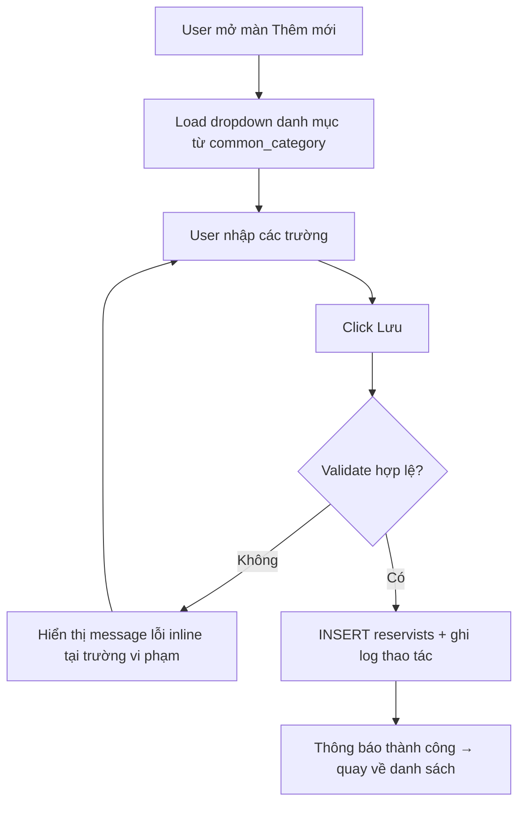

# Ví dụ Phần 3 đã điền — tham khảo định dạng & mật độ

Hai chức năng mẫu (chắt lọc từ dự án thật, hệ Dự bị động viên) minh hoạ cách điền 4 mục con cho hai dạng màn hình phổ biến: **danh sách** và **form nhập liệu**. Bám đúng mật độ này — mỗi ô Mô tả phải có mapping + validate khi áp dụng.

> Tên bảng/trường dưới đây là minh hoạ. Khi làm thật, lấy tên đúng từ BM.03; thiếu → `[Cần BM.03 xác nhận]`.

---

## 3.1.1. [CN_01] Xem danh sách công dân nam

### 3.1.1.1. Thông tin chung

| Mục | Nội dung |
|---|---|
| **Tên chức năng** | Xem danh sách công dân nam [CN_01] |
| **Mục tiêu** | Cho phép cán bộ quân lực tra cứu, rà soát danh sách công dân nam trong độ tuổi sẵn sàng nhập ngũ/dự bị động viên để quản lý nguồn nhân lực quốc phòng. |
| **Tác nhân** | Cán bộ quân lực cấp đơn vị, Cán bộ cấp Trung đoàn, Quản trị viên hệ thống. |
| **Điều kiện kích hoạt** | Cán bộ đăng nhập vào hệ thống và chọn menu Quản lý công dân trong độ tuổi phục vụ. |
| **Điều kiện đầu vào** | Tài khoản có quyền truy cập chức năng; CSDL đã đồng bộ thông tin công dân và cơ cấu đơn vị (`force_structure`). |
| **Điều kiện đầu ra** | Hiển thị danh sách công dân kèm các chức năng lọc, tìm kiếm, xuất file; ghi nhận audit log tra cứu. |
| **Mô tả** | Cho phép tra cứu, tìm kiếm danh sách công dân nam trong độ tuổi phục vụ ngạch dự bị theo phạm vi đơn vị quản lý. |
| **Đường dẫn** | Đăng nhập → Dự bị động viên → Quản lý công dân trong độ tuổi phục vụ → Quản lý công dân nam |
| **Phân quyền & miền dữ liệu** | • **Miền dữ liệu:** User thuộc đơn vị nào chỉ thấy và thao tác công dân thuộc đơn vị đó và các đơn vị trực thuộc (theo cây đơn vị `force_structure`).<br>• **Xem:** Cán bộ quân lực cấp đơn vị, Cán bộ cấp Trung đoàn trở lên.<br>• **Thêm:** N/A (chức năng xem danh sách).<br>• **Import:** N/A.<br>• **Sửa:** N/A.<br>• **Xóa:** N/A.<br>• **Tìm kiếm:** Toàn bộ user có quyền Xem được tìm kiếm theo họ tên, số CCCD.<br>• **Xuất:** Cán bộ cấp Trung đoàn trở lên (xuất danh sách ra file Excel). |

### 3.1.1.2. Màn hình
`[CẦN BỔ SUNG: link Figma frame "DS công dân nam"]`

### 3.1.1.3. Mô tả chi tiết các thành phần

| STT | Tên | Kiểu [Độ dài] | Input/Output | Giá trị khởi tạo | Mô tả (Mapping CSDL) |
|-----|-----|---------------|--------------|------------------|----------------------|
| 1 | Tiêu đề màn hình | Label | Output | "Danh sách công dân nam" | Tĩnh |
| 2 | Breadcrumb | Label | Output | N/A | Dự bị động viên / Quản lý công dân nam |
| 3 | Ô tìm kiếm | Textbox [255] | Input | NULL | Placeholder "Nhập họ tên / số CCCD". So khớp Like, trim 2 đầu, không phân biệt hoa/thường; tìm theo `reservists.full_name`, `reservists.citizen_number` |
| 4 | Cột Họ tên | Label | Output | N/A | `reservists.full_name` |
| 5 | Cột Số CCCD | Label | Output | N/A | `reservists.citizen_number` |
| 6 | Cột Trạng thái | Label | Output | N/A | `reservists.status`: `1 → Đang quản lý`, `2 → Đã chuyển`, `3 → Loại ngạch` |
| 7 | Phân trang | Component | Input/Output | 20 dòng/trang | Tham chiếu Common `[TCCT_TKCT]` — Phân trang |
| 8 | Button Thêm mới | Button | Input | N/A | Click → mở màn Thêm mới hồ sơ (tham chiếu chức năng CN_03). Chỉ hiện khi user có quyền Thêm |
| 9 | Button Nhập Excel | Button | Input | N/A | Click → popup nhập file (tham chiếu chức năng Import) |

### 3.1.1.4. Luồng nghiệp vụ

```mermaid
flowchart TD
    A[User truy cập menu] --> B[Hệ thống load danh sách theo miền dữ liệu]
    B --> C{Có bản ghi?}
    C -->|Có| D[Hiển thị danh sách + phân trang]
    C -->|Không| E[Hiển thị "Không có dữ liệu"]
    D --> F[User nhập từ khóa tìm kiếm]
    F --> B
```

| Bước | Tác nhân | Hành động | Kết quả / Phản ứng hệ thống |
|------|----------|-----------|------------------------------|
| 1 | User | Truy cập menu Quản lý công dân nam | Truy vấn `reservists` lọc theo đơn vị user (`force_structure`), `is_deleted = 0`, sắp xếp `created_at` giảm dần |
| 2 | Hệ thống | Trả kết quả | TH1: có bản ghi → hiển thị danh sách + phân trang 20/trang. TH2: không có → hiển thị "Không có dữ liệu" |
| 3 | User | Nhập từ khóa, Enter | Lọc Like theo họ tên / CCCD, vẫn giữ điều kiện miền dữ liệu |

---

## 3.1.3. [CN_03] Thêm mới hồ sơ công dân nam

### 3.1.3.1. Thông tin chung

| Mục | Nội dung |
|---|---|
| **Tên chức năng** | Thêm mới hồ sơ công dân nam [CN_03] |
| **Mục tiêu** | Ghi nhận hồ sơ công dân nam mới đủ tuổi hoặc chuyển đến địa bàn vào diện quản lý dự bị động viên của đơn vị. |
| **Tác nhân** | Cán bộ quân lực cấp đơn vị. |
| **Điều kiện kích hoạt** | Cán bộ bấm button "Thêm mới" từ màn hình Danh sách công dân nam [CN_01]. |
| **Điều kiện đầu vào** | Đã hoàn thành tải danh mục dùng chung (Dân tộc, Quốc tịch, Tôn giáo); có thông tin cá nhân/CCCD của công dân. |
| **Điều kiện đầu ra** | Bản ghi công dân được lưu vào CSDL (`reservists`) gắn với đơn vị của user; thông báo thành công và chuyển hướng về danh sách. Nếu trùng CCCD hoặc lỗi validate thì báo lỗi inline tại form. |
| **Mô tả** | Cho phép thêm mới hồ sơ công dân nam trong độ tuổi phục vụ (đủ 18–45 tuổi). |
| **Đường dẫn** | Đăng nhập → Dự bị động viên → Quản lý công dân trong độ tuổi phục vụ → Quản lý công dân nam → Button "+ Thêm mới" |
| **Phân quyền & miền dữ liệu** | • **Miền dữ liệu:** Bản ghi tạo mới tự động gắn với mã đơn vị của user đang đăng nhập (`force_structure`).<br>• **Xem:** N/A (form thêm mới).<br>• **Thêm:** Cán bộ quân lực cấp đơn vị (được tạo mới hồ sơ).<br>• **Import:** N/A.<br>• **Sửa:** N/A.<br>• **Xóa:** N/A.<br>• **Tìm kiếm:** N/A.<br>• **Xuất:** N/A. |

### 3.1.3.2. Màn hình
`[CẦN BỔ SUNG: link Figma frame "Thêm mới hồ sơ"]`

### 3.1.3.3. Mô tả chi tiết các thành phần (trích các kiểu tiêu biểu)

| STT | Tên | Kiểu [Độ dài] | Input/Output | Giá trị khởi tạo | Mô tả (Mapping CSDL) |
|-----|-----|---------------|--------------|------------------|----------------------|
| 1 | Thông tin chung | Label | N/A | Mở (expand) | Nhãn nhóm trường, mặc định mở |
| 2 | Họ tên khai sinh | Textbox [255] | Input | NULL | Bắt buộc. Lưu `reservists.full_name` |
| 3 | Ngày sinh | Datepicker | Input | NULL | Bắt buộc, `dd/mm/yyyy`. Validate đủ 18 tuổi & < ngày hiện tại; lỗi: "Công dân phải đủ 18 tuổi". Lưu `reservists.birth_date` |
| 4 | Số CCCD | Textbox [12] | Input | NULL | Bắt buộc, đúng 12 chữ số; lỗi: "Số CCCD phải có đúng 12 chữ số". Check trùng với bản ghi `is_deleted = 0`; lỗi: "Số CCCD đã tồn tại". Lưu `reservists.citizen_number` |
| 5 | Dân tộc | Dropdown | Input | NULL | Bắt buộc. Nguồn `common_category` với `category_code like 'ETHNIC%'`, sắp theo `name`. Lưu `reservists.ethnic_code` |
| 6 | Quốc tịch | Dropdown | Input | "Việt Nam" | Bắt buộc. Nguồn `common_category` `category_code like 'NATIONALITY%'`. Lưu `reservists.nationality_code` |
| 7 | Chiều cao | Textbox số [6] | Input | NULL | Bắt buộc, số thập phân (≤3 số phần nguyên, 2 số thập phân, ≤ 999,99). Lưu `reservists.height` |
| 8 | Button Lưu | Button | Input | N/A | Enable khi mọi trường bắt buộc hợp lệ. Click → validate toàn form → INSERT `reservists` (gắn đơn vị user, `is_deleted = 0`) + ghi log thao tác. Thành công → thông báo + quay danh sách |
| 9 | Button Hủy | Button | Input | N/A | Đóng màn, không lưu |

### 3.1.3.4. Luồng nghiệp vụ



| Bước | Tác nhân | Hành động | Kết quả / Phản ứng hệ thống |
|------|----------|-----------|------------------------------|
| 1 | Hệ thống | onLoad | Load dropdown Dân tộc / Tôn giáo / Quốc tịch… từ `common_category` theo `category_code` |
| 2 | User | Nhập trường, click Lưu | Hệ thống validate toàn form |
| 3 | Hệ thống | Validate | TH1: lỗi → message inline tại trường vi phạm, dừng. TH2: hợp lệ → sang bước 4 |
| 4 | Hệ thống | Ghi dữ liệu | INSERT `reservists` (đơn vị user, `is_deleted = 0`) + ghi log thao tác; thông báo thành công, quay danh sách |