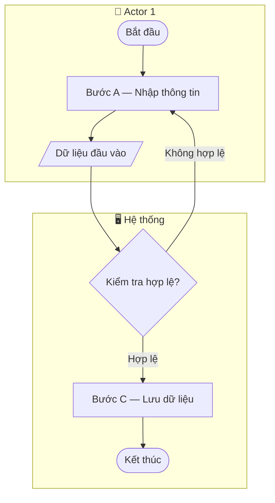
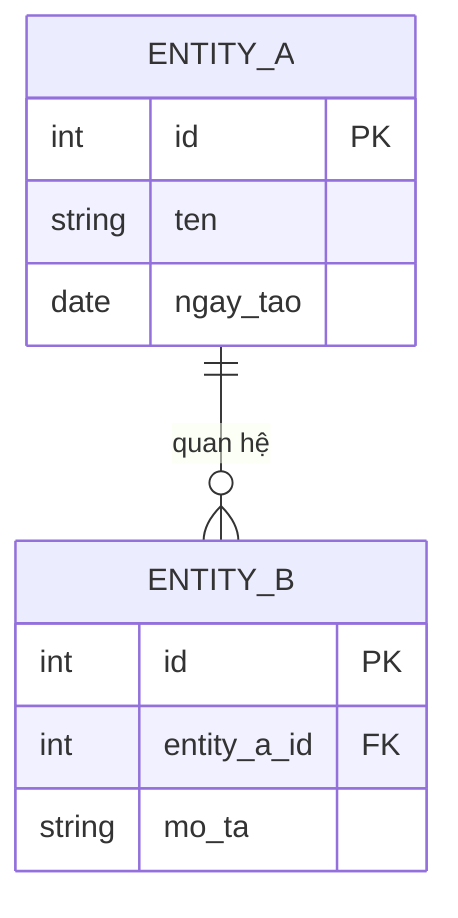
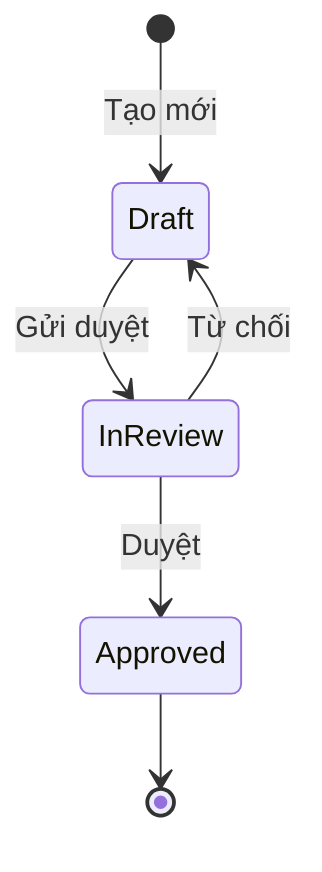
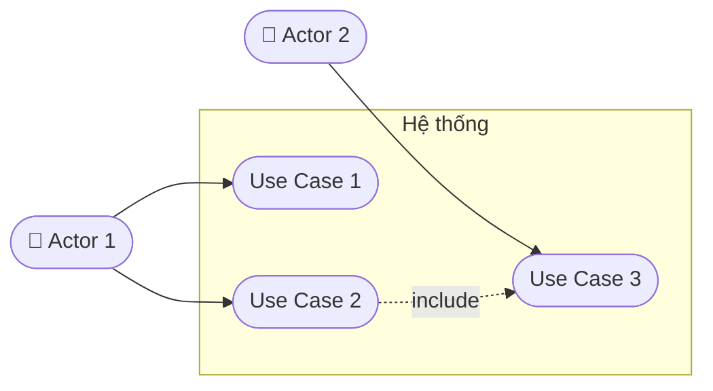

---
name: create-uml
description: |
  Vẽ sơ đồ UML bằng Mermaid — Flowchart/Swimlane, ER diagram, State diagram,
  Use Case diagram. Dùng khi cần nhúng diagram trực tiếp vào PTYC/TKCT/Feature Spec.
  KHÔNG dùng cho: activity/flowchart chất lượng cao (dùng skill: create-activity-diagram),
  sequence diagram (dùng skill: create-sequence-diagram).
---

Tạo sơ đồ UML bằng Mermaid syntax, nhúng trực tiếp vào tài liệu `.md`.

Hỏi người dùng:
1. Loại sơ đồ cần vẽ?
   - **Flowchart / Swimlane** — luồng quy trình nghiệp vụ, phân làn theo actor (PTYC Section 3.1 & 3.2)
   - **ER Diagram** — quan hệ giữa các entity (data model)
   - **State** — trạng thái của đối tượng và điều kiện chuyển đổi
   - **Use Case** — actors và các use case của hệ thống
2. Tên quy trình / entity / đối tượng / hệ thống cần vẽ?
3. Mô tả nội dung cần vẽ — paste nghiệp vụ, use case, danh sách entity, hoặc tài liệu liên quan vào đây.
4. Nhúng vào tài liệu nào (PTYC / TKCT / Feature Spec) hay lưu riêng?

> **Cần file diagram chỉnh sửa được, màu sắc, legend?** → Dùng `skill: create-activity-diagram` (draw.io)
> **Cần Sequence Diagram?** → Dùng `skill: create-sequence-diagram` (Mermaid, phân pha, đánh số bước)

---

## Flowchart / Swimlane

Dùng cho: luồng quy trình nghiệp vụ (PTYC Section 3.1), biểu đồ luồng xử lý chức năng (Section 3.2). Dùng `subgraph` để tạo làn (swimlane) phân theo actor.

Ký hiệu chuẩn PTYC:

| Mermaid shape | Ý nghĩa |
|--------------|---------|
| `([Tên])` | Bắt đầu / Kết thúc (bầu dục) |
| `[Tên]` | Hoạt động / nhiệm vụ (chữ nhật) |
| `{Tên}` | Quyết định Có/Không (hình thoi) |
| `[/Tên/]` | Đầu vào / đầu ra dữ liệu (chữ nhật nghiêng) |

**Validate 10 tiêu chí PTYC trước khi output** (áp dụng khi vẽ quy trình Section 3.1):
1. Chỉ có duy nhất 1 `([Bắt đầu])`
2. Có ít nhất 1 `([Kết thúc])`
3. Bước đầu tiên sau Start là A, B, hoặc S
4. Bước cuối trước End là A, C, hoặc D
5. Mọi `{Decision}` có ≥ 2 nhánh ra
6. Mọi nút đều đến được từ Start
7. Mọi nút đều có đường đến End
8. Số bước từ 4–10 (không kể Start/End)
9. Tên bước: Động từ + Danh từ (hành động người dùng)
10. Không dùng từ "tự động" hoặc "hệ thống tự động" làm chủ ngữ bước

---

## ER Diagram

Dùng cho: data model, quan hệ giữa các entity nghiệp vụ.

---

## State Diagram

Dùng cho: vòng đời trạng thái của đối tượng (đơn hàng, yêu cầu, tài liệu...).

---

## Use Case Diagram

Dùng cho: tổng quan actors và use cases của hệ thống.

---

## Xuất kết quả

- **Nhúng vào tài liệu:** In trực tiếp trong chat dạng code block Mermaid — copy paste vào section tương ứng.
- **Lưu riêng:** Hỏi user "Lưu vào file không?" → xuất file `.md`, tên gợi ý `diagram_[type]_[tên-kebab].md`.