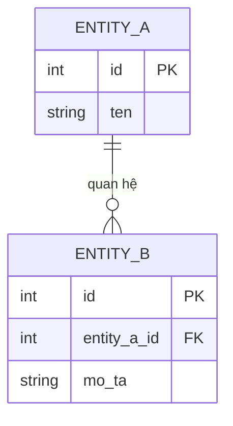

Định nghĩa Logical Data Model.

Hỏi người dùng:
1. Những đối tượng nghiệp vụ chính cần lưu trữ là gì? (ví dụ: User, Order, Product)
2. Mỗi đối tượng cần lưu những thông tin gì?
3. Quan hệ giữa các đối tượng: một-một, một-nhiều, nhiều-nhiều?
4. Dữ liệu nào là lookup/reference (ít thay đổi) vs transactional (thay đổi thường xuyên)?
5. Data retention: lưu bao lâu, xóa/archive khi nào?
6. Có BRD, Feature Spec, hoặc business rules liên quan không? Nếu có, paste vào đây.

Nếu người dùng cung cấp tài liệu đính kèm, đọc và rút trích entities, constraints trước khi hỏi thêm.

Tạo Logical Data Model theo template sau:

---

# Logical Data Model — [Tên hệ thống / tính năng]

**Version:** 1.0
**Ngày:** dd/mm/yyyy

## Entities

### [Tên Entity]

**Mô tả nghiệp vụ:** [Entity này đại diện cho gì]

| Attribute | Kiểu | Bắt buộc | Mô tả | Ví dụ |
|-----------|------|---------|-------|-------|
| id | UUID/INT | Có | Primary key | |
| [tên field] | String/Number/Date/Bool | | | |

**Business Rules áp dụng:** BR-XXX

---

## Relationships

| Từ Entity | Quan hệ | Đến Entity | Mô tả |
|-----------|---------|-----------|-------|
| User | 1 — N | Order | Một user có nhiều orders |

## ER Diagram

Dùng Mermaid erDiagram — nhúng trực tiếp vào tài liệu:

Nếu cần file diagram chỉnh sửa được dùng `skill: create-uml`.

## Data Constraints

| Constraint | Entity | Attribute | Rule |
|-----------|--------|-----------|------|
| Unique | | | |
| Not Null | | | |
| Foreign Key | | | |
| Check | | | |

## Data Retention Policy

| Entity | Giữ bao lâu | Archive / Delete | Điều kiện |
|--------|------------|-----------------|-----------|
| | | | |

---

Hỏi user: "Lưu vào file không?" → nếu có: xuất file, tên gợi ý `data-model_[tên].md`.

## Bước tiếp theo

| Output | Skill sử dụng | Ghi chú |
|--------|--------------|---------|
| Thiết kế schema DB vật lý | skill: create-tkcssdl | Data model là input cho BM.03 |
| Đặc tả API request/response | skill: define-api-contract | Dùng entities từ data model |
| ER diagram chỉnh sửa được | skill: create-uml | Từ phần Relationships |